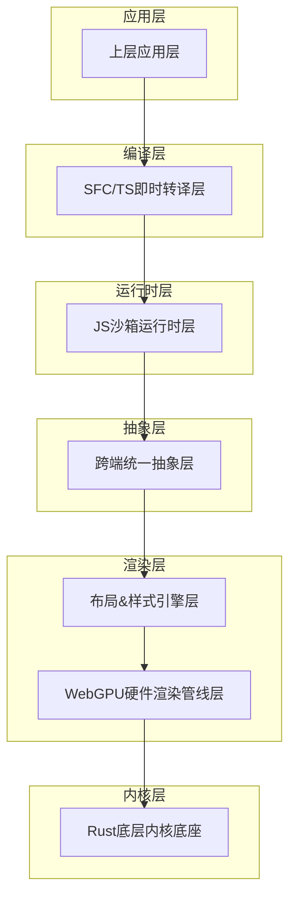
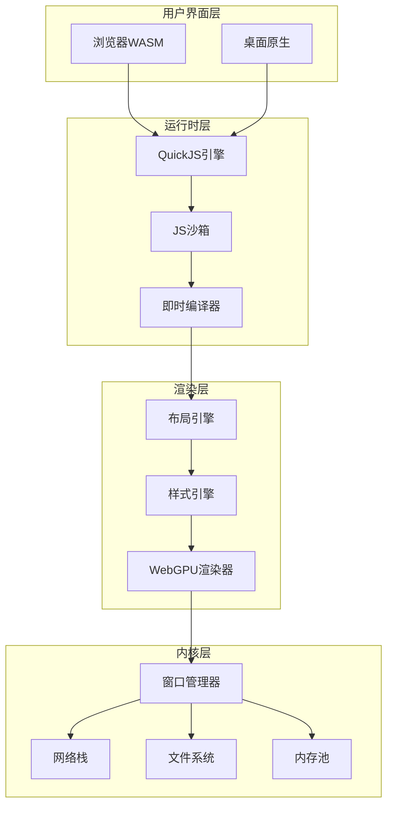
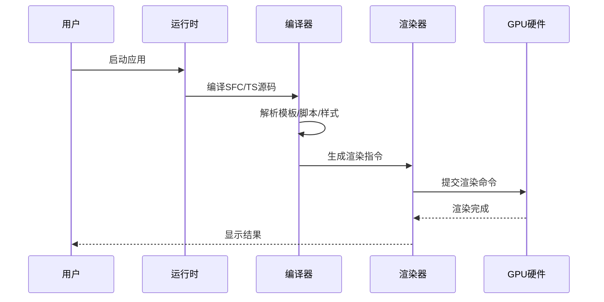

# API参考手册

<cite>
**本文档引用的文件**
- [doc.txt](file://doc.txt)
- [todo.txt](file://todo.txt)
</cite>

## 目录
1. [简介](#简介)
2. [项目结构](#项目结构)
3. [核心组件](#核心组件)
4. [架构概览](#架构概览)
5. [详细组件分析](#详细组件分析)
6. [配置参考](#配置参考)
7. [性能考虑](#性能考虑)
8. [故障排除指南](#故障排除指南)
9. [结论](#结论)

## 简介

Leivue Runtime是一个革命性的前端运行时引擎，专为Rust + WebGPU技术栈设计。该项目的核心目标是消除前端工程化复杂性，突破浏览器沙箱限制，为Vue生态系统提供高性能的跨端底座。

### 核心特性

- **零编译运行**：直接执行Vue3 + TypeScript源码，无需构建过程
- **跨端统一**：同时支持浏览器Wasm模式和桌面原生模式
- **硬件级渲染**：基于WebGPU的GPU加速渲染管道
- **生态兼容**：完全兼容Element Plus、Ant Design Vue等主流UI库
- **安全隔离**：基于QuickJS的JS沙箱运行时

## 项目结构

Leivue Runtime采用七层分层架构设计，每层都有明确的职责分离：

**图表来源**
- [doc.txt:7-22](file://doc.txt#L7-L22)

### 层次架构详解

**第1层：底层内核底座**
- 语言：纯Rust编写，无GC、内存安全、高性能
- 基础能力：跨端窗口管理、异步调度、内存池、文件IO、原生网络栈、缓存系统
- 跨端适配：桌面winit原生窗口 + Vulkan/Metal/DX12；浏览器Wasm编译 + WebGPU API绑定

**第2层：WebGPU硬件渲染层**
- 完全抛弃浏览器DOM渲染流水线，全自研GPU渲染
- 基于标准WebGPU规范，统一桌面/浏览器渲染接口
- 能力：批渲染、矢量绘制、圆角/阴影/渐变、纹理图集、字体渲染、图层合成

**第3层：布局&样式引擎层**
- 复刻标准浏览器CSS体系，对标Chromium基础能力
- HTML解析：html5ever工业级解析，生成标准DOM节点树
- CSS引擎：cssparser解析、选择器匹配、样式继承、权重计算
- 布局系统：自研盒模型、Flex、流式布局，对标W3C标准

**第4层：跨端统一抽象层**
- 统一事件系统：鼠标、键盘、滚动、点击命中检测
- 统一BOM/DOM模拟API：轻量实现window/document/Event
- 作用：无缝兼容Element Plus等UI库所需的浏览器环境API

**第5层：JS沙箱运行时层**
- JS引擎：QuickJS（轻量高性能、Wasm友好、Rust深度绑定）
- 沙箱隔离：与宿主环境完全隔离，安全隔离脚本
- 内置运行时：预加载Vue3完整运行时（runtime-core/runtime-dom）

**第6层：即时转译层**
- TypeScript即时转译：基于Rust swc，内存内实时TS→JS，支持泛型/装饰器/TSX
- Vue SFC即时编译：官方Rust库解析.vue，自动拆分template/script-setup/style
- Template实时编译为Vue渲染函数
- Script自动TS转译
- Style自动解析并入全局样式系统

**第7层：应用层**
- 直接运行：.vue/.ts/.tsx原始源码
- 生态兼容：完整支持Element Plus、Ant Design Vue、Naive UI等Vue3生态库

**章节来源**
- [doc.txt:23-64](file://doc.txt#L23-L64)

## 核心组件

### 运行时API

#### 应用启动API
- **功能**：初始化Leivue Runtime并启动Vue应用
- **参数**：
  - `entry`: 应用入口文件路径（.vue/.ts/.tsx）
  - `options`: 运行时配置对象
- **返回值**：Promise<RuntimeInstance>
- **使用示例**：`await leivue.start('src/main.vue', { mode: 'development' })`

#### 配置管理API
- **功能**：动态修改运行时配置
- **参数**：`config: RuntimeConfig`
- **返回值**：Promise<void>
- **使用示例**：`await leivue.setConfig({ debug: true })`

#### 热更新API
- **功能**：触发源码热更新机制
- **参数**：`filePath: string`
- **返回值**：Promise<void>
- **使用示例**：`await leivue.reload('src/components/Button.vue')`

### 渲染API

#### GPU渲染控制API
- **功能**：控制WebGPU渲染管线
- **参数**：
  - `command`: 渲染命令类型
  - `payload`: 命令数据
- **返回值**：Promise<RenderResult>
- **使用示例**：`await leivue.render({ type: 'clear', color: '#ffffff' })`

#### 布局计算API
- **功能**：执行CSS布局计算
- **参数**：`elementId: string`
- **返回值**：Promise<LayoutBox>
- **使用示例**：`const box = await leivue.layout('container')`

#### 样式应用API
- **功能**：应用CSS样式到元素
- **参数**：
  - `elementId: string`
  - `styles: CSSProperties`
- **返回值**：Promise<void>
- **使用示例**：`await leivue.applyStyles('button', { backgroundColor: '#007bff' })`

### 工具API

#### 编译器API
- **功能**：执行即时编译转换
- **参数**：`sourceCode: string`
- **返回值**：Promise<CompiledResult>
- **使用示例**：`const result = await leivue.compile('TypeScript代码')`

#### 沙箱执行API
- **功能**：在JS沙箱中执行代码
- **参数**：
  - `code: string`
  - `context: ExecutionContext`
- **返回值**：Promise<any>
- **使用示例**：`const result = await leivue.execute('console.log("Hello")')`

#### 缓存管理API
- **功能**：管理运行时缓存
- **参数**：
  - `operation: 'get'|'set'|'clear'`
  - `key?: string`
- **返回值**：Promise<any>
- **使用示例**：`await leivue.cache('set', 'config', data)`

**章节来源**
- [doc.txt:65-97](file://doc.txt#L65-L97)

## 架构概览

**图表来源**
- [doc.txt:46-51](file://doc.txt#L46-L51)

### 数据流处理

**图表来源**
- [doc.txt:51-60](file://doc.txt#L51-L60)

## 详细组件分析

### 运行时内核组件

#### 窗口管理系统
- **职责**：管理跨端窗口生命周期
- **接口方法**：
  - `createWindow(options)`: 创建新窗口
  - `destroyWindow(windowId)`: 销毁指定窗口
  - `resizeWindow(windowId, size)`: 调整窗口大小
- **配置参数**：
  - `width/height`: 窗口尺寸
  - `title`: 窗口标题
  - `resizable`: 是否可调整大小

#### 内存池管理器
- **职责**：高效管理内存分配和回收
- **核心功能**：
  - 对象池模式减少GC压力
  - 分代内存管理
  - 内存泄漏检测
- **使用场景**：频繁创建销毁的对象（如DOM节点、样式对象）

#### 异步调度器
- **职责**：协调多任务异步执行
- **调度策略**：
  - 优先级队列
  - 时间片轮转
  - 任务依赖管理
- **应用场景**：渲染任务、网络请求、文件操作

### 渲染子系统

#### WebGPU渲染管线
- **阶段划分**：
  1. 顶点着色阶段
  2. 几何着色阶段
  3. 片段着色阶段
  4. 合成输出阶段
- **支持特性**：
  - 批量渲染优化
  - 着色器程序动态编译
  - 多通道渲染
  - 深度测试和模板测试

#### 布局引擎
- **CSS支持**：
  - 盒模型计算
  - Flexbox布局
  - Grid布局
  - 响应式设计
- **性能优化**：
  - 布局缓存
  - 变更批量处理
  - 懒加载计算

#### 样式系统
- **样式解析**：
  - CSS选择器匹配
  - 优先级计算
  - 继承规则
- **样式应用**：
  - 动画过渡
  - 变换矩阵
  - 滤镜效果

### 编译器组件

#### TypeScript即时编译器
- **编译流程**：
  1. 词法分析
  2. 语法分析
  3. 类型检查
  4. 代码生成
- **支持特性**：
  - 泛型支持
  - 装饰器语法
  - JSX/TSX
  - 模块系统

#### Vue SFC编译器
- **文件解析**：
  - 模板部分提取
  - 脚本部分处理
  - 样式部分解析
- **输出格式**：
  - 渲染函数生成
  - 组件描述符
  - 样式映射表

### 沙箱运行时

#### QuickJS集成
- **引擎特性**：
  - 轻量级实现
  - 高性能执行
  - Wasm友好
- **安全机制**：
  - 原型链隔离
  - 全局对象限制
  - 内存使用限制

#### 模块系统
- **ESM支持**：
  - 动态导入
  - 循环依赖检测
  - 相对路径解析
- **第三方库兼容**：
  - Vue生态库
  - UI组件库
  - 工具库

**章节来源**
- [doc.txt:23-51](file://doc.txt#L23-L51)

## 配置参考

### 运行时配置

#### 基础配置项
| 配置项 | 类型 | 默认值 | 描述 |
|--------|------|--------|------|
| `mode` | string | 'production' | 运行模式：development/production |
| `debug` | boolean | false | 是否启用调试模式 |
| `logLevel` | string | 'info' | 日志级别：error/warn/info/debug |
| `cacheEnabled` | boolean | true | 是否启用缓存 |

#### 渲染配置
| 配置项 | 类型 | 默认值 | 描述 |
|--------|------|--------|------|
| `antialiasing` | boolean | true | 是否启用抗锯齿 |
| `vsync` | boolean | true | 是否启用垂直同步 |
| `maxFPS` | number | 60 | 最大帧率限制 |
| `pixelRatio` | number | 1.0 | 像素密度比 |

#### 网络配置
| 配置项 | 类型 | 默认值 | 描述 |
|--------|------|--------|------|
| `timeout` | number | 30000 | 请求超时时间(ms) |
| `proxy` | string | null | 代理服务器地址 |
| `corsEnabled` | boolean | true | 是否启用跨域 |

#### 文件系统配置
| 配置项 | 类型 | 默认值 | 描述 |
|--------|------|--------|------|
| `cacheDir` | string | './cache' | 缓存目录路径 |
| `tempDir` | string | './tmp' | 临时文件目录 |
| `maxCacheSize` | number | 104857600 | 最大缓存大小(字节) |

### 构建配置

#### 编译选项
| 选项 | 类型 | 默认值 | 描述 |
|------|------|--------|------|
| `target` | string | 'web' | 目标平台：web/desktop |
| `bundle` | boolean | false | 是否打包 |
| `minify` | boolean | true | 是否压缩 |
| `sourceMap` | boolean | false | 是否生成source map |

#### 优化选项
| 选项 | 类型 | 默认值 | 描述 |
|------|------|--------|------|
| `parallel` | boolean | true | 是否并行编译 |
| `incremental` | boolean | true | 是否增量编译 |
| `treeShaking` | boolean | true | 是否进行摇树优化 |

### 环境变量

#### 运行时环境变量
| 变量名 | 类型 | 默认值 | 描述 |
|--------|------|--------|------|
| `LEIVUE_MODE` | string | 'production' | 应用模式 |
| `LEIVUE_DEBUG` | boolean | false | 调试开关 |
| `LEIVUE_PORT` | number | 3000 | 服务端口 |
| `LEIVUE_HOST` | string | 'localhost' | 主机地址 |

#### 开发环境变量
| 变量名 | 类型 | 默认值 | 描述 |
|--------|------|--------|------|
| `LEIVUE_DEV_SERVER` | boolean | false | 开发服务器开关 |
| `LEIVUE_HOT_RELOAD` | boolean | true | 热重载开关 |
| `LEIVUE_LIVE_RELOAD` | boolean | true | 实时重载开关 |

#### 性能相关环境变量
| 变量名 | 类型 | 默认值 | 描述 |
|--------|------|--------|------|
| `LEIVUE_MAX_WORKERS` | number | 4 | 最大工作进程数 |
| `LEIVUE_MEMORY_LIMIT` | number | 512 | 内存限制(MB) |
| `LEIVUE_TIMEOUT` | number | 30000 | 超时时间(ms) |

**章节来源**
- [doc.txt:65-97](file://doc.txt#L65-L97)

## 性能考虑

### 渲染性能优化

#### GPU渲染优化
- **批处理策略**：合并相似渲染状态，减少状态切换
- **纹理管理**：使用纹理图集减少纹理绑定次数
- **几何优化**：使用instanced rendering处理重复几何体
- **深度测试**：合理使用深度缓冲区避免过度绘制

#### 内存管理
- **对象池**：复用频繁创建销毁的对象
- **垃圾回收**：最小化GC停顿时间
- **内存映射**：使用WebGPU的buffer mapping优化数据传输

### 编译性能优化

#### 即时编译优化
- **缓存机制**：缓存编译结果避免重复编译
- **增量编译**：只重新编译受影响的模块
- **并行处理**：利用多核CPU并行编译
- **内存优化**：限制编译过程中的内存使用

### 网络性能优化

#### 请求优化
- **连接复用**：使用HTTP/2多路复用
- **请求合并**：合并多个小请求
- **缓存策略**：智能缓存策略减少网络请求
- **压缩传输**：启用Gzip/Brotli压缩

## 故障排除指南

### 常见问题诊断

#### 渲染问题
- **症状**：页面空白或渲染异常
- **排查步骤**：
  1. 检查WebGPU支持情况
  2. 验证着色器编译错误
  3. 确认渲染状态设置
  4. 检查纹理资源加载

#### 编译问题
- **症状**：源码无法编译或编译错误
- **排查步骤**：
  1. 检查TypeScript语法
  2. 验证Vue SFC格式
  3. 确认模块导入路径
  4. 查看编译器日志

#### 运行时问题
- **症状**：应用崩溃或性能异常
- **排查步骤**：
  1. 检查内存使用情况
  2. 验证沙箱隔离设置
  3. 确认网络连接状态
  4. 查看错误堆栈信息

### 性能监控

#### 关键指标
- **帧率(FPS)**：目标60fps稳定运行
- **内存使用**：监控内存泄漏和峰值使用
- **CPU使用率**：优化渲染和编译负载
- **网络延迟**：监控请求响应时间

#### 调优建议
- **渲染调优**：减少重绘区域，优化着色器性能
- **内存调优**：合理使用对象池，定期清理缓存
- **编译调优**：启用增量编译，优化模块依赖
- **网络调优**：使用连接池，实施请求缓存

## 结论

Leivue Runtime代表了前端运行时技术的重大突破，通过Rust + WebGPU的组合实现了前所未有的性能和兼容性。其七层分层架构设计确保了系统的可维护性和扩展性，而零编译运行能力则彻底改变了前端开发的工作流程。

### 技术优势总结

1. **性能卓越**：基于WebGPU的硬件加速渲染，性能远超传统DOM方案
2. **生态兼容**：完全兼容Vue生态系统，无缝对接主流UI库
3. **开发体验**：零配置、零编译、毫秒级热更新
4. **跨端统一**：浏览器和桌面原生共享同一套内核
5. **安全可靠**：JS沙箱隔离，防止恶意代码执行

### 发展前景

随着WebGPU标准的不断完善和Rust生态的持续发展，Leivue Runtime有望成为下一代前端应用开发的标准工具链，为开发者提供更加高效、安全、可靠的开发体验。