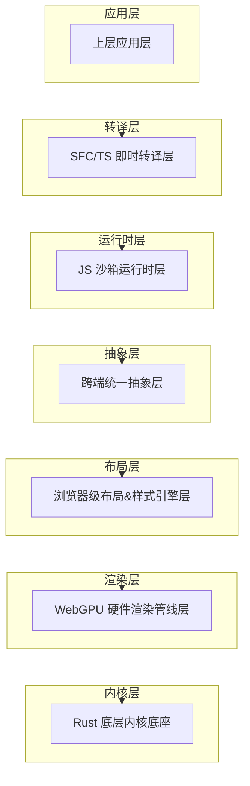
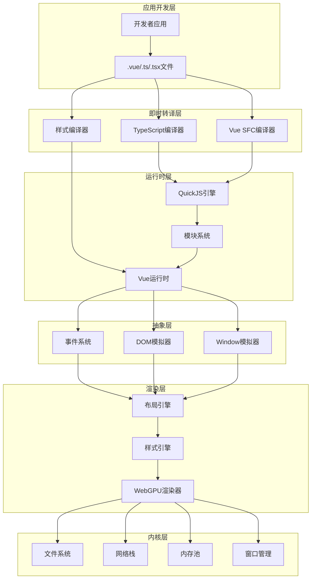
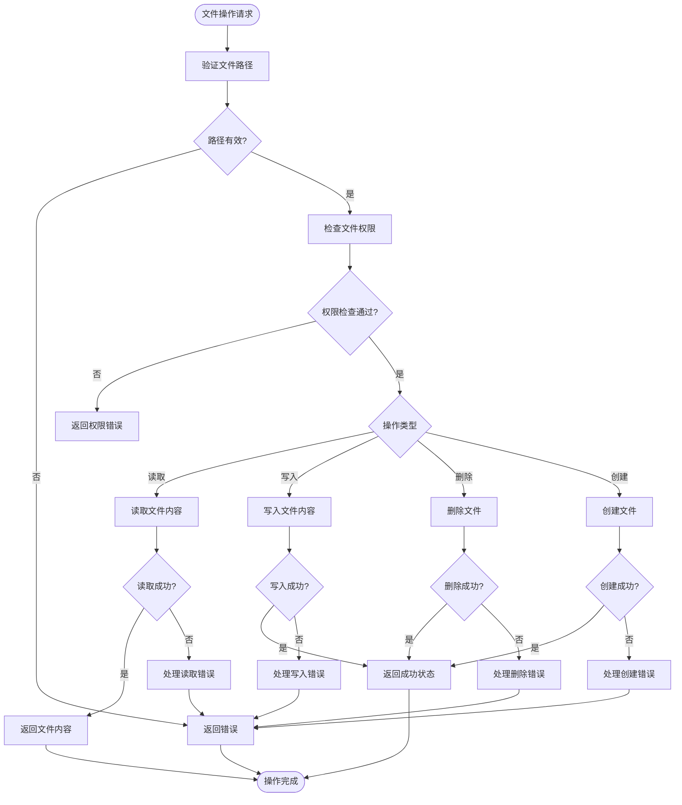
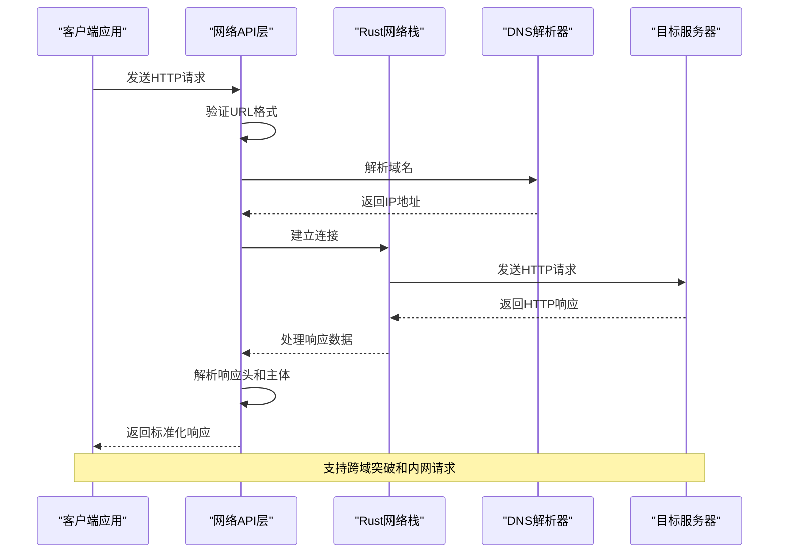
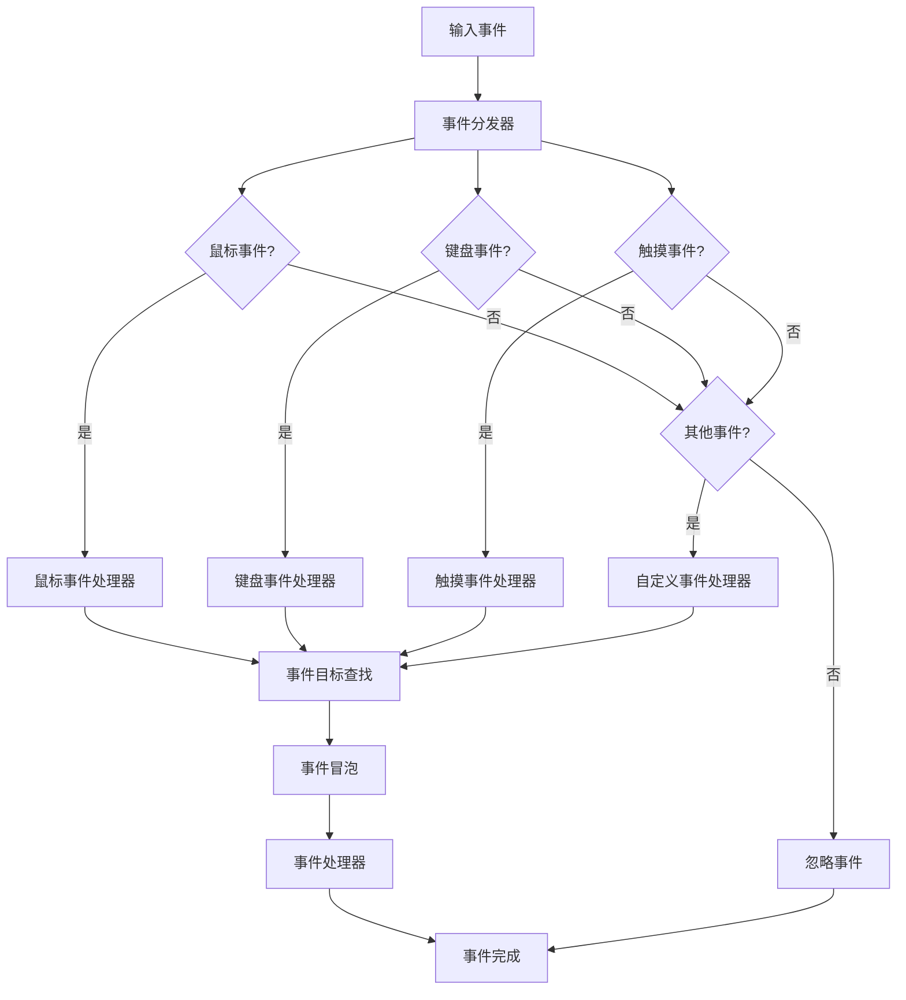
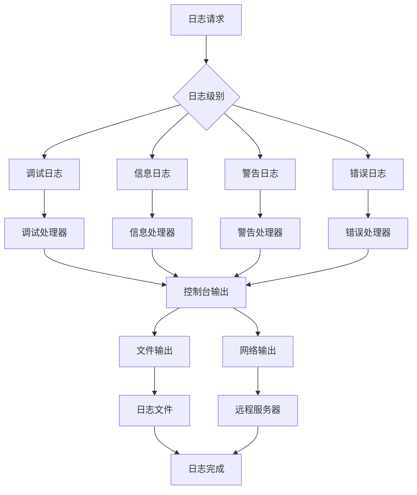
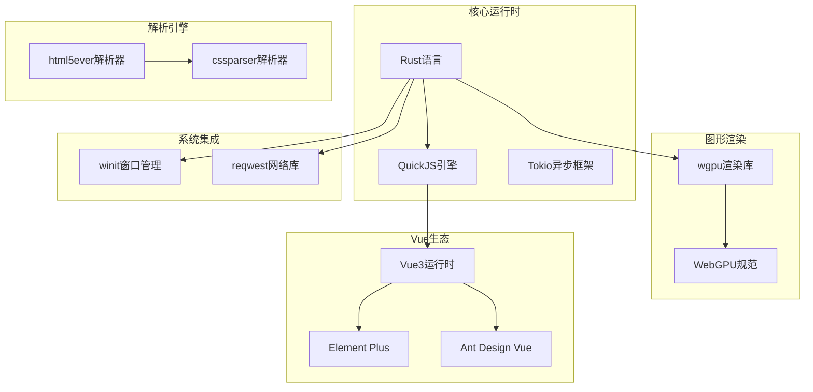

# 工具API

<cite>
**本文档引用的文件**
- [doc.txt](file://doc.txt)
- [todo.txt](file://todo.txt)
</cite>

## 目录
1. [简介](#简介)
2. [项目结构](#项目结构)
3. [核心组件](#核心组件)
4. [架构概览](#架构概览)
5. [详细组件分析](#详细组件分析)
6. [依赖分析](#依赖分析)
7. [性能考虑](#性能考虑)
8. [故障排除指南](#故障排除指南)
9. [结论](#结论)
10. [附录](#附录)

## 简介

Leivue Runtime是一个基于Rust和WebGPU的下一代无构建前端运行时引擎。该项目的核心目标是提供一套完全脱离传统Node.js、浏览器DOM和编译打包的原生双端运行解决方案，支持零编译直接执行Vue3 + TypeScript，并完全兼容Element Plus、Ant Design Vue等第三方UI库。

该运行时引擎采用七层分层架构设计，通过自研的即时转译层、跨端抽象层、布局样式引擎等核心组件，为开发者提供高性能、跨平台的应用运行环境。

## 项目结构

根据项目文档，Leivue Runtime采用清晰的七层分层架构，每层都有明确的职责和边界：

**图表来源**
- [doc.txt:7-22](file://doc.txt#L7-L22)

**章节来源**
- [doc.txt:7-22](file://doc.txt#L7-L22)

## 核心组件

### 底层内核底座（Rust 核心基座）

作为整个系统的基础设施，底层内核底座提供了以下核心能力：

- **跨端窗口管理**：支持桌面原生窗口和浏览器WASM模式
- **异步调度**：基于Tokio的高性能异步任务调度
- **内存池**：高效的内存管理和分配策略
- **文件IO**：跨平台文件系统操作接口
- **原生网络栈**：支持HTTP/HTTPS请求和WebSocket连接
- **缓存系统**：智能缓存机制，支持离线运行

**章节来源**
- [doc.txt:23-29](file://doc.txt#L23-L29)

### WebGPU 硬件渲染层

完全替代传统的DOM渲染流水线，采用全自研GPU渲染方案：

- **硬件加速渲染**：基于标准WebGPU规范，统一桌面和浏览器渲染接口
- **高级图形能力**：批渲染、矢量绘制、圆角/阴影/渐变、纹理图集、字体渲染、图层合成
- **性能优势**：60fps稳定渲染、大列表/复杂组件无卡顿、CPU开销极低

**章节来源**
- [doc.txt:30-34](file://doc.txt#L30-L34)

### 布局 & 样式引擎层

提供迷你浏览器内核能力，复刻标准浏览器CSS体系：

- **HTML解析**：基于html5ever工业级解析，生成标准DOM节点树
- **CSS引擎**：cssparser解析、选择器匹配、样式继承、权重计算
- **布局系统**：自研盒模型、Flex、流式布局，对标W3C标准
- **样式挂载**：支持全局样式、Scoped样式、第三方UI库CSS全局注入

**章节来源**
- [doc.txt:35-41](file://doc.txt#L35-L41)

### 跨端统一抽象层

抹平双端差异，提供统一的API接口：

- **统一事件系统**：鼠标、键盘、滚动、点击命中检测
- **BOM/DOM模拟API**：轻量实现window/document/Event
- **兼容性保证**：无缝兼容Element Plus等UI库所需的浏览器环境API
- **渲染分离**：无真实DOM，仅做逻辑模拟，实际绘制全部走WebGPU

**章节来源**
- [doc.txt:41-45](file://doc.txt#L41-L45)

### JS 沙箱运行时层

提供独立隔离的执行环境：

- **JS引擎**：QuickJS（轻量高性能、Wasm友好、Rust深度绑定）
- **沙箱隔离**：与宿主环境完全隔离，安全隔离脚本
- **内置运行时**：预加载Vue3完整运行时（runtime-core/runtime-dom）
- **模块系统**：自研ESM解析器，支持import/export、第三方包引入

**章节来源**
- [doc.txt:46-51](file://doc.txt#L46-L51)

### 即时转译层

实现零编译能力的核心组件：

- **TypeScript即时转译**：基于Rust swc，内存内实时TS→JS，支持泛型/装饰器/TSX
- **Vue SFC即时编译**：官方Rust库解析.vue，自动拆分template/script-setup/style
- **模板实时编译**：Template实时编译为Vue渲染函数
- **脚本自动转译**：Script自动TS转译
- **样式自动解析**：Style自动解析并入全局样式系统

**章节来源**
- [doc.txt:51-61](file://doc.txt#L51-L61)

## 架构概览

Leivue Runtime的整体架构体现了高度的解耦和模块化设计：

**图表来源**
- [doc.txt:7-64](file://doc.txt#L7-L64)

## 详细组件分析

### 文件系统操作API

基于底层内核底座的文件系统能力，提供跨平台的文件操作接口：

**图表来源**
- [doc.txt:25](file://doc.txt#L25)

### 网络请求API

基于自研Rust网络栈的HTTP/HTTPS请求处理：

**图表来源**
- [doc.txt:29](file://doc.txt#L29)
- [doc.txt:90](file://doc.txt#L90)

### 事件处理机制

跨端统一的事件系统，支持多种输入设备：

**图表来源**
- [doc.txt:42](file://doc.txt#L42)

### 日志记录系统

集成化的日志记录和调试支持：

**图表来源**
- [doc.txt:88](file://doc.txt#L88)

## 依赖分析

项目的核心依赖关系体现了技术选型的合理性：

**图表来源**
- [doc.txt:29](file://doc.txt#L29)

**章节来源**
- [doc.txt:29](file://doc.txt#L29)

## 性能考虑

### 渲染性能优化

Leivue Runtime在渲染性能方面具有显著优势：

- **硬件加速**：完全基于WebGPU硬件渲染，避免了传统DOM的CPU开销
- **批渲染优化**：支持批量渲染操作，减少GPU状态切换
- **内存管理**：基于Rust的内存安全设计，避免垃圾回收停顿
- **长列表优化**：针对大量组件实例的渲染进行了专门优化

### 网络性能优化

- **双网络模式**：自研Rust网络栈提供更高的性能和更好的控制
- **连接复用**：智能连接池管理，减少连接建立开销
- **缓存策略**：多级缓存机制，提升重复请求的响应速度

### 内存性能优化

- **内存池管理**：预分配和重用内存块，减少频繁分配的开销
- **零拷贝传输**：在可能的情况下避免不必要的数据复制
- **垃圾回收优化**：Rust的内存安全设计消除了GC停顿问题

## 故障排除指南

### 常见问题诊断

1. **渲染异常问题**
   - 检查WebGPU兼容性
   - 验证着色器编译状态
   - 确认GPU内存分配情况

2. **文件访问问题**
   - 验证文件路径和权限
   - 检查跨域访问限制
   - 确认文件系统驱动状态

3. **网络连接问题**
   - 检查DNS解析状态
   - 验证SSL证书有效性
   - 确认防火墙设置

### 调试工具使用

- **性能分析器**：监控渲染帧率和内存使用
- **网络监控器**：跟踪HTTP请求和响应
- **事件调试器**：可视化事件传播过程
- **内存分析器**：检测内存泄漏和碎片化

**章节来源**
- [doc.txt:88](file://doc.txt#L88)

## 结论

Leivue Runtime作为一个创新的前端运行时引擎，在多个方面都展现了卓越的技术实力：

1. **架构创新**：七层分层架构设计实现了高度的模块化和解耦
2. **性能卓越**：基于WebGPU的硬件渲染和Rust的内存安全设计
3. **生态兼容**：完全兼容Vue3生态系统和主流UI库
4. **跨平台支持**：同时支持浏览器WASM和桌面原生两种运行模式

该系统为开发者提供了一个强大而灵活的开发平台，能够显著提升开发效率和应用性能。

## 附录

### API版本兼容性

由于项目仍处于早期开发阶段，当前版本的API可能存在变化。建议开发者关注以下版本兼容性要点：

- **主要版本**：重大架构变更可能导致API不兼容
- **次要版本**：新增功能但保持向后兼容
- **补丁版本**：bug修复和性能改进

### 迁移指南

从传统前端开发迁移到Leivue Runtime时，需要注意：

1. **构建流程迁移**：从Vite/Webpack迁移到零编译模式
2. **依赖管理**：从npm/yarn迁移到内置模块系统
3. **样式处理**：从CSS预处理器迁移到即时编译
4. **开发工具**：从Chrome DevTools迁移到新的调试工具

### 开发最佳实践

- 利用零编译特性实现快速迭代
- 充分利用WebGPU的硬件加速能力
- 使用内置的跨端抽象层确保代码可移植性
- 合理使用缓存系统提升应用性能