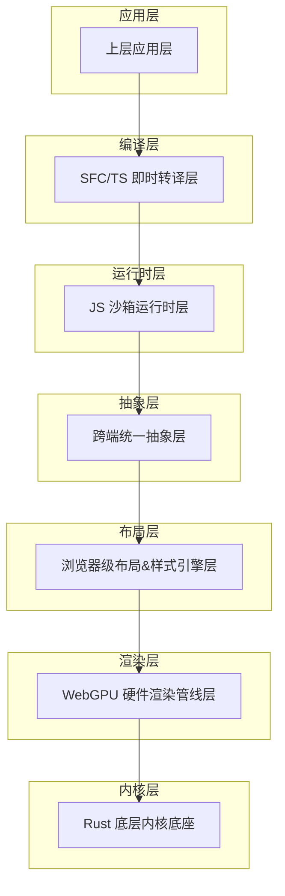
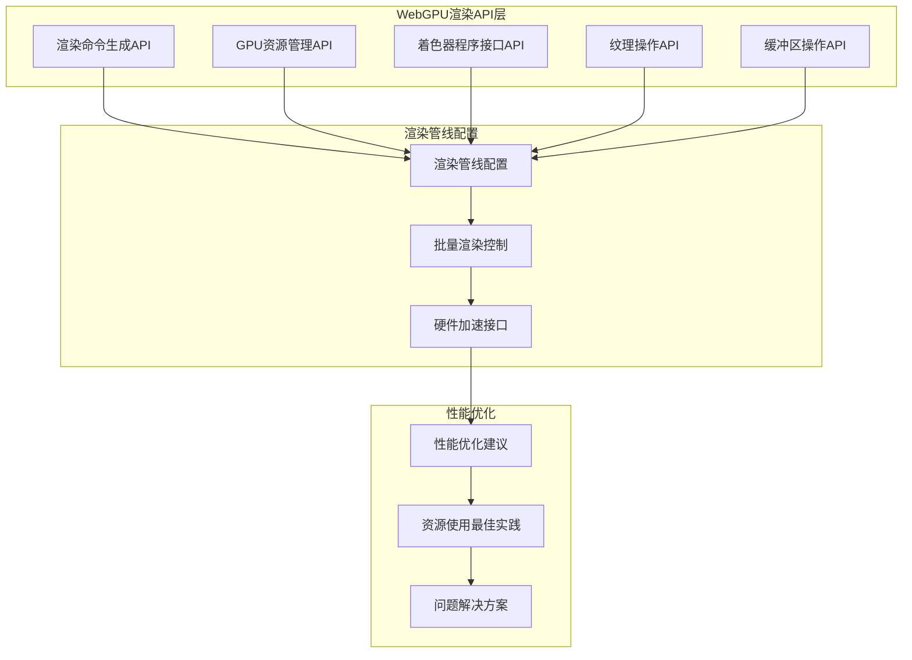
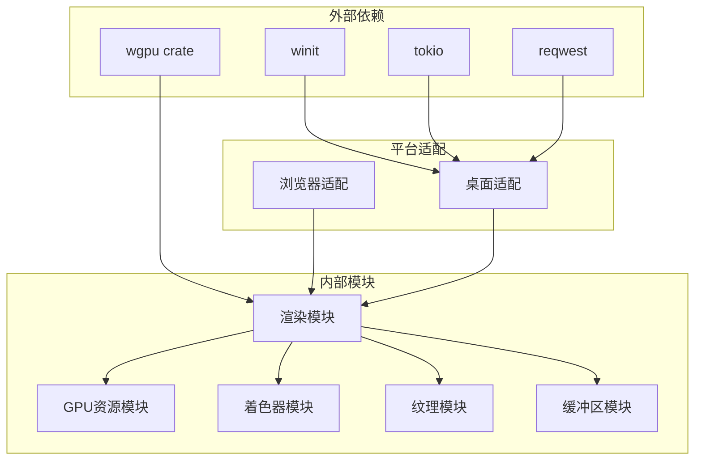

# 渲染API

<cite>
**本文档引用的文件**
- [doc.txt](file://doc.txt)
- [todo.txt](file://todo.txt)
</cite>

## 目录
1. [简介](#简介)
2. [项目结构](#项目结构)
3. [核心组件](#核心组件)
4. [架构概览](#架构概览)
5. [详细组件分析](#详细组件分析)
6. [依赖关系分析](#依赖关系分析)
7. [性能考虑](#性能考虑)
8. [故障排除指南](#故障排除指南)
9. [结论](#结论)
10. [附录](#附录)

## 简介

Leivue Runtime是一个基于Rust和WebGPU的下一代无构建前端运行时引擎。该项目的核心目标是提供一套完全脱离Node.js/浏览器DOM/编译打包的原生双端运行环境，支持零编译直接执行Vue3 + TypeScript，并完全兼容Element Plus、Ant Design Vue等第三方UI库。

该引擎采用七层分层架构设计，其中WebGPU硬件渲染管线层是核心技术之一，负责替代传统的DOM渲染流水线，提供完全自研的GPU渲染能力。

## 项目结构

根据项目文档，Leivue Runtime采用七层分层架构，每层都有明确的职责分工：

**图表来源**
- [doc.txt:7-22](file://doc.txt#L7-L22)

**章节来源**
- [doc.txt:7-22](file://doc.txt#L7-L22)

## 核心组件

基于项目文档，WebGPU硬件渲染管线层是Leivue Runtime的核心组件之一，具有以下关键特性：

### WebGPU渲染层能力概述

- **完全替代DOM渲染**：抛弃浏览器DOM渲染流水线，全自研GPU渲染
- **标准化接口**：基于标准WebGPU规范，统一桌面/浏览器渲染接口
- **高性能渲染**：支持批渲染、矢量绘制、圆角/阴影/渐变
- **纹理管理**：纹理图集、字体渲染、图层合成
- **稳定性能**：60fps稳定渲染，大列表/复杂组件无卡顿

### 核心渲染功能

1. **批渲染**：支持大量对象的高效批量渲染
2. **矢量绘制**：精确的矢量图形渲染能力
3. **视觉效果**：圆角、阴影、边框、渐变等高级视觉效果
4. **纹理处理**：纹理图集管理和字体渲染
5. **图层合成**：多图层的合成和渲染

**章节来源**
- [doc.txt:30-34](file://doc.txt#L30-L34)

## 架构概览

Leivue Runtime的WebGPU渲染API架构设计体现了高度的模块化和解耦性：

**图表来源**
- [doc.txt:30-34](file://doc.txt#L30-L34)

## 详细组件分析

### 渲染命令生成API

渲染命令生成是WebGPU渲染API的核心组成部分，负责创建和管理渲染操作序列。

#### 主要功能特性

- **命令缓冲区管理**：创建、提交和重用命令缓冲区
- **渲染通道管理**：配置颜色附件、深度模板附件
- **状态设置**：设置渲染管线、绑定着色器阶段
- **绘制调用**：执行顶点绘制、索引绘制、实例化绘制

#### API设计原则

- **链式调用**：支持方法链式调用提高代码可读性
- **类型安全**：严格的类型检查确保API使用正确性
- **资源跟踪**：自动跟踪GPU资源的生命周期
- **错误处理**：完善的错误处理和恢复机制

### GPU资源管理API

GPU资源管理API负责管理WebGPU中的各种GPU资源，包括缓冲区、纹理、采样器等。

#### 资源类型

1. **缓冲区(Buffer)**：存储顶点数据、索引数据、常量数据
2. **纹理(Texture)**：存储图像数据、渲染目标
3. **采样器(Sampler)**：控制纹理采样行为
4. **绑定组(BindGroup)**：组织资源绑定
5. **管线状态对象(Pipeline)**：描述渲染状态

#### 管理策略

- **内存池**：高效的GPU内存分配和回收
- **资源共享**：避免重复创建相同资源
- **生命周期管理**：自动跟踪资源使用情况
- **异步释放**：支持异步资源释放避免阻塞

### 着色器程序接口API

着色器程序接口API提供了与WebGPU着色器交互的能力。

#### 着色器类型

- **顶点着色器(Vertex Shader)**：处理顶点属性变换
- **片段着色器(Fragment Shader)**：计算像素颜色
- **通用着色器(Compute Shader)**：执行通用计算任务

#### 接口特性

- **着色器编译**：支持SPIR-V字节码和WGSL源码
- **绑定管理**：自动管理着色器资源绑定
- **参数传递**：支持动态参数传递和uniform更新
- **调试支持**：提供着色器调试和性能分析

### 纹理和缓冲区操作API

纹理和缓冲区操作API提供了对GPU内存数据的访问和操作能力。

#### 纹理操作

- **纹理创建**：支持多种格式和尺寸的纹理
- **数据上传**：从CPU内存上传到GPU纹理
- **格式转换**：支持不同像素格式之间的转换
- **mipmap生成**：自动生成mipmap层级

#### 缓冲区操作

- **缓冲区创建**：支持不同用途的缓冲区
- **数据映射**：CPU/GPU数据同步传输
- **偏移操作**：支持缓冲区部分数据访问
- **内存对齐**：自动处理内存对齐要求

### 渲染管线配置

渲染管线配置API允许开发者精细控制渲染过程的各个方面。

#### 配置要素

1. **顶点输入**：定义顶点数据布局和输入绑定
2. **着色器阶段**：配置各个着色器阶段
3. **光栅化**：控制三角形光栅化过程
4. **混合**：配置颜色混合模式
5. **深度模板**：设置深度和模板测试

#### 动态配置

- **状态切换**：快速切换渲染状态
- **参数更新**：动态更新渲染参数
- **批处理优化**：减少状态切换开销

### 批量渲染控制

批量渲染控制API专门用于优化大量相似对象的渲染性能。

#### 批处理策略

- **实例化渲染**：使用instanced rendering渲染多个实例
- **顶点重用**：共享顶点数据减少内存占用
- **状态合并**：合并相似状态减少状态切换
- **绘制调用优化**：减少GPU命令调用次数

#### 性能优化

- **GPU内存优化**：合理组织GPU内存布局
- **带宽利用**：最大化GPU内存带宽利用率
- **并发处理**：利用GPU并行计算能力

### 硬件加速相关API

硬件加速API提供了与底层GPU硬件交互的能力。

#### 支持的硬件特性

- **多GPU支持**：支持多GPU并行渲染
- **硬件特性检测**：检测GPU硬件能力
- **驱动程序兼容性**：适配不同厂商驱动程序
- **性能监控**：实时监控GPU性能指标

#### 优化策略

- **硬件特定优化**：针对特定GPU架构优化
- **内存管理**：优化GPU内存使用模式
- **功耗控制**：平衡性能和功耗

## 依赖关系分析

**图表来源**
- [doc.txt:23-29](file://doc.txt#L23-L29)

**章节来源**
- [doc.txt:23-29](file://doc.txt#L23-L29)

## 性能考虑

基于项目文档中提到的性能优势，WebGPU渲染API在设计时充分考虑了性能优化：

### 性能基准

- **帧率稳定性**：60fps稳定渲染
- **大列表性能**：复杂组件无卡顿
- **CPU开销**：极低的CPU开销
- **内存效率**：高效的内存使用模式

### 优化策略

1. **批渲染优化**：通过批处理减少状态切换
2. **纹理图集**：合并纹理减少绑定次数
3. **内存池**：复用GPU内存减少分配开销
4. **异步处理**：利用异步特性避免阻塞

### 最佳实践

- **资源复用**：尽量复用已创建的GPU资源
- **状态最小化**：减少渲染状态切换频率
- **数据局部性**：优化数据布局提高缓存命中率
- **负载均衡**：合理分配GPU工作负载

## 故障排除指南

### 常见问题及解决方案

#### 渲染异常

**问题**：渲染结果不符合预期
- 检查着色器编译是否成功
- 验证顶点数据布局是否正确
- 确认渲染状态配置是否合理

**问题**：性能下降明显
- 分析GPU内存使用情况
- 检查是否有过多的状态切换
- 评估批处理策略的有效性

#### 资源管理问题

**问题**：内存泄漏
- 确认所有GPU资源都正确释放
- 检查资源生命周期管理
- 验证异步释放机制

**问题**：资源竞争
- 实现适当的资源锁定机制
- 避免在渲染线程中直接操作资源
- 使用资源池管理共享资源

#### 平台兼容性问题

**问题**：不同平台表现不一致
- 检查WebGPU特性支持情况
- 实现平台特定的降级策略
- 验证着色器兼容性

**章节来源**
- [doc.txt:84-87](file://doc.txt#L84-L87)

## 结论

Leivue Runtime的WebGPU渲染API代表了现代WebGPU技术的先进应用，通过七层分层架构设计实现了高度的模块化和性能优化。该API不仅提供了完整的GPU渲染能力，还特别注重性能优化和平台兼容性。

### 核心优势

1. **高性能渲染**：基于WebGPU的硬件加速渲染
2. **零编译运行**：直接执行Vue3 + TypeScript源码
3. **跨端兼容**：统一的渲染接口支持多平台
4. **生态兼容**：完全兼容Vue3生态系统
5. **内存安全**：基于Rust实现的内存安全保障

### 发展前景

随着WebGPU技术的不断发展和硬件支持的逐步完善，Leivue Runtime的WebGPU渲染API将为开发者提供更加高效、稳定的渲染解决方案，特别是在大屏应用、复杂UI界面和高性能图形应用领域具有巨大潜力。

## 附录

### API使用示例

由于当前仓库中没有具体的源代码实现，以下示例展示了如何使用WebGPU渲染API进行常见的渲染操作：

#### 基础渲染流程

1. 初始化WebGPU设备和渲染管道
2. 创建必要的GPU资源（缓冲区、纹理、采样器）
3. 准备顶点数据和着色器参数
4. 记录渲染命令到命令缓冲区
5. 提交命令缓冲区并呈现

#### 批量渲染示例

1. 创建实例化渲染的顶点数据
2. 设置实例属性数据
3. 使用instanced drawing渲染多个实例
4. 优化状态切换减少性能开销

#### 纹理管理示例

1. 加载和创建纹理资源
2. 纹理格式转换和mipmap生成
3. 纹理绑定和采样器配置
4. 纹理数据的动态更新

**章节来源**
- [doc.txt:65-97](file://doc.txt#L65-L97)