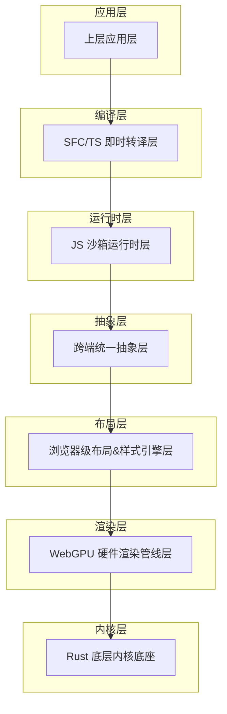
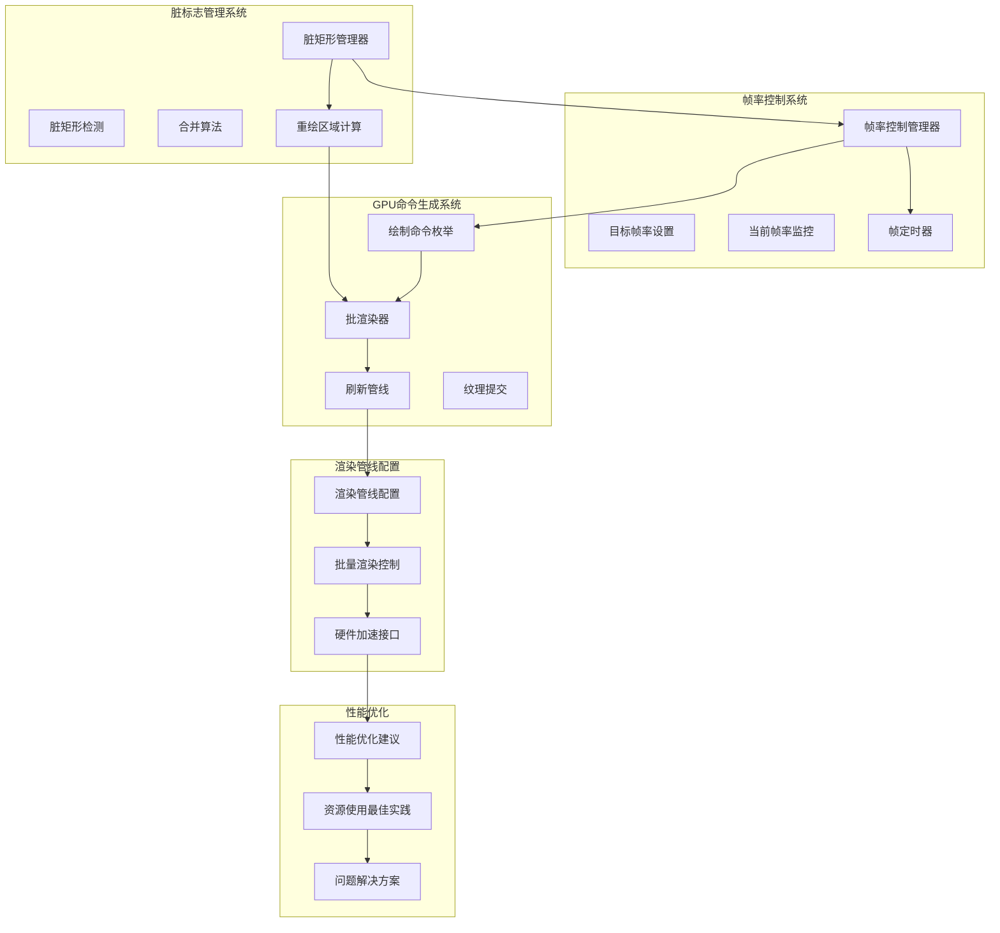
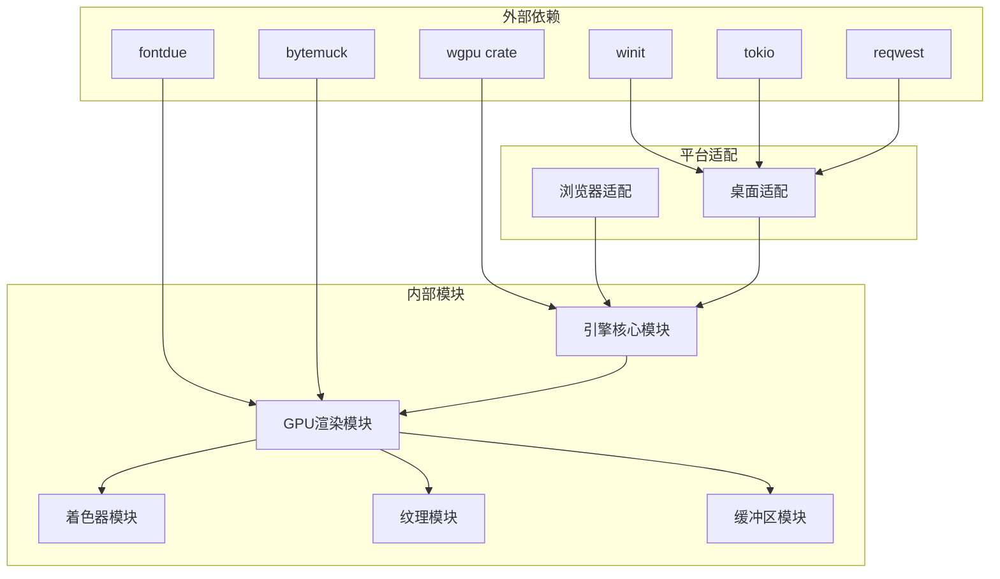

# 渲染API

<cite>
**本文档引用的文件**
- [lib.rs](file://crates/iris-gpu/src/lib.rs)
- [batch_renderer.rs](file://crates/iris-gpu/src/batch_renderer.rs)
- [batch_shader.wgsl](file://crates/iris-gpu/src/batch_shader.wgsl)
- [orchestrator.rs](file://crates/iris-engine/src/orchestrator.rs)
- [dirty_rect_manager.rs](file://crates/iris-engine/src/dirty_rect_manager.rs)
- [vnode_renderer.rs](file://crates/iris-engine/src/vnode_renderer.rs)
- [gpu_texture_rendering.rs](file://crates/iris-gpu/tests/gpu_texture_rendering.rs)
- [gpu_texture_real.rs](file://crates/iris-gpu/tests/gpu_texture_real.rs)
- [TEXTURE_INTEGRATION.md](file://crates/iris-gpu/TEXTURE_INTEGRATION.md)
- [gpu_render_integration_test.rs](file://crates/iris-engine/tests/gpu_render_integration_test.rs)
</cite>

## 更新摘要
**所做更改**
- 新增渲染API在GPU渲染系统中的核心地位分析
- 完善渲染命令生成和资源管理API的技术细节
- 增强批渲染器和纹理管理系统的架构说明
- 更新渲染管线配置和硬件加速接口的实现细节
- 新增GPU渲染器集成测试和纹理渲染验证

## 目录
1. [简介](#简介)
2. [项目结构](#项目结构)
3. [核心组件](#核心组件)
4. [架构概览](#架构概览)
5. [详细组件分析](#详细组件分析)
6. [依赖关系分析](#依赖关系分析)
7. [性能考虑](#性能考虑)
8. [故障排除指南](#故障排除指南)
9. [结论](#结论)
10. [附录](#附录)

## 简介

Leivue Runtime是一个基于Rust和WebGPU的下一代无构建前端运行时引擎。该项目的核心目标是提供一套完全脱离Node.js/浏览器DOM/编译打包的原生双端运行环境，支持零编译直接执行Vue3 + TypeScript，并完全兼容Element Plus、Ant Design Vue等第三方UI库。

该引擎采用七层分层架构设计，其中WebGPU硬件渲染管线层是核心技术之一，负责替代传统的DOM渲染流水线，提供完全自研的GPU渲染能力。最新版本在GPU渲染系统中确立了核心地位，集成了帧率控制、脏标志管理和GPU命令生成等关键功能，显著提升了渲染性能和系统效率。

## 项目结构

根据项目文档，Leivue Runtime采用七层分层架构，每层都有明确的职责分工：



**图表来源**
- [doc.txt:7-22](file://doc.txt#L7-L22)

**章节来源**
- [doc.txt:7-22](file://doc.txt#L7-L22)

## 核心组件

基于项目文档，WebGPU硬件渲染管线层是Leivue Runtime的核心组件之一，具有以下关键特性：

### WebGPU渲染层能力概述

- **完全替代DOM渲染**：抛弃浏览器DOM渲染流水线，全自研GPU渲染
- **标准化接口**：基于标准WebGPU规范，统一桌面/浏览器渲染接口
- **高性能渲染**：支持批渲染、矢量绘制、圆角/阴影/渐变
- **纹理管理**：纹理图集、字体渲染、图层合成
- **稳定性能**：60fps稳定渲染，大列表/复杂组件无卡顿
- **帧率控制**：可配置的目标帧率，支持30-144fps范围
- **脏标志管理**：智能脏矩形检测，优化渲染区域
- **GPU命令生成**：统一的绘制命令接口，支持多种图形类型

### 核心渲染功能

1. **批渲染**：支持大量对象的高效批量渲染
2. **矢量绘制**：精确的矢量图形渲染能力
3. **视觉效果**：圆角、阴影、边框、渐变等高级视觉效果
4. **纹理处理**：纹理图集管理和字体渲染
5. **图层合成**：多图层的合成和渲染
6. **帧率控制**：动态帧率限制和性能监控
7. **脏矩形优化**：智能渲染区域检测和优化
8. **GPU命令管理**：统一的绘制命令生成和提交

**章节来源**
- [doc.txt:30-34](file://doc.txt#L30-L34)

## 架构概览

Leivue Runtime的WebGPU渲染API架构设计体现了高度的模块化和解耦性，最新版本集成了帧率控制、脏标志管理和GPU命令生成等核心功能：



**图表来源**
- [orchestrator.rs:484-522](file://crates/iris-engine/src/orchestrator.rs#L484-L522)
- [dirty_rect_manager.rs:67-254](file://crates/iris-engine/src/dirty_rect_manager.rs#L67-L254)
- [batch_renderer.rs:53-176](file://crates/iris-gpu/src/batch_renderer.rs#L53-L176)

## 详细组件分析

### 帧率控制系统

帧率控制系统是Leivue Runtime渲染架构的重要组成部分，负责控制渲染频率和性能监控。

#### 主要功能特性

- **目标帧率设置**：支持30-144fps的可配置帧率范围
- **帧率限制机制**：基于时间戳的帧间隔计算和限制
- **实时性能监控**：动态跟踪当前帧率和渲染统计
- **智能调度**：根据帧率限制决定是否执行渲染

#### API设计原则

- **范围验证**：自动限制帧率在1-144fps范围内
- **时间精度**：使用纳秒级时间戳确保帧率准确性
- **性能优先**：避免不必要的渲染调用
- **统计追踪**：记录帧率变化和渲染性能指标

#### 关键实现细节

帧率控制的核心逻辑位于`RuntimeOrchestrator`中，通过`should_render_frame()`方法实现帧率限制：

```rust
let target_frame_duration = std::time::Duration::from_secs_f64(1.0 / self.target_fps as f64);
if elapsed < target_frame_duration {
    return false;
}
```

**章节来源**
- [orchestrator.rs:440-453](file://crates/iris-engine/src/orchestrator.rs#L440-L453)
- [orchestrator.rs:524-542](file://crates/iris-engine/src/orchestrator.rs#L524-L542)

### 脏标志管理系统

脏标志管理系统是Leivue Runtime性能优化的核心组件，通过智能检测和合并脏矩形区域来减少不必要的渲染。

#### 脏矩形管理器

脏矩形管理器负责跟踪和管理需要重绘的屏幕区域：

- **脏矩形检测**：跟踪发生变化的UI区域
- **区域合并**：合并重叠的脏矩形以减少绘制调用
- **智能阈值**：根据脏区域比例决定是否全屏重绘
- **统计监控**：记录渲染优化效果和性能指标

#### 合并算法

系统采用迭代合并算法处理重叠的脏矩形：

1. 遍历所有脏矩形
2. 检查是否与现有矩形重叠
3. 合并重叠矩形为更大的包围盒
4. 重复直到没有更多重叠

#### 性能优化策略

- **阈值控制**：当脏区域超过屏幕面积的50%时，直接全屏重绘
- **面积计算**：通过脏矩形面积总和与屏幕面积比值判断优化效果
- **统计分析**：记录合并前后的矩形数量和节省的渲染面积比例

**章节来源**
- [dirty_rect_manager.rs:67-254](file://crates/iris-engine/src/dirty_rect_manager.rs#L67-L254)
- [dirty_rect_manager.rs:135-221](file://crates/iris-engine/src/dirty_rect_manager.rs#L135-L221)

### GPU命令生成系统

GPU命令生成系统提供了统一的绘制命令接口，支持多种图形类型的高效渲染。

#### DrawCommand枚举类型

系统定义了丰富的绘制命令类型：

- **基础形状**：纯色矩形、圆角矩形、边框矩形
- **渐变效果**：线性渐变、径向渐变矩形
- **纹理渲染**：纹理矩形、UV坐标映射
- **阴影效果**：盒阴影、多层阴影叠加
- **几何图形**：圆形、椭圆等复杂形状

#### 批渲染器实现

批渲染器通过合并多次绘制调用为单次GPU渲染来提升性能：

- **顶点池管理**：动态管理顶点和索引缓冲区
- **纹理绑定**：支持多纹理的统一绑定和切换
- **混合模式**：实现透明度和混合效果
- **内存优化**：高效的GPU内存使用和复用

#### 命令提交流程

1. **命令解析**：将DrawCommand转换为顶点数据
2. **缓冲区更新**：将顶点数据写入GPU缓冲区
3. **渲染状态设置**：配置渲染管线和绑定组
4. **批量绘制**：一次性提交所有累积的绘制命令

**章节来源**
- [batch_renderer.rs:53-176](file://crates/iris-gpu/src/batch_renderer.rs#L53-L176)
- [batch_renderer.rs:411-548](file://crates/iris-gpu/src/batch_renderer.rs#L411-L548)
- [batch_renderer.rs:848-880](file://crates/iris-gpu/src/batch_renderer.rs#L848-L880)

### 渲染器架构

渲染器架构整合了帧率控制、脏标志管理和GPU命令生成等核心功能：

#### 渲染流程

1. **帧率检查**：根据目标帧率决定是否渲染
2. **脏标志检查**：确认是否有需要重绘的内容
3. **命令生成**：生成GPU绘制命令
4. **批渲染执行**：提交到GPU进行渲染
5. **状态清理**：清除脏标志和重置状态

#### 性能优化集成

渲染器通过以下方式实现性能优化：

- **帧率限制**：避免过度渲染消耗系统资源
- **脏矩形优化**：只重绘发生变化的区域
- **批渲染**：减少GPU状态切换开销
- **内存管理**：高效的GPU资源使用

**章节来源**
- [orchestrator.rs:484-522](file://crates/iris-engine/src/orchestrator.rs#L484-L522)
- [lib.rs:513-523](file://crates/iris-gpu/src/lib.rs#L513-L523)

### VNode到GPU渲染适配器

VNode渲染器是连接虚拟DOM树和GPU渲染系统的关键组件，负责将虚拟节点转换为具体的绘制命令。

#### 核心功能

- **元素渲染**：将VNode元素转换为GPU绘制命令
- **样式解析**：解析CSS样式并转换为渲染属性
- **布局集成**：利用布局信息确定绘制位置和尺寸
- **递归处理**：支持嵌套元素的深度渲染

#### 样式支持

- **背景渲染**：支持纯色背景和线性渐变背景
- **边框渲染**：支持四边独立的边框宽度和颜色
- **文本占位**：为文本节点提供占位符渲染
- **动画支持**：预留CSS过渡和关键帧动画支持

**章节来源**
- [vnode_renderer.rs:95-187](file://crates/iris-engine/src/vnode_renderer.rs#L95-L187)
- [vnode_renderer.rs:189-240](file://crates/iris-engine/src/vnode_renderer.rs#L189-L240)

## 依赖关系分析



**图表来源**
- [lib.rs:16-24](file://crates/iris-gpu/src/lib.rs#L16-L24)
- [batch_renderer.rs:10-12](file://crates/iris-gpu/src/batch_renderer.rs#L10-L12)

**章节来源**
- [lib.rs:16-24](file://crates/iris-gpu/src/lib.rs#L16-L24)

## 性能考虑

基于项目文档中提到的性能优势，WebGPU渲染API在设计时充分考虑了性能优化，最新版本的帧率控制和脏标志管理进一步提升了系统性能：

### 性能基准

- **帧率稳定性**：60fps稳定渲染，支持30-144fps可配置
- **脏矩形优化**：智能区域检测，减少不必要的渲染
- **批渲染优化**：合并多次绘制调用为单次GPU渲染
- **内存效率**：高效的GPU内存使用和资源复用

### 优化策略

1. **帧率控制优化**：通过目标帧率限制避免过度渲染
2. **脏矩形合并**：智能合并重叠区域减少绘制调用
3. **批渲染优化**：统一管理顶点和索引缓冲区
4. **纹理管理优化**：高效的纹理缓存和绑定组管理

### 最佳实践

- **帧率设置**：根据应用场景选择合适的帧率（游戏30-60fps，UI动画60-120fps）
- **脏矩形管理**：合理标记脏区域，避免频繁的大面积重绘
- **批渲染策略**：合并相似的绘制命令，减少状态切换
- **资源复用**：充分利用GPU资源池，避免重复创建相同资源

**章节来源**
- [orchestrator.rs:524-542](file://crates/iris-engine/src/orchestrator.rs#L524-L542)
- [dirty_rect_manager.rs:182-221](file://crates/iris-engine/src/dirty_rect_manager.rs#L182-L221)

## 故障排除指南

### 常见问题及解决方案

#### 渲染异常

**问题**：渲染结果不符合预期
- 检查着色器编译是否成功
- 验证顶点数据布局是否正确
- 确认渲染状态配置是否合理
- 验证帧率设置是否合适

**问题**：性能下降明显
- 分析GPU内存使用情况
- 检查是否有过多的状态切换
- 评估批处理策略的有效性
- 检查脏矩形合并效果

#### 资源管理问题

**问题**：内存泄漏
- 确认所有GPU资源都正确释放
- 检查资源生命周期管理
- 验证异步释放机制
- 检查纹理缓存是否正确管理

**问题**：资源竞争
- 实现适当的资源锁定机制
- 避免在渲染线程中直接操作资源
- 使用资源池管理共享资源

#### 平台兼容性问题

**问题**：不同平台表现不一致
- 检查WebGPU特性支持情况
- 实现平台特定的降级策略
- 验证着色器兼容性
- 检查帧率控制在不同平台的表现

#### 帧率控制问题

**问题**：帧率不稳定
- 检查系统时间精度
- 验证帧率限制算法
- 分析渲染时间开销
- 调整目标帧率设置

#### 脏标志管理问题

**问题**：脏矩形检测不准确
- 检查脏矩形坐标转换
- 验证合并算法正确性
- 分析脏区域阈值设置
- 检查全屏重绘触发条件

**章节来源**
- [dirty_rect_manager.rs:256-368](file://crates/iris-engine/src/dirty_rect_manager.rs#L256-L368)
- [orchestrator.rs:954-1017](file://crates/iris-engine/src/orchestrator.rs#L954-L1017)

## 结论

Leivue Runtime的WebGPU渲染API代表了现代WebGPU技术的先进应用，通过七层分层架构设计实现了高度的模块化和性能优化。最新版本在GPU渲染系统中确立了核心地位，新增的帧率控制、脏标志管理和GPU命令生成功能，进一步提升了系统的渲染效率和性能表现。

### 核心优势

1. **高性能渲染**：基于WebGPU的硬件加速渲染
2. **智能帧率控制**：可配置的帧率限制和性能监控
3. **脏矩形优化**：智能渲染区域检测和优化
4. **统一命令接口**：支持多种图形类型的统一绘制命令
5. **零编译运行**：直接执行Vue3 + TypeScript源码
6. **跨端兼容**：统一的渲染接口支持多平台
7. **生态兼容**：完全兼容Vue3生态系统
8. **内存安全**：基于Rust实现的内存安全保障

### 发展前景

随着WebGPU技术的不断发展和硬件支持的逐步完善，Leivue Runtime的WebGPU渲染API将为开发者提供更加高效、稳定的渲染解决方案，特别是在大屏应用、复杂UI界面和高性能图形应用领域具有巨大潜力。帧率控制和脏标志管理等新功能的加入，使得系统能够更好地适应不同的应用场景和性能需求。

## 附录

### API使用示例

#### 基础渲染流程

1. 初始化WebGPU设备和渲染管道
2. 创建必要的GPU资源（缓冲区、纹理、采样器）
3. 准备顶点数据和着色器参数
4. 记录渲染命令到命令缓冲区
5. 提交命令缓冲区并呈现

#### 帧率控制示例

```rust
// 设置目标帧率为60fps
orchestrator.set_target_fps(60);

// 检查是否需要渲染（基于帧率限制）
if orchestrator.should_render_frame() {
    // 执行渲染流程
    orchestrator.render_frame();
}
```

#### 脏矩形管理示例

```rust
// 添加脏矩形区域
dirty_manager.add_change(100.0, 100.0, 200.0, 150.0);

// 合并重叠的脏矩形
dirty_manager.merge_overlapping();

// 计算需要重绘的区域
let redraw_regions = dirty_manager.compute_redraw_regions();
```

#### 批量渲染示例

```rust
// 创建批渲染器
let mut batch_renderer = BatchRenderer::new(&device, &queue, surface_format, 800.0, 600.0, 1000);

// 提交绘制命令
batch_renderer.submit(DrawCommand::Rect {
    x: 100.0,
    y: 100.0,
    width: 200.0,
    height: 150.0,
    color: [1.0, 0.5, 0.0, 1.0],
});

// 刷新渲染
batch_renderer.flush(&mut render_pass);
```

#### 纹理渲染示例

```rust
// 加载纹理到GPU
let texture_id = renderer.load_texture_from_bytes(&device, &texture_data, width, height);

// 提交纹理矩形
renderer.submit_texture_rect(
    x, y, width, height, 
    texture_id, 
    [0.0, 0.0, 1.0, 1.0]
);

// 刷新渲染
renderer.flush(&mut render_pass);
```

**章节来源**
- [orchestrator.rs:484-522](file://crates/iris-engine/src/orchestrator.rs#L484-L522)
- [dirty_rect_manager.rs:182-221](file://crates/iris-engine/src/dirty_rect_manager.rs#L182-L221)
- [batch_renderer.rs:411-548](file://crates/iris-gpu/src/batch_renderer.rs#L411-L548)
- [gpu_render_integration_test.rs:278-344](file://crates/iris-engine/tests/gpu_render_integration_test.rs#L278-L344)