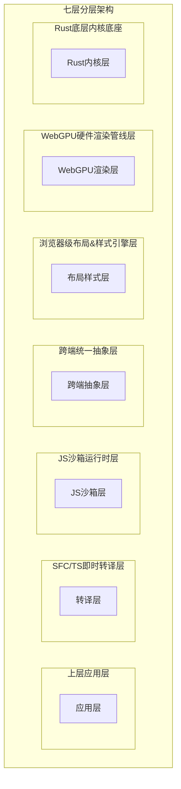
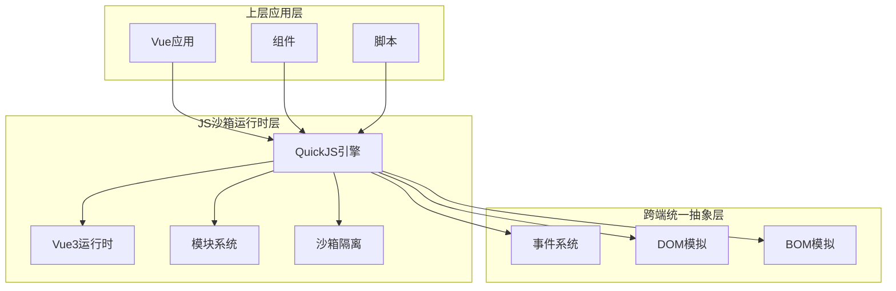
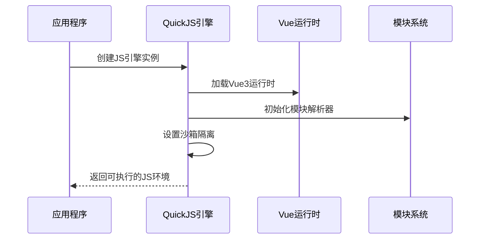
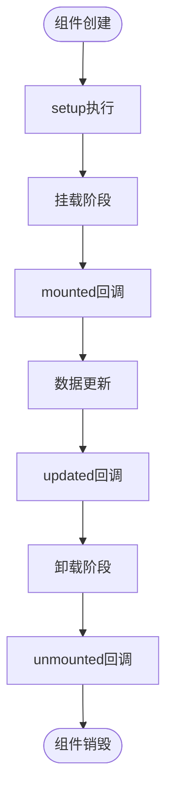
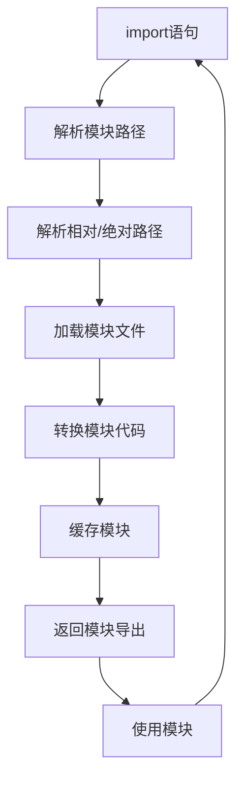
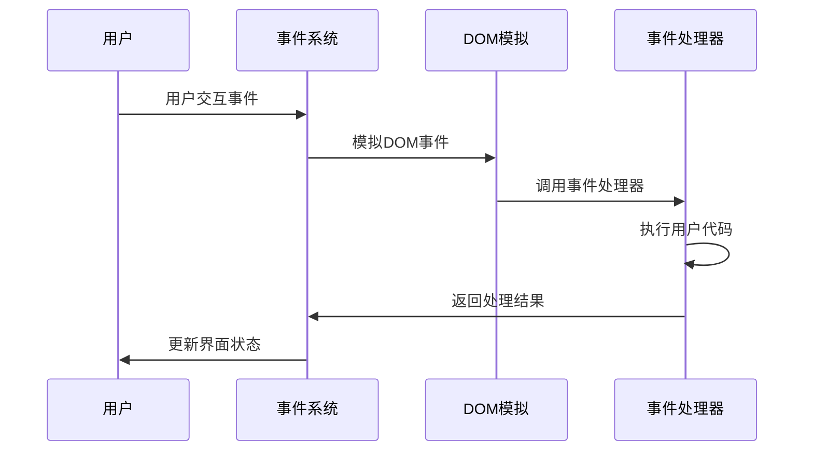
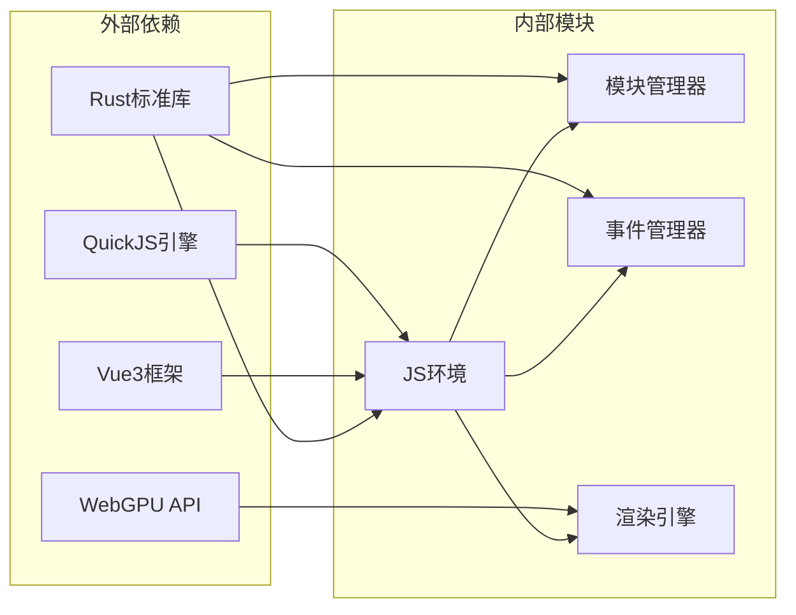

# 运行时API

<cite>
**本文档引用的文件**
- [doc.txt](file://doc.txt)
- [todo.txt](file://todo.txt)
</cite>

## 目录
1. [简介](#简介)
2. [项目结构](#项目结构)
3. [核心组件](#核心组件)
4. [架构概览](#架构概览)
5. [详细组件分析](#详细组件分析)
6. [依赖关系分析](#依赖关系分析)
7. [性能考虑](#性能考虑)
8. [故障排除指南](#故障排除指南)
9. [结论](#结论)

## 简介

Leivue Runtime是一个基于Rust和WebGPU的下一代无构建前端运行时引擎。该项目旨在提供一套完全脱离Node.js、浏览器DOM和编译打包的原生双端运行解决方案，支持零编译直接执行Vue3 + TypeScript，并完全兼容Element Plus、Ant Design Vue等第三方UI库。

该运行时引擎采用七层分层架构设计，其中JS沙箱运行时层是核心组件之一，负责提供独立隔离的JavaScript执行环境。

## 项目结构

根据项目文档，Leivue Runtime采用七层分层架构，每层都有明确的职责分工：

**图表来源**
- [doc.txt:7-22](file://doc.txt#L7-L22)

**章节来源**
- [doc.txt:7-22](file://doc.txt#L7-L22)

## 核心组件

### JS沙箱运行时层

JS沙箱运行时层是Leivue Runtime的核心执行环境，具有以下关键特性：

- **JS引擎**：使用QuickJS（轻量高性能、Wasm友好、Rust深度绑定）
- **沙箱隔离**：与宿主环境完全隔离，提供安全的脚本执行环境
- **内置运行时**：预加载Vue3完整运行时（runtime-core/runtime-dom）
- **模块系统**：自研ESM解析器，支持import/export、第三方包引入

### 核心定位

该层的核心使命是：
- 消灭前端工程化，突破浏览器沙箱限制
- 为Vue生态系统提供高性能跨端底座
- 支持零编译直接执行Vue3 + TypeScript
- 完全兼容Element Plus、Ant Design Vue等第三方UI库

**章节来源**
- [doc.txt:46-51](file://doc.txt#L46-L51)
- [doc.txt:3-6](file://doc.txt#L3-L6)

## 架构概览

**图表来源**
- [doc.txt:46-51](file://doc.txt#L46-L51)
- [doc.txt:41-45](file://doc.txt#L41-L45)

**章节来源**
- [doc.txt:41-51](file://doc.txt#L41-L51)

## 详细组件分析

### QuickJS引擎API

QuickJS引擎作为JS沙箱运行时层的核心，提供了以下主要功能：

#### 初始化流程

**图表来源**
- [doc.txt:46-51](file://doc.txt#L46-L51)

#### 主要API接口

1. **引擎初始化**
   - 功能：创建独立的JS执行环境
   - 参数：无
   - 返回值：JS引擎实例
   - 使用场景：应用启动时的环境准备

2. **脚本执行**
   - 功能：在沙箱环境中执行JavaScript代码
   - 参数：JavaScript源码字符串
   - 返回值：执行结果或错误信息
   - 使用场景：动态代码执行、插件加载

3. **模块加载**
   - 功能：解析和加载ESM模块
   - 参数：模块路径、导入规范
   - 返回值：模块导出对象
   - 使用场景：第三方库集成、组件模块化

**章节来源**
- [doc.txt:46-51](file://doc.txt#L46-L51)

### Vue运行时API

Vue运行时层提供了完整的Vue3运行时能力：

#### 生命周期管理

**图表来源**
- [doc.txt:72-73](file://doc.txt#L72-L73)

#### 核心API接口

1. **组件生命周期**
   - `onMounted`: 组件挂载后执行
   - `onUpdated`: 组件更新后执行  
   - `onUnmounted`: 组件卸载前执行
   - `onBeforeMount`: 组件挂载前执行
   - `onBeforeUpdate`: 组件更新前执行
   - `onBeforeUnmount`: 组件卸载前执行

2. **响应式系统**
   - `ref`: 创建响应式引用
   - `reactive`: 创建响应式对象
   - `computed`: 创建计算属性
   - `watch`: 监听数据变化

3. **组合式API**
   - `defineComponent`: 定义组件
   - `useContext`: 获取组件上下文
   - `getCurrentInstance`: 获取当前实例

**章节来源**
- [doc.txt:72-73](file://doc.txt#L72-L73)

### 模块系统API

自研ESM解析器提供了完整的模块加载能力：

#### 模块加载流程

**图表来源**
- [doc.txt:50](file://doc.txt#L50)

#### 核心API接口

1. **模块导入**
   - 功能：动态导入ESM模块
   - 参数：模块路径、导入选项
   - 返回值：Promise包含模块内容
   - 使用场景：按需加载、懒加载

2. **模块导出**
   - 功能：定义模块导出内容
   - 参数：导出名称、导出值
   - 返回值：void
   - 使用场景：组件库开发、工具函数封装

3. **路径解析**
   - 功能：解析模块路径
   - 参数：相对路径、基准路径
   - 返回值：绝对路径
   - 使用场景：内部模块组织、第三方库集成

**章节来源**
- [doc.txt:50](file://doc.txt#L50)

### 事件处理机制

跨端统一抽象层提供了完整的事件处理能力：

#### 事件处理流程

**图表来源**
- [doc.txt:42-44](file://doc.txt#L42-L44)

#### 核心事件类型

1. **鼠标事件**
   - click: 点击事件
   - mousemove: 鼠标移动
   - mousedown: 鼠标按下
   - mouseup: 鼠标抬起

2. **键盘事件**
   - keydown: 键盘按下
   - keyup: 键盘抬起
   - keypress: 键盘输入

3. **触摸事件**
   - touchstart: 触摸开始
   - touchmove: 触摸移动
   - touchend: 触摸结束

**章节来源**
- [doc.txt:42-44](file://doc.txt#L42-L44)

## 依赖关系分析

**图表来源**
- [doc.txt:23-29](file://doc.txt#L23-L29)
- [doc.txt:46-51](file://doc.txt#L46-L51)

**章节来源**
- [doc.txt:23-29](file://doc.txt#L23-L29)
- [doc.txt:46-51](file://doc.txt#L46-L51)

## 性能考虑

### 内存管理
- Rust内存安全保证，无GC停顿
- 内存池优化，减少频繁分配
- 模块缓存机制，避免重复加载

### 执行效率
- QuickJS高性能JS引擎
- WebGPU硬件加速渲染
- 零编译直接执行，消除构建开销

### 资源优化
- 体积极小（MB级别）
- 启动速度快
- CPU开销低

## 故障排除指南

### 常见问题

1. **模块加载失败**
   - 检查模块路径是否正确
   - 确认模块解析器配置
   - 验证文件权限设置

2. **Vue组件无法渲染**
   - 检查组件生命周期钩子
   - 验证响应式数据更新
   - 确认模板语法正确性

3. **事件处理异常**
   - 检查事件绑定方式
   - 验证事件处理器签名
   - 确认DOM模拟状态

### 调试建议

- 使用浏览器开发者工具检查JS执行
- 启用详细日志输出
- 分模块测试功能完整性
- 验证跨端兼容性

## 结论

Leivue Runtime的JS沙箱运行时层通过QuickJS引擎、Vue3运行时和自研模块系统的有机结合，为现代Web应用提供了全新的执行环境。该架构具有以下优势：

- **安全性**：完全隔离的沙箱环境，防止恶意代码执行
- **性能**：零编译直接执行，WebGPU硬件加速
- **兼容性**：完全兼容Vue3生态系统和第三方UI库
- **跨平台**：统一的跨端抽象，支持浏览器和桌面原生运行

随着项目的持续发展，这套运行时API将为Vue生态系统的现代化提供强有力的技术支撑，推动前端开发模式向更高效、更安全的方向演进。