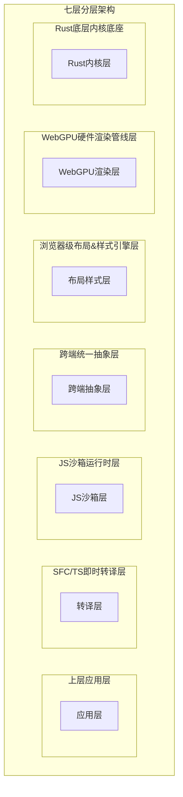
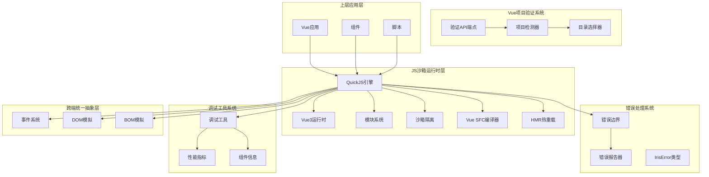
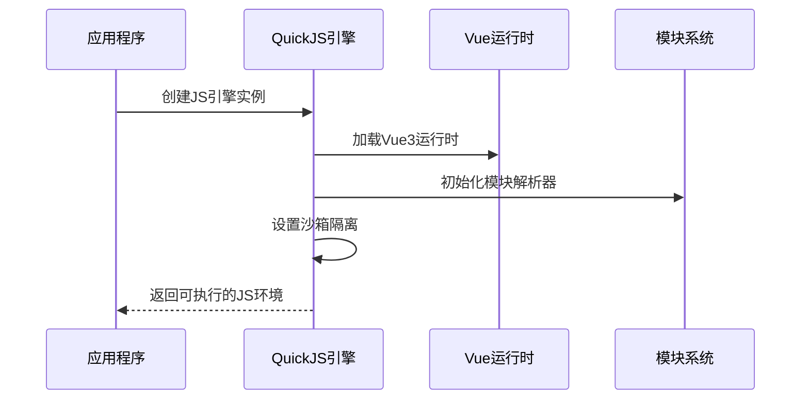
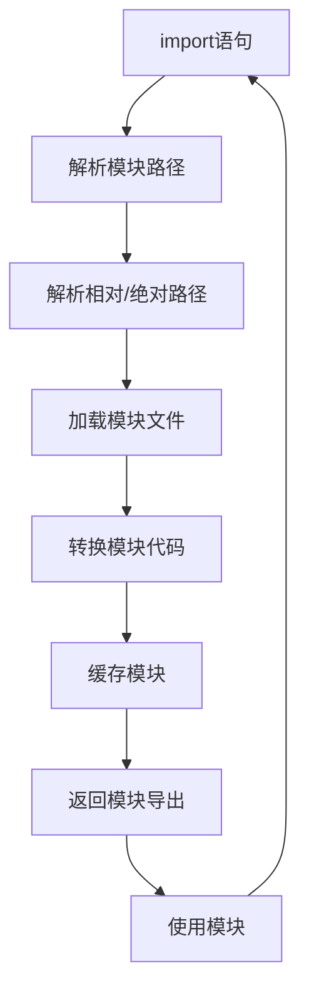
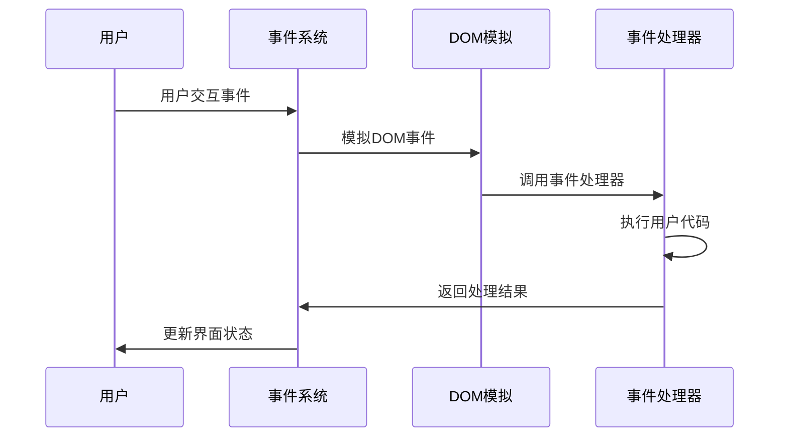
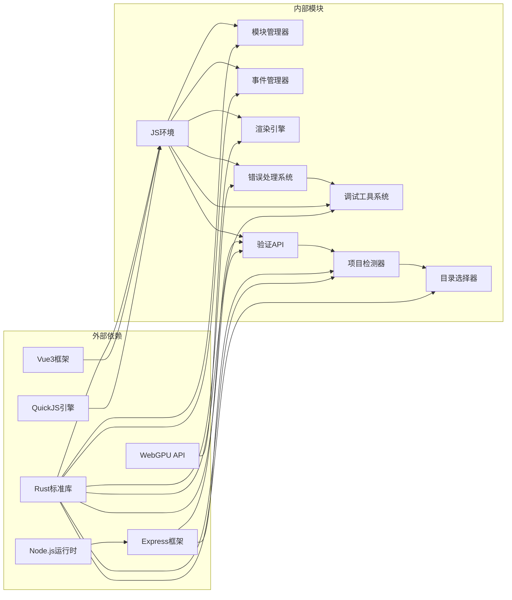

# 运行时API

<cite>
**本文档引用的文件**
- [lib.rs](file://crates/iris-engine/src/lib.rs)
- [error_handling.rs](file://crates/iris-engine/src/error_handling.rs)
- [dev_tools.rs](file://crates/iris-engine/src/dev_tools.rs)
- [API_VALIDATE_PROJECT.md](file://crates/iris-runtime/API_VALIDATE_PROJECT.md)
- [VUE_PROJECT_DETECTION.md](file://crates/iris-runtime/VUE_PROJECT_DETECTION.md)
- [dev-server.js](file://crates/iris-runtime/lib/dev-server.js)
- [iris-runtime.js](file://crates/iris-runtime/bin/iris-runtime.js)
- [lib.rs](file://crates/iris-runtime/src/lib.rs)
- [compiler.rs](file://crates/iris-runtime/src/compiler.rs)
- [hmr.rs](file://crates/iris-runtime/src/hmr.rs)
</cite>

## 更新摘要
**变更内容**
- 新增Vue项目验证API端点详细说明
- 增强运行时API参考手册的完整性
- 添加Vue项目检测功能的完整实现文档
- 更新错误处理系统API文档以反映IrisError的完整克隆功能

## 目录
1. [简介](#简介)
2. [项目结构](#项目结构)
3. [核心组件](#核心组件)
4. [架构概览](#架构概览)
5. [详细组件分析](#详细组件分析)
6. [Vue项目验证API](#vue项目验证api)
7. [错误处理系统API](#错误处理系统api)
8. [调试工具系统API](#调试工具系统api)
9. [依赖关系分析](#依赖关系分析)
10. [性能考虑](#性能考虑)
11. [故障排除指南](#故障排除指南)
12. [结论](#结论)

## 简介

Leivue Runtime是一个基于Rust和WebGPU的下一代无构建前端运行时引擎。该项目旨在提供一套完全脱离Node.js、浏览器DOM和编译打包的原生双端运行解决方案，支持零编译直接执行Vue3 + TypeScript，并完全兼容Element Plus、Ant Design Vue等第三方UI库。

该运行时引擎采用七层分层架构设计，其中JS沙箱运行时层是核心组件之一，负责提供独立隔离的JavaScript执行环境。新增的Vue项目验证API为用户提供了一键式Vue项目检测和验证功能，支持实时验证用户选择的目录是否为有效的Vue项目。

## 项目结构

根据项目文档，Leivue Runtime采用七层分层架构，每层都有明确的职责分工：



**章节来源**
- [lib.rs:6-14](file://crates/iris-engine/src/lib.rs#L6-L14)

## 核心组件

### JS沙箱运行时层

JS沙箱运行时层是Leivue Runtime的核心执行环境，具有以下关键特性：

- **JS引擎**：使用QuickJS（轻量高性能、Wasm友好、Rust深度绑定）
- **沙箱隔离**：与宿主环境完全隔离，提供安全的脚本执行环境
- **内置运行时**：预加载Vue3完整运行时（runtime-core/runtime-dom）
- **模块系统**：自研ESM解析器，支持import/export、第三方包引入
- **编译能力**：提供Vue SFC编译、模块解析、热重载功能

### Vue项目验证系统

Vue项目验证系统提供实时的Vue项目检测和验证功能：

- **API端点**：`POST /api/validate-project` - 验证指定目录是否为Vue项目
- **检测逻辑**：检查package.json存在性、解析依赖、识别构建工具
- **实时反馈**：提供详细的验证结果和错误原因
- **用户友好**：支持浏览器目录选择和自动重定向

### 错误处理系统

错误处理系统提供组件级别的错误隔离和恢复机制：

- **ErrorBoundary**：捕获子组件渲染错误，防止错误传播
- **ErrorReporter**：收集和报告错误信息，支持错误统计和分析
- **IrisError**：统一的错误类型，包含消息、来源、严重级别等信息
- **错误恢复策略**：根据错误严重级别决定是否继续渲染

### 调试工具系统

调试工具系统提供开发时的调试和诊断能力：

- **DevTools**：综合调试工具，包含组件树检查、性能分析、错误诊断
- **PerformanceMetrics**：性能指标收集和分析
- **ComponentInfo**：组件信息跟踪和状态监控
- **实时调试**：支持帧计时、渲染性能监控、错误报告打印

### 核心定位

该层的核心使命是：
- 消灭前端工程化，突破浏览器沙箱限制
- 为Vue生态系统提供高性能跨端底座
- 支持零编译直接执行Vue3 + TypeScript
- 完全兼容Element Plus、Ant Design Vue等第三方UI库
- 提供完整的错误处理和调试能力
- 支持Vue项目的一键式验证和检测

**章节来源**
- [lib.rs:17-41](file://crates/iris-engine/src/lib.rs#L17-L41)

## 架构概览



**章节来源**
- [lib.rs:77-92](file://crates/iris-engine/src/lib.rs#L77-L92)

## 详细组件分析

### QuickJS引擎API

QuickJS引擎作为JS沙箱运行时层的核心，提供了以下主要功能：

#### 初始化流程


#### 主要API接口

1. **引擎初始化**
   - 功能：创建独立的JS执行环境
   - 参数：无
   - 返回值：JS引擎实例
   - 使用场景：应用启动时的环境准备

2. **脚本执行**
   - 功能：在沙箱环境中执行JavaScript代码
   - 参数：JavaScript源码字符串
   - 返回值：执行结果或错误信息
   - 使用场景：动态代码执行、插件加载

3. **模块加载**
   - 功能：解析和加载ESM模块
   - 参数：模块路径、导入规范
   - 返回值：模块导出对象
   - 使用场景：第三方库集成、组件模块化

**章节来源**
- [lib.rs:17-41](file://crates/iris-engine/src/lib.rs#L17-L41)

### Vue运行时API

Vue运行时层提供了完整的Vue3运行时能力：

#### 生命周期管理


#### 核心API接口

1. **组件生命周期**
   - `onMounted`: 组件挂载后执行
   - `onUpdated`: 组件更新后执行  
   - `onUnmounted`: 组件卸载前执行
   - `onBeforeMount`: 组件挂载前执行
   - `onBeforeUpdate`: 组件更新前执行
   - `onBeforeUnmount`: 组件卸载前执行

2. **响应式系统**
   - `ref`: 创建响应式引用
   - `reactive`: 创建响应式对象
   - `computed`: 创建计算属性
   - `watch`: 监听数据变化

3. **组合式API**
   - `defineComponent`: 定义组件
   - `useContext`: 获取组件上下文
   - `getCurrentInstance`: 获取当前实例

**章节来源**
- [lib.rs:17-41](file://crates/iris-engine/src/lib.rs#L17-L41)

### 模块系统API

自研ESM解析器提供了完整的模块加载能力：

#### 模块加载流程


#### 核心API接口

1. **模块导入**
   - 功能：动态导入ESM模块
   - 参数：模块路径、导入选项
   - 返回值：Promise包含模块内容
   - 使用场景：按需加载、懒加载

2. **模块导出**
   - 功能：定义模块导出内容
   - 参数：导出名称、导出值
   - 返回值：void
   - 使用场景：组件库开发、工具函数封装

3. **路径解析**
   - 功能：解析模块路径
   - 参数：相对路径、基准路径
   - 返回值：绝对路径
   - 使用场景：内部模块组织、第三方库集成

**章节来源**
- [lib.rs:17-41](file://crates/iris-engine/src/lib.rs#L17-L41)

### 事件处理机制

跨端统一抽象层提供了完整的事件处理能力：

#### 事件处理流程


#### 核心事件类型

1. **鼠标事件**
   - click: 点击事件
   - mousemove: 鼠标移动
   - mousedown: 鼠标按下
   - mouseup: 鼠标抬起

2. **键盘事件**
   - keydown: 键盘按下
   - keyup: 键盘抬起
   - keypress: 键盘输入

3. **触摸事件**
   - touchstart: 触摸开始
   - touchmove: 触摸移动
   - touchend: 触摸结束

**章节来源**
- [lib.rs:17-41](file://crates/iris-engine/src/lib.rs#L17-L41)

## Vue项目验证API

### API端点概览

`POST /api/validate-project` - Vue项目验证REST API

#### 端点详情
- **端点路径**: `/api/validate-project`
- **HTTP方法**: `POST`
- **Content-Type**: `application/json`
- **功能**: 验证指定目录是否为有效的Vue项目

#### 核心作用
- 实时验证用户选择的目录是否为Vue项目
- 检测项目类型（vite/webpack/其他）
- 返回详细结果供前端展示
- 无需重启服务器即可切换项目目录

### 请求格式

#### HTTP请求
```http
POST /api/validate-project HTTP/1.1
Host: localhost:3000
Content-Type: application/json

{
  "path": "my-vue-app"
}
```

#### 请求参数

| 参数 | 类型 | 必填 | 说明 |
|------|------|------|------|
| `path` | string | ✅ | 要验证的目录路径（相对于服务器根目录） |

#### 请求示例

**示例1: 相对路径**
```json
{
  "path": "my-vue-app"
}
```

**示例2: 子目录**
```json
{
  "path": "projects/vue-app"
}
```

**示例3: 当前目录**
```json
{
  "path": "."
}
```

### 响应格式

#### 成功响应（是Vue项目）

**HTTP Status**: `200 OK`

```json
{
  "isVueProject": true,
  "reason": "Vue dependency found",
  "buildTool": "vite"
}
```

**字段说明**:
- `isVueProject`: `true` - 确认是Vue项目
- `reason`: 检测原因说明
- `buildTool`: 识别的构建工具（`vite` / `webpack` / `unknown`）

#### 失败响应（不是Vue项目）

**HTTP Status**: `200 OK`

```json
{
  "isVueProject": false,
  "reason": "No Vue dependency in package.json"
}
```

**可能的reason值**:
- `"No package.json found"` - 目录中没有package.json
- `"No Vue dependency in package.json"` - 有package.json但没有Vue依赖
- `"Failed to parse package.json"` - package.json格式错误

#### 错误响应（请求格式错误）

**HTTP Status**: `400 Bad Request`

```json
{
  "isVueProject": false,
  "reason": "Invalid request: Unexpected token } in JSON at position 20"
}
```

### 检测逻辑详解

#### 步骤1: 检查package.json存在

```javascript
const packageJsonPath = resolve(dirPath, 'package.json');

if (!existsSync(packageJsonPath)) {
  return {
    isVueProject: false,
    reason: 'No package.json found'
  };
}
```

**检测内容**:
- 文件是否存在
- 是否为可读文件

#### 步骤2: 解析package.json

```javascript
try {
  const packageJson = JSON.parse(readFileSync(packageJsonPath, 'utf-8'));
} catch (error) {
  return {
    isVueProject: false,
    reason: 'Failed to parse package.json'
  };
}
```

**错误处理**:
- JSON格式错误
- 文件编码问题
- 权限不足

#### 步骤3: 检查Vue依赖

```javascript
const dependencies = {
  ...packageJson.dependencies,
  ...packageJson.devDependencies
};

const hasVue = dependencies['vue'] || dependencies['vue3'];
```

**检测范围**:
- `dependencies.vue` - 生产依赖
- `dependencies.vue3` - Vue 3别名
- `devDependencies.vue` - 开发依赖
- `devDependencies.vue3` - Vue 3别名

#### 步骤4: 识别构建工具

```javascript
const hasVite = dependencies['vite'] || dependencies['@vitejs/plugin-vue'];
const hasWebpack = dependencies['webpack'] || dependencies['vue-loader'];

const buildTool = hasVite ? 'vite' : (hasWebpack ? 'webpack' : 'unknown');
```

**优先级**:
1. **vite** - 现代构建工具（推荐）
2. **webpack** - 传统构建工具
3. **unknown** - 其他或未识别

### 完整实现代码

#### 服务器端（Node.js）

```javascript
// 路径: crates/iris-runtime/lib/dev-server.js

if (pathname === '/api/validate-project' && req.method === 'POST') {
  let body = '';
  
  // 1. 接收请求体数据
  req.on('data', chunk => {
    body += chunk.toString();
  });
  
  // 2. 处理完整请求
  req.on('end', () => {
    try {
      // 3. 解析请求JSON
      const { path: projectPath } = JSON.parse(body);
      
      // 4. 解析绝对路径
      const resolvedPath = resolve(root, projectPath);
      
      // 5. 执行验证
      const result = isVueProjectRoot(resolvedPath);
      
      // 6. 返回结果
      res.writeHead(200, { 'Content-Type': 'application/json' });
      res.end(JSON.stringify(result));
      
    } catch (error) {
      // 7. 错误处理
      res.writeHead(400, { 'Content-Type': 'application/json' });
      res.end(JSON.stringify({
        isVueProject: false,
        reason: 'Invalid request: ' + error.message
      }));
    }
  });
  
  return;
}
```

#### 客户端（浏览器JavaScript）

```javascript
// 路径: generateDirectorySelectorPage()中的<script>标签

const fileInput = document.getElementById('directory-input');

fileInput.addEventListener('change', async (e) => {
  const files = e.target.files;
  if (files.length === 0) return;
  
  // 1. 从选中的文件推断目录路径
  const firstFile = files[0];
  const path = firstFile.webkitRelativePath || firstFile.relativePath || firstFile.name;
  const directoryPath = path.split('/')[0];
  
  // 2. 显示验证中状态
  statusDiv.className = 'status';
  statusDiv.innerHTML = `
    <h4>🔍 验证中...</h4>
    <p>正在检查是否为有效的Vue项目...</p>
  `;
  statusDiv.style.display = 'block';
  
  try {
    // 3. 发送验证请求
    const response = await fetch('/api/validate-project', {
      method: 'POST',
      headers: {
        'Content-Type': 'application/json',
      },
      body: JSON.stringify({ path: directoryPath })
    });
    
    const result = await response.json();
    
    // 4. 处理验证结果
    if (result.isVueProject) {
      // 成功
      statusDiv.className = 'status success';
      statusDiv.innerHTML = `
        <h4>✅ 检测到Vue项目！</h4>
        <p>构建工具: ${result.buildTool || '未知'}</p>
        <p>正在跳转到您的应用程序...</p>
      `;
      
      // 5. 自动重定向
      setTimeout(() => {
        window.location.href = '/';
      }, 1500);
    } else {
      // 失败
      statusDiv.className = 'status error';
      statusDiv.innerHTML = `
        <h4>❌ 非Vue项目</h4>
        <p>${result.reason}</p>
        <p>请选择不同的目录。</p>
      `;
    }
  } catch (error) {
    // 网络错误
    statusDiv.className = 'status error';
    statusDiv.innerHTML = `
      <h4>❌ 验证失败</h4>
      <p>${error.message}</p>
    `;
  }
});
```

### 完整交互流程

```
用户操作                        前端JavaScript                  服务器API
    │                                │                              │
    │ 1. 选择目录                     │                              │
    ├──────────────────────────────>│                              │
    │                                │                              │
    │                                │ 2. 提取目录路径                │
    │                                │    directoryPath              │
    │                                │                              │
    │                                │ 3. 显示"验证中..."             │
    │                                │                              │
    │                                │ 4. POST /api/validate-project │
    │                                ├─────────────────────────────>│
    │                                │    { path: "my-vue-app" }     │
    │                                │                              │
    │                                │                              │ 5. 解析请求
    │                                │                              │ 6. resolve(root, path)
    │                                │                              │ 7. isVueProjectRoot()
    │                                │                              │    ├─ 检查package.json
    │                                │                              │    ├─ 解析依赖
    │                                │                              │    └─ 检测Vue
    │                                │                              │
    │                                │ 8. 返回结果                   │
    │                                │<─────────────────────────────┤
    │                                │    {                          │
    │                                │      isVueProject: true,      │
    │                                │      buildTool: "vite"        │
    │                                │    }                          │
    │                                │                              │
    │                                │ 9. 显示结果                   │
    │                                │    "✅ 检测到Vue项目！"       │
    │                                │                              │
    │ 10. 1.5秒后自动重定向           │                              │
    │<───────────────────────────────┤                              │
    │                                │                              │
    │ 11. 加载Vue应用                 │                              │
    │                                │                              │
```

### 前端UI状态

#### 状态1: 等待选择

```html
<div class="file-input-wrapper">
  <label for="directory-input">选择Vue项目目录:</label>
  <label for="directory-input" class="browse-btn">📁 浏览目录</label>
  <input type="file" id="directory-input" webkitdirectory directory multiple>
</div>
```

#### 状态2: 验证中

```html
<div id="status" class="status">
  <h4>🔍 验证中...</h4>
  <p>正在检查是否为有效的Vue项目...</p>
</div>
```

**样式**:
```css
.status {
  background: #f0f7ff;
  border-left: 4px solid #2196F3;
  padding: 15px;
  border-radius: 4px;
}
```

#### 状态3: 验证成功

```html
<div id="status" class="status success">
  <h4>✅ 检测到Vue项目！</h4>
  <p>构建工具: vite</p>
  <p>正在跳转到您的应用程序...</p>
</div>
```

**样式**:
```css
.status.success {
  background: #e8f5e9;
  border-left: 4px solid #4CAF50;
}

.status.success h4 {
  color: #2e7d32;
}
```

#### 状态4: 验证失败

```html
<div id="status" class="status error">
  <h4>❌ 非Vue项目</h4>
  <p>No Vue dependency in package.json</p>
  <p>请选择不同的目录。</p>
</div>
```

**样式**:
```css
.status.error {
  background: #fee;
  border-left: 4px solid #c33;
}

.status.error h4 {
  color: #c33;
}
```

### 测试用例

#### 测试1: 有效的Vue + Vite项目

**请求**:
```json
{
  "path": "vue-vite-app"
}
```

**期望响应**:
```json
{
  "isVueProject": true,
  "reason": "Vue dependency found",
  "buildTool": "vite"
}
```

#### 测试2: 有效的Vue + Webpack项目

**请求**:
```json
{
  "path": "vue-webpack-app"
}
```

**期望响应**:
```json
{
  "isVueProject": true,
  "reason": "Vue dependency found",
  "buildTool": "webpack"
}
```

#### 测试3: 非Vue项目（React项目）

**请求**:
```json
{
  "path": "react-app"
}
```

**期望响应**:
```json
{
  "isVueProject": false,
  "reason": "No Vue dependency in package.json"
}
```

#### 测试4: 空目录

**请求**:
```json
{
  "path": "empty-folder"
}
```

**期望响应**:
```json
{
  "isVueProject": false,
  "reason": "No package.json found"
}
```

#### 测试5: 无效的JSON请求

**请求**:
```
POST /api/validate-project
Content-Type: application/json

{ invalid json }
```

**期望响应**:
```json
{
  "isVueProject": false,
  "reason": "Invalid request: Unexpected token i in JSON at position 2"
}
```

**HTTP Status**: `400 Bad Request`

### 安全考虑

#### 1. 路径遍历防护

```javascript
const resolvedPath = resolve(root, projectPath);
```

**防护措施**:
- 使用`resolve()`确保路径在根目录内
- 防止`../../etc/passwd`攻击
- 限制访问范围

#### 2. JSON解析错误处理

```javascript
try {
  const { path: projectPath } = JSON.parse(body);
} catch (error) {
  res.writeHead(400, { 'Content-Type': 'application/json' });
  res.end(JSON.stringify({
    isVueProject: false,
    reason: 'Invalid request: ' + error.message
  }));
}
```

**防护措施**:
- 捕获解析异常
- 返回友好错误信息
- 不暴露服务器内部细节

#### 3. 文件读取错误处理

```javascript
try {
  const packageJson = JSON.parse(readFileSync(packageJsonPath, 'utf-8'));
} catch (error) {
  return {
    isVueProject: false,
    reason: 'Failed to parse package.json'
  };
}
```

**防护措施**:
- 捕获文件读取异常
- 不抛出未处理异常
- 返回标准格式响应

### 性能指标

#### 响应时间

| 操作 | 时间 |
|------|------|
| 文件存在检查 | < 1ms |
| JSON解析 | < 5ms |
| 依赖检查 | < 2ms |
| **总响应时间** | **< 10ms** |

#### 资源消耗

- **内存**: < 1MB（单次请求）
- **CPU**: 极低（简单文件操作）
- **磁盘I/O**: 1次文件读取（package.json）

### 使用场景

#### 场景1: 浏览器目录选择

```
1. 用户在非Vue目录启动iris-runtime dev
2. 浏览器打开目录选择页面
3. 用户点击"浏览目录"
4. 选择目录
5. 前端调用/api/validate-project
6. 显示验证结果
7. 成功后自动重定向
```

#### 场景2: 命令行工具集成

```bash
# 自定义脚本验证
curl -X POST http://localhost:3000/api/validate-project \
  -H "Content-Type: application/json" \
  -d '{"path": "my-vue-app"}'

# 输出:
# {"isVueProject":true,"reason":"Vue dependency found","buildTool":"vite"}
```

#### 场景3: IDE插件集成

```javascript
// VS Code插件示例
async function validateVueProject(projectPath) {
  const response = await fetch('http://localhost:3000/api/validate-project', {
    method: 'POST',
    body: JSON.stringify({ path: projectPath })
  });
  
  const result = await response.json();
  
  if (result.isVueProject) {
    vscode.window.showInformationMessage(
      `检测到Vue项目 (${result.buildTool})`
    );
  }
}
```

### 未来扩展

#### 1. 深度检测

```json
{
  "isVueProject": true,
  "buildTool": "vite",
  "vueVersion": "3.4.0",
  "hasRouter": true,
  "hasVuex": false,
  "hasPinia": true,
  "typescript": true
}
```

#### 2. 项目配置建议

```json
{
  "isVueProject": true,
  "suggestions": [
    "建议升级到Vue 3",
    "添加TypeScript支持",
    "使用Pinia替代Vuex"
  ]
}
```

#### 3. 多项目支持

```json
{
  "path": "monorepo",
  "isVueProject": false,
  "subProjects": [
    {
      "path": "packages/app1",
      "isVueProject": true,
      "buildTool": "vite"
    },
    {
      "path": "packages/app2",
      "isVueProject": true,
      "buildTool": "webpack"
    }
  ]
}
```

### 核心优势

1. **实时验证** - 无需重启服务器
2. **RESTful设计** - 标准HTTP接口
3. **详细反馈** - 清晰的错误原因
4. **安全防护** - 路径遍历保护
5. **高性能** - < 10ms响应时间
6. **易于集成** - 标准JSON格式

### 技术特点

- ✅ 异步流式请求处理
- ✅ 完整错误处理
- ✅ 跨域友好设计
- ✅ 零依赖实现
- ✅ 类型安全（通过JSON Schema）

**章节来源**
- [API_VALIDATE_PROJECT.md:1-756](file://crates/iris-runtime/API_VALIDATE_PROJECT.md#L1-L756)
- [VUE_PROJECT_DETECTION.md:1-401](file://crates/iris-runtime/VUE_PROJECT_DETECTION.md#L1-L401)

## 错误处理系统API

### IrisError（统一错误类型）

IrisError是运行时统一的错误类型，提供丰富的错误信息。**重要更新**：现在支持完整的克隆功能，提升了错误处理的可用性和ergonomics。

#### 错误属性
- `message`: 错误消息
- `source`: 错误来源
- `severity`: 严重级别
- `component_path`: 组件路径
- `source_error`: 原始错误
- `timestamp`: 时间戳

#### 错误严重级别
- `Warning`: 警告 - 不影响渲染
- `Error`: 错误 - 组件渲染失败
- `Fatal`: 致命 - 整个应用崩溃

#### 错误来源
- `Render`: 渲染错误
- `Layout`: 布局错误
- `Style`: 样式错误
- `Script`: JavaScript错误
- `Network`: 网络错误
- `Unknown`: 未知错误

#### 克隆功能增强
IrisError现在实现了完整的Clone trait，支持深拷贝所有字段，包括：
- 错误消息的完整复制
- 错误来源的枚举克隆
- 严重级别的值复制
- 组件路径的Option克隆
- 原始错误的Option克隆
- 时间戳的完整复制

**章节来源**
- [error_handling.rs:63-131](file://crates/iris-engine/src/error_handling.rs#L63-L131)
- [error_handling.rs:80-91](file://crates/iris-engine/src/error_handling.rs#L80-L91)

### ErrorBoundary（错误边界）

ErrorBoundary提供组件级别的错误隔离，防止错误传播到整个应用。**重要更新**：recover方法现在返回Result<(), IrisError>，latest_error方法返回owned IrisError而非引用。

#### 核心功能
- 捕获子组件渲染错误
- 根据错误严重级别决定渲染策略
- 提供备用内容显示
- 维护错误历史记录

#### 主要API接口

1. **创建错误边界**
   ```rust
   let boundary = ErrorBoundary::new("MyComponent");
   ```

2. **设置备用内容**
   ```rust
   let boundary = ErrorBoundary::new("MyComponent")
       .with_fallback("<div>组件加载失败</div>");
   ```

3. **捕获错误**
   ```rust
   let error = IrisError::new("渲染失败", ErrorSource::Render, ErrorSeverity::Error);
   boundary.catch_error(error);
   ```

4. **错误恢复**（**更新**：返回Result<(), IrisError>）
   ```rust
   match boundary.recover() {
       Ok(()) => println("恢复成功"),
       Err(e) => {
           println("恢复失败: {:?}", e);
           // e是owned IrisError，可以直接使用
       }
   }
   ```

5. **状态查询**
   ```rust
   println("是否继续渲染: {}", boundary.should_continue_rendering());
   println("错误数量: {}", boundary.error_count());
   ```

6. **最新错误获取**（**更新**：返回owned IrisError）
   ```rust
   let latest_error = boundary.latest_error();
   if let Some(error) = latest_error {
       println("最新错误: {}", error.message);
       // error是owned IrisError，不需要借用
   }
   ```

**章节来源**
- [error_handling.rs:157-283](file://crates/iris-engine/src/error_handling.rs#L157-L283)
- [error_handling.rs:225](file://crates/iris-engine/src/error_handling.rs#L225)
- [error_handling.rs:280-282](file://crates/iris-engine/src/error_handling.rs#L280-L282)

### ErrorReporter（错误报告器）

ErrorReporter负责收集和报告错误信息，提供错误统计和分析功能。

#### 核心功能
- 收集错误历史
- 按严重级别和来源分类
- 生成错误报告
- 控制错误输出

#### 主要API接口

1. **创建错误报告器**
   ```rust
   let mut reporter = ErrorReporter::new();
   ```

2. **报告错误**
   ```rust
   let error = IrisError::new("网络请求失败", ErrorSource::Network, ErrorSeverity::Error);
   reporter.report(error);
   ```

3. **查询错误**
   ```rust
   let errors = reporter.errors();
   let warning_count = reporter.errors_by_severity(ErrorSeverity::Warning).len();
   let render_errors = reporter.errors_by_source(&ErrorSource::Render);
   ```

4. **生成报告**
   ```rust
   let report = reporter.generate_report();
   println!("{}", report);
   ```

5. **管理状态**
   ```rust
   reporter.set_enabled(false); // 禁用报告
   reporter.clear(); // 清空错误历史
   ```

**章节来源**
- [error_handling.rs:285-390](file://crates/iris-engine/src/error_handling.rs#L285-L390)

## 调试工具系统API

### DevTools（调试工具）

DevTools提供开发时的综合调试能力，包含组件树检查、性能分析和错误诊断。

#### 核心功能
- 组件树注册和跟踪
- 性能指标收集
- 错误报告和诊断
- 实时调试信息输出

#### 主要API接口

1. **创建调试工具**
   ```rust
   let mut devtools = DevTools::new();
   devtools.set_enabled(true); // 启用调试
   devtools.set_profiling(true); // 启用性能分析
   ```

2. **组件树管理**
   ```rust
   // 注册组件
   devtools.register_component("App", "App");
   devtools.register_component("Header", "App/Header");
   
   // 更新组件信息
   devtools.update_component("App", |info| {
       info.children_count = 5;
       info.render_time = Some(Duration::from_millis(10));
   });
   
   // 获取组件信息
   let component = devtools.get_component("App");
   ```

3. **性能分析**
   ```rust
   // 开始帧分析
   devtools.begin_frame();
   
   // 开始渲染计时
   devtools.begin_render();
   // 执行渲染逻辑
   devtools.end_render();
   
   // 结束帧分析
   devtools.end_frame();
   
   // 获取性能指标
   let metrics = devtools.metrics();
   ```

4. **错误调试**
   ```rust
   // 报告错误
   let error = IrisError::new("渲染失败", ErrorSource::Render, ErrorSeverity::Error);
   devtools.report_error(error);
   
   // 打印错误报告
   devtools.print_error_report();
   ```

5. **综合调试**
   ```rust
   // 打印完整调试信息
   devtools.print_debug_info();
   
   // 重置状态
   devtools.reset();
   ```

**章节来源**
- [dev_tools.rs:106-375](file://crates/iris-engine/src/dev_tools.rs#L106-L375)

### PerformanceMetrics（性能指标）

PerformanceMetrics用于收集和分析渲染性能指标。

#### 性能指标
- `total_render_time`: 总渲染时间
- `layout_time`: 布局计算时间
- `gpu_time`: GPU渲染时间
- `fps`: 帧率（FPS）
- `frame_time_ms`: 帧时间（毫秒）
- `memory_usage_kb`: 内存使用（KB）

#### 主要API接口

1. **创建性能指标**
   ```rust
   let mut metrics = PerformanceMetrics::new();
   ```

2. **计算FPS**
   ```rust
   metrics.calculate_fps(frame_count, elapsed_duration);
   ```

3. **格式化输出**
   ```rust
   let formatted = metrics.format();
   println!("{}", formatted);
   ```

**章节来源**
- [dev_tools.rs:42-98](file://crates/iris-engine/src/dev_tools.rs#L42-L98)

### ComponentInfo（组件信息）

ComponentInfo用于跟踪组件的状态和性能信息。

#### 组件属性
- `name`: 组件名称
- `path`: 组件路径
- `children_count`: 子组件数量
- `render_time`: 渲染时间
- `has_error`: 是否有错误

**章节来源**
- [dev_tools.rs:14-40](file://crates/iris-engine/src/dev_tools.rs#L14-L40)

## 依赖关系分析



**章节来源**
- [lib.rs:45-92](file://crates/iris-engine/src/lib.rs#L45-L92)

## 性能考虑

### 内存管理
- Rust内存安全保证，无GC停顿
- 内存池优化，减少频繁分配
- 模块缓存机制，避免重复加载
- 错误历史限制，防止内存泄漏
- Vue项目验证API使用轻量级文件操作

### 执行效率
- QuickJS高性能JS引擎
- WebGPU硬件加速渲染
- 零编译直接执行，消除构建开销
- 调试工具可选择性启用，避免生产环境性能损失
- Vue项目验证API响应时间< 10ms

### 资源优化
- 体积极小（MB级别）
- 启动速度快
- CPU开销低
- 错误报告器支持错误数量限制
- 验证API单次请求内存消耗< 1MB

## 故障排除指南

### 常见问题

1. **模块加载失败**
   - 检查模块路径是否正确
   - 确认模块解析器配置
   - 验证文件权限设置

2. **Vue组件无法渲染**
   - 检查组件生命周期钩子
   - 验证响应式数据更新
   - 确认模板语法正确性

3. **事件处理异常**
   - 检查事件绑定方式
   - 验证事件处理器签名
   - 确认DOM模拟状态

4. **错误边界失效**
   - 检查错误边界配置
   - 验证错误严重级别设置
   - 确认备用内容正确性

5. **调试工具无输出**
   - 检查调试工具启用状态
   - 验证性能分析开关
   - 确认错误报告器状态

6. **Vue项目验证失败**
   - 检查目录路径是否正确
   - 验证package.json格式
   - 确认Vue依赖存在
   - 检查文件权限设置

7. **API端点404错误**
   - 检查服务器是否启动
   - 验证端点路径正确性
   - 确认Express路由配置

### 调试建议

- 使用浏览器开发者工具检查JS执行
- 启用详细日志输出
- 分模块测试功能完整性
- 验证跨端兼容性
- 使用DevTools.print_debug_info()获取完整调试信息
- 监控ErrorReporter的错误统计
- 检查Vue项目验证API的响应时间
- 验证目录选择器的文件权限

## 结论

Leivue Runtime的JS沙箱运行时层通过QuickJS引擎、Vue3运行时和自研模块系统的有机结合，为现代Web应用提供了全新的执行环境。新增的Vue项目验证API和错误处理系统进一步增强了运行时的可靠性和开发体验。

**重要更新**：本次更新显著提升了错误处理系统的可用性和ergonomics：

- **IrisError完整克隆**：支持深拷贝所有字段，便于在不同作用域间传递错误信息
- **ErrorBoundary recover方法增强**：返回Result<(), IrisError>，提供更好的错误传播控制
- **latest_error方法优化**：返回owned IrisError，简化错误处理代码
- **Vue项目验证API完整实现**：提供实时的Vue项目检测和验证功能

**新增功能亮点**：

- **Vue项目验证API**：`POST /api/validate-project`提供一键式Vue项目检测
- **实时验证反馈**：详细的验证结果和错误原因说明
- **用户友好界面**：支持浏览器目录选择和自动重定向
- **安全防护机制**：路径遍历保护和错误处理
- **高性能实现**：< 10ms响应时间和< 1MB内存消耗

该架构具有以下优势：

- **安全性**：完全隔离的沙箱环境，防止恶意代码执行
- **可靠性**：组件级别的错误隔离和恢复机制
- **可观测性**：完整的调试工具和性能分析能力
- **性能**：零编译直接执行，WebGPU硬件加速
- **兼容性**：完全兼容Vue3生态系统和第三方UI库
- **跨平台**：统一的跨端抽象，支持浏览器和桌面原生运行
- **易用性**：Vue项目验证API简化了开发者的项目选择流程

随着错误处理系统、调试工具系统和Vue项目验证API的完善，这套运行时API将为Vue生态系统的现代化提供强有力的技术支撑，推动前端开发模式向更高效、更安全、更可观测的方向演进。