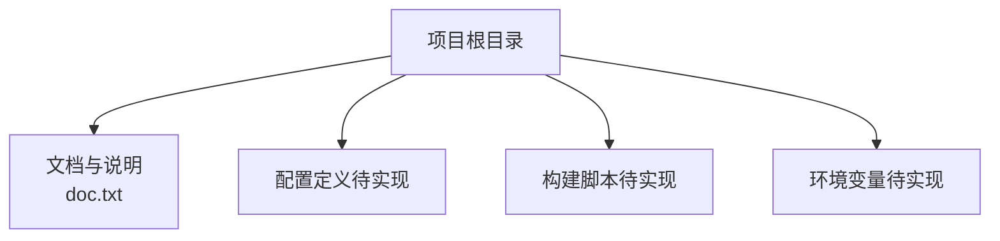
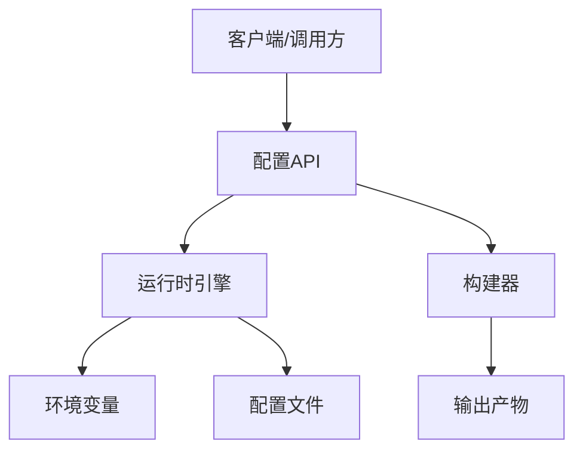
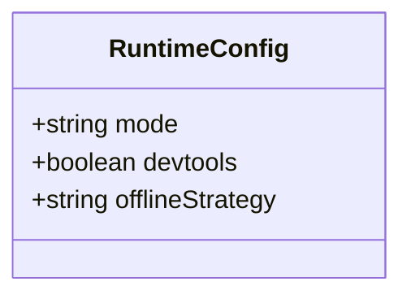
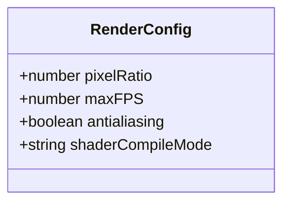
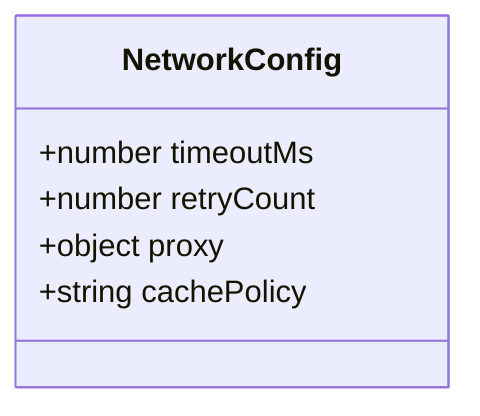
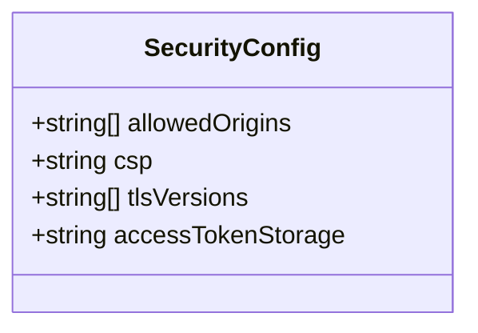
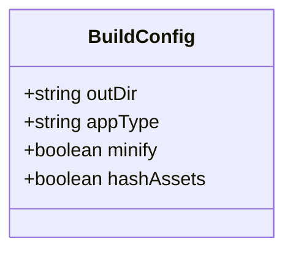
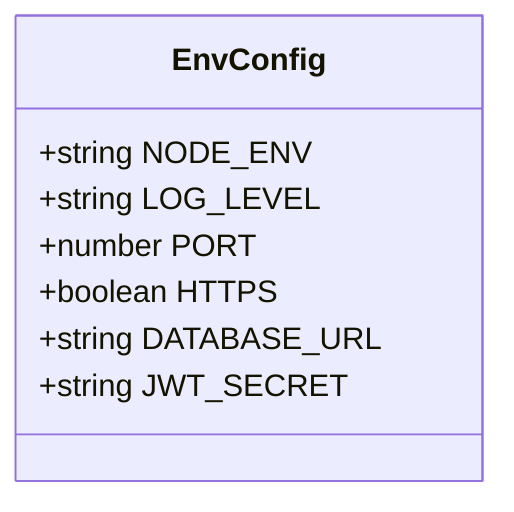
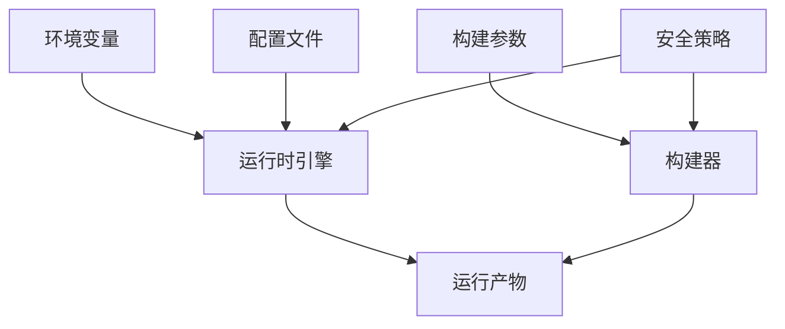

# 配置API

<cite>
**本文引用的文件**
- [doc.txt](file://doc.txt)
</cite>

## 目录
1. [简介](#简介)
2. [项目结构](#项目结构)
3. [核心组件](#核心组件)
4. [架构总览](#架构总览)
5. [详细组件分析](#详细组件分析)
6. [依赖关系分析](#依赖关系分析)
7. [性能考量](#性能考量)
8. [故障排查指南](#故障排查指南)
9. [结论](#结论)
10. [附录](#附录)

## 简介
本文件为 Leivue Runtime 的配置系统提供详细的 API 参考文档。内容覆盖运行时配置选项、构建配置参数与环境变量设置，说明各项配置的作用、取值范围、默认值与典型使用场景，并对浏览器模式与桌面原生模式的配置差异进行对比。同时提供配置验证规则与常见问题排查方法，帮助在不同部署环境下正确配置与使用。

## 项目结构
当前仓库仅包含一个文档文件，未包含源代码或配置定义文件。因此，本节以概念性结构说明为主，不直接映射到具体源码文件。

## 核心组件
以下为核心配置类别与建议字段清单（用于指导实际实现与文档化）。由于当前仓库未包含具体实现文件，以下内容为基于通用运行时配置实践的建议集合，便于后续在代码中落地。

- 运行模式配置
  - 模式标识：枚举类型，可选值包括“浏览器模式”“桌面原生模式”等
  - 启动参数：布尔开关，控制是否启用调试模式、开发工具等
  - 资源加载策略：字符串，如“本地优先”“远程优先”“离线缓存”
- 渲染参数调节
  - 像素密度：数值型，影响渲染清晰度与性能
  - 帧率限制：整数，限制最大帧率以平衡性能与能耗
  - 抗锯齿：布尔开关，开启/关闭抗锯齿
  - 着色器编译策略：枚举，如“即时编译”“预编译”
- 网络设置
  - 超时时间：数值型，单位毫秒
  - 重试次数：整数
  - 代理配置：对象，包含协议、主机、端口、认证等子项
  - 缓存策略：枚举，如“无缓存”“条件缓存”“强制缓存”
- 安全策略配置
  - CORS 允许来源：数组，支持通配符
  - 内容安全策略（CSP）：字符串，遵循 CSP 规范
  - TLS 版本与套件：数组，限定加密强度
  - 访问令牌存储：枚举，如“内存”“持久化存储”
- 构建配置参数
  - 输出目录：字符串路径
  - 资源打包策略：枚举，如“单页应用”“多页面应用”
  - 代码压缩与混淆：布尔开关
  - 资源哈希：布尔开关，用于缓存失效控制
- 环境变量设置
  - NODE_ENV：字符串，如 development、production
  - LOG_LEVEL：字符串，如 debug、info、warn、error
  - PORT：整数端口号
  - HTTPS：布尔开关
  - DATABASE_URL：连接字符串
  - JWT_SECRET：密钥字符串

章节来源
- [doc.txt](file://doc.txt)

## 架构总览
下图展示配置系统在运行时的整体交互：客户端通过配置接口读取/更新配置；构建阶段根据构建参数生成产物；运行时根据环境变量与配置文件决定行为。

## 详细组件分析

### 组件A：运行模式配置
- 作用：决定运行时的行为模式与资源访问策略
- 关键字段
  - mode：运行模式（浏览器/桌面原生）
  - devtools：是否启用开发者工具
  - offlineStrategy：离线资源加载策略
- 取值范围与默认值
  - mode：浏览器模式/桌面原生模式（默认浏览器模式）
  - devtools：true/false（默认 false）
  - offlineStrategy：本地优先/远程优先/离线缓存（默认本地优先）
- 使用场景
  - 浏览器模式：快速迭代、跨平台兼容
  - 桌面原生模式：高性能、系统级集成

章节来源
- [doc.txt](file://doc.txt)

### 组件B：渲染参数调节
- 作用：控制渲染质量与性能权衡
- 关键字段
  - pixelRatio：像素密度
  - maxFPS：最大帧率
  - antialiasing：抗锯齿
  - shaderCompileMode：着色器编译策略
- 取值范围与默认值
  - pixelRatio：大于 0 的数值（默认 1.0）
  - maxFPS：正整数（默认 60）
  - antialiasing：true/false（默认 true）
  - shaderCompileMode：即时编译/预编译（默认即时编译）
- 使用场景
  - 移动设备：降低帧率与关闭抗锯齿以节能
  - 桌面高分屏：提高像素密度提升清晰度

章节来源
- [doc.txt](file://doc.txt)

### 组件C：网络设置
- 作用：管理网络请求行为与缓存策略
- 关键字段
  - timeoutMs：超时时间（毫秒）
  - retryCount：重试次数
  - proxy：代理配置对象（协议、主机、端口、认证）
  - cachePolicy：缓存策略
- 取值范围与默认值
  - timeoutMs：正整数（默认 10000）
  - retryCount：非负整数（默认 3）
  - proxy：包含协议、主机、端口等子项的对象（默认禁用）
  - cachePolicy：无缓存/条件缓存/强制缓存（默认条件缓存）
- 使用场景
  - 企业内网：配置代理与严格缓存策略
  - 国际网络：增加超时与重试次数

章节来源
- [doc.txt](file://doc.txt)

### 组件D：安全策略配置
- 作用：约束跨域、加密与令牌存储策略
- 关键字段
  - allowedOrigins：允许来源数组
  - csp：内容安全策略字符串
  - tlsVersions：TLS 版本数组
  - accessTokenStorage：令牌存储方式
- 取值范围与默认值
  - allowedOrigins：字符串数组（默认允许同源）
  - csp：符合规范的策略字符串（默认宽松但安全）
  - tlsVersions：版本数组（默认包含现代安全版本）
  - accessTokenStorage：内存/持久化存储（默认内存）
- 使用场景
  - 生产环境：严格来源与强加密
  - 开发环境：宽松策略便于联调

章节来源
- [doc.txt](file://doc.txt)

### 组件E：构建配置参数
- 作用：控制构建流程与产物特性
- 关键字段
  - outDir：输出目录
  - appType：应用类型（单页/多页面）
  - minify：代码压缩与混淆
  - hashAssets：资源哈希
- 取值范围与默认值
  - outDir：有效目录路径（默认 dist）
  - appType：单页应用/多页面应用（默认单页应用）
  - minify：true/false（默认 true）
  - hashAssets：true/false（默认 true）
- 使用场景
  - 生产发布：开启压缩与资源哈希
  - 开发调试：关闭压缩以便调试

章节来源
- [doc.txt](file://doc.txt)

### 组件F：环境变量设置
- 作用：在启动前注入全局运行参数
- 关键变量
  - NODE_ENV：运行环境
  - LOG_LEVEL：日志级别
  - PORT：服务端口
  - HTTPS：是否启用 HTTPS
  - DATABASE_URL：数据库连接串
  - JWT_SECRET：密钥
- 取值范围与默认值
  - NODE_ENV：development/production/test（默认 development）
  - LOG_LEVEL：debug/info/warn/error（默认 info）
  - PORT：1–65535（默认 3000）
  - HTTPS：true/false（默认 false）
  - DATABASE_URL：合法连接串（默认空）
  - JWT_SECRET：字符串（默认空）
- 使用场景
  - Docker 容器：通过环境变量注入配置
  - CI/CD：按环境切换日志与端口

章节来源
- [doc.txt](file://doc.txt)

## 依赖关系分析
下图展示配置系统内部的依赖关系：运行时依赖于环境变量与配置文件；构建器依赖构建参数；运行时与构建器共同受安全策略约束。

## 性能考量
- 渲染参数
  - 降低帧率与关闭抗锯齿可显著减少 GPU/CPU 占用，适合移动设备
  - 提高像素密度会增加渲染开销，需结合目标设备分辨率权衡
- 网络设置
  - 合理设置超时与重试次数，避免阻塞主线程
  - 在弱网环境下启用更激进的缓存策略
- 安全策略
  - 生产环境启用严格的 TLS 与来源校验，避免降级攻击面
- 构建优化
  - 启用压缩与资源哈希，提升加载速度与缓存命中率

## 故障排查指南
- 配置项无效
  - 检查配置优先级：环境变量 > 配置文件 > 默认值
  - 确认字段拼写与数据类型一致
- 运行模式异常
  - 浏览器模式下无法访问本地资源：确认 offlineStrategy 与 CORS 设置
  - 桌面原生模式下窗口尺寸异常：检查像素密度与渲染参数
- 网络请求失败
  - 调整超时与重试次数；核对代理配置与防火墙策略
- 安全策略导致访问被拒
  - 校验 allowedOrigins 与 CSP 是否过于严格
  - 确认 TLS 版本与套件是否与服务端匹配
- 构建产物异常
  - 检查构建参数与输出目录权限
  - 确认资源哈希与缓存策略是否影响更新

## 结论
本配置API文档提供了运行时、渲染、网络、安全、构建与环境变量的系统化参考。建议在实现阶段将上述字段与默认值固化为配置模型，并配套自动化验证与示例配置文件，以降低配置复杂度并提升可维护性。

## 附录
- 示例：浏览器模式配置要点
  - 关闭 devtools 以减少性能开销
  - 使用“本地优先”离线策略提升首开体验
  - 启用条件缓存与资源哈希
- 示例：桌面原生模式配置要点
  - 提升像素密度与帧率上限
  - 启用持久化令牌存储与强加密
  - 配置代理与严格来源校验