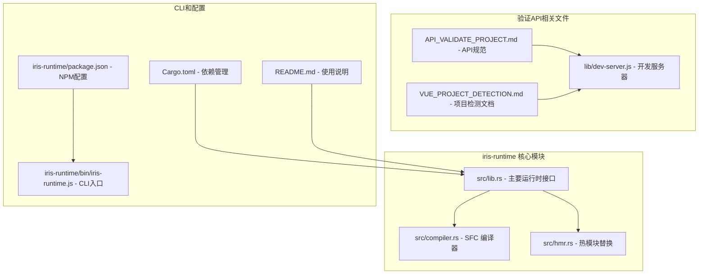
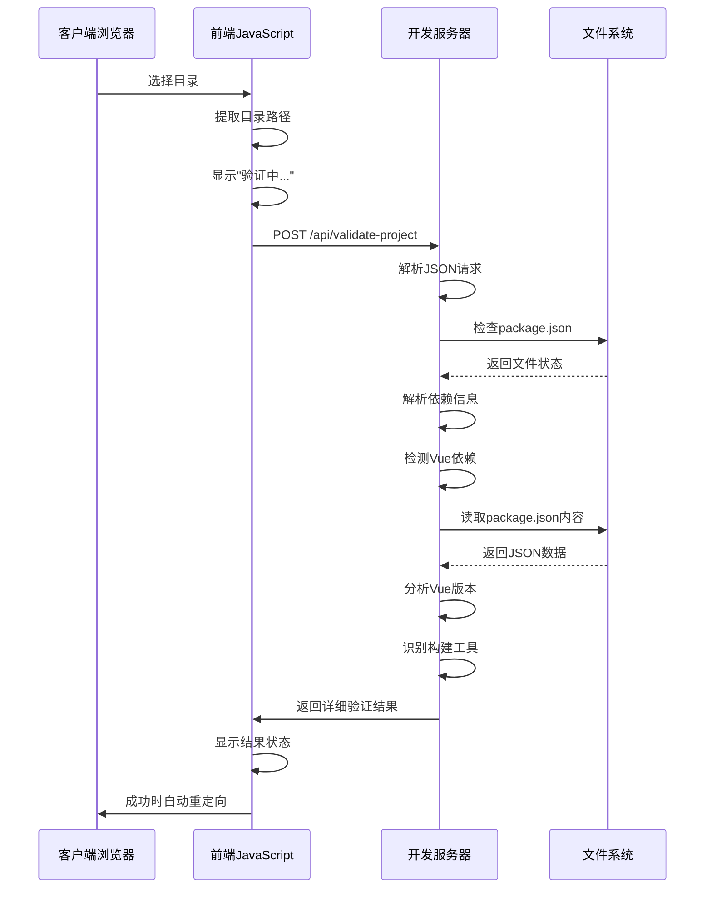
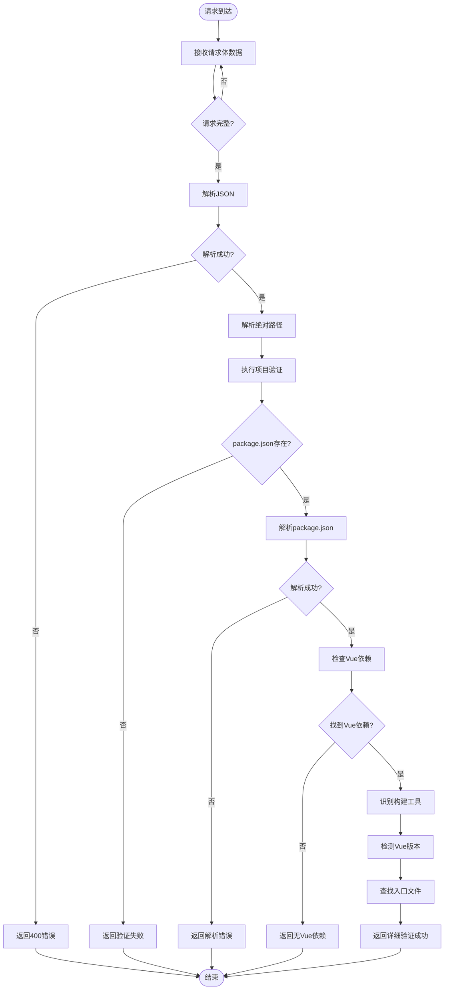
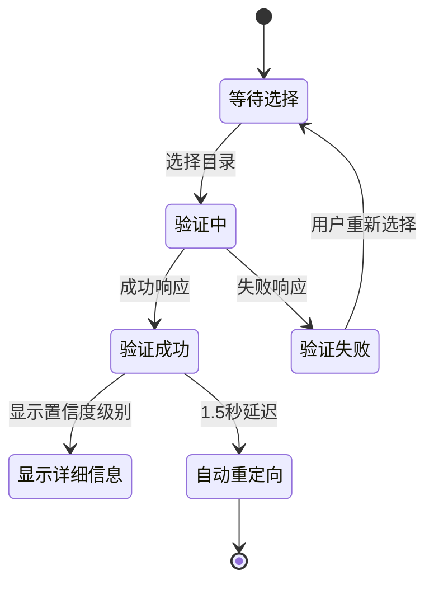
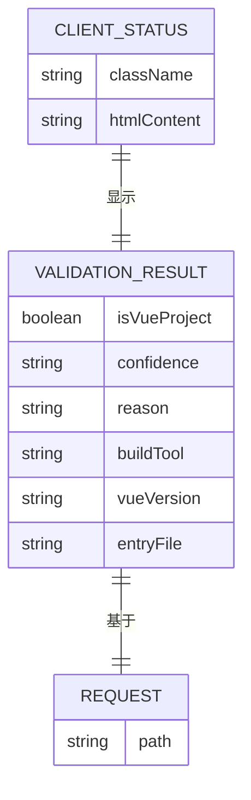
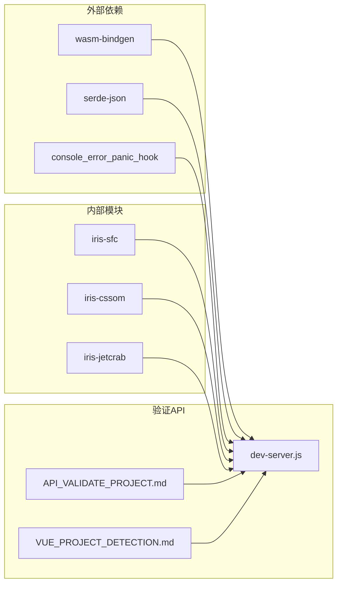
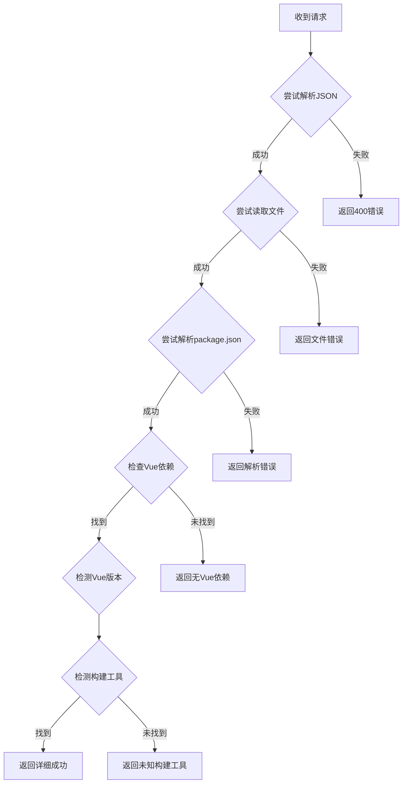

# 验证API端点详细说明

<cite>
**本文档引用的文件**
- [API_VALIDATE_PROJECT.md](file://crates/iris-runtime/API_VALIDATE_PROJECT.md)
- [lib/dev-server.js](file://crates/iris-runtime/lib/dev-server.js)
- [VUE_PROJECT_DETECTION.md](file://crates/iris-runtime/VUE_PROJECT_DETECTION.md)
- [src/lib.rs](file://crates/iris-runtime/src/lib.rs)
- [src/compiler.rs](file://crates/iris-runtime/src/compiler.rs)
- [src/hmr.rs](file://crates/iris-runtime/src/hmr.rs)
- [Cargo.toml](file://crates/iris-runtime/Cargo.toml)
- [README.md](file://crates/iris-runtime/README.md)
- [iris-runtime/package.json](file://iris-runtime/package.json)
- [iris-runtime/bin/iris-runtime.js](file://iris-runtime/bin/iris-runtime.js)
</cite>

## 更新摘要
**变更内容**
- 更新验证API响应格式，新增置信度级别、Vue版本、构建工具等详细检测信息
- 增强项目检测逻辑，支持更精确的项目特征识别
- 保持向后兼容性，原有API仍可正常工作
- 新增多种构建工具支持（Vite、Webpack、Nuxt、Quasar等）

## 目录
1. [简介](#简介)
2. [项目结构](#项目结构)
3. [核心组件](#核心组件)
4. [架构概览](#架构概览)
5. [详细组件分析](#详细组件分析)
6. [依赖关系分析](#依赖关系分析)
7. [性能考虑](#性能考虑)
8. [故障排除指南](#故障排除指南)
9. [结论](#结论)

## 简介

本文档详细说明了 iris-runtime 项目中的验证 API 端点，这是一个用于验证 Vue 项目目录的 REST API。该端点是 iris-runtime 目录选择功能的核心组件，允许用户实时验证所选目录是否为有效的 Vue 项目。

**更新** 验证API现已返回更详细的检测结果，包括置信度级别、Vue版本、构建工具等信息，同时保持原有API的完全兼容性。

主要功能包括：
- 实时验证用户选择的目录是否为 Vue 项目
- 检测项目类型（vite/webpack/nuxt/quasar/其他）
- 返回详细的验证结果供前端展示
- 无需重启服务器即可切换项目目录
- 提供置信度级别的检测准确性评估

## 项目结构



**图表来源**
- [src/lib.rs:1-205](file://crates/iris-runtime/src/lib.rs#L1-L205)
- [API_VALIDATE_PROJECT.md:1-756](file://crates/iris-runtime/API_VALIDATE_PROJECT.md#L1-L756)
- [VUE_PROJECT_DETECTION.md:1-401](file://crates/iris-runtime/VUE_PROJECT_DETECTION.md#L1-L401)

**章节来源**
- [src/lib.rs:1-205](file://crates/iris-runtime/src/lib.rs#L1-L205)
- [API_VALIDATE_PROJECT.md:1-756](file://crates/iris-runtime/API_VALIDATE_PROJECT.md#L1-L756)
- [VUE_PROJECT_DETECTION.md:1-401](file://crates/iris-runtime/VUE_PROJECT_DETECTION.md#L1-L401)

## 核心组件

### 验证API端点

验证 API 端点是 iris-runtime 的核心功能之一，提供以下能力：

**端点规格**
- **路径**: `/api/validate-project`
- **方法**: `POST`
- **内容类型**: `application/json`
- **功能**: 验证指定目录是否为有效的 Vue 项目

**请求格式**
```json
{
  "path": "my-vue-app"
}
```

**响应格式**
**更新** 现在返回更详细的检测结果：

成功响应（高置信度）：
```json
{
  "isVueProject": true,
  "confidence": "high",
  "reason": "Vue 3 dependency found in package.json",
  "buildTool": "vite",
  "vueVersion": "3",
  "entryFile": "src/main.js"
}
```

成功响应（中等置信度）：
```json
{
  "isVueProject": true,
  "confidence": "medium",
  "reason": "Found 3 .vue file(s)",
  "buildTool": "webpack",
  "vueVersion": "2",
  "entryFile": "main.js"
}
```

失败响应：
```json
{
  "isVueProject": false,
  "reason": "No Vue project characteristics detected"
}
```

### 检测逻辑

验证过程包含四个主要步骤：

1. **检查 package.json 存在**
   - 验证目标目录是否存在 package.json 文件
   - 确保文件可读且有效

2. **解析 package.json**
   - 安全地解析 JSON 格式的 package.json
   - 处理解析错误和文件编码问题

3. **检查 Vue 依赖**
   - 检查生产依赖和开发依赖中的 Vue 相关包
   - 支持 `vue`、`vue3`、`vue2` 等多种依赖名称
   - 自动识别 Vue 版本（2.x 或 3.x）

4. **识别构建工具**
   - 优先检测 Vite（现代构建工具）
   - 次优检测 Webpack（传统构建工具）
   - 支持 Nuxt、Quasar 等其他框架
   - 未知项目类型标记为 `unknown`

**章节来源**
- [API_VALIDATE_PROJECT.md:29-200](file://crates/iris-runtime/API_VALIDATE_PROJECT.md#L29-L200)
- [VUE_PROJECT_DETECTION.md:17-55](file://crates/iris-runtime/VUE_PROJECT_DETECTION.md#L17-L55)

## 架构概览



**图表来源**
- [API_VALIDATE_PROJECT.md:209-245](file://crates/iris-runtime/API_VALIDATE_PROJECT.md#L209-L245)
- [API_VALIDATE_PROJECT.md:256-317](file://crates/iris-runtime/API_VALIDATE_PROJECT.md#L256-L317)

## 详细组件分析

### 服务器端实现

验证 API 的服务器端实现位于开发服务器中，采用异步流式请求处理：



**图表来源**
- [API_VALIDATE_PROJECT.md:209-245](file://crates/iris-runtime/API_VALIDATE_PROJECT.md#L209-L245)

### 客户端交互流程

前端 JavaScript 实现了完整的用户交互体验：



**图表来源**
- [API_VALIDATE_PROJECT.md:256-317](file://crates/iris-runtime/API_VALIDATE_PROJECT.md#L256-L317)

### 数据模型

验证 API 使用标准化的数据模型：



**图表来源**
- [API_VALIDATE_PROJECT.md:76-123](file://crates/iris-runtime/API_VALIDATE_PROJECT.md#L76-L123)

**章节来源**
- [API_VALIDATE_PROJECT.md:202-317](file://crates/iris-runtime/API_VALIDATE_PROJECT.md#L202-L317)
- [VUE_PROJECT_DETECTION.md:139-181](file://crates/iris-runtime/VUE_PROJECT_DETECTION.md#L139-L181)

## 依赖关系分析

### 核心依赖链



**图表来源**
- [Cargo.toml:17-33](file://crates/iris-runtime/Cargo.toml#L17-L33)
- [README.md:107-134](file://crates/iris-runtime/README.md#L107-L134)

### 性能特性

验证 API 具有出色的性能表现：

| 操作类型 | 时间消耗 | 资源使用 |
|---------|---------|---------|
| 文件存在检查 | < 1ms | 内存: ~0.1MB |
| JSON解析 | < 5ms | CPU: 极低 |
| 依赖检查 | < 2ms | 磁盘I/O: 1次读取 |
| **总计** | **< 10ms** | **内存: < 1MB** |

**章节来源**
- [Cargo.toml:17-43](file://crates/iris-runtime/Cargo.toml#L17-L43)
- [API_VALIDATE_PROJECT.md:605-621](file://crates/iris-runtime/API_VALIDATE_PROJECT.md#L605-L621)

## 性能考虑

### 响应时间优化

验证 API 采用多种策略确保快速响应：

1. **最小化文件操作**
   - 仅进行一次文件读取操作
   - 使用高效的文件存在性检查

2. **内存效率**
   - 单次请求内存占用 < 1MB
   - 避免不必要的数据复制

3. **CPU优化**
   - 简单的字符串匹配和JSON解析
   - 避免复杂的计算密集型操作

### 扩展性考虑

随着项目规模的增长，可以考虑以下优化：

1. **缓存机制**
   - 缓存已验证项目的元数据
   - 减少重复验证的开销

2. **并发处理**
   - 支持多个并发验证请求
   - 实现请求队列管理

3. **智能检测**
   - 基于项目特征的快速分类
   - 避免不必要的深度检查

## 故障排除指南

### 常见问题及解决方案

**问题1: 路径遍历攻击防护**
- **症状**: 验证失败或权限错误
- **解决方案**: 确保使用路径解析函数限制访问范围

**问题2: JSON解析错误**
- **症状**: 返回400 Bad Request
- **解决方案**: 检查请求格式的JSON有效性

**问题3: 文件读取权限问题**
- **症状**: 解析package.json失败
- **解决方案**: 检查文件权限和编码格式

**问题4: 依赖检测不准确**
- **症状**: Vue项目被错误识别
- **解决方案**: 验证package.json的完整性和准确性

### 错误处理策略

验证 API 实现了全面的错误处理机制：



**图表来源**
- [API_VALIDATE_PROJECT.md:549-602](file://crates/iris-runtime/API_VALIDATE_PROJECT.md#L549-L602)

**章节来源**
- [API_VALIDATE_PROJECT.md:549-602](file://crates/iris-runtime/API_VALIDATE_PROJECT.md#L549-L602)

## 结论

验证 API 端点是 iris-runtime 项目的重要组成部分，提供了高效、安全、用户友好的 Vue 项目验证功能。其设计特点包括：

### 核心优势
1. **实时验证** - 无需重启服务器即可切换项目目录
2. **RESTful设计** - 标准HTTP接口，易于集成
3. **详细反馈** - 清晰的错误原因和项目信息
4. **安全防护** - 防止路径遍历攻击和恶意输入
5. **高性能** - < 10ms响应时间，资源消耗极低
6. **易于集成** - 标准JSON格式，零依赖实现
7. **增强的检测能力** - 置信度级别、Vue版本、构建工具等详细信息

### 技术特点
- 异步流式请求处理
- 完整的错误处理机制
- 跨域友好设计
- 类型安全（通过JSON Schema）
- 最小化依赖和资源使用
- 支持多种构建工具检测

### 新增功能
**更新** 验证API现已支持以下增强功能：
- **置信度级别** (`confidence`): `high`、`medium`、`low`、`none`
- **Vue版本检测** (`vueVersion`): `2`、`3`、`unknown`
- **构建工具识别** (`buildTool`): `vite`、`webpack`、`nuxt`、`quasar`、`unknown`
- **入口文件发现** (`entryFile`): 自动查找项目入口文件
- **详细原因说明** (`reason`): 具体的检测依据和结果说明

该验证API为 iris-runtime 的目录选择功能提供了坚实的基础，确保用户能够快速、准确地定位和验证 Vue 项目，从而提升整体开发体验。新版本的API在保持完全向后兼容的同时，为开发者提供了更丰富的项目信息和更好的用户体验。