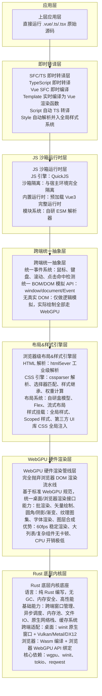
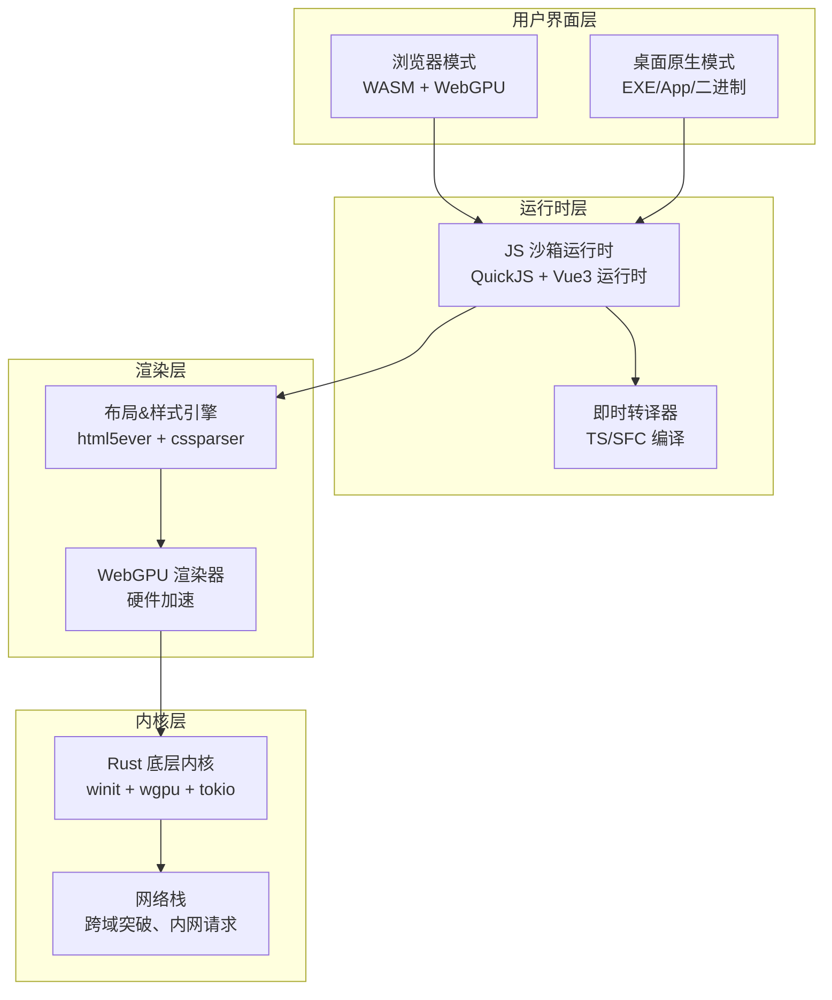
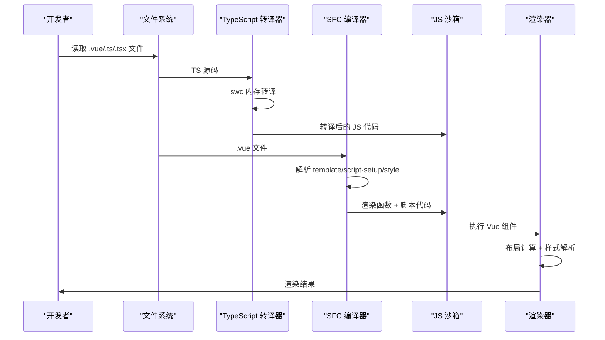
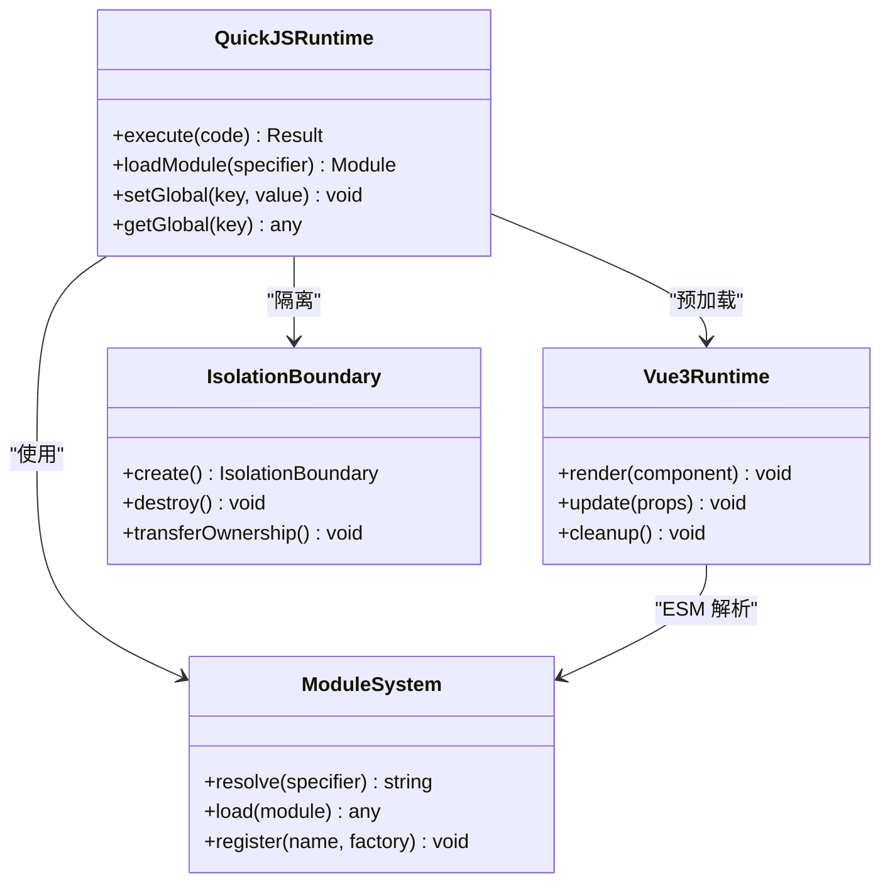
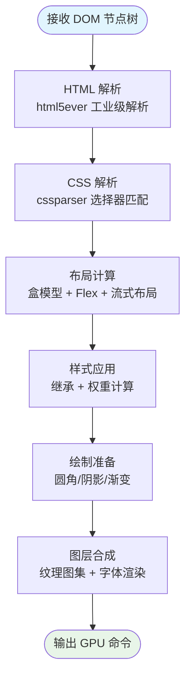
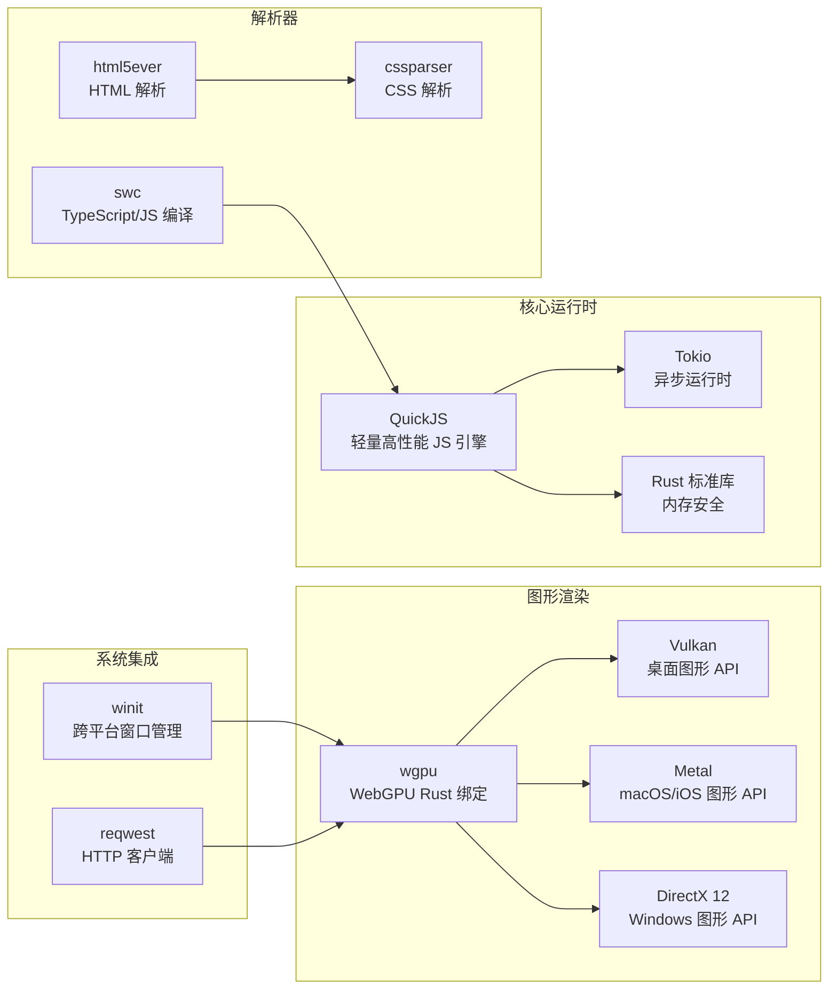

# 快速开始

<cite>
**本文引用的文件**
- [doc.txt](file://doc.txt)
- [todo.txt](file://todo.txt)
</cite>

## 目录
1. [简介](#简介)
2. [项目结构](#项目结构)
3. [核心组件](#核心组件)
4. [架构总览](#架构总览)
5. [详细组件分析](#详细组件分析)
6. [依赖分析](#依赖分析)
7. [性能考虑](#性能考虑)
8. [故障排除指南](#故障排除指南)
9. [结论](#结论)
10. [附录](#附录)

## 简介
Leivue Runtime 是一个基于 Rust 和 WebGPU 的下一代无构建前端运行时引擎。其核心定位是：一套完全脱离 Node、浏览器 DOM、编译打包的原生双端运行引擎，能够零编译直接执行 Vue3 + TypeScript，并且全兼容 Element Plus、Ant Design Vue 等第三方 UI 库。该引擎采用七层分层架构，自上而下包括应用层、即时转译层、JS 沙箱运行时层、跨端统一抽象层、浏览器级布局&样式引擎层、WebGPU 硬件渲染管线层、Rust 底层内核底座。

该引擎的主要目标是：
- 消灭前端工程化，突破浏览器沙箱限制
- 为 Vue 生态提供高性能跨端底座
- 支持浏览器 Wasm 模式和独立桌面原生模式（双端同一套内核）
- 实现零编译、零依赖、零配置的开发体验

## 项目结构
根据项目文档，Leivue Runtime 采用七层分层架构，每层都有明确的职责和边界：

**图表来源**
- [doc.txt:7-22](file://doc.txt#L7-L22)
- [doc.txt:23-29](file://doc.txt#L23-L29)

**章节来源**
- [doc.txt:7-22](file://doc.txt#L7-L22)
- [doc.txt:23-29](file://doc.txt#L23-L29)

## 核心组件
Leivue Runtime 的核心组件包括：

### 1. 即时转译层
- TypeScript 即时转译：基于 Rust swc，内存内实时 TS→JS，支持泛型、装饰器、TSX
- Vue SFC 即时编译：官方 Rust 库解析.vue，自动拆分 template/script-setup/style
- Template 实时编译为 Vue 渲染函数
- Script 自动 TS 转译
- Style 自动解析并入全局样式系统

### 2. JS 沙箱运行时层
- JS 引擎：QuickJS（轻量高性能、Wasm 友好、Rust 深度绑定）
- 沙箱隔离：与宿主环境完全隔离，安全隔离脚本
- 内置运行时：预加载 Vue3 完整运行时（runtime-core/runtime-dom）
- 模块系统：自研 ESM 解析器，支持 import/export、第三方包引入

### 3. 跨端统一抽象层
- 统一事件系统：鼠标、键盘、滚动、点击命中检测
- 统一 BOM/DOM 模拟 API：window/document/Event
- 无真实 DOM：仅做逻辑模拟，实际绘制全部走 WebGPU

### 4. 布局&样式引擎层
- HTML 解析：html5ever 工业级解析，生成标准 DOM 节点树
- CSS 引擎：cssparser 解析、选择器匹配、样式继承、权重计算
- 布局系统：自研盒模型、Flex、流式布局，对标 W3C 标准
- 样式挂载：全局样式、Scoped 样式、第三方 UI 库 CSS 全局注入

### 5. WebGPU 硬件渲染层
- 完全抛弃浏览器 DOM 渲染流水线，全自研 GPU 渲染
- 基于标准 WebGPU 规范，统一桌面/浏览器渲染接口
- 能力：批渲染、矢量绘制、圆角/阴影/渐变、纹理图集、字体渲染、图层合成
- 优势：60fps 稳定渲染、大列表/复杂组件无卡顿、CPU 开销极低

### 6. Rust 底层内核层
- 语言：纯 Rust 编写，无 GC、内存安全、高性能
- 基础能力：跨端窗口管理、异步调度、内存池、文件 IO、原生网络栈、缓存系统
- 跨端适配：桌面：winit 原生窗口 + Vulkan/Metal/DX12；浏览器：Wasm 编译 + 浏览器 WebGPU API 绑定
- 核心依赖：wgpu、winit、tokio、reqwest

**章节来源**
- [doc.txt:51-64](file://doc.txt#L51-L64)
- [doc.txt:46-51](file://doc.txt#L46-L51)
- [doc.txt:41-46](file://doc.txt#L41-L46)
- [doc.txt:35-41](file://doc.txt#L35-L41)
- [doc.txt:30-35](file://doc.txt#L30-L35)
- [doc.txt:23-29](file://doc.txt#L23-L29)

## 架构总览
Leivue Runtime 的架构设计体现了高度的解耦和模块化：

**图表来源**
- [doc.txt:76-82](file://doc.txt#L76-L82)
- [doc.txt:27-28](file://doc.txt#L27-L28)
- [doc.txt:46-51](file://doc.txt#L46-L51)

**章节来源**
- [doc.txt:76-82](file://doc.txt#L76-L82)
- [doc.txt:27-28](file://doc.txt#L27-L28)

## 详细组件分析

### 即时转译层工作流程
即时转译层是 Leivue Runtime 的核心创新之一，实现了真正的零编译运行：

**图表来源**
- [doc.txt:52-60](file://doc.txt#L52-L60)

### JS 沙箱运行时架构
JS 沙箱运行时提供了安全隔离的执行环境：

**图表来源**
- [doc.txt:46-51](file://doc.txt#L46-L51)

**章节来源**
- [doc.txt:52-60](file://doc.txt#L52-L60)
- [doc.txt:46-51](file://doc.txt#L46-L51)

### 布局&样式引擎处理流程
布局和样式引擎复刻了标准浏览器的 CSS 体系：

**图表来源**
- [doc.txt:35-41](file://doc.txt#L35-L41)

**章节来源**
- [doc.txt:35-41](file://doc.txt#L35-L41)

## 依赖分析
Leivue Runtime 的技术栈体现了高性能和跨平台的特点：

**图表来源**
- [doc.txt:29](file://doc.txt#L29)
- [doc.txt:46](file://doc.txt#L46)

**章节来源**
- [doc.txt:29](file://doc.txt#L29)
- [doc.txt:46](file://doc.txt#L46)

## 性能考虑
Leivue Runtime 在性能方面具有显著优势：

### 渲染性能优化
- **硬件加速渲染**：基于 WebGPU 的 GPU 渲染，避免了传统 DOM 渲染的 CPU 开销
- **稳定帧率**：60fps 稳定渲染，大列表和复杂组件无卡顿
- **高效布局**：自研盒模型和 Flex 布局，对标 W3C 标准
- **批量渲染**：支持批渲染和图层合成，减少状态切换开销

### 内存管理
- **零垃圾回收**：纯 Rust 编写，无 GC 开销
- **内存池**：高效的内存分配和回收机制
- **跨端一致**：桌面和浏览器模式使用相同的内存管理策略

### 启动速度
- **零编译启动**：直接运行源码，无需构建过程
- **模块懒加载**：按需加载组件和资源
- **缓存系统**：内置缓存机制，提升重复访问性能

## 故障排除指南

### 环境准备问题
1. **Rust 工具链安装失败**
   - 确保安装了最新版本的 Rust 工具链
   - 检查网络连接，必要时使用国内镜像源
   - 验证 `rustc` 和 `cargo` 命令可用性

2. **WebGPU 支持问题**
   - 浏览器模式需要支持 WebGPU 的现代浏览器
   - 桌面模式需要支持对应图形 API 的系统
   - 检查图形驱动是否为最新版本

3. **QuickJS 模块加载失败**
   - 确认 ES 模块解析器正常工作
   - 检查模块路径和导入语法
   - 验证第三方库的兼容性

### 性能相关问题
1. **渲染卡顿**
   - 检查是否有过多的重绘和回流
   - 优化组件层级结构
   - 减少不必要的样式计算

2. **内存占用过高**
   - 检查是否存在内存泄漏
   - 优化大型列表的虚拟化
   - 合理使用缓存策略

3. **启动时间过长**
   - 确认没有阻塞的同步操作
   - 优化资源加载顺序
   - 使用懒加载策略

### 开发环境问题
1. **热更新失效**
   - 检查文件监听机制
   - 确认文件系统权限
   - 验证转译器状态

2. **样式不生效**
   - 检查 CSS 作用域设置
   - 验证样式优先级
   - 确认第三方库样式注入

**章节来源**
- [doc.txt:88-92](file://doc.txt#L88-L92)

## 结论
Leivue Runtime 代表了前端运行时技术的重大突破，通过七层分层架构实现了真正的零编译运行。其核心优势包括：

1. **革命性的开发体验**：零编译、零依赖、零配置的开发模式
2. **卓越的性能表现**：基于 WebGPU 的硬件加速渲染，60fps 稳定帧率
3. **强大的生态兼容性**：完整支持 Vue3 生态和主流 UI 组件库
4. **跨平台运行能力**：浏览器 Wasm 模式和桌面原生模式双端统一

对于新手开发者而言，Leivue Runtime 提供了最短的学习曲线和最快的应用体验。通过本文档的快速开始指南，您可以在最短时间内体验到项目的核心功能，并开始构建高性能的跨端应用。

## 附录

### 开发计划概览
根据项目规划，当前处于早期开发阶段，主要任务包括：

1. **制定详细的开发计划和项目结构**
2. **搭建 Rust 项目骨架（初始化 Cargo workspace、分层模块等）**
3. **实现某个具体模块（如 WebGPU 渲染管线、SFC 编译器、JS 沙箱运行时等）**
4. **审查或优化现有架构设计**
5. **其他需求**

### 技术选型理由
- **Rust 语言**：提供内存安全和高性能，适合底层系统开发
- **WebGPU**：标准化的 GPU 编程接口，跨平台兼容性好
- **QuickJS**：轻量级 JavaScript 引擎，适合沙箱环境
- **swc**：高性能的 TypeScript/JavaScript 编译器
- **winit**：跨平台窗口管理，支持多操作系统

### 未来发展方向
- 完善各层模块的实现和测试
- 优化性能和稳定性
- 扩展生态系统支持
- 提供更丰富的开发工具链