# JS沙箱运行时

<cite>
**本文档引用的文件**
- [doc.txt](file://doc.txt)
- [todo.txt](file://todo.txt)
</cite>

## 目录
1. [引言](#引言)
2. [项目结构](#项目结构)
3. [核心组件](#核心组件)
4. [架构概览](#架构概览)
5. [详细组件分析](#详细组件分析)
6. [依赖关系分析](#依赖关系分析)
7. [性能考虑](#性能考虑)
8. [故障排除指南](#故障排除指南)
9. [结论](#结论)

## 引言

Leivue Runtime是一个革命性的前端运行时引擎，专为在Rust+WebGPU环境中提供高性能、零编译的Vue3应用执行能力。该项目的核心目标是消除前端工程化复杂性，突破浏览器沙箱限制，为Vue生态系统提供一个高性能的跨端执行底座。

该JS沙箱运行时层位于整个七层架构的中间位置，承担着独立隔离执行环境的关键职责。它通过QuickJS引擎实现JavaScript的高性能执行，同时确保与宿主环境的完全隔离，为Vue3应用提供安全可靠的运行环境。

## 项目结构

Leivue Runtime采用七层分层架构设计，每层都有明确的职责边界和解耦机制：

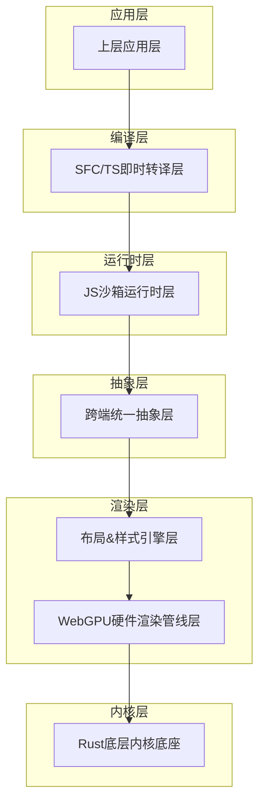

**图表来源**
- [doc.txt:7-22](file://doc.txt#L7-L22)

**章节来源**
- [doc.txt:7-22](file://doc.txt#L7-L22)

## 核心组件

### QuickJS引擎集成

JS沙箱运行时层的核心是QuickJS引擎，这是一个轻量级、高性能的JavaScript引擎，具有以下关键特性：

- **Wasm友好**：专门为WebAssembly环境优化，适合浏览器模式运行
- **Rust深度绑定**：与Rust内核实现紧密集成，提供高效的内存管理和性能
- **轻量级设计**：相比V8等大型引擎，QuickJS更加轻量，启动速度快
- **标准兼容**：支持现代JavaScript标准，确保Vue3应用的正常运行

### 沙箱隔离机制

系统实现了多层次的安全隔离机制：

- **进程级隔离**：JavaScript代码在独立的执行环境中运行
- **内存隔离**：严格的内存边界控制，防止恶意代码访问宿主内存
- **API隔离**：仅暴露必要的BOM/DOM模拟API，避免完整的DOM操作
- **网络隔离**：可选的网络访问控制，支持安全的网络通信

### Vue3运行时预加载

为了实现零编译运行，系统内置了完整的Vue3运行时：

- **runtime-core**：Vue3的核心运行时功能
- **runtime-dom**：DOM相关的核心功能
- **即时预加载**：在应用启动前完成运行时的预加载和初始化
- **内存优化**：智能的内存管理，确保运行时的高效使用

### 自研ESM解析器

系统实现了自研的ES模块解析器，支持现代JavaScript模块系统：

- **import/export语法**：完全支持ES6模块的标准语法
- **第三方包引入**：支持从npm或其他源引入第三方包
- **模块解析算法**：自定义的模块解析和依赖管理机制
- **动态加载**：支持按需加载和懒加载机制

**章节来源**
- [doc.txt:46-50](file://doc.txt#L46-L50)

## 架构概览

JS沙箱运行时层在整个系统架构中扮演着关键的桥梁角色：

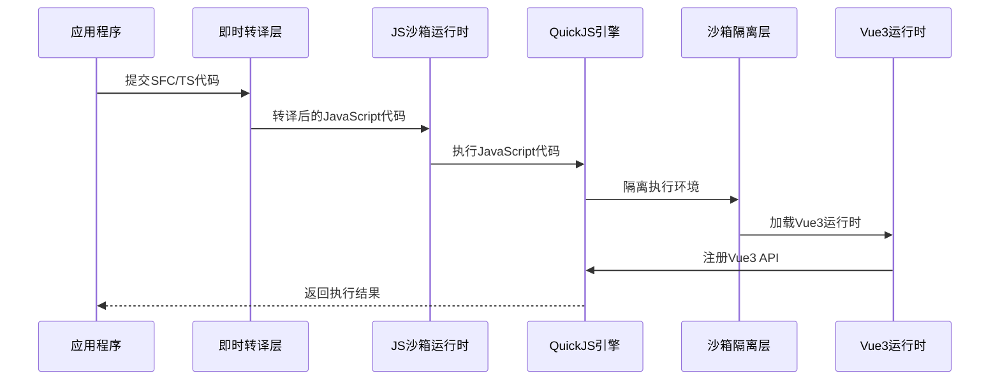

**图表来源**
- [doc.txt:46-50](file://doc.txt#L46-L50)

### 数据流分析

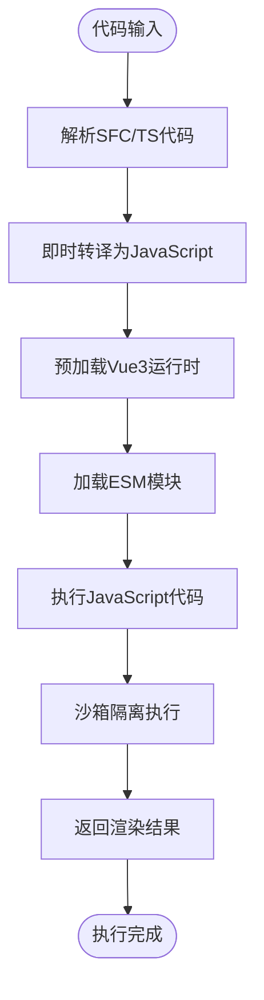

**图表来源**
- [doc.txt:46-50](file://doc.txt#L46-L50)

## 详细组件分析

### QuickJS引擎集成实现

#### 引擎初始化流程

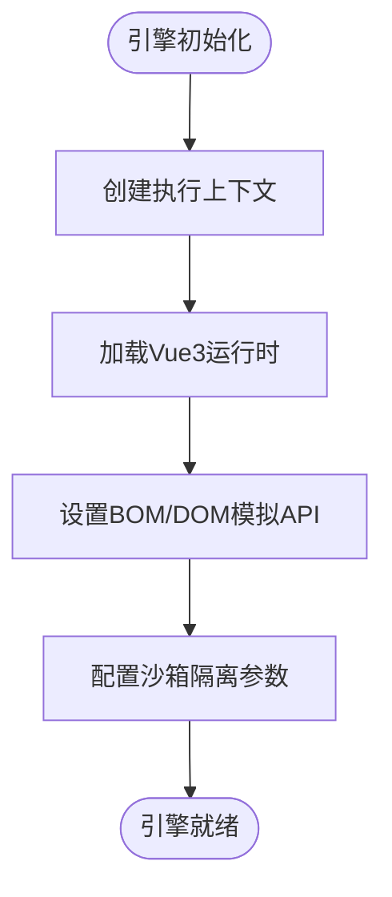

**图表来源**
- [doc.txt:47](file://doc.txt#L47)

#### 内存管理策略

QuickJS引擎在Rust环境中采用了特殊的内存管理策略：

- **堆栈分配**：优先使用栈内存，减少GC压力
- **对象池**：复用频繁创建的对象，降低内存分配开销
- **垃圾回收协调**：与Rust的内存管理系统协调工作
- **内存监控**：实时监控内存使用情况，防止内存泄漏

### 沙箱隔离机制

#### 隔离层次设计

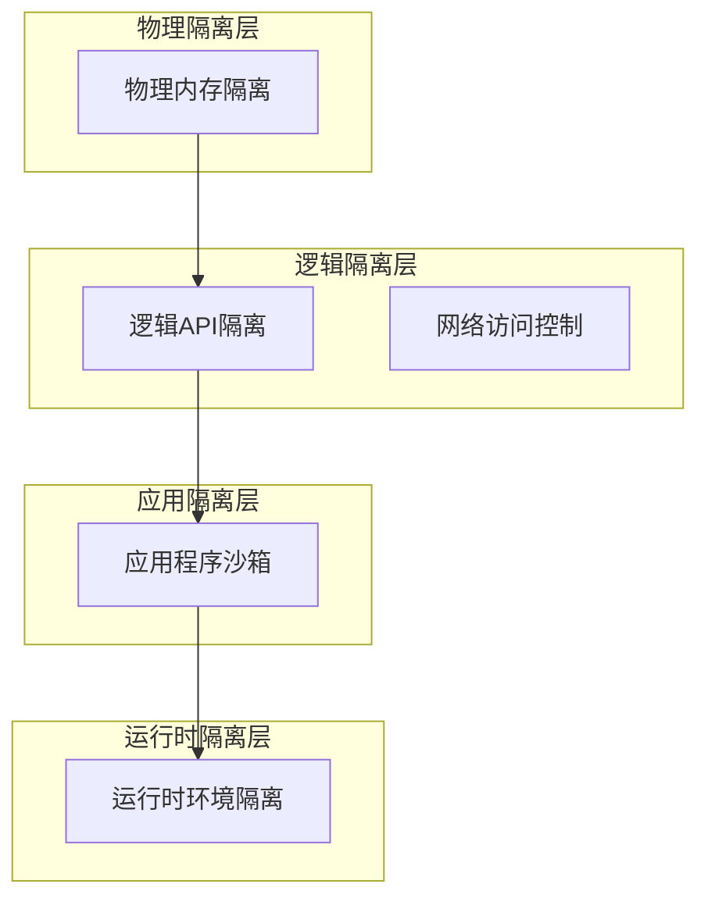

**图表来源**
- [doc.txt:48](file://doc.txt#L48)

#### API访问控制

沙箱运行时实现了精细的API访问控制：

- **受限BOM API**：仅提供必要的window/document对象
- **事件系统模拟**：实现基本的事件处理机制
- **网络API限制**：可配置的网络访问策略
- **文件系统隔离**：虚拟化的文件系统接口

### Vue3运行时预加载机制

#### 预加载策略

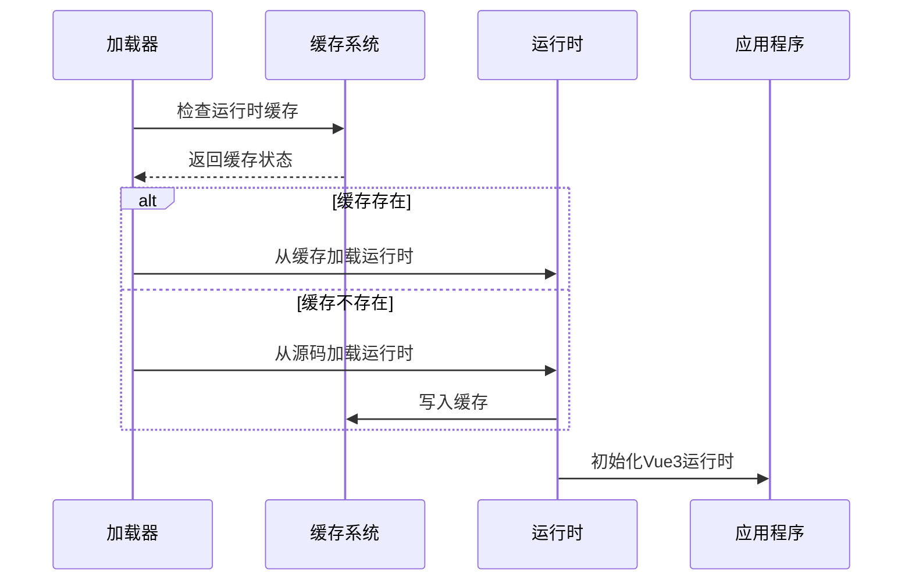

**图表来源**
- [doc.txt:49](file://doc.txt#L49)

#### 运行时初始化流程

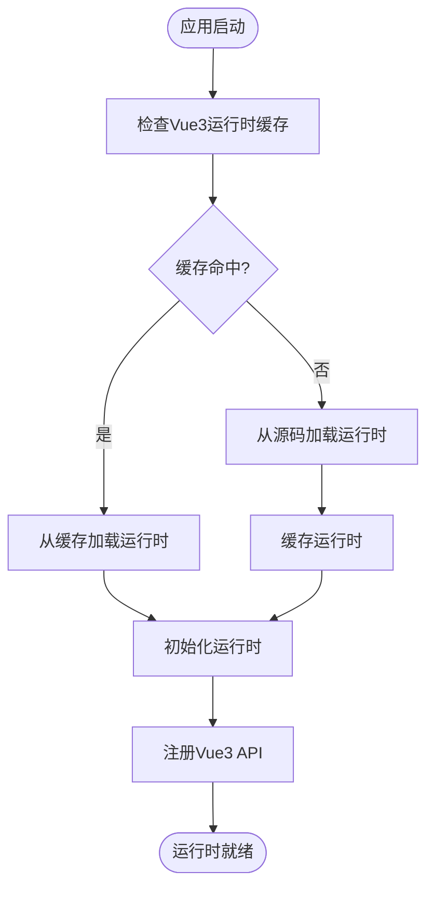

**图表来源**
- [doc.txt:49](file://doc.txt#L49)

### 自研ESM解析器

#### 模块解析流程

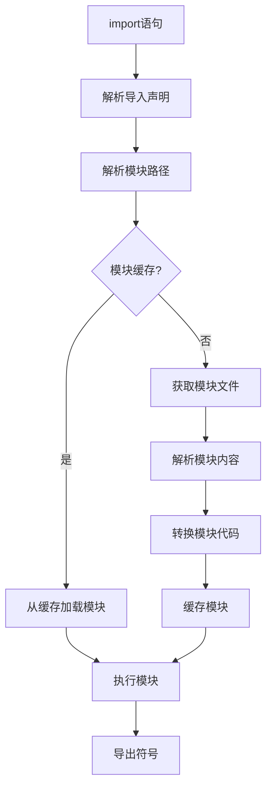

**图表来源**
- [doc.txt:50](file://doc.txt#L50)

#### 模块依赖管理

ESM解析器实现了复杂的依赖管理机制：

- **依赖图构建**：自动分析模块间的依赖关系
- **循环依赖检测**：防止循环依赖导致的死锁
- **动态导入支持**：支持动态import()语法
- **条件导入**：支持基于环境的条件导入

**章节来源**
- [doc.txt:46-50](file://doc.txt#L46-L50)

## 依赖关系分析

### 外部依赖

JS沙箱运行时层依赖于多个外部组件：

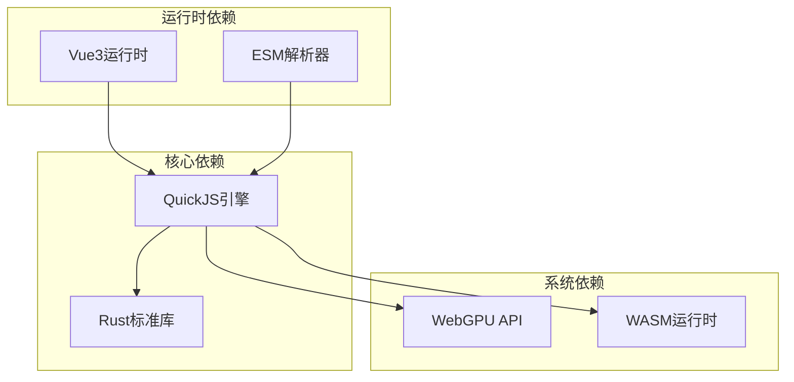

**图表来源**
- [doc.txt:47](file://doc.txt#L47)

### 内部模块依赖

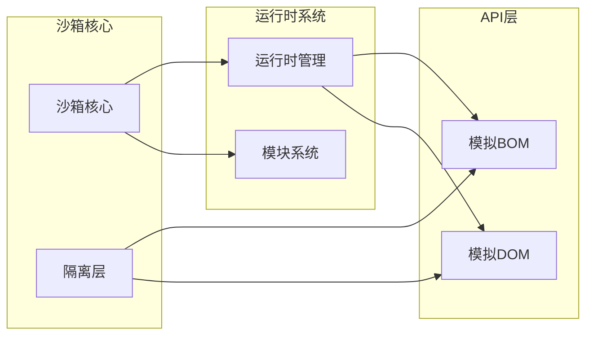

**图表来源**
- [doc.txt:46-50](file://doc.txt#L46-L50)

**章节来源**
- [doc.txt:46-50](file://doc.txt#L46-L50)

## 性能考虑

### 启动性能优化

JS沙箱运行时采用了多项性能优化策略：

- **延迟加载**：非关键模块采用延迟加载策略
- **并行初始化**：多个子系统可以并行初始化
- **内存预分配**：预先分配常用内存，减少运行时分配开销
- **缓存策略**：智能的缓存机制，避免重复初始化

### 执行性能优化

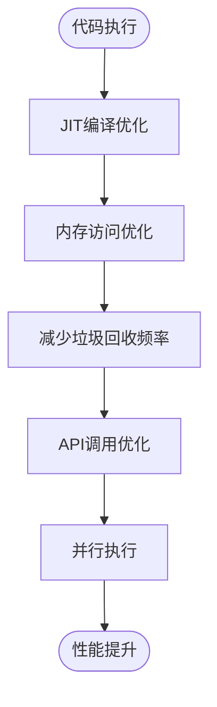

### 内存管理优化

- **对象池技术**：复用频繁创建的对象实例
- **内存池管理**：集中管理内存分配和释放
- **弱引用机制**：避免循环引用导致的内存泄漏
- **内存监控**：实时监控内存使用情况

## 故障排除指南

### 常见问题诊断

#### 沙箱隔离问题

当遇到沙箱隔离相关的问题时，可以按照以下步骤进行诊断：

1. **检查隔离级别配置**：确认沙箱的隔离级别设置是否正确
2. **验证API访问日志**：检查是否有未授权的API访问尝试
3. **内存使用监控**：确认是否存在内存泄漏或异常的内存使用模式
4. **网络访问检查**：验证网络访问控制是否按预期工作

#### Vue3运行时问题

Vue3运行时相关的常见问题包括：

- **运行时加载失败**：检查运行时缓存是否损坏
- **API注册错误**：确认Vue3 API是否正确注册到沙箱环境中
- **组件渲染异常**：验证组件的生命周期钩子是否正常执行
- **响应式系统故障**：检查响应式数据的追踪机制

#### 模块系统问题

ESM模块系统可能出现的问题：

- **模块解析失败**：检查模块路径解析逻辑
- **依赖循环**：分析模块间的依赖关系图
- **动态导入异常**：验证动态导入的时机和参数
- **模块缓存污染**：清理损坏的模块缓存

**章节来源**
- [doc.txt:88-92](file://doc.txt#L88-L92)

## 结论

Leivue Runtime的JS沙箱运行时层代表了前端执行环境的一次重大创新。通过QuickJS引擎的深度集成、多层次的沙箱隔离机制、以及自研的ESM解析器，该系统成功地在保持高性能的同时，提供了安全可靠的JavaScript执行环境。

该运行时层不仅消除了传统的前端工程化复杂性，还为Vue3应用提供了前所未有的执行效率。通过零编译运行、即时转译和智能缓存机制，开发者可以专注于业务逻辑的实现，而不必担心构建和部署的繁琐过程。

未来的发展方向包括进一步优化性能、增强安全性、扩展对更多JavaScript特性的支持，以及完善对第三方库的兼容性。随着技术的不断演进，JS沙箱运行时将成为下一代前端应用执行的重要基础设施。