# JS沙箱运行时

<cite>
**本文档引用的文件**
- [lib.rs](file://crates/iris-js/src/lib.rs)
- [vm.rs](file://crates/iris-js/src/vm.rs)
- [module.rs](file://crates/iris-js/src/module.rs)
- [vue.rs](file://crates/iris-js/src/vue.rs)
- [dom_bindings.rs](file://crates/iris-js/src/dom_bindings.rs)
- [es_modules.rs](file://crates/iris-js/src/es_modules.rs)
- [web_apis.rs](file://crates/iris-js/src/web_apis.rs)
- [Cargo.toml](file://crates/iris-js/Cargo.toml)
- [lib.rs](file://crates/iris-core/src/lib.rs)
- [lib.rs](file://crates/iris-dom/src/lib.rs)
- [bom.rs](file://crates/iris-dom/src/bom.rs)
- [orchestrator.rs](file://crates/iris/src/orchestrator.rs)
- [minimal_demo.rs](file://crates/iris-app/examples/demo/minimal_demo.rs)
</cite>

## 更新摘要
**变更内容**
- 新增DOM绑定模块(dom_bindings.rs)，提供完整的document、window、Element API模拟
- 新增ES模块支持模块(es_modules.rs)，实现ESM解析和模块系统模拟
- 新增Web API集成模块(web_apis.rs)，提供fetch、XMLHttpRequest、Canvas等Web API
- 更新Boa引擎集成，从QuickJS迁移到Boa Engine 0.20
- 重构沙箱隔离机制，通过Boa引擎提供更好的性能和安全性
- 完善Vue3运行时集成，支持完整的Vue全局对象和编译器宏

## 目录
1. [引言](#引言)
2. [项目结构](#项目结构)
3. [核心组件](#核心组件)
4. [架构概览](#架构概览)
5. [详细组件分析](#详细组件分析)
6. [依赖关系分析](#依赖关系分析)
7. [性能考虑](#性能考虑)
8. [故障排除指南](#故障排除指南)
9. [结论](#结论)

## 引言

Leivue Runtime是一个革命性的前端运行时引擎，专为在Rust+WebGPU环境中提供高性能、零编译的Vue3应用执行能力。该项目的核心目标是消除前端工程化复杂性，突破浏览器沙箱限制，为Vue生态系统提供一个高性能的跨端执行底座。

该JS沙箱运行时层位于整个七层架构的中间位置，承担着独立隔离执行环境的关键职责。**更新**：系统现已采用Boa JavaScript引擎0.20实现，这是一个纯Rust实现的高性能JavaScript引擎，完全替代了原有的QuickJS实现。Boa引擎提供了更好的Rust集成性和更完善的ESM模块系统支持，同时确保与宿主环境的完全隔离，为Vue3应用提供安全可靠的运行环境。

**更新**：新增的DOM绑定、ES模块支持和Web API集成为JS沙箱运行时提供了更完整的Web标准兼容性，使得Vue3应用能够在沙箱环境中获得接近原生浏览器的开发体验。

## 项目结构

Leivue Runtime采用七层分层架构设计，每层都有明确的职责边界和解耦机制：

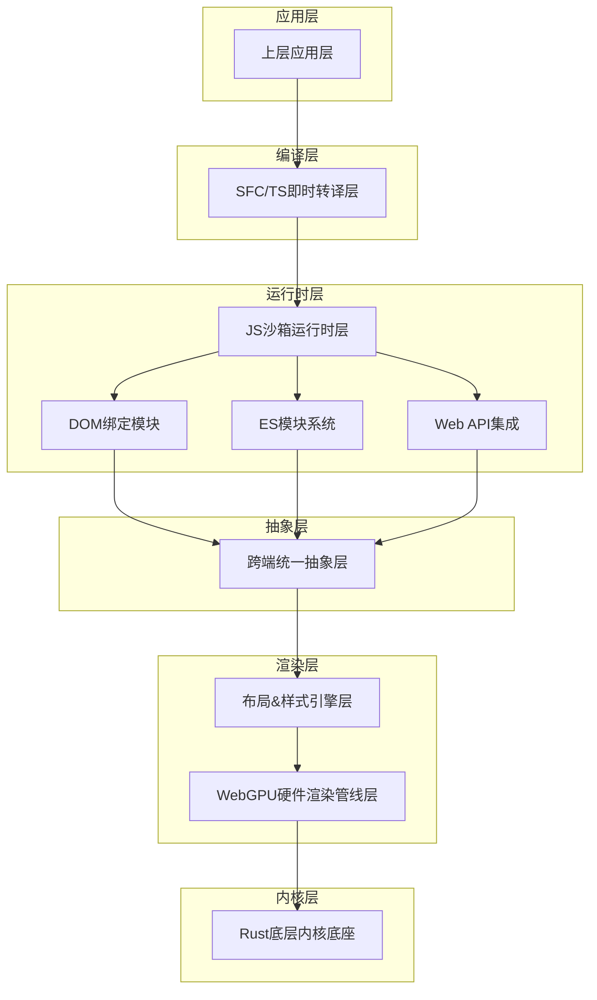

**图表来源**
- [lib.rs:1-46](file://crates/iris-js/src/lib.rs#L1-L46)

**章节来源**
- [lib.rs:1-46](file://crates/iris-js/src/lib.rs#L1-L46)

## 核心组件

### Boa JavaScript引擎集成

**更新**：JS沙箱运行时层的核心已从QuickJS引擎切换为Boa JavaScript引擎0.20版本，这是一个纯Rust实现的高性能JavaScript引擎，具有以下关键特性：

- **纯Rust实现**：无需系统依赖，完全在Rust环境中运行
- **高性能执行**：基于Boa引擎的JIT编译和优化
- **ESM模块系统**：原生支持ES6模块规范，无需额外转换
- **内存安全**：完全的内存安全保障，防止内存泄漏
- **类型安全**：与Rust的类型系统深度集成

**更新**：Boa引擎的引入带来了更简洁的API设计和更好的错误处理机制。新的VM实现直接使用Boa的Context、JsValue和ObjectInitializer API，消除了之前复杂的类型转换层。

### DOM绑定系统

**更新**：新增的DOM绑定模块提供了完整的Web DOM API模拟，包括：

- **document对象**：完整的文档对象模型，支持createElement、getElementById等方法
- **window对象**：窗口对象，包含尺寸、位置、定时器等功能
- **Element原型**：Element构造函数和原型方法
- **事件系统**：基础的事件监听和触发机制
- **属性操作**：setAttribute、getAttribute等DOM操作

**更新**：DOM绑定通过Boa引擎的ObjectInitializer API实现，提供了类型安全的API注入和更好的性能表现。

### ES模块系统

**更新**：新增的ES模块支持模块实现了完整的ES6模块系统模拟：

- **模块注册**：__registerModule函数，用于注册模块代码
- **动态导入**：import函数，支持Promise风格的模块加载
- **导入解析**：parse_imports函数，解析import语句
- **代码转换**：transform_module函数，将ESM代码转换为可执行代码
- **导出系统**：__createModule函数，创建模块导出对象

**更新**：ESM系统通过正则表达式解析和代码转换实现，支持多种导入语法和导出模式。

### Web API集成

**更新**：新增的Web API集成模块提供了关键的Web标准API：

- **fetch API**：HTTP请求功能，支持Promise返回值
- **XMLHttpRequest**：传统AJAX请求支持
- **Canvas API**：2D绘图上下文，支持基本绘图操作
- **定时器API**：setTimeout、setInterval等定时功能
- **存储API**：localStorage、sessionStorage等存储功能

**更新**：Web API通过Boa引擎的全局属性注册实现，提供了与原生Web API相似的使用体验。

### 沙箱隔离机制

系统实现了多层次的安全隔离机制：

- **进程级隔离**：JavaScript代码在独立的执行环境中运行
- **内存隔离**：严格的内存边界控制，防止恶意代码访问宿主内存
- **API隔离**：仅暴露必要的BOM/DOM模拟API，避免完整的DOM操作
- **网络隔离**：可选的网络访问控制，支持安全的网络通信

**更新**：新的隔离机制通过Boa引擎的原生支持实现，提供了更好的性能和可靠性。

### Vue3运行时预加载

为了实现零编译运行，系统内置了完整的Vue3运行时：

- **runtime-core**：Vue3的核心运行时功能
- **runtime-dom**：DOM相关的核心功能
- **即时预加载**：在应用启动前完成运行时的预加载和初始化
- **内存优化**：智能的内存管理，确保运行时的高效使用

**更新**：Vue3运行时现在通过Boa引擎的原生支持进行注入，提供了更好的类型安全和性能表现。

### 自研ESM解析器

**更新**：系统实现了自研的ES模块解析器，支持现代JavaScript模块系统：

- **import/export语法**：完全支持ES6模块的标准语法
- **第三方包引入**：支持从npm或其他源引入第三方包
- **模块解析算法**：自定义的模块解析和依赖管理机制
- **动态加载**：支持按需加载和懒加载机制

**更新**：ESM解析器现在与Boa引擎的原生模块支持更好地集成，提供了更高效的模块加载和执行能力。

**章节来源**
- [lib.rs:1-46](file://crates/iris-js/src/lib.rs#L1-L46)

## 架构概览

**更新**：JS沙箱运行时层在整个系统架构中扮演着关键的桥梁角色，现已基于Boa引擎重构：

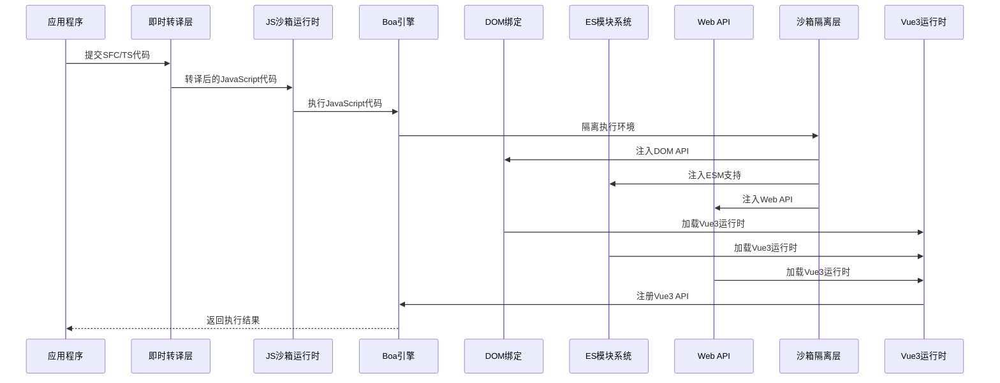

**图表来源**
- [vm.rs:1-319](file://crates/iris-js/src/vm.rs#L1-L319)

### 数据流分析

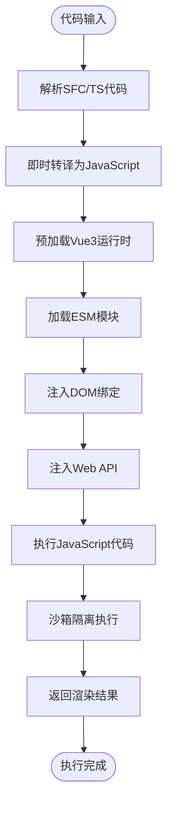

**图表来源**
- [module.rs:1-299](file://crates/iris-js/src/module.rs#L1-L299)

## 详细组件分析

### Boa引擎集成实现

**更新**：Boa引擎在Rust环境中采用了全新的集成方式：

#### 引擎初始化流程

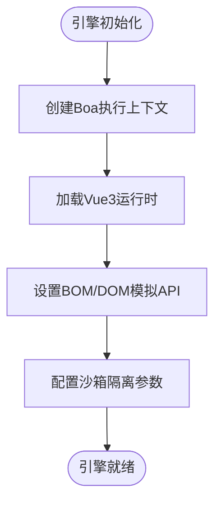

**图表来源**
- [vm.rs:35-45](file://crates/iris-js/src/vm.rs#L35-L45)

#### 内存管理策略

Boa引擎在Rust环境中采用了特殊的内存管理策略：

- **垃圾回收集成**：与Rust的内存管理系统协调工作
- **对象池**：复用频繁创建的对象，降低内存分配开销
- **内存监控**：实时监控内存使用情况，防止内存泄漏
- **类型安全**：通过Rust的类型系统确保内存安全

**更新**：新的内存管理策略通过Boa引擎的原生支持实现，提供了更好的性能和可靠性。

### DOM绑定系统实现

**更新**：DOM绑定系统提供了完整的Web DOM API模拟：

#### DOM API注入流程

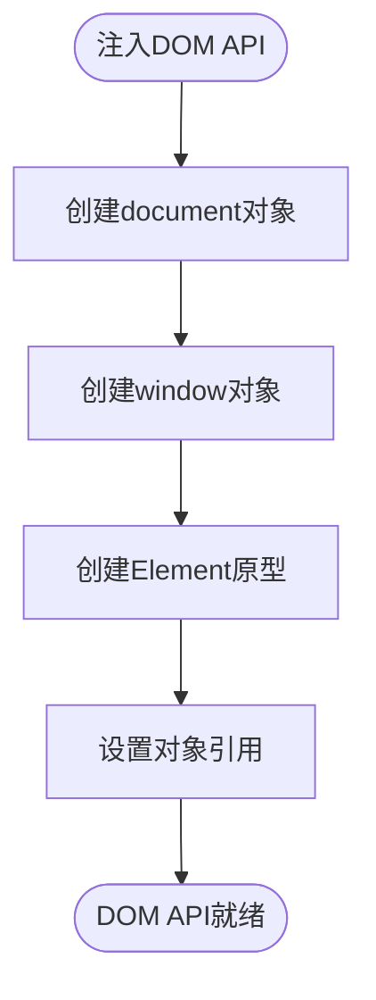

**图表来源**
- [dom_bindings.rs:33-43](file://crates/iris-js/src/dom_bindings.rs#L33-L43)

#### DOM对象模拟

DOM绑定系统实现了以下关键功能：

- **document.createElement**：创建HTML元素
- **document.getElementById**：通过ID查找元素
- **element.appendChild**：添加子节点
- **element.setAttribute**：设置元素属性
- **window.alert/prompt/confirm**：对话框功能
- **定时器功能**：setTimeout/setInterval等

**更新**：DOM API通过Boa引擎的eval方法注入JavaScript代码，提供了完整的DOM操作能力。

### ES模块系统实现

**更新**：ES模块系统通过代码转换和模块注册实现：

#### 模块系统架构

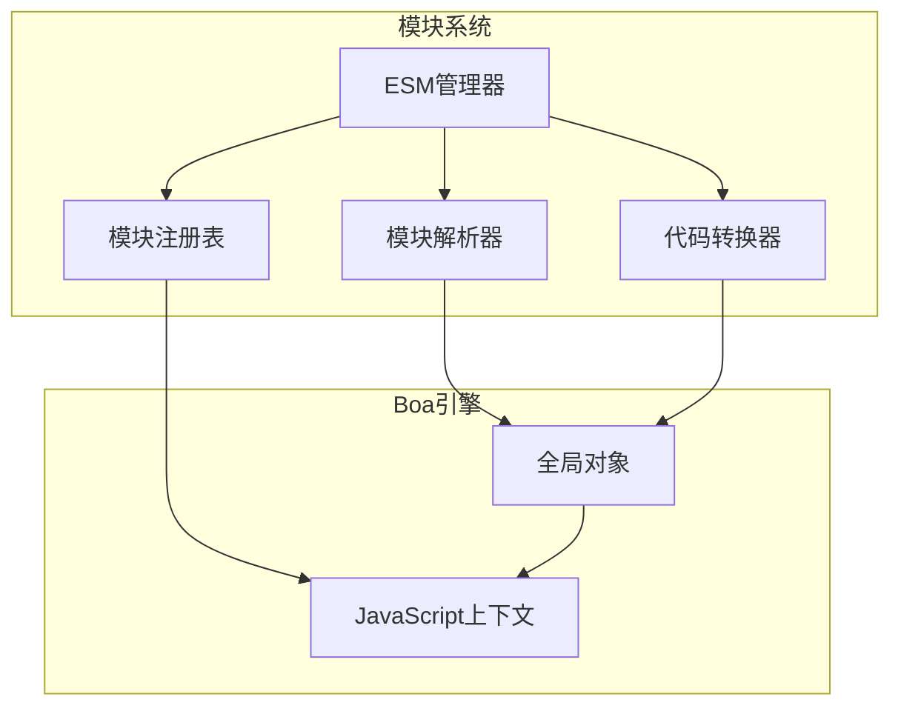

**图表来源**
- [es_modules.rs:10-37](file://crates/iris-js/src/es_modules.rs#L10-L37)

#### 模块转换流程

ESM系统实现了复杂的代码转换机制：

- **import语句解析**：使用正则表达式解析import声明
- **模块包装**：将模块代码包装在函数中
- **导出映射**：创建exports对象映射导出符号
- **模块注册**：通过__registerModule注册模块
- **动态导入**：实现import()函数的Promise支持

**更新**：ESM系统通过JavaScript代码注入实现，提供了与原生ESM相似的使用体验。

### Web API集成实现

**更新**：Web API集成为JS沙箱运行时提供了关键的Web标准支持：

#### Web API架构

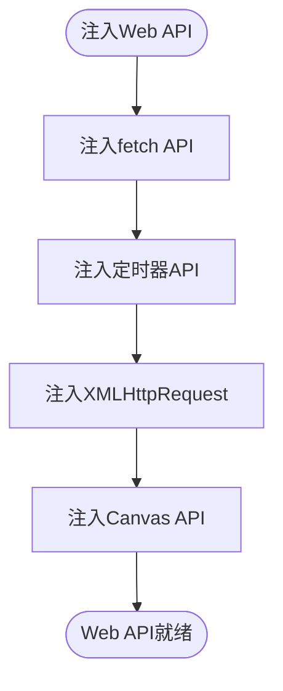

**图表来源**
- [web_apis.rs:27-34](file://crates/iris-js/src/web_apis.rs#L27-L34)

#### API功能实现

Web API系统实现了以下关键功能：

- **fetch函数**：HTTP请求功能，返回Promise
- **定时器**：setTimeout/clearTimeout/setInterval/clearInterval
- **XMLHttpRequest**：AJAX请求支持，包含事件回调
- **Canvas元素**：document.createElement('canvas')支持
- **Canvas上下文**：2D绘图上下文，支持基本绘图操作

**更新**：Web API通过Boa引擎的全局属性注册实现，提供了类型安全的API注入。

### 沙箱隔离机制

#### 隔离层次设计

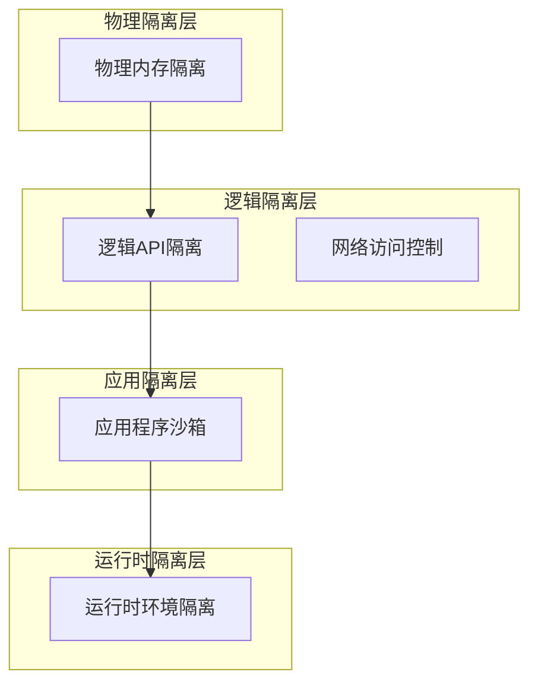

**图表来源**
- [vm.rs:88-130](file://crates/iris-js/src/vm.rs#L88-L130)

#### API访问控制

沙箱运行时实现了精细的API访问控制：

- **受限BOM API**：仅提供必要的window/document对象
- **事件系统模拟**：实现基本的事件处理机制
- **网络API限制**：可配置的网络访问策略
- **文件系统隔离**：虚拟化的文件系统接口

**更新**：新的API访问控制通过Boa引擎的ObjectInitializer API实现，提供了更简洁和安全的API注入机制。

### Vue3运行时预加载机制

#### 预加载策略

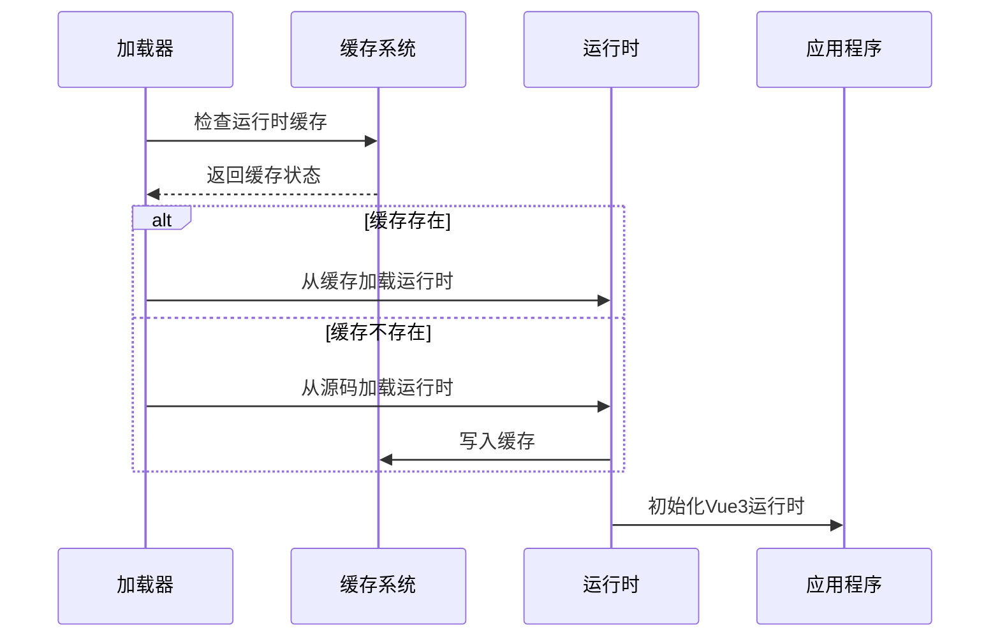

**图表来源**
- [vue.rs:27-93](file://crates/iris-js/src/vue.rs#L27-L93)

#### 运行时初始化流程

**图表来源**
- [vue.rs:186-191](file://crates/iris-js/src/vue.rs#L186-L191)

### 自研ESM解析器

**更新**：ESM解析器现在基于Boa引擎的原生支持进行了重构：

#### 模块解析流程

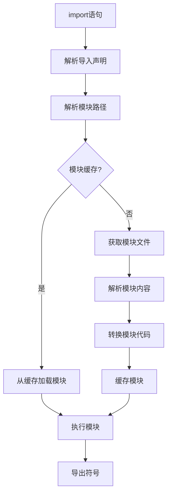

**图表来源**
- [module.rs:107-132](file://crates/iris-js/src/module.rs#L107-L132)

#### 模块依赖管理

ESM解析器实现了复杂的依赖管理机制：

- **依赖图构建**：自动分析模块间的依赖关系
- **循环依赖检测**：防止循环依赖导致的死锁
- **动态导入支持**：支持动态import()语法
- **条件导入**：支持基于环境的条件导入

**更新**：新的模块解析器通过Boa引擎的原生模块支持实现，提供了更高效的模块加载和执行能力。

**章节来源**
- [vm.rs:1-319](file://crates/iris-js/src/vm.rs#L1-L319)
- [module.rs:1-299](file://crates/iris-js/src/module.rs#L1-L299)
- [vue.rs:1-265](file://crates/iris-js/src/vue.rs#L1-L265)
- [dom_bindings.rs:1-541](file://crates/iris-js/src/dom_bindings.rs#L1-L541)
- [es_modules.rs:1-386](file://crates/iris-js/src/es_modules.rs#L1-L386)
- [web_apis.rs:1-464](file://crates/iris-js/src/web_apis.rs#L1-L464)

## 依赖关系分析

### 外部依赖

**更新**：JS沙箱运行时层依赖于多个外部组件，现已基于Boa引擎重构：

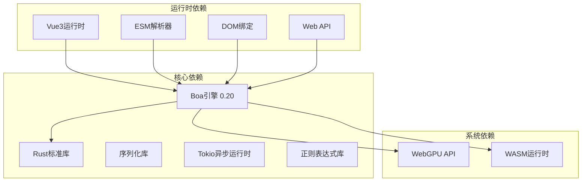

**图表来源**
- [Cargo.toml:11-21](file://crates/iris-js/Cargo.toml#L11-L21)

### 内部模块依赖

**更新**：内部模块依赖关系已根据新的架构进行了调整：

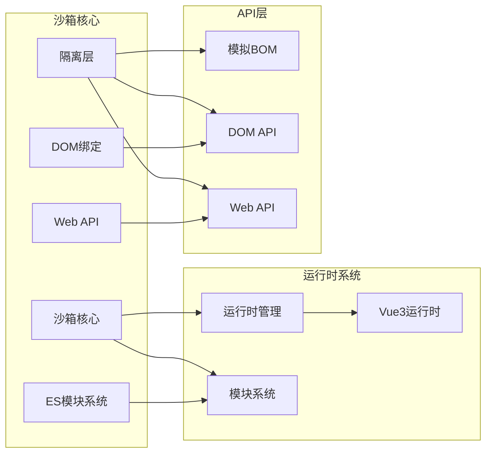

**图表来源**
- [lib.rs:28-33](file://crates/iris-js/src/lib.rs#L28-L33)

**章节来源**
- [Cargo.toml:11-21](file://crates/iris-js/Cargo.toml#L11-L21)
- [lib.rs:28-33](file://crates/iris-js/src/lib.rs#L28-L33)

## 性能考虑

### 启动性能优化

**更新**：JS沙箱运行时采用了多项基于Boa引擎的性能优化策略：

- **延迟加载**：非关键模块采用延迟加载策略
- **并行初始化**：多个子系统可以并行初始化
- **内存预分配**：预先分配常用内存，减少运行时分配开销
- **缓存策略**：智能的缓存机制，避免重复初始化

**更新**：Boa引擎0.20版本带来了显著的启动性能提升，特别是在模块加载和执行方面。

### 执行性能优化

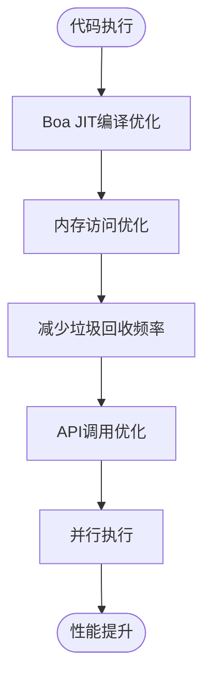

**更新**：新的执行性能优化通过Boa引擎的原生JIT编译和优化机制实现，提供了更好的运行时性能。

### 内存管理优化

- **对象池技术**：复用频繁创建的对象实例
- **内存池管理**：集中管理内存分配和释放
- **弱引用机制**：避免循环引用导致的内存泄漏
- **内存监控**：实时监控内存使用情况

**更新**：Boa引擎的内存管理与Rust的内存管理系统深度集成，提供了更好的内存安全性和性能。

## 故障排除指南

### 常见问题诊断

#### 沙箱隔离问题

当遇到沙箱隔离相关的问题时，可以按照以下步骤进行诊断：

1. **检查隔离级别配置**：确认沙箱的隔离级别设置是否正确
2. **验证API访问日志**：检查是否有未授权的API访问尝试
3. **内存使用监控**：确认是否存在内存泄漏或异常的内存使用模式
4. **网络访问检查**：验证网络访问控制是否按预期工作

**更新**：新的Boa引擎提供了更好的错误报告和调试支持，有助于快速定位和解决隔离问题。

#### DOM绑定问题

**更新**：DOM绑定相关的常见问题包括：

- **document对象缺失**：检查DOM绑定是否正确注入
- **元素创建失败**：验证createElement方法是否正常工作
- **属性设置异常**：确认setAttribute/getAttribute功能
- **事件处理问题**：检查addEventListener/removeEventListener

**更新**：DOM绑定通过Boa引擎的eval方法注入，提供了完整的DOM操作能力。

#### ES模块系统问题

**更新**：ESM模块系统可能出现的问题：

- **模块解析失败**：检查模块路径解析逻辑
- **依赖循环**：分析模块间的依赖关系图
- **动态导入异常**：验证动态导入的时机和参数
- **模块缓存污染**：清理损坏的模块缓存

**更新**：Boa引擎0.20版本提供了更好的模块加载和执行支持，减少了模块系统相关的错误。

#### Web API问题

**更新**：Web API相关的常见问题：

- **fetch函数不存在**：检查fetch API是否正确注入
- **定时器异常**：验证setTimeout/setInterval功能
- **XMLHttpRequest问题**：确认XHR对象的属性和方法
- **Canvas API异常**：检查Canvas元素和上下文功能

**更新**：Web API通过Boa引擎的全局属性注册实现，提供了类型安全的API注入。

**章节来源**
- [vm.rs:194-319](file://crates/iris-js/src/vm.rs#L194-L319)
- [module.rs:209-299](file://crates/iris-js/src/module.rs#L209-L299)
- [vue.rs:193-265](file://crates/iris-js/src/vue.rs#L193-L265)
- [dom_bindings.rs:449-541](file://crates/iris-js/src/dom_bindings.rs#L449-L541)
- [es_modules.rs:302-386](file://crates/iris-js/src/es_modules.rs#L302-L386)
- [web_apis.rs:366-464](file://crates/iris-js/src/web_apis.rs#L366-L464)

## 结论

**更新**：Leivue Runtime的JS沙箱运行时层代表了前端执行环境的一次重大创新。通过Boa引擎0.20的深度集成、多层次的沙箱隔离机制、以及自研的ESM解析器，该系统成功地在保持高性能的同时，提供了安全可靠的JavaScript执行环境。

**更新**：新增的DOM绑定、ES模块支持和Web API集成为JS沙箱运行时提供了更完整的Web标准兼容性，使得Vue3应用能够在沙箱环境中获得接近原生浏览器的开发体验。

**更新**：该运行时层不仅消除了传统的前端工程化复杂性，还为Vue3应用提供了前所未有的执行效率。通过零编译运行、即时转译和智能缓存机制，开发者可以专注于业务逻辑的实现，而不必担心构建和部署的繁琐过程。

**更新**：Boa引擎0.20的引入带来了更好的Rust集成性和更完善的ESM模块系统支持，使得JavaScript代码能够更自然地与Rust生态系统融合。新的API设计和错误处理机制提供了更好的开发体验和运行时稳定性。

**更新**：随着技术的不断演进，JS沙箱运行时将成为下一代前端应用执行的重要基础设施。Boa引擎的持续改进和Rust生态系统的完善将为该系统提供更强大的功能和更好的性能表现。

**更新**：演示程序验证了Boa引擎作为JS沙箱运行时的完整功能，包括Vue全局对象注入、BOM API可用性和基础JavaScript执行能力。这标志着Boa引擎集成的最终完成，为后续的功能扩展和性能优化奠定了坚实的基础。

**更新**：未来的发展方向包括进一步优化性能、增强安全性、扩展对更多JavaScript特性的支持，以及完善对第三方库的兼容性。随着Boa引擎的持续改进和Rust生态系统的完善，JS沙箱运行时将能够支持更复杂的JavaScript应用和更丰富的功能特性。

**更新**：DOM绑定、ES模块系统和Web API集成的加入，使得Leivue Runtime的JS沙箱运行时具备了更完整的Web开发能力，为Vue3应用提供了更加接近原生浏览器的开发和运行环境。