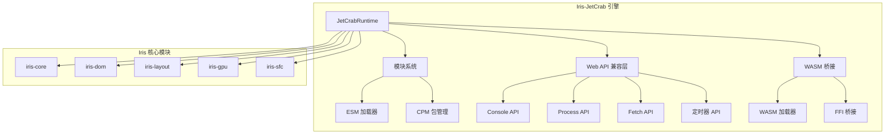
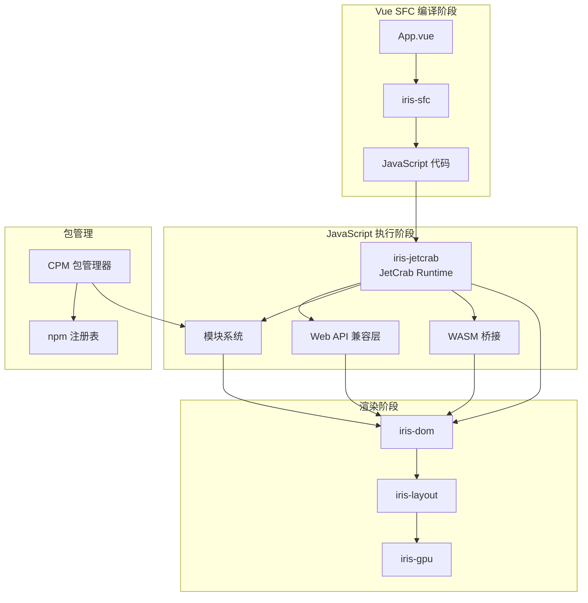
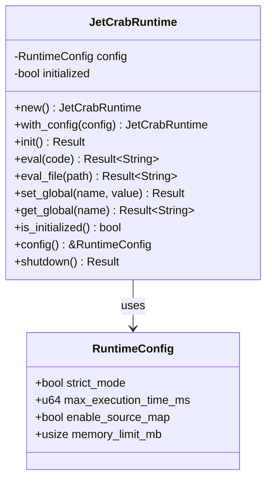
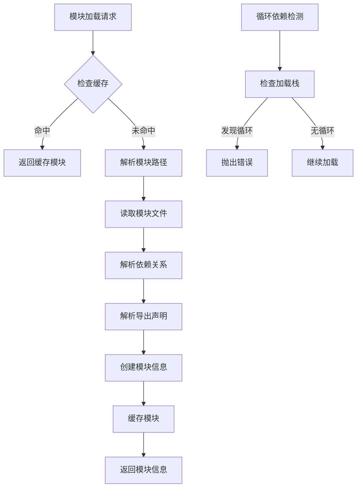
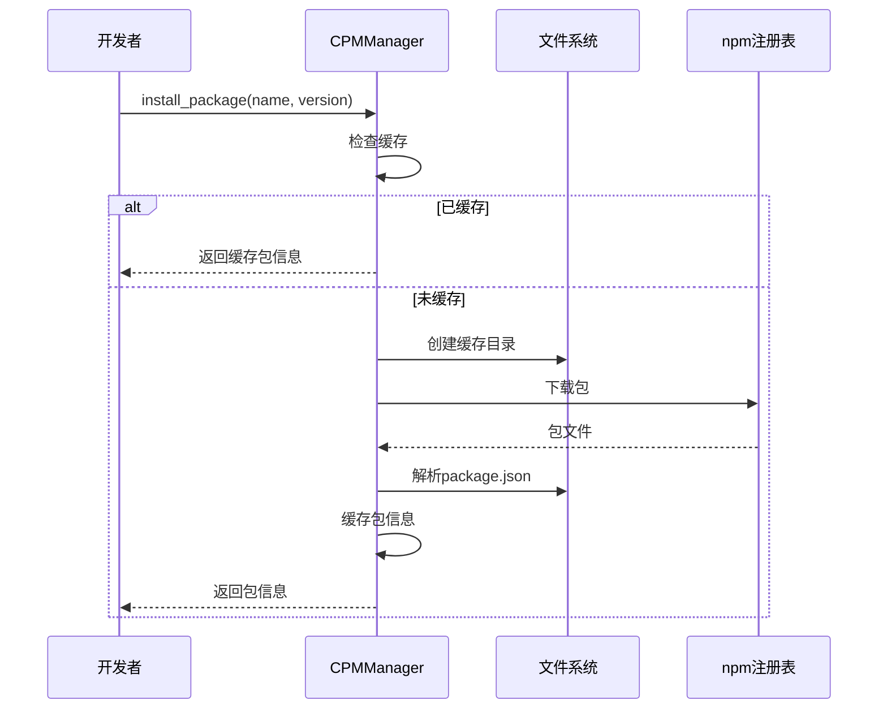
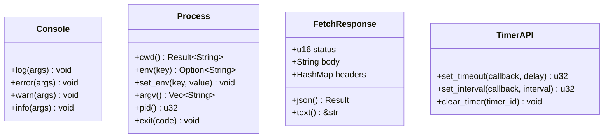
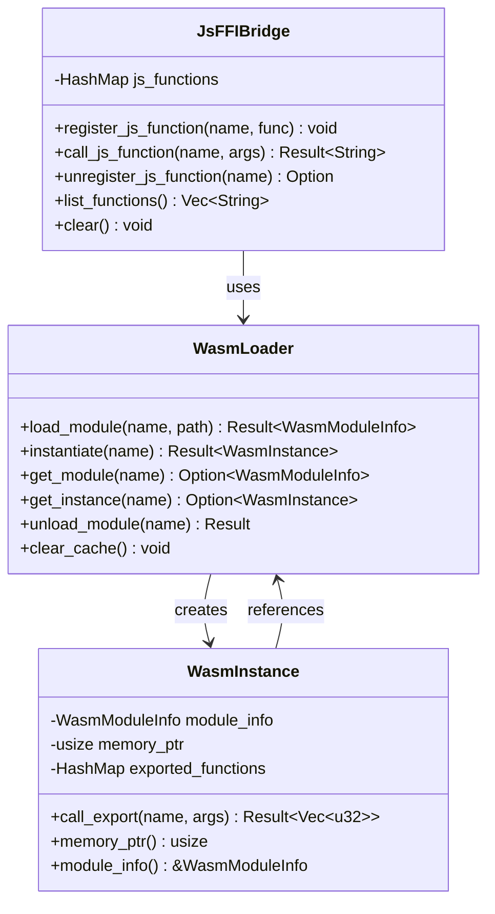
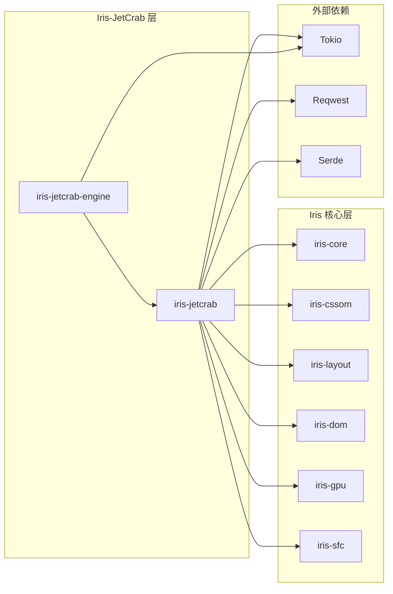

# Iris-JetCrab引擎

<cite>
**本文档引用的文件**
- [lib.rs](file://crates/iris-jetcrab/src/lib.rs)
- [runtime.rs](file://crates/iris-jetcrab/src/runtime.rs)
- [web_apis.rs](file://crates/iris-jetcrab/src/web_apis.rs)
- [module.rs](file://crates/iris-jetcrab/src/module.rs)
- [esm.rs](file://crates/iris-jetcrab/src/esm.rs)
- [cpm.rs](file://crates/iris-jetcrab/src/cpm.rs)
- [wasm_bridge.rs](file://crates/iris-jetcrab/src/wasm_bridge.rs)
- [web_apis_enhanced.rs](file://crates/iris-jetcrab/src/web_apis_enhanced.rs)
- [bridge.rs](file://crates/iris-jetcrab/src/bridge.rs)
- [Cargo.toml](file://crates/iris-jetcrab/Cargo.toml)
- [ARCHITECTURE.md](file://ARCHITECTURE.md)
- [WASM_API.md](file://crates/iris-jetcrab-engine/WASM_API.md)
- [build-wasm-engine.sh](file://crates/iris-jetcrab-engine/build-wasm-engine.sh)
</cite>

## 目录
1. [简介](#简介)
2. [项目结构](#项目结构)
3. [核心组件](#核心组件)
4. [架构概览](#架构概览)
5. [详细组件分析](#详细组件分析)
6. [依赖关系分析](#依赖关系分析)
7. [性能考虑](#性能考虑)
8. [故障排除指南](#故障排除指南)
9. [结论](#结论)

## 简介

Iris-JetCrab引擎是Iris跨平台UI框架中的JavaScript执行引擎，基于JetCrab Chitin引擎构建。该引擎提供了完整的npm包支持、ESM模块系统、Web API兼容层以及WASM原生支持，实现了从Vue SFC到JavaScript代码的完整执行链路。

该引擎的核心目标是在Rust生态系统中提供高性能的JavaScript执行环境，同时保持与现代Web标准的兼容性。通过模块化设计，Iris-JetCrab能够无缝集成到Iris的整体架构中，为开发者提供流畅的开发体验。

## 项目结构

Iris-JetCrab引擎采用模块化架构，主要包含以下核心模块：

**图表来源**
- [lib.rs:1-82](file://crates/iris-jetcrab/src/lib.rs#L1-L82)
- [Cargo.toml:13-36](file://crates/iris-jetcrab/Cargo.toml#L13-L36)

**章节来源**
- [lib.rs:1-82](file://crates/iris-jetcrab/src/lib.rs#L1-L82)
- [Cargo.toml:1-48](file://crates/iris-jetcrab/Cargo.toml#L1-L48)

## 核心组件

### JetCrabRuntime 核心运行时

JetCrabRuntime是引擎的核心执行环境，负责管理JavaScript代码的执行生命周期。该组件提供了完整的运行时配置管理和资源生命周期控制。

**主要特性：**
- 可配置的运行时参数（严格模式、执行超时、内存限制）
- 生命周期管理（初始化、执行、关闭）
- 全局变量管理
- 错误处理机制

### 模块系统

Iris-JetCrab提供了两套模块加载系统：

1. **基础模块加载器**：支持基本的ESM模块解析和缓存
2. **增强ESM加载器**：提供完整的模块依赖解析、循环依赖检测和编译支持

### Web API 兼容层

实现了浏览器标准API的JetCrab版本，包括：
- Console API（日志、错误、警告、信息）
- Process API（环境变量、工作目录、进程信息）
- Fetch API（HTTP请求）
- 定时器API（setTimeout、setInterval）

### WASM 桥接

提供WASM模块加载和Rust↔JavaScript FFI支持，包括：
- WASM模块加载和实例化
- 导出函数调用
- JavaScript FFI桥接

**章节来源**
- [runtime.rs:32-202](file://crates/iris-jetcrab/src/runtime.rs#L32-L202)
- [module.rs:20-167](file://crates/iris-jetcrab/src/module.rs#L20-L167)
- [esm.rs:80-444](file://crates/iris-jetcrab/src/esm.rs#L80-L444)
- [web_apis.rs:7-204](file://crates/iris-jetcrab/src/web_apis.rs#L7-L204)
- [wasm_bridge.rs:64-241](file://crates/iris-jetcrab/src/wasm_bridge.rs#L64-L241)

## 架构概览

Iris-JetCrab引擎在整个Iris架构中扮演着关键角色，作为JavaScript执行层连接上层Vue SFC编译器和底层渲染系统。

**图表来源**
- [lib.rs:7-15](file://crates/iris-jetcrab/src/lib.rs#L7-L15)
- [ARCHITECTURE.md:140-157](file://ARCHITECTURE.md#L140-L157)

该架构确保了：
1. **模块分离**：每个组件职责单一，便于维护和测试
2. **可扩展性**：新功能通过添加模块而非修改现有模块实现
3. **性能优化**：各层独立优化，避免相互影响
4. **兼容性**：提供完整的Web API兼容层

**章节来源**
- [ARCHITECTURE.md:1-289](file://ARCHITECTURE.md#L1-L289)
- [lib.rs:17-27](file://crates/iris-jetcrab/src/lib.rs#L17-L27)

## 详细组件分析

### JetCrabRuntime 类设计

**图表来源**
- [runtime.rs:47-202](file://crates/iris-jetcrab/src/runtime.rs#L47-L202)

JetCrabRuntime提供了完整的生命周期管理：
- **初始化阶段**：建立运行时环境，配置安全策略
- **执行阶段**：安全执行JavaScript代码，管理资源使用
- **清理阶段**：释放资源，确保系统稳定性

### ESM 模块加载器

增强的ESM模块加载器提供了完整的模块系统支持：

**图表来源**
- [esm.rs:109-181](file://crates/iris-jetcrab/src/esm.rs#L109-L181)
- [esm.rs:27-57](file://crates/iris-jetcrab/src/esm.rs#L27-L57)

**章节来源**
- [esm.rs:80-444](file://crates/iris-jetcrab/src/esm.rs#L80-L444)

### CPM 包管理器

CPM（Crab Package Manager）提供了npm包的本地管理能力：

**图表来源**
- [cpm.rs:86-138](file://crates/iris-jetcrab/src/cpm.rs#L86-L138)

**章节来源**
- [cpm.rs:36-235](file://crates/iris-jetcrab/src/cpm.rs#L36-L235)

### Web API 兼容层

Web API兼容层实现了浏览器标准API的JetCrab版本：

**图表来源**
- [web_apis.rs:7-167](file://crates/iris-jetcrab/src/web_apis.rs#L7-L167)

**章节来源**
- [web_apis.rs:1-204](file://crates/iris-jetcrab/src/web_apis.rs#L1-L204)

### WASM 桥接系统

WASM桥接系统提供了Rust与JavaScript之间的互操作能力：

**图表来源**
- [wasm_bridge.rs:64-241](file://crates/iris-jetcrab/src/wasm_bridge.rs#L64-L241)

**章节来源**
- [wasm_bridge.rs:1-369](file://crates/iris-jetcrab/src/wasm_bridge.rs#L1-L369)

## 依赖关系分析

Iris-JetCrab引擎的依赖关系遵循严格的单向依赖原则，确保系统的模块化和可维护性。

**图表来源**
- [Cargo.toml:13-36](file://crates/iris-jetcrab/Cargo.toml#L13-L36)
- [ARCHITECTURE.md:38-43](file://ARCHITECTURE.md#L38-L43)

**章节来源**
- [Cargo.toml:1-48](file://crates/iris-jetcrab/Cargo.toml#L1-L48)
- [ARCHITECTURE.md:36-43](file://ARCHITECTURE.md#L36-L43)

## 性能考虑

Iris-JetCrab引擎在设计时充分考虑了性能优化：

### 模块缓存策略
- ESM模块加载器使用两级缓存（模块缓存和导出缓存）
- 支持缓存清理和统计功能
- 避免重复解析和编译相同模块

### 内存管理
- 运行时配置内存限制
- WASM模块内存指针管理
- 定期清理未使用的资源

### 并发处理
- 基于Tokio的异步I/O
- 并发模块加载和编译
- 异步HTTP请求处理

## 故障排除指南

### 常见问题及解决方案

**问题1：运行时未初始化**
- **症状**：调用eval()时返回"Runtime not initialized"错误
- **解决**：确保先调用init()方法初始化运行时

**问题2：模块加载失败**
- **症状**：ESM模块加载返回"Module not found"错误
- **解决**：检查模块路径和搜索路径配置

**问题3：循环依赖检测错误**
- **症状**：加载模块时报"循环依赖检测"错误
- **解决**：检查模块间的相互依赖关系

**问题4：WASM模块实例化失败**
- **症状**：instantiate()返回错误
- **解决**：确认WASM文件格式正确且导出函数存在

**章节来源**
- [runtime.rs:108-121](file://crates/iris-jetcrab/src/runtime.rs#L108-L121)
- [esm.rs:41-57](file://crates/iris-jetcrab/src/esm.rs#L41-L57)
- [wasm_bridge.rs:132-162](file://crates/iris-jetcrab/src/wasm_bridge.rs#L132-L162)

## 结论

Iris-JetCrab引擎作为Iris框架的重要组成部分，成功地将JetCrab JavaScript引擎与Rust生态系统相结合。通过模块化设计和严格的架构约束，该引擎为开发者提供了：

1. **完整的Web API兼容性**：确保JavaScript代码的可移植性
2. **高效的模块系统**：支持ESM和npm包管理
3. **强大的WASM互操作能力**：实现Rust与JavaScript的无缝集成
4. **良好的性能表现**：通过缓存和并发优化提升执行效率

该引擎的设计体现了Iris框架的核心理念：在保证性能的同时提供最佳的开发体验。随着项目的不断发展，Iris-JetCrab引擎将继续演进，为构建现代化的跨平台应用提供强有力的支持。