# Iris-JetCrab引擎

<cite>
**本文档引用的文件**
- [lib.rs](file://crates/iris-jetcrab/src/lib.rs)
- [runtime.rs](file://crates/iris-jetcrab/src/runtime.rs)
- [web_apis.rs](file://crates/iris-jetcrab/src/web_apis.rs)
- [module.rs](file://crates/iris-jetcrab/src/module.rs)
- [esm.rs](file://crates/iris-jetcrab/src/esm.rs)
- [cpm.rs](file://crates/iris-jetcrab/src/cpm.rs)
- [wasm_bridge.rs](file://crates/iris-jetcrab/src/wasm_bridge.rs)
- [web_apis_enhanced.rs](file://crates/iris-jetcrab/src/web_apis_enhanced.rs)
- [bridge.rs](file://crates/iris-jetcrab/src/bridge.rs)
- [Cargo.toml](file://crates/iris-jetcrab/Cargo.toml)
- [ARCHITECTURE.md](file://ARCHITECTURE.md)
- [wasm_api.rs](file://crates/iris-jetcrab-engine/src/wasm_api.rs)
- [WASM_API.md](file://crates/iris-jetcrab-engine/WASM_API.md)
- [build-wasm-engine.sh](file://crates/iris-jetcrab-engine/build-wasm-engine.sh)
- [build-wasm-engine.ps1](file://crates/iris-jetcrab-engine/build-wasm-engine.ps1)
- [Cargo.toml](file://crates/iris-jetcrab-engine/Cargo.toml)
- [lib.rs](file://crates/iris-jetcrab-engine/src/lib.rs)
- [sfc_compiler.rs](file://crates/iris-jetcrab-engine/src/sfc_compiler.rs)
- [hmr.rs](file://crates/iris-jetcrab-engine/src/hmr.rs)
- [engine.rs](file://crates/iris-jetcrab-engine/src/engine.rs)
- [vue_compiler.rs](file://crates/iris-jetcrab-engine/src/vue_compiler.rs)
- [project_scanner.rs](file://crates/iris-jetcrab-engine/src/project_scanner.rs)
- [module_graph.rs](file://crates/iris-jetcrab-engine/src/module_graph.rs)
- [dependency_tree.rs](file://crates/iris-jetcrab-engine/src/dependency_tree.rs)
- [compiler_cache.rs](file://crates/iris-jetcrab-cli/src/server/compiler_cache.rs)
- [DEPENDENCY_TREE_MANAGEMENT.md](file://docs/DEPENDENCY_TREE_MANAGEMENT.md)
- [dependency_tree_test.rs](file://crates/iris-jetcrab-engine/tests/dependency_tree_test.rs)
</cite>

## 更新摘要
**变更内容**
- 新增DependencyTree模块，提供完整的npm依赖树管理功能
- 新增编译工具过滤机制，智能排除构建工具类依赖
- 新增依赖版本变化检测和按需重新编译功能
- 新增编译器缓存集成，支持依赖变化时的增量编译
- 新增完整的依赖树缓存机制，提升启动性能
- 新增模块依赖映射功能，支持按需重新编译受影响模块

## 目录
1. [简介](#简介)
2. [项目结构](#项目结构)
3. [核心组件](#核心组件)
4. [架构概览](#架构概览)
5. [详细组件分析](#详细组件分析)
6. [依赖树管理系统](#依赖树管理系统)
7. [编译器缓存集成](#编译器缓存集成)
8. [WASM API功能](#wasm-api功能)
9. [跨平台构建支持](#跨平台构建支持)
10. [依赖关系分析](#依赖关系分析)
11. [性能考虑](#性能考虑)
12. [故障排除指南](#故障排除指南)
13. [结论](#结论)

## 简介

Iris-JetCrab引擎是Iris跨平台UI框架中的JavaScript执行引擎，基于JetCrab Chitin引擎构建。该引擎提供了完整的npm包支持、ESM模块系统、Web API兼容层以及**WASM原生支持**，实现了从Vue SFC到JavaScript代码的完整执行链路。

**更新**：引擎现已重构为完全的项目级编译架构，从简单的单文件执行升级为完整的Vue项目编译和运行时管理。新增的DependencyTree模块负责npm依赖树管理，提供智能的编译工具过滤、版本变化检测和按需重新编译功能。新增的编译器缓存集成使得引擎能够在依赖变化时自动重新编译受影响的模块，显著提升了开发效率。

该引擎的核心目标是在Rust生态系统中提供高性能的JavaScript执行环境，同时保持与现代Web标准的兼容性。通过模块化设计和项目级编译架构，Iris-JetCrab能够无缝集成到Iris的整体架构中，为开发者提供完整的Vue项目开发和运行时体验。

## 项目结构

Iris-JetCrab引擎采用高度模块化的架构，主要包含以下核心模块：

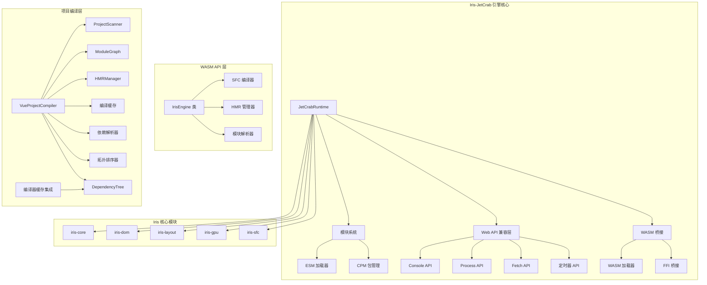
```mermaid
graph TB
subgraph "Iris-JetCrab 引擎核心"
A[JetCrabRuntime] --> B[模块系统]
A --> C[Web API 兼容层]
A --> D[WASM 桥接]
B --> B1[ESM 加载器]
B --> B2[CPM 包管理]
C --> C1[Console API]
C --> C2[Process API]
C --> C3[Fetch API]
C --> C4[定时器 API]
D --> D1[WASM 加载器]
D --> D2[FFI 桥接]
end
subgraph "Iris 核心模块"
E[iris-core]
F[iris-dom]
G[iris-layout]
H[iris-gpu]
I[iris-sfc]
end
subgraph "WASM API 层"
J[IrisEngine 类]
K[SFC 编译器]
L[HMR 管理器]
M[模块解析器]
end
subgraph "项目编译层"
N[VueProjectCompiler]
O[ProjectScanner]
P[ModuleGraph]
Q[HMRManager]
R[编译缓存]
S[依赖解析器]
T[拓扑排序器]
U[DependencyTree]
V[编译器缓存集成]
end
A --> E
A --> F
A --> G
A --> H
A --> I
J --> K
J --> L
J --> M
N --> O
N --> P
N --> Q
N --> R
N --> S
N --> T
N --> U
V --> U
```

**图表来源**
- [lib.rs:1-82](file://crates/iris-jetcrab/src/lib.rs#L1-L82)
- [Cargo.toml:13-36](file://crates/iris-jetcrab/Cargo.toml#L13-L36)
- [wasm_api.rs:13-47](file://crates/iris-jetcrab-engine/src/wasm_api.rs#L13-L47)
- [engine.rs:13-15](file://crates/iris-jetcrab-engine/src/engine.rs#L13-L15)
- [project_scanner.rs:10-40](file://crates/iris-jetcrab-engine/src/project_scanner.rs#L10-L40)
- [dependency_tree.rs:1-375](file://crates/iris-jetcrab-engine/src/dependency_tree.rs#L1-375)
- [compiler_cache.rs:1-223](file://crates/iris-jetcrab-cli/src/server/compiler_cache.rs#L1-223)

**章节来源**
- [lib.rs:1-82](file://crates/iris-jetcrab/src/lib.rs#L1-L82)
- [Cargo.toml:1-48](file://crates/iris-jetcrab/Cargo.toml#L1-L48)

## 核心组件

### JetCrabRuntime 核心运行时

JetCrabRuntime是引擎的核心执行环境，负责管理JavaScript代码的执行生命周期。该组件提供了完整的运行时配置管理和资源生命周期控制。

**主要特性：**
- 可配置的运行时参数（严格模式、执行超时、内存限制）
- 生命周期管理（初始化、执行、关闭）
- 全局变量管理
- 错误处理机制

### 模块系统

Iris-JetCrab提供了两套模块加载系统：

1. **基础模块加载器**：支持基本的ESM模块解析和缓存
2. **增强ESM加载器**：提供完整的模块依赖解析、循环依赖检测和编译支持

### Web API 兼容层

实现了浏览器标准API的JetCrab版本，包括：
- Console API（日志、错误、警告、信息）
- Process API（环境变量、工作目录、进程信息）
- Fetch API（HTTP请求）
- 定时器API（setTimeout、setInterval）

### WASM 桥接

提供WASM模块加载和Rust↔JavaScript FFI支持，包括：
- WASM模块加载和实例化
- 导出函数调用
- JavaScript FFI桥接

**章节来源**
- [runtime.rs:32-202](file://crates/iris-jetcrab/src/runtime.rs#L32-L202)
- [module.rs:20-167](file://crates/iris-jetcrab/src/module.rs#L20-L167)
- [esm.rs:80-444](file://crates/iris-jetcrab/src/esm.rs#L80-L444)
- [web_apis.rs:7-204](file://crates/iris-jetcrab/src/web_apis.rs#L7-L204)
- [wasm_bridge.rs:64-241](file://crates/iris-jetcrab/src/wasm_bridge.rs#L64-L241)

## 架构概览

Iris-JetCrab引擎在整个Iris架构中扮演着关键角色，作为JavaScript执行层连接上层Vue SFC编译器和底层渲染系统。

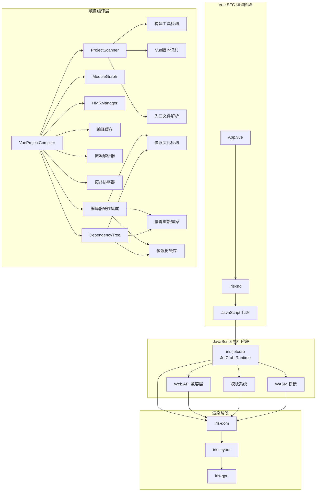
```mermaid
graph TB
subgraph "Vue SFC 编译阶段"
A[App.vue] --> B[iris-sfc]
B --> C[JavaScript 代码]
end
subgraph "JavaScript 执行阶段"
C --> D[iris-jetcrab<br/>JetCrab Runtime]
D --> E[Web API 兼容层]
D --> F[模块系统]
D --> G[WASM 桥接]
end
subgraph "渲染阶段"
H[iris-dom] --> I[iris-layout]
I --> J[iris-gpu]
end
D --> H
E --> H
F --> H
G --> H
subgraph "项目编译层"
K[VueProjectCompiler]
L[ProjectScanner]
M[ModuleGraph]
N[HMRManager]
O[编译缓存]
P[依赖解析器]
Q[拓扑排序器]
R[构建工具检测]
S[Vue版本识别]
T[入口文件解析]
U[DependencyTree]
V[编译器缓存集成]
W[依赖变化检测]
X[按需重新编译]
Y[依赖树缓存]
end
K --> L
K --> M
K --> N
K --> O
K --> P
K --> Q
K --> U
K --> V
L --> R
L --> S
L --> T
V --> W
V --> X
V --> Y
U --> W
U --> X
U --> Y
```

**图表来源**
- [lib.rs:7-15](file://crates/iris-jetcrab/src/lib.rs#L7-L15)
- [ARCHITECTURE.md:140-157](file://ARCHITECTURE.md#L140-L157)

该架构确保了：
1. **模块分离**：每个组件职责单一，便于维护和测试
2. **可扩展性**：新功能通过添加模块而非修改现有模块实现
3. **性能优化**：各层独立优化，避免相互影响
4. **兼容性**：提供完整的Web API兼容层

**章节来源**
- [ARCHITECTURE.md:1-289](file://ARCHITECTURE.md#L1-L289)
- [lib.rs:17-27](file://crates/iris-jetcrab/src/lib.rs#L17-L27)

## 详细组件分析

### JetCrabEngine 类设计

**更新**：JetCrabEngine现在提供完整的Vue项目编译和执行能力，使用全新的编译器架构。

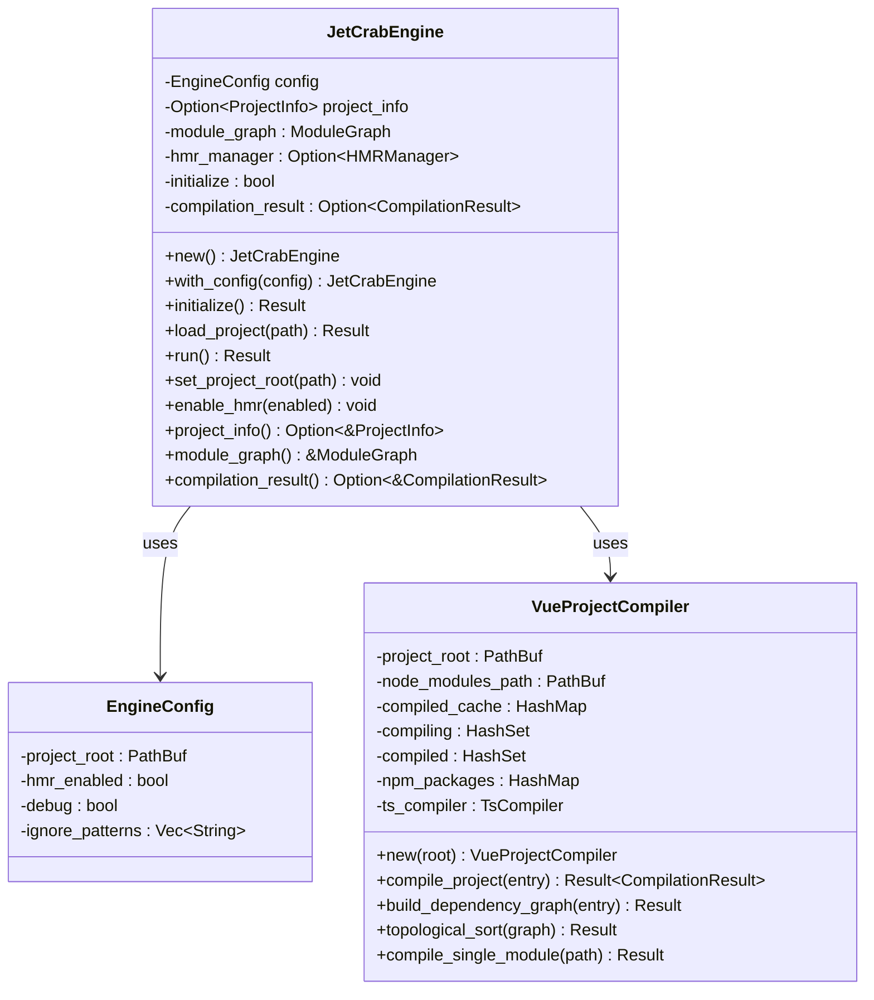
```mermaid
classDiagram
class JetCrabEngine {
-EngineConfig config
-Option~ProjectInfo~ project_info
-module_graph : ModuleGraph
-hmr_manager : Option~HMRManager~
-initialize : bool
-compilation_result : Option~CompilationResult~
+new() JetCrabEngine
+with_config(config) JetCrabEngine
+initialize() Result
+load_project(path) Result
+run() Result
+set_project_root(path) void
+enable_hmr(enabled) void
+project_info() Option~&ProjectInfo~
+module_graph() &ModuleGraph
+compilation_result() Option~&CompilationResult~
}
class EngineConfig {
-project_root : PathBuf
-hmr_enabled : bool
-debug : bool
-ignore_patterns : Vec~String~
}
class VueProjectCompiler {
-project_root : PathBuf
-node_modules_path : PathBuf
-compiled_cache : HashMap
-compiling : HashSet
-compiled : HashSet
-npm_packages : HashMap
-ts_compiler : TsCompiler
+new(root) VueProjectCompiler
+compile_project(entry) Result~CompilationResult~
+build_dependency_graph(entry) Result
+topological_sort(graph) Result
+compile_single_module(path) Result
}
JetCrabEngine --> EngineConfig : uses
JetCrabEngine --> VueProjectCompiler : uses
```

**图表来源**
- [engine.rs:48-61](file://crates/iris-jetcrab-engine/src/engine.rs#L48-L61)
- [engine.rs:16-27](file://crates/iris-jetcrab-engine/src/engine.rs#L16-L27)
- [vue_compiler.rs:51-69](file://crates/iris-jetcrab-engine/src/vue_compiler.rs#L51-L69)

**更新**：JetCrabEngine.run()方法现在使用VueProjectCompiler进行完整项目编译，包括：
1. 获取入口文件路径
2. 创建VueProjectCompiler实例
3. 调用compile_project()进行完整项目编译
4. 按编译顺序执行模块
5. 初始化渲染循环

### VueProjectCompiler 详细分析

**新增**：VueProjectCompiler是新的项目编译核心，提供完整的Vue项目编译能力。

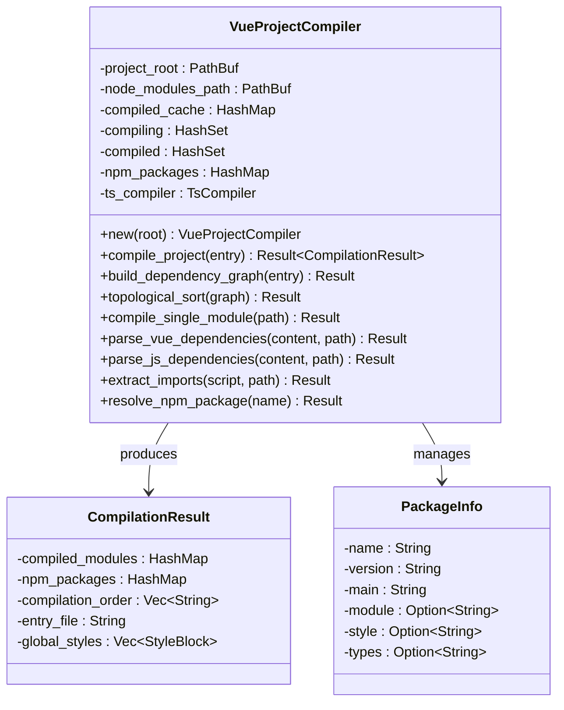
```mermaid
classDiagram
class VueProjectCompiler {
-project_root : PathBuf
-node_modules_path : PathBuf
-compiled_cache : HashMap
-compiling : HashSet
-compiled : HashSet
-npm_packages : HashMap
-ts_compiler : TsCompiler
+new(root) VueProjectCompiler
+compile_project(entry) Result~CompilationResult~
+build_dependency_graph(entry) Result
+topological_sort(graph) Result
+compile_single_module(path) Result
+parse_vue_dependencies(content, path) Result
+parse_js_dependencies(content, path) Result
+extract_imports(script, path) Result
+resolve_npm_package(name) Result
}
class CompilationResult {
-compiled_modules : HashMap
-npm_packages : HashMap
-compilation_order : Vec~String~
-entry_file : String
-global_styles : Vec~StyleBlock~
}
class PackageInfo {
-name : String
-version : String
-main : String
-module : Option~String~
-style : Option~String~
-types : Option~String~
}
VueProjectCompiler --> CompilationResult : produces
VueProjectCompiler --> PackageInfo : manages
```

**图表来源**
- [vue_compiler.rs:51-69](file://crates/iris-jetcrab-engine/src/vue_compiler.rs#L51-L69)
- [vue_compiler.rs:36-49](file://crates/iris-jetcrab-engine/src/vue_compiler.rs#L36-L49)
- [vue_compiler.rs:19-34](file://crates/iris-jetcrab-engine/src/vue_compiler.rs#L19-L34)

**更新**：VueProjectCompiler的主要功能包括：
- **依赖图构建**：从入口文件开始递归解析所有依赖
- **拓扑排序**：确保模块按正确的依赖顺序编译
- **多格式支持**：支持Vue SFC、TypeScript、SCSS、Less等
- **npm包解析**：自动解析和编译npm包依赖
- **缓存机制**：智能缓存编译结果，避免重复编译

### ProjectScanner 项目扫描器

**新增**：ProjectScanner负责扫描和解析Vue项目的目录结构。

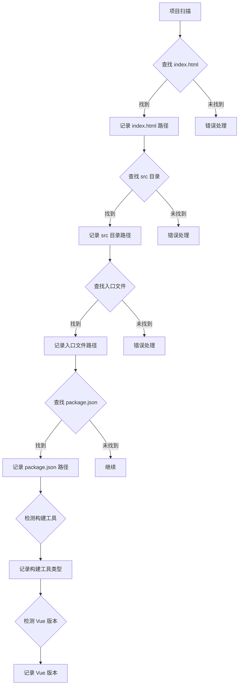
```mermaid
flowchart TD
A[项目扫描] --> B{查找 index.html}
B --> |找到| C[记录 index.html 路径]
B --> |未找到| D[错误处理]
C --> E{查找 src 目录}
E --> |找到| F[记录 src 目录路径]
E --> |未找到| G[错误处理]
F --> H{查找入口文件}
H --> |找到| I[记录入口文件路径]
H --> |未找到| J[错误处理]
I --> K{查找 package.json}
K --> |找到| L[记录 package.json 路径]
K --> |未找到| M[继续]
L --> N{检测构建工具}
N --> O[记录构建工具类型]
O --> P{检测 Vue 版本}
P --> Q[记录 Vue 版本]
```

**图表来源**
- [project_scanner.rs:53-93](file://crates/iris-jetcrab-engine/src/project_scanner.rs#L53-L93)

### ModuleGraph 模块依赖图

**新增**：ModuleGraph管理Vue项目中的模块依赖关系，支持循环依赖检测。

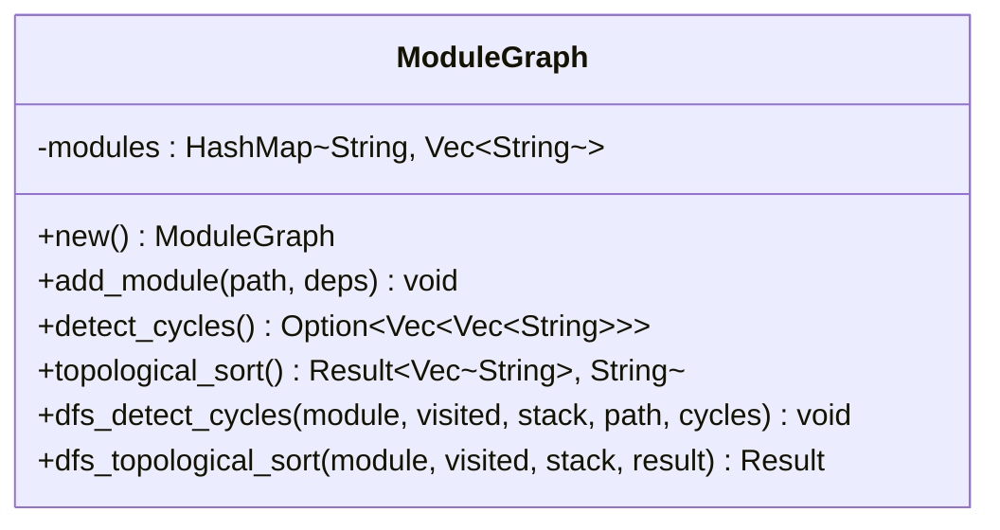
```mermaid
classDiagram
class ModuleGraph {
-modules : HashMap~String, Vec~String~~
+new() ModuleGraph
+add_module(path, deps) void
+detect_cycles() Option~Vec~Vec~String~~~
+topological_sort() Result~Vec~String~, String~
+dfs_detect_cycles(module, visited, stack, path, cycles) void
+dfs_topological_sort(module, visited, stack, result) Result
}
```

**图表来源**
- [module_graph.rs:8-12](file://crates/iris-jetcrab-engine/src/module_graph.rs#L8-L12)

**更新**：ModuleGraph现在支持：
- **循环依赖检测**：使用DFS算法检测循环依赖
- **拓扑排序**：确保依赖先于使用者出现
- **依赖查询**：快速获取模块的依赖列表

### HMRManager 热更新管理器

**新增**：HMRManager提供Vue组件的热更新补丁生成和管理功能。

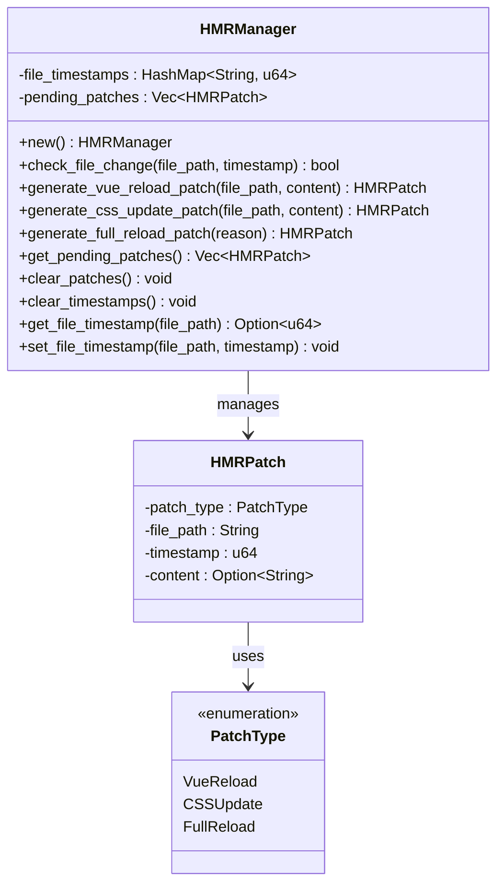
```mermaid
classDiagram
class HMRManager {
-file_timestamps : HashMap~String, u64~
-pending_patches : Vec~HMRPatch~
+new() HMRManager
+check_file_change(file_path, timestamp) bool
+generate_vue_reload_patch(file_path, content) HMRPatch
+generate_css_update_patch(file_path, content) HMRPatch
+generate_full_reload_patch(reason) HMRPatch
+get_pending_patches() Vec~HMRPatch~
+clear_patches() void
+clear_timestamps() void
+get_file_timestamp(file_path) Option~u64~
+set_file_timestamp(file_path, timestamp) void
}
class HMRPatch {
-patch_type : PatchType
-file_path : String
-timestamp : u64
-content : Option~String~
}
class PatchType {
<<enumeration>>
VueReload
CSSUpdate
FullReload
}
HMRManager --> HMRPatch : manages
HMRPatch --> PatchType : uses
```

**图表来源**
- [hmr.rs:34-150](file://crates/iris-jetcrab-engine/src/hmr.rs#L34-L150)
- [hmr.rs:10-32](file://crates/iris-jetcrab-engine/src/hmr.rs#L10-L32)

**更新**：HMRManager的主要功能包括：
- **文件变更检测**：监控文件修改时间和生成相应补丁
- **补丁生成**：支持Vue组件重载、CSS更新、完整页面重载三种类型
- **补丁队列管理**：维护待处理的热更新补丁
- **时间戳缓存**：跟踪文件最后修改时间

### 编译缓存系统

**新增**：VueProjectCompiler内置了智能编译缓存系统：
- 自动缓存编译结果，避免重复编译
- 支持缓存清理和统计功能
- 提供缓存统计功能
- 支持批量编译优化

### 依赖解析器

**新增**：支持多种文件格式的依赖解析：
- **Vue SFC文件**：使用iris-sfc编译器解析
- **JavaScript/TypeScript文件**：解析import和require语句
- **npm包依赖**：自动解析和编译npm包
- **静态资源**：支持CSS、SCSS、Less等预处理器

**章节来源**
- [engine.rs:305-370](file://crates/iris-jetcrab-engine/src/engine.rs#L305-L370)
- [vue_compiler.rs:128-165](file://crates/iris-jetcrab-engine/src/vue_compiler.rs#L128-L165)
- [project_scanner.rs:41-93](file://crates/iris-jetcrab-engine/src/project_scanner.rs#L41-L93)
- [module_graph.rs:14-155](file://crates/iris-jetcrab-engine/src/module_graph.rs#L14-L155)
- [hmr.rs:67-150](file://crates/iris-jetcrab-engine/src/hmr.rs#L67-L150)

### ESM 模块加载器

增强的ESM模块加载器提供了完整的模块系统支持：

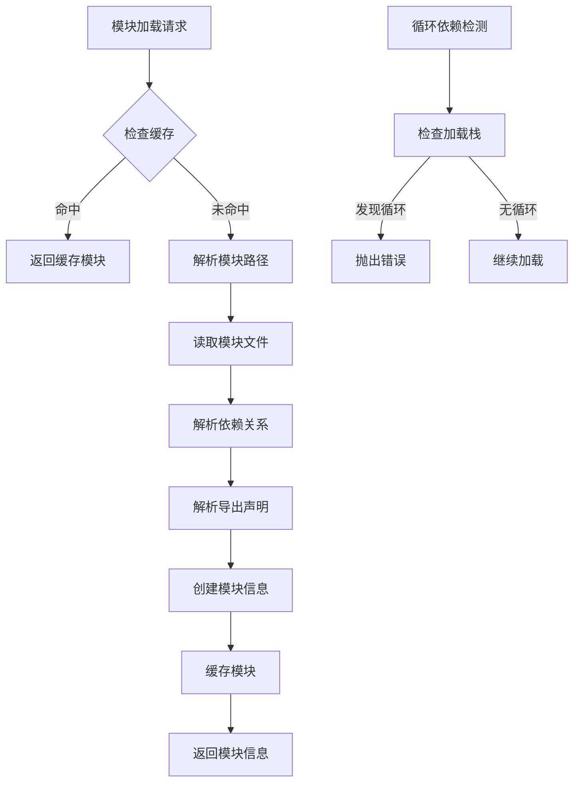
```mermaid
flowchart TD
A[模块加载请求] --> B{检查缓存}
B --> |命中| C[返回缓存模块]
B --> |未命中| D[解析模块路径]
D --> E[读取模块文件]
E --> F[解析依赖关系]
F --> G[解析导出声明]
G --> H[创建模块信息]
H --> I[缓存模块]
I --> J[返回模块信息]
K[循环依赖检测] --> L[检查加载栈]
L --> |发现循环| M[抛出错误]
L --> |无循环| N[继续加载]
```

**图表来源**
- [esm.rs:109-181](file://crates/iris-jetcrab/src/esm.rs#L109-L181)
- [esm.rs:27-57](file://crates/iris-jetcrab/src/esm.rs#L27-L57)

**章节来源**
- [esm.rs:80-444](file://crates/iris-jetcrab/src/esm.rs#L80-L444)

### CPM 包管理器

CPM（Crab Package Manager）提供了npm包的本地管理能力：

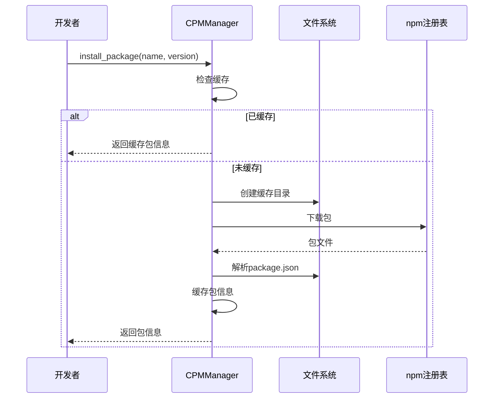
```mermaid
sequenceDiagram
participant Dev as 开发者
participant CPM as CPMManager
participant FS as 文件系统
participant Registry as npm注册表
Dev->>CPM : install_package(name, version)
CPM->>CPM : 检查缓存
alt 已缓存
CPM-->>Dev : 返回缓存包信息
else 未缓存
CPM->>FS : 创建缓存目录
CPM->>Registry : 下载包
Registry-->>CPM : 包文件
CPM->>FS : 解析package.json
CPM->>CPM : 缓存包信息
CPM-->>Dev : 返回包信息
end
```

**图表来源**
- [cpm.rs:86-138](file://crates/iris-jetcrab/src/cpm.rs#L86-L138)

**章节来源**
- [cpm.rs:36-235](file://crates/iris-jetcrab/src/cpm.rs#L36-L235)

### Web API 兼容层

Web API兼容层实现了浏览器标准API的JetCrab版本：

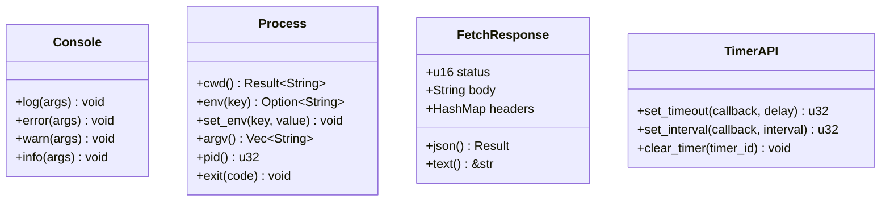
```mermaid
classDiagram
class Console {
+log(args) void
+error(args) void
+warn(args) void
+info(args) void
}
class Process {
+cwd() Result~String~
+env(key) Option~String~
+set_env(key, value) void
+argv() Vec~String~
+pid() u32
+exit(code) void
}
class FetchResponse {
+u16 status
+String body
+HashMap headers
+json() Result
+text() &str
}
class TimerAPI {
+set_timeout(callback, delay) u32
+set_interval(callback, interval) u32
+clear_timer(timer_id) void
}
```

**图表来源**
- [web_apis.rs:7-167](file://crates/iris-jetcrab/src/web_apis.rs#L7-L167)

**章节来源**
- [web_apis.rs:1-204](file://crates/iris-jetcrab/src/web_apis.rs#L1-L204)

### WASM 桥接系统

WASM桥接系统提供了Rust与JavaScript之间的互操作能力：

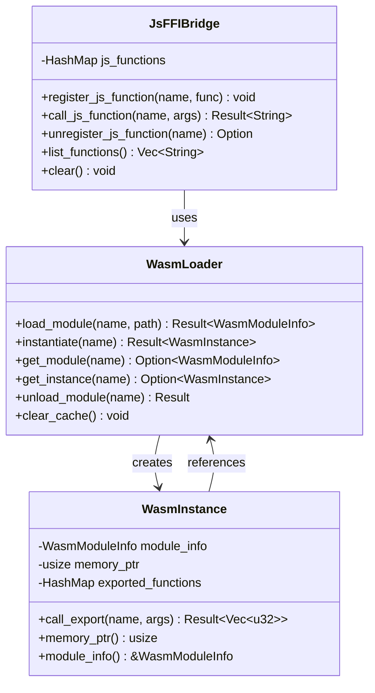
```mermaid
classDiagram
class WasmLoader {
+load_module(name, path) Result~WasmModuleInfo~
+instantiate(name) Result~WasmInstance~
+get_module(name) Option~WasmModuleInfo~
+get_instance(name) Option~WasmInstance~
+unload_module(name) Result
+clear_cache() void
}
class WasmInstance {
-WasmModuleInfo module_info
-usize memory_ptr
-HashMap exported_functions
+call_export(name, args) Result~Vec~u32~~
+memory_ptr() usize
+module_info() &WasmModuleInfo
}
class JsFFIBridge {
-HashMap js_functions
+register_js_function(name, func) void
+call_js_function(name, args) Result~String~
+unregister_js_function(name) Option
+list_functions() Vec~String~
+clear() void
}
WasmLoader --> WasmInstance : creates
WasmInstance --> WasmLoader : references
JsFFIBridge --> WasmLoader : uses
```

**图表来源**
- [wasm_bridge.rs:64-241](file://crates/iris-jetcrab/src/wasm_bridge.rs#L64-L241)

**章节来源**
- [wasm_bridge.rs:1-369](file://crates/iris-jetcrab/src/wasm_bridge.rs#L1-L369)

## 依赖树管理系统

**新增**：DependencyTree模块是Iris-JetCrab引擎的核心依赖管理组件，负责解析和管理npm依赖树。

### 核心功能概述

DependencyTree模块实现了以下核心功能：

1. **依赖解析**：从package.json解析所有npm依赖
2. **编译工具过滤**：智能排除构建工具类依赖
3. **版本变化检测**：通过哈希比较检测依赖版本变化
4. **按需重新编译**：自动重新编译受影响的模块
5. **依赖树缓存**：缓存依赖树以提升启动性能

### DependencyTree 数据结构

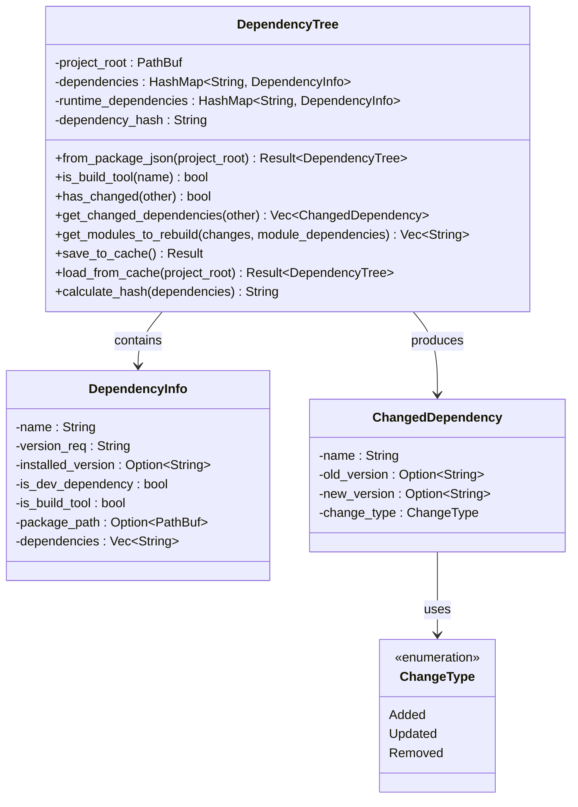
```mermaid
classDiagram
class DependencyTree {
-project_root : PathBuf
-dependencies : HashMap~String, DependencyInfo~
-runtime_dependencies : HashMap~String, DependencyInfo~
-dependency_hash : String
+from_package_json(project_root) Result~DependencyTree~
+is_build_tool(name) bool
+has_changed(other) bool
+get_changed_dependencies(other) Vec~ChangedDependency~
+get_modules_to_rebuild(changes, module_dependencies) Vec~String~
+save_to_cache() Result
+load_from_cache(project_root) Result~DependencyTree~
+calculate_hash(dependencies) String
}
class DependencyInfo {
-name : String
-version_req : String
-installed_version : Option~String~
-is_dev_dependency : bool
-is_build_tool : bool
-package_path : Option~PathBuf~
-dependencies : Vec~String~
}
class ChangedDependency {
-name : String
-old_version : Option~String~
-new_version : Option~String~
-change_type : ChangeType
}
class ChangeType {
<<enumeration>>
Added
Updated
Removed
}
DependencyTree --> DependencyInfo : contains
DependencyTree --> ChangedDependency : produces
ChangedDependency --> ChangeType : uses
```

**图表来源**
- [dependency_tree.rs:52-63](file://crates/iris-jetcrab-engine/src/dependency_tree.rs#L52-L63)
- [dependency_tree.rs:33-50](file://crates/iris-jetcrab-engine/src/dependency_tree.rs#L33-L50)
- [dependency_tree.rs:369-374](file://crates/iris-jetcrab-engine/src/dependency_tree.rs#L369-L374)

### 编译工具过滤机制

DependencyTree模块内置了智能的编译工具过滤机制，自动排除不需要编译到运行时的工具类依赖：

**排除列表包含**：
- **构建工具**：vite、webpack、rollup、esbuild、swc
- **Babel相关**：babel-loader、@babel/core、@babel/preset-env
- **TypeScript编译**：typescript、ts-loader、ts-node
- **开发工具**：eslint、prettier、stylelint
- **测试工具**：jest、vitest、mocha、chai
- **其他开发依赖**：nodemon、concurrently、cross-env

### 依赖版本变化检测

通过计算依赖哈希来检测版本变化：

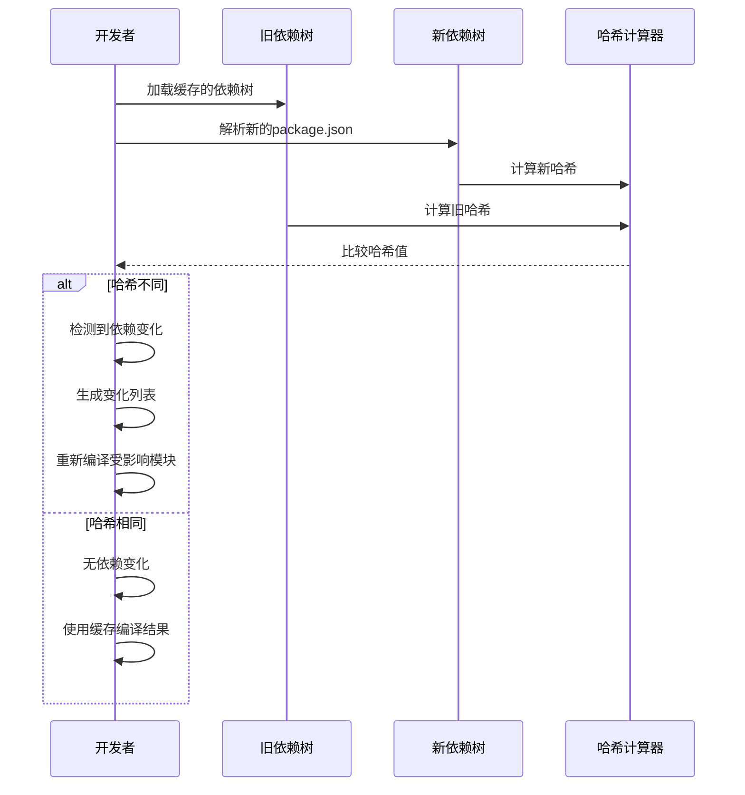
```mermaid
sequenceDiagram
participant Dev as 开发者
participant OldTree as 旧依赖树
participant NewTree as 新依赖树
participant Hasher as 哈希计算器
Dev->>OldTree : 加载缓存的依赖树
Dev->>NewTree : 解析新的package.json
NewTree->>Hasher : 计算新哈希
OldTree->>Hasher : 计算旧哈希
Hasher-->>Dev : 比较哈希值
alt 哈希不同
Dev->>Dev : 检测到依赖变化
Dev->>Dev : 生成变化列表
Dev->>Dev : 重新编译受影响模块
else 哈希相同
Dev->>Dev : 无依赖变化
Dev->>Dev : 使用缓存编译结果
end
```

**图表来源**
- [dependency_tree.rs:254-257](file://crates/iris-jetcrab-engine/src/dependency_tree.rs#L254-L257)
- [dependency_tree.rs:260-301](file://crates/iris-jetcrab-engine/src/dependency_tree.rs#L260-L301)

### 按需重新编译机制

当检测到依赖变化时，自动重新编译受影响的模块：

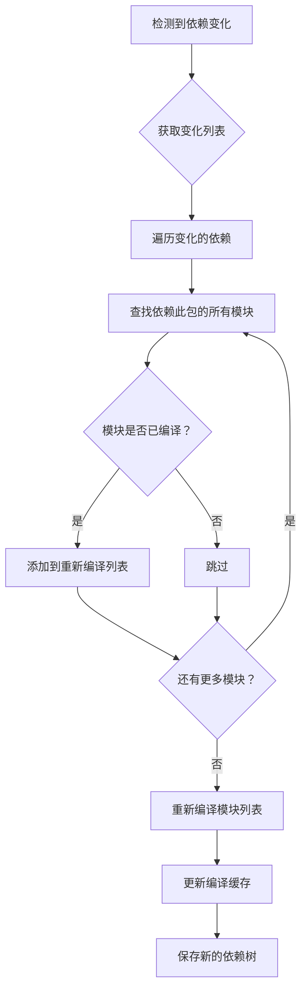
```mermaid
flowchart TD
A[检测到依赖变化] --> B{获取变化列表}
B --> C[遍历变化的依赖]
C --> D[查找依赖此包的所有模块]
D --> E{模块是否已编译？}
E --> |是| F[添加到重新编译列表]
E --> |否| G[跳过]
F --> H{还有更多模块？}
G --> H
H --> |是| D
H --> |否| I[重新编译模块列表]
I --> J[更新编译缓存]
J --> K[保存新的依赖树]
```

**图表来源**
- [dependency_tree.rs:303-328](file://crates/iris-jetcrab-engine/src/dependency_tree.rs#L303-L328)

### 依赖树缓存机制

依赖树会自动缓存到`.iris-cache/dependency-tree.json`：

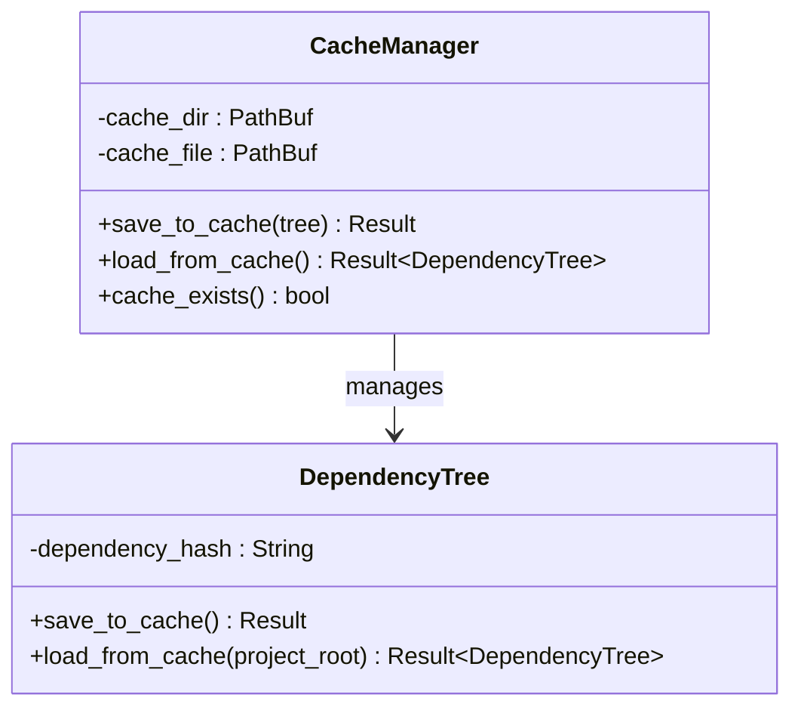
```mermaid
classDiagram
class CacheManager {
-cache_dir : PathBuf
-cache_file : PathBuf
+save_to_cache(tree) Result
+load_from_cache() Result~DependencyTree~
+cache_exists() bool
}
class DependencyTree {
-dependency_hash : String
+save_to_cache() Result
+load_from_cache(project_root) Result~DependencyTree~
}
CacheManager --> DependencyTree : manages
```

**图表来源**
- [dependency_tree.rs:330-356](file://crates/iris-jetcrab-engine/src/dependency_tree.rs#L330-L356)

**更新**：依赖树缓存的优势包括：
- 避免重复解析package.json
- 快速检测依赖变化
- 提升启动速度
- 减少磁盘I/O操作

**章节来源**
- [dependency_tree.rs:1-375](file://crates/iris-jetcrab-engine/src/dependency_tree.rs#L1-L375)
- [DEPENDENCY_TREE_MANAGEMENT.md:1-265](file://docs/DEPENDENCY_TREE_MANAGEMENT.md#L1-L265)
- [dependency_tree_test.rs:1-113](file://crates/iris-jetcrab-engine/tests/dependency_tree_test.rs#L1-L113)

## 编译器缓存集成

**新增**：CompilerCache模块集成了DependencyTree功能，提供完整的按需编译和缓存管理。

### 缓存架构设计

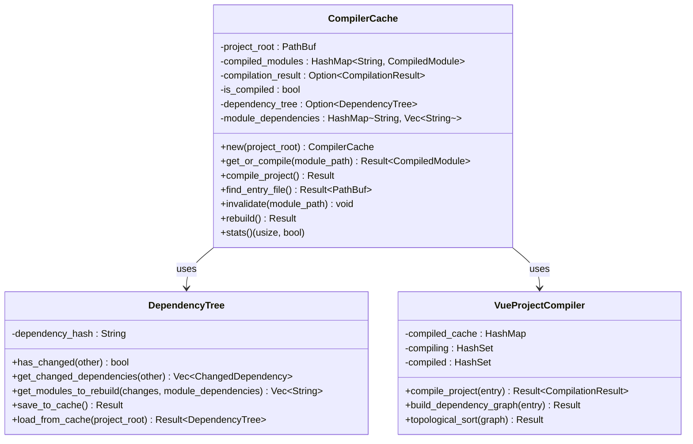
```mermaid
classDiagram
class CompilerCache {
-project_root : PathBuf
-compiled_modules : HashMap~String, CompiledModule~
-compilation_result : Option~CompilationResult~
-is_compiled : bool
-dependency_tree : Option~DependencyTree~
-module_dependencies : HashMap~String, Vec~String~~
+new(project_root) CompilerCache
+get_or_compile(module_path) Result~CompiledModule~
+compile_project() Result
+find_entry_file() Result~PathBuf~
+invalidate(module_path) void
+rebuild() Result
+stats() (usize, bool)
}
class DependencyTree {
-dependency_hash : String
+has_changed(other) bool
+get_changed_dependencies(other) Vec~ChangedDependency~
+get_modules_to_rebuild(changes, module_dependencies) Vec~String~
+save_to_cache() Result
+load_from_cache(project_root) Result~DependencyTree~
}
class VueProjectCompiler {
-compiled_cache : HashMap
-compiling : HashSet
-compiled : HashSet
+compile_project(entry) Result~CompilationResult~
+build_dependency_graph(entry) Result
+topological_sort(graph) Result
}
CompilerCache --> DependencyTree : uses
CompilerCache --> VueProjectCompiler : uses
```

**图表来源**
- [compiler_cache.rs:20-59](file://crates/iris-jetcrab-cli/src/server/compiler_cache.rs#L20-L59)
- [compiler_cache.rs:97-165](file://crates/iris-jetcrab-cli/src/server/compiler_cache.rs#L97-L165)

### 按需编译工作流程

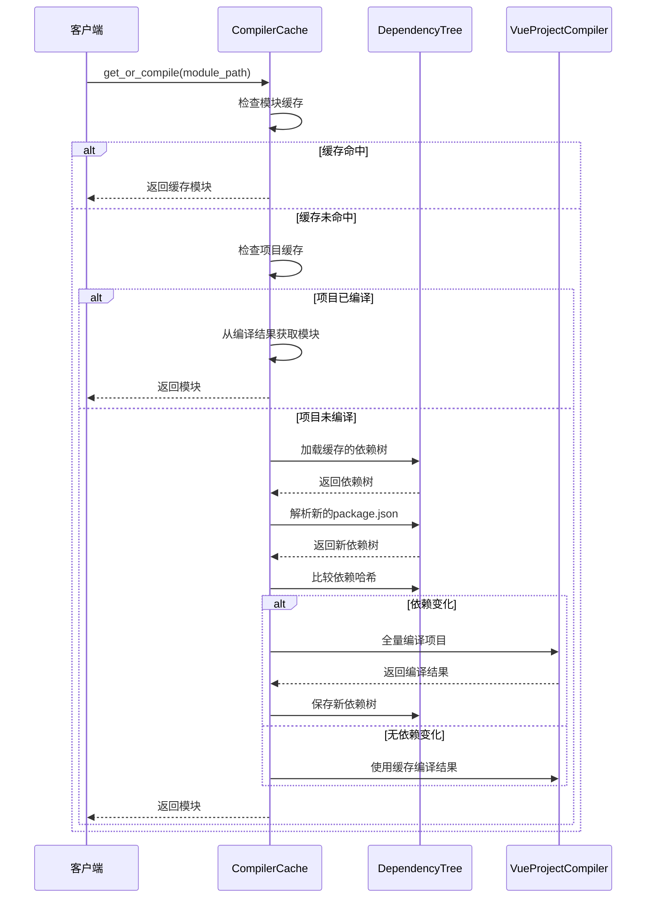
```mermaid
sequenceDiagram
participant Client as 客户端
participant Cache as CompilerCache
participant DepTree as DependencyTree
participant Compiler as VueProjectCompiler
Client->>Cache : get_or_compile(module_path)
Cache->>Cache : 检查模块缓存
alt 缓存命中
Cache-->>Client : 返回缓存模块
else 缓存未命中
Cache->>Cache : 检查项目缓存
alt 项目已编译
Cache->>Cache : 从编译结果获取模块
Cache-->>Client : 返回模块
else 项目未编译
Cache->>DepTree : 加载缓存的依赖树
DepTree-->>Cache : 返回依赖树
Cache->>DepTree : 解析新的package.json
DepTree-->>Cache : 返回新依赖树
Cache->>DepTree : 比较依赖哈希
alt 依赖变化
Cache->>Compiler : 全量编译项目
Compiler-->>Cache : 返回编译结果
Cache->>DepTree : 保存新依赖树
else 无依赖变化
Cache->>Compiler : 使用缓存编译结果
end
Cache-->>Client : 返回模块
end
end
```

**图表来源**
- [compiler_cache.rs:61-95](file://crates/iris-jetcrab-cli/src/server/compiler_cache.rs#L61-L95)
- [compiler_cache.rs:97-165](file://crates/iris-jetcrab-cli/src/server/compiler_cache.rs#L97-L165)

### 依赖变化检测集成

CompilerCache模块与DependencyTree的深度集成：

**更新**：在编译项目时的依赖变化检测流程：

1. **加载缓存依赖树**：尝试从`.iris-cache/dependency-tree.json`加载
2. **解析新依赖树**：从`package.json`解析当前依赖
3. **比较依赖哈希**：使用`has_changed()`方法检测变化
4. **生成变化列表**：使用`get_changed_dependencies()`获取详细变化
5. **按需重新编译**：使用`get_modules_to_rebuild()`确定受影响模块

### 缓存统计和监控

CompilerCache提供了基本的缓存统计功能：

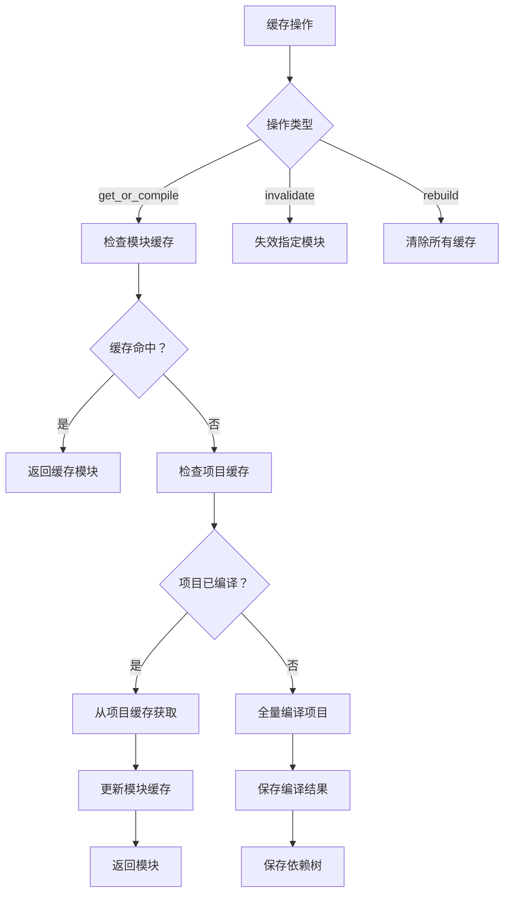
```mermaid
flowchart TD
A[缓存操作] --> B{操作类型}
B --> |get_or_compile| C[检查模块缓存]
B --> |invalidate| D[失效指定模块]
B --> |rebuild| E[清除所有缓存]
C --> F{缓存命中？}
F --> |是| G[返回缓存模块]
F --> |否| H[检查项目缓存]
H --> I{项目已编译？}
I --> |是| J[从项目缓存获取]
I --> |否| K[全量编译项目]
J --> L[更新模块缓存]
K --> M[保存编译结果]
M --> N[保存依赖树]
L --> O[返回模块]
```

**图表来源**
- [compiler_cache.rs:202-222](file://crates/iris-jetcrab-cli/src/server/compiler_cache.rs#L202-L222)

**章节来源**
- [compiler_cache.rs:1-223](file://crates/iris-jetcrab-cli/src/server/compiler_cache.rs#L1-L223)

## WASM API功能

**新增**：Iris引擎现已提供完整的WASM导出接口，允许浏览器端直接调用Vue SFC编译、模块解析和热更新功能。

### IrisEngine 类设计

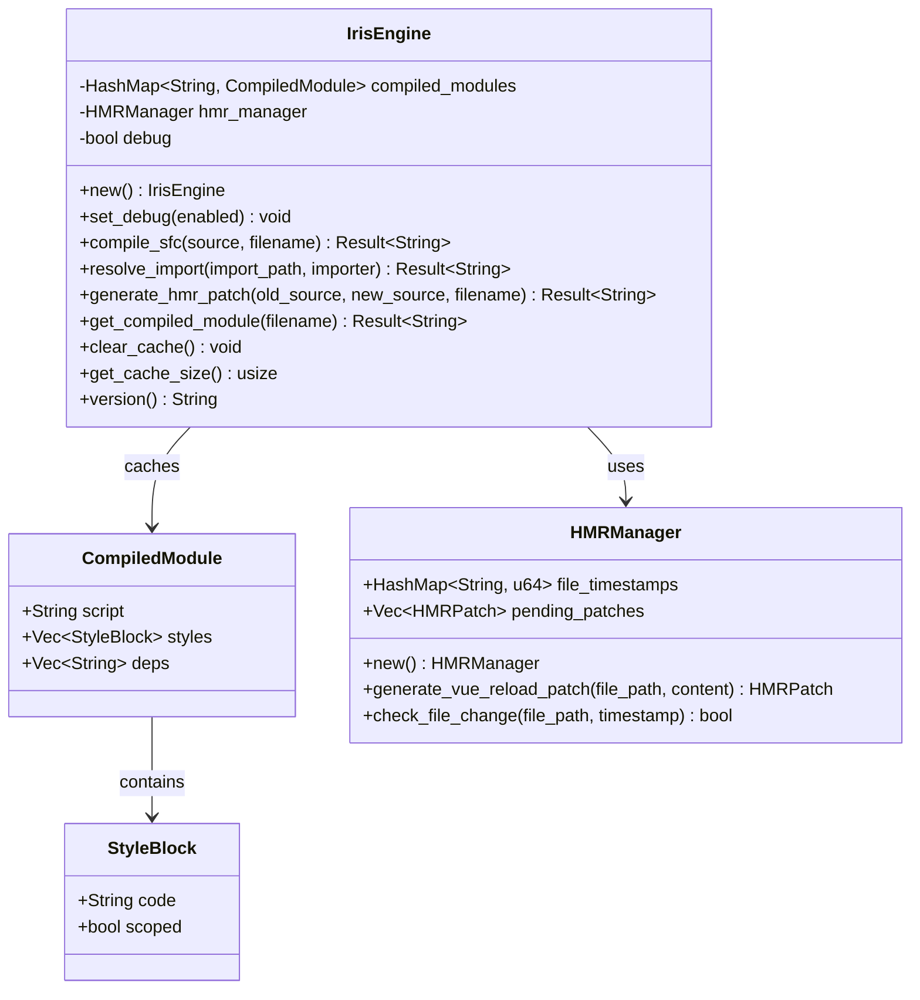
```mermaid
classDiagram
class IrisEngine {
-HashMap~String, CompiledModule~ compiled_modules
-HMRManager hmr_manager
-bool debug
+new() IrisEngine
+set_debug(enabled) void
+compile_sfc(source, filename) Result~String~
+resolve_import(import_path, importer) Result~String~
+generate_hmr_patch(old_source, new_source, filename) Result~String~
+get_compiled_module(filename) Result~String~
+clear_cache() void
+get_cache_size() usize
+version() String
}
class CompiledModule {
+String script
+Vec~StyleBlock~ styles
+Vec~String~ deps
}
class StyleBlock {
+String code
+bool scoped
}
class HMRManager {
+HashMap~String, u64~ file_timestamps
+Vec~HMRPatch~ pending_patches
+new() HMRManager
+generate_vue_reload_patch(file_path, content) HMRPatch
+check_file_change(file_path, timestamp) bool
}
IrisEngine --> CompiledModule : caches
IrisEngine --> HMRManager : uses
CompiledModule --> StyleBlock : contains
```

**图表来源**
- [wasm_api.rs:40-191](file://crates/iris-jetcrab-engine/src/wasm_api.rs#L40-L191)
- [sfc_compiler.rs:9-27](file://crates/iris-jetcrab-engine/src/sfc_compiler.rs#L9-L27)
- [hmr.rs:34-150](file://crates/iris-jetcrab-engine/src/hmr.rs#L34-L150)

### 核心API方法

IrisEngine类提供了9个核心方法，支持完整的Vue SFC开发工作流：

1. **compileSfc** - 编译Vue SFC文件并返回JSON格式结果
2. **resolveImport** - 解析模块导入路径
3. **generateHmrPatch** - 生成热更新补丁
4. **getCompiledModule** - 获取已编译模块信息
5. **clearCache** - 清除编译缓存
6. **getCacheSize** - 获取缓存大小
7. **setDebug** - 设置调试模式
8. **version** - 获取引擎版本
9. **构造函数** - 创建IrisEngine实例

### 编译缓存机制

IrisEngine内置了智能编译缓存系统：
- 自动缓存编译结果，避免重复编译
- 支持缓存查询和清理
- 提供缓存统计功能
- 支持批量编译优化

### 热更新（HMR）支持

引擎集成了完整的热更新管理器：
- 监控文件变化并生成相应补丁
- 支持Vue组件重载和CSS更新
- 提供补丁队列管理
- 支持完整页面重载场景

**章节来源**
- [wasm_api.rs:72-184](file://crates/iris-jetcrab-engine/src/wasm_api.rs#L72-L184)
- [sfc_compiler.rs:29-82](file://crates/iris-jetcrab-engine/src/sfc_compiler.rs#L29-L82)
- [hmr.rs:67-150](file://crates/iris-jetcrab-engine/src/hmr.rs#L67-L150)

## 跨平台构建支持

**新增**：引擎提供了完整的跨平台构建支持，包括Windows和Linux/macOS的构建脚本。

### 构建脚本特性

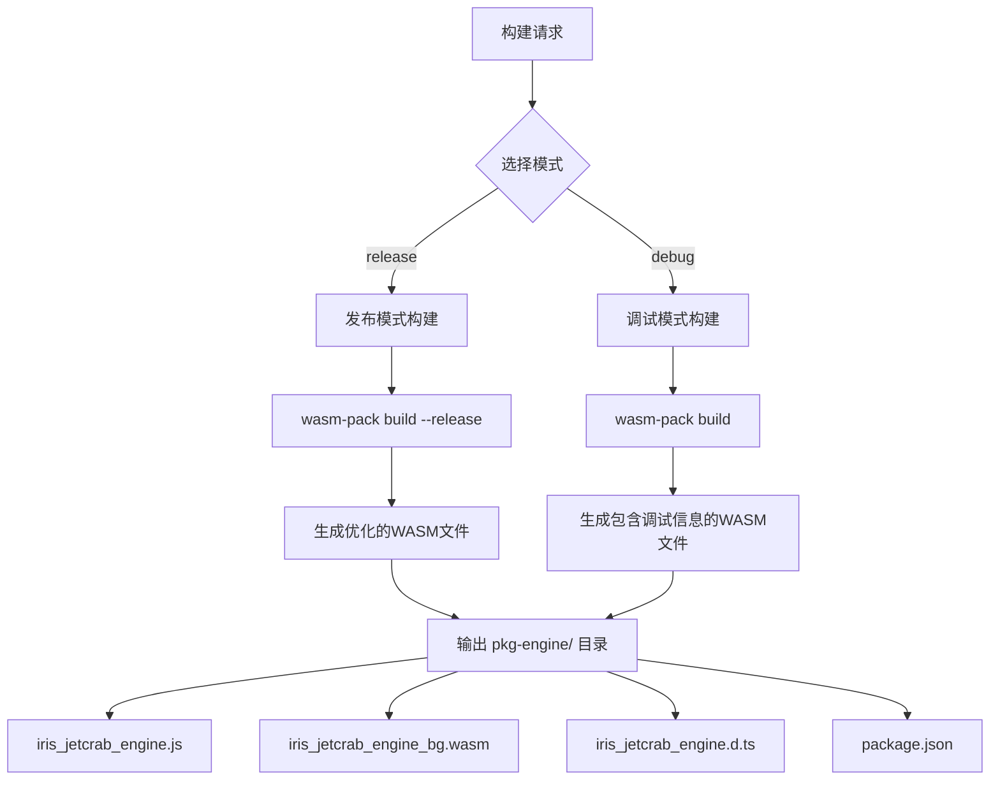
```mermaid
flowchart TD
A[构建请求] --> B{选择模式}
B --> |release| C[发布模式构建]
B --> |debug| D[调试模式构建]
C --> E[wasm-pack build --release]
D --> F[wasm-pack build]
E --> G[生成优化的WASM文件]
F --> H[生成包含调试信息的WASM文件]
G --> I[输出 pkg-engine/ 目录]
H --> I
I --> J[iris_jetcrab_engine.js]
I --> K[iris_jetcrab_engine_bg.wasm]
I --> L[iris_jetcrab_engine.d.ts]
I --> M[package.json]
```

**图表来源**
- [build-wasm-engine.sh:19-25](file://crates/iris-jetcrab-engine/build-wasm-engine.sh#L19-L25)
- [build-wasm-engine.ps1:20-26](file://crates/iris-jetcrab-engine/build-wasm-engine.ps1#L20-L26)

### 构建模式对比

| 特性 | Debug模式 | Release模式 |
|------|-----------|-------------|
| 编译速度 | 快 | 慢 |
| 文件大小 | 大 | 最小化 |
| 调试信息 | 包含 | 移除 |
| 优化级别 | 无 | LTO优化 |
| 适用场景 | 开发调试 | 生产部署 |

### 输出文件结构

构建完成后会在`pkg-engine/`目录生成以下文件：
- `iris_jetcrab_engine.js` - JavaScript绑定文件
- `iris_jetcrab_engine_bg.wasm` - WASM二进制文件
- `iris_jetcrab_engine.d.ts` - TypeScript类型定义
- `package.json` - NPM包配置

**章节来源**
- [build-wasm-engine.sh:1-52](file://crates/iris-jetcrab-engine/build-wasm-engine.sh#L1-L52)
- [build-wasm-engine.ps1:1-68](file://crates/iris-jetcrab-engine/build-wasm-engine.ps1#L1-L68)

## 依赖关系分析

Iris-JetCrab引擎的依赖关系遵循严格的单向依赖原则，确保系统的模块化和可维护性。

```mermaid
graph LR
subgraph "Iris 核心层"
A[iris-core]
B[iris-cssom]
C[iris-layout]
D[iris-dom]
E[iris-gpu]
F[iris-sfc]
end
subgraph "Iris-JetCrab 层"
G[iris-jetcrab]
H[iris-jetcrab-engine]
I[iris-jetcrab-cli]
end
subgraph "外部依赖"
J[Tokio]
K[Reqwest]
L[Serde]
M[WASM Bindgen]
N[wasm-pack]
O[swc]
P[grass]
Q[less-rs]
R[walkdir]
S[html5ever]
T[notify]
U[tracing]
V[anyhow]
W[serde_json]
X[console_error_panic_hook]
Y[uuid]
Z[regex]
end
G --> A
G --> B
G --> C
G --> D
G --> E
G --> F
G --> I
G --> J
G --> K
G --> L
H --> G
H --> I
H --> J
H --> L
H --> M
H --> N
H --> O
H --> P
H --> Q
H --> R
H --> S
H --> T
H --> U
H --> V
I --> H
I --> J
I --> K
I --> L
I --> M
I --> N
I --> O
I --> P
I --> Q
I --> R
I --> S
I --> T
I --> U
I --> V
I --> W
I --> X
I --> Y
I --> Z
```

**图表来源**
- [Cargo.toml:13-36](file://crates/iris-jetcrab/Cargo.toml#L13-L36)
- [Cargo.toml:13-48](file://crates/iris-jetcrab-engine/Cargo.toml#L13-L48)
- [Cargo.toml:13-48](file://crates/iris-jetcrab-cli/Cargo.toml#L13-L48)
- [ARCHITECTURE.md:38-43](file://ARCHITECTURE.md#L38-L43)

**章节来源**
- [Cargo.toml:1-48](file://crates/iris-jetcrab/Cargo.toml#L1-L48)
- [Cargo.toml:13-48](file://crates/iris-jetcrab-engine/Cargo.toml#L13-L48)
- [Cargo.toml:13-48](file://crates/iris-jetcrab-cli/Cargo.toml#L13-L48)
- [ARCHITECTURE.md:36-43](file://ARCHITECTURE.md#L36-L43)

## 性能考虑

Iris-JetCrab引擎在设计时充分考虑了性能优化：

### 模块缓存策略
- ESM模块加载器使用两级缓存（模块缓存和导出缓存）
- 支持缓存清理和统计功能
- 避免重复解析和编译相同模块

### 内存管理
- 运行时配置内存限制
- WASM模块内存指针管理
- 定期清理未使用的资源

### 并发处理
- 基于Tokio的异步I/O
- 并发模块加载和编译
- 异步HTTP请求处理

### WASM优化
- **Release模式优化**：启用LTO链接时优化，文件大小最小化
- **缓存机制**：编译结果自动缓存，避免重复编译
- **批处理支持**：支持批量编译多个文件
- **调试模式**：可选的调试信息，不影响生产性能

### **更新**：VueProjectCompiler性能优化
- **智能缓存**：编译结果缓存，避免重复编译
- **增量编译**：支持部分文件更新的增量编译
- **并行编译**：TypeScript和CSS预处理器支持并行编译
- **依赖图优化**：使用拓扑排序确保最优编译顺序
- **依赖树缓存**：避免重复解析package.json

### **新增**：DependencyTree性能优化
- **哈希缓存**：依赖哈希计算结果缓存
- **增量检测**：只在依赖变化时重新编译
- **模块映射缓存**：模块依赖关系映射缓存
- **并行处理**：多个依赖树操作可以并行执行

### **新增**：CompilerCache性能优化
- **懒加载**：首次请求时才编译整个项目
- **模块级缓存**：单个模块的编译结果缓存
- **项目级缓存**：整个项目的编译结果缓存
- **依赖树缓存**：依赖树解析结果缓存

## 故障排除指南

### 常见问题及解决方案

**问题1：运行时未初始化**
- **症状**：调用eval()时返回"Runtime not initialized"错误
- **解决**：确保先调用init()方法初始化运行时

**问题2：模块加载失败**
- **症状**：ESM模块加载返回"Module not found"错误
- **解决**：检查模块路径和搜索路径配置

**问题3：循环依赖检测错误**
- **症状**：加载模块时报"循环依赖检测"错误
- **解决**：检查模块间的相互依赖关系

**问题4：WASM模块实例化失败**
- **症状**：instantiate()返回错误
- **解决**：确认WASM文件格式正确且导出函数存在

**问题5：WASM构建失败**
- **症状**：构建脚本报错
- **解决**：检查wasm-pack安装状态和系统环境

**问题6：IrisEngine方法调用失败**
- **症状**：compileSfc或resolveImport返回错误
- **解决**：检查输入参数格式和文件路径

**问题7：Vue项目编译失败**
- **症状**：JetCrabEngine.run()返回编译错误
- **解决**：检查Vue文件语法和依赖路径

**问题8：npm包解析失败**
- **症状**：VueProjectCompiler无法解析npm包
- **解决**：确认node_modules目录存在且包已安装

**问题9：项目检测失败**
- **症状**：ProjectScanner检测不到Vue项目
- **解决**：检查项目目录结构和文件存在性

**问题10：入口文件查找失败**
- **症状**：找不到入口文件
- **解决**：确认src目录和入口文件存在

**问题11：依赖树解析失败**
- **症状**：DependencyTree.from_package_json()返回错误
- **解决**：检查package.json格式和权限

**问题12：依赖变化检测异常**
- **症状**：依赖变化检测不准确
- **解决**：检查依赖树缓存文件和哈希计算

**问题13：按需重新编译失败**
- **症状**：依赖变化后未重新编译模块
- **解决**：检查模块依赖映射和变化检测逻辑

**问题14：编译器缓存失效**
- **症状**：CompilerCache无法正确缓存编译结果
- **解决**：检查缓存目录权限和磁盘空间

**章节来源**
- [runtime.rs:108-121](file://crates/iris-jetcrab/src/runtime.rs#L108-L121)
- [esm.rs:41-57](file://crates/iris-jetcrab/src/esm.rs#L41-L57)
- [wasm_bridge.rs:132-162](file://crates/iris-jetcrab/src/wasm_bridge.rs#L132-L162)
- [engine.rs:305-370](file://crates/iris-jetcrab-engine/src/engine.rs#L305-L370)
- [project_scanner.rs:116-159](file://crates/iris-jetcrab-engine/src/project_scanner.rs#L116-L159)
- [dependency_tree.rs:67-78](file://crates/iris-jetcrab-engine/src/dependency_tree.rs#L67-L78)
- [compiler_cache.rs:36-59](file://crates/iris-jetcrab-cli/src/server/compiler_cache.rs#L36-L59)

## 结论

Iris-JetCrab引擎作为Iris框架的重要组成部分，成功地将JetCrab JavaScript引擎与Rust生态系统相结合。通过模块化设计和严格的架构约束，该引擎为开发者提供了：

1. **完整的Web API兼容性**：确保JavaScript代码的可移植性
2. **高效的模块系统**：支持ESM和npm包管理
3. **强大的WASM互操作能力**：实现Rust与JavaScript的无缝集成
4. **完善的热更新支持**：提供Vue组件的实时开发体验
5. **跨平台构建支持**：简化WASM模块的部署流程
6. **优秀的性能表现**：通过缓存和并发优化提升执行效率

**更新**：**重构的编译架构**使Iris引擎能够处理复杂的Vue项目，从单个文件编译升级为完整的项目编译，包括：
- **完整的依赖解析**：支持Vue SFC、TypeScript、CSS预处理器等多种文件格式
- **智能缓存机制**：避免重复编译，提升开发效率
- **拓扑排序优化**：确保模块按正确的依赖顺序编译
- **npm包支持**：自动解析和编译npm包依赖
- **项目检测能力**：自动识别Vue项目结构和配置

**新增的DependencyTree模块**为引擎提供了强大的依赖管理能力，包括：
- **智能编译工具过滤**：自动排除构建工具，只关注运行时依赖
- **精确的版本变化检测**：通过哈希比较确保依赖变化的准确性
- **按需重新编译**：只在依赖变化时重新编译受影响的模块
- **依赖树缓存**：避免重复解析package.json，提升启动速度
- **模块依赖映射**：支持复杂的模块依赖关系管理

**新增的编译器缓存集成**进一步提升了引擎的性能：
- **懒加载机制**：首次请求时才编译整个项目
- **模块级缓存**：单个模块的编译结果独立缓存
- **项目级缓存**：整个项目的编译结果统一管理
- **依赖树缓存**：依赖树解析结果持久化存储

**新增的ProjectScanner模块**为引擎提供了强大的项目检测能力，包括：
- **多策略项目检测**：结合package.json和文件系统检测Vue项目
- **详细的项目信息**：提供根目录、入口文件、构建工具等详细信息
- **构建工具识别**：支持Vite和Vue CLI检测
- **Vue版本检测**：自动检测Vue 2或Vue 3

**新增的HMRManager模块**为引擎提供了完整的热更新支持：
- **文件变更监控**：实时检测文件修改
- **补丁生成**：支持Vue组件重载、CSS更新、完整页面重载
- **补丁队列管理**：维护待处理的热更新补丁
- **时间戳跟踪**：精确跟踪文件修改时间

**新增的WASM API功能**使Iris引擎能够直接服务于浏览器端的Vue SFC编译需求，为现代Web开发提供了更加灵活和高效的解决方案。随着项目的不断发展，Iris-JetCrab引擎将继续演进，为构建现代化的跨平台应用提供强有力的支持。

**新增的依赖树管理系统**代表了引擎架构的重大进步，它不仅提供了完整的npm依赖管理功能，更重要的是为整个编译系统奠定了智能化的基础。通过依赖树缓存、版本变化检测和按需重新编译机制，引擎能够在保证编译准确性的同时，最大化地提升开发效率和用户体验。