# Iris-JetCrab引擎

<cite>
**本文档引用的文件**
- [lib.rs](file://crates/iris-jetcrab/src/lib.rs)
- [runtime.rs](file://crates/iris-jetcrab/src/runtime.rs)
- [web_apis.rs](file://crates/iris-jetcrab/src/web_apis.rs)
- [module.rs](file://crates/iris-jetcrab/src/module.rs)
- [esm.rs](file://crates/iris-jetcrab/src/esm.rs)
- [cpm.rs](file://crates/iris-jetcrab/src/cpm.rs)
- [wasm_bridge.rs](file://crates/iris-jetcrab/src/wasm_bridge.rs)
- [web_apis_enhanced.rs](file://crates/iris-jetcrab/src/web_apis_enhanced.rs)
- [bridge.rs](file://crates/iris-jetcrab/src/bridge.rs)
- [Cargo.toml](file://crates/iris-jetcrab/Cargo.toml)
- [ARCHITECTURE.md](file://ARCHITECTURE.md)
- [wasm_api.rs](file://crates/iris-jetcrab-engine/src/wasm_api.rs)
- [WASM_API.md](file://crates/iris-jetcrab-engine/WASM_API.md)
- [build-wasm-engine.sh](file://crates/iris-jetcrab-engine/build-wasm-engine.sh)
- [build-wasm-engine.ps1](file://crates/iris-jetcrab-engine/build-wasm-engine.ps1)
- [Cargo.toml](file://crates/iris-jetcrab-engine/Cargo.toml)
- [lib.rs](file://crates/iris-jetcrab-engine/src/lib.rs)
- [sfc_compiler.rs](file://crates/iris-jetcrab-engine/src/sfc_compiler.rs)
- [hmr.rs](file://crates/iris-jetcrab-engine/src/hmr.rs)
- [engine.rs](file://crates/iris-jetcrab-engine/src/engine.rs)
- [vue_compiler.rs](file://crates/iris-jetcrab-engine/src/vue_compiler.rs)
- [project_scanner.rs](file://crates/iris-jetcrab-engine/src/project_scanner.rs)
- [module_graph.rs](file://crates/iris-jetcrab-engine/src/module_graph.rs)
</cite>

## 更新摘要
**变更内容**
- 更新编译流程说明，反映从直接执行entry文件到使用VueProjectCompiler进行完整项目编译的重构
- 新增VueProjectCompiler详细分析，包括依赖图构建和拓扑排序
- 更新JetCrabEngine.run()方法实现，展示完整的项目编译执行流程
- 新增项目扫描器和模块图管理器的功能说明
- 更新架构图以反映新的编译流程

## 目录
1. [简介](#简介)
2. [项目结构](#项目结构)
3. [核心组件](#核心组件)
4. [架构概览](#架构概览)
5. [详细组件分析](#详细组件分析)
6. [WASM API功能](#wasm-api功能)
7. [跨平台构建支持](#跨平台构建支持)
8. [依赖关系分析](#依赖关系分析)
9. [性能考虑](#性能考虑)
10. [故障排除指南](#故障排除指南)
11. [结论](#结论)

## 简介

Iris-JetCrab引擎是Iris跨平台UI框架中的JavaScript执行引擎，基于JetCrab Chitin引擎构建。该引擎提供了完整的npm包支持、ESM模块系统、Web API兼容层以及**WASM原生支持**，实现了从Vue SFC到JavaScript代码的完整执行链路。

**更新**：引擎现已重构编译流程，从直接执行单个entry文件改为使用VueProjectCompiler进行完整项目编译，支持复杂的依赖关系解析和模块管理。

该引擎的核心目标是在Rust生态系统中提供高性能的JavaScript执行环境，同时保持与现代Web标准的兼容性。通过模块化设计，Iris-JetCrab能够无缝集成到Iris的整体架构中，为开发者提供流畅的开发体验。

## 项目结构

Iris-JetCrab引擎采用模块化架构，主要包含以下核心模块：

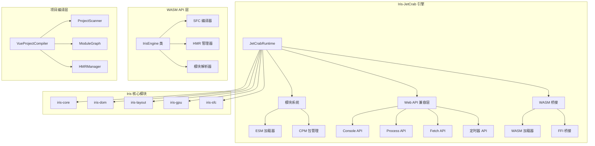

**图表来源**
- [lib.rs:1-82](file://crates/iris-jetcrab/src/lib.rs#L1-L82)
- [Cargo.toml:13-36](file://crates/iris-jetcrab/Cargo.toml#L13-L36)
- [wasm_api.rs:13-47](file://crates/iris-jetcrab-engine/src/wasm_api.rs#L13-L47)
- [engine.rs:13-15](file://crates/iris-jetcrab-engine/src/engine.rs#L13-L15)

**章节来源**
- [lib.rs:1-82](file://crates/iris-jetcrab/src/lib.rs#L1-L82)
- [Cargo.toml:1-48](file://crates/iris-jetcrab/Cargo.toml#L1-L48)

## 核心组件

### JetCrabRuntime 核心运行时

JetCrabRuntime是引擎的核心执行环境，负责管理JavaScript代码的执行生命周期。该组件提供了完整的运行时配置管理和资源生命周期控制。

**主要特性：**
- 可配置的运行时参数（严格模式、执行超时、内存限制）
- 生命周期管理（初始化、执行、关闭）
- 全局变量管理
- 错误处理机制

### 模块系统

Iris-JetCrab提供了两套模块加载系统：

1. **基础模块加载器**：支持基本的ESM模块解析和缓存
2. **增强ESM加载器**：提供完整的模块依赖解析、循环依赖检测和编译支持

### Web API 兼容层

实现了浏览器标准API的JetCrab版本，包括：
- Console API（日志、错误、警告、信息）
- Process API（环境变量、工作目录、进程信息）
- Fetch API（HTTP请求）
- 定时器API（setTimeout、setInterval）

### WASM 桥接

提供WASM模块加载和Rust↔JavaScript FFI支持，包括：
- WASM模块加载和实例化
- 导出函数调用
- JavaScript FFI桥接

**章节来源**
- [runtime.rs:32-202](file://crates/iris-jetcrab/src/runtime.rs#L32-L202)
- [module.rs:20-167](file://crates/iris-jetcrab/src/module.rs#L20-L167)
- [esm.rs:80-444](file://crates/iris-jetcrab/src/esm.rs#L80-L444)
- [web_apis.rs:7-204](file://crates/iris-jetcrab/src/web_apis.rs#L7-L204)
- [wasm_bridge.rs:64-241](file://crates/iris-jetcrab/src/wasm_bridge.rs#L64-L241)

## 架构概览

Iris-JetCrab引擎在整个Iris架构中扮演着关键角色，作为JavaScript执行层连接上层Vue SFC编译器和底层渲染系统。

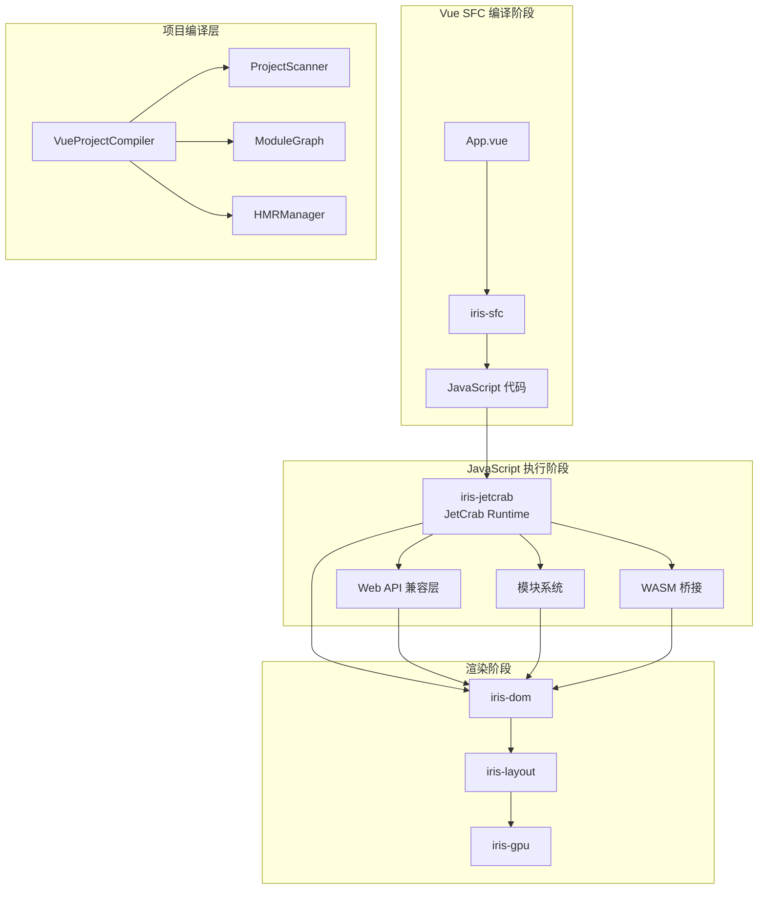

**图表来源**
- [lib.rs:7-15](file://crates/iris-jetcrab/src/lib.rs#L7-L15)
- [ARCHITECTURE.md:140-157](file://ARCHITECTURE.md#L140-L157)

该架构确保了：
1. **模块分离**：每个组件职责单一，便于维护和测试
2. **可扩展性**：新功能通过添加模块而非修改现有模块实现
3. **性能优化**：各层独立优化，避免相互影响
4. **兼容性**：提供完整的Web API兼容层

**章节来源**
- [ARCHITECTURE.md:1-289](file://ARCHITECTURE.md#L1-L289)
- [lib.rs:17-27](file://crates/iris-jetcrab/src/lib.rs#L17-L27)

## 详细组件分析

### JetCrabEngine 类设计

**更新**：JetCrabEngine现在提供完整的Vue项目编译和执行能力，不再直接执行单个entry文件，而是使用VueProjectCompiler进行完整项目编译。

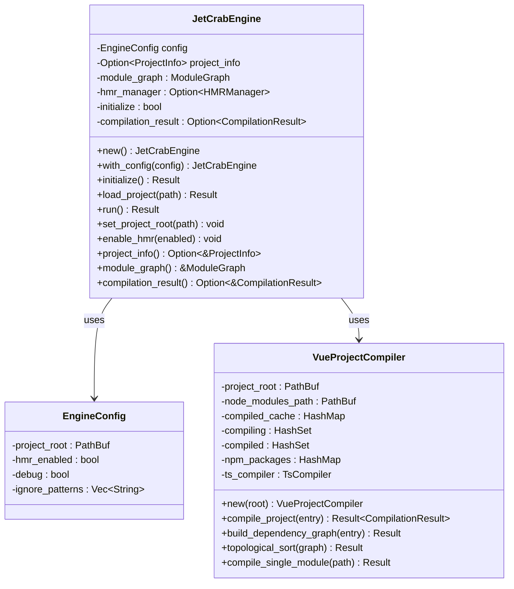

**图表来源**
- [engine.rs:48-61](file://crates/iris-jetcrab-engine/src/engine.rs#L48-L61)
- [engine.rs:16-27](file://crates/iris-jetcrab-engine/src/engine.rs#L16-L27)
- [vue_compiler.rs:51-69](file://crates/iris-jetcrab-engine/src/vue_compiler.rs#L51-L69)

**更新**：JetCrabEngine.run()方法现在使用VueProjectCompiler进行完整项目编译，包括：
1. 获取入口文件路径
2. 创建VueProjectCompiler实例
3. 调用compile_project()进行完整项目编译
4. 按编译顺序执行模块
5. 初始化渲染循环

### VueProjectCompiler 详细分析

**新增**：VueProjectCompiler是新的项目编译核心，提供完整的Vue项目编译能力。

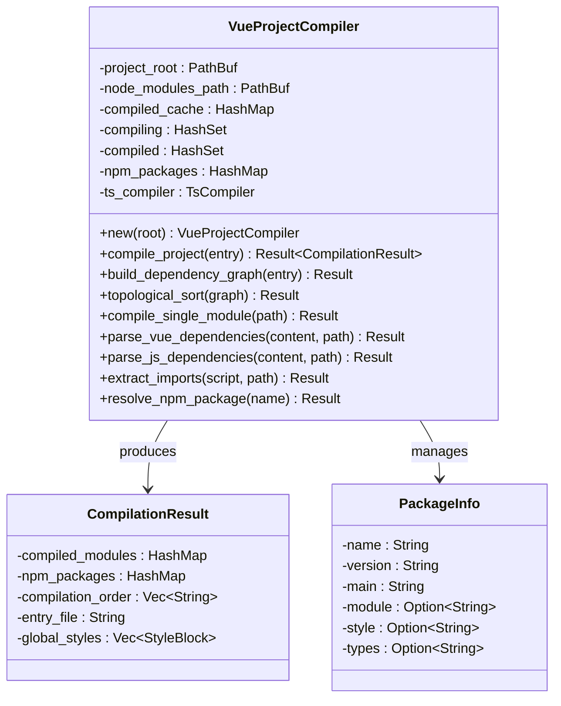

**图表来源**
- [vue_compiler.rs:51-69](file://crates/iris-jetcrab-engine/src/vue_compiler.rs#L51-L69)
- [vue_compiler.rs:36-49](file://crates/iris-jetcrab-engine/src/vue_compiler.rs#L36-L49)
- [vue_compiler.rs:19-34](file://crates/iris-jetcrab-engine/src/vue_compiler.rs#L19-L34)

**更新**：VueProjectCompiler的主要功能包括：
- **依赖图构建**：从入口文件开始递归解析所有依赖
- **拓扑排序**：确保模块按正确的依赖顺序编译
- **多格式支持**：支持Vue SFC、TypeScript、SCSS、Less等
- **npm包解析**：自动解析和编译npm包依赖
- **缓存机制**：智能缓存编译结果，避免重复编译

### ProjectScanner 项目扫描器

**新增**：ProjectScanner负责扫描和解析Vue项目的目录结构。

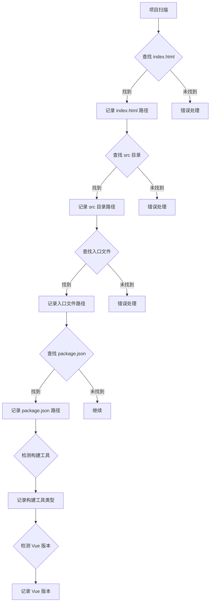

**图表来源**
- [project_scanner.rs:53-93](file://crates/iris-jetcrab-engine/src/project_scanner.rs#L53-L93)

### ModuleGraph 模块依赖图

**新增**：ModuleGraph管理Vue项目中的模块依赖关系，支持循环依赖检测。

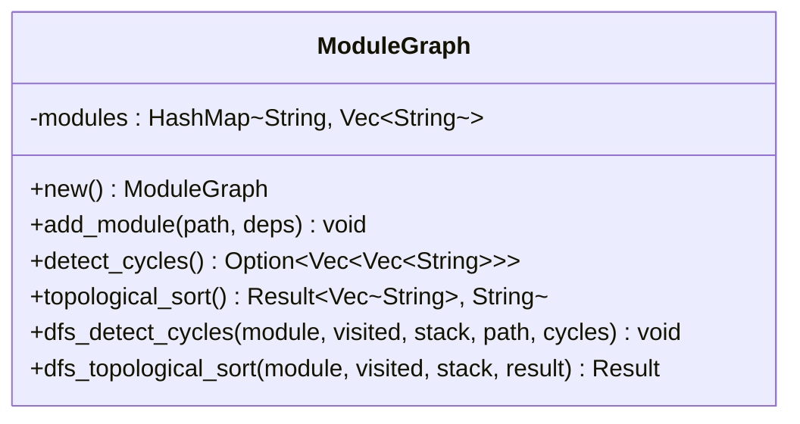

**图表来源**
- [module_graph.rs:8-12](file://crates/iris-jetcrab-engine/src/module_graph.rs#L8-L12)

**更新**：ModuleGraph现在支持：
- **循环依赖检测**：使用DFS算法检测循环依赖
- **拓扑排序**：确保依赖先于使用者出现
- **依赖查询**：快速获取模块的依赖列表

**章节来源**
- [engine.rs:305-370](file://crates/iris-jetcrab-engine/src/engine.rs#L305-L370)
- [vue_compiler.rs:128-165](file://crates/iris-jetcrab-engine/src/vue_compiler.rs#L128-L165)
- [project_scanner.rs:41-93](file://crates/iris-jetcrab-engine/src/project_scanner.rs#L41-L93)
- [module_graph.rs:14-155](file://crates/iris-jetcrab-engine/src/module_graph.rs#L14-L155)

### ESM 模块加载器

增强的ESM模块加载器提供了完整的模块系统支持：

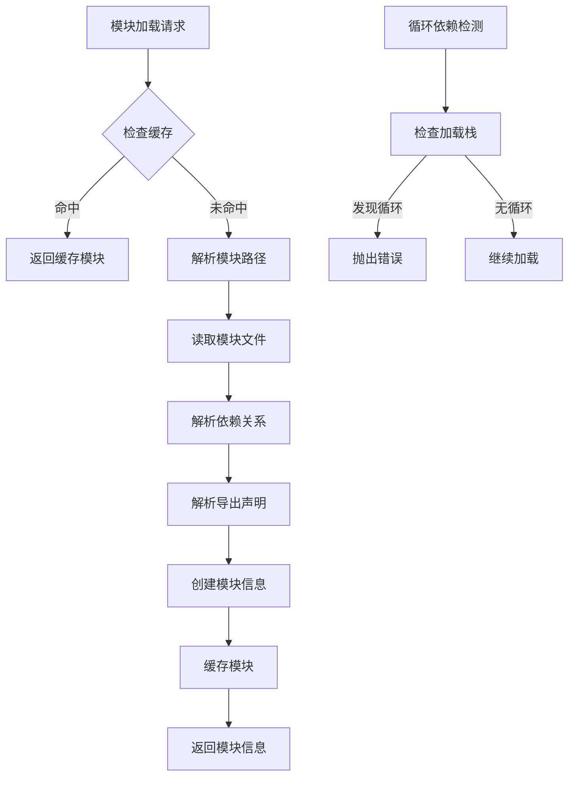

**图表来源**
- [esm.rs:109-181](file://crates/iris-jetcrab/src/esm.rs#L109-L181)
- [esm.rs:27-57](file://crates/iris-jetcrab/src/esm.rs#L27-L57)

**章节来源**
- [esm.rs:80-444](file://crates/iris-jetcrab/src/esm.rs#L80-L444)

### CPM 包管理器

CPM（Crab Package Manager）提供了npm包的本地管理能力：

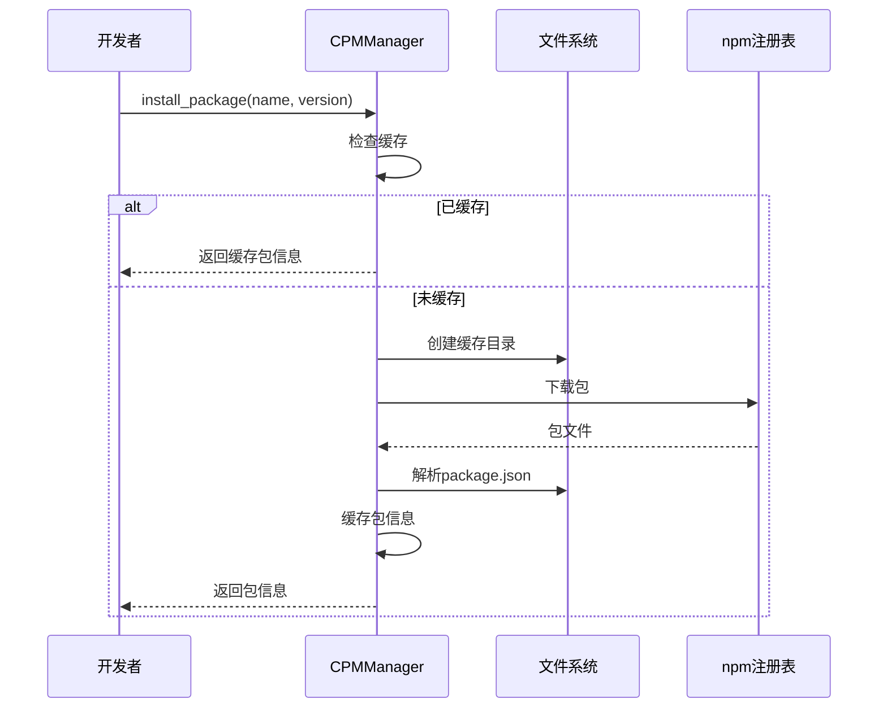

**图表来源**
- [cpm.rs:86-138](file://crates/iris-jetcrab/src/cpm.rs#L86-L138)

**章节来源**
- [cpm.rs:36-235](file://crates/iris-jetcrab/src/cpm.rs#L36-L235)

### Web API 兼容层

Web API兼容层实现了浏览器标准API的JetCrab版本：

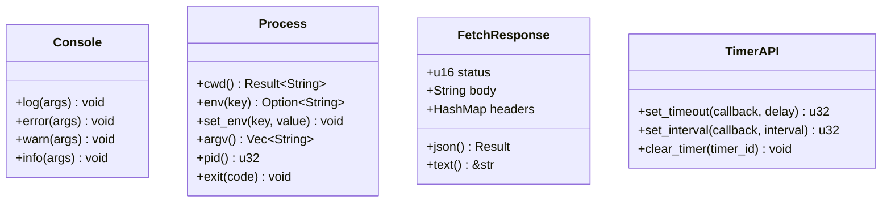

**图表来源**
- [web_apis.rs:7-167](file://crates/iris-jetcrab/src/web_apis.rs#L7-L167)

**章节来源**
- [web_apis.rs:1-204](file://crates/iris-jetcrab/src/web_apis.rs#L1-L204)

### WASM 桥接系统

WASM桥接系统提供了Rust与JavaScript之间的互操作能力：

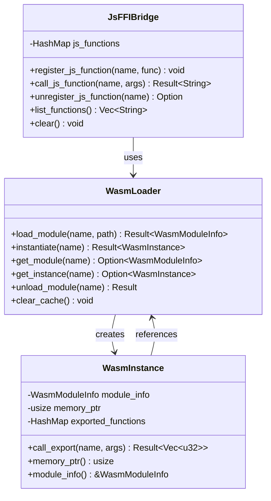

**图表来源**
- [wasm_bridge.rs:64-241](file://crates/iris-jetcrab/src/wasm_bridge.rs#L64-L241)

**章节来源**
- [wasm_bridge.rs:1-369](file://crates/iris-jetcrab/src/wasm_bridge.rs#L1-L369)

## WASM API功能

**新增**：Iris引擎现已提供完整的WASM导出接口，允许浏览器端直接调用Vue SFC编译、模块解析和热更新功能。

### IrisEngine 类设计

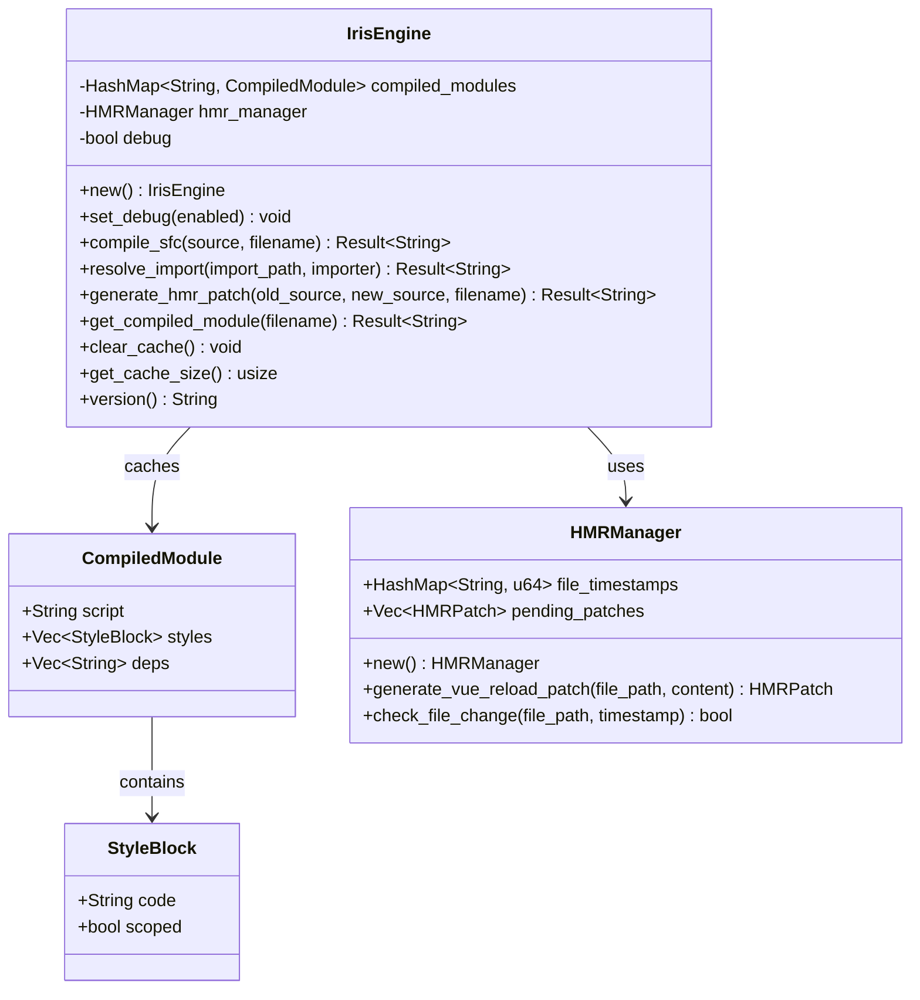

**图表来源**
- [wasm_api.rs:40-191](file://crates/iris-jetcrab-engine/src/wasm_api.rs#L40-L191)
- [sfc_compiler.rs:9-27](file://crates/iris-jetcrab-engine/src/sfc_compiler.rs#L9-L27)
- [hmr.rs:34-150](file://crates/iris-jetcrab-engine/src/hmr.rs#L34-L150)

### 核心API方法

IrisEngine类提供了9个核心方法，支持完整的Vue SFC开发工作流：

1. **compileSfc** - 编译Vue SFC文件并返回JSON格式结果
2. **resolveImport** - 解析模块导入路径
3. **generateHmrPatch** - 生成热更新补丁
4. **getCompiledModule** - 获取已编译模块信息
5. **clearCache** - 清除编译缓存
6. **getCacheSize** - 获取缓存大小
7. **setDebug** - 设置调试模式
8. **version** - 获取引擎版本
9. **构造函数** - 创建IrisEngine实例

### 编译缓存机制

IrisEngine内置了智能编译缓存系统：
- 自动缓存编译结果，避免重复编译
- 支持缓存查询和清理
- 提供缓存统计功能
- 支持批量编译优化

### 热更新（HMR）支持

引擎集成了完整的热更新管理器：
- 监控文件变化并生成相应补丁
- 支持Vue组件重载和CSS更新
- 提供补丁队列管理
- 支持完整页面重载场景

**章节来源**
- [wasm_api.rs:72-184](file://crates/iris-jetcrab-engine/src/wasm_api.rs#L72-L184)
- [sfc_compiler.rs:29-82](file://crates/iris-jetcrab-engine/src/sfc_compiler.rs#L29-L82)
- [hmr.rs:67-150](file://crates/iris-jetcrab-engine/src/hmr.rs#L67-L150)

## 跨平台构建支持

**新增**：引擎提供了完整的跨平台构建支持，包括Windows和Linux/macOS的构建脚本。

### 构建脚本特性

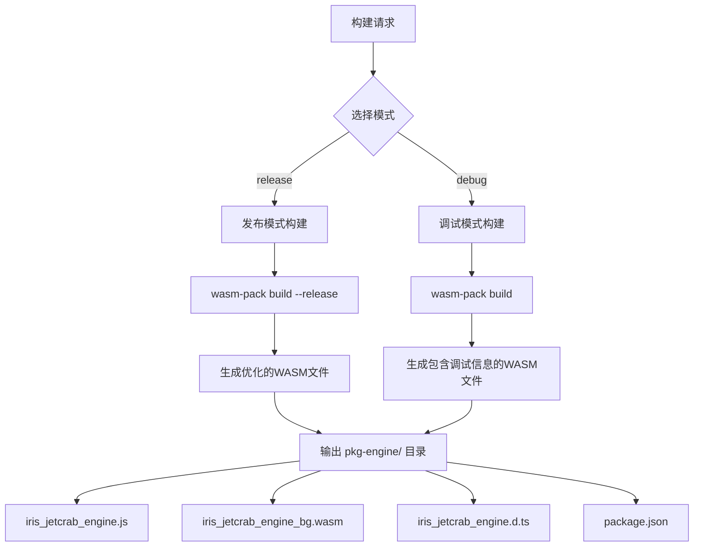

**图表来源**
- [build-wasm-engine.sh:19-25](file://crates/iris-jetcrab-engine/build-wasm-engine.sh#L19-L25)
- [build-wasm-engine.ps1:20-26](file://crates/iris-jetcrab-engine/build-wasm-engine.ps1#L20-L26)

### 构建模式对比

| 特性 | Debug模式 | Release模式 |
|------|-----------|-------------|
| 编译速度 | 快 | 慢 |
| 文件大小 | 大 | 最小化 |
| 调试信息 | 包含 | 移除 |
| 优化级别 | 无 | LTO优化 |
| 适用场景 | 开发调试 | 生产部署 |

### 输出文件结构

构建完成后会在`pkg-engine/`目录生成以下文件：
- `iris_jetcrab_engine.js` - JavaScript绑定文件
- `iris_jetcrab_engine_bg.wasm` - WASM二进制文件
- `iris_jetcrab_engine.d.ts` - TypeScript类型定义
- `package.json` - NPM包配置

**章节来源**
- [build-wasm-engine.sh:1-52](file://crates/iris-jetcrab-engine/build-wasm-engine.sh#L1-L52)
- [build-wasm-engine.ps1:1-68](file://crates/iris-jetcrab-engine/build-wasm-engine.ps1#L1-L68)

## 依赖关系分析

Iris-JetCrab引擎的依赖关系遵循严格的单向依赖原则，确保系统的模块化和可维护性。

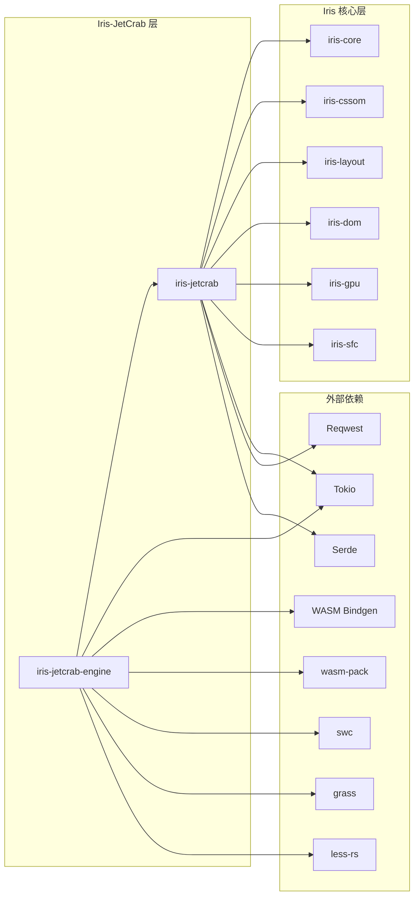

**图表来源**
- [Cargo.toml:13-36](file://crates/iris-jetcrab/Cargo.toml#L13-L36)
- [Cargo.toml:13-48](file://crates/iris-jetcrab-engine/Cargo.toml#L13-L48)
- [ARCHITECTURE.md:38-43](file://ARCHITECTURE.md#L38-L43)

**章节来源**
- [Cargo.toml:1-48](file://crates/iris-jetcrab/Cargo.toml#L1-L48)
- [Cargo.toml:13-48](file://crates/iris-jetcrab-engine/Cargo.toml#L13-L48)
- [ARCHITECTURE.md:36-43](file://ARCHITECTURE.md#L36-L43)

## 性能考虑

Iris-JetCrab引擎在设计时充分考虑了性能优化：

### 模块缓存策略
- ESM模块加载器使用两级缓存（模块缓存和导出缓存）
- 支持缓存清理和统计功能
- 避免重复解析和编译相同模块

### 内存管理
- 运行时配置内存限制
- WASM模块内存指针管理
- 定期清理未使用的资源

### 并发处理
- 基于Tokio的异步I/O
- 并发模块加载和编译
- 异步HTTP请求处理

### WASM优化
- **Release模式优化**：启用LTO链接时优化，文件大小最小化
- **缓存机制**：编译结果自动缓存，避免重复编译
- **批处理支持**：支持批量编译多个文件
- **调试模式**：可选的调试信息，不影响生产性能

### **更新**：VueProjectCompiler性能优化
- **智能缓存**：编译结果缓存，避免重复编译
- **增量编译**：支持部分文件更新的增量编译
- **并行编译**：TypeScript和CSS预处理器支持并行编译
- **依赖图优化**：使用拓扑排序确保最优编译顺序

## 故障排除指南

### 常见问题及解决方案

**问题1：运行时未初始化**
- **症状**：调用eval()时返回"Runtime not initialized"错误
- **解决**：确保先调用init()方法初始化运行时

**问题2：模块加载失败**
- **症状**：ESM模块加载返回"Module not found"错误
- **解决**：检查模块路径和搜索路径配置

**问题3：循环依赖检测错误**
- **症状**：加载模块时报"循环依赖检测"错误
- **解决**：检查模块间的相互依赖关系

**问题4：WASM模块实例化失败**
- **症状**：instantiate()返回错误
- **解决**：确认WASM文件格式正确且导出函数存在

**问题5：WASM构建失败**
- **症状**：构建脚本报错
- **解决**：检查wasm-pack安装状态和系统环境

**问题6：IrisEngine方法调用失败**
- **症状**：compileSfc或resolveImport返回错误
- **解决**：检查输入参数格式和文件路径

**问题7：Vue项目编译失败**
- **症状**：JetCrabEngine.run()返回编译错误
- **解决**：检查Vue文件语法和依赖路径

**问题8：npm包解析失败**
- **症状**：VueProjectCompiler无法解析npm包
- **解决**：确认node_modules目录存在且包已安装

**章节来源**
- [runtime.rs:108-121](file://crates/iris-jetcrab/src/runtime.rs#L108-L121)
- [esm.rs:41-57](file://crates/iris-jetcrab/src/esm.rs#L41-L57)
- [wasm_bridge.rs:132-162](file://crates/iris-jetcrab/src/wasm_bridge.rs#L132-L162)
- [engine.rs:305-370](file://crates/iris-jetcrab-engine/src/engine.rs#L305-L370)

## 结论

Iris-JetCrab引擎作为Iris框架的重要组成部分，成功地将JetCrab JavaScript引擎与Rust生态系统相结合。通过模块化设计和严格的架构约束，该引擎为开发者提供了：

1. **完整的Web API兼容性**：确保JavaScript代码的可移植性
2. **高效的模块系统**：支持ESM和npm包管理
3. **强大的WASM互操作能力**：实现Rust与JavaScript的无缝集成
4. **完善的热更新支持**：提供Vue组件的实时开发体验
5. **跨平台构建支持**：简化WASM模块的部署流程
6. **优秀的性能表现**：通过缓存和并发优化提升执行效率

**更新**：**重构的编译流程**使Iris引擎能够处理复杂的Vue项目，从单个文件编译升级为完整的项目编译，包括：
- **完整的依赖解析**：支持Vue SFC、TypeScript、CSS预处理器等多种文件格式
- **智能缓存机制**：避免重复编译，提升开发效率
- **拓扑排序优化**：确保模块按正确的依赖顺序编译
- **npm包支持**：自动解析和编译npm包依赖

**新增的WASM API功能**使Iris引擎能够直接服务于浏览器端的Vue SFC编译需求，为现代Web开发提供了更加灵活和高效的解决方案。随着项目的不断发展，Iris-JetCrab引擎将继续演进，为构建现代化的跨平台应用提供强有力的支持。