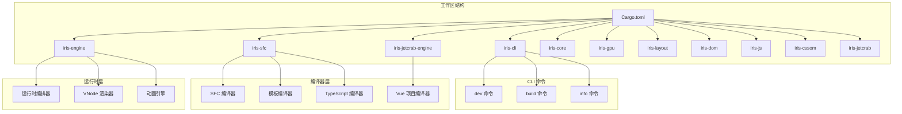
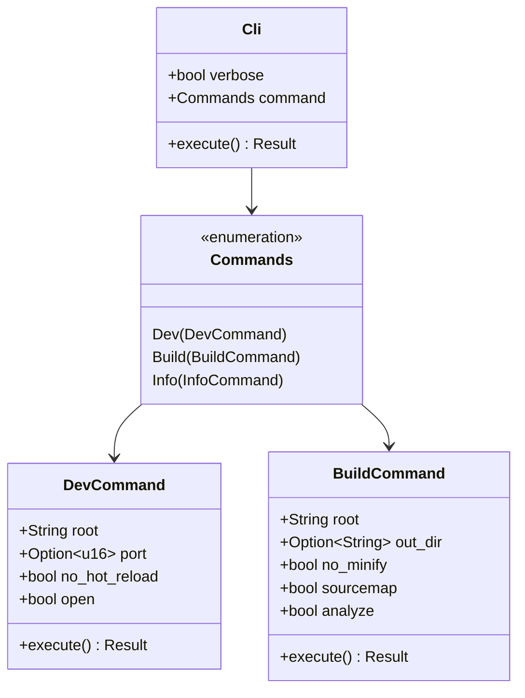
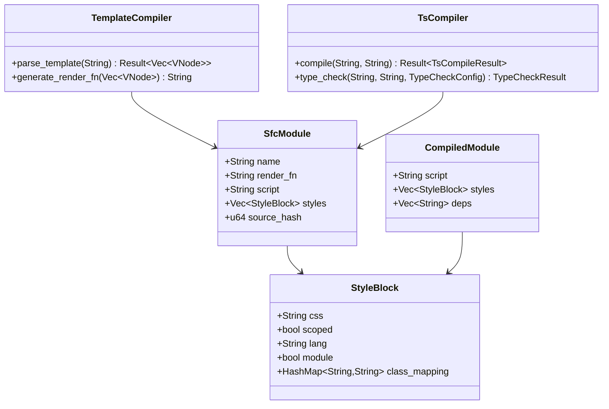
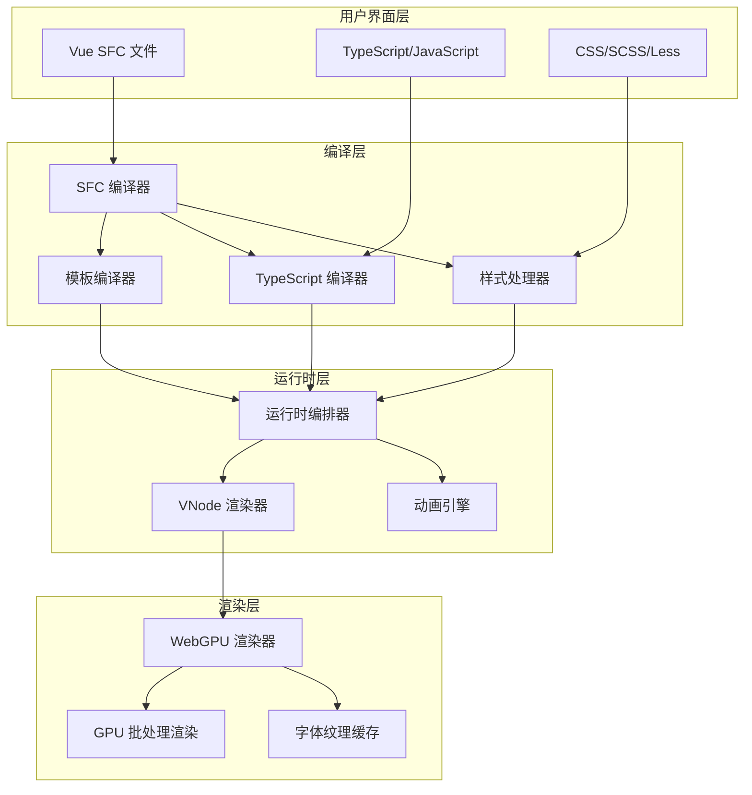
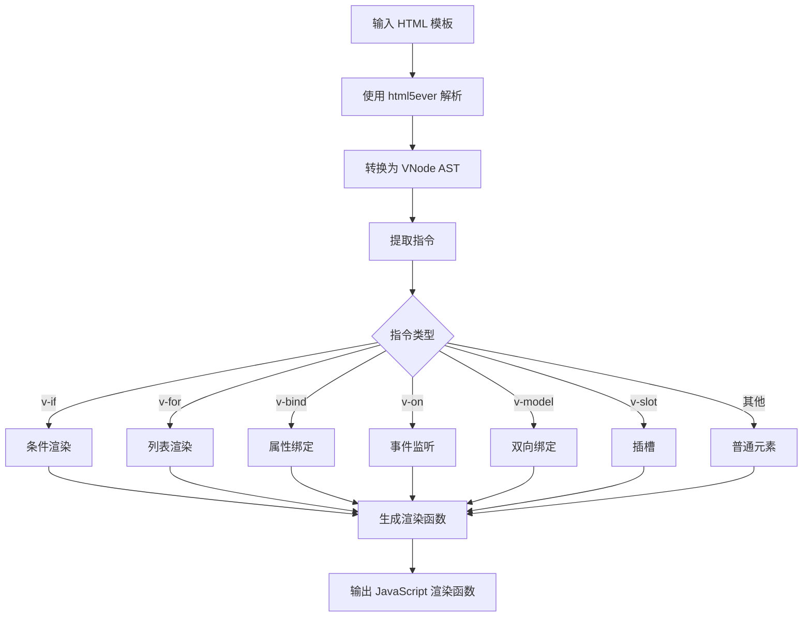
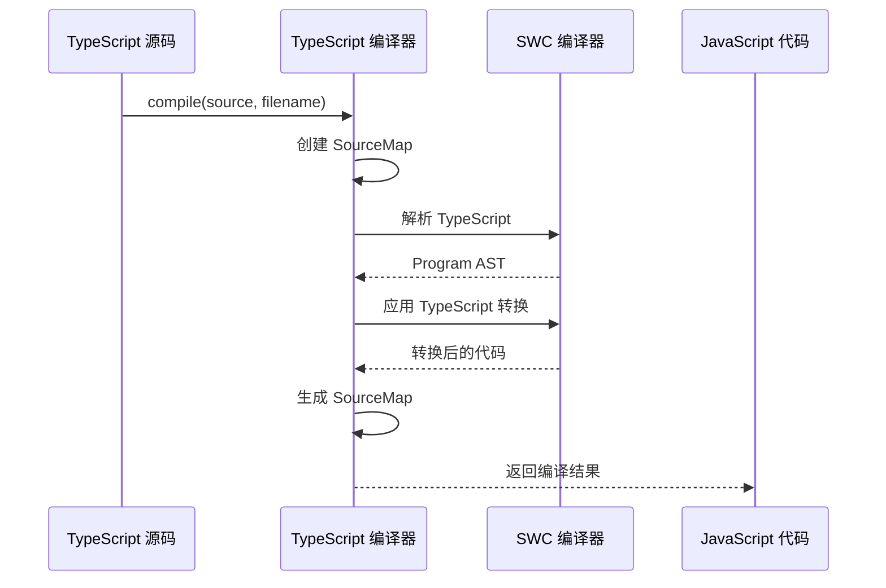
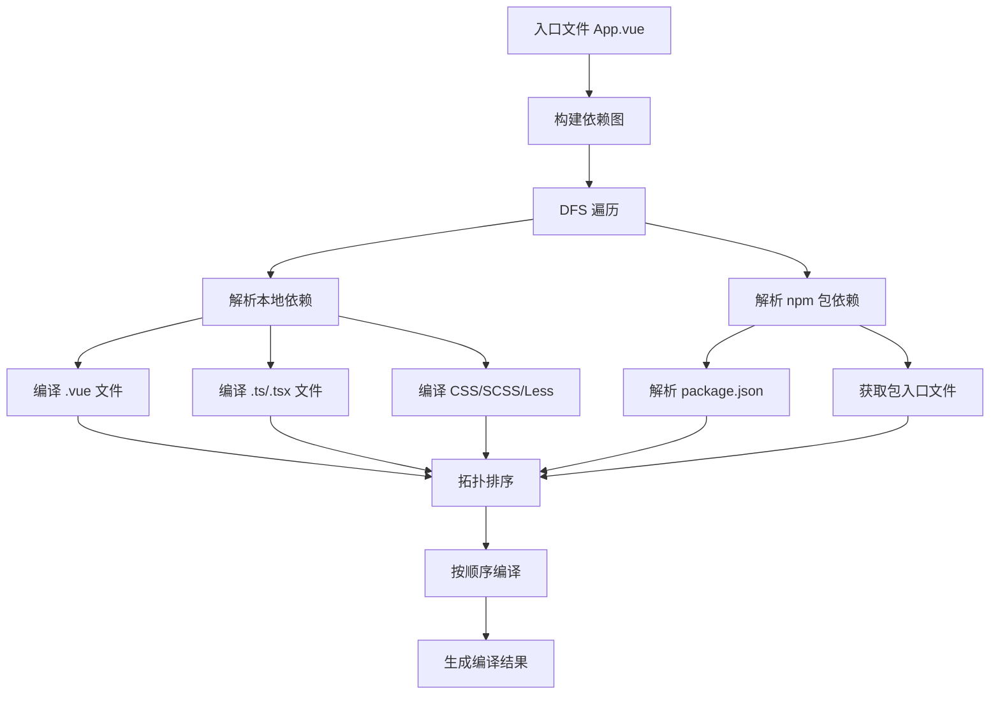
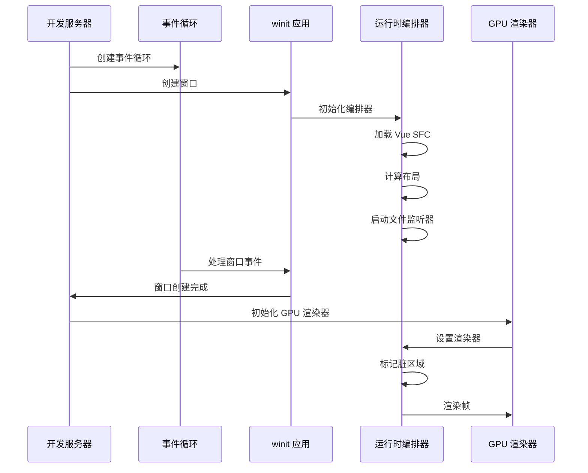
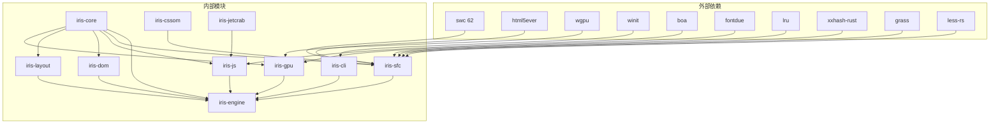

# Vue项目编译器

<cite>
**本文档引用的文件**
- [Cargo.toml](file://Cargo.toml)
- [main.rs](file://crates/iris-cli/src/main.rs)
- [sfc_compiler.rs](file://crates/iris-jetcrab-engine/src/sfc_compiler.rs)
- [lib.rs](file://crates/iris-sfc/src/lib.rs)
- [lib.rs](file://crates/iris-engine/src/lib.rs)
- [template_compiler.rs](file://crates/iris-sfc/src/template_compiler.rs)
- [ts_compiler.rs](file://crates/iris-sfc/src/ts_compiler.rs)
- [build.rs](file://crates/iris-cli/src/commands/build.rs)
- [dev.rs](file://crates/iris-cli/src/commands/dev.rs)
- [vue_compiler.rs](file://crates/iris-jetcrab-engine/src/vue_compiler.rs)
- [App.vue](file://examples/vue-demo/src/App.vue)
- [package.json](file://examples/vue-demo/package.json)
- [Cargo.toml](file://crates/iris-sfc/Cargo.toml)
- [Cargo.toml](file://crates/iris-cli/Cargo.toml)
- [README.md](file://README.md)
</cite>

## 目录
1. [简介](#简介)
2. [项目结构](#项目结构)
3. [核心组件](#核心组件)
4. [架构总览](#架构总览)
5. [详细组件分析](#详细组件分析)
6. [依赖关系分析](#依赖关系分析)
7. [性能考虑](#性能考虑)
8. [故障排除指南](#故障排除指南)
9. [结论](#结论)

## 简介

Iris Engine 是一个革命性的前端运行时系统，采用 Rust + WebGPU 构建，完全消除了传统前端开发中的构建步骤。该项目的核心目标是提供零配置、高性能的 Vue 3 应用程序运行环境，支持 GPU 硬件加速渲染和热重载功能。

该编译器系统主要包含以下关键特性：
- **零构建**：直接运行 .vue 文件，无需 Webpack/Vite 配置
- **GPU 加速渲染**：基于 WebGPU 的硬件加速渲染管道
- **完整的 CSS 支持**：渐变、边框圆角、阴影、动画等
- **热重载**：文件监听与即时重载
- **跨平台支持**：Web 开发和桌面应用程序

## 项目结构

项目采用多 Crate 的工作区结构，每个模块都有特定的功能职责：

**图表来源**
- [Cargo.toml:1-48](file://Cargo.toml#L1-L48)
- [main.rs:18-53](file://crates/iris-cli/src/main.rs#L18-L53)

**章节来源**
- [Cargo.toml:1-48](file://Cargo.toml#L1-L48)
- [README.md:229-276](file://README.md#L229-L276)

## 核心组件

### CLI 命令系统

CLI 提供了三个主要命令来支持不同的开发场景：

**图表来源**
- [main.rs:29-53](file://crates/iris-cli/src/main.rs#L29-L53)
- [dev.rs:25-42](file://crates/iris-cli/src/commands/dev.rs#L25-L42)
- [build.rs:12-33](file://crates/iris-cli/src/commands/build.rs#L12-L33)

### SFC 编译器

SFC（Single File Component）编译器是整个系统的核心组件，负责将 Vue 单文件组件转换为可执行模块：

**图表来源**
- [lib.rs:82-110](file://crates/iris-sfc/src/lib.rs#L82-L110)
- [sfc_compiler.rs:9-27](file://crates/iris-jetcrab-engine/src/sfc_compiler.rs#L9-L27)
- [template_compiler.rs:8-66](file://crates/iris-sfc/src/template_compiler.rs#L8-L66)
- [ts_compiler.rs:66-77](file://crates/iris-sfc/src/ts_compiler.rs#L66-L77)

**章节来源**
- [lib.rs:308-461](file://crates/iris-sfc/src/lib.rs#L308-L461)
- [sfc_compiler.rs:30-58](file://crates/iris-jetcrab-engine/src/sfc_compiler.rs#L30-L58)

## 架构总览

Iris Engine 采用了分层架构设计，从底层的 GPU 渲染到底层的 Vue SFC 编译器，形成了完整的运行时系统：

**图表来源**
- [lib.rs:15-42](file://crates/iris-engine/src/lib.rs#L15-L42)
- [lib.rs:69-95](file://crates/iris-engine/src/lib.rs#L69-L95)

## 详细组件分析

### 模板编译器

模板编译器负责将 Vue 模板转换为虚拟 DOM 创建函数，支持多种 Vue 指令：

**图表来源**
- [template_compiler.rs:68-89](file://crates/iris-sfc/src/template_compiler.rs#L68-L89)
- [template_compiler.rs:146-260](file://crates/iris-sfc/src/template_compiler.rs#L146-L260)

模板编译器支持的主要指令包括：
- **条件渲染**：v-if、v-else-if、v-else
- **列表渲染**：v-for（支持 in 和 of 两种语法）
- **属性绑定**：v-bind（简写 :prop）
- **事件监听**：v-on（简写 @event）
- **双向绑定**：v-model
- **插槽**：v-slot（简写 #name）

**章节来源**
- [template_compiler.rs:28-66](file://crates/iris-sfc/src/template_compiler.rs#L28-L66)
- [template_compiler.rs:377-561](file://crates/iris-sfc/src/template_compiler.rs#L377-L561)

### TypeScript 编译器

TypeScript 编译器基于 SWC 62 高层 Compiler API，提供了稳定可靠的 TypeScript 到 JavaScript 转译功能：

**图表来源**
- [ts_compiler.rs:161-249](file://crates/iris-sfc/src/ts_compiler.rs#L161-L249)

编译器配置选项包括：
- **JSX/TSX 支持**：可选的 JSX 转换
- **装饰器保留**：可选择保留装饰器语法
- **SourceMap 生成**：可配置的 SourceMap 输出
- **目标 ECMAScript 版本**：支持 ES2015-ES2022

**章节来源**
- [ts_compiler.rs:26-64](file://crates/iris-sfc/src/ts_compiler.rs#L26-L64)
- [ts_compiler.rs:138-149](file://crates/iris-sfc/src/ts_compiler.rs#L138-L149)

### Vue 项目编译器

Vue 项目编译器负责处理整个 Vue 项目的依赖关系，从入口文件开始反向解析所有依赖：

**图表来源**
- [vue_compiler.rs:128-165](file://crates/iris-jetcrab-engine/src/vue_compiler.rs#L128-L165)
- [vue_compiler.rs:167-233](file://crates/iris-jetcrab-engine/src/vue_compiler.rs#L167-L233)

**章节来源**
- [vue_compiler.rs:51-69](file://crates/iris-jetcrab-engine/src/vue_compiler.rs#L51-L69)
- [vue_compiler.rs:480-533](file://crates/iris-jetcrab-engine/src/vue_compiler.rs#L480-L533)

### 开发服务器

开发服务器提供了原生窗口渲染和热重载功能：

**图表来源**
- [dev.rs:137-171](file://crates/iris-cli/src/commands/dev.rs#L137-L171)
- [dev.rs:218-282](file://crates/iris-cli/src/commands/dev.rs#L218-L282)

**章节来源**
- [dev.rs:44-100](file://crates/iris-cli/src/commands/dev.rs#L44-L100)
- [dev.rs:345-409](file://crates/iris-cli/src/commands/dev.rs#L345-L409)

## 依赖关系分析

项目采用了精心设计的依赖关系，确保模块间的松耦合和高内聚：

**图表来源**
- [Cargo.toml:26-48](file://Cargo.toml#L26-L48)
- [Cargo.toml:41-48](file://Cargo.toml#L41-L48)

**章节来源**
- [Cargo.toml:26-48](file://Cargo.toml#L26-L48)
- [Cargo.toml:41-48](file://Cargo.toml#L41-L48)

## 性能考虑

Iris Engine 在性能方面采用了多项优化策略：

### 编译性能优化

1. **正则表达式预编译**：使用 LazyLock 避免每次编译时重新编译正则表达式
2. **全局 TypeScript 编译器实例**：复用编译器实例，避免重复创建
3. **LRU 缓存系统**：基于源码哈希的智能缓存，支持热重载加速
4. **源码哈希计算**：使用 XXH3 算法进行快速哈希计算

### 渲染性能优化

1. **批处理渲染系统**：将多个元素合并为单一 GPU 提交，减少绘制调用
2. **脏矩形管理器**：只重绘发生变化的区域，节省 50-90% 的渲染开销
3. **字体纹理缓存**：GPU 纹理缓存消除重复栅格化
4. **零分配更新**：动画系统在更新过程中避免堆分配

### 内存管理优化

1. **智能缓存淘汰**：基于 LRU 算法的缓存管理系统
2. **RAII 模式**：使用临时文件守卫确保资源正确清理
3. **原子操作**：编译计数器使用原子操作避免竞态条件

## 故障排除指南

### 常见编译错误

1. **SFC 格式错误**
   - **症状**：编译失败，提示缺少 <template> 或 <script> 标签
   - **解决方案**：确保 .vue 文件至少包含一个模板或脚本块

2. **TypeScript 语法错误**
   - **症状**：编译器报错，显示语法错误位置
   - **解决方案**：检查 TypeScript 语法，确保符合 ES2020 规范

3. **模板指令错误**
   - **症状**：渲染函数生成失败
   - **解决方案**：检查 Vue 指令语法，确保正确的表达式格式

### 运行时问题

1. **GPU 渲染初始化失败**
   - **症状**：无法创建 GPU 渲染器
   - **解决方案**：检查 WebGPU 支持情况，确保 GPU 兼容性

2. **热重载失效**
   - **症状**：文件修改后不触发重载
   - **解决方案**：检查文件监听器状态，确认路径解析正确

3. **内存泄漏**
   - **症状**：长时间运行后内存持续增长
   - **解决方案**：检查资源清理逻辑，确保正确释放 GPU 资源

**章节来源**
- [lib.rs:134-278](file://crates/iris-sfc/src/lib.rs#L134-L278)
- [dev.rs:411-431](file://crates/iris-cli/src/commands/dev.rs#L411-L431)

## 结论

Iris Engine 代表了前端开发技术的重大突破，通过消除传统构建步骤，实现了真正的零配置开发体验。该编译器系统展现了卓越的技术架构和工程实践：

### 主要成就

1. **技术创新**：完全消除了前端构建步骤，直接运行 Vue SFC 文件
2. **性能卓越**：基于 WebGPU 的硬件加速渲染，性能提升数量级
3. **开发体验**：热重载和即时反馈，显著提升开发效率
4. **跨平台支持**：同时支持 Web 开发和桌面应用程序

### 技术亮点

- **模块化设计**：清晰的分层架构，每个模块职责明确
- **性能优化**：多项性能优化策略，包括缓存、批处理和内存管理
- **错误处理**：完善的错误处理和诊断系统
- **测试覆盖**：全面的单元测试和集成测试，确保代码质量

### 未来发展

随着 Preview 版本的发布，Iris Engine 将继续演进，计划包括：
- 完善 Vue 3 全面集成
- 增强开发者工具
- 优化性能分析器
- 扩展组件库支持

该编译器系统为现代前端开发提供了一个全新的范式，展示了 Rust + WebGPU 技术在前端领域的巨大潜力。