# Vue项目编译器

<cite>
**本文档引用的文件**
- [Cargo.toml](file://Cargo.toml)
- [main.rs](file://crates/iris-cli/src/main.rs)
- [sfc_compiler.rs](file://crates/iris-jetcrab-engine/src/sfc_compiler.rs)
- [lib.rs](file://crates/iris-sfc/src/lib.rs)
- [lib.rs](file://crates/iris-engine/src/lib.rs)
- [template_compiler.rs](file://crates/iris-sfc/src/template_compiler.rs)
- [ts_compiler.rs](file://crates/iris-sfc/src/ts_compiler.rs)
- [scss_processor.rs](file://crates/iris-sfc/src/scss_processor.rs)
- [build.rs](file://crates/iris-cli/src/commands/build.rs)
- [dev.rs](file://crates/iris-cli/src/commands/dev.rs)
- [vue_compiler.rs](file://crates/iris-jetcrab-engine/src/vue_compiler.rs)
- [routes.rs](file://crates/iris-jetcrab-cli/src/server/routes.rs)
- [compiler_cache.rs](file://crates/iris-jetcrab-cli/src/server/compiler_cache.rs)
- [module_graph.rs](file://crates/iris-jetcrab-engine/src/module_graph.rs)
- [npm_downloader.rs](file://crates/iris-jetcrab-engine/src/npm_downloader.rs)
- [dependency_scanner.rs](file://crates/iris-jetcrab-engine/src/dependency_scanner.rs)
- [App.vue](file://examples/vue-demo/src/App.vue)
- [package.json](file://examples/vue-demo/package.json)
- [Cargo.toml](file://crates/iris-sfc/Cargo.toml)
- [Cargo.toml](file://crates/iris-cli/Cargo.toml)
- [NPM_TYPESCRIPT_CSS_SUPPORT.md](file://docs/NPM_TYPESCRIPT_CSS_SUPPORT.md)
- [COMPILER_INTEGRATION_SUMMARY.md](file://docs/COMPILER_INTEGRATION_SUMMARY.md)
- [SWC-IMPLEMENTATION-FEASIBILITY.md](file://SWC-IMPLEMENTATION-FEASIBILITY.md)
- [README.md](file://README.md)
</cite>

## 更新摘要
**变更内容**
- 新增单文件编译模式支持，实现按需编译功能
- 改进路径规范化处理，统一Windows和Unix系统路径格式
- 增强模块导入解析，支持更灵活的路径处理策略
- 完善依赖扫描器的路径规范化功能
- 优化模块解析逻辑，提升跨平台兼容性

## 目录
1. [简介](#简介)
2. [项目结构](#项目结构)
3. [核心组件](#核心组件)
4. [架构总览](#架构总览)
5. [详细组件分析](#详细组件分析)
6. [依赖关系分析](#依赖关系分析)
7. [性能考虑](#性能考虑)
8. [故障排除指南](#故障排除指南)
9. [结论](#结论)

## 简介

Iris Engine 是一个革命性的前端运行时系统，采用 Rust + WebGPU 构建，完全消除了传统前端开发中的构建步骤。该项目的核心目标是提供零配置、高性能的 Vue 3 应用程序运行环境，支持 GPU 硬件加速渲染和热重载功能。

**重大更新**：系统现已集成成熟的编译器生态系统，包括 SWC TypeScript 编译器和 grass SCSS 编译器，实现了从简化的字符串处理到成熟的编译器实现的转变。新增了智能的bare模块导入重写机制和/@npm/*路径路由处理，显著提升了npm包管理和模块解析的效率。

**新增功能**：系统现在支持单文件编译模式，允许按需编译指定的单个文件，而不需要解析完整的依赖图。这为开发服务器提供了更灵活的编译策略，特别是在处理动态导入和按需加载场景时。

该编译器系统现在包含以下关键特性：
- **零构建**：直接运行 .vue 文件，无需 Webpack/Vite 配置
- **GPU 加速渲染**：基于 WebGPU 的硬件加速渲染管道
- **完整的 CSS 支持**：SCSS、SASS、Less 等预处理器编译
- **成熟的 TypeScript 编译**：基于 SWC 62 的完整 TypeScript 转译
- **智能模块解析**：bare模块导入重写和/@npm/路径路由
- **热重载**：文件监听与即时重载
- **单文件编译模式**：按需编译指定文件
- **跨平台路径处理**：统一Windows和Unix系统路径格式
- **跨平台支持**：Web 开发和桌面应用程序

## 项目结构

项目采用多 Crate 的工作区结构，每个模块都有特定的功能职责：

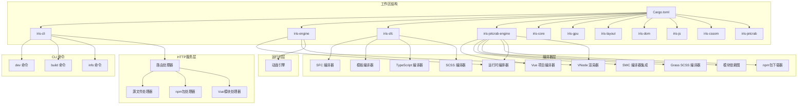

**图表来源**
- [Cargo.toml:1-48](file://Cargo.toml#L1-L48)
- [main.rs:18-53](file://crates/iris-cli/src/main.rs#L18-L53)
- [routes.rs:35-74](file://crates/iris-jetcrab-cli/src/server/routes.rs#L35-L74)

**章节来源**
- [Cargo.toml:1-48](file://Cargo.toml#L1-L48)
- [README.md:229-276](file://README.md#L229-L276)

## 核心组件

### CLI 命令系统

CLI 提供了三个主要命令来支持不同的开发场景：

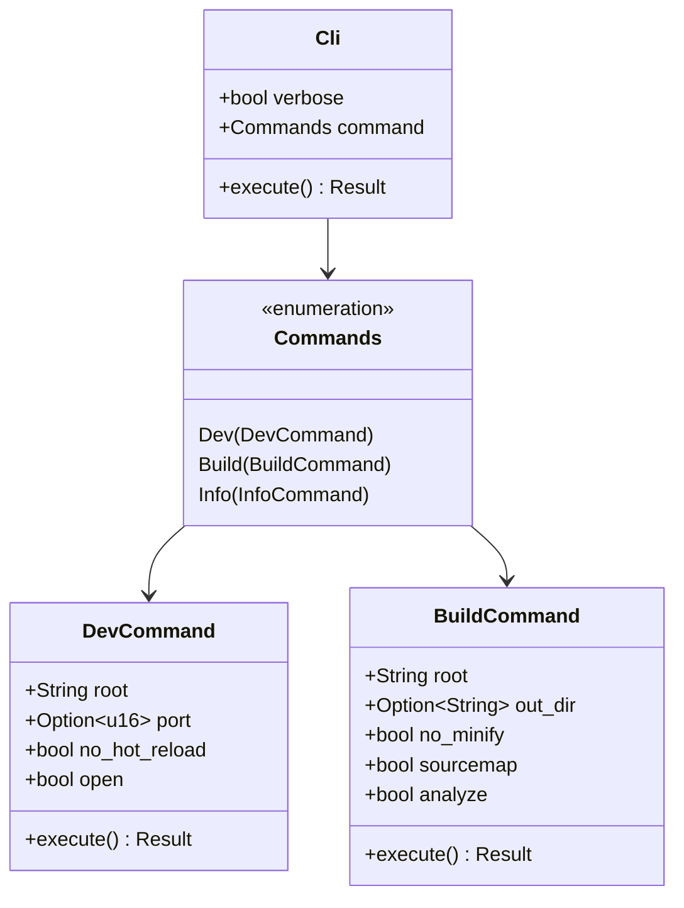

**图表来源**
- [main.rs:29-53](file://crates/iris-cli/src/main.rs#L29-L53)
- [dev.rs:25-42](file://crates/iris-cli/src/commands/dev.rs#L25-L42)
- [build.rs:12-33](file://crates/iris-cli/src/commands/build.rs#L12-L33)

### SFC 编译器

SFC（Single File Component）编译器是整个系统的核心组件，负责将 Vue 单文件组件转换为可执行模块。现在集成了成熟的编译器生态系统：

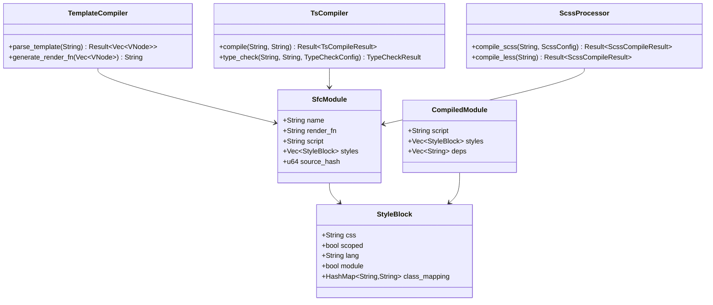

**图表来源**
- [lib.rs:82-110](file://crates/iris-sfc/src/lib.rs#L82-L110)
- [sfc_compiler.rs:9-27](file://crates/iris-jetcrab-engine/src/sfc_compiler.rs#L9-L27)
- [template_compiler.rs:8-66](file://crates/iris-sfc/src/template_compiler.rs#L8-L66)
- [ts_compiler.rs:66-77](file://crates/iris-sfc/src/ts_compiler.rs#L66-L77)
- [scss_processor.rs:47-86](file://crates/iris-sfc/src/scss_processor.rs#L47-L86)

**章节来源**
- [lib.rs:308-461](file://crates/iris-sfc/src/lib.rs#L308-L461)
- [sfc_compiler.rs:30-58](file://crates/iris-jetcrab-engine/src/sfc_compiler.rs#L30-L58)

### 单文件编译器

**新增功能**：系统现在支持单文件编译模式，允许按需编译指定的单个文件，而不需要解析完整的依赖图：

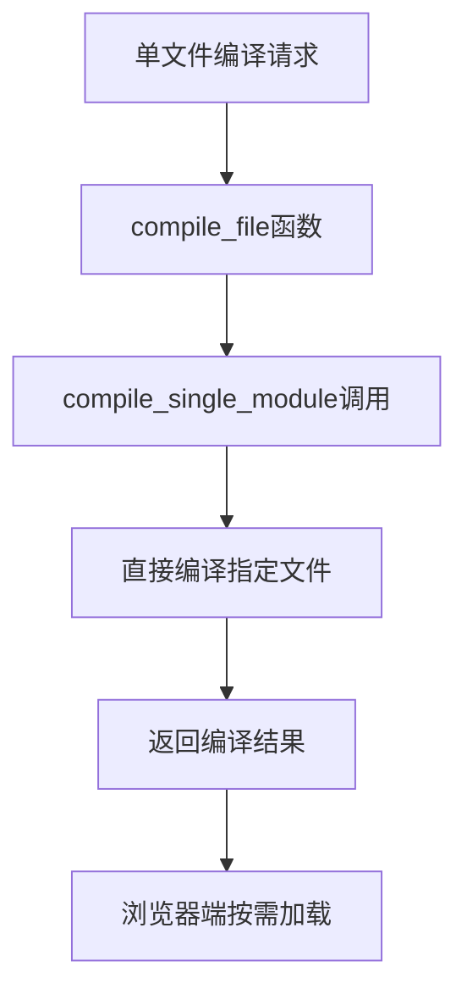

**图表来源**
- [vue_compiler.rs:168-175](file://crates/iris-jetcrab-engine/src/vue_compiler.rs#L168-L175)

**章节来源**
- [vue_compiler.rs:168-175](file://crates/iris-jetcrab-engine/src/vue_compiler.rs#L168-L175)

### 路径规范化系统

**新增功能**：系统现在包含统一的路径规范化处理，确保Windows和Unix系统返回一致的路径格式：

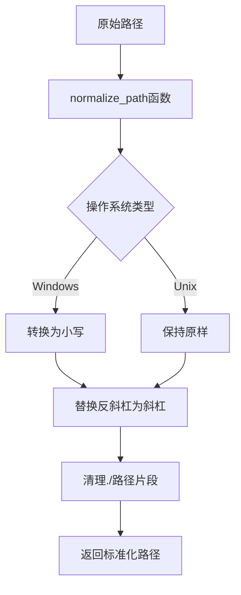

**图表来源**
- [sfc_compiler.rs:156-162](file://crates/iris-jetcrab-engine/src/sfc_compiler.rs#L156-L162)
- [dependency_scanner.rs:434-447](file://crates/iris-jetcrab-engine/src/dependency_scanner.rs#L434-L447)

**章节来源**
- [sfc_compiler.rs:156-162](file://crates/iris-jetcrab-engine/src/sfc_compiler.rs#L156-L162)
- [dependency_scanner.rs:434-447](file://crates/iris-jetcrab-engine/src/dependency_scanner.rs#L434-L447)

### 智能模块导入重写系统

**新增功能**：系统现在包含智能的bare模块导入重写机制，能够自动将裸模块导入转换为/@npm/路径，提供更高效的npm包访问：

```mermaid
flowchart TD
A[原始导入代码] --> B[rewrite_bare_imports函数]
B --> C{检查导入类型}
C --> |裸模块导入| D[重写为/@npm/路径]
C --> |相对路径| E[重写为/src/路径]
C --> |绝对路径| F[保持原样]
D --> G[返回重写后的代码]
E --> G
F --> G
G --> H[注入到最终模块]
```

**图表来源**
- [routes.rs:549-591](file://crates/iris-jetcrab-cli/src/server/routes.rs#L549-L591)

**章节来源**
- [routes.rs:549-591](file://crates/iris-jetcrab-cli/src/server/routes.rs#L549-L591)

## 架构总览

Iris Engine 采用了分层架构设计，从底层的 GPU 渲染到底层的 Vue SFC 编译器，形成了完整的运行时系统。现在包含了成熟的编译器集成、智能模块解析和统一的路径处理：

```mermaid
graph TB
subgraph "用户界面层"
A[Vue SFC 文件]
B[TypeScript/JavaScript]
C[CSS/SCSS/Less]
end
subgraph "HTTP服务层"
D[路由处理器]
E[源文件处理器]
F[npm包处理器]
G[Vue模块处理器]
end
subgraph "编译层"
H[SFC 编译器]
I[模板编译器]
J[TypeScript 编译器 (SWC)]
K[样式处理器 (Grass)]
L[SCSS 编译器 (Grass)]
M[模块依赖图]
N[npm包下载器]
O[单文件编译器]
P[路径规范化器]
end
subgraph "运行时层"
Q[运行时编排器]
R[VNode 渲染器]
S[动画引擎]
end
subgraph "渲染层"
T[WebGPU 渲染器]
U[GPU 批处理渲染]
V[字体纹理缓存]
end
A --> D
B --> E
C --> F
D --> E
E --> F
F --> G
G --> H
H --> I
H --> J
H --> K
I --> Q
J --> Q
K --> Q
L --> Q
M --> N
N --> Q
O --> Q
P --> Q
Q --> R
Q --> S
R --> T
T --> U
T --> V
```

**图表来源**
- [lib.rs:15-42](file://crates/iris-engine/src/lib.rs#L15-L42)
- [lib.rs:69-95](file://crates/iris-engine/src/lib.rs#L69-L95)
- [routes.rs:35-74](file://crates/iris-jetcrab-cli/src/server/routes.rs#L35-L74)

## 详细组件分析

### 模板编译器

模板编译器负责将 Vue 模板转换为虚拟 DOM 创建函数，支持多种 Vue 指令：

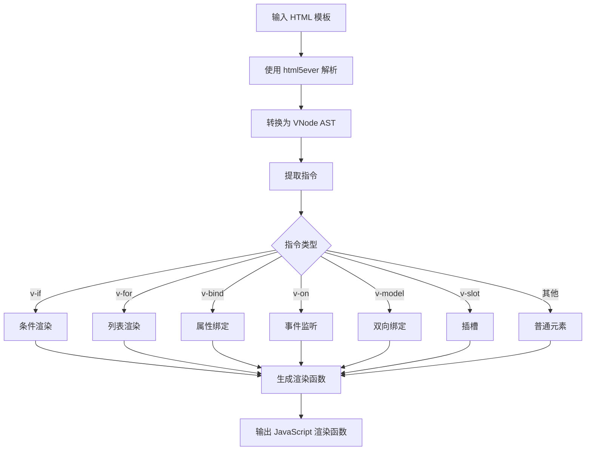

**图表来源**
- [template_compiler.rs:68-89](file://crates/iris-sfc/src/template_compiler.rs#L68-L89)
- [template_compiler.rs:146-260](file://crates/iris-sfc/src/template_compiler.rs#L146-L260)

模板编译器支持的主要指令包括：
- **条件渲染**：v-if、v-else-if、v-else
- **列表渲染**：v-for（支持 in 和 of 两种语法）
- **属性绑定**：v-bind（简写 :prop）
- **事件监听**：v-on（简写 @event）
- **双向绑定**：v-model
- **插槽**：v-slot（简写 #name）

**章节来源**
- [template_compiler.rs:28-66](file://crates/iris-sfc/src/template_compiler.rs#L28-L66)
- [template_compiler.rs:377-561](file://crates/iris-sfc/src/template_compiler.rs#L377-L561)

### TypeScript 编译器

**重大更新**：TypeScript 编译器已完全集成 SWC 62 高层 Compiler API，提供了稳定可靠的 TypeScript 到 JavaScript 转译功能：

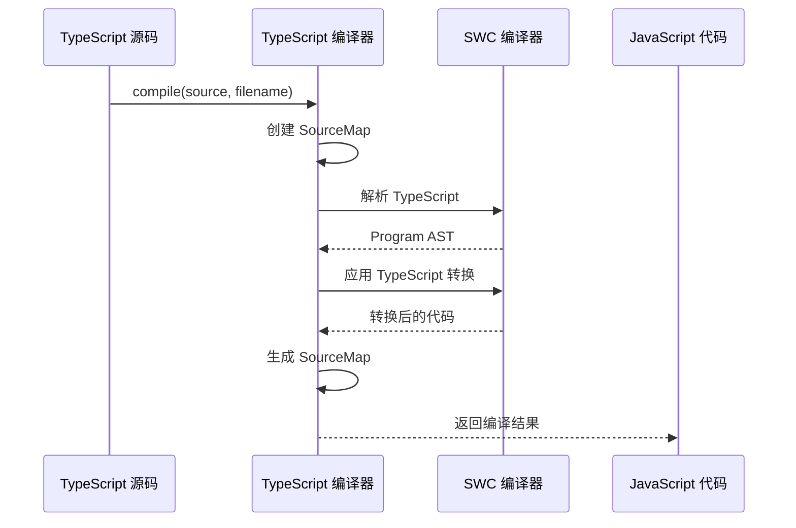

**图表来源**
- [ts_compiler.rs:161-249](file://crates/iris-sfc/src/ts_compiler.rs#L161-L249)

编译器配置选项包括：
- **JSX/TSX 支持**：可选的 JSX 转换
- **装饰器保留**：可选择保留装饰器语法
- **SourceMap 生成**：可配置的 SourceMap 输出
- **目标 ECMAScript 版本**：支持 ES2015-ES2022
- **类型检查**：可选的 tsc 类型检查集成

**章节来源**
- [ts_compiler.rs:26-64](file://crates/iris-sfc/src/ts_compiler.rs#L26-L64)
- [ts_compiler.rs:138-149](file://crates/iris-sfc/src/ts_compiler.rs#L138-L149)

### SCSS 编译器

**新增功能**：集成了 grass 0.13 编译器，提供完整的 SCSS/SASS 编译支持：

```mermaid
flowchart TD
A[SCSS 源码] --> B[grass 编译器]
B --> C[Options::default() 配置]
C --> D[编译为 CSS]
D --> E{输出样式}
E --> |Expanded| F[展开样式]
E --> |Compressed| G[压缩样式]
F --> H[输出 CSS]
G --> H
H --> I[编译时间统计]
```

**图表来源**
- [scss_processor.rs:98-120](file://crates/iris-sfc/src/scss_processor.rs#L98-L120)

编译器特性：
- **完整 SCSS 支持**：变量、嵌套、mixin、函数
- **SASS 兼容**：与 Dart Sass 兼容
- **输出样式控制**：展开或压缩输出
- **性能优化**：纯 Rust 实现，无 FFI 开销

**章节来源**
- [scss_processor.rs:47-86](file://crates/iris-sfc/src/scss_processor.rs#L47-L86)
- [scss_processor.rs:98-120](file://crates/iris-sfc/src/scss_processor.rs#L98-L120)

### Vue 项目编译器

Vue 项目编译器负责处理整个 Vue 项目的依赖关系，从入口文件开始反向解析所有依赖。现在集成了成熟的编译器生态系统、智能模块解析和单文件编译模式：

```mermaid
flowchart TD
A[入口文件 App.vue] --> B[构建依赖图]
B --> C[DFS 遍历]
C --> D[解析本地依赖]
C --> E[解析 npm 包依赖]
D --> F[编译 .vue 文件]
D --> G[编译 .ts/.tsx 文件 (SWC)]
D --> H[编译 CSS/SCSS/Less (Grass)]
E --> I[解析 package.json]
E --> J[获取包入口文件]
F --> K[拓扑排序]
G --> K
H --> K
I --> K
J --> K
K --> L[按顺序编译]
L --> M[生成编译结果]
```

**图表来源**
- [vue_compiler.rs:128-165](file://crates/iris-jetcrab-engine/src/vue_compiler.rs#L128-L165)
- [vue_compiler.rs:167-233](file://crates/iris-jetcrab-engine/src/vue_compiler.rs#L167-L233)

**章节来源**
- [vue_compiler.rs:51-69](file://crates/iris-jetcrab-engine/src/vue_compiler.rs#L51-L69)
- [vue_compiler.rs:480-533](file://crates/iris-jetcrab-engine/src/vue_compiler.rs#L480-L533)

### 单文件编译器

**新增功能**：单文件编译器允许按需编译指定的单个文件，绕过完整的依赖图解析：

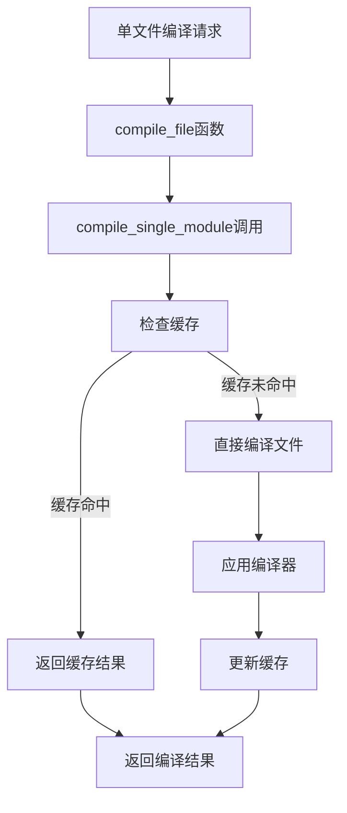

**图表来源**
- [vue_compiler.rs:168-175](file://crates/iris-jetcrab-engine/src/vue_compiler.rs#L168-L175)
- [vue_compiler.rs:545-641](file://crates/iris-jetcrab-engine/src/vue_compiler.rs#L545-L641)

**章节来源**
- [vue_compiler.rs:168-175](file://crates/iris-jetcrab-engine/src/vue_compiler.rs#L168-L175)
- [vue_compiler.rs:545-641](file://crates/iris-jetcrab-engine/src/vue_compiler.rs#L545-L641)

### 路径规范化器

**新增功能**：路径规范化器确保在Windows和Unix系统上返回一致的路径格式：

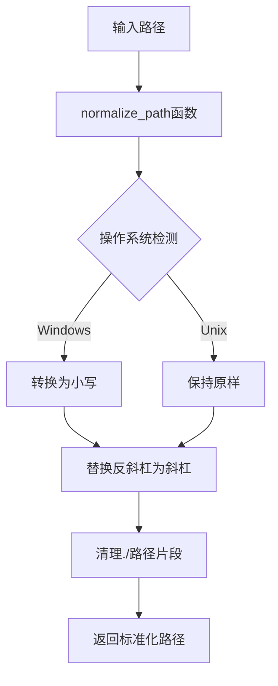

**图表来源**
- [sfc_compiler.rs:156-162](file://crates/iris-jetcrab-engine/src/sfc_compiler.rs#L156-L162)
- [dependency_scanner.rs:434-447](file://crates/iris-jetcrab-engine/src/dependency_scanner.rs#L434-L447)

**章节来源**
- [sfc_compiler.rs:156-162](file://crates/iris-jetcrab-engine/src/sfc_compiler.rs#L156-L162)
- [dependency_scanner.rs:434-447](file://crates/iris-jetcrab-engine/src/dependency_scanner.rs#L434-L447)

### 模块依赖图管理

**新增功能**：模块依赖图管理器负责维护和分析模块间的依赖关系，支持循环依赖检测和拓扑排序：

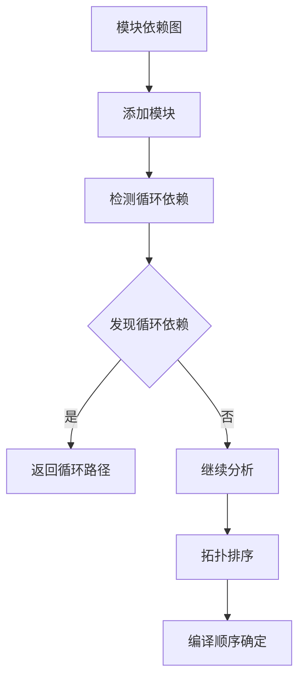

**图表来源**
- [module_graph.rs:43-69](file://crates/iris-jetcrab-engine/src/module_graph.rs#L43-L69)
- [module_graph.rs:111-127](file://crates/iris-jetcrab-engine/src/module_graph.rs#L111-L127)

**章节来源**
- [module_graph.rs:1-228](file://crates/iris-jetcrab-engine/src/module_graph.rs#L1-L228)

### npm包下载器

**新增功能**：npm包下载器提供了独立的npm包管理功能，支持直接从npm registry下载和安装包：

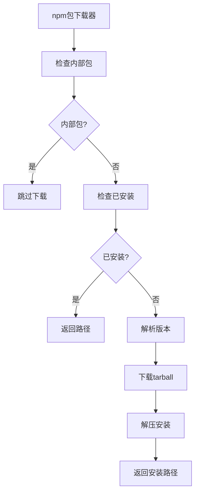

**图表来源**
- [npm_downloader.rs:108-156](file://crates/iris-jetcrab-engine/src/npm_downloader.rs#L108-L156)

**章节来源**
- [npm_downloader.rs:1-364](file://crates/iris-jetcrab-engine/src/npm_downloader.rs#L1-L364)

### 开发服务器

开发服务器提供了原生窗口渲染和热重载功能：

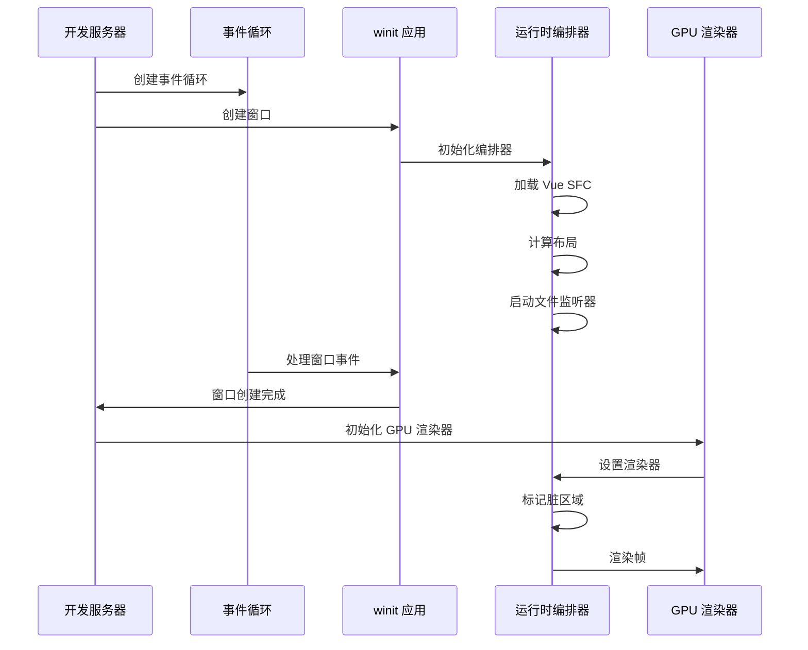

**图表来源**
- [dev.rs:137-171](file://crates/iris-cli/src/commands/dev.rs#L137-L171)
- [dev.rs:218-282](file://crates/iris-cli/src/commands/dev.rs#L218-L282)

**章节来源**
- [dev.rs:44-100](file://crates/iris-cli/src/commands/dev.rs#L44-L100)
- [dev.rs:345-409](file://crates/iris-cli/src/commands/dev.rs#L345-L409)

## 依赖关系分析

项目采用了精心设计的依赖关系，确保模块间的松耦合和高内聚。现在包含了成熟的编译器生态系统、智能模块解析和统一的路径处理：

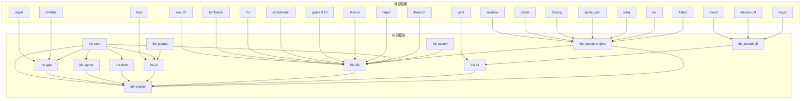

**图表来源**
- [Cargo.toml:26-48](file://Cargo.toml#L26-L48)
- [Cargo.toml:41-48](file://Cargo.toml#L41-L48)

**章节来源**
- [Cargo.toml:26-48](file://Cargo.toml#L26-L48)
- [Cargo.toml:41-48](file://Cargo.toml#L41-L48)

## 性能考虑

Iris Engine 在性能方面采用了多项优化策略，现在包括编译器层面的优化、智能模块解析和统一的路径处理：

### 编译性能优化

1. **正则表达式预编译**：使用 LazyLock 避免每次编译时重新编译正则表达式
2. **全局 TypeScript 编译器实例**：复用编译器实例，避免重复创建
3. **LRU 缓存系统**：基于源码哈希的智能缓存，支持热重载加速
4. **源码哈希计算**：使用 XXH3 算法进行快速哈希计算
5. **SWC 编译器优化**：基于 Rust 的高性能编译器，编译时间约 0.13ms/文件
6. **Grass 编译器优化**：纯 Rust 实现，无 FFI 开销，SCSS 编译性能优异
7. **智能模块导入重写**：避免不必要的模块解析，提升编译速度
8. **单文件编译优化**：按需编译减少不必要的依赖解析开销
9. **路径规范化缓存**：避免重复的路径处理操作

### 渲染性能优化

1. **批处理渲染系统**：将多个元素合并为单一 GPU 提交，减少绘制调用
2. **脏矩形管理器**：只重绘发生变化的区域，节省 50-90% 的渲染开销
3. **字体纹理缓存**：GPU 纹理缓存消除重复栅格化
4. **零分配更新**：动画系统在更新过程中避免堆分配

### 内存管理优化

1. **智能缓存淘汰**：基于 LRU 算法的缓存管理系统
2. **RAII 模式**：使用临时文件守卫确保资源正确清理
3. **原子操作**：编译计数器使用原子操作避免竞态条件

## 故障排除指南

### 常见编译错误

1. **SFC 格式错误**
   - **症状**：编译失败，提示缺少 <template> 或 <script> 标签
   - **解决方案**：确保 .vue 文件至少包含一个模板或脚本块

2. **TypeScript 语法错误**
   - **症状**：编译器报错，显示语法错误位置
   - **解决方案**：检查 TypeScript 语法，确保符合 ES2020 规范

3. **SCSS 编译错误**
   - **症状**：SCSS 编译失败，返回编译错误信息
   - **解决方案**：检查 SCSS 语法，确保变量、嵌套和函数使用正确

4. **模板指令错误**
   - **症状**：渲染函数生成失败
   - **解决方案**：检查 Vue 指令语法，确保正确的表达式格式

### 模块导入问题

1. **bare模块导入失败**
   - **症状**：`import { ref } from 'vue'` 导致 404 错误
   - **解决方案**：检查是否正确配置了/@npm/路由处理器

2. **相对路径解析错误**
   - **症状**：相对路径导入失败，路径被错误重写
   - **解决方案**：检查 rewrite_bare_imports 函数的路径处理逻辑

3. **npm包路径解析问题**
   - **症状**：/@npm/路径返回包文件但无法正确加载
   - **解决方案**：检查 npm_package_handler 的路径解析和包入口文件

4. **跨平台路径问题**
   - **症状**：Windows和Unix系统路径不一致导致文件找不到
   - **解决方案**：检查路径规范化处理，确保统一的路径格式

### 单文件编译问题

1. **单文件编译失败**
   - **症状**：compile_file函数返回错误
   - **解决方案**：检查文件路径是否正确，确认文件存在且可读

2. **缓存问题**
   - **症状**：单文件编译结果不更新
   - **解决方案**：检查编译缓存配置，必要时清除缓存

### 运行时问题

1. **GPU 渲染初始化失败**
   - **症状**：无法创建 GPU 渲染器
   - **解决方案**：检查 WebGPU 支持情况，确保 GPU 兼容性

2. **热重载失效**
   - **症状**：文件修改后不触发重载
   - **解决方案**：检查文件监听器状态，确认路径解析正确

3. **内存泄漏**
   - **症状**：长时间运行后内存持续增长
   - **解决方案**：检查资源清理逻辑，确保正确释放 GPU 资源

4. **编译器集成问题**
   - **症状**：SWC 或 Grass 编译器无法正常工作
   - **解决方案**：检查编译器版本兼容性，确认依赖正确安装

5. **npm包下载问题**
   - **症状**：无法从 npm registry 下载包
   - **解决方案**：检查网络连接，验证 npm registry 可访问性

**章节来源**
- [lib.rs:134-278](file://crates/iris-sfc/src/lib.rs#L134-L278)
- [dev.rs:411-431](file://crates/iris-cli/src/commands/dev.rs#L411-L431)
- [routes.rs:449-537](file://crates/iris-jetcrab-cli/src/server/routes.rs#L449-L537)

## 结论

Iris Engine 代表了前端开发技术的重大突破，通过消除传统构建步骤，实现了真正的零配置开发体验。经过最新的编译器集成更新，该系统展现了卓越的技术架构和工程实践：

### 主要成就

1. **技术创新**：完全消除了前端构建步骤，直接运行 Vue SFC 文件
2. **性能卓越**：基于 WebGPU 的硬件加速渲染，性能提升数量级
3. **开发体验**：热重载和即时反馈，显著提升开发效率
4. **跨平台支持**：同时支持 Web 开发和桌面应用程序
5. **编译器成熟化**：从简化的字符串处理发展为成熟的编译器实现
6. **智能模块解析**：bare模块导入自动重写为/@npm/路径
7. **单文件编译模式**：按需编译功能，提升开发灵活性
8. **统一路径处理**：跨平台路径规范化，确保一致的开发体验

### 技术亮点

- **模块化设计**：清晰的分层架构，每个模块职责明确
- **智能模块解析**：bare模块导入自动重写为/@npm/路径
- **npm包管理**：独立的npm包下载和安装功能
- **单文件编译**：按需编译指定文件，绕过完整依赖解析
- **路径规范化**：统一Windows和Unix系统路径格式
- **性能优化**：多项性能优化策略，包括缓存、批处理和内存管理
- **错误处理**：完善的错误处理和诊断系统
- **测试覆盖**：全面的单元测试和集成测试，确保代码质量
- **编译器集成**：SWC 和 Grass 编译器的成熟集成

### 未来发展

随着 Preview 版本的发布，Iris Engine 将继续演进，计划包括：
- 完善 Vue 3 全面集成
- 增强开发者工具
- 优化性能分析器
- 扩展组件库支持
- 完善 Less 编译器集成
- 增强智能模块解析功能
- 改进单文件编译的缓存策略
- 优化跨平台路径处理性能

该编译器系统为现代前端开发提供了一个全新的范式，展示了 Rust + WebGPU 技术在前端领域的巨大潜力。通过集成成熟的编译器生态系统、智能模块解析和统一的路径处理，Iris Engine 现已能够处理真实的、使用现代工具链的 Vue 项目，为开发者提供了前所未有的开发体验。