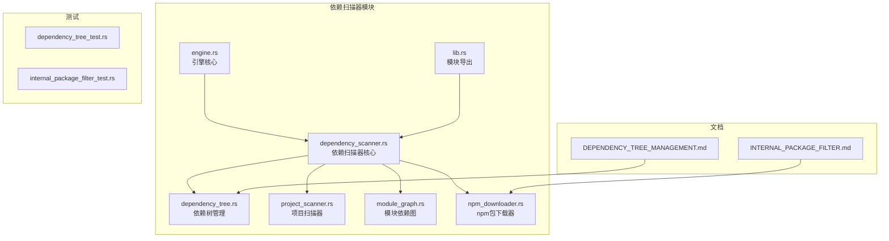
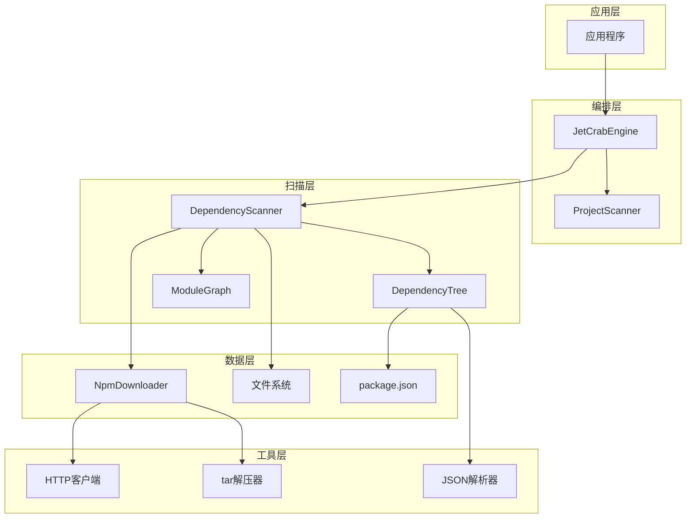
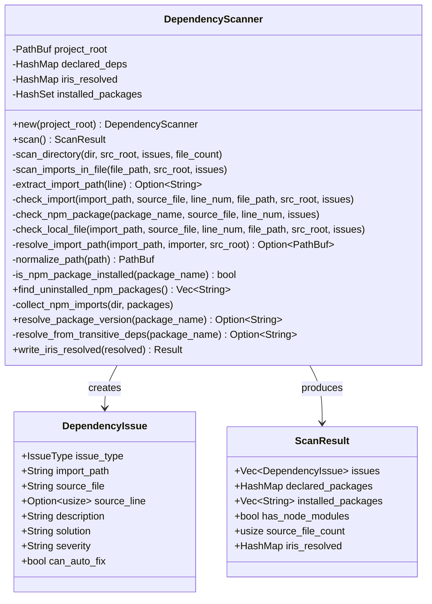
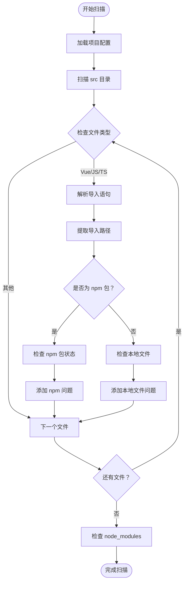
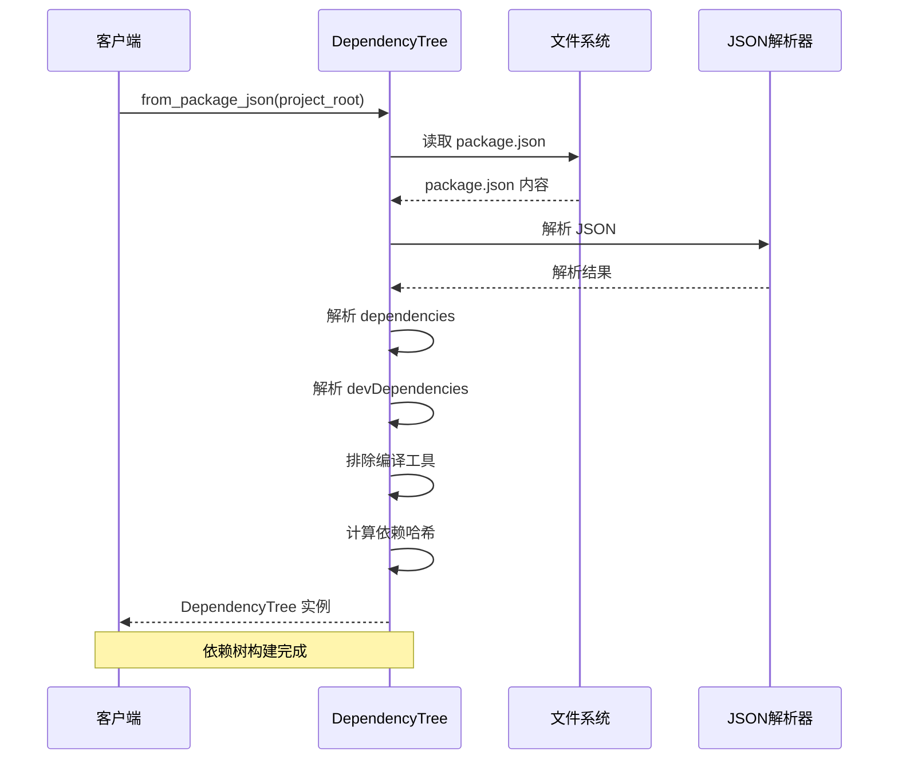
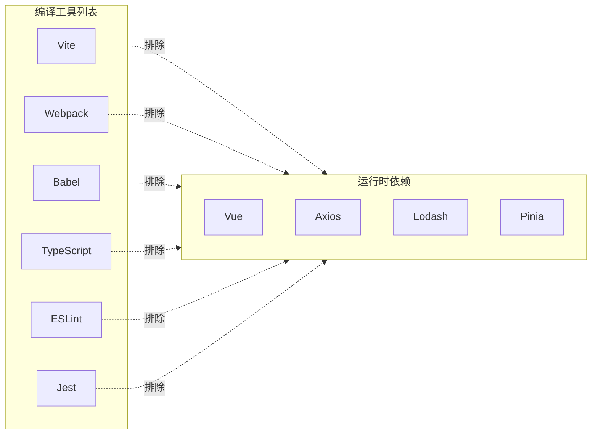
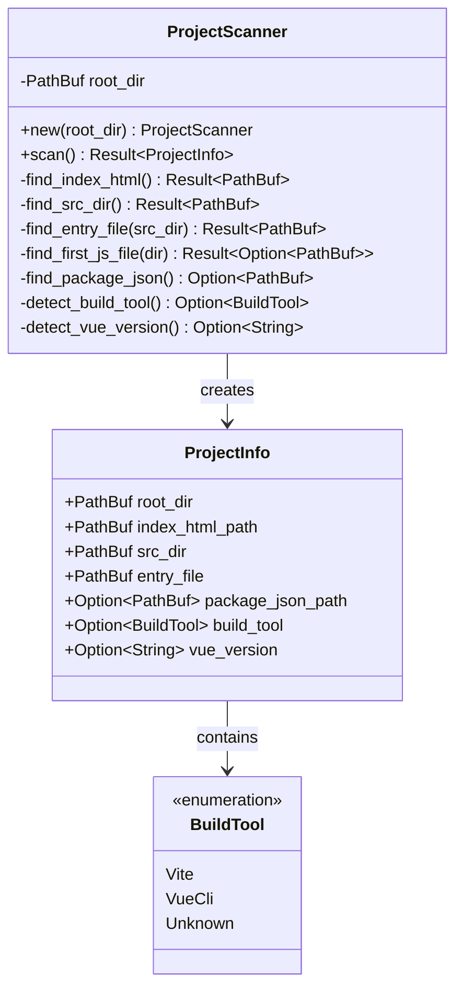
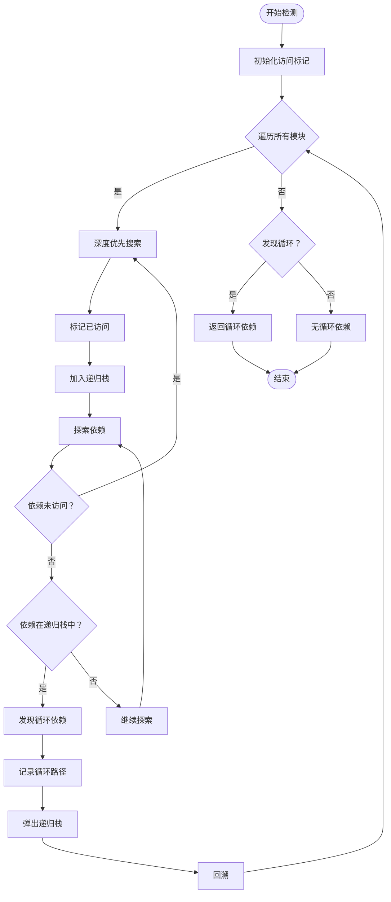
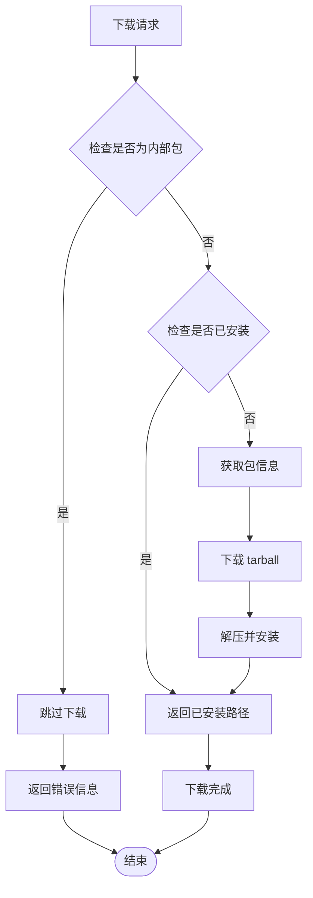
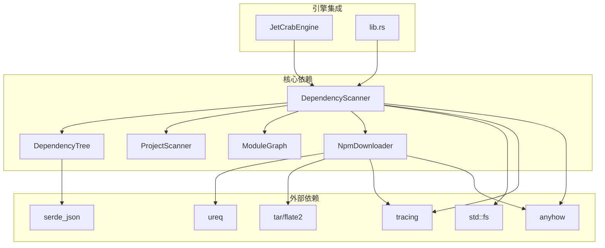

# 依赖扫描器模块

<cite>
**本文档引用的文件**
- [dependency_scanner.rs](file://crates/iris-jetcrab-engine/src/dependency_scanner.rs)
- [dependency_tree.rs](file://crates/iris-jetcrab-engine/src/dependency_tree.rs)
- [project_scanner.rs](file://crates/iris-jetcrab-engine/src/project_scanner.rs)
- [module_graph.rs](file://crates/iris-jetcrab-engine/src/module_graph.rs)
- [npm_downloader.rs](file://crates/iris-jetcrab-engine/src/npm_downloader.rs)
- [engine.rs](file://crates/iris-jetcrab-engine/src/engine.rs)
- [lib.rs](file://crates/iris-jetcrab-engine/src/lib.rs)
- [Cargo.toml](file://crates/iris-jetcrab-engine/Cargo.toml)
- [DEPENDENCY_TREE_MANAGEMENT.md](file://docs/DEPENDENCY_TREE_MANAGEMENT.md)
- [INTERNAL_PACKAGE_FILTER.md](file://docs/INTERNAL_PACKAGE_FILTER.md)
- [dependency_tree_test.rs](file://crates/iris-jetcrab-engine/tests/dependency_tree_test.rs)
- [internal_package_filter_test.rs](file://crates/iris-jetcrab-engine/tests/internal_package_filter_test.rs)
</cite>

## 目录
1. [简介](#简介)
2. [项目结构](#项目结构)
3. [核心组件](#核心组件)
4. [架构概览](#架构概览)
5. [详细组件分析](#详细组件分析)
6. [依赖分析](#依赖分析)
7. [性能考虑](#性能考虑)
8. [故障排除指南](#故障排除指南)
9. [结论](#结论)

## 简介

依赖扫描器模块是 Iris JetCrab 引擎的重要组成部分，负责在开发服务器启动时扫描项目源码，识别和报告各种依赖问题。该模块提供了全面的依赖管理功能，包括 npm 包检测、本地文件引用验证、CSS/SCSS 文件检查、静态资源验证等。

该模块的设计目标是：
- 自动检测项目中的依赖问题
- 提供详细的错误报告和解决方案建议
- 支持多种文件类型的依赖验证
- 实现智能的依赖版本解析和管理
- 与项目构建流程无缝集成

## 项目结构

依赖扫描器模块位于 `crates/iris-jetcrab-engine/src/` 目录下，包含以下核心文件：

**图表来源**
- [dependency_scanner.rs:1-819](file://crates/iris-jetcrab-engine/src/dependency_scanner.rs#L1-L819)
- [dependency_tree.rs:1-375](file://crates/iris-jetcrab-engine/src/dependency_tree.rs#L1-L375)
- [project_scanner.rs:1-268](file://crates/iris-jetcrab-engine/src/project_scanner.rs#L1-L268)

**章节来源**
- [Cargo.toml:1-76](file://crates/iris-jetcrab-engine/Cargo.toml#L1-L76)
- [lib.rs:1-105](file://crates/iris-jetcrab-engine/src/lib.rs#L1-L105)

## 核心组件

依赖扫描器模块包含以下核心组件：

### 1. 依赖扫描器 (DependencyScanner)
负责扫描项目中的所有依赖问题，包括：
- npm 包未在 package.json 中声明
- 本地 SFC/JS/TS 文件引用但不存在
- CSS/SCSS/LESS 文件引用但不存在
- 图片等静态资源文件引用但不存在

### 2. 依赖树管理 (DependencyTree)
管理 Vue 项目的 npm 依赖树，实现：
- 解析 package.json 构建依赖关系
- 排除编译工具类依赖
- 检测依赖版本变化
- 按需重新编译受影响的模块

### 3. 项目扫描器 (ProjectScanner)
扫描和解析 Vue 项目结构：
- 查找 index.html 文件
- 定位 src 目录
- 识别入口文件
- 检测构建工具类型

### 4. 模块依赖图 (ModuleGraph)
管理 Vue 项目中的模块依赖关系：
- 支持循环依赖检测
- 提供拓扑排序功能
- 管理模块间的依赖关系

### 5. npm 包下载器 (NpmDownloader)
提供 npm 包的下载和管理功能：
- 直接从 npm registry 下载包
- 支持 scoped packages
- 自动解压 tarball
- 内部包过滤机制

**章节来源**
- [dependency_scanner.rs:67-122](file://crates/iris-jetcrab-engine/src/dependency_scanner.rs#L67-L122)
- [dependency_tree.rs:52-63](file://crates/iris-jetcrab-engine/src/dependency_tree.rs#L52-L63)
- [project_scanner.rs:41-51](file://crates/iris-jetcrab-engine/src/project_scanner.rs#L41-L51)
- [module_graph.rs:8-12](file://crates/iris-jetcrab-engine/src/module_graph.rs#L8-L12)
- [npm_downloader.rs:46-54](file://crates/iris-jetcrab-engine/src/npm_downloader.rs#L46-L54)

## 架构概览

依赖扫描器模块采用分层架构设计，各组件之间通过清晰的接口进行交互：

**图表来源**
- [engine.rs:48-61](file://crates/iris-jetcrab-engine/src/engine.rs#L48-L61)
- [dependency_scanner.rs:67-77](file://crates/iris-jetcrab-engine/src/dependency_scanner.rs#L67-L77)
- [dependency_tree.rs:65-66](file://crates/iris-jetcrab-engine/src/dependency_tree.rs#L65-L66)

该架构的主要特点：
- **分层清晰**：从应用层到数据层逐层抽象
- **职责分离**：每个组件专注于特定的功能领域
- **接口明确**：组件间通过明确定义的接口交互
- **可扩展性**：支持新功能的添加而不影响现有组件

## 详细组件分析

### 依赖扫描器 (DependencyScanner)

DependencyScanner 是依赖扫描器模块的核心组件，负责扫描项目中的所有依赖问题。

#### 核心数据结构

**图表来源**
- [dependency_scanner.rs:29-77](file://crates/iris-jetcrab-engine/src/dependency_scanner.rs#L29-L77)

#### 依赖问题类型

模块定义了四种主要的依赖问题类型：

| 问题类型 | 描述 | 严重级别 | 自动修复 |
|---------|------|----------|----------|
| MissingNpmPackage | npm 包未在 package.json 中声明 | error/warning | 取决于是否已安装 |
| MissingLocalFile | 本地 SFC/JS/TS 文件不存在 | warning | ✅ 是 |
| MissingCssFile | CSS/SCSS/LESS 文件不存在 | warning | ✅ 是 |
| MissingAsset | 图片等静态资源不存在 | warning | ✅ 是 |

#### 扫描算法流程

**图表来源**
- [dependency_scanner.rs:94-122](file://crates/iris-jetcrab-engine/src/dependency_scanner.rs#L94-L122)
- [dependency_scanner.rs:165-196](file://crates/iris-jetcrab-engine/src/dependency_scanner.rs#L165-L196)

**章节来源**
- [dependency_scanner.rs:15-48](file://crates/iris-jetcrab-engine/src/dependency_scanner.rs#L15-L48)
- [dependency_scanner.rs:94-122](file://crates/iris-jetcrab-engine/src/dependency_scanner.rs#L94-L122)

### 依赖树管理 (DependencyTree)

DependencyTree 模块负责管理 Vue 项目的 npm 依赖树，实现智能的依赖解析和版本管理。

#### 核心功能

**图表来源**
- [dependency_tree.rs:67-132](file://crates/iris-jetcrab-engine/src/dependency_tree.rs#L67-L132)

#### 编译工具过滤机制

模块实现了智能的编译工具过滤，自动排除不需要编译到运行时的工具类依赖：

**图表来源**
- [dependency_tree.rs:15-31](file://crates/iris-jetcrab-engine/src/dependency_tree.rs#L15-L31)

**章节来源**
- [dependency_tree.rs:65-132](file://crates/iris-jetcrab-engine/src/dependency_tree.rs#L65-L132)
- [dependency_tree.rs:166-169](file://crates/iris-jetcrab-engine/src/dependency_tree.rs#L166-L169)

### 项目扫描器 (ProjectScanner)

ProjectScanner 负责扫描和解析 Vue 项目结构，为依赖扫描提供基础信息。

#### 项目信息结构

**图表来源**
- [project_scanner.rs:11-45](file://crates/iris-jetcrab-engine/src/project_scanner.rs#L11-L45)

**章节来源**
- [project_scanner.rs:53-93](file://crates/iris-jetcrab-engine/src/project_scanner.rs#L53-L93)

### 模块依赖图 (ModuleGraph)

ModuleGraph 管理 Vue 项目中的模块依赖关系，支持循环依赖检测和拓扑排序。

#### 循环依赖检测算法

**图表来源**
- [module_graph.rs:43-99](file://crates/iris-jetcrab-engine/src/module_graph.rs#L43-L99)

**章节来源**
- [module_graph.rs:43-99](file://crates/iris-jetcrab-engine/src/module_graph.rs#L43-L99)

### npm 包下载器 (NpmDownloader)

NpmDownloader 提供 npm 包的下载和管理功能，支持内部包过滤机制。

#### 内部包过滤机制

**图表来源**
- [npm_downloader.rs:118-156](file://crates/iris-jetcrab-engine/src/npm_downloader.rs#L118-L156)

**章节来源**
- [npm_downloader.rs:87-90](file://crates/iris-jetcrab-engine/src/npm_downloader.rs#L87-L90)
- [npm_downloader.rs:118-156](file://crates/iris-jetcrab-engine/src/npm_downloader.rs#L118-L156)

## 依赖分析

依赖扫描器模块的组件间依赖关系如下：

**图表来源**
- [lib.rs:61-84](file://crates/iris-jetcrab-engine/src/lib.rs#L61-L84)
- [Cargo.toml:13-59](file://crates/iris-jetcrab-engine/Cargo.toml#L13-L59)

### 外部依赖特性

模块使用了以下关键外部依赖：

| 依赖库 | 版本 | 用途 | 特性 |
|--------|------|------|------|
| ureq | 2.9 | HTTP 客户端 | 轻量级，同步 API |
| tar | 0.4 | tarball 解压 | 支持 gzip 压缩 |
| flate2 | 1.0 | Gzip 解压 | 高性能压缩算法 |
| serde_json | 1.0 | JSON 解析 | 零拷贝解析 |
| tracing | 0.1 | 日志系统 | 结构化日志 |
| anyhow | 1.0 | 错误处理 | 类型安全错误处理 |

**章节来源**
- [Cargo.toml:44-59](file://crates/iris-jetcrab-engine/Cargo.toml#L44-L59)

## 性能考虑

依赖扫描器模块在设计时充分考虑了性能优化：

### 1. 缓存机制
- 依赖树缓存到 `.iris-cache/dependency-tree.json`
- 避免重复解析 package.json
- 快速检测依赖变化

### 2. 智能扫描策略
- 跳过 node_modules 和隐藏目录
- 只扫描支持的文件类型
- 并行处理多个文件

### 3. 内存优化
- 使用 HashSet 和 HashMap 进行高效查找
- 按需加载文件内容
- 及时释放临时数据结构

### 4. I/O 优化
- 批量文件操作
- 智能路径解析
- 减少文件系统访问次数

## 故障排除指南

### 常见问题及解决方案

#### 1. 依赖扫描器无法找到项目文件
**症状**：扫描结果显示 0 个源文件
**原因**：
- 项目根目录设置错误
- src 目录不存在
- 权限不足

**解决方案**：
- 验证项目根目录路径
- 确认 src 目录存在且可读
- 检查文件权限

#### 2. npm 包未正确识别
**症状**：npm 包被标记为未声明
**原因**：
- package.json 格式错误
- irisResolved 字段缺失
- 版本解析失败

**解决方案**：
- 检查 package.json 语法
- 确认 irisResolved 字段存在
- 手动添加版本信息

#### 3. 循环依赖检测失败
**症状**：循环依赖检测返回错误
**原因**：
- 模块间存在循环引用
- 依赖解析错误

**解决方案**：
- 检查模块间的依赖关系
- 重构代码消除循环引用
- 使用工厂模式或依赖注入

#### 4. npm 包下载失败
**症状**：npm 包下载超时或失败
**原因**：
- 网络连接问题
- npm registry 限制
- 代理服务器配置

**解决方案**：
- 检查网络连接
- 配置代理服务器
- 使用镜像源

**章节来源**
- [dependency_scanner.rs:298-311](file://crates/iris-jetcrab-engine/src/dependency_scanner.rs#L298-L311)
- [npm_downloader.rs:118-156](file://crates/iris-jetcrab-engine/src/npm_downloader.rs#L118-L156)

## 结论

依赖扫描器模块是 Iris JetCrab 引擎中不可或缺的重要组件，它提供了全面的依赖管理和问题检测功能。通过精心设计的架构和高效的算法实现，该模块能够：

1. **全面检测依赖问题**：涵盖 npm 包、本地文件、CSS 文件和静态资源等多种依赖类型
2. **智能版本管理**：支持版本解析、传递依赖查找和 irisResolved 字段管理
3. **高性能实现**：通过缓存机制和智能扫描策略提升性能
4. **易于集成**：与引擎其他组件无缝集成，提供统一的依赖管理体验

该模块的设计体现了现代软件工程的最佳实践，包括清晰的职责分离、良好的错误处理、完善的测试覆盖和详细的文档支持。随着项目的不断发展，该模块将继续演进以满足更复杂的需求。