# Iris-JetCrab运行时

<cite>
**本文档引用的文件**
- [lib.rs](file://crates/iris-jetcrab/src/lib.rs)
- [runtime.rs](file://crates/iris-jetcrab/src/runtime.rs)
- [bridge.rs](file://crates/iris-jetcrab/src/bridge.rs)
- [module.rs](file://crates/iris-jetcrab/src/module.rs)
- [web_apis.rs](file://crates/iris-jetcrab/src/web_apis.rs)
- [Cargo.toml](file://crates/iris-jetcrab/Cargo.toml)
- [lib.rs](file://crates/iris-core/src/lib.rs)
- [runtime.rs](file://crates/iris-core/src/runtime.rs)
- [window.rs](file://crates/iris-core/src/window.rs)
- [ARCHITECTURE.md](file://ARCHITECTURE.md)
- [README.md](file://README.md)
- [minimal_demo.rs](file://crates/iris-app/examples/demo/minimal_demo.rs)
</cite>

## 目录
1. [简介](#简介)
2. [项目结构](#项目结构)
3. [核心组件](#核心组件)
4. [架构概览](#架构概览)
5. [详细组件分析](#详细组件分析)
6. [依赖关系分析](#依赖关系分析)
7. [性能考虑](#性能考虑)
8. [故障排除指南](#故障排除指南)
9. [结论](#结论)

## 简介

Iris-JetCrab运行时是Iris引擎生态系统中的重要组成部分，专门负责提供JavaScript执行环境和与Iris核心模块的桥接功能。该项目采用Rust语言开发，基于JetCrab JavaScript引擎，为Vue 3单文件组件（SFC）提供原生的JavaScript运行时支持。

### 核心特性

- **JetCrab引擎集成**：使用Chitin JavaScript引擎提供高性能的JavaScript执行环境
- **CPM包管理支持**：完整的npm包管理系统集成
- **ESM模块系统**：原生支持ECMAScript模块规范
- **Web API兼容层**：提供浏览器标准的Web API接口
- **WASM原生支持**：完全支持WebAssembly模块
- **异步I/O支持**：基于Tokio的异步运行时

### 架构设计理念

Iris引擎采用分层架构设计，确保各模块间的松耦合和高内聚：

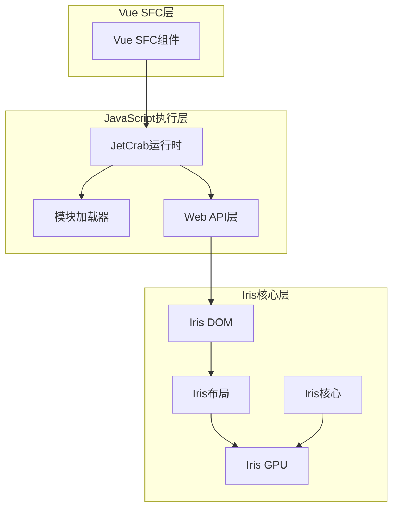

**图表来源**
- [lib.rs:7-15](file://crates/iris-jetcrab/src/lib.rs#L7-L15)
- [ARCHITECTURE.md:138-157](file://ARCHITECTURE.md#L138-L157)

## 项目结构

Iris-JetCrab运行时位于crates/iris-jetcrab目录下，采用标准的Rust crate组织结构：

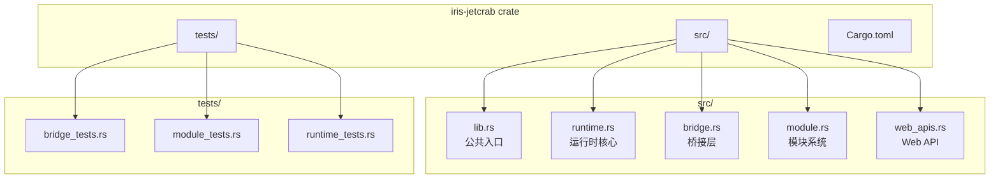

**图表来源**
- [lib.rs:40-49](file://crates/iris-jetcrab/src/lib.rs#L40-L49)
- [Cargo.toml:1-40](file://crates/iris-jetcrab/Cargo.toml#L1-L40)

### 模块职责划分

每个模块都有明确的职责边界：

- **lib.rs**：公共入口点，重新导出核心类型
- **runtime.rs**：JetCrab运行时的核心实现
- **bridge.rs**：与Iris核心模块的桥接层
- **module.rs**：ESM模块加载和解析
- **web_apis.rs**：Web API兼容层实现

**章节来源**
- [lib.rs:1-49](file://crates/iris-jetcrab/src/lib.rs#L1-L49)
- [Cargo.toml:1-40](file://crates/iris-jetcrab/Cargo.toml#L1-L40)

## 核心组件

### JetCrab运行时配置

运行时配置系统提供了灵活的运行时参数设置：

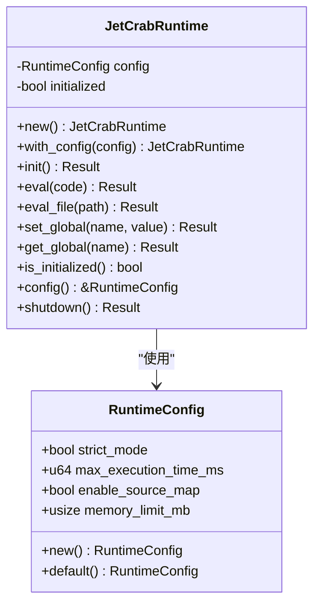

**图表来源**
- [runtime.rs:8-30](file://crates/iris-jetcrab/src/runtime.rs#L8-L30)
- [runtime.rs:47-54](file://crates/iris-jetcrab/src/runtime.rs#L47-L54)

### 模块加载系统

ESM模块加载器实现了完整的模块解析和缓存机制：

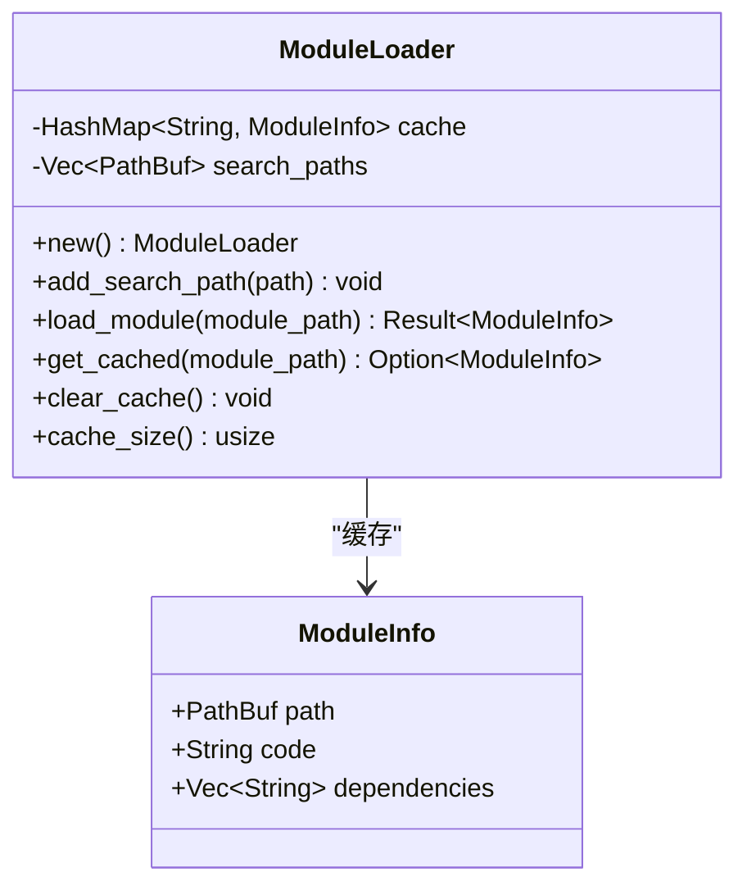

**图表来源**
- [module.rs:9-18](file://crates/iris-jetcrab/src/module.rs#L9-L18)
- [module.rs:20-28](file://crates/iris-jetcrab/src/module.rs#L20-L28)

### Web API兼容层

Web API层提供了浏览器标准API的Rust实现：

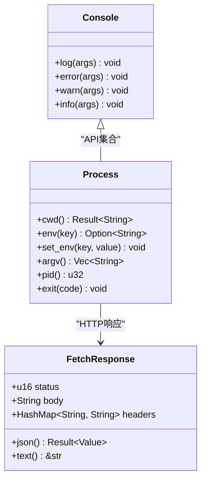

**图表来源**
- [web_apis.rs:7-30](file://crates/iris-jetcrab/src/web_apis.rs#L7-L30)
- [web_apis.rs:32-68](file://crates/iris-jetcrab/src/web_apis.rs#L32-L68)
- [web_apis.rs:70-91](file://crates/iris-jetcrab/src/web_apis.rs#L70-L91)

**章节来源**
- [runtime.rs:1-261](file://crates/iris-jetcrab/src/runtime.rs#L1-L261)
- [module.rs:1-208](file://crates/iris-jetcrab/src/module.rs#L1-L208)
- [web_apis.rs:1-204](file://crates/iris-jetcrab/src/web_apis.rs#L1-L204)

## 架构概览

### 整体架构设计

Iris-JetCrab运行时在整个Iris引擎架构中扮演着关键角色，作为JavaScript执行环境与Iris核心模块之间的桥梁：

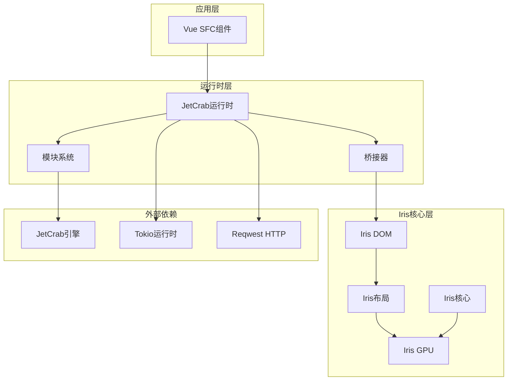

**图表来源**
- [ARCHITECTURE.md:254-300](file://ARCHITECTURE.md#L254-L300)
- [lib.rs:5-15](file://crates/iris-jetcrab/src/lib.rs#L5-L15)

### 数据流处理

JavaScript代码从SFC编译到最终渲染的完整数据流：

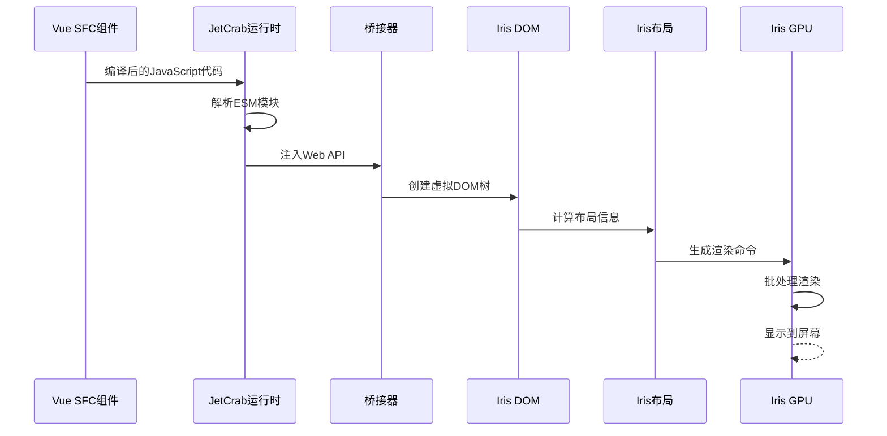

**图表来源**
- [minimal_demo.rs:57-87](file://crates/iris-app/examples/demo/minimal_demo.rs#L57-L87)
- [ARCHITECTURE.md:138-157](file://ARCHITECTURE.md#L138-L157)

## 详细组件分析

### 运行时生命周期管理

JetCrab运行时提供了完整的生命周期管理机制：

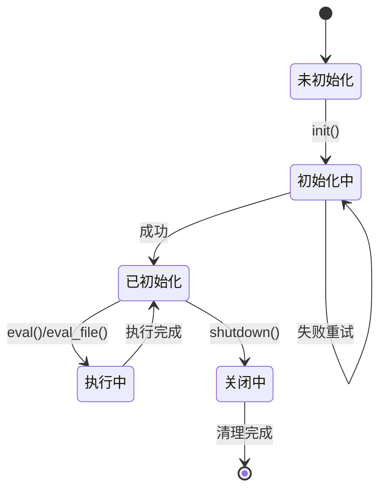

**图表来源**
- [runtime.rs:73-93](file://crates/iris-jetcrab/src/runtime.rs#L73-L93)
- [runtime.rs:187-201](file://crates/iris-jetcrab/src/runtime.rs#L187-L201)

#### 初始化流程

运行时初始化过程包含多个阶段的安全检查和配置验证：

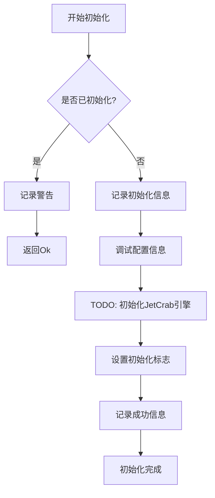

**图表来源**
- [runtime.rs:78-92](file://crates/iris-jetcrab/src/runtime.rs#L78-L92)

#### 错误处理机制

运行时实现了完善的错误处理策略：

| 错误类型 | 触发条件 | 处理方式 | 返回值 |
|---------|---------|---------|--------|
| 未初始化 | 调用eval()前 | 返回错误信息 | Err(String) |
| 文件读取失败 | eval_file()读取失败 | 包装错误信息 | Err(String) |
| 引擎操作失败 | JetCrab引擎调用失败 | 包装具体错误 | Err(String) |
| 成功执行 | 正常流程 | 返回Ok | Ok(Result) |

**章节来源**
- [runtime.rs:78-201](file://crates/iris-jetcrab/src/runtime.rs#L78-L201)

### 桥接器设计模式

桥接器作为运行时与Iris核心模块之间的适配层：

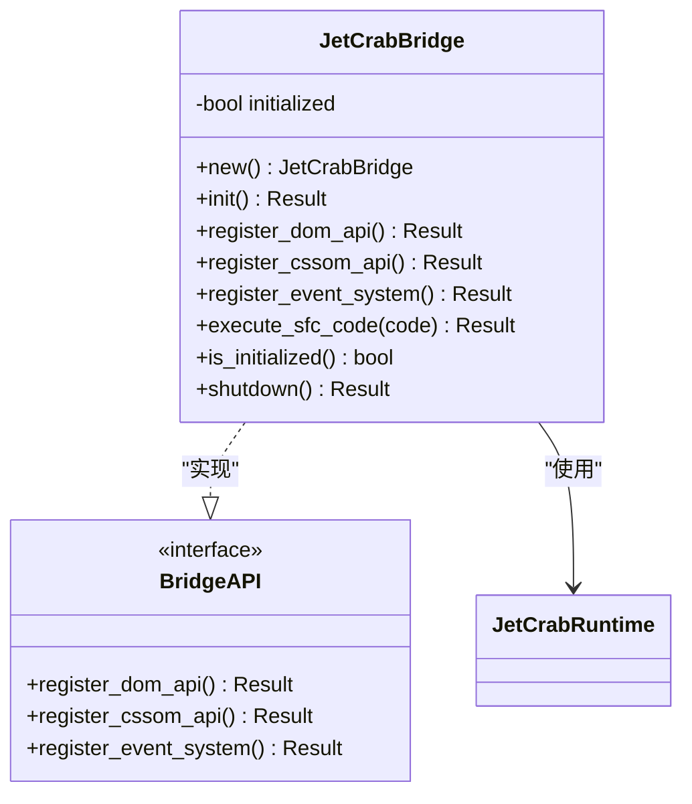

**图表来源**
- [bridge.rs:7-13](file://crates/iris-jetcrab/src/bridge.rs#L7-L13)
- [bridge.rs:15-40](file://crates/iris-jetcrab/src/bridge.rs#L15-L40)

#### API注册流程

桥接器负责将各种Web API注册到JavaScript环境中：

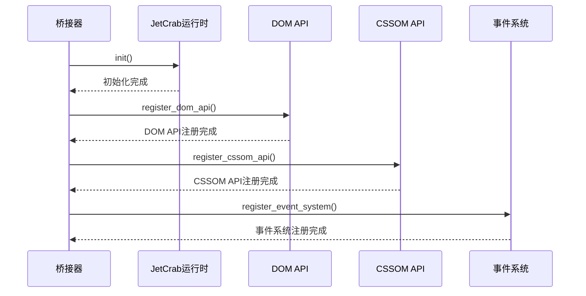

**图表来源**
- [bridge.rs:23-39](file://crates/iris-jetcrab/src/bridge.rs#L23-L39)
- [bridge.rs:41-90](file://crates/iris-jetcrab/src/bridge.rs#L41-L90)

### 模块系统实现

ESM模块加载器提供了完整的模块解析和缓存机制：

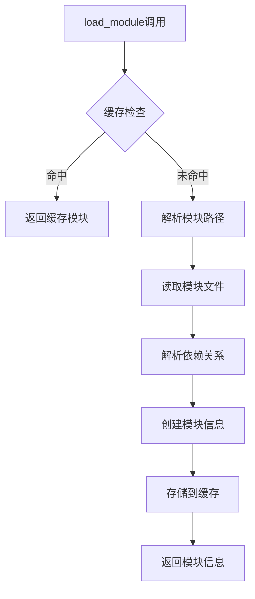

**图表来源**
- [module.rs:50-86](file://crates/iris-jetcrab/src/module.rs#L50-L86)
- [module.rs:88-118](file://crates/iris-jetcrab/src/module.rs#L88-L118)

#### 依赖解析算法

模块依赖解析采用了启发式的正则表达式匹配：

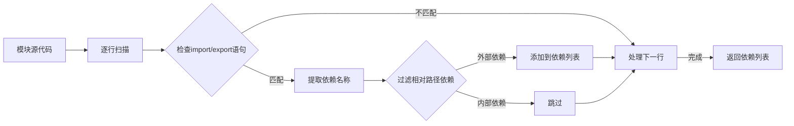

**图表来源**
- [module.rs:120-144](file://crates/iris-jetcrab/src/module.rs#L120-L144)

**章节来源**
- [bridge.rs:1-177](file://crates/iris-jetcrab/src/bridge.rs#L1-L177)
- [module.rs:1-208](file://crates/iris-jetcrab/src/module.rs#L1-L208)

### Web API实现

Web API兼容层提供了浏览器标准API的Rust实现：

#### Console API

Console API提供了标准的JavaScript控制台功能：

| 方法 | 参数 | 返回值 | 描述 |
|------|------|--------|------|
| log | args: &[String] | void | 输出普通日志信息 |
| error | args: &[String] | void | 输出错误信息 |
| warn | args: &[String] | void | 输出警告信息 |
| info | args: &[String] | void | 输出信息日志 |

#### Process API

Process API提供了Node.js风格的进程管理功能：

| 方法 | 参数 | 返回值 | 描述 |
|------|------|--------|------|
| cwd | 无 | Result<String> | 获取当前工作目录 |
| env | key: &str | Option<String> | 获取环境变量 |
| set_env | key: &str, value: &str | void | 设置环境变量 |
| argv | 无 | Vec<String> | 获取命令行参数 |
| pid | 无 | u32 | 获取进程ID |
| exit | code: i32 | ! | 退出进程 |

#### Fetch API

Fetch API提供了异步HTTP请求功能：

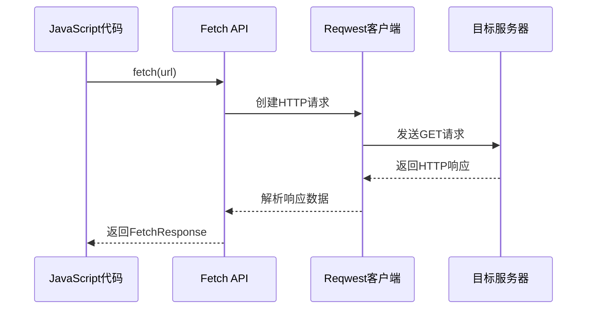

**图表来源**
- [web_apis.rs:94-122](file://crates/iris-jetcrab/src/web_apis.rs#L94-L122)

**章节来源**
- [web_apis.rs:1-204](file://crates/iris-jetcrab/src/web_apis.rs#L1-L204)

## 依赖关系分析

### 模块依赖图

Iris-JetCrab运行时的依赖关系体现了清晰的分层架构：

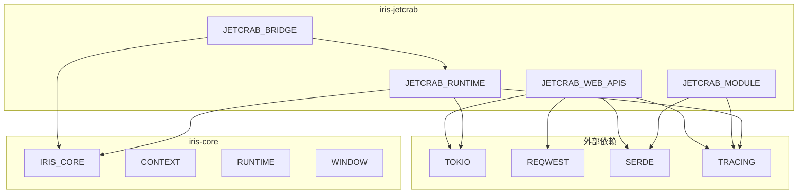

**图表来源**
- [Cargo.toml:13-35](file://crates/iris-jetcrab/Cargo.toml#L13-L35)
- [ARCHITECTURE.md:38-43](file://ARCHITECTURE.md#L38-L43)

### 核心依赖说明

| 依赖项 | 版本 | 用途 | 说明 |
|--------|------|------|------|
| iris-core | workspace | 核心基础设施 | 提供异步运行时和窗口管理 |
| iris-cssom | workspace | CSS对象模型 | 提供CSS解析和样式计算 |
| iris-layout | workspace | 布局引擎 | 提供HTML/CSS布局计算 |
| iris-dom | workspace | DOM抽象 | 提供虚拟DOM和事件系统 |
| iris-sfc | workspace | SFC编译器 | 提供Vue组件编译功能 |
| tokio | workspace | 异步运行时 | 提供Tokio多线程运行时 |
| reqwest | 0.11 | HTTP客户端 | 提供异步HTTP请求功能 |
| serde | 1.0 | 序列化框架 | 提供JSON序列化支持 |
| tracing | 0.1 | 日志追踪 | 提供结构化日志记录 |

**章节来源**
- [Cargo.toml:13-35](file://crates/iris-jetcrab/Cargo.toml#L13-L35)
- [ARCHITECTURE.md:177-213](file://ARCHITECTURE.md#L177-L213)

## 性能考虑

### 异步执行模型

Iris-JetCrab运行时采用基于Tokio的异步执行模型，提供了高效的并发处理能力：

- **多线程运行时**：默认4个工作线程，可根据CPU核心数调整
- **任务调度优化**：使用Tokio的多线程调度器，避免单点瓶颈
- **零拷贝数据传递**：通过Rust的所有权系统避免不必要的数据复制

### 内存管理策略

运行时实现了多项内存优化技术：

- **模块缓存机制**：ESM模块解析结果缓存，避免重复解析
- **智能垃圾回收**：结合Rust的RAII和手动内存管理
- **内存限制配置**：可通过RuntimeConfig设置内存使用上限

### 并发安全保证

所有公共API都经过了并发安全设计：

- **线程安全类型**：使用Arc、Mutex等同步原语保护共享状态
- **无锁数据结构**：在可能的情况下使用原子类型减少锁竞争
- **所有权转移**：通过Rust的所有权系统避免数据竞争

## 故障排除指南

### 常见问题诊断

#### 运行时未初始化错误

**症状**：调用eval()方法时返回"Runtime not initialized"错误

**解决方案**：
1. 确保先调用`runtime.init()`方法
2. 检查初始化过程中的错误日志
3. 验证配置参数的有效性

#### 模块加载失败

**症状**：ESM模块解析时出现"Module not found"错误

**解决方案**：
1. 检查模块路径是否正确
2. 确认模块文件存在于搜索路径中
3. 验证模块依赖的外部包是否已安装

#### Web API访问异常

**症状**：访问console、fetch等API时出现未定义错误

**解决方案**：
1. 确认桥接器已正确初始化
2. 检查API注册流程是否完成
3. 验证JavaScript环境中的全局对象

### 调试技巧

#### 启用详细日志

```rust
// 设置日志级别为DEBUG
std::env::set_var("RUST_LOG", "debug");
tracing_subscriber::fmt().init();
```

#### 性能监控

使用Tokio的内置性能监控工具：

```rust
use tokio::runtime::Handle;

let handle = Handle::current();
let metrics = handle.metrics();
println!("Active tasks: {}", metrics.num_blocking_threads());
```

**章节来源**
- [runtime.rs:218-260](file://crates/iris-jetcrab/src/runtime.rs#L218-L260)
- [bridge.rs:142-177](file://crates/iris-jetcrab/src/bridge.rs#L142-L177)
- [module.rs:169-208](file://crates/iris-jetcrab/src/module.rs#L169-L208)

## 结论

Iris-JetCrab运行时作为Iris引擎生态系统的重要组成部分，展现了现代前端运行时设计的最佳实践。通过采用Rust语言的内存安全特性和JetCrab引擎的高性能JavaScript执行能力，该项目为Vue 3应用提供了原生的运行时支持。

### 主要优势

1. **架构清晰**：分层设计确保了模块间的低耦合和高内聚
2. **性能优异**：基于Tokio的异步执行模型提供了高效的并发处理
3. **扩展性强**：模块化设计便于功能扩展和维护
4. **类型安全**：Rust的所有权系统确保了内存安全和线程安全

### 发展方向

随着Iris引擎生态系统的不断完善，Iris-JetCrab运行时将继续演进：

- **JetCrab引擎集成**：逐步实现对JetCrab引擎的完整集成
- **性能优化**：持续改进模块加载和JavaScript执行性能
- **功能完善**：扩展Web API兼容性和模块系统功能
- **生态整合**：更好地融入Iris引擎的整体生态系统

通过持续的开发和优化，Iris-JetCrab运行时将成为构建高性能Vue 3应用的理想选择。