# Iris-JetCrab运行时

<cite>
**本文档引用的文件**
- [lib.rs](file://crates/iris-jetcrab/src/lib.rs)
- [runtime.rs](file://crates/iris-jetcrab/src/runtime.rs)
- [bridge.rs](file://crates/iris-jetcrab/src/bridge.rs)
- [module.rs](file://crates/iris-jetcrab/src/module.rs)
- [web_apis.rs](file://crates/iris-jetcrab/src/web_apis.rs)
- [esm.rs](file://crates/iris-jetcrab/src/esm.rs)
- [cpm.rs](file://crates/iris-jetcrab/src/cpm.rs)
- [web_apis_enhanced.rs](file://crates/iris-jetcrab/src/web_apis_enhanced.rs)
- [wasm_bridge.rs](file://crates/iris-jetcrab/src/wasm_bridge.rs)
- [Cargo.toml](file://crates/iris-jetcrab/Cargo.toml)
- [lib.rs](file://crates/iris-core/src/lib.rs)
- [runtime.rs](file://crates/iris-core/src/runtime.rs)
- [window.rs](file://crates/iris-core/src/window.rs)
- [ARCHITECTURE.md](file://ARCHITECTURE.md)
- [README.md](file://README.md)
- [minimal_demo.rs](file://crates/iris-app/examples/demo/minimal_demo.rs)
</cite>

## 更新摘要
**所做更改**
- 新增ESM模块加载器完整实现，包含循环依赖检测和模块状态管理
- 新增CPM包管理器，支持npm包解析和安装
- 新增增强Web API兼容层，包括WebSocket、LocalStorage、SessionStorage和XMLHttpRequest
- 新增WASM桥接功能，支持WASM模块加载和JavaScript FFI桥接
- 更新核心组件分析以反映新增功能
- 增强架构概览以展示完整的运行时生态系统

## 目录
1. [简介](#简介)
2. [项目结构](#项目结构)
3. [核心组件](#核心组件)
4. [架构概览](#架构概览)
5. [详细组件分析](#详细组件分析)
6. [依赖关系分析](#依赖关系分析)
7. [性能考虑](#性能考虑)
8. [故障排除指南](#故障排除指南)
9. [结论](#结论)

## 简介

Iris-JetCrab运行时是Iris引擎生态系统中的重要组成部分，专门负责提供JavaScript执行环境和与Iris核心模块的桥接功能。该项目采用Rust语言开发，基于JetCrab JavaScript引擎，为Vue 3单文件组件（SFC）提供原生的JavaScript运行时支持。

### 核心特性

- **JetCrab引擎集成**：使用Chitin JavaScript引擎提供高性能的JavaScript执行环境
- **CPM包管理支持**：完整的npm包管理系统集成
- **ESM模块系统**：原生支持ECMAScript模块规范，包含循环依赖检测
- **增强Web API兼容层**：提供浏览器标准的Web API接口，包括WebSocket、LocalStorage等
- **WASM原生支持**：完全支持WebAssembly模块加载和Rust↔JavaScript FFI桥接
- **异步I/O支持**：基于Tokio的异步运行时

### 新增功能亮点

**ESM模块加载器**（511行代码）
- 完整的循环依赖检测机制
- 模块状态管理和缓存系统
- 动态import()支持
- 编译产物缓存

**CPM包管理器**（306行代码）
- npm包解析和安装
- package.json解析
- 依赖关系管理
- 缓存清理功能

**增强Web API**（416行代码）
- WebSocket连接管理
- LocalStorage/SessionStorage实现
- XMLHttpRequest模拟
- 完整的浏览器API兼容层

**WASM桥接**（369行代码）
- WASM模块加载和实例化
- 导出函数调用
- JavaScript FFI桥接
- 内存管理支持

**章节来源**
- [lib.rs:29-36](file://crates/iris-jetcrab/src/lib.rs#L29-L36)
- [esm.rs:1-511](file://crates/iris-jetcrab/src/esm.rs#L1-L511)
- [cpm.rs:1-306](file://crates/iris-jetcrab/src/cpm.rs#L1-L306)
- [web_apis_enhanced.rs:1-416](file://crates/iris-jetcrab/src/web_apis_enhanced.rs#L1-L416)
- [wasm_bridge.rs:1-369](file://crates/iris-jetcrab/src/wasm_bridge.rs#L1-L369)

## 项目结构

Iris-JetCrab运行时位于crates/iris-jetcrab目录下，采用标准的Rust crate组织结构，现已扩展为包含多个专业模块：

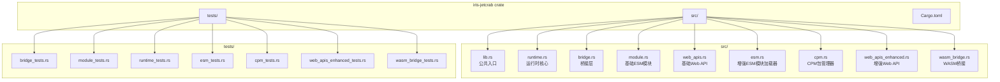

**图表来源**
- [lib.rs:40-72](file://crates/iris-jetcrab/src/lib.rs#L40-L72)
- [Cargo.toml:1-40](file://crates/iris-jetcrab/Cargo.toml#L1-L40)

### 模块职责划分

每个模块都有明确的职责边界：

- **lib.rs**：公共入口点，重新导出核心类型和新增模块
- **runtime.rs**：JetCrab运行时的核心实现，包含配置管理
- **bridge.rs**：与Iris核心模块的桥接层
- **module.rs**：基础ESM模块加载器
- **web_apis.rs**：基础Web API兼容层
- **esm.rs**：增强版ESM模块加载器，包含循环依赖检测
- **cpm.rs**：CPM包管理器，支持npm包管理
- **web_apis_enhanced.rs**：增强Web API兼容层
- **wasm_bridge.rs**：WASM模块加载和FFI桥接

**章节来源**
- [lib.rs:1-72](file://crates/iris-jetcrab/src/lib.rs#L1-L72)
- [Cargo.toml:13-35](file://crates/iris-jetcrab/Cargo.toml#L13-L35)

## 核心组件

### JetCrab运行时配置

运行时配置系统提供了灵活的运行时参数设置：

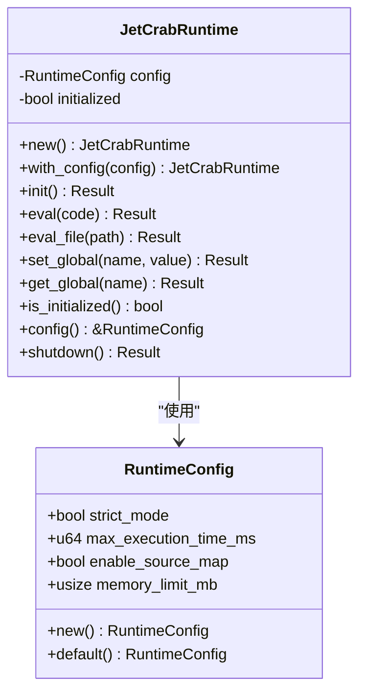

**图表来源**
- [runtime.rs:8-30](file://crates/iris-jetcrab/src/runtime.rs#L8-L30)
- [runtime.rs:47-54](file://crates/iris-jetcrab/src/runtime.rs#L47-L54)

### 增强ESM模块加载器

**更新** 新增完整的ESM模块加载器，支持循环依赖检测和模块状态管理

增强版ESM模块加载器实现了完整的模块解析、缓存和循环依赖检测机制：

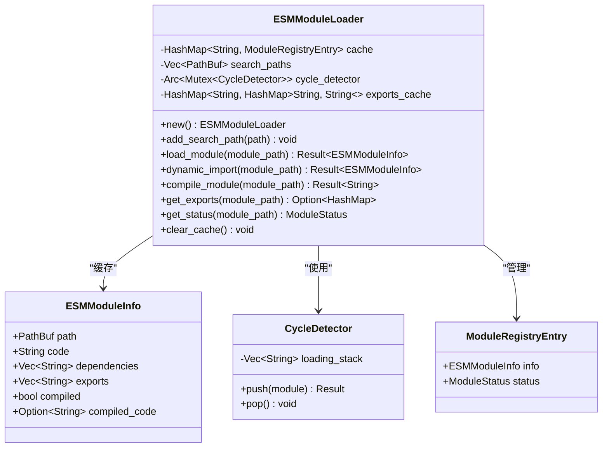

**图表来源**
- [esm.rs:10-90](file://crates/iris-jetcrab/src/esm.rs#L10-L90)
- [esm.rs:27-57](file://crates/iris-jetcrab/src/esm.rs#L27-L57)
- [esm.rs:74-79](file://crates/iris-jetcrab/src/esm.rs#L74-L79)

### CPM包管理器

**更新** 新增CPM包管理器，支持npm包解析和安装

CPM包管理器提供了完整的npm包管理功能：

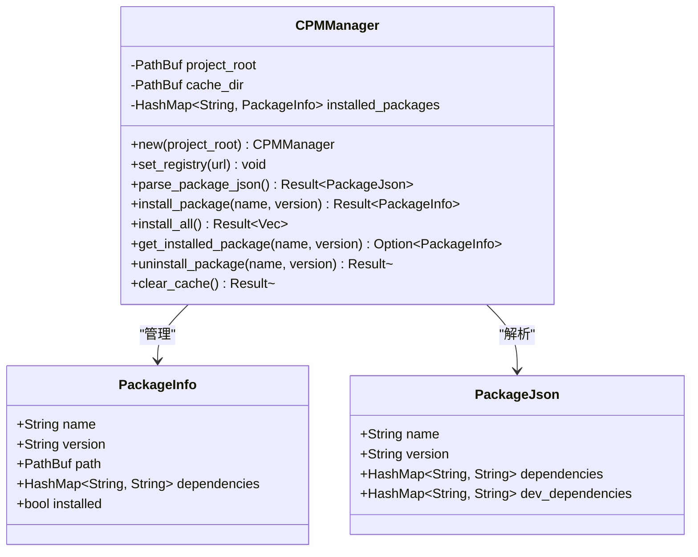

**图表来源**
- [cpm.rs:10-46](file://crates/iris-jetcrab/src/cpm.rs#L10-L46)
- [cpm.rs:25-34](file://crates/iris-jetcrab/src/cpm.rs#L25-L34)

### 增强Web API兼容层

**更新** 新增WebSocket、LocalStorage、SessionStorage和XMLHttpRequest支持

增强Web API兼容层提供了更完整的浏览器API实现：

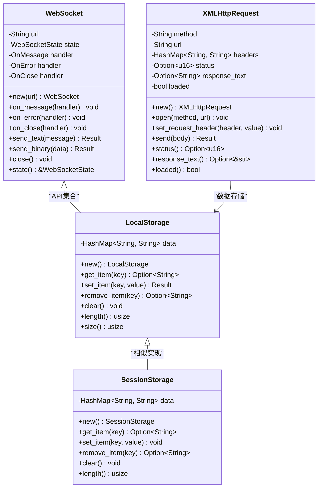

**图表来源**
- [web_apis_enhanced.rs:31-132](file://crates/iris-jetcrab/src/web_apis_enhanced.rs#L31-L132)
- [web_apis_enhanced.rs:134-201](file://crates/iris-jetcrab/src/web_apis_enhanced.rs#L134-L201)
- [web_apis_enhanced.rs:209-336](file://crates/iris-jetcrab/src/web_apis_enhanced.rs#L209-L336)

### WASM桥接功能

**更新** 新增WASM模块加载和JavaScript FFI桥接功能

WASM桥接模块提供了WebAssembly模块的完整支持：

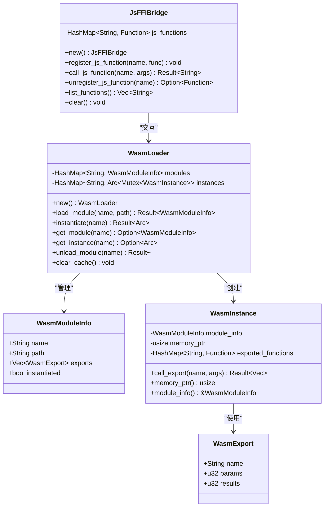

**图表来源**
- [wasm_bridge.rs:9-70](file://crates/iris-jetcrab/src/wasm_bridge.rs#L9-L70)
- [wasm_bridge.rs:131-241](file://crates/iris-jetcrab/src/wasm_bridge.rs#L131-L241)
- [wasm_bridge.rs:261-314](file://crates/iris-jetcrab/src/wasm_bridge.rs#L261-L314)

**章节来源**
- [runtime.rs:1-261](file://crates/iris-jetcrab/src/runtime.rs#L1-L261)
- [esm.rs:1-511](file://crates/iris-jetcrab/src/esm.rs#L1-L511)
- [cpm.rs:1-306](file://crates/iris-jetcrab/src/cpm.rs#L1-L306)
- [web_apis_enhanced.rs:1-416](file://crates/iris-jetcrab/src/web_apis_enhanced.rs#L1-L416)
- [wasm_bridge.rs:1-369](file://crates/iris-jetcrab/src/wasm_bridge.rs#L1-L369)

## 架构概览

### 整体架构设计

**更新** 架构已扩展为包含完整的运行时生态系统

Iris-JetCrab运行时在整个Iris引擎架构中扮演着关键角色，现在包含完整的模块生态系统：

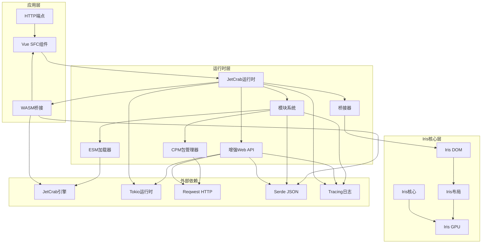

**图表来源**
- [ARCHITECTURE.md:254-300](file://ARCHITECTURE.md#L254-L300)
- [lib.rs:5-15](file://crates/iris-jetcrab/src/lib.rs#L5-L15)

### 数据流处理

**更新** 数据流已扩展为支持多种模块类型和API

JavaScript代码从SFC编译到最终渲染的完整数据流，现在包含ESM模块、CPM包和WASM模块：

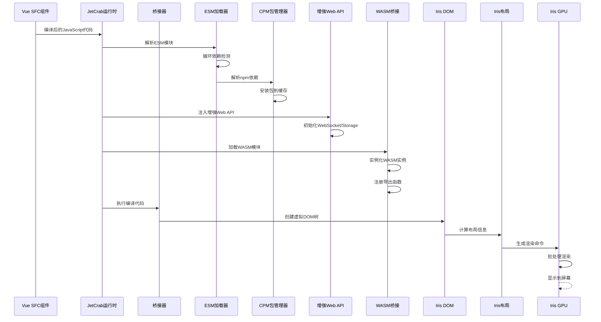

**图表来源**
- [minimal_demo.rs:57-87](file://crates/iris-app/examples/demo/minimal_demo.rs#L57-L87)
- [ARCHITECTURE.md:138-157](file://ARCHITECTURE.md#L138-L157)

## 详细组件分析

### 运行时生命周期管理

JetCrab运行时提供了完整的生命周期管理机制：

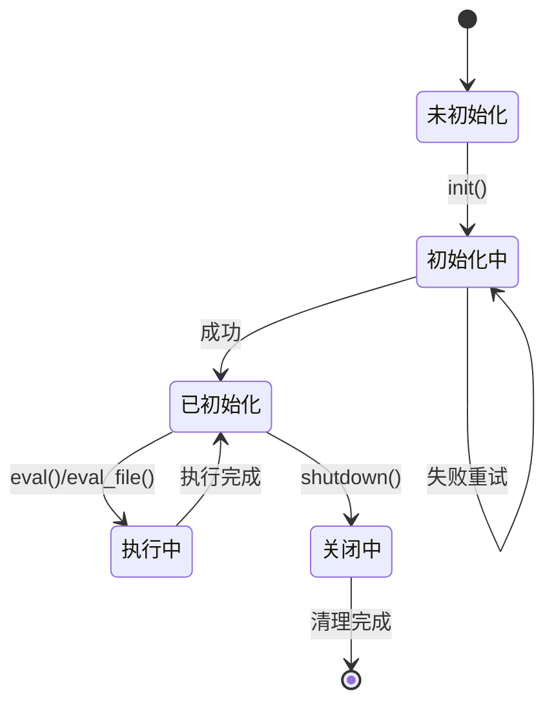

**图表来源**
- [runtime.rs:73-93](file://crates/iris-jetcrab/src/runtime.rs#L73-L93)
- [runtime.rs:187-201](file://crates/iris-jetcrab/src/runtime.rs#L187-L201)

#### 初始化流程

运行时初始化过程包含多个阶段的安全检查和配置验证：

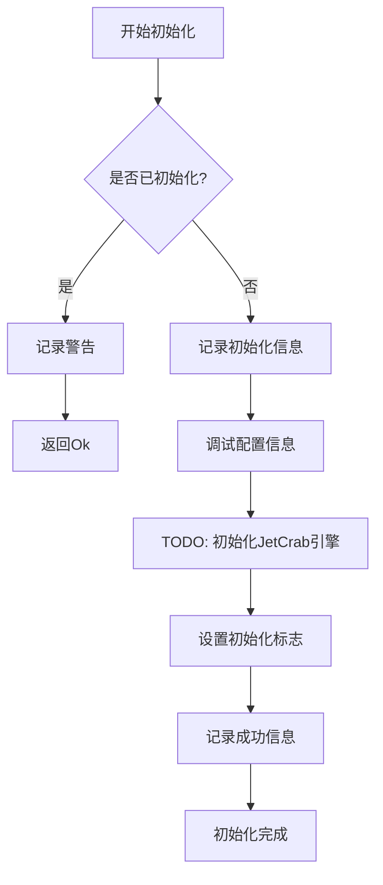

**图表来源**
- [runtime.rs:78-92](file://crates/iris-jetcrab/src/runtime.rs#L78-L92)

#### 错误处理机制

运行时实现了完善的错误处理策略：

| 错误类型 | 触发条件 | 处理方式 | 返回值 |
|---------|---------|---------|--------|
| 未初始化 | 调用eval()前 | 返回错误信息 | Err(String) |
| 文件读取失败 | eval_file()读取失败 | 包装错误信息 | Err(String) |
| 引擎操作失败 | JetCrab引擎调用失败 | 包装具体错误 | Err(String) |
| 成功执行 | 正常流程 | 返回Ok | Ok(Result) |

**章节来源**
- [runtime.rs:78-201](file://crates/iris-jetcrab/src/runtime.rs#L78-L201)

### 桥接器设计模式

桥接器作为运行时与Iris核心模块之间的适配层：

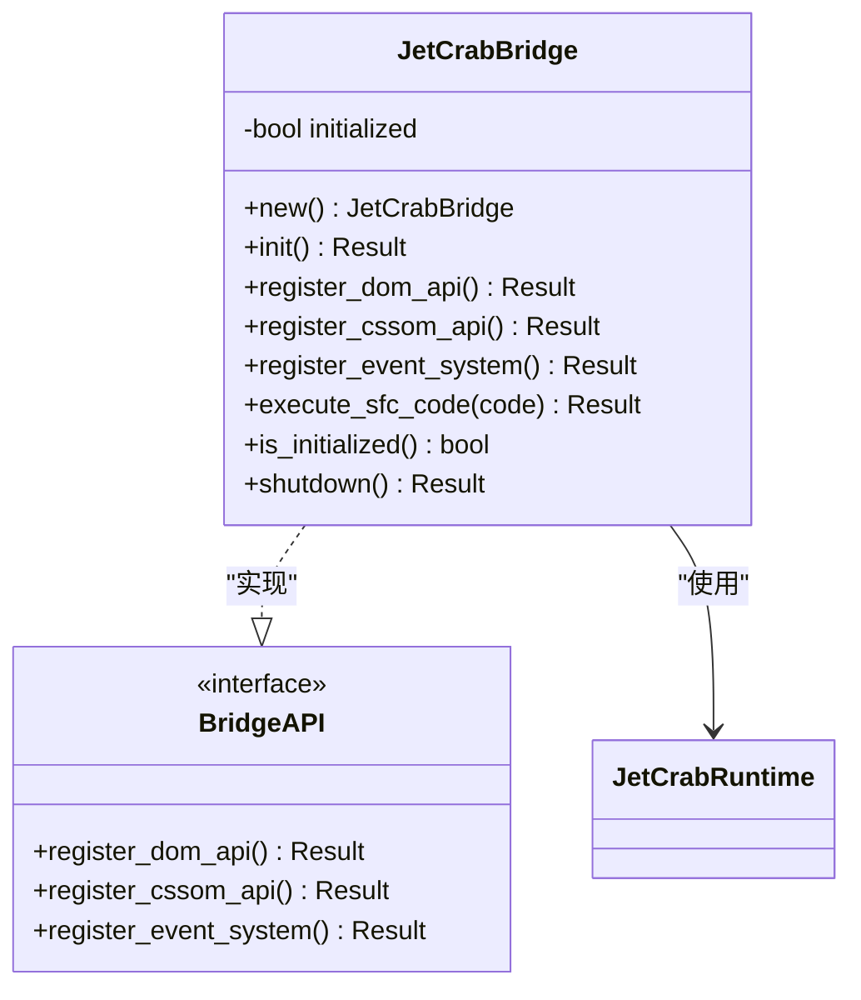

**图表来源**
- [bridge.rs:7-13](file://crates/iris-jetcrab/src/bridge.rs#L7-L13)
- [bridge.rs:15-40](file://crates/iris-jetcrab/src/bridge.rs#L15-L40)

#### API注册流程

桥接器负责将各种Web API注册到JavaScript环境中：

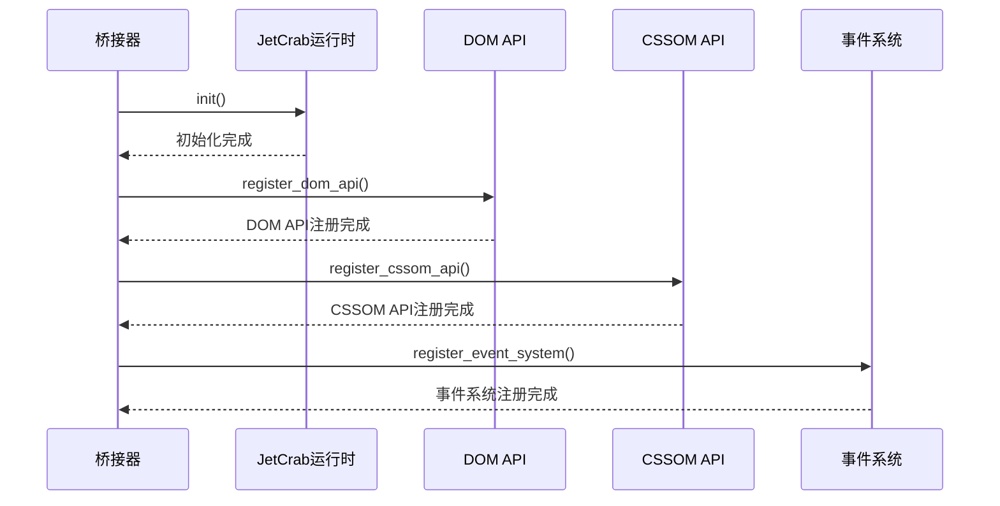

**图表来源**
- [bridge.rs:23-39](file://crates/iris-jetcrab/src/bridge.rs#L23-L39)
- [bridge.rs:41-90](file://crates/iris-jetcrab/src/bridge.rs#L41-L90)

### 增强ESM模块系统

**更新** 新增完整的ESM模块加载器实现

增强版ESM模块加载器提供了完整的模块解析、缓存和循环依赖检测机制：

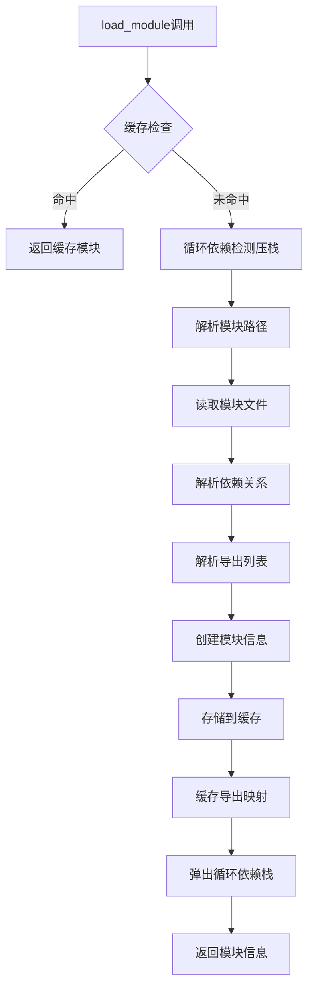

**图表来源**
- [esm.rs:109-181](file://crates/iris-jetcrab/src/esm.rs#L109-L181)
- [esm.rs:183-187](file://crates/iris-jetcrab/src/esm.rs#L183-L187)

#### 依赖解析算法

模块依赖解析采用了增强的正则表达式匹配，支持更多ESM语法：

```mermaid
flowchart LR
CODE[模块源代码] --> LINE_BY_LINE[逐行扫描]
LINE_BY_LINE --> IMPORT_CHECK{检查import/export语句}
IMPORT_CHECK --> |import ... from| EXTRACT_DEP[提取依赖名称]
IMPORT_CHECK --> |export ... from| EXTRACT_DEP
IMPORT_CHECK --> |import('...')| EXTRACT_DYNAMIC[提取动态导入]
IMPORT_CHECK --> |export { ... }| PARSE_NAMED_EXPORTS[解析命名导出]
IMPORT_CHECK --> |export default| ADD_DEFAULT[添加默认导出]
IMPORT_CHECK --> |export const/function/class| EXTRACT_DECLARED[提取声明导出]
IMPORT_CHECK --> NEXT_LINE[处理下一行]
EXTRACT_DEP --> FILTER_SEEN[去重检查]
EXTRACT_DYNAMIC --> FILTER_SEEN
PARSE_NAMED_EXPORTS --> FILTER_SEEN
EXTRACT_DECLARED --> FILTER_SEEN
FILTER_SEEN --> NEXT_LINE
NEXT_LINE --> |完成| RETURN_DEPS[返回依赖列表]
```

**图表来源**
- [esm.rs:270-335](file://crates/iris-jetcrab/src/esm.rs#L270-L335)
- [esm.rs:337-398](file://crates/iris-jetcrab/src/esm.rs#L337-L398)

### CPM包管理器实现

**更新** 新增CPM包管理器的完整实现

CPM包管理器提供了完整的npm包管理功能：

```mermaid
flowchart TD
INSTALL[install_package调用] --> CACHE_CHECK{缓存检查}
CACHE_CHECK --> |已安装| RETURN_PKG[返回已安装包]
CACHE_CHECK --> |未安装| CREATE_DIR[创建缓存目录]
CREATE_DIR --> DOWNLOAD[下载包(模拟)]
DOWNLOAD --> PARSE_JSON[解析package.json]
PARSE_JSON --> CREATE_PKG[创建PackageInfo]
CREATE_PKG --> CACHE_PKG[缓存包信息]
CACHE_PKG --> RETURN_PKG
RETURN_PKG --> INSTALL_ALL[install_all调用]
INSTALL_ALL --> PARSE_JSON2[解析package.json]
PARSE_JSON2 --> INSTALL_DEPS[安装生产依赖]
INSTALL_DEPS --> INSTALL_DEV_DEPS[安装开发依赖]
INSTALL_DEV_DEPS --> DONE[安装完成]
```

**图表来源**
- [cpm.rs:86-136](file://crates/iris-jetcrab/src/cpm.rs#L86-L136)
- [cpm.rs:163-189](file://crates/iris-jetcrab/src/cpm.rs#L163-L189)

#### 包解析流程

CPM包管理器的package.json解析流程：

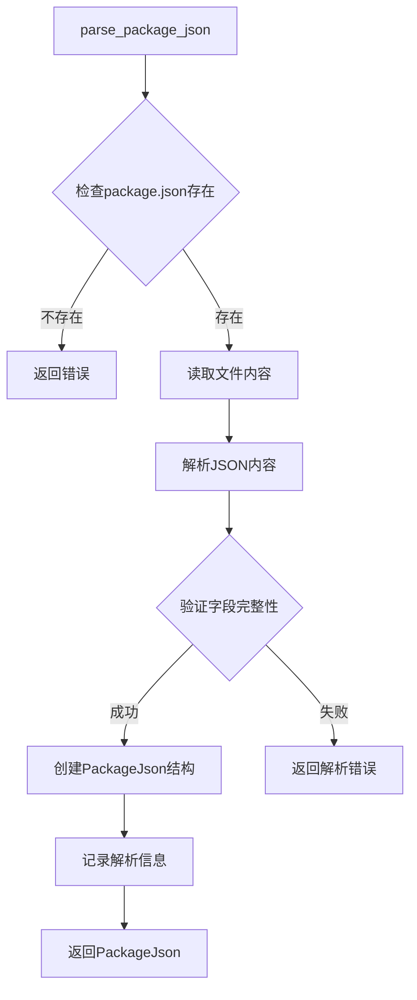

**图表来源**
- [cpm.rs:67-84](file://crates/iris-jetcrab/src/cpm.rs#L67-L84)

### 增强Web API实现

**更新** 新增WebSocket、LocalStorage、SessionStorage和XMLHttpRequest的完整实现

#### WebSocket API

WebSocket API提供了完整的WebSocket连接管理：

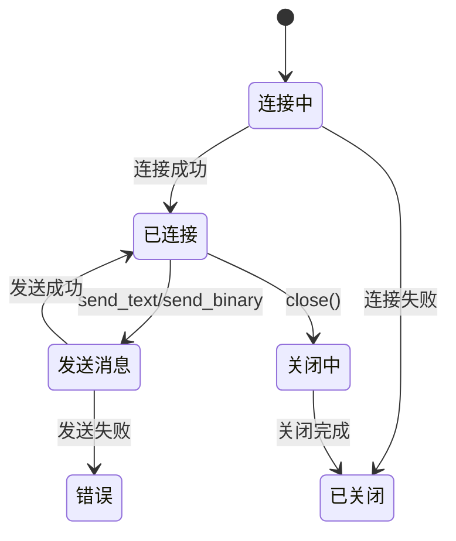

**图表来源**
- [web_apis_enhanced.rs:45-132](file://crates/iris-jetcrab/src/web_apis_enhanced.rs#L45-L132)

#### LocalStorage API

LocalStorage API提供了完整的本地存储功能：

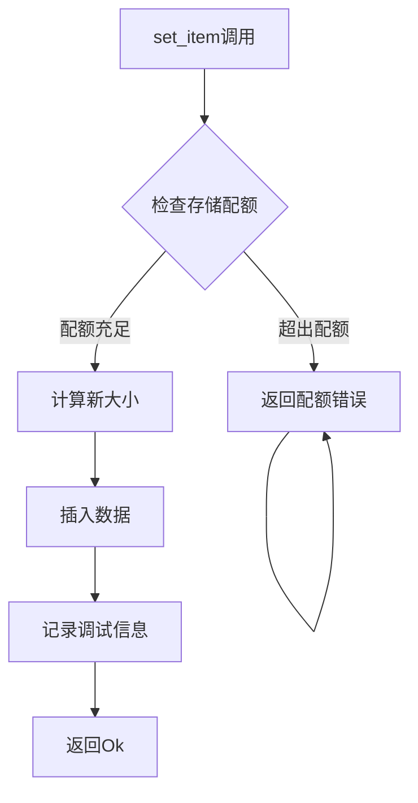

**图表来源**
- [web_apis_enhanced.rs:157-169](file://crates/iris-jetcrab/src/web_apis_enhanced.rs#L157-L169)

#### XMLHttpRequest API

XMLHttpRequest API提供了HTTP请求的完整模拟：

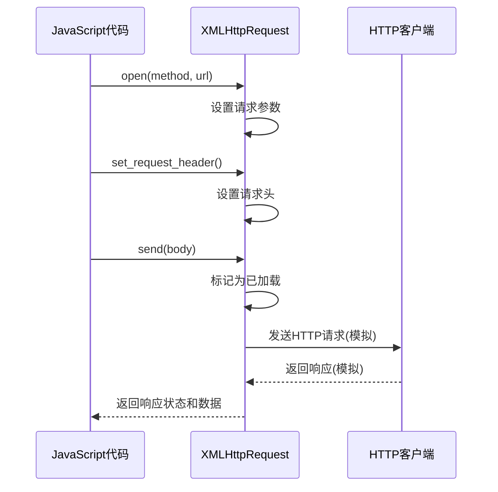

**图表来源**
- [web_apis_enhanced.rs:286-314](file://crates/iris-jetcrab/src/web_apis_enhanced.rs#L286-L314)

### WASM桥接实现

**更新** 新增WASM模块加载和JavaScript FFI桥接的完整实现

#### WASM模块加载流程

WASM模块加载器提供了完整的WASM模块管理：

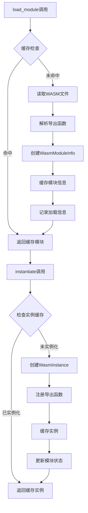

**图表来源**
- [wasm_bridge.rs:81-111](file://crates/iris-jetcrab/src/wasm_bridge.rs#L81-L111)
- [wasm_bridge.rs:131-162](file://crates/iris-jetcrab/src/wasm_bridge.rs#L131-L162)

#### JavaScript FFI桥接

JavaScript FFI桥接提供了Rust和JavaScript之间的双向调用：

```mermaid
sequenceDiagram
participant JS as JavaScript代码
participant FFI as JsFFIBridge
participant RUST as Rust函数
JS->>FFI : call_js_function(name, args)
FFI->>FFI : 查找注册的函数
FFI->>RUST : 调用Rust函数
RUST-->>FFI : 返回字符串结果
FFI-->>JS : 返回结果
JS->>FFI : register_js_function(name, func)
FFI->>FFI : 注册JavaScript函数
JS->>FFI : unregister_js_function(name)
FFI->>FFI : 移除函数注册
```

**图表来源**
- [wasm_bridge.rs:284-301](file://crates/iris-jetcrab/src/wasm_bridge.rs#L284-L301)

**章节来源**
- [bridge.rs:1-177](file://crates/iris-jetcrab/src/bridge.rs#L1-L177)
- [esm.rs:1-511](file://crates/iris-jetcrab/src/esm.rs#L1-L511)
- [cpm.rs:1-306](file://crates/iris-jetcrab/src/cpm.rs#L1-L306)
- [web_apis_enhanced.rs:1-416](file://crates/iris-jetcrab/src/web_apis_enhanced.rs#L1-L416)
- [wasm_bridge.rs:1-369](file://crates/iris-jetcrab/src/wasm_bridge.rs#L1-L369)

## 依赖关系分析

### 模块依赖图

**更新** 依赖关系已扩展为包含新增模块

Iris-JetCrab运行时的依赖关系体现了清晰的分层架构，现已包含完整的模块生态系统：

```mermaid
graph TD
subgraph "iris-jetcrab"
JC[JETCRAB_RUNTIME]
BR[JETCRAB_BRIDGE]
ML[JETCRAB_MODULE]
WA[JETCRAB_WEB_APIS]
ESM[JETCRAB_ESM]
CPM[JETCRAB_CPM]
WAE[JETCRAB_WEB_APIS_ENHANCED]
WB[JETCRAB_WASM_BRIDGE]
end
subgraph "iris-core"
CORE[IRIS_CORE]
CTX[CONTEXT]
RT[RUNTIME]
WIN[WINDOW]
end
subgraph "外部依赖"
TOK[TOKIO]
REQ[REQWEST]
SER[SERDE]
TRC[TRACING]
THS[THISERROR]
end
JC --> CORE
JC --> TOK
JC --> TRC
BR --> CORE
BR --> JC
ML --> SER
ML --> TRC
WA --> TOK
WA --> REQ
WA --> SER
WA --> TRC
ESM --> SER
ESM --> TRC
CPM --> SER
CPM --> TRC
CPM --> REQ
WAE --> TOK
WAE --> REQ
WAE --> SER
WAE --> TRC
WB --> SER
WB --> TRC
WB --> THS
```

**图表来源**
- [Cargo.toml:13-35](file://crates/iris-jetcrab/Cargo.toml#L13-L35)
- [ARCHITECTURE.md:38-43](file://ARCHITECTURE.md#L38-L43)

### 核心依赖说明

| 依赖项 | 版本 | 用途 | 说明 |
|--------|------|------|------|
| iris-core | workspace | 核心基础设施 | 提供异步运行时和窗口管理 |
| iris-cssom | workspace | CSS对象模型 | 提供CSS解析和样式计算 |
| iris-layout | workspace | 布局引擎 | 提供HTML/CSS布局计算 |
| iris-dom | workspace | DOM抽象 | 提供虚拟DOM和事件系统 |
| iris-sfc | workspace | SFC编译器 | 提供Vue组件编译功能 |
| tokio | workspace | 异步运行时 | 提供Tokio多线程运行时 |
| reqwest | 0.11 | HTTP客户端 | 提供异步HTTP请求功能 |
| serde | 1.0 | 序列化框架 | 提供JSON序列化支持 |
| tracing | 0.1 | 日志追踪 | 提供结构化日志记录 |
| thiserror | 1.0 | 错误处理 | 提供错误类型定义 |

**章节来源**
- [Cargo.toml:13-35](file://crates/iris-jetcrab/Cargo.toml#L13-L35)
- [ARCHITECTURE.md:177-213](file://ARCHITECTURE.md#L177-L213)

## 性能考虑

### 异步执行模型

Iris-JetCrab运行时采用基于Tokio的异步执行模型，提供了高效的并发处理能力：

- **多线程运行时**：默认4个工作线程，可根据CPU核心数调整
- **任务调度优化**：使用Tokio的多线程调度器，避免单点瓶颈
- **零拷贝数据传递**：通过Rust的所有权系统避免不必要的数据复制

### 内存管理策略

**更新** 内存管理策略已扩展为支持新增模块

运行时实现了多项内存优化技术：

- **模块缓存机制**：ESM模块解析结果缓存，避免重复解析
- **智能垃圾回收**：结合Rust的RAII和手动内存管理
- **内存限制配置**：可通过RuntimeConfig设置内存使用上限
- **WASM内存管理**：提供WASM模块的内存指针管理
- **包缓存清理**：CPM包管理器支持缓存清理功能

### 并发安全保证

所有公共API都经过了并发安全设计：

- **线程安全类型**：使用Arc、Mutex等同步原语保护共享状态
- **无锁数据结构**：在可能的情况下使用原子类型减少锁竞争
- **所有权转移**：通过Rust的所有权系统避免数据竞争
- **循环依赖检测**：ESM模块加载器使用Arc<Mutex>保护循环检测器

## 故障排除指南

### 常见问题诊断

#### 运行时未初始化错误

**症状**：调用eval()方法时返回"Runtime not initialized"错误

**解决方案**：
1. 确保先调用`runtime.init()`方法
2. 检查初始化过程中的错误日志
3. 验证配置参数的有效性

#### 模块加载失败

**症状**：ESM模块解析时出现"Module not found"错误

**解决方案**：
1. 检查模块路径是否正确
2. 确认模块文件存在于搜索路径中
3. 验证模块依赖的外部包是否已安装
4. 检查循环依赖检测器状态

#### CPM包安装失败

**症状**：CPM包管理器安装包时出现错误

**解决方案**：
1. 检查网络连接和npm注册表可达性
2. 验证package.json格式正确性
3. 确认缓存目录权限
4. 检查磁盘空间是否充足

#### Web API访问异常

**症状**：访问console、fetch等API时出现未定义错误

**解决方案**：
1. 确认桥接器已正确初始化
2. 检查API注册流程是否完成
3. 验证JavaScript环境中的全局对象
4. 对于WebSocket，检查连接状态

#### WASM模块加载失败

**症状**：WASM模块加载或实例化失败

**解决方案**：
1. 检查WASM文件路径和可访问性
2. 验证WASM模块格式正确性
3. 确认导出函数名称匹配
4. 检查内存分配和指针有效性

### 调试技巧

#### 启用详细日志

```rust
// 设置日志级别为DEBUG
std::env::set_var("RUST_LOG", "debug");
tracing_subscriber::fmt().init();
```

#### 性能监控

使用Tokio的内置性能监控工具：

```rust
use tokio::runtime::Handle;

let handle = Handle::current();
let metrics = handle.metrics();
println!("Active tasks: {}", metrics.num_blocking_threads());
```

**章节来源**
- [runtime.rs:218-260](file://crates/iris-jetcrab/src/runtime.rs#L218-L260)
- [bridge.rs:142-177](file://crates/iris-jetcrab/src/bridge.rs#L142-L177)
- [esm.rs:418-428](file://crates/iris-jetcrab/src/esm.rs#L418-L428)
- [cpm.rs:214-225](file://crates/iris-jetcrab/src/cpm.rs#L214-L225)
- [wasm_bridge.rs:224-229](file://crates/iris-jetcrab/src/wasm_bridge.rs#L224-L229)

## 结论

Iris-JetCrab运行时作为Iris引擎生态系统的重要组成部分，现已发展为包含完整模块生态系统的现代化运行时。通过采用Rust语言的内存安全特性和JetCrab引擎的高性能JavaScript执行能力，该项目为Vue 3应用提供了原生的运行时支持。

### 主要优势

1. **架构清晰**：分层设计确保了模块间的低耦合和高内聚
2. **性能优异**：基于Tokio的异步执行模型提供了高效的并发处理
3. **扩展性强**：模块化设计便于功能扩展和维护
4. **类型安全**：Rust的所有权系统确保了内存安全和线程安全
5. **功能完整**：新增ESM模块加载器、CPM包管理器、增强Web API和WASM桥接功能

### 新增功能价值

**ESM模块加载器**（511行代码）
- 提供完整的循环依赖检测，避免运行时错误
- 支持模块状态管理和缓存，提升性能
- 实现动态import()支持，增强模块灵活性

**CPM包管理器**（306行代码）
- 完整支持npm包管理，简化依赖处理
- 提供package.json解析和安装功能
- 支持缓存管理和卸载功能

**增强Web API**（416行代码）
- 提供WebSocket连接管理，支持实时通信
- 实现LocalStorage/SessionStorage，支持本地数据存储
- 提供XMLHttpRequest模拟，兼容传统AJAX请求

**WASM桥接**（369行代码）
- 支持WebAssembly模块加载和实例化
- 提供JavaScript FFI桥接，实现Rust↔JavaScript互操作
- 支持导出函数调用和内存管理

### 发展方向

随着Iris引擎生态系统的不断完善，Iris-JetCrab运行时将继续演进：

- **JetCrab引擎集成**：逐步实现对JetCrab引擎的完整集成
- **性能优化**：持续改进模块加载和JavaScript执行性能
- **功能完善**：扩展Web API兼容性和模块系统功能
- **生态整合**：更好地融入Iris引擎的整体生态系统
- **标准化**：遵循Web标准，提升跨平台兼容性

通过持续的开发和优化，Iris-JetCrab运行时将成为构建高性能Vue 3应用的理想选择，为开发者提供从模块管理到运行时执行的完整解决方案。