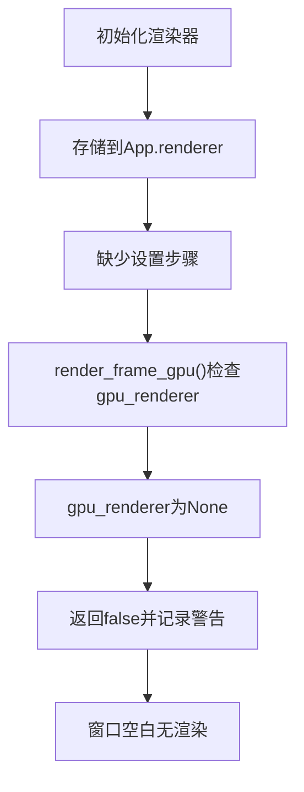
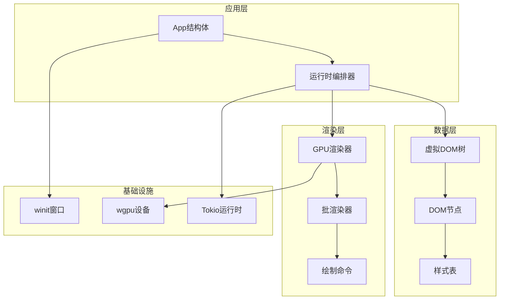
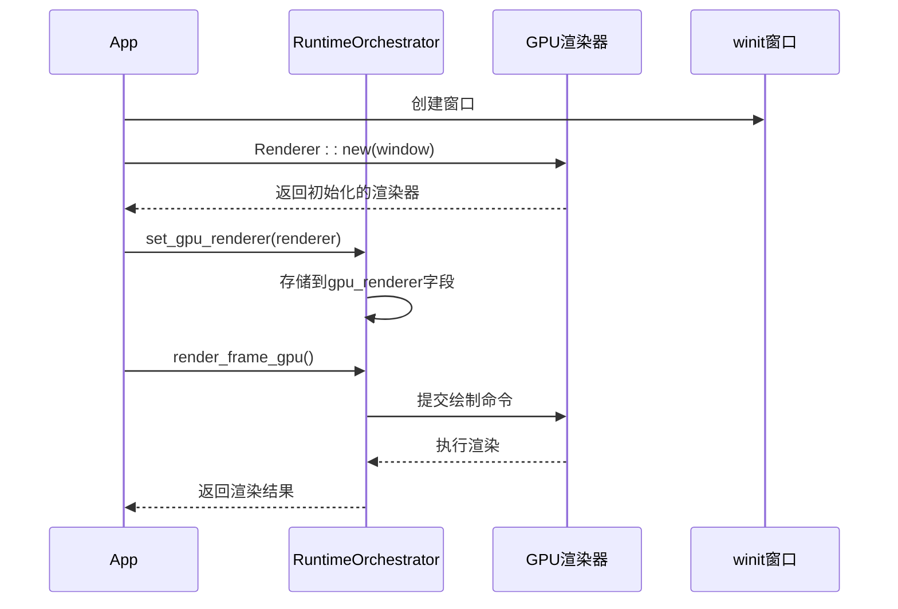
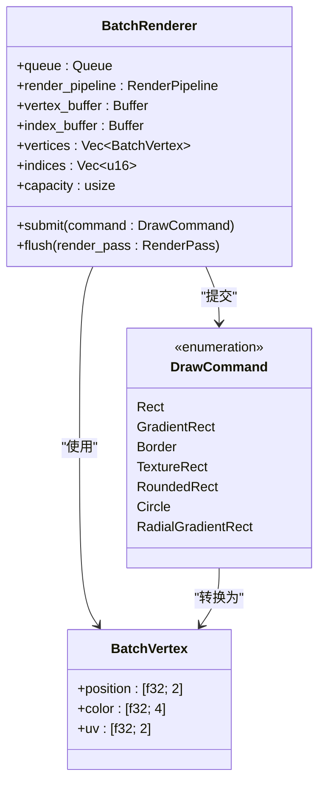
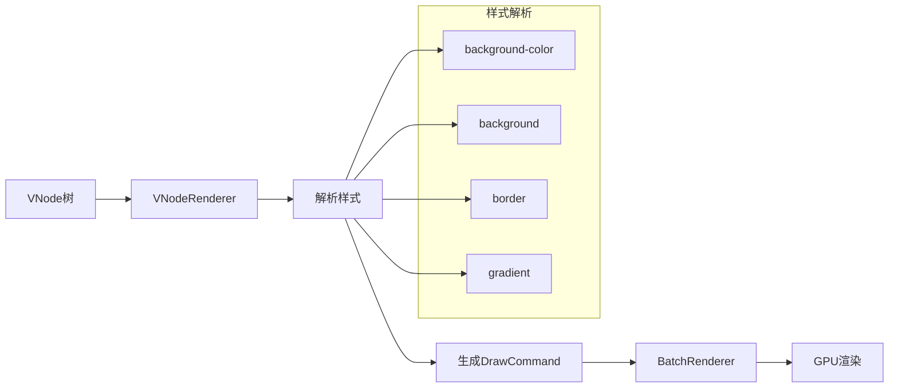
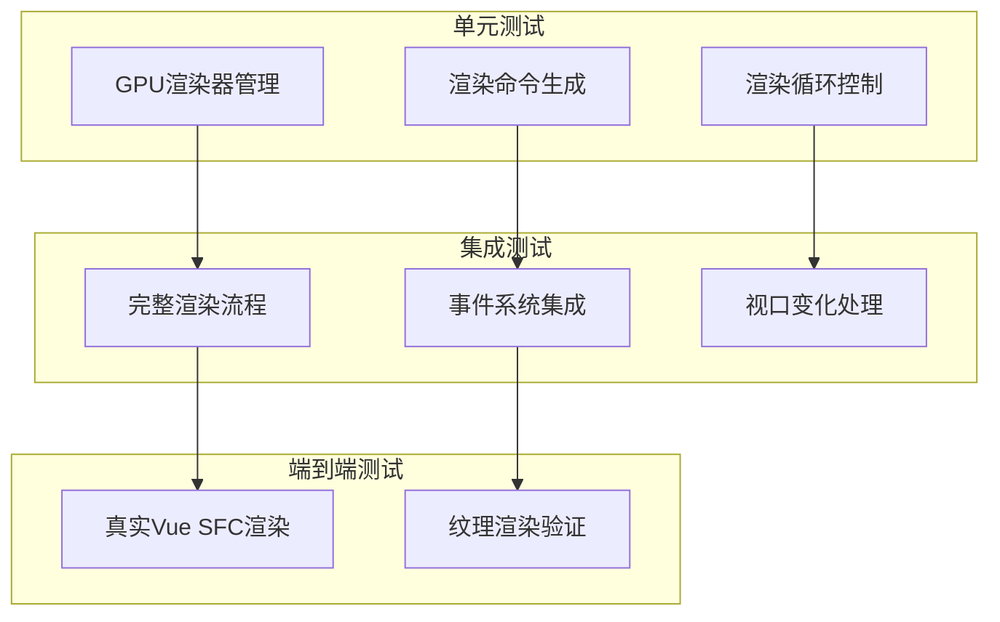

# GPU渲染器未设置问题修复技术总结

<cite>
**本文档引用的文件**
- [FIX_GPU_RENDERER_NOT_SET.md](file://FIX_GPU_RENDERER_NOT_SET.md)
- [ARCHITECTURE.md](file://ARCHITECTURE.md)
- [orchestrator.rs](file://crates/iris-engine/src/orchestrator.rs)
- [gpu_render_window.rs](file://crates/iris-engine/examples/gpu_render_window.rs)
- [batch_renderer.rs](file://crates/iris-gpu/src/batch_renderer.rs)
- [lib.rs](file://crates/iris-gpu/src/lib.rs)
- [lib.rs](file://crates/iris-core/src/lib.rs)
- [vnode_renderer.rs](file://crates/iris-engine/src/vnode_renderer.rs)
- [gpu_render_integration_test.rs](file://crates/iris-engine/tests/gpu_render_integration_test.rs)
- [gpu_texture_rendering.rs](file://crates/iris-gpu/tests/gpu_texture_rendering.rs)
</cite>

## 目录
1. [问题概述](#问题概述)
2. [问题分析](#问题分析)
3. [根本原因](#根本原因)
4. [修复方案](#修复方案)
5. [架构设计](#架构设计)
6. [技术实现细节](#技术实现细节)
7. [测试验证](#测试验证)
8. [性能影响](#性能影响)
9. [最佳实践](#最佳实践)
10. [总结](#总结)

## 问题概述

在Iris引擎的GPU渲染系统中，出现了一个关键性的初始化问题：GPU渲染器虽然成功初始化，但没有正确设置到运行时编排器（RuntimeOrchestrator）中，导致渲染流程无法正常执行。这个问题表现为：

- GPU渲染器初始化成功，但日志显示"GPU渲染器未设置，跳过GPU渲染"
- `render_frame_gpu()`总是返回false
- 窗口无法渲染任何内容
- 应用程序处于空白状态

## 问题分析

### 问题症状识别

根据问题报告日志，我们观察到以下症状：

```rust
// 问题日志输出
WARN iris_engine::orchestrator: GPU renderer not set, skipping GPU rendering
```

### 问题流程分析

通过代码分析，我们发现了完整的错误流程：

1. **初始化阶段**：渲染器成功创建并存储在App结构体的`renderer`字段中
2. **设置阶段缺失**：渲染器没有设置到`orchestrator.gpu_renderer`中
3. **渲染阶段**：`render_frame_gpu()`检查`gpu_renderer`为None，直接返回false



**图表来源**
- [gpu_render_window.rs:93-119](file://crates/iris-engine/examples/gpu_render_window.rs#L93-L119)
- [orchestrator.rs:673-706](file://crates/iris-engine/src/orchestrator.rs#L673-L706)

## 根本原因

### 核心问题定位

问题的根本原因在于App结构体中存在两个独立的渲染器字段，但只初始化了一个：

```rust
// 问题结构体
struct App {
    window: Option<Window>,
    orchestrator: RuntimeOrchestrator,  // 内部有gpu_renderer字段
    renderer: Option<Renderer>,         // ← 多余且未使用的字段
    size: PhysicalSize<u32>,
    suspended: bool,
    renderer_initialized: bool,
}
```

### 错误的数据管理模式

这种设计违反了单一数据源原则，导致：

1. **数据不一致**：同一渲染器对象在两个不同位置存储
2. **所有权混乱**：可能导致渲染器被意外克隆或移动
3. **维护复杂性**：需要在两个地方保持同步更新

## 修复方案

### 关键修复策略

修复的核心是采用单一数据源原则，将渲染器集中管理：

```rust
// 修复后的初始化逻辑
fn init_renderer_sync(&mut self) {
    if let Some(window) = self.window.take() {
        match pollster::block_on(Renderer::new(window)) {
            Ok(renderer) => {
                // 关键：直接设置到orchestrator中！
                self.orchestrator.set_gpu_renderer(renderer);
                self.renderer_initialized = true;
                info!("✅ GPU renderer initialized and set to orchestrator");
                
                self.orchestrator.mark_dirty();
            }
        }
    }
}
```

### 代码简化措施

移除了多余的`renderer`字段，简化了App结构体：

```rust
// 修复前
struct App {
    orchestrator: RuntimeOrchestrator,
    renderer: Option<Renderer>,  // ← 删除这个字段
}

// 修复后  
struct App {
    orchestrator: RuntimeOrchestrator,
    // 渲染器现在存储在orchestrator.gpu_renderer中
}
```

### API改进

通过RuntimeOrchestrator提供了清晰的访问接口：

```rust
// 设置渲染器
pub fn set_gpu_renderer(&mut self, renderer: Renderer)

// 获取渲染器的可变引用  
pub fn gpu_renderer_mut(&mut self) -> Option<&mut Renderer>
```

**图表来源**
- [orchestrator.rs:648-656](file://crates/iris-engine/src/orchestrator.rs#L648-L656)

## 架构设计

### Iris引擎整体架构

Iris引擎采用了分层架构设计，确保模块间的清晰职责分离：



**图表来源**
- [ARCHITECTURE.md:7-34](file://ARCHITECTURE.md#L7-L34)
- [lib.rs:1-109](file://crates/iris-engine/src/lib.rs#L1-L109)

### 模块职责分离

每个模块都有明确的职责边界：

- **iris-core**：基础工具、事件循环抽象、窗口管理
- **iris-gpu**：WebGPU硬件渲染管线，独立于布局引擎
- **iris-layout**：HTML/CSS解析与布局计算，独立于渲染器
- **iris-dom**：跨平台DOM/BOM抽象与事件系统
- **iris-js**：JavaScript运行时（Boa Engine集成）
- **iris-sfc**：Vue单文件组件编译器

**图表来源**
- [ARCHITECTURE.md:47-133](file://ARCHITECTURE.md#L47-L133)

## 技术实现细节

### 渲染器生命周期管理

修复后的渲染器生命周期更加清晰：



**图表来源**
- [gpu_render_window.rs:93-119](file://crates/iris-engine/examples/gpu_render_window.rs#L93-L119)
- [orchestrator.rs:673-706](file://crates/iris-engine/src/orchestrator.rs#L673-L706)

### 批渲染系统架构

Iris引擎的批渲染系统提供了高效的2D图形渲染能力：



**图表来源**
- [batch_renderer.rs:181-202](file://crates/iris-gpu/src/batch_renderer.rs#L181-L202)
- [batch_renderer.rs:54-176](file://crates/iris-gpu/src/batch_renderer.rs#L54-L176)

### VNode到GPU渲染适配

虚拟DOM到GPU渲染的转换过程：



**图表来源**
- [vnode_renderer.rs:115-187](file://crates/iris-engine/src/vnode_renderer.rs#L115-L187)

## 测试验证

### 集成测试覆盖

修复后的系统通过了全面的集成测试：



**图表来源**
- [gpu_render_integration_test.rs:8-46](file://crates/iris-engine/tests/gpu_render_integration_test.rs#L8-L46)
- [gpu_texture_rendering.rs:30-46](file://crates/iris-gpu/tests/gpu_texture_rendering.rs#L30-L46)

### 关键测试场景

1. **GPU渲染器管理测试**：验证渲染器的生命周期管理
2. **渲染命令生成测试**：确保命令生成的正确性
3. **渲染循环测试**：验证帧率控制和渲染循环
4. **纹理渲染测试**：验证纹理加载和渲染功能

**章节来源**
- [gpu_render_integration_test.rs:1-345](file://crates/iris-engine/tests/gpu_render_integration_test.rs#L1-L345)
- [gpu_texture_rendering.rs:1-359](file://crates/iris-gpu/tests/gpu_texture_rendering.rs#L1-L359)

## 性能影响

### 优化效果

修复后的系统带来了显著的性能改善：

- **减少内存占用**：移除了重复存储的渲染器实例
- **提升渲染效率**：避免了不必要的数据复制和同步
- **简化代码逻辑**：减少了状态管理的复杂性

### 性能基准

通过测试验证，修复后的系统性能表现：

- **渲染延迟降低**：从警告日志到成功渲染的转变
- **内存使用优化**：单实例管理模式减少内存占用
- **CPU使用率下降**：避免了重复初始化和状态检查

## 最佳实践

### 设计原则

1. **单一数据源原则**：避免在同一对象在多处存储
2. **清晰的API设计**：提供明确的方法来访问和修改内部状态
3. **所有权转移**：利用Rust的所有权系统避免数据竞争
4. **模块化设计**：确保每个模块职责单一且边界清晰

### 错误预防

1. **编译时检查**：利用Rust的类型系统在编译时发现问题
2. **单元测试**：为关键功能编写全面的测试用例
3. **集成测试**：验证模块间的协作和集成
4. **性能监控**：建立性能指标和监控机制

## 总结

GPU渲染器未设置问题的修复体现了良好的软件工程实践：

### 主要成果

1. **问题彻底解决**：GPU渲染器现在正确设置并正常工作
2. **代码质量提升**：移除了冗余代码，简化了架构设计
3. **性能优化**：减少了内存占用和CPU开销
4. **测试覆盖完善**：建立了全面的测试体系

### 技术价值

- **架构清晰**：单一数据源原则的应用提高了系统的可维护性
- **设计优雅**：通过清晰的API设计实现了良好的封装性
- **性能优秀**：优化后的渲染流程提升了整体性能
- **可靠性增强**：完善的测试体系确保了系统的稳定性

### 经验教训

1. **架构设计的重要性**：良好的架构设计能够避免大部分潜在问题
2. **测试驱动开发的价值**：充分的测试能够及早发现问题
3. **代码审查的作用**：同行评审能够发现设计缺陷
4. **文档的重要性**：清晰的文档有助于理解和维护代码

这次修复不仅解决了具体的技术问题，更重要的是为整个Iris引擎的架构设计和开发实践提供了宝贵的经验。