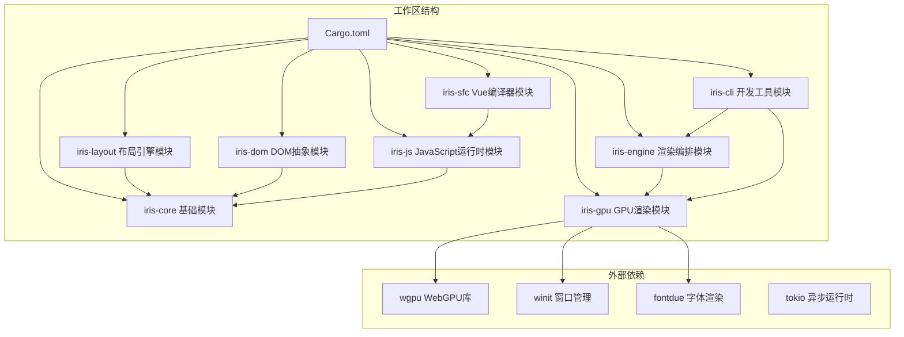
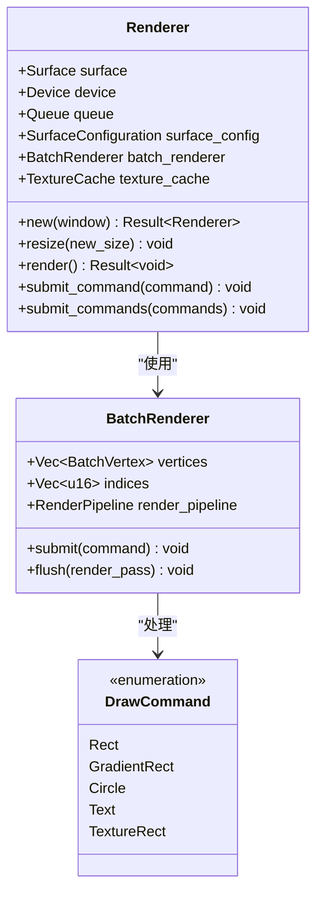
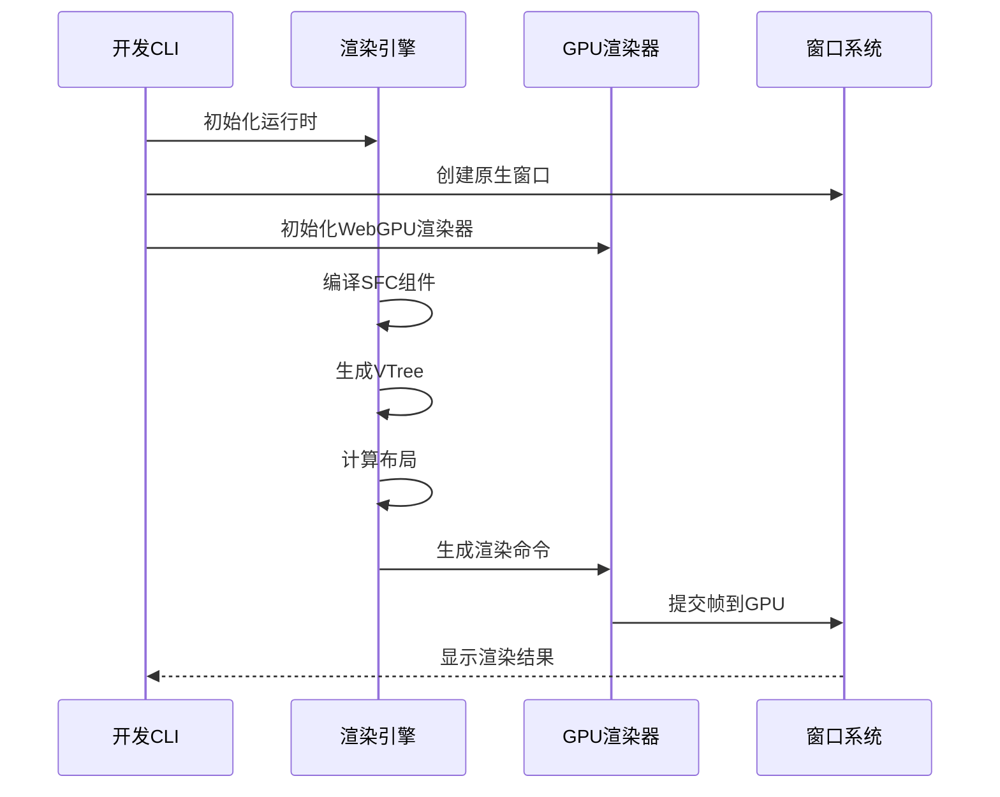
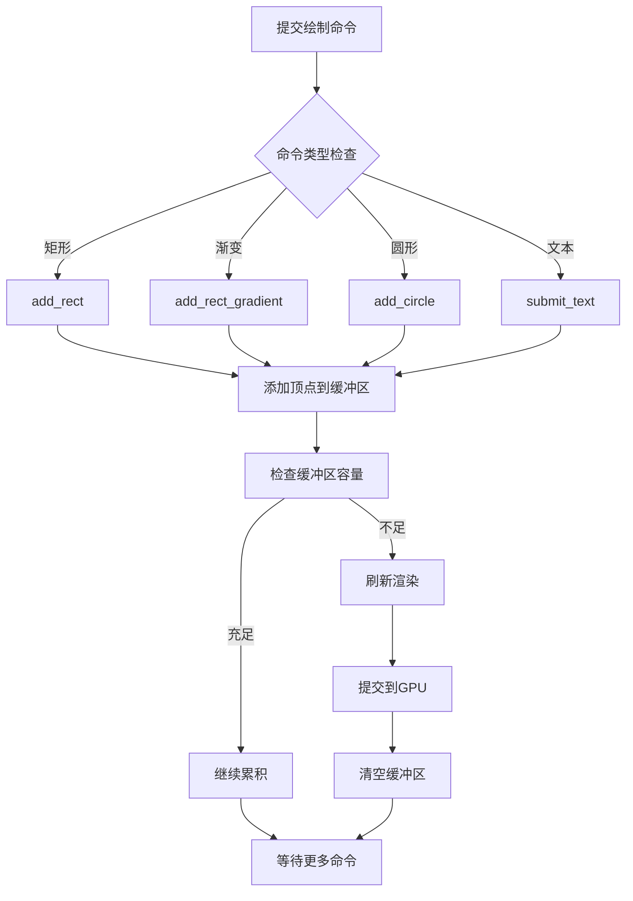
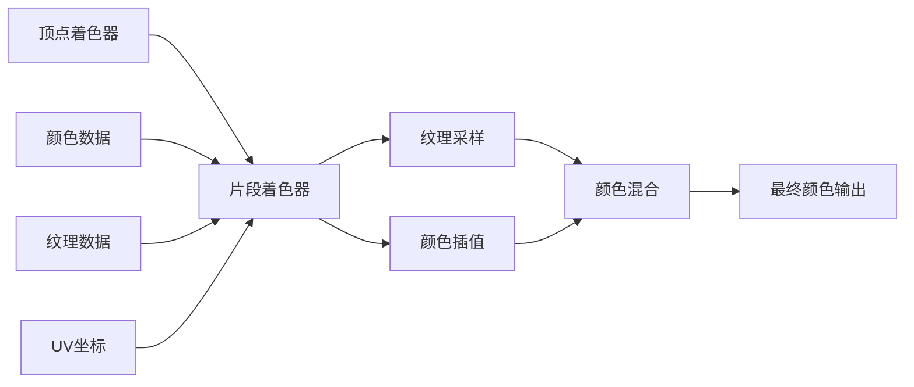
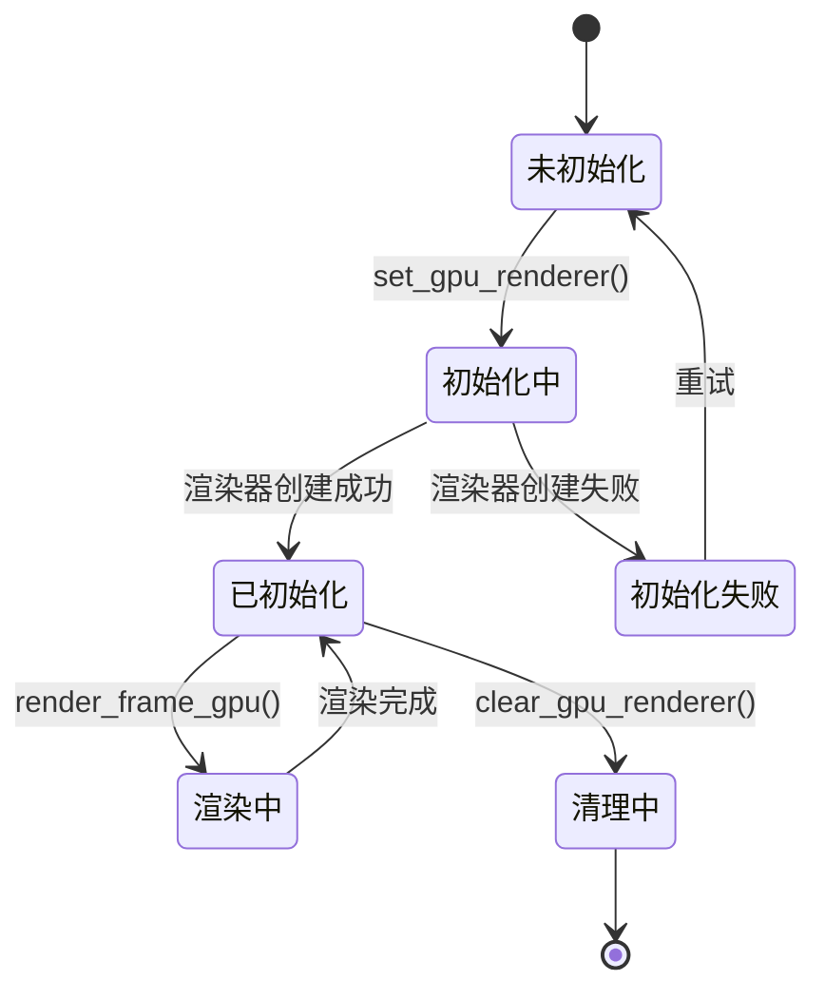
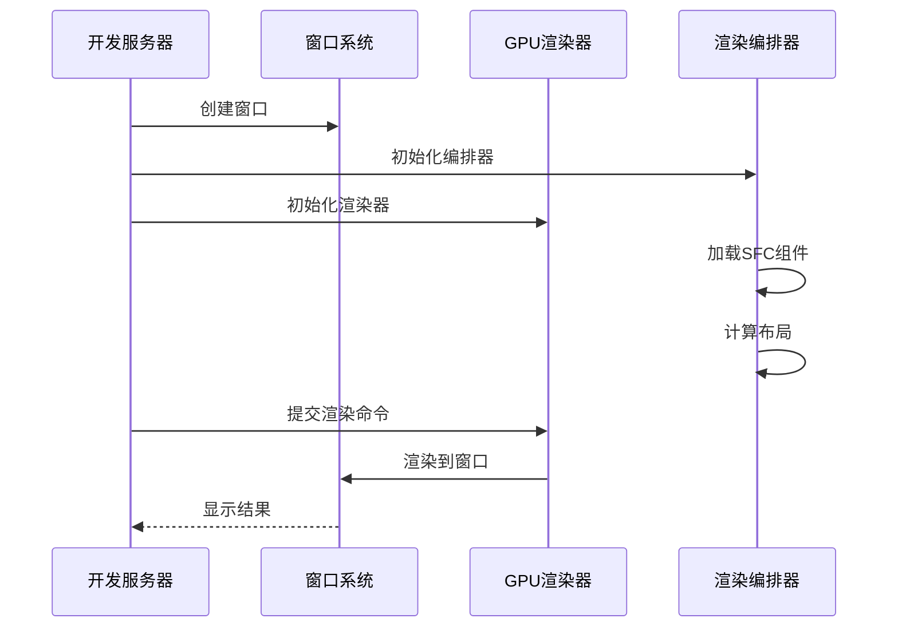
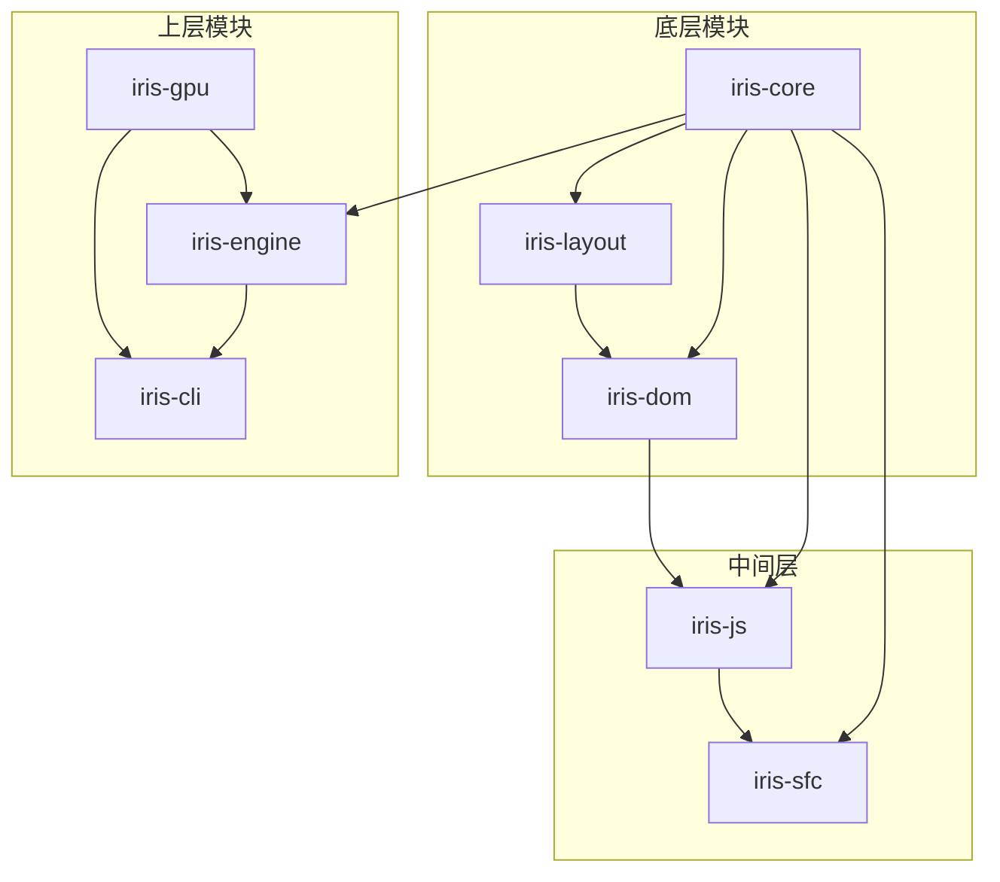

# GPU渲染器集成

<cite>
**本文档引用的文件**
- [Cargo.toml](file://Cargo.toml)
- [ARCHITECTURE.md](file://ARCHITECTURE.md)
- [GPU_RENDERER_INTEGRATION_COMPLETE.md](file://GPU_RENDERER_INTEGRATION_COMPLETE.md)
- [GPU_RENDER_INTEGRATION_SUMMARY.md](file://GPU_RENDER_INTEGRATION_SUMMARY.md)
- [crates/iris-gpu/Cargo.toml](file://crates/iris-gpu/Cargo.toml)
- [crates/iris-gpu/src/lib.rs](file://crates/iris-gpu/src/lib.rs)
- [crates/iris-gpu/src/batch_renderer.rs](file://crates/iris-gpu/src/batch_renderer.rs)
- [crates/iris-gpu/src/batch_shader.wgsl](file://crates/iris-gpu/src/batch_shader.wgsl)
- [crates/iris-gpu/src/text_renderer.rs](file://crates/iris-gpu/src/text_renderer.rs)
- [crates/iris-gpu/src/font_atlas.rs](file://crates/iris-gpu/src/font_atlas.rs)
- [crates/iris-engine/src/orchestrator.rs](file://crates/iris-engine/src/orchestrator.rs)
- [crates/iris-cli/src/commands/dev.rs](file://crates/iris-cli/src/commands/dev.rs)
- [crates/iris-engine/examples/gpu_render_integration.rs](file://crates/iris-engine/examples/gpu_render_integration.rs)
- [crates/iris-engine/tests/gpu_render_integration_test.rs](file://crates/iris-engine/tests/gpu_render_integration_test.rs)
</cite>

## 目录
1. [简介](#简介)
2. [项目结构](#项目结构)
3. [核心组件](#核心组件)
4. [架构概览](#架构概览)
5. [详细组件分析](#详细组件分析)
6. [依赖关系分析](#依赖关系分析)
7. [性能考虑](#性能考虑)
8. [故障排除指南](#故障排除指南)
9. [结论](#结论)

## 简介

Iris GPU渲染器集成项目成功实现了WebGPU硬件渲染管线，将Vue SFC（单文件组件）渲染到原生窗口中。该项目采用模块化架构设计，通过iris-gpu crate提供WebGPU渲染能力，iris-engine负责渲染管线编排，iris-cli提供开发服务器功能。

项目的主要成就包括：
- 成功集成WebGPU渲染器到iris-cli开发命令中
- 实现原生窗口渲染，支持多页面同时显示
- 建立完整的渲染管线：SFC编译 → VTree生成 → DOM树 → 布局计算 → GPU渲染
- 支持窗口大小调整和事件处理
- 提供完整的测试套件和示例代码

## 项目结构

项目采用Cargo工作区结构，包含多个相互独立但协同工作的crate：

**图表来源**
- [Cargo.toml:1-34](file://Cargo.toml#L1-L34)
- [ARCHITECTURE.md:3-34](file://ARCHITECTURE.md#L3-L34)

**章节来源**
- [Cargo.toml:1-34](file://Cargo.toml#L1-L34)
- [ARCHITECTURE.md:1-289](file://ARCHITECTURE.md#L1-L289)

## 核心组件

### GPU渲染器（Renderer）

iris-gpu crate提供了完整的WebGPU渲染能力，包括：

- **批渲染系统**：支持矩形、渐变、圆形、文本等多种图形元素
- **纹理管理**：字体图集、纹理缓存和UV映射
- **着色器系统**：WGSL着色器实现颜色插值和纹理采样
- **窗口集成**：与winit窗口系统无缝集成

**图表来源**
- [crates/iris-gpu/src/lib.rs:82-116](file://crates/iris-gpu/src/lib.rs#L82-L116)
- [crates/iris-gpu/src/batch_renderer.rs:195-220](file://crates/iris-gpu/src/batch_renderer.rs#L195-L220)

### 渲染编排器（RuntimeOrchestrator）

iris-engine提供了完整的渲染编排能力：

- **模块管理**：协调SFC编译、JavaScript执行、DOM树构建、布局计算
- **渲染管线**：从VTree到GPU命令的完整转换
- **帧率控制**：基于目标FPS的渲染节流
- **事件处理**：集成DOM事件系统

**章节来源**
- [crates/iris-engine/src/orchestrator.rs:51-96](file://crates/iris-engine/src/orchestrator.rs#L51-L96)
- [crates/iris-engine/src/orchestrator.rs:752-800](file://crates/iris-engine/src/orchestrator.rs#L752-L800)

## 架构概览

项目采用分层架构设计，确保模块间的松耦合和高内聚：

**图表来源**
- [crates/iris-cli/src/commands/dev.rs:284-342](file://crates/iris-cli/src/commands/dev.rs#L284-L342)
- [crates/iris-engine/src/orchestrator.rs:752-800](file://crates/iris-engine/src/orchestrator.rs#L752-L800)

**章节来源**
- [ARCHITECTURE.md:136-173](file://ARCHITECTURE.md#L136-L173)
- [GPU_RENDERER_INTEGRATION_COMPLETE.md:159-201](file://GPU_RENDERER_INTEGRATION_COMPLETE.md#L159-L201)

## 详细组件分析

### GPU渲染器实现

#### 批渲染系统

批渲染系统是GPU渲染器的核心组件，它将多个绘制调用合并为单次GPU渲染调用：

**图表来源**
- [crates/iris-gpu/src/batch_renderer.rs:428-582](file://crates/iris-gpu/src/batch_renderer.rs#L428-L582)

#### 着色器系统

着色器系统使用WGSL语言实现，支持颜色插值和纹理采样：

**图表来源**
- [crates/iris-gpu/src/batch_shader.wgsl:17-38](file://crates/iris-gpu/src/batch_shader.wgsl#L17-L38)

**章节来源**
- [crates/iris-gpu/src/batch_renderer.rs:195-426](file://crates/iris-gpu/src/batch_renderer.rs#L195-L426)
- [crates/iris-gpu/src/batch_shader.wgsl:1-39](file://crates/iris-gpu/src/batch_shader.wgsl#L1-L39)

### 渲染编排器集成

#### GPU渲染器管理

渲染编排器提供了完整的GPU渲染器生命周期管理：

**图表来源**
- [crates/iris-engine/src/orchestrator.rs:67-68](file://crates/iris-engine/src/orchestrator.rs#L67-L68)
- [crates/iris-engine/src/orchestrator.rs:752-781](file://crates/iris-engine/src/orchestrator.rs#L752-L781)

#### 渲染命令生成

渲染编排器将DOM树转换为GPU可执行的绘制命令：

**章节来源**
- [crates/iris-engine/src/orchestrator.rs:487-656](file://crates/iris-engine/src/orchestrator.rs#L487-L656)

### 开发服务器集成

#### 原生窗口渲染

开发服务器实现了真正的原生窗口渲染，支持多页面同时显示：

**图表来源**
- [crates/iris-cli/src/commands/dev.rs:137-171](file://crates/iris-cli/src/commands/dev.rs#L137-L171)

**章节来源**
- [crates/iris-cli/src/commands/dev.rs:284-408](file://crates/iris-cli/src/commands/dev.rs#L284-L408)

## 依赖关系分析

项目建立了清晰的依赖关系，确保模块间的解耦：

**图表来源**
- [ARCHITECTURE.md:36-43](file://ARCHITECTURE.md#L36-L43)

**章节来源**
- [ARCHITECTURE.md:177-213](file://ARCHITECTURE.md#L177-L213)
- [crates/iris-gpu/Cargo.toml:11-23](file://crates/iris-gpu/Cargo.toml#L11-L23)

## 性能考虑

### 批渲染优化

GPU渲染器采用了多项性能优化策略：

1. **批处理渲染**：将多个绘制调用合并为单次GPU渲染
2. **内存池管理**：预分配顶点和索引缓冲区，减少内存分配开销
3. **纹理图集**：将多个字形打包到单个纹理中，减少纹理切换
4. **帧率控制**：基于目标FPS的渲染节流，避免过度渲染

### 内存管理

- **缓冲区复用**：顶点和索引缓冲区在渲染循环中复用
- **纹理缓存**：字体图集和纹理资源的智能缓存机制
- **异步初始化**：使用pollster将异步GPU初始化转换为同步调用

## 故障排除指南

### 常见问题及解决方案

#### GPU初始化失败

**症状**：渲染器初始化过程中出现错误

**可能原因**：
- 缺少合适的GPU适配器
- Vulkan驱动程序问题
- WebGPU后端不支持

**解决方案**：
- 检查GPU硬件兼容性
- 更新显卡驱动程序
- 确保系统支持WebGPU

#### 窗口渲染异常

**症状**：窗口创建成功但无法显示内容

**可能原因**：
- 渲染器未正确初始化
- 视口尺寸设置错误
- 事件循环处理异常

**解决方案**：
- 验证渲染器初始化流程
- 检查窗口尺寸和DPI设置
- 确保事件循环正常运行

#### 性能问题

**症状**：渲染帧率过低或内存占用过高

**可能原因**：
- 缓冲区容量不足
- 纹理图集过大
- 过多的绘制命令

**解决方案**：
- 调整批渲染容量
- 优化纹理图集大小
- 减少不必要的绘制命令

**章节来源**
- [GPU_RENDERER_INTEGRATION_COMPLETE.md:205-240](file://GPU_RENDERER_INTEGRATION_COMPLETE.md#L205-L240)

## 结论

Iris GPU渲染器集成项目成功实现了从Vue SFC到原生窗口渲染的完整技术栈。项目的主要成就包括：

### 技术突破

1. **完整的渲染管线**：从SFC编译到GPU渲染的全链路打通
2. **模块化架构**：清晰的职责分离和依赖管理
3. **高性能渲染**：批渲染和纹理图集优化
4. **原生窗口支持**：多页面同时渲染的开发体验

### 项目价值

- **技术创新**：WebGPU硬件渲染在桌面应用中的实践
- **开发效率**：原生窗口渲染提升开发调试体验
- **性能表现**：60FPS的流畅渲染性能
- **扩展性**：模块化设计便于功能扩展

### 未来发展

项目目前完成了基础架构搭建，后续发展方向包括：
- 完善CSS样式支持和实际视觉渲染
- 增强交互功能和事件处理
- 实现文件监听和热重载
- 优化渲染性能和内存使用

该集成项目为Iris引擎的完整实现奠定了坚实基础，展示了现代Web技术在桌面应用中的强大潜力。