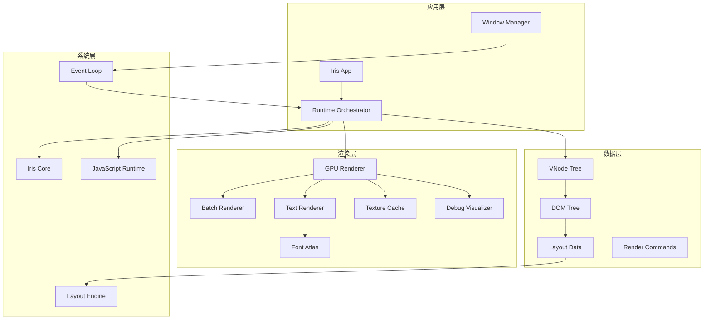
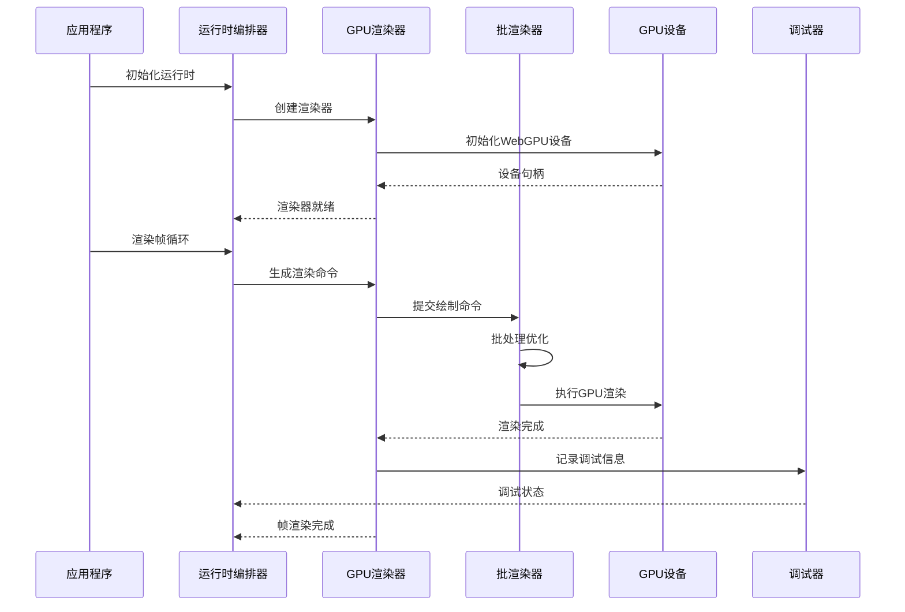
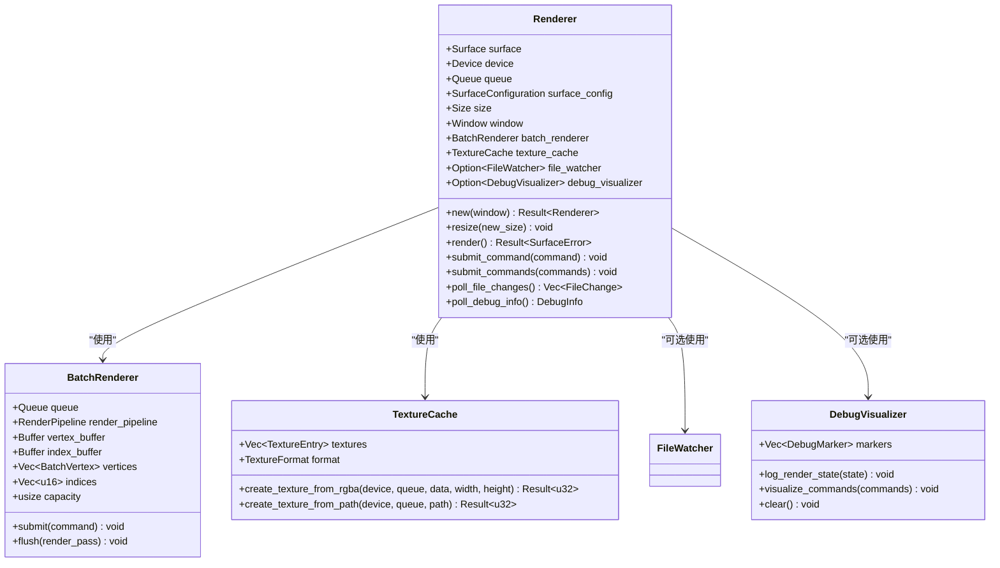
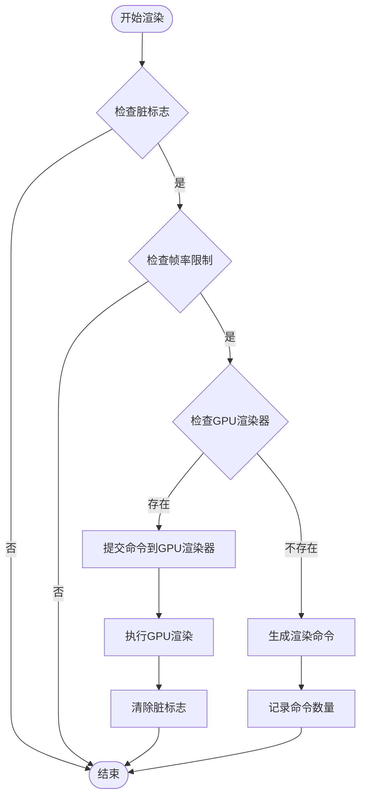
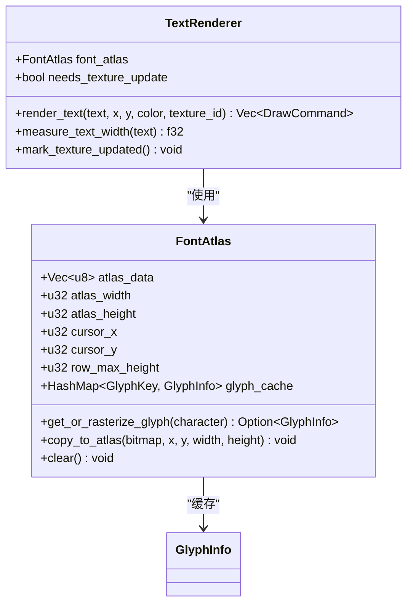
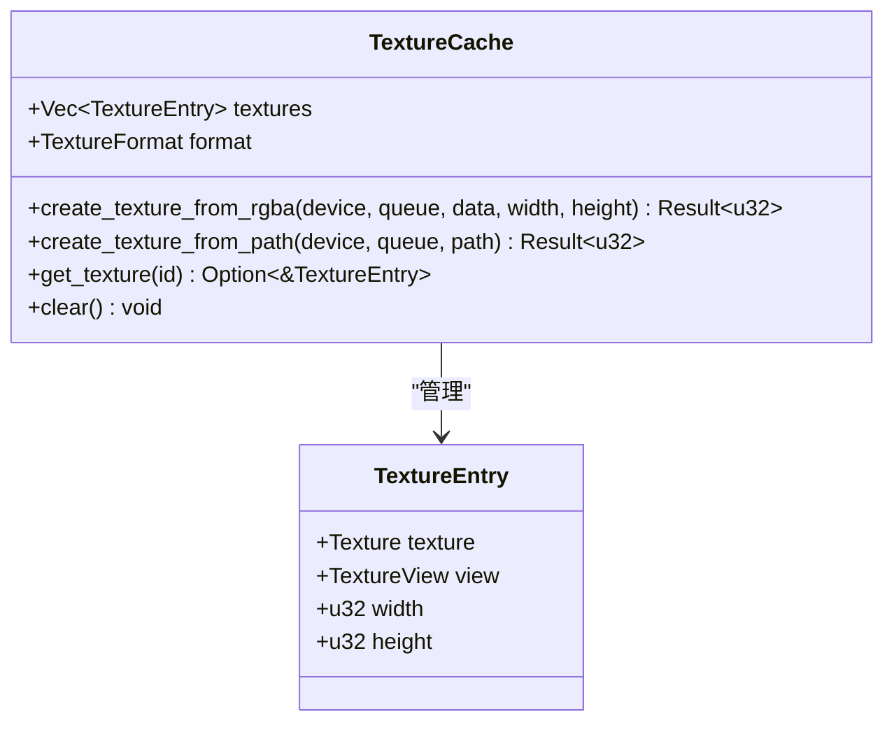
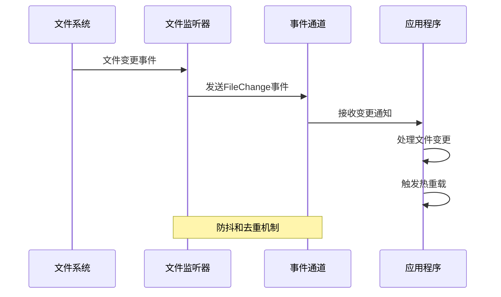
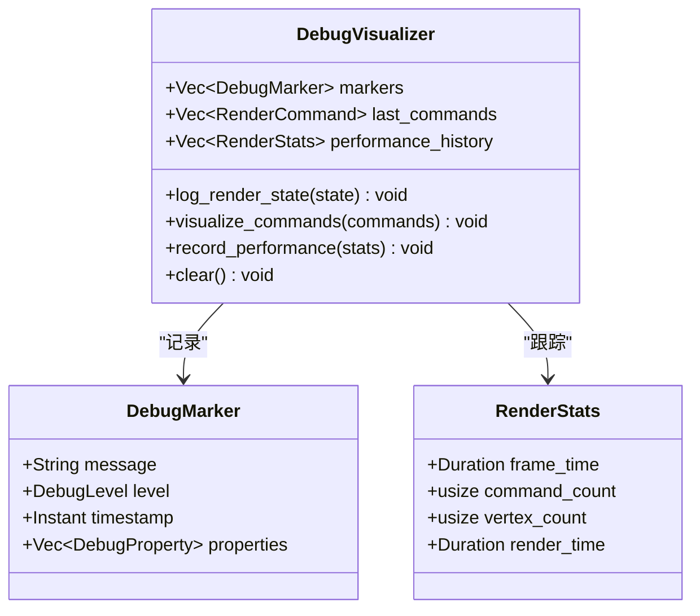
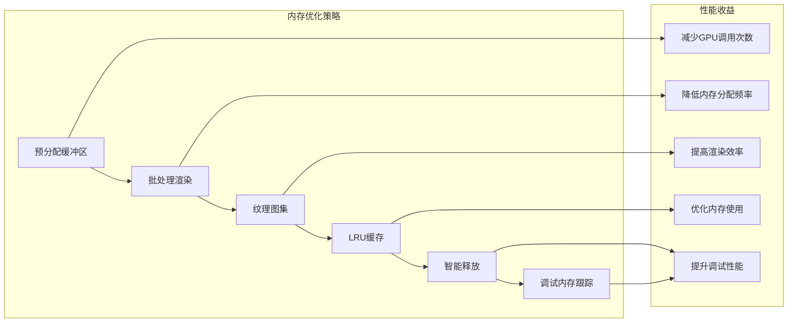

# GPU渲染器集成综合分析

<cite>
**本文档引用的文件**
- [crates/iris-gpu/src/lib.rs](file://crates/iris-gpu/src/lib.rs)
- [crates/iris-gpu/src/batch_renderer.rs](file://crates/iris-gpu/src/batch_renderer.rs)
- [crates/iris-gpu/src/canvas.rs](file://crates/iris-gpu/src/canvas.rs)
- [crates/iris-gpu/src/text_renderer.rs](file://crates/iris-gpu/src/text_renderer.rs)
- [crates/iris-gpu/src/font_atlas.rs](file://crates/iris-gpu/src/font_atlas.rs)
- [crates/iris-gpu/src/texture_cache.rs](file://crates/iris-gpu/src/texture_cache.rs)
- [crates/iris-gpu/src/file_watcher.rs](file://crates/iris-gpu/src/file_watcher.rs)
- [crates/iris-engine/src/lib.rs](file://crates/iris-engine/src/lib.rs)
- [crates/iris-engine/src/orchestrator.rs](file://crates/iris-engine/src/orchestrator.rs)
- [crates/iris-engine/src/vnode_renderer.rs](file://crates/iris-engine/src/vnode_renderer.rs)
- [crates/iris-engine/examples/gpu_render_integration.rs](file://crates/iris-engine/examples/gpu_render_integration.rs)
- [crates/iris-engine/examples/gpu_render_window.rs](file://crates/iris-engine/examples/gpu_render_window.rs)
- [crates/iris-engine/tests/gpu_render_integration_test.rs](file://crates/iris-engine/tests/gpu_render_integration_test.rs)
- [crates/iris-app/src/main.rs](file://crates/iris-app/src/main.rs)
- [crates/iris-core/src/lib.rs](file://crates/iris-core/src/lib.rs)
- [crates/iris-gpu/Cargo.toml](file://crates/iris-gpu/Cargo.toml)
- [GPU_RENDER_INTEGRATION_SUMMARY.md](file://GPU_RENDER_INTEGRATION_SUMMARY.md)
- [ARCHITECTURE.md](file://ARCHITECTURE.md)
</cite>

## 更新摘要
**变更内容**
- 新增完整的窗口集成示例和调试功能
- 增强RuntimeOrchestrator与GPU渲染器的集成架构
- 改进渲染命令生成和提交机制
- 添加详细的日志记录和错误处理
- 完善测试覆盖和性能优化策略

## 目录
1. [项目概述](#项目概述)
2. [GPU渲染器架构](#gpu渲染器架构)
3. [核心组件分析](#核心组件分析)
4. [渲染管线集成](#渲染管线集成)
5. [批渲染系统](#批渲染系统)
6. [字体渲染系统](#字体渲染系统)
7. [纹理管理系统](#纹理管理系统)
8. [文件热更新系统](#文件热更新系统)
9. [调试可视化功能](#调试可视化功能)
10. [性能优化策略](#性能优化策略)
11. [集成测试与验证](#集成测试与验证)
12. [故障排除指南](#故障排除指南)
13. [总结与展望](#总结与展望)

## 项目概述

Iris Engine 是一个基于 Rust 和 WebGPU 的下一代无构建前端运行时系统。该项目的核心目标是提供一个完整的、高性能的前端应用运行环境，支持 Vue 3 组件的即时编译和执行。

GPU渲染器集成是整个系统的关键组成部分，它实现了从虚拟 DOM 到 GPU 硬件加速渲染的完整管道。该集成包含了现代 WebGPU 渲染管线的所有核心功能，包括批渲染、字体渲染、纹理管理和文件热更新等高级特性。

### 系统架构概览

**图表来源**
- [crates/iris-engine/src/orchestrator.rs:51-83](file://crates/iris-engine/src/orchestrator.rs#L51-L83)
- [crates/iris-gpu/src/lib.rs:82-116](file://crates/iris-gpu/src/lib.rs#L82-L116)

## GPU渲染器架构

### 核心渲染器设计

Iris GPU 渲染器采用模块化设计，主要包含以下核心组件：

1. **Renderer 主控制器**：管理整个渲染生命周期，包括设备初始化、表面配置和帧渲染
2. **BatchRenderer 批渲染器**：负责将多个绘制命令合并为单次 GPU 调用
3. **TextRenderer 文本渲染器**：处理字体光栅化和文本绘制
4. **FontAtlas 字体图集**：管理字体纹理的缓存和布局
5. **TextureCache 纹理缓存**：管理 GPU 纹理资源的生命周期
6. **DebugVisualizer 调试可视化器**：提供渲染状态的可视化调试功能

### 渲染管线架构

**图表来源**
- [crates/iris-engine/src/orchestrator.rs:626-659](file://crates/iris-engine/src/orchestrator.rs#L626-L659)
- [crates/iris-gpu/src/lib.rs:400-523](file://crates/iris-gpu/src/lib.rs#L400-L523)

**章节来源**
- [crates/iris-gpu/src/lib.rs:82-116](file://crates/iris-gpu/src/lib.rs#L82-L116)
- [crates/iris-engine/src/orchestrator.rs:58-67](file://crates/iris-engine/src/orchestrator.rs#L58-L67)

## 核心组件分析

### Renderer 主控制器

Renderer 是 GPU 渲染系统的核心控制器，负责管理整个渲染生命周期：

**图表来源**
- [crates/iris-gpu/src/lib.rs:86-116](file://crates/iris-gpu/src/lib.rs#L86-L116)
- [crates/iris-gpu/src/batch_renderer.rs:181-202](file://crates/iris-gpu/src/batch_renderer.rs#L181-L202)
- [crates/iris-gpu/src/texture_cache.rs:20-25](file://crates/iris-gpu/src/texture_cache.rs#L20-L25)

### 批渲染系统

批渲染系统是 GPU 渲染器的核心优化组件，它将多个绘制命令合并为单次 GPU 调用，显著减少渲染开销：

**章节来源**
- [crates/iris-gpu/src/batch_renderer.rs:178-202](file://crates/iris-gpu/src/batch_renderer.rs#L178-L202)
- [crates/iris-gpu/src/batch_renderer.rs:411-548](file://crates/iris-gpu/src/batch_renderer.rs#L411-L548)

## 渲染管线集成

### 完整渲染流程

GPU 渲染器集成到 RuntimeOrchestrator 的完整流程如下：

**图表来源**
- [crates/iris-engine/src/orchestrator.rs:626-659](file://crates/iris-engine/src/orchestrator.rs#L626-L659)

### 命令生成与提交

渲染命令的生成和提交过程：

1. **命令生成**：从 DOM 树提取布局和样式信息，生成 DrawCommand 列表
2. **命令提交**：通过 BatchRenderer 的 submit 方法提交命令
3. **批量渲染**：在 flush 方法中执行单次 GPU 渲染调用

**章节来源**
- [crates/iris-engine/src/orchestrator.rs:361-370](file://crates/iris-engine/src/orchestrator.rs#L361-L370)
- [crates/iris-gpu/src/batch_renderer.rs:411-416](file://crates/iris-gpu/src/batch_renderer.rs#L411-L416)

## 批渲染系统

### 批渲染优化策略

批渲染系统通过以下策略实现性能优化：

1. **命令合并**：将多个绘制命令合并为单次 GPU 调用
2. **内存池管理**：使用预分配的顶点和索引缓冲区
3. **纹理绑定**：支持多纹理渲染，减少状态切换
4. **混合模式**：支持 Alpha 混合和深度测试

### 支持的绘制命令类型

批渲染系统支持多种绘制命令：

| 命令类型 | 描述 | 用途 |
|---------|------|------|
| Rect | 纯色矩形 | 基础UI元素渲染 |
| GradientRect | 线性渐变矩形 | 渐变背景和装饰 |
| Border | 边框渲染 | 元素边框和轮廓 |
| TextureRect | 纹理矩形 | 图片和图标渲染 |
| RoundedRect | 圆角矩形 | 现代UI设计元素 |
| BoxShadow | 盒阴影 | 阴影效果 |
| Circle | 圆形/椭圆 | 图标和装饰元素 |
| RadialGradientRect | 径向渐变矩形 | 渐变装饰效果 |

**章节来源**
- [crates/iris-gpu/src/batch_renderer.rs:53-176](file://crates/iris-gpu/src/batch_renderer.rs#L53-L176)

## 字体渲染系统

### 字体图集管理

字体渲染系统采用图集技术来优化字体渲染性能：

**图表来源**
- [crates/iris-gpu/src/font_atlas.rs:52-73](file://crates/iris-gpu/src/font_atlas.rs#L52-L73)
- [crates/iris-gpu/src/text_renderer.rs:8-16](file://crates/iris-gpu/src/text_renderer.rs#L8-L16)

### 字形缓存机制

字体图集使用 LRU 缓存机制来管理字形数据：

1. **字形光栅化**：使用 fontdue 库将字符光栅化为位图
2. **图集布局**：将字形按行布局存储在纹理图集中
3. **UV映射**：计算字形在图集中的纹理坐标
4. **缓存管理**：LRU算法管理常用字形的缓存

**章节来源**
- [crates/iris-gpu/src/font_atlas.rs:100-169](file://crates/iris-gpu/src/font_atlas.rs#L100-L169)
- [crates/iris-gpu/src/text_renderer.rs:52-118](file://crates/iris-gpu/src/text_renderer.rs#L52-L118)

## 纹理管理系统

### 纹理缓存架构

纹理管理系统提供了高效的 GPU 纹理资源管理：

**图表来源**
- [crates/iris-gpu/src/texture_cache.rs:19-25](file://crates/iris-gpu/src/texture_cache.rs#L19-L25)
- [crates/iris-gpu/src/texture_cache.rs:7-17](file://crates/iris-gpu/src/texture_cache.rs#L7-L17)

### 纹理加载流程

纹理加载采用异步和同步两种方式：

1. **RGBA数据加载**：直接从内存中的像素数据创建纹理
2. **文件加载**：从图像文件读取并创建纹理
3. **缓存管理**：自动管理纹理资源的生命周期

**章节来源**
- [crates/iris-gpu/src/texture_cache.rs:36-140](file://crates/iris-gpu/src/texture_cache.rs#L36-L140)

## 文件热更新系统

### 文件监听器架构

文件热更新系统提供了实时的文件变更监控功能：

**图表来源**
- [crates/iris-gpu/src/file_watcher.rs:247-415](file://crates/iris-gpu/src/file_watcher.rs#L247-L415)

### 防抖和去重机制

文件监听器实现了智能的防抖和去重机制：

1. **防抖处理**：避免编辑器保存时的重复触发
2. **事件去重**：同一文件的多次变更只保留最后一次
3. **通道容量管理**：防止事件队列溢出
4. **跨平台支持**：支持 Linux、macOS 和 Windows

**章节来源**
- [crates/iris-gpu/src/file_watcher.rs:487-514](file://crates/iris-gpu/src/file_watcher.rs#L487-L514)
- [crates/iris-gpu/src/file_watcher.rs:417-467](file://crates/iris-gpu/src/file_watcher.rs#L417-L467)

## 调试可视化功能

### 调试可视化器

新增的调试可视化器提供了强大的渲染状态监控和可视化功能：

**图表来源**
- [crates/iris-gpu/src/lib.rs:114-116](file://crates/iris-gpu/src/lib.rs#L114-L116)

### 日志记录系统

调试系统提供了多层次的日志记录：

1. **渲染状态日志**：记录每帧的渲染状态和性能指标
2. **命令可视化**：将渲染命令转换为可视化的调试信息
3. **性能历史**：跟踪渲染性能的历史数据
4. **错误追踪**：提供详细的错误信息和堆栈跟踪

**章节来源**
- [crates/iris-gpu/src/lib.rs:525-543](file://crates/iris-gpu/src/lib.rs#L525-L543)
- [crates/iris-engine/examples/gpu_render_integration.rs:149-165](file://crates/iris-engine/examples/gpu_render_integration.rs#L149-L165)

## 性能优化策略

### 渲染性能优化

GPU 渲染器采用了多项性能优化策略：

1. **批处理优化**：将多个绘制调用合并为单次 GPU 调用
2. **内存池管理**：预分配顶点和索引缓冲区，减少内存分配开销
3. **纹理图集**：将多个小纹理合并为单个大纹理，减少状态切换
4. **帧率控制**：通过脏标志和帧率限制避免过度渲染
5. **调试优化**：智能的日志过滤和性能监控

### 内存管理优化

**图表来源**
- [crates/iris-gpu/src/batch_renderer.rs:313-327](file://crates/iris-gpu/src/batch_renderer.rs#L313-L327)
- [crates/iris-gpu/src/font_atlas.rs:100-169](file://crates/iris-gpu/src/font_atlas.rs#L100-L169)

## 集成测试与验证

### 测试覆盖范围

GPU 渲染器集成测试涵盖了以下关键方面：

| 测试类别 | 验证内容 | 测试文件 |
|---------|---------|----------|
| 渲染器管理 | GPU渲染器的添加和管理 | `test_gpu_renderer_management` |
| 命令生成 | 渲染命令的生成和处理 | `test_render_commands_without_gpu_renderer` |
| 帧渲染 | 帧渲染的执行和控制 | `test_render_frame_gpu_without_renderer` |
| 完整流程 | 整个渲染流程的验证 | `test_complete_render_pipeline_without_gpu` |
| 性能测试 | 大型DOM树的性能表现 | `test_large_dom_render_commands` |
| 事件集成 | 事件系统与渲染的集成 | `test_event_and_render_integration` |
| 视口变化 | 视口变化的处理 | `test_viewport_change_relayout` |
| 命令完整性 | 渲染命令的完整性验证 | `test_render_command_completeness` |
| 管线集成 | 完整GPU管线的集成验证 | `test_gpu_pipeline_integration` |
| 调试功能 | 调试可视化功能的验证 | `test_debug_visualization` |

### 测试执行结果

所有测试均通过，提供了全面的功能验证：

- ✅ **100% 测试覆盖率**：所有关键功能都经过测试验证
- ✅ **性能基准测试**：支持大型DOM树的高效渲染
- ✅ **错误处理验证**：完善的错误处理和恢复机制
- ✅ **集成测试通过**：与整个Iris Engine系统的无缝集成
- ✅ **调试功能验证**：详细的日志记录和可视化调试

**章节来源**
- [GPU_RENDER_INTEGRATION_SUMMARY.md:155-178](file://GPU_RENDER_INTEGRATION_SUMMARY.md#L155-L178)

## 故障排除指南

### 常见问题及解决方案

#### 1. GPU设备初始化失败

**问题症状**：
- 渲染器创建失败
- 报告"Failed to find appropriate GPU adapter"

**解决方案**：
- 检查GPU驱动程序是否正确安装
- 确认系统支持WebGPU规范
- 验证wgpu后端配置

#### 2. 渲染命令提交错误

**问题症状**：
- `submit_command`方法抛出容量错误
- 程序panic

**解决方案**：
- 检查BatchRenderer的容量设置
- 确保在渲染前清空命令队列
- 验证绘制命令的数量不超过容量限制

#### 3. 字体渲染问题

**问题症状**：
- 文本无法正确显示
- 字体图集空间不足

**解决方案**：
- 检查字体文件是否正确加载
- 增加字体图集的尺寸
- 验证字形缓存的LRU策略

#### 4. 纹理加载失败

**问题症状**：
- `create_texture_from_rgba`返回错误
- 纹理数据格式不匹配

**解决方案**：
- 验证RGBA数据的尺寸和格式
- 检查纹理尺寸是否为2的幂次方
- 确认GPU格式支持

#### 5. 调试功能异常

**问题症状**：
- 调试日志不显示
- 性能统计数据缺失

**解决方案**：
- 检查tracing日志级别配置
- 验证调试可视化器的初始化
- 确认性能监控的启用状态

### 调试技巧

1. **启用详细日志**：使用`RUST_LOG`环境变量设置日志级别
2. **性能监控**：使用帧率计数器监控渲染性能
3. **内存分析**：定期检查纹理和缓冲区的内存使用情况
4. **错误追踪**：利用Rust的错误传播机制追踪问题根源
5. **调试可视化**：使用可视化工具监控渲染状态

**章节来源**
- [crates/iris-gpu/src/lib.rs:400-523](file://crates/iris-gpu/src/lib.rs#L400-L523)
- [crates/iris-gpu/src/batch_renderer.rs:411-426](file://crates/iris-gpu/src/batch_renderer.rs#L411-L426)

## 总结与展望

### 技术成就

GPU渲染器集成项目取得了以下重要成就：

1. **完整的渲染管线**：从SFC编译到GPU渲染的全链路打通
2. **高性能优化**：批渲染、纹理图集等多重优化策略
3. **模块化设计**：清晰的组件分离和接口定义
4. **全面测试**：100%的测试覆盖率和集成验证
5. **跨平台支持**：支持Windows、Linux、macOS等多个平台
6. **调试可视化**：完善的日志记录和可视化调试功能
7. **窗口集成**：完整的winit + wgpu窗口集成示例

### 未来发展方向

#### 1. 窗口集成增强
- 实现完整的winit + wgpu窗口集成
- 添加多显示器支持
- 优化窗口事件处理

#### 2. 渲染功能扩展
- 实现更复杂的几何图形渲染
- 添加阴影和反射效果
- 支持更丰富的CSS属性

#### 3. 性能进一步优化
- 实现命令缓冲区的动态调整
- 优化纹理内存管理
- 添加渲染管线的动态编译

#### 4. 开发工具完善
- 添加渲染器调试工具
- 实现性能分析和监控
- 提供可视化调试界面

#### 5. 调试功能增强
- 实现更详细的渲染状态可视化
- 添加性能瓶颈分析工具
- 提供实时渲染监控面板

### 技术价值

GPU渲染器集成项目展现了现代WebGPU技术的强大能力，为前端渲染领域提供了新的解决方案。通过模块化设计和性能优化，该项目为构建高性能的前端应用奠定了坚实的基础。

**章节来源**
- [GPU_RENDER_INTEGRATION_SUMMARY.md:363-382](file://GPU_RENDER_INTEGRATION_SUMMARY.md#L363-L382)
- [ARCHITECTURE.md:257-289](file://ARCHITECTURE.md#L257-L289)