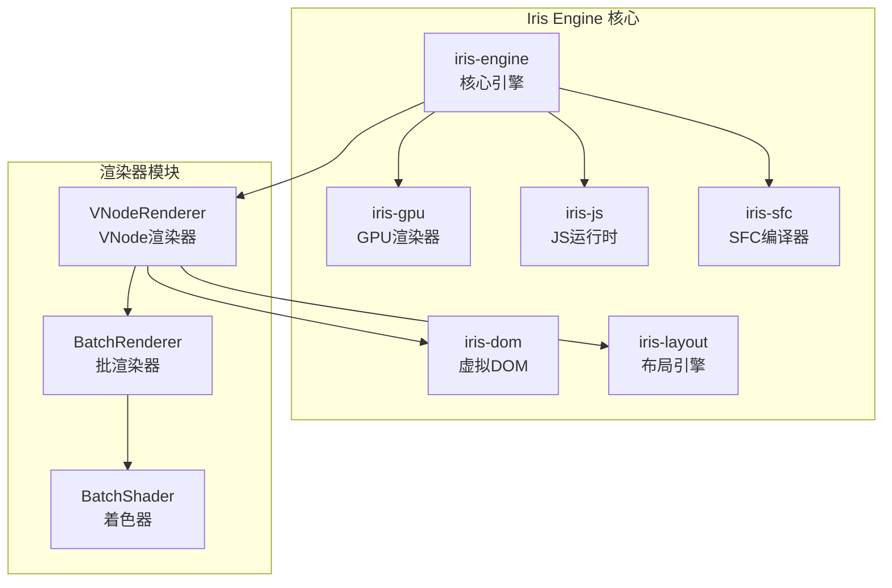
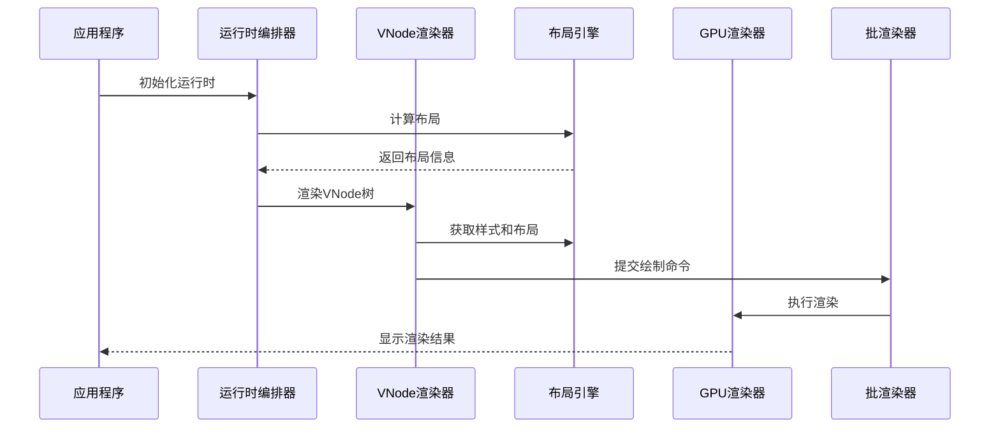
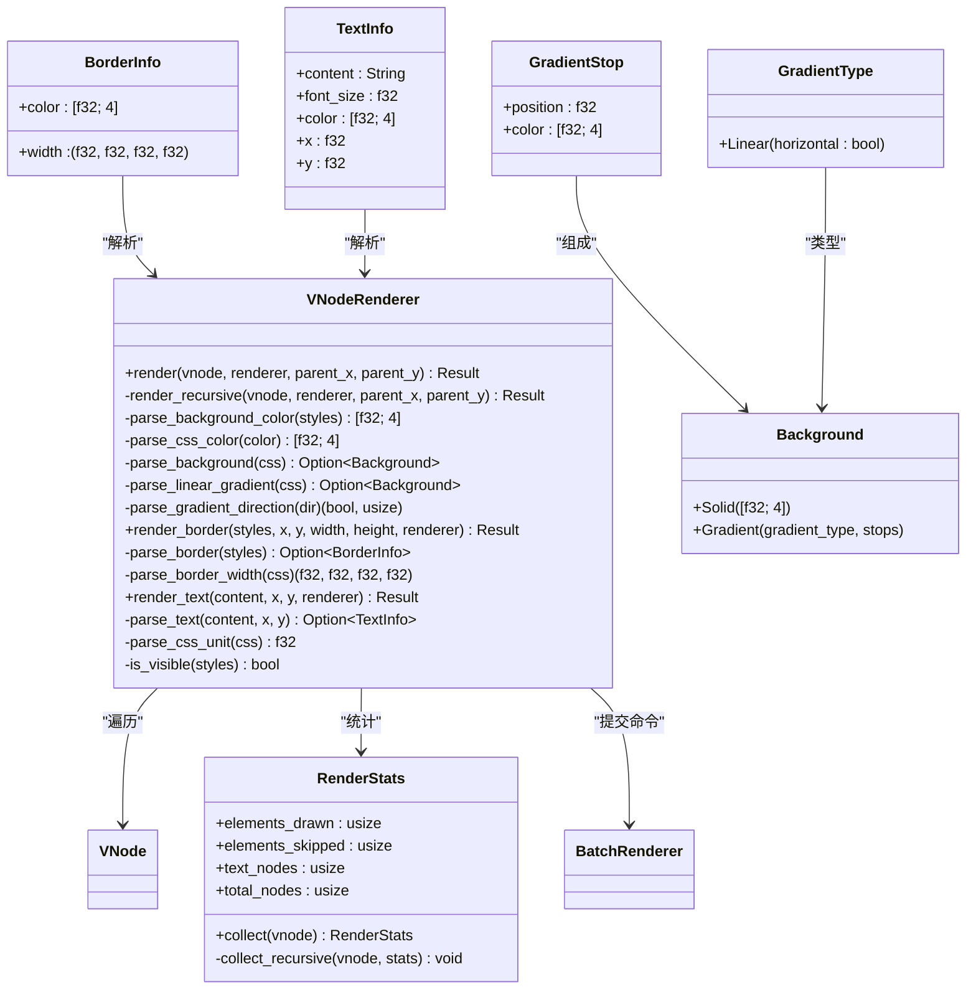
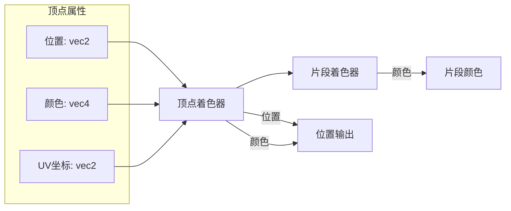
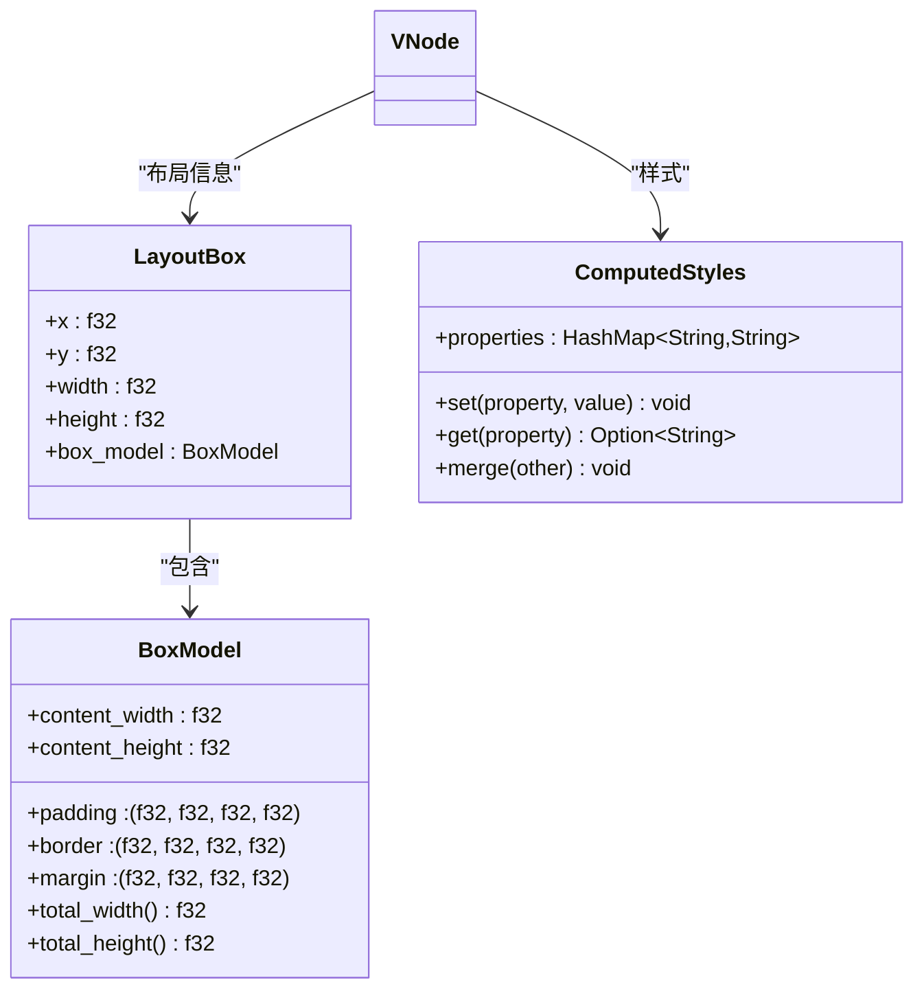
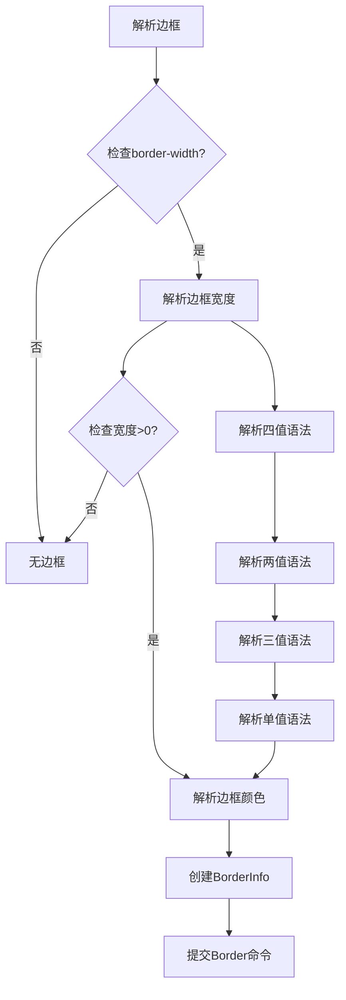
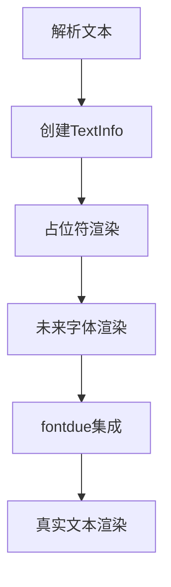
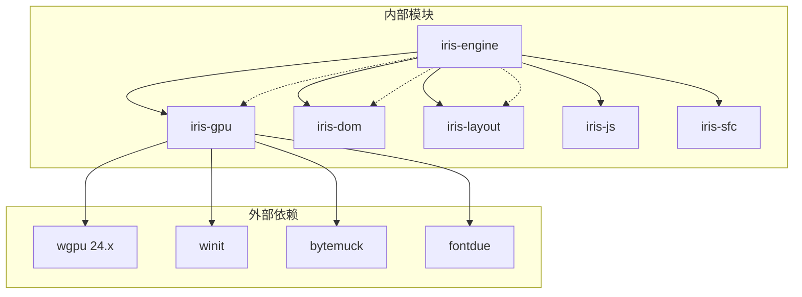
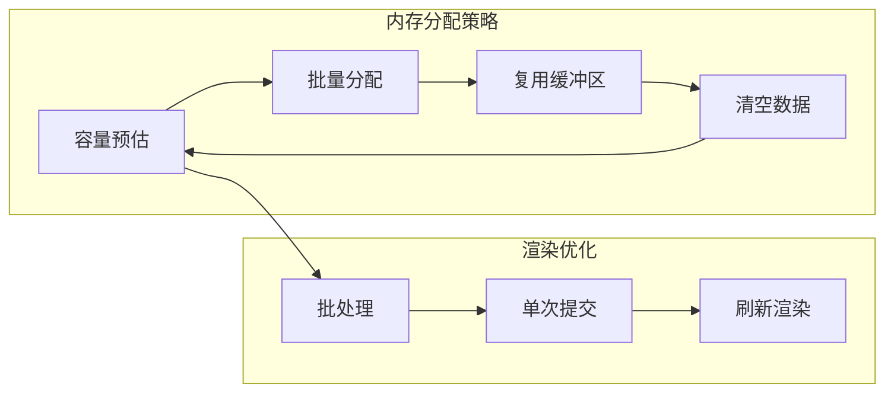

# VNode GPU渲染器模块

<cite>
**本文档引用的文件**
- [lib.rs](file://crates/iris/src/lib.rs)
- [vnode_renderer.rs](file://crates/iris/src/vnode_renderer.rs)
- [orchestrator.rs](file://crates/iris/src/orchestrator.rs)
- [batch_renderer.rs](file://crates/iris-gpu/src/batch_renderer.rs)
- [lib.rs](file://crates/iris-gpu/src/lib.rs)
- [batch_shader.wgsl](file://crates/iris-gpu/src/batch_shader.wgsl)
- [vnode.rs](file://crates/iris-dom/src/vnode.rs)
- [layout.rs](file://crates/iris-layout/src/layout.rs)
- [style.rs](file://crates/iris-layout/src/style.rs)
- [Cargo.toml](file://Cargo.toml)
- [Cargo.toml](file://crates/iris/Cargo.toml)
- [minimal_demo.rs](file://crates/iris-app/examples/demo/minimal_demo.rs)
- [file_watcher_integration.rs](file://crates/iris-gpu/tests/file_watcher_integration.rs)
</cite>

## 更新摘要
**变更内容**
- 实现完整的CSS边框属性解析系统（BorderInfo结构体）
- 新增TextInfo结构体，为新的文本渲染基础做准备
- 新增Border绘制命令，支持四边独立宽度和颜色
- 更新文本渲染方法，从占位符方法过渡到新的TextInfo基础
- 增强边框渲染功能，支持border-width、border-color、border简写属性

## 目录
1. [简介](#简介)
2. [项目结构](#项目结构)
3. [核心组件](#核心组件)
4. [架构概览](#架构概览)
5. [详细组件分析](#详细组件分析)
6. [依赖关系分析](#依赖关系分析)
7. [性能考量](#性能考量)
8. [故障排除指南](#故障排除指南)
9. [结论](#结论)

## 简介

VNode GPU渲染器模块是Iris引擎中的关键组件，负责将虚拟DOM树转换为GPU绘制命令，实现高效的2D图形渲染。该模块采用批渲染技术，通过WebGPU硬件加速实现高性能的UI渲染。

Iris引擎是一个基于Rust和WebGPU的下一代无构建前端运行时，支持Vue 3框架，无需传统构建工具即可运行现代Web应用。该渲染器模块作为引擎的第五阶段实现，提供了完整的虚拟DOM到GPU渲染的适配层，现已支持纯色背景、线性渐变背景、边框渲染和基础文本渲染。

## 项目结构

Iris引擎采用多crate的模块化架构，VNode GPU渲染器模块位于核心引擎crate中，与其他子系统协同工作：



**图表来源**
- [lib.rs:1-78](file://crates/iris/src/lib.rs#L1-L78)
- [Cargo.toml:1-31](file://Cargo.toml#L1-L31)

**章节来源**
- [lib.rs:1-78](file://crates/iris/src/lib.rs#L1-L78)
- [Cargo.toml:1-31](file://Cargo.toml#L1-L31)

## 核心组件

### VNodeRenderer - VNode渲染器

VNodeRenderer是渲染器模块的核心组件，负责将虚拟DOM树转换为GPU绘制命令。它实现了递归遍历VNode树并将可见元素转换为DrawCommand的过程。

**更新** 新增了完整的边框属性解析系统和新的文本渲染基础

主要功能特性：
- 递归遍历VNode树
- 处理不同类型的VNode节点（元素、文本、注释、Fragment）
- 解析CSS样式并提取背景颜色（支持纯色和线性渐变）
- **新增** 解析CSS边框属性，支持四边独立宽度和颜色
- **新增** TextInfo结构体，为未来的字体渲染做准备
- 计算元素的绝对位置和尺寸
- 跳过不可见元素的渲染
- 支持边框渲染，包括四边独立宽度和颜色

### BatchRenderer - 批渲染器

BatchRenderer是GPU渲染器的核心，负责管理顶点缓冲区、索引缓冲区和渲染管线，实现高效的批处理渲染。

**更新** 新增了Border绘制命令支持

关键特性：
- 支持纯色矩形、线性渐变矩形和边框渲染
- 支持水平和垂直线性渐变
- Alpha混合支持
- 动态顶点缓冲区管理
- 单次draw call提交多个矩形
- **新增** 边框渲染功能，支持四边独立宽度

### DrawCommand - 绘制命令

**更新** 新增了Border绘制命令

定义了渲染器支持的绘制命令类型：
- Rect：纯色矩形绘制
- GradientRect：线性渐变矩形绘制（支持水平和垂直渐变）
- **新增** Border：边框绘制（支持四边独立宽度）

### 数据结构系统

**更新** 新增了边框和文本渲染的核心数据结构

- **新增** BorderInfo：边框信息，包含四边宽度和颜色
- **新增** TextInfo：文本信息，包含内容、字体大小、颜色和位置
- GradientStop：渐变停止点，包含位置和颜色信息
- GradientType：渐变类型枚举，目前支持Linear（线性渐变）
- Background：背景类型枚举，支持Solid（纯色）和Gradient（渐变）

**章节来源**
- [vnode_renderer.rs:35-50](file://crates/iris/src/vnode_renderer.rs#L35-L50)
- [batch_renderer.rs:86-101](file://crates/iris-gpu/src/batch_renderer.rs#L86-L101)

## 架构概览

VNode GPU渲染器模块的架构设计体现了清晰的分层结构：



**图表来源**
- [orchestrator.rs:65-156](file://crates/iris/src/orchestrator.rs#L65-L156)
- [vnode_renderer.rs:34-111](file://crates/iris/src/vnode_renderer.rs#L34-L111)

## 详细组件分析

### VNodeRenderer实现分析

VNodeRenderer采用了模式匹配和递归遍历的设计模式：



**图表来源**
- [vnode_renderer.rs:35-50](file://crates/iris/src/vnode_renderer.rs#L35-L50)
- [vnode_renderer.rs:285-307](file://crates/iris/src/vnode_renderer.rs#L285-L307)
- [vnode_renderer.rs:395-406](file://crates/iris/src/vnode_renderer.rs#L395-L406)

#### 渲染流程分析

VNodeRenderer的渲染过程遵循以下步骤：

1. **节点类型判断**：根据VNode枚举类型进行分支处理
2. **布局信息检查**：只有具有布局信息的元素才会被渲染
3. **样式解析**：提取背景颜色等渲染属性（支持纯色和线性渐变）
4. ****新增** 边框解析**：解析border-width、border-color等CSS属性
5. **命令提交**：将绘制命令提交给批渲染器
6. **递归处理**：对子节点进行同样的处理

**更新** 新增了边框解析和新的文本渲染基础

**章节来源**
- [vnode_renderer.rs:93-144](file://crates/iris/src/vnode_renderer.rs#L93-L144)

### BatchRenderer实现分析

BatchRenderer实现了高效的批处理渲染机制：


**图表来源**
- [batch_renderer.rs:201-427](file://crates/iris-gpu/src/batch_renderer.rs#L201-L427)

#### 着色器实现分析

批渲染器使用WGSL着色器实现：



**图表来源**
- [batch_shader.wgsl:1-26](file://crates/iris-gpu/src/batch_shader.wgsl#L1-L26)

**章节来源**
- [batch_renderer.rs:86-427](file://crates/iris-gpu/src/batch_renderer.rs#L86-L427)
- [batch_shader.wgsl:1-26](file://crates/iris-gpu/src/batch_shader.wgsl#L1-L26)

### 数据结构设计

#### VNode数据结构

VNode采用枚举类型设计，支持多种节点类型：

```mermaid
erDiagram
VNode {
string tag
map<string,string> attrs
vector<VNode> children
ComputedStyles styles
LayoutBox layout
string content
vector<VNode> fragment_children
}
ComputedStyles ||--o{ VNode : "样式"
LayoutBox ||--o{ VNode : "布局"
VNode ||--o{ VNode : "父子关系"
```

**图表来源**
- [vnode.rs:13-43](file://crates/iris-dom/src/vnode.rs#L13-L43)

#### 布局系统设计

布局系统实现了盒模型和基础布局算法：



**图表来源**
- [layout.rs:8-99](file://crates/iris-layout/src/layout.rs#L8-L99)
- [style.rs:9-51](file://crates/iris-layout/src/style.rs#L9-L51)

**章节来源**
- [vnode.rs:13-211](file://crates/iris-dom/src/vnode.rs#L13-L211)
- [layout.rs:8-99](file://crates/iris-layout/src/layout.rs#L8-L99)
- [style.rs:9-51](file://crates/iris-layout/src/style.rs#L9-L51)

### 边框系统详细分析

**新增** 边框系统提供了完整的CSS边框属性解析支持



**图表来源**
- [vnode_renderer.rs:285-307](file://crates/iris/src/vnode_renderer.rs#L285-L307)

#### 边框解析流程

1. **CSS边框属性解析**：支持border-width、border-color、border简写
2. **宽度解析**：支持"1px 2px 1px 2px"或"2px"等多种语法
3. **颜色解析**：支持rgba()格式和常用CSS命名颜色
4. **四边独立控制**：支持上、右、下、左四边独立宽度
5. **边框渲染**：将边框转换为四个矩形区域

**章节来源**
- [vnode_renderer.rs:285-342](file://crates/iris/src/vnode_renderer.rs#L285-L342)

### 文本渲染系统分析

**更新** 文本渲染系统从占位符方法过渡到新的TextInfo基础



**图表来源**
- [vnode_renderer.rs:395-406](file://crates/iris/src/vnode_renderer.rs#L395-L406)

#### 文本渲染流程

1. **TextInfo创建**：解析文本内容、字体大小、颜色和位置
2. **占位符渲染**：当前使用半透明矩形作为文本占位符
3. **尺寸计算**：基于字符长度和字体大小计算占位符尺寸
4. **颜色处理**：使用文本颜色的半透明版本
5. **未来集成**：为fontdue字体渲染做准备

**章节来源**
- [vnode_renderer.rs:351-406](file://crates/iris/src/vnode_renderer.rs#L351-L406)

## 依赖关系分析

### 模块间依赖关系



**图表来源**
- [Cargo.toml:13-31](file://Cargo.toml#L13-L31)
- [Cargo.toml:13-21](file://crates/iris/Cargo.toml#L13-L21)

### 关键依赖分析

VNode GPU渲染器模块的关键依赖包括：

1. **iris-dom**：提供VNode数据结构和DOM抽象
2. **iris-layout**：提供布局计算和样式解析
3. **iris-gpu**：提供GPU渲染基础设施
4. **wgpu**：WebGPU图形API封装
5. **bytemuck**：零拷贝数据转换
6. **fontdue**：字体渲染库（未来集成）

**章节来源**
- [Cargo.toml:13-31](file://Cargo.toml#L13-L31)
- [vnode_renderer.rs:5-7](file://crates/iris/src/vnode_renderer.rs#L5-L7)

## 性能考量

### 批渲染优化

VNode GPU渲染器模块采用了多项性能优化策略：

1. **批处理渲染**：将多个绘制命令合并为单次GPU调用
2. **动态缓冲区管理**：根据渲染需求动态调整缓冲区大小
3. **内存对齐优化**：使用bytemuck确保数据结构内存对齐
4. **GPU原生数据格式**：直接使用GPU支持的数据格式减少转换开销
5. ****新增** 边框优化**：边框渲染通过四个独立矩形实现，避免复杂的几何计算

### 内存管理策略



### 性能监控

渲染器提供了统计信息收集功能，帮助开发者监控渲染性能：

- 元素绘制计数
- 跳过元素计数  
- 文本节点计数
- 总节点计数

**章节来源**
- [batch_renderer.rs:421-427](file://crates/iris-gpu/src/batch_renderer.rs#L421-L427)
- [vnode_renderer.rs:396-449](file://crates/iris/src/vnode_renderer.rs#L396-L449)

## 故障排除指南

### 常见问题及解决方案

#### 渲染器初始化失败

**问题症状**：GPU渲染器无法初始化
**可能原因**：
- 缺少合适的GPU适配器
- WebGPU后端不兼容
- 设备权限问题

**解决方案**：
1. 检查系统GPU驱动
2. 确认WebGPU支持状态
3. 降级后端兼容性设置

#### VNode渲染异常

**问题症状**：元素不按预期渲染
**可能原因**：
- 布局信息缺失
- 样式解析错误
- 坐标计算问题

**解决方案**：
1. 验证布局计算结果
2. 检查CSS样式解析
3. 调试坐标变换逻辑

#### 边框渲染问题

**问题症状**：边框显示不正确
**可能原因**：
- CSS边框语法错误
- 边框宽度解析失败
- 边框颜色解析错误

**解决方案**：
1. 验证border-width语法（支持1-4个值）
2. 检查border-color格式
3. 确认边框简写属性的正确使用

#### 文本渲染问题

**问题症状**：文本显示为占位符而非实际文字
**可能原因**：
- fontdue库未正确集成
- 文本样式解析不完整
- 字体渲染配置问题

**解决方案**：
1. 确认fontdue依赖已正确添加
2. 检查TextInfo结构体的完整实现
3. 验证字体渲染管线的正确配置

#### 性能问题

**问题症状**：渲染帧率低
**可能原因**：
- 批处理容量不足
- 缓冲区频繁重建
- 过多的绘制调用

**解决方案**：
1. 增加批处理容量
2. 优化缓冲区复用
3. 减少不必要的渲染

**章节来源**
- [vnode_renderer.rs:451-730](file://crates/iris/src/vnode_renderer.rs#L451-L730)
- [batch_renderer.rs:216-231](file://crates/iris-gpu/src/batch_renderer.rs#L216-L231)

## 结论

VNode GPU渲染器模块是Iris引擎中实现高性能2D渲染的关键组件。通过采用批渲染技术和WebGPU硬件加速，该模块实现了高效的虚拟DOM到GPU渲染的转换。

**更新** 模块现已支持完整的CSS边框属性解析系统和新的文本渲染基础，显著提升了渲染能力和扩展性。

模块的主要优势包括：
- **高性能渲染**：通过批处理和GPU加速实现流畅的UI渲染
- **渐变支持**：完整的CSS线性渐变解析和渲染支持
- **边框系统**：完整的CSS边框属性解析，支持四边独立控制
- **文本基础**：为未来的字体渲染提供基础架构
- **颜色丰富**：支持rgba()格式和常用CSS命名颜色
- **模块化设计**：清晰的分层架构便于维护和扩展
- **内存优化**：智能的缓冲区管理和数据对齐优化
- **可扩展性**：支持多种绘制命令和渐变效果

未来的发展方向包括：
- 完善字体渲染支持（fontdue集成）
- 增强事件处理系统
- 优化内存使用效率
- 扩展图形效果支持
- 支持更多CSS属性
- 实现更精确的文本测量和布局

该模块为Iris引擎提供了坚实的渲染基础，为构建现代Web应用提供了强大的技术支持。