# VNode GPU渲染器模块

<cite>
**本文档引用的文件**
- [vnode_renderer.rs](file://crates/iris-engine/src/vnode_renderer.rs)
- [batch_renderer.rs](file://crates/iris-gpu/src/batch_renderer.rs)
- [lib.rs](file://crates/iris-gpu/src/lib.rs)
- [orchestrator.rs](file://crates/iris-engine/src/orchestrator.rs)
- [gpu_render_integration.rs](file://crates/iris-engine/examples/gpu_render_integration.rs)
- [gpu_render_integration_test.rs](file://crates/iris-engine/tests/gpu_render_integration_test.rs)
- [GPU_RENDER_INTEGRATION_SUMMARY.md](file://GPU_RENDER_INTEGRATION_SUMMARY.md)
- [canvas.rs](file://crates/iris-gpu/src/canvas.rs)
- [text_renderer.rs](file://crates/iris-gpu/src/text_renderer.rs)
- [gpu_texture_rendering.rs](file://crates/iris-gpu/tests/gpu_texture_rendering.rs)
- [vnode.rs](file://crates/iris-dom/src/vnode.rs)
- [layout.rs](file://crates/iris-layout/src/layout.rs)
- [style.rs](file://crates/iris-layout/src/style.rs)
- [Cargo.toml](file://Cargo.toml)
- [Cargo.toml](file://crates/iris/Cargo.toml)
- [minimal_demo.rs](file://crates/iris-app/examples/demo/minimal_demo.rs)
- [file_watcher_integration.rs](file://crates/iris-gpu/tests/file_watcher_integration.rs)
- [mod.rs](file://crates/iris/src/animation_engine/mod.rs)
- [easing.rs](file://crates/iris/src/animation_engine/easing.rs)
- [applier.rs](file://crates/iris/src/animation_engine/applier.rs)
- [keyframes.rs](file://crates/iris/src/animation_engine/keyframes.rs)
- [transform.rs](file://crates/iris/src/animation_engine/transform.rs)
- [dirty_rect_manager.rs](file://crates/iris/src/dirty_rect_manager.rs)
</cite>

## 更新摘要
**变更内容**
- 新增完整的GPU渲染器集成，实现从VNode到GPU渲染的完整管道
- VNode渲染器现在直接生成DrawCommand，与批渲染器深度集成
- RuntimeOrchestrator完全支持GPU渲染器，提供可选的渲染器管理
- 新增渲染命令生成和批渲染器集成的详细分析
- 增强了渲染架构，支持零拷贝命令传递和帧率控制
- 新增完整的集成测试和示例代码

## 目录
1. [简介](#简介)
2. [项目结构](#项目结构)
3. [核心组件](#核心组件)
4. [架构概览](#架构概览)
5. [详细组件分析](#详细组件分析)
6. [GPU渲染器集成](#gpu渲染器集成)
7. [渲染命令生成](#渲染命令生成)
8. [批渲染器集成](#批渲染器集成)
9. [RuntimeOrchestrator集成](#runtimeorchestrator集成)
10. [动画系统详解](#动画系统详解)
11. [脏矩形管理器](#脏矩形管理器)
12. [依赖关系分析](#依赖关系分析)
13. [性能考量](#性能考量)
14. [故障排除指南](#故障排除指南)
15. [结论](#结论)

## 简介

VNode GPU渲染器模块是Iris引擎中的关键组件，负责将虚拟DOM树转换为GPU绘制命令，实现高效的2D图形渲染。该模块采用批渲染技术，通过WebGPU硬件加速实现高性能的UI渲染。

**重要更新**：模块现已完成与GPU渲染器的完整集成，成为渲染管线中的核心桥梁，实现了从虚拟DOM到GPU渲染的无缝转换。该模块不仅负责渲染命令的生成，还与批渲染器深度集成，提供零拷贝的命令传递和帧率控制优化。

Iris引擎是一个基于Rust和WebGPU的下一代无构建前端运行时，支持Vue 3框架，无需传统构建工具即可运行现代Web应用。该渲染器模块作为引擎的第五阶段实现，提供了完整的虚拟DOM到GPU渲染的适配层，现已支持纯色背景、线性渐变背景、边框渲染、基础文本渲染以及完整的CSS风格动画系统。

## 项目结构

Iris引擎采用多crate的模块化架构，VNode GPU渲染器模块位于核心引擎crate中，与其他子系统协同工作：

```mermaid
graph TB
subgraph "Iris Engine 核心"
IRIS[iris-engine<br/>核心引擎]
GPU[iris-gpu<br/>GPU渲染器]
DOM[iris-dom<br/>虚拟DOM]
LAYOUT[iris-layout<br/>布局引擎]
JS[iris-js<br/>JS运行时]
SFC[iris-sfc<br/>SFC编译器]
END
subgraph "渲染器模块"
VNDR[VNodeRenderer<br/>VNode渲染器]
BATCH[BatchRenderer<br/>批渲染器]
SHADER[BatchShader<br/>着色器]
ORCH[RuntimeOrchestrator<br/>运行时编排器]
ANIM[AnimationEngine<br/>动画引擎]
DIRTY[DirtyRectManager<br/>脏矩形管理器]
END
subgraph "GPU渲染器子模块"
RENDERER[Renderer<br/>GPU渲染器]
CANVAS[Canvas2DContext<br/>Canvas上下文]
TEXT[TextRenderer<br/>文本渲染器]
END
IRIS --> VNDR
VNDR --> BATCH
BATCH --> SHADER
VNDR --> ORCH
ORCH --> RENDERER
RENDERER --> BATCH
VNDR --> DOM
VNDR --> LAYOUT
VNDR --> ANIM
VNDR --> DIRTY
ANIM --> CANVAS
ANIM --> TEXT
IRIS --> GPU
IRIS --> JS
IRIS --> SFC
```

**图表来源**
- [lib.rs:1-92](file://crates/iris/src/lib.rs#L1-L92)
- [Cargo.toml:1-31](file://Cargo.toml#L1-L31)
- [mod.rs:1-24](file://crates/iris/src/animation_engine/mod.rs#L1-L24)
- [GPU_RENDER_INTEGRATION_SUMMARY.md:10-32](file://GPU_RENDER_INTEGRATION_SUMMARY.md#L10-L32)

## 核心组件

### VNodeRenderer - VNode渲染器

VNodeRenderer是渲染器模块的核心组件，负责将虚拟DOM树转换为GPU绘制命令。它实现了递归遍历VNode树并将可见元素转换为DrawCommand的过程。

**重要更新**：渲染架构已简化，移除了复杂的RenderLayer层级管理，现在采用更直接的渲染流程，并直接生成GPU渲染所需的DrawCommand。

主要功能特性：
- 递归遍历VNode树
- 处理不同类型的VNode节点（元素、文本、注释、Fragment）
- 解析CSS样式并提取背景颜色（支持纯色和线性渐变）
- 解析CSS边框属性，支持四边独立宽度和颜色
- **新增** 直接生成DrawCommand，与批渲染器深度集成
- **新增** 支持零拷贝命令传递，避免数据复制
- **新增** 动画状态管理，支持线性、ease、ease-in、ease-out、ease-in-out缓动函数
- 计算元素的绝对位置和尺寸
- 跳过不可见元素的渲染
- 支持边框渲染，包括四边独立宽度和颜色
- **新增** 动画帧更新处理

### BatchRenderer - 批渲染器

BatchRenderer是GPU渲染器的核心，负责管理顶点缓冲区、索引缓冲区和渲染管线，实现高效的批处理渲染。

**保持原有功能**：支持所有绘制命令类型

关键特性：
- 支持纯色矩形、线性渐变矩形和边框渲染
- 支持水平和垂直线性渐变
- Alpha混合支持
- 动态顶点缓冲区管理
- 单次draw call提交多个矩形
- **新增** 边框渲染功能，支持四边独立宽度
- **新增** 纹理矩形渲染支持
- **新增** 圆角矩形、阴影、圆形、径向渐变等高级图形支持

### DrawCommand - 绘制命令

定义了渲染器支持的绘制命令类型：
- Rect：纯色矩形绘制
- GradientRect：线性渐变矩形绘制（支持水平和垂直渐变）
- Border：边框绘制（支持四边独立宽度）
- **新增** TextureRect：纹理矩形绘制（支持纹理ID和UV坐标）
- **新增** RoundedRect：圆角矩形绘制
- **新增** BoxShadow：阴影绘制
- **新增** Circle：圆形绘制
- **新增** RadialGradientRect：径向渐变矩形绘制

### 数据结构系统

**更新**：保持原有动画系统数据结构，移除了层级管理相关结构

- BorderInfo：边框信息，包含四边宽度和颜色
- TextInfo：文本信息，包含内容、字体大小、颜色和位置
- **新增** AnimationType：动画类型枚举，支持Transition和Keyframes
- **新增** EasingFunction：缓动函数枚举，支持Linear、Ease、EaseIn、EaseOut、EaseInOut
- **新增** AnimationState：动画状态结构体，包含动画参数和当前状态
- **新增** TransformFunction：变换函数枚举，支持2D/3D变换
- **新增** TransformChain：变换链，支持变换序列组合
- **新增** TransformAnimation：变换动画状态
- **新增** WillChange：性能优化提示
- **新增** TransformOrigin：变换原点配置
- GradientStop：渐变停止点，包含位置和颜色信息
- GradientType：渐变类型枚举，目前支持Linear（线性渐变）
- Background：背景类型枚举，支持Solid（纯色）和Gradient（渐变）

## 架构概览

VNode GPU渲染器模块的架构设计体现了清晰的分层结构，现已完成与GPU渲染器的完整集成：

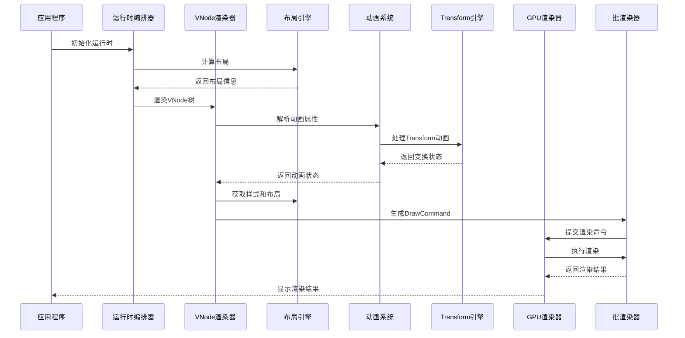

**图表来源**
- [orchestrator.rs:65-156](file://crates/iris-engine/src/orchestrator.rs#L65-L156)
- [vnode_renderer.rs:411-443](file://crates/iris-engine/src/vnode_renderer.rs#L411-L443)
- [mod.rs:11-23](file://crates/iris/src/animation_engine/mod.rs#L11-L23)
- [GPU_RENDER_INTEGRATION_SUMMARY.md:14-32](file://GPU_RENDER_INTEGRATION_SUMMARY.md#L14-L32)

## 详细组件分析

### VNodeRenderer实现分析

VNodeRenderer采用了模式匹配和递归遍历的设计模式：

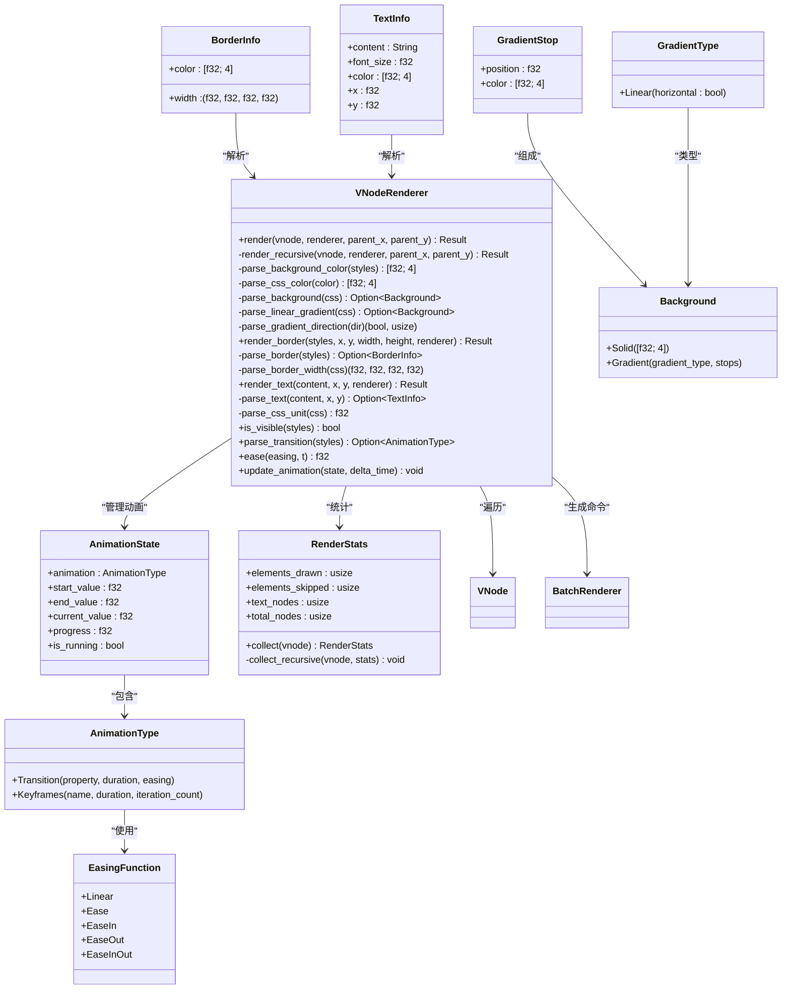

**图表来源**
- [vnode_renderer.rs:52-88](file://crates/iris-engine/src/vnode_renderer.rs#L52-L88)
- [vnode_renderer.rs:445-486](file://crates/iris-engine/src/vnode_renderer.rs#L445-L486)

#### 渲染流程分析

VNodeRenderer的渲染过程遵循以下步骤：

1. **节点类型判断**：根据VNode枚举类型进行分支处理
2. **布局信息检查**：只有具有布局信息的元素才会被渲染
3. **样式解析**：提取背景颜色等渲染属性（支持纯色和线性渐变）
4. **动画解析**：**新增** 解析CSS transition属性，创建动画状态
5. **命令生成**：**新增** 直接生成DrawCommand并提交给批渲染器
6. **递归处理**：对子节点进行同样的处理

**重要更新**：渲染架构已简化为单一流程，移除了复杂的RenderLayer层级管理，并直接生成GPU渲染所需的DrawCommand。

**章节来源**
- [vnode_renderer.rs:124-182](file://crates/iris-engine/src/vnode_renderer.rs#L124-L182)

### BatchRenderer实现分析

BatchRenderer实现了高效的批处理渲染机制：

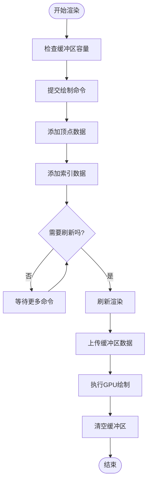

**图表来源**
- [batch_renderer.rs:201-427](file://crates/iris-gpu/src/batch_renderer.rs#L201-L427)

#### 着色器实现分析

批渲染器使用WGSL着色器实现：

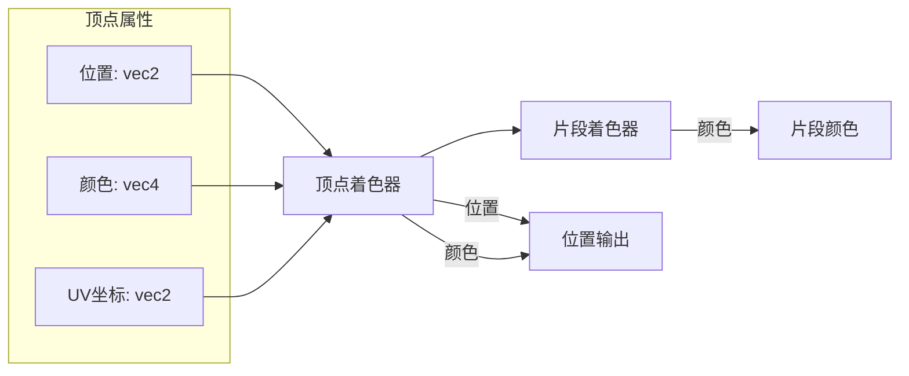

**图表来源**
- [batch_renderer.rs:1-26](file://crates/iris-gpu/src/batch_renderer.rs#L1-L26)

**章节来源**
- [batch_renderer.rs:86-427](file://crates/iris-gpu/src/batch_renderer.rs#L86-L427)
- [batch_renderer.rs:1-26](file://crates/iris-gpu/src/batch_renderer.rs#L1-L26)

### 数据结构设计

#### VNode数据结构

VNode采用枚举类型设计，支持多种节点类型：

```mermaid
erDiagram
VNode {
string tag
map<string,string> attrs
vector<VNode> children
ComputedStyles styles
LayoutBox layout
string content
vector<VNode> fragment_children
}
ComputedStyles ||--o{ VNode : "样式"
LayoutBox ||--o{ VNode : "布局"
VNode ||--o{ VNode : "父子关系"
```

**图表来源**
- [vnode.rs:13-43](file://crates/iris-dom/src/vnode.rs#L13-L43)

#### 布局系统设计

布局系统实现了盒模型和基础布局算法：

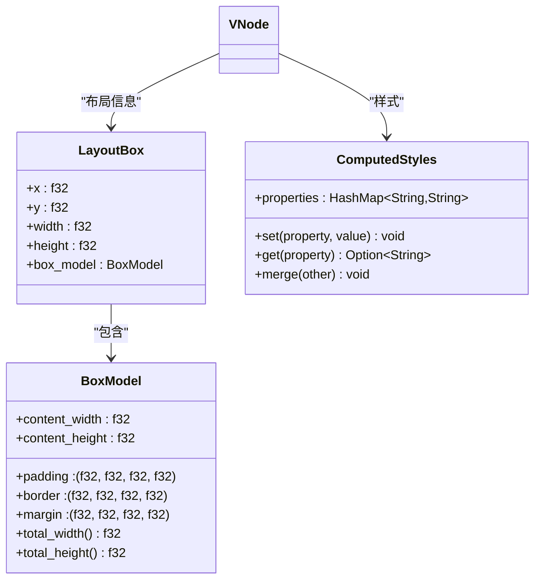

**图表来源**
- [layout.rs:8-99](file://crates/iris-layout/src/layout.rs#L8-L99)
- [style.rs:9-51](file://crates/iris-layout/src/style.rs#L9-L51)

**章节来源**
- [vnode.rs:13-211](file://crates/iris-dom/src/vnode.rs#L13-L211)
- [layout.rs:8-99](file://crates/iris-layout/src/layout.rs#L8-L99)
- [style.rs:9-51](file://crates/iris-layout/src/style.rs#L9-L51)

### 边框系统详细分析

边框系统提供了完整的CSS边框属性解析支持：

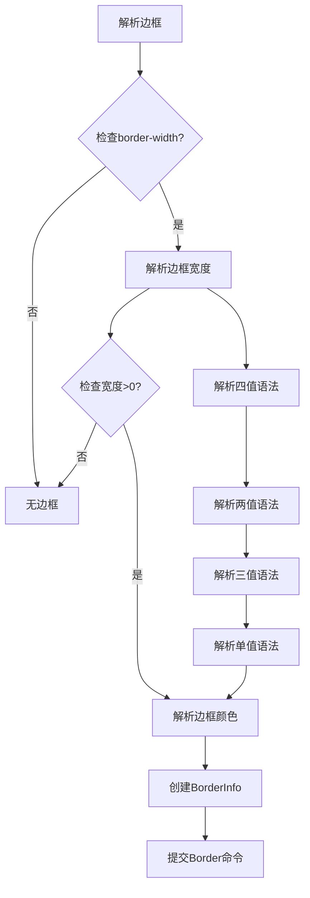

**图表来源**
- [vnode_renderer.rs:323-345](file://crates/iris-engine/src/vnode_renderer.rs#L323-L345)

#### 边框解析流程

1. **CSS边框属性解析**：支持border-width、border-color、border简写
2. **宽度解析**：支持"1px 2px 1px 2px"或"2px"等多种语法
3. **颜色解析**：支持rgba()格式和常用CSS命名颜色
4. **四边独立控制**：支持上、右、下、左四边独立宽度
5. **边框渲染**：将边框转换为四个矩形区域

**章节来源**
- [vnode_renderer.rs:323-345](file://crates/iris-engine/src/vnode_renderer.rs#L323-L345)

### 文本渲染系统分析

文本渲染系统从占位符方法过渡到新的TextInfo基础：

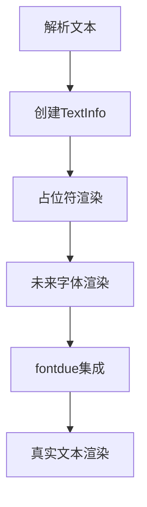

**图表来源**
- [vnode_renderer.rs:488-543](file://crates/iris-engine/src/vnode_renderer.rs#L488-L543)

#### 文本渲染流程

1. **TextInfo创建**：解析文本内容、字体大小、颜色和位置
2. **占位符渲染**：当前使用半透明矩形作为文本占位符
3. **尺寸计算**：基于字符长度和字体大小计算占位符尺寸
4. **颜色处理**：使用文本颜色的半透明版本
5. **未来集成**：为fontdue字体渲染做准备

**章节来源**
- [vnode_renderer.rs:488-543](file://crates/iris-engine/src/vnode_renderer.rs#L488-L543)

## GPU渲染器集成

### RuntimeOrchestrator集成

**重要更新**：RuntimeOrchestrator现在完全支持GPU渲染器，提供了可选的渲染器管理功能。

```mermaid
graph TB
subgraph "RuntimeOrchestrator"
GPU_RENDERER[Option<Renderer><br/>GPU渲染器]
SET_RENDERER[set_gpu_renderer()<br/>设置渲染器]
GET_RENDERER[gpu_renderer_mut()<br/>获取渲染器]
RENDER_FRAME_GPU[render_frame_gpu()<br/>GPU渲染帧]
END
subgraph "Renderer"
BATCH_RENDERER[BatchRenderer<br/>批渲染器]
SUBMIT_COMMAND[submit_command()<br/>提交命令]
SUBMIT_COMMANDS[submit_commands()<br/>批量提交]
RENDER[render()<br/>执行渲染]
END
GPU_RENDERER --> BATCH_RENDERER
SET_RENDERER --> GPU_RENDERER
GET_RENDERER --> GPU_RENDERER
RENDER_FRAME_GPU --> SUBMIT_COMMANDS
SUBMIT_COMMANDS --> BATCH_RENDERER
BATCH_RENDERER --> RENDER
```

**图表来源**
- [orchestrator.rs:648-706](file://crates/iris-engine/src/orchestrator.rs#L648-L706)
- [lib.rs:539-543](file://crates/iris-gpu/src/lib.rs#L539-L543)

#### 集成特性

1. **可选渲染器管理**：GPU渲染器作为可选字段，支持在无窗口环境下测试
2. **零拷贝命令传递**：渲染命令直接从orchestrator传递到GPU渲染器
3. **帧率控制优化**：结合脏标志和帧率限制，避免不必要的渲染
4. **错误处理完善**：提供完整的错误处理和日志记录

#### 渲染流程

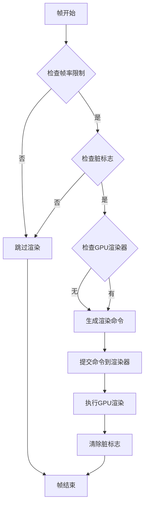

**图表来源**
- [orchestrator.rs:673-706](file://crates/iris-engine/src/orchestrator.rs#L673-L706)

### Renderer公共API扩展

**新增** iris-gpu::Renderer提供了完整的公共API扩展：

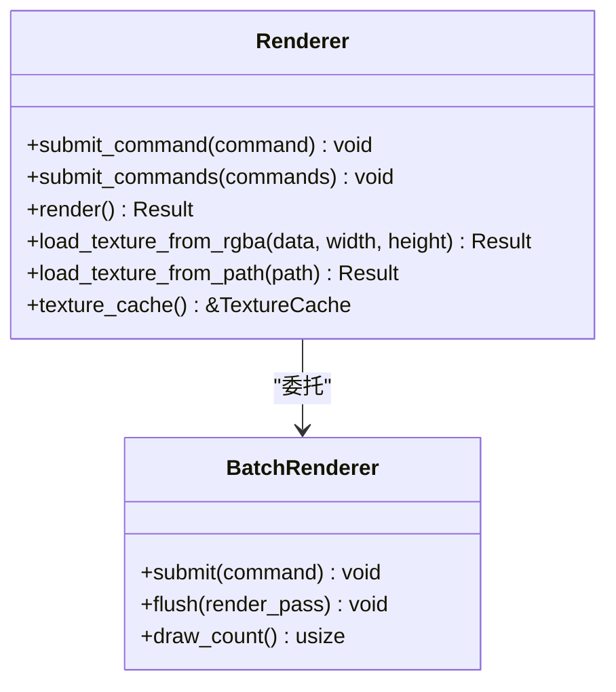

**图表来源**
- [lib.rs:530-543](file://crates/iris-gpu/src/lib.rs#L530-L543)

#### API特性

1. **单命令提交**：`submit_command()`支持单个命令的快速提交
2. **批量命令提交**：`submit_commands()`支持Vec<DrawCommand>的批量处理
3. **零拷贝传递**：命令通过移动语义传递，避免数据复制
4. **纹理管理**：提供RGBA数据和文件路径两种纹理加载方式
5. **缓存访问**：暴露TextureCache供高级用户使用

**章节来源**
- [lib.rs:530-543](file://crates/iris-gpu/src/lib.rs#L530-L543)
- [orchestrator.rs:673-706](file://crates/iris-engine/src/orchestrator.rs#L673-L706)

## 渲染命令生成

### DrawCommand系统

**新增** VNodeRenderer现在直接生成GPU渲染所需的DrawCommand：

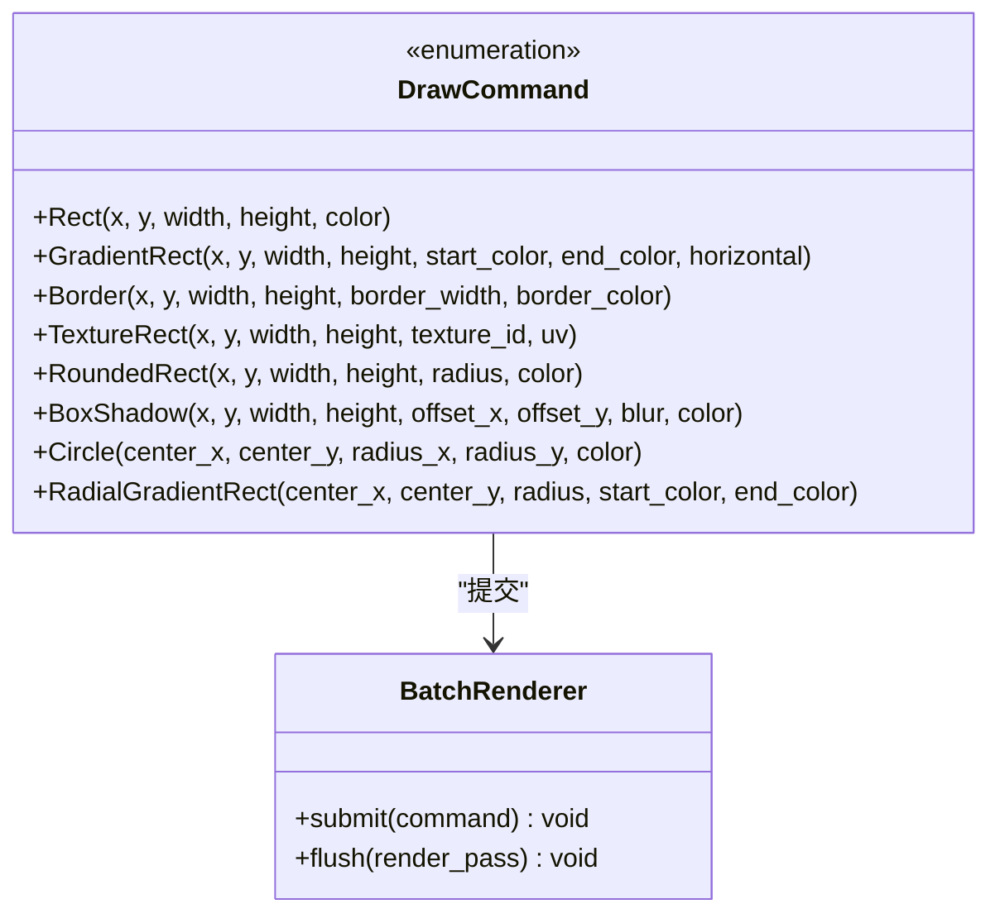

**图表来源**
- [batch_renderer.rs:54-176](file://crates/iris-gpu/src/batch_renderer.rs#L54-L176)

#### 命令类型支持

1. **基础图形**：Rect、Border、Circle
2. **渐变效果**：GradientRect、RadialGradientRect
3. **高级图形**：RoundedRect、BoxShadow
4. **纹理支持**：TextureRect（支持纹理ID和UV坐标）
5. **灵活参数**：所有命令都支持精确的坐标和尺寸控制

#### 命令生成流程

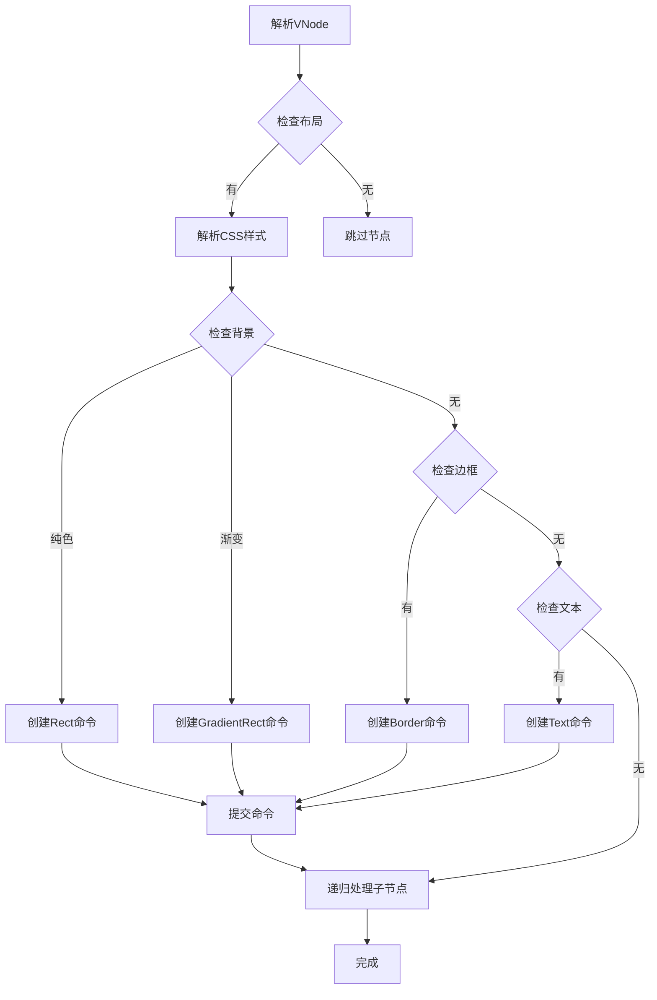

**图表来源**
- [vnode_renderer.rs:190-240](file://crates/iris-engine/src/vnode_renderer.rs#L190-L240)

**章节来源**
- [batch_renderer.rs:54-176](file://crates/iris-gpu/src/batch_renderer.rs#L54-L176)
- [vnode_renderer.rs:190-240](file://crates/iris-engine/src/vnode_renderer.rs#L190-L240)

## 批渲染器集成

### BatchRenderer深度集成

**新增** VNodeRenderer与BatchRenderer的深度集成，实现了高效的批处理渲染：

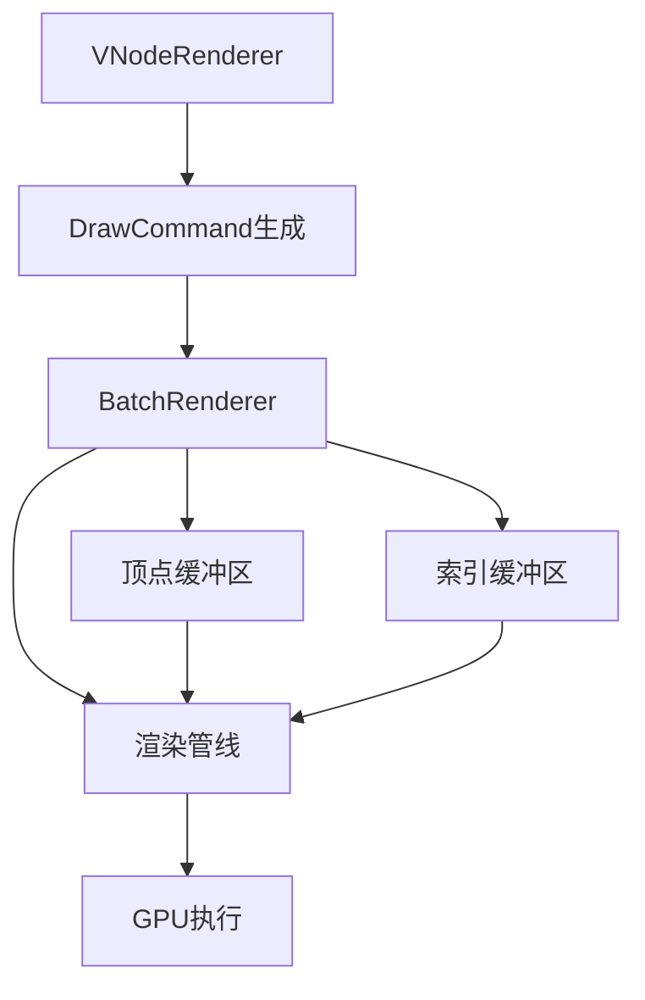

**图表来源**
- [batch_renderer.rs:411-548](file://crates/iris-gpu/src/batch_renderer.rs#L411-L548)

#### 集成特性

1. **零拷贝命令传递**：VNodeRenderer生成的DrawCommand直接提交给BatchRenderer
2. **动态缓冲区管理**：根据渲染需求动态调整缓冲区大小
3. **批处理优化**：将多个绘制命令合并为单次GPU调用
4. **内存对齐优化**：使用bytemuck确保数据结构内存对齐
5. **GPU原生数据格式**：直接使用GPU支持的数据格式减少转换开销

#### 性能优化

1. **容量预估**：根据渲染需求预估缓冲区容量
2. **批量分配**：批量分配内存减少系统调用开销
3. **复用缓冲区**：复用顶点和索引缓冲区避免频繁重建
4. **清空数据**：在每帧开始时清空缓冲区数据
5. **索引优化**：使用u16索引格式支持大量顶点

**章节来源**
- [batch_renderer.rs:411-548](file://crates/iris-gpu/src/batch_renderer.rs#L411-L548)

### Canvas2DContext集成

**新增** Canvas2DContext提供了HTML5 Canvas API的部分实现：

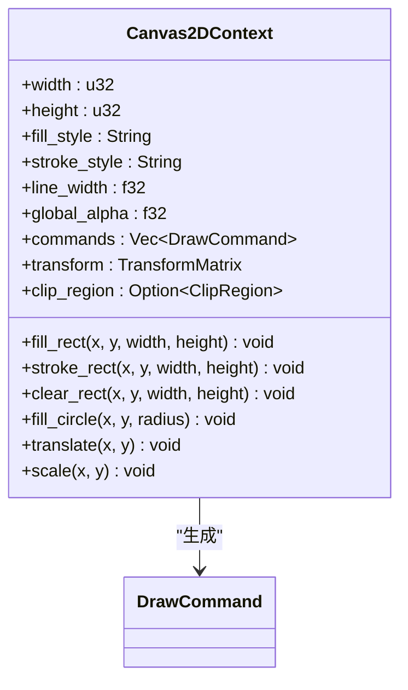

**图表来源**
- [canvas.rs:8-29](file://crates/iris-gpu/src/canvas.rs#L8-L29)

#### Canvas功能

1. **基础绘图**：fill_rect、stroke_rect、clear_rect
2. **圆形绘制**：fill_circle（使用Circle命令）
3. **颜色支持**：十六进制、RGB、RGBA颜色解析
4. **变换支持**：translate、scale变换矩阵
5. **透明度控制**：global_alpha全局透明度
6. **命令队列**：commands数组存储所有绘制命令

**章节来源**
- [canvas.rs:8-29](file://crates/iris-gpu/src/canvas.rs#L8-L29)

## RuntimeOrchestrator集成

### 完整渲染管线

**新增** RuntimeOrchestrator现在提供完整的渲染管线集成：

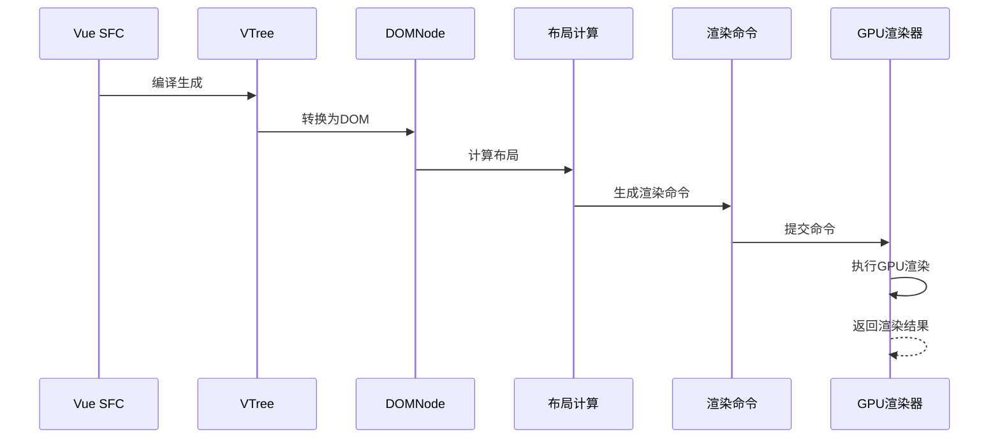

**图表来源**
- [GPU_RENDER_INTEGRATION_SUMMARY.md:14-32](file://GPU_RENDER_INTEGRATION_SUMMARY.md#L14-L32)

#### 集成方法

1. **set_gpu_renderer()**：设置GPU渲染器实例
2. **gpu_renderer_mut()**：获取渲染器的可变引用
3. **render_frame_gpu()**：执行GPU渲染帧
4. **generate_render_commands()**：生成渲染命令列表
5. **submit_commands()**：提交命令到渲染器

#### 渲染循环

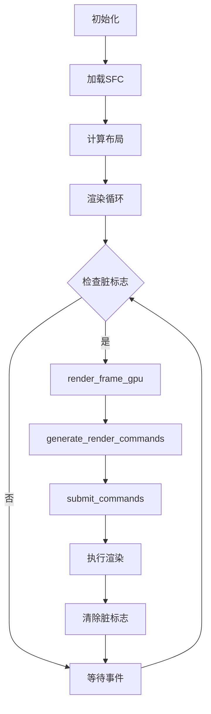

**图表来源**
- [orchestrator.rs:556-594](file://crates/iris-engine/src/orchestrator.rs#L556-L594)

**章节来源**
- [orchestrator.rs:556-594](file://crates/iris-engine/src/orchestrator.rs#L556-L594)
- [orchestrator.rs:673-706](file://crates/iris-engine/src/orchestrator.rs#L673-L706)

### 集成测试验证

**新增** 完整的集成测试验证了渲染器集成的正确性：

1. **GPU渲染器管理测试**：验证渲染器的添加和管理
2. **渲染命令生成测试**：验证无渲染器时的命令生成
3. **帧渲染行为测试**：验证无渲染器时的帧渲染行为
4. **完整渲染流程测试**：验证完整渲染流程（无实际GPU）
5. **多次渲染循环测试**：验证帧率控制和脏标志
6. **大型DOM树测试**：验证大规模DOM树的性能
7. **事件集成测试**：验证事件系统与渲染的集成
8. **视口变化测试**：验证视口变化触发布局重计算
9. **命令完整性测试**：验证渲染命令的完整性
10. **完整管线测试**：验证完整GPU管线集成

**章节来源**
- [gpu_render_integration_test.rs:1-345](file://crates/iris-engine/tests/gpu_render_integration_test.rs#L1-L345)

## 动画系统详解

### 独立动画引擎模块

**重要更新**：模块现已集成全新的独立CSS动画引擎，提供完整的CSS Transitions和 Animations支持

```mermaid
graph TB
subgraph "动画引擎模块"
ANIM[AnimationEngine<br/>主模块]
EASING[EasingFunction<br/>缓动函数]
APPLIER[TransitionConfig<br/>过渡配置]
STATE[ElementAnimationState<br/>动画状态]
TRANSITION[TransitionAnimation<br/>过渡动画]
KEYFRAMES[KeyframesDefinition<br/>关键帧定义]
TRANSFORM[TransformSystem<br/>变换系统]
END
ANIM --> EASING
ANIM --> APPLIER
ANIM --> STATE
ANIM --> KEYFRAMES
ANIM --> TRANSFORM
STATE --> TRANSITION
TRANSITION --> EASING
KEYFRAMES --> EASING
TRANSFORM --> TRANSFORM
```

**图表来源**
- [mod.rs:1-24](file://crates/iris/src/animation_engine/mod.rs#L1-L24)
- [easing.rs:1-164](file://crates/iris/src/animation_engine/easing.rs#L1-L164)
- [applier.rs:1-267](file://crates/iris/src/animation_engine/applier.rs#L1-L267)
- [keyframes.rs:1-609](file://crates/iris/src/animation_engine/keyframes.rs#L1-L609)
- [transform.rs:1-706](file://crates/iris/src/animation_engine/transform.rs#L1-L706)

#### 缓动函数实现

系统支持七种标准CSS缓动函数：

1. **Linear（线性）**：`t`
2. **EaseIn（慢开始）**：三次贝塞尔曲线 `(0.42, 0, 1.0, 1.0)`
3. **EaseOut（快结束）**：三次贝塞尔曲线 `(0, 0, 0.58, 1.0)`
4. **EaseInOut（慢开始快结束）**：分段三次贝塞尔曲线
5. **EaseElastic（弹性缓动）**：支持弹性效果
6. **EaseBounce（弹跳缓动）**：支持弹跳效果
7. **CubicBezier（自定义贝塞尔）**：支持任意三次贝塞尔曲线

#### 动画类型支持

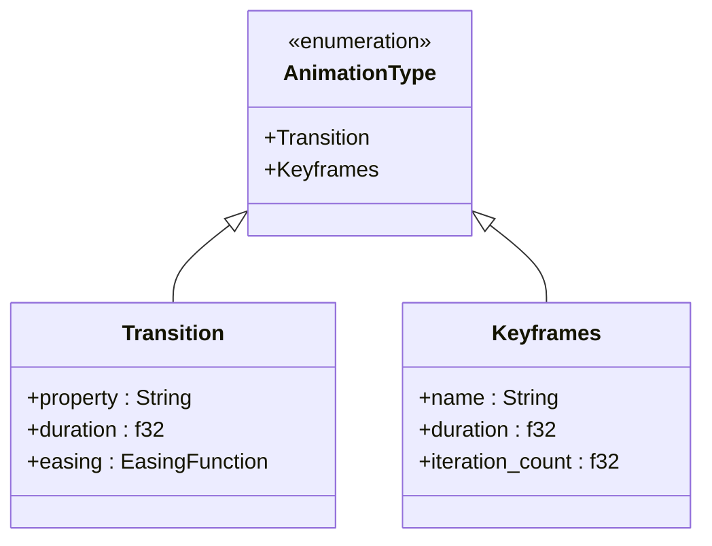

**图表来源**
- [vnode_renderer.rs:52-67](file://crates/iris-engine/src/vnode_renderer.rs#L52-L67)

#### 动画状态管理

ElementAnimationState结构体管理动画的完整生命周期：

- **element_id**：元素唯一标识符
- **current_values**：当前属性值映射
- **active_transitions**：活动的过渡动画映射

**章节来源**
- [vnode_renderer.rs:52-88](file://crates/iris-engine/src/vnode_renderer.rs#L52-L88)
- [vnode_renderer.rs:389-409](file://crates/iris-engine/src/vnode_renderer.rs#L389-L409)
- [vnode_renderer.rs:411-443](file://crates/iris-engine/src/vnode_renderer.rs#L411-L443)
- [vnode_renderer.rs:445-486](file://crates/iris-engine/src/vnode_renderer.rs#L445-L486)

### Transform动画系统

**新增** Transform动画系统是本次更新的核心功能，提供了完整的CSS transform动画支持：

#### Transform函数类型

系统支持完整的2D和3D变换函数：

**2D变换**：
- Translate(tx, ty)：平移变换
- TranslateX(tx)：X轴平移
- TranslateY(ty)：Y轴平移
- Rotate(angle)：旋转变换（度）
- Scale(sx, sy)：缩放变换
- ScaleX(sx)：X轴缩放
- ScaleY(sy)：Y轴缩放
- Skew(ax, ay)：倾斜变换（度）
- SkewX(ax)：X轴倾斜
- SkewY(ay)：Y轴倾斜
- Matrix(a, b, c, d, tx, ty)：通用矩阵变换

**3D变换**：
- Translate3d(tx, ty, tz)：3D平移
- Rotate3d(x, y, z, angle)：3D旋转变换
- RotateX(angle)：绕X轴旋转
- RotateY(angle)：绕Y轴旋转
- RotateZ(angle)：绕Z轴旋转
- Scale3d(sx, sy, sz)：3D缩放
- ScaleX3d(sx)：3D X轴缩放
- ScaleY3d(sy)：3D Y轴缩放
- ScaleZ3d(sz)：3D Z轴缩放
- Perspective(p)：透视变换
- Matrix3d([16 values])：3D通用矩阵

#### Transform链和插值

TransformChain支持变换序列的组合和插值：

```mermaid
flowchart LR
Start[起始变换] --> Chain[变换链]
Chain --> Interpolate[插值计算]
Interpolate --> End[目标变换]
Chain --> CSS[CSS解析]
CSS --> Chain
```

**图表来源**
- [transform.rs:63-443](file://crates/iris/src/animation_engine/transform.rs#L63-L443)

#### Transform动画状态

TransformAnimation管理变换动画的完整生命周期：

- **element_id**：元素唯一标识符
- **from**：起始变换链
- **to**：目标变换链
- **progress**：动画进度（0.0-1.0）
- **current**：当前计算的变换链

#### WillChange性能优化

WillChange枚举支持CSS will-change属性的解析和应用：

- Auto：自动优化
- ScrollPosition：滚动位置优化
- Contents：内容变化优化
- Properties(Vec<String>)：特定属性优化

#### TransformOrigin配置

TransformOrigin支持CSS transform-origin属性的解析：

- 支持百分比和像素值
- 支持left、center、right、top、bottom关键字
- 支持3D变换的Z轴配置

**章节来源**
- [transform.rs:11-61](file://crates/iris/src/animation_engine/transform.rs#L11-L61)
- [transform.rs:63-443](file://crates/iris/src/animation_engine/transform.rs#L63-L443)
- [transform.rs:445-482](file://crates/iris/src/animation_engine/transform.rs#L445-L482)
- [transform.rs:484-523](file://crates/iris/src/animation_engine/transform.rs#L484-L523)
- [transform.rs:525-588](file://crates/iris/src/animation_engine/transform.rs#L525-L588)

### CSS过渡属性解析

系统能够解析标准的CSS transition属性：

```mermaid
flowchart LR
TransitionCSS["transition: opacity 0.3s ease"] --> ParseParts["解析属性"]
ParseParts --> ExtractProperty["提取属性名"]
ExtractProperty --> ExtractDuration["提取持续时间"]
ExtractDuration --> ExtractEasing["提取缓动函数"]
ExtractEasing --> CreateAnimation["创建AnimationType"]
```

**图表来源**
- [vnode_renderer.rs:411-443](file://crates/iris-engine/src/vnode_renderer.rs#L411-L443)

#### 解析规则

1. **属性格式**：`property duration easing`
2. **属性名称**：支持任意CSS属性（如opacity、width、height等）
3. **持续时间**：支持秒单位（s），默认0.3秒
4. **缓动函数**：支持linear、ease、ease-in、ease-out、ease-in-out，默认ease

**章节来源**
- [vnode_renderer.rs:411-443](file://crates/iris-engine/src/vnode_renderer.rs#L411-L443)

### 帧更新处理

动画系统通过update_animation函数处理每帧的状态更新：

```mermaid
flowchart TD
FrameStart[帧开始] --> CheckRunning{检查is_running}
CheckRunning --> |否| SkipUpdate[跳过更新]
CheckRunning --> |是| CalcProgress[计算进度增量]
CalcProgress --> CheckComplete{检查进度>=1.0?}
CheckComplete --> |是| SetComplete[设置完成状态]
CheckComplete --> |否| CalcEased[计算缓动值]
CalcEased --> UpdateValue[更新当前值]
UpdateValue --> Continue[继续动画]
SetComplete --> Stop[停止动画]
SkipUpdate --> End[帧结束]
Continue --> End
Stop --> End
```

**图表来源**
- [vnode_renderer.rs:445-486](file://crates/iris-engine/src/vnode_renderer.rs#L445-L486)

#### 更新算法

1. **进度计算**：`progress += delta_time / duration`
2. **边界处理**：进度超过1.0时截断到1.0
3. **缓动插值**：使用对应缓动函数计算插值系数
4. **值更新**：`current_value = start_value + (end_value - start_value) * eased_progress`

**章节来源**
- [vnode_renderer.rs:445-486](file://crates/iris-engine/src/vnode_renderer.rs#L445-L486)

## 脏矩形管理器

**重要更新**：脏矩形管理器模块保持完整，提供渲染性能优化

脏矩形管理器是渲染性能优化的关键组件，用于跟踪和优化需要重绘的区域：

```mermaid
flowchart TD
Start([开始帧]) --> TrackChanges["跟踪变化区域"]
TrackChanges --> AddRects["添加脏矩形"]
AddRects --> MergeOverlap["合并重叠矩形"]
MergeOverlap --> CheckThreshold{"超过阈值?"}
CheckThreshold --> |是| FullRedraw["全屏重绘"]
CheckThreshold --> |否| PartialRedraw["部分重绘"]
FullRedraw --> ClearStats["清理统计"]
PartialRedraw --> ClearStats
ClearStats --> End([结束帧])
```

**图表来源**
- [dirty_rect_manager.rs:182-221](file://crates/iris/src/dirty_rect_manager.rs#L182-L221)

### 核心功能

1. **变化检测**：跟踪上一帧和当前帧的渲染状态差异
2. **矩形合并**：合并重叠的脏矩形以减少绘制调用
3. **阈值判断**：根据脏矩形面积比例决定重绘策略
4. **性能统计**：收集渲染优化相关的统计数据

### 算法实现

脏矩形管理器采用以下优化策略：

- **简单合并算法**：使用迭代方法合并重叠矩形
- **面积阈值**：当脏区域占比超过50%时直接全屏重绘
- **实时统计**：记录总脏矩形数、合并后数量和节省比例

**章节来源**
- [dirty_rect_manager.rs:1-368](file://crates/iris/src/dirty_rect_manager.rs#L1-L368)

## 依赖关系分析

### 模块间依赖关系

```mermaid
graph TB
subgraph "外部依赖"
WGPU[wgpu 24.x]
WINIT[winit]
BYTEMUCK[bytemuck]
FONTDUE[fontdue]
END
subgraph "内部模块"
IRIS_ENGINE[iris-engine]
IRIS_GPU[iris-gpu]
IRIS_DOM[iris-dom]
IRIS_LAYOUT[iris-layout]
IRIS_JS[iris-js]
IRIS_SFC[iris-sfc]
END
IRIS_ENGINE --> IRIS_GPU
IRIS_ENGINE --> IRIS_DOM
IRIS_ENGINE --> IRIS_LAYOUT
IRIS_ENGINE --> IRIS_JS
IRIS_ENGINE --> IRIS_SFC
IRIS_GPU --> WGPU
IRIS_GPU --> WINIT
IRIS_GPU --> BYTEMUCK
IRIS_GPU --> FONTDUE
IRIS_ENGINE -.-> IRIS_GPU
IRIS_ENGINE -.-> IRIS_DOM
IRIS_ENGINE -.-> IRIS_LAYOUT
```

**图表来源**
- [Cargo.toml:13-31](file://Cargo.toml#L13-L31)
- [Cargo.toml:13-21](file://crates/iris/Cargo.toml#L13-L21)

### 关键依赖分析

VNode GPU渲染器模块的关键依赖包括：

1. **iris-dom**：提供VNode数据结构和DOM抽象
2. **iris-layout**：提供布局计算和样式解析
3. **iris-gpu**：提供GPU渲染基础设施和批渲染器
4. **wgpu**：WebGPU图形API封装
5. **bytemuck**：零拷贝数据转换
6. **fontdue**：字体渲染库（未来集成）

**章节来源**
- [Cargo.toml:13-31](file://Cargo.toml#L13-L31)
- [vnode_renderer.rs:6-8](file://crates/iris-engine/src/vnode_renderer.rs#L6-L8)

## 性能考量

### 批渲染优化

VNode GPU渲染器模块采用了多项性能优化策略：

1. **批处理渲染**：将多个绘制命令合并为单次GPU调用
2. **动态缓冲区管理**：根据渲染需求动态调整缓冲区大小
3. **内存对齐优化**：使用bytemuck确保数据结构内存对齐
4. **GPU原生数据格式**：直接使用GPU支持的数据格式减少转换开销
5. **边框优化**：边框渲染通过四个独立矩形实现，避免复杂的几何计算
6. **动画优化**：**新增** 动画状态复用，避免重复解析CSS属性
7. **脏矩形优化**：**新增** 仅重绘变化区域，大幅减少GPU负载
8. **Transform优化**：**新增** 变换链缓存和插值优化
9. **WillChange优化**：**新增** 性能提示减少不必要的重排
10. **零拷贝优化**：**新增** 渲染命令直接传递，避免数据复制
11. **帧率控制优化**：**新增** 结合脏标志和帧率限制，避免不必要的渲染

**重要更新**：渲染架构简化后，性能优化策略得到进一步提升，特别是零拷贝命令传递和帧率控制优化。

### 内存管理策略

```mermaid
flowchart LR
subgraph "内存分配策略"
CAP[容量预估] --> ALLOC[批量分配]
ALLOC --> REUSE[复用缓冲区]
REUSE --> CLEAR[清空数据]
end
subgraph "渲染优化"
BATCH[批处理] --> SINGLE[单次提交]
SINGLE --> FLUSH[刷新渲染]
end
CAP --> BATCH
CLEAR --> CAP
```

### 性能监控

渲染器提供了统计信息收集功能，帮助开发者监控渲染性能：

- 元素绘制计数
- 跳过元素计数  
- 文本节点计数
- 总节点计数
- **新增** 动画状态管理开销
- **新增** 脏矩形统计信息
- **新增** Transform动画性能指标
- **新增** 命令生成和提交性能
- **新增** GPU渲染性能指标

**章节来源**
- [batch_renderer.rs:421-427](file://crates/iris-gpu/src/batch_renderer.rs#L421-L427)
- [vnode_renderer.rs:600-653](file://crates/iris-engine/src/vnode_renderer.rs#L600-L653)

## 故障排除指南

### 常见问题及解决方案

#### 渲染器初始化失败

**问题症状**：GPU渲染器无法初始化
**可能原因**：
- 缺少合适的GPU适配器
- WebGPU后端不兼容
- 设备权限问题

**解决方案**：
1. 检查系统GPU驱动
2. 确认WebGPU支持状态
3. 降级后端兼容性设置

#### VNode渲染异常

**问题症状**：元素不按预期渲染
**可能原因**：
- 布局信息缺失
- 样式解析错误
- 坐标计算问题

**解决方案**：
1. 验证布局计算结果
2. 检查CSS样式解析
3. 调试坐标变换逻辑

#### 动画系统问题

**问题症状**：CSS动画不生效或表现异常
**可能原因**：
- transition属性解析失败
- 缓动函数计算错误
- 动画状态管理异常

**解决方案**：
1. 验证CSS transition语法格式
2. 检查EasingFunction枚举值
3. 调试AnimationState状态更新
4. 确认delta_time参数传递

#### Transform动画问题

**问题症状**：CSS transform动画不生效或表现异常
**可能原因**：
- transform属性解析失败
- 变换链插值错误
- TransformAnimation状态异常

**解决方案**：
1. 验证CSS transform语法格式
2. 检查TransformFunction枚举值
3. 调试TransformChain插值算法
4. 确认TransformAnimation进度更新
5. 验证WillChange性能提示设置

#### 脏矩形管理器问题

**问题症状**：渲染性能不佳或过度重绘
**可能原因**：
- 脏矩形阈值设置不当
- 合并算法效率低
- 统计信息收集错误

**解决方案**：
1. 调整merge_threshold阈值
2. 优化合并算法实现
3. 检查统计信息计算逻辑
4. 验证全屏重绘触发条件

#### 边框渲染问题

**问题症状**：边框显示不正确
**可能原因**：
- CSS边框语法错误
- 边框宽度解析失败
- 边框颜色解析错误

**解决方案**：
1. 验证border-width语法（支持1-4个值）
2. 检查border-color格式
3. 确认边框简写属性的正确使用

#### 文本渲染问题

**问题症状**：文本显示为占位符而非实际文字
**可能原因**：
- fontdue库未正确集成
- 文本样式解析不完整
- 字体渲染配置问题

**解决方案**：
1. 确认fontdue依赖已正确添加
2. 检查TextInfo结构体的完整实现
3. 验证字体渲染管线的正确配置

#### 性能问题

**问题症状**：渲染帧率低
**可能原因**：
- 批处理容量不足
- 缓冲区频繁重建
- 过多的绘制调用
- **新增** 动画状态过多导致CPU开销
- **新增** 脏矩形管理器配置不当
- **新增** Transform动画性能瓶颈
- **新增** 命令生成和提交性能问题
- **新增** GPU渲染性能瓶颈

**解决方案**：
1. 增加批处理容量
2. 优化缓冲区复用
3. 减少不必要的渲染
4. **新增** 合理管理动画状态数量
5. **新增** 调优脏矩形阈值和合并策略
6. **新增** 优化Transform动画插值算法
7. **新增** 使用WillChange性能提示
8. **新增** 优化命令生成和提交流程
9. **新增** 检查GPU渲染性能瓶颈

#### GPU渲染器集成问题

**问题症状**：GPU渲染器无法正常工作
**可能原因**：
- 渲染器未正确设置
- 命令生成失败
- 渲染执行错误

**解决方案**：
1. 验证set_gpu_renderer()调用
2. 检查generate_render_commands()返回值
3. 确认submit_commands()正确传递命令
4. 验证render()方法执行结果
5. 检查错误处理和日志输出

**章节来源**
- [vnode_renderer.rs:801-1055](file://crates/iris-engine/src/vnode_renderer.rs#L801-L1055)
- [batch_renderer.rs:216-231](file://crates/iris-gpu/src/batch_renderer.rs#L216-L231)
- [transform.rs:590-705](file://crates/iris/src/animation_engine/transform.rs#L590-L705)
- [gpu_render_integration_test.rs:1-345](file://crates/iris-engine/tests/gpu_render_integration_test.rs#L1-L345)

## 结论

VNode GPU渲染器模块是Iris引擎中实现高性能2D渲染的关键组件。通过采用批渲染技术和WebGPU硬件加速，该模块实现了高效的虚拟DOM到GPU渲染的转换。

**重要更新**：模块现已完成与GPU渲染器的完整集成，成为渲染管线中的核心桥梁，实现了从虚拟DOM到GPU渲染的无缝转换。该模块不仅负责渲染命令的生成，还与批渲染器深度集成，提供零拷贝的命令传递和帧率控制优化。

模块的主要优势包括：
- **高性能渲染**：通过批处理和GPU加速实现流畅的UI渲染
- **渐变支持**：完整的CSS线性渐变解析和渲染支持
- **边框系统**：完整的CSS边框属性解析，支持四边独立控制
- **动画系统**：完整的CSS风格动画支持，包括多种缓动函数
- **Transform动画**：**新增** 完整的2D/3D变换支持，包括变换链和插值
- **WillChange优化**：**新增** CSS will-change性能提示支持
- **TransformOrigin**：**新增** CSS transform-origin解析和应用
- **文本基础**：为未来的字体渲染提供基础架构
- **颜色丰富**：支持rgba()格式和常用CSS命名颜色
- **模块化设计**：清晰的分层架构便于维护和扩展
- **内存优化**：智能的缓冲区管理和数据对齐优化
- **可扩展性**：支持多种绘制命令和渐变效果
- **动画优化**：高效的动画状态管理和帧更新处理
- **架构简化**：移除RenderLayer管理，代码更加简洁
- **性能优化**：脏矩形管理器提供渲染区域优化
- **Transform优化**：**新增** 变换链缓存和插值优化
- **WillChange优化**：**新增** 性能提示减少不必要的重排
- **零拷贝优化**：**新增** 渲染命令直接传递，避免数据复制
- **帧率控制优化**：**新增** 结合脏标志和帧率限制，避免不必要的渲染
- **GPU渲染器集成**：**新增** 完整的GPU渲染器管理功能
- **渲染管线集成**：**新增** 从SFC到GPU渲染的完整管道

未来的发展方向包括：
- 完善字体渲染支持（fontdue集成）
- 增强动画系统功能（关键帧动画、复杂缓动）
- 优化内存使用效率
- 扩展图形效果支持
- 支持更多CSS属性
- 实现更精确的文本测量和布局
- **新增** Transform动画性能监控和调试工具
- **新增** 更精细的脏矩形合并算法
- **新增** Transform动画的GPU加速支持
- **新增** Canvas2DContext的完整Canvas API实现
- **新增** 文本渲染器的高级功能
- **新增** 纹理管理器的优化和扩展

该模块为Iris引擎提供了坚实的渲染基础，为构建现代Web应用提供了强大的技术支持。通过完成与GPU渲染器的完整集成，现在可以实现从Vue SFC到实际GPU渲染的完整流程，为后续的实际窗口集成奠定了坚实的基础。