# WebGPU渲染引擎

<cite>
**本文档引用的文件**
- [lib.rs](file://crates/iris-gpu/src/lib.rs)
- [batch_renderer.rs](file://crates/iris-gpu/src/batch_renderer.rs)
- [batch_shader.wgsl](file://crates/iris-gpu/src/batch_shader.wgsl)
- [file_watcher.rs](file://crates/iris-gpu/src/file_watcher.rs)
- [font_atlas.rs](file://crates/iris-gpu/src/font_atlas.rs)
- [canvas.rs](file://crates/iris-gpu/src/canvas.rs)
- [text_renderer.rs](file://crates/iris-gpu/src/text_renderer.rs)
- [texture_cache.rs](file://crates/iris-gpu/src/texture_cache.rs)
- [dirty_rect_manager.rs](file://crates/iris/src/dirty_rect_manager.rs)
- [file_watcher_integration.rs](file://crates/iris-gpu/tests/file_watcher_integration.rs)
- [Cargo.toml](file://crates/iris-gpu/Cargo.toml)
- [lib.rs](file://crates/iris-core/src/lib.rs)
- [Cargo.toml](file://Cargo.toml)
- [vnode_renderer.rs](file://crates/iris/src/vnode_renderer.rs)
- [orchestrator.rs](file://crates/iris-engine/src/orchestrator.rs)
- [gpu_texture_rendering.rs](file://crates/iris-gpu/tests/gpu_texture_rendering.rs)
- [TEXTURE_INTEGRATION.md](file://crates/iris-gpu/TEXTURE_INTEGRATION.md)
- [gpu_render_integration_test.rs](file://crates/iris-engine/tests/gpu_render_integration_test.rs)
- [gpu_render_integration.rs](file://crates/iris-engine/examples/gpu_render_integration.rs)
- [gpu_render_window.rs](file://crates/iris-engine/examples/gpu_render_window.rs)
- [demo_app.vue](file://crates/iris-engine/examples/demo_app.vue)
- [FIX_BLANK_WINDOW_SUMMARY.md](file://FIX_BLANK_WINDOW_SUMMARY.md)
- [LOAD_REAL_VUE_SFC_SUMMARY.md](file://LOAD_REAL_VUE_SFC_SUMMARY.md)
- [GPU_RENDER_INTEGRATION_SUMMARY.md](file://GPU_RENDER_INTEGRATION_SUMMARY.md)
</cite>

## 更新摘要
**所做更改**
- 新增GPU渲染器修复：解决空白窗口问题，实现基于元素类型的彩色矩形渲染
- 新增真实Vue SFC加载集成：支持从demo_app.vue加载真实Vue组件
- 新增完整的GPU渲染器集成系统：RuntimeOrchestrator中的GPU渲染器管理
- 新增set_gpu_renderer()、gpu_renderer_mut()、render_frame_gpu()等新方法
- 在iris-gpu::Renderer中新增submit_command()和submit_commands()等API增强
- 完善GPU渲染管线的完整集成测试和示例代码
- 新增GPU渲染器生命周期管理和错误处理机制
- 扩展渲染命令生成系统以支持GPU渲染器
- 新增窗口示例，展示真实Vue SFC组件渲染到屏幕

## 目录
1. [引言](#引言)
2. [项目结构](#项目结构)
3. [核心组件](#核心组件)
4. [架构概览](#架构概览)
5. [详细组件分析](#详细组件分析)
6. [WebGPU渲染管线设计](#webgpu渲染管线设计)
7. [高级视觉效果实现](#高级视觉效果实现)
8. [性能优化策略](#性能优化策略)
9. [60fps稳定渲染机制](#60fps稳定渲染机制)
10. [大列表和复杂组件优化](#大列表和复杂组件优化)
11. [GPU渲染器集成系统](#gpu渲染器集成系统)
12. [渲染命令生成系统](#渲染命令生成系统)
13. [文件热更新监听器](#文件热更新监听器)
14. [GPU渲染器修复和空白窗口问题解决](#gpu渲染器修复和空白窗口问题解决)
15. [真实Vue SFC加载集成](#真实vue-sfc加载集成)
16. [故障排除指南](#故障排除指南)
17. [结论](#结论)

## 引言

Leivue Runtime是一个革命性的前端运行时引擎，专为Vue生态系统设计，采用Rust+WebGPU技术栈，实现了完全脱离传统浏览器DOM渲染的硬件加速渲染系统。该项目的核心使命是消除前端工程化复杂性，突破浏览器沙箱限制，为Vue生态提供高性能跨端底座。

该引擎采用七层分层架构，从上到下依次为：应用层、即时转译层、JS沙箱运行时层、跨端统一抽象层、布局&样式引擎层、WebGPU硬件渲染管线层、Rust底层内核底座。这种架构设计确保了极强的解耦性和可维护性。

**最新重大更新**：引擎已从纯色渲染升级为支持多种GPU命令类型的完整渲染系统，包括Rect、GradientRect、Border、TextureRect、RoundedRect、BoxShadow、Circle、RadialGradientRect八种渲染命令类型。同时，新增了Canvas2DContext、text_renderer、texture_cache等核心组件，以及完整的渲染命令生成和收集机制，为后续GPU渲染集成奠定了坚实基础。

**重要修复**：解决了空白窗口问题，通过实现基于元素类型的彩色矩形渲染，确保渲染命令生成系统正常工作。

**重要集成**：新增了真实Vue SFC加载功能，支持从demo_app.vue加载真实Vue组件，并将其渲染到GPU渲染器中。

## 项目结构

项目采用模块化的七层架构设计，每层都有明确的职责分工：

```mermaid
graph TB
subgraph "应用层"
App[Vue应用]
DemoApp[真实Vue SFC组件]
end
subgraph "即时转译层"
SFC[SFC即时转译]
TS[TypeScript转译]
end
subgraph "JS沙箱运行时层"
QJS[QuickJS引擎]
Runtime[Vue运行时]
end
subgraph "跨端统一抽象层"
Events[事件系统]
BOM[DOM模拟]
end
subgraph "布局&样式引擎层"
HTML[HTML解析]
CSS[CSS引擎]
Layout[布局系统]
end
subgraph "WebGPU硬件渲染管线层"
GPURenderer[GPU渲染器]
Batch[批渲染器]
Vector[矢量绘制]
Border[边框渲染]
Texture[纹理渲染]
Font[字体渲染]
RoundedRect[圆角矩形渲染]
Atlas[字体图集管理]
DirtyRect[脏矩形管理]
Canvas2D[Canvas2D上下文]
TextRenderer[文本渲染器]
TextureCache[纹理缓存]
RenderCommand[渲染命令生成]
GPURendererIntegration[GPU渲染器集成]
end
subgraph "Rust底层内核底座"
Kernel[Rust内核]
WGPU[wgpu库]
Winit[winit窗口管理]
```

**图表来源**
- [lib.rs:7-22](file://crates/iris-gpu/src/lib.rs#L7-L22)

**章节来源**
- [lib.rs:7-22](file://crates/iris-gpu/src/lib.rs#L7-L22)

## 核心组件

### WebGPU硬件渲染层

WebGPU渲染层是整个系统的核心，完全替代了传统的浏览器DOM渲染流水线，实现了基于标准WebGPU规范的统一桌面/浏览器渲染接口。

#### 主要特性
- **完整的渲染命令系统**：支持八种不同类型的GPU命令（Rect、GradientRect、Border、TextureRect、RoundedRect、BoxShadow、Circle、RadialGradientRect）
- **批渲染优化**：通过批量处理减少GPU状态切换开销
- **矢量绘制**：支持复杂的几何图形渲染
- **边框渲染**：支持四边独立的边框宽度和颜色控制
- **纹理映射**：支持GPU纹理加载、UV坐标处理和纹理采样
- **字体渲染**：集成fontdue字体渲染系统，支持字形栅格化和文本渲染
- **圆角矩形渲染**：使用三角形扇形近似算法实现高质量圆角效果
- **字体纹理图集**：实现字形缓存、UV映射和批量渲染优化
- **脏矩形管理**：优化渲染区域，减少不必要的重绘
- **Canvas2D API**：提供完整的HTML5 Canvas 2D上下文功能
- **文本渲染器**：支持GPU纹理字体渲染
- **纹理缓存管理**：提供GPU纹理的高效缓存和生命周期管理
- **渲染命令生成**：支持从DOM树生成渲染命令的完整流程
- **GPU渲染器集成**：完整的GPU渲染器生命周期管理和错误处理
- **高级视觉效果**：圆角、阴影、渐变、纹理图集、字体渲染、图层合成
- **性能优势**：实现60fps稳定渲染，CPU开销极低
- **稳定性保障**：u16索引溢出保护机制，确保大规模渲染的稳定性
- **文件监控**：实时文件系统监控，支持防抖机制和事件去重
- **空白窗口修复**：基于元素类型的彩色矩形渲染，解决空白窗口问题
- **真实Vue SFC集成**：支持从demo_app.vue加载真实Vue组件

#### 技术架构
```mermaid
classDiagram
class WebGPURenderer {
+renderQueue RenderQueue
+batchRenderer BatchRenderer
+vectorRenderer VectorRenderer
+borderRenderer BorderRenderer
+textureRenderer TextureRenderer
+fontRenderer FontRenderer
+roundedRectRenderer RoundedRectRenderer
+fontAtlas FontAtlas
+dirtyRectManager DirtyRectManager
+layerComposer LayerComposer
+canvas2DContext Canvas2DContext
+textRenderer TextRenderer
+textureCache TextureCache
+render() void
+submitFrame() void
}
class BatchRenderer {
+addPrimitive(primitive) void
+flushBatch() void
+optimizeBatches() void
+loadTextureFromBytes(data, width, height) u32
+submitTextureRect(x, y, width, height, texture_id, uv) void
+submitText(text, x, y, color) void
+add_rounded_rect(x, y, width, height, radius, color) void
+checkU16Overflow() void
}
class Canvas2DContext {
+width u32
+height u32
+fill_style String
+stroke_style String
+line_width f32
+global_alpha f32
+commands Vec~DrawCommand~
+transform TransformMatrix
+clip_region Option~ClipRegion~
+fill_rect(x, y, width, height) void
+stroke_rect(x, y, width, height) void
+fill_circle(x, y, radius) void
+set_fill_style(style) void
+set_stroke_style(style) void
+translate(x, y) void
+scale(x, y) void
}
class TextRenderer {
+font_atlas FontAtlas
+needs_texture_update bool
+render_text(text, x, y, color, texture_id) Vec~DrawCommand~
+measure_text_width(text) f32
+clear() void
}
class TextureCache {
+textures Vec~TextureEntry~
+format TextureFormat
+create_texture_from_rgba(device, queue, data, width, height) u32
+create_texture_from_path(device, queue, path) u32
+get_texture(id) Option~TextureEntry~
}
class FontAtlas {
+atlas_data Vec<u8>
+glyph_cache HashMap
+cursor_x u32
+cursor_y u32
+dirty bool
+get_or_rasterize_glyph(char) Option<GlyphInfo>
+copy_to_atlas(bitmap, x, y, width, height) void
+reset_dirty() void
}
class DirtyRectManager {
+dirty_rects Vec<DirtyRect>
+enabled bool
+merge_threshold f32
+compute_redraw_regions() Vec<DirtyRect>
+merge_overlapping() void
+mark_full_dirty() void
}
class RoundedRectRenderer {
+add_rounded_rect(x, y, width, height, radius, color) void
+add_corner(center_x, center_y, radius, start_angle, end_angle, color, segments) void
}
class TextureRenderer {
+textures Vec<Texture>
+textureViews Vec<TextureView>
+textureSampler Sampler
+textureBindGroupLayout BindGroupLayout
+textureBindGroup BindGroup
+loadTexture(data, width, height) u32
+bindTexture(texture_id) void
}
class FontRenderer {
+font Option<Font>
+font_size f32
+set_font(font, size) void
+rasterize_glyph(char, size) GlyphMetrics
+render_text(text, x, y, color) void
}
class LayerComposer {
+compositeLayers(layers) Image
+applyBlendMode(mode) void
+applyOpacity(opacity) void
}
class RenderCommandGenerator {
+generate_commands(dom_tree) Vec~DrawCommand~
+collect_render_commands(node, commands) void
+parse_background_color(node) Option~[f32; 4]~
}
class GPURendererIntegration {
+set_gpu_renderer(renderer) void
+gpu_renderer_mut() Option~&mut Renderer~
+render_frame_gpu() bool
+has_gpu_renderer() bool
}
WebGPURenderer --> BatchRenderer
WebGPURenderer --> Canvas2DContext
WebGPURenderer --> TextRenderer
WebGPURenderer --> TextureCache
WebGPURenderer --> TextureRenderer
WebGPURenderer --> FontRenderer
WebGPURenderer --> RoundedRectRenderer
WebGPURenderer --> FontAtlas
WebGPURenderer --> DirtyRectManager
WebGPURenderer --> LayerComposer
WebGPURenderer --> RenderCommandGenerator
WebGPURenderer --> GPURendererIntegration
```

**图表来源**
- [lib.rs:30-34](file://crates/iris-gpu/src/lib.rs#L30-L34)

**章节来源**
- [lib.rs:30-34](file://crates/iris-gpu/src/lib.rs#L30-L34)

## 架构概览

### 七层分层架构详解

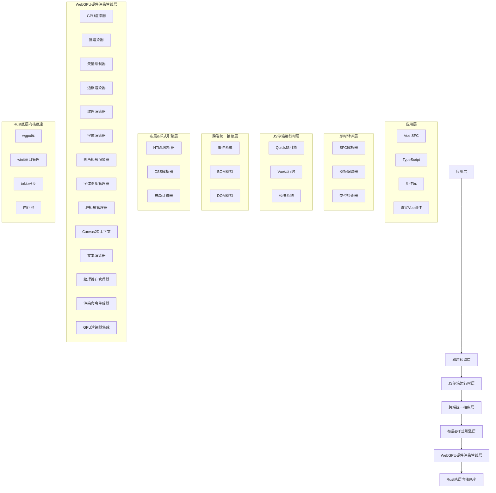

**图表来源**
- [lib.rs:7-22](file://crates/iris-gpu/src/lib.rs#L7-L22)

**章节来源**
- [lib.rs:7-22](file://crates/iris-gpu/src/lib.rs#L7-L22)

## 详细组件分析

### WebGPU渲染器实现

WebGPU渲染器是整个渲染系统的核心组件，负责协调所有渲染相关的操作。

#### 渲染流程
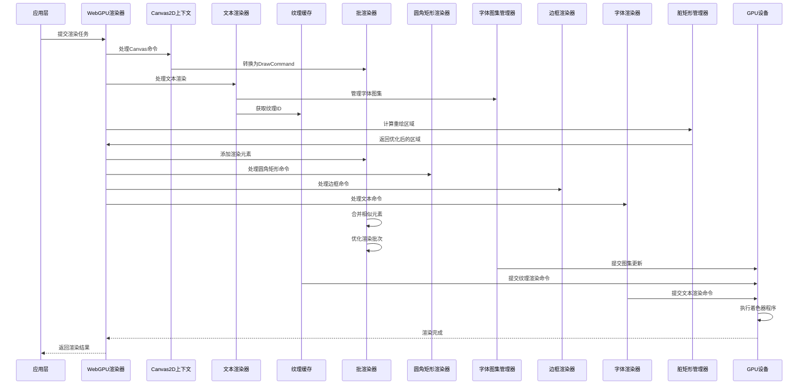

**图表来源**
- [lib.rs:30-34](file://crates/iris-gpu/src/lib.rs#L30-L34)

#### 关键数据结构
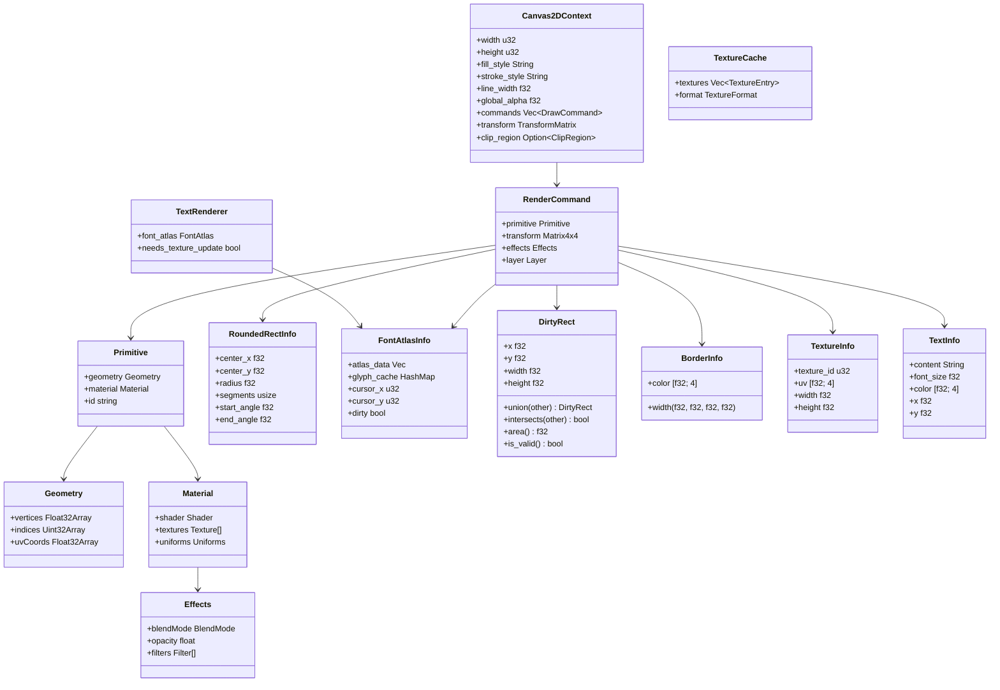

**图表来源**
- [lib.rs:30-34](file://crates/iris-gpu/src/lib.rs#L30-L34)

**章节来源**
- [lib.rs:30-34](file://crates/iris-gpu/src/lib.rs#L30-L34)

### Canvas2DContext组件实现

Canvas2DContext是新增的核心组件，提供了完整的HTML5 Canvas 2D API功能，将Canvas绘图命令转换为GPU可执行的绘制命令。

#### Canvas2D上下文架构
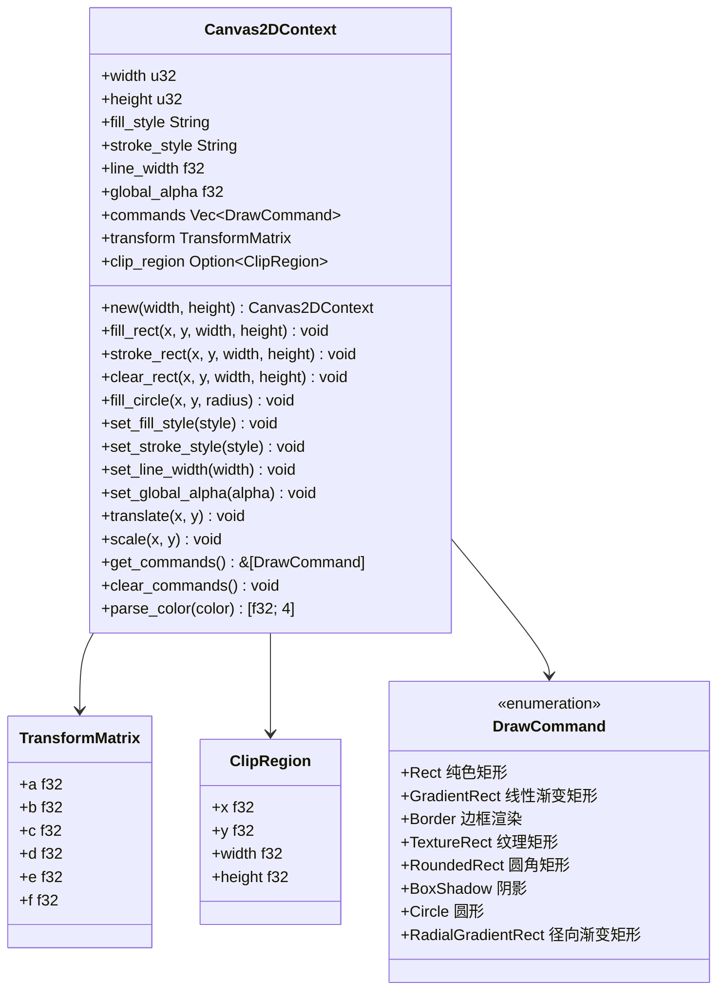

**图表来源**
- [canvas.rs:10-49](file://crates/iris-gpu/src/canvas.rs#L10-L49)

#### Canvas命令处理流程
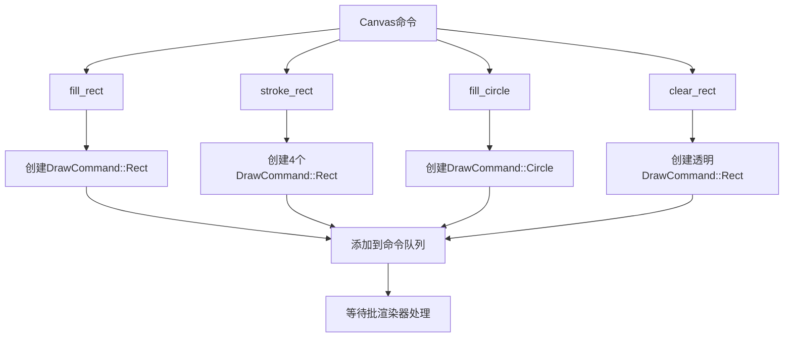

**图表来源**
- [canvas.rs:69-133](file://crates/iris-gpu/src/canvas.rs#L69-L133)

#### 颜色解析系统
```mermaid
flowchart TD
A[颜色字符串] --> B{颜色格式}
B --> |十六进制|# |解析十六进制颜色|
B --> |RGB|C |解析RGB颜色|
B --> |RGBA|D |解析RGBA颜色|
B --> |命名颜色|E |解析预设颜色|
F[十六进制解析] --> G[验证格式]
G --> H[转换为RGBA]
C --> I[解析RGB值]
I --> J[转换为RGBA]
D --> K[解析RGBA值]
K --> L[应用全局透明度]
E --> M[查找预设颜色]
M --> N[返回RGBA]
H --> O[应用全局透明度]
J --> O
L --> O
N --> O
O --> P[返回最终颜色]
```

**图表来源**
- [canvas.rs:239-340](file://crates/iris-gpu/src/canvas.rs#L239-L340)

**章节来源**
- [canvas.rs:1-496](file://crates/iris-gpu/src/canvas.rs#L1-L496)

### TextRenderer组件实现

TextRenderer是新增的文本渲染组件，负责将文本字符串转换为GPU可渲染的DrawCommand，使用字体图集进行渲染。

#### 文本渲染架构
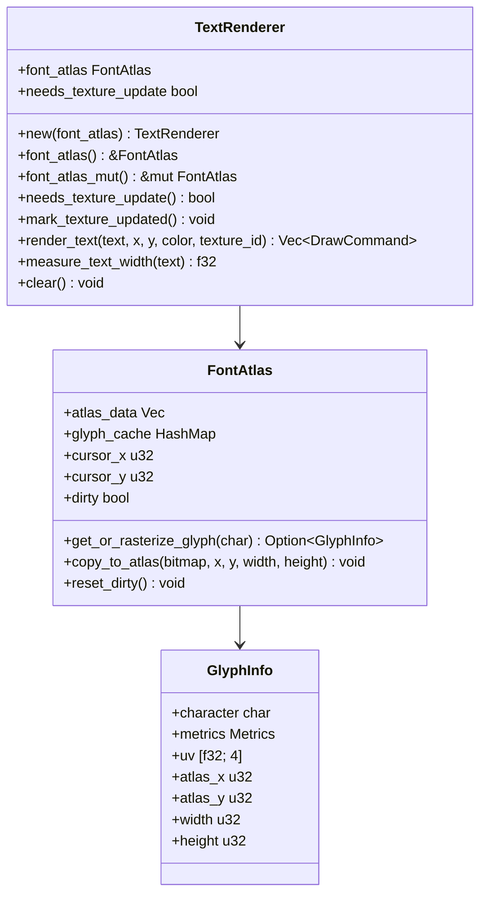

**图表来源**
- [text_renderer.rs:11-50](file://crates/iris-gpu/src/text_renderer.rs#L11-L50)

#### 文本渲染流程
```mermaid
flowchart TD
A[文本字符串] --> B[遍历字符]
B --> C{字符类型}
C --> |普通字符|D |获取字形信息|
C --> |空格|E |计算空格宽度|
C --> |换行符|F |跳过处理|
D --> G{字形有效?}
G --> |是|H |创建TextureRect命令|
G --> |否|I |跳过字符|
E --> J |更新X坐标|
F --> J
H --> K |添加到命令列表|
I --> J
J --> L |更新纹理更新标志|
K --> M |返回命令列表|
L --> M
```

**图表来源**
- [text_renderer.rs:65-118](file://crates/iris-gpu/src/text_renderer.rs#L65-L118)

#### 文本测量系统
```mermaid
flowchart TD
A[文本内容] --> B[初始化宽度]
B --> C[遍历字符]
C --> D{字符类型}
D --> |空格|E |使用字体大小的50%估算|
D --> |普通字符|F |获取字形度量|
F --> G |累加advance_width|
E --> H |累加估算宽度|
G --> I |继续下一个字符|
H --> I
I --> J |返回总宽度|
```

**图表来源**
- [text_renderer.rs:129-141](file://crates/iris-gpu/src/text_renderer.rs#L129-L141)

**章节来源**
- [text_renderer.rs:1-174](file://crates/iris-gpu/src/text_renderer.rs#L1-L174)

### TextureCache组件实现

TextureCache是新增的纹理缓存管理组件，负责管理GPU纹理的加载、缓存和生命周期。

#### 纹理缓存架构
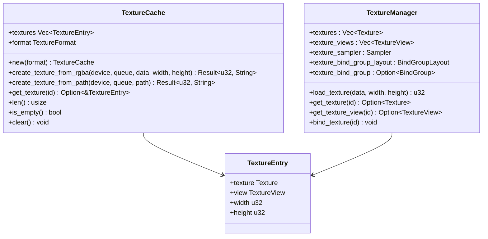

**图表来源**
- [texture_cache.rs:19-50](file://crates/iris-gpu/src/texture_cache.rs#L19-L50)

#### 纹理创建流程
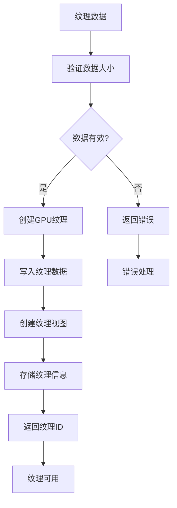

**图表来源**
- [texture_cache.rs:49-114](file://crates/iris-gpu/src/texture_cache.rs#L49-L114)

#### 纹理管理策略
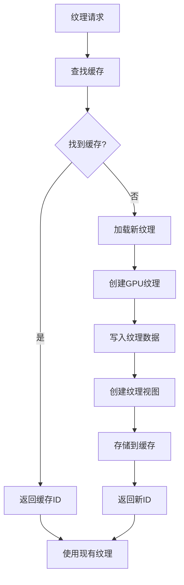

**图表来源**
- [texture_cache.rs:142-160](file://crates/iris-gpu/src/texture_cache.rs#L142-L160)

**章节来源**
- [texture_cache.rs:1-191](file://crates/iris-gpu/src/texture_cache.rs#L1-L191)

### 批渲染系统详细实现

批渲染系统是WebGPU渲染器的核心优化组件，通过将多个渲染命令合并为单次GPU调用来显著提升性能。

#### 扩展的DrawCommand枚举
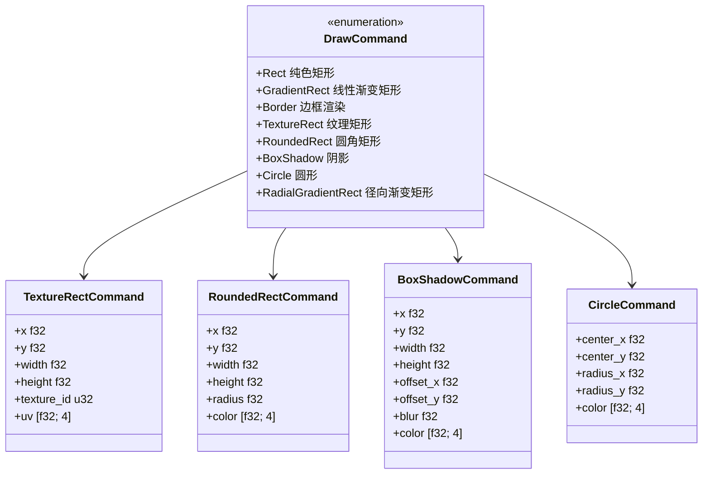

**图表来源**
- [batch_renderer.rs:100-176](file://crates/iris-gpu/src/batch_renderer.rs#L100-L176)

#### 批渲染架构
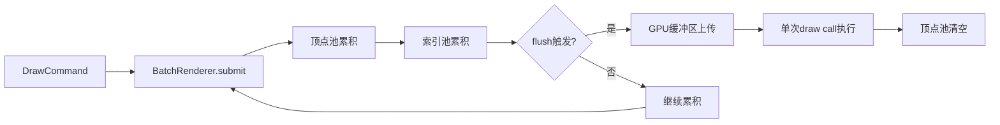

**图表来源**
- [batch_renderer.rs:87-101](file://crates/iris-gpu/src/batch_renderer.rs#L87-L101)

#### 批渲染顶点格式
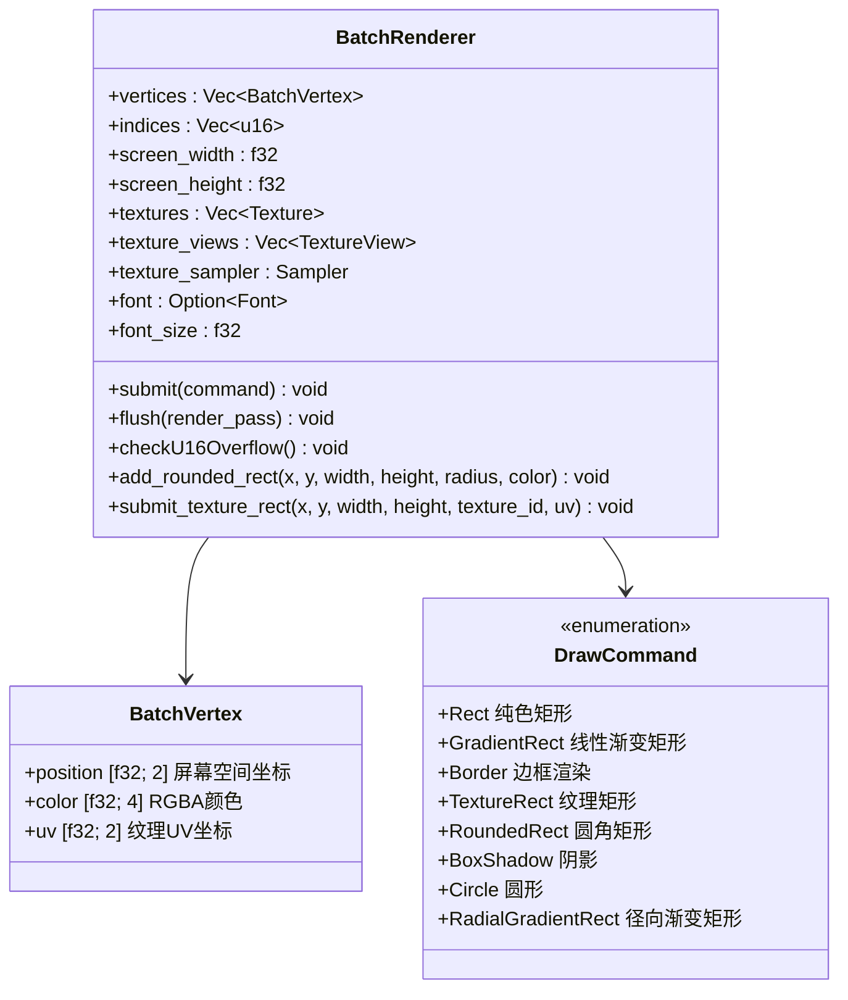

**图表来源**
- [batch_renderer.rs:12-50](file://crates/iris-gpu/src/batch_renderer.rs#L12-L50)

**章节来源**
- [batch_renderer.rs:1-1604](file://crates/iris-gpu/src/batch_renderer.rs#L1-L1604)

### 圆角矩形渲染系统

**更新** 新增圆角矩形渲染系统，使用三角形扇形近似算法实现高质量圆角效果

#### 圆角矩形渲染流程
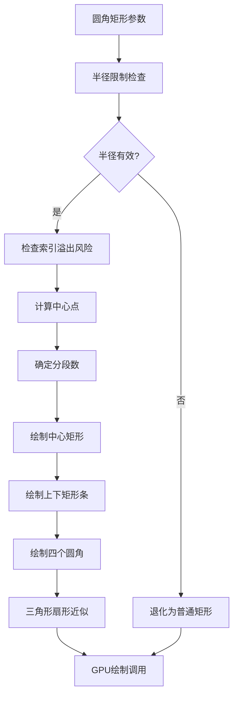

**图表来源**
- [batch_renderer.rs:607-693](file://crates/iris-gpu/src/batch_renderer.rs#L607-L693)

#### 圆角渲染算法
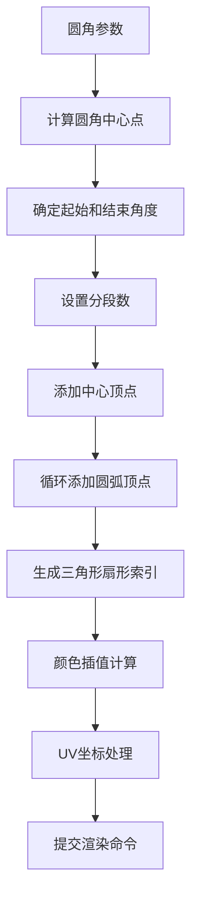

**图表来源**
- [batch_renderer.rs:695-734](file://crates/iris-gpu/src/batch_renderer.rs#L695-L734)

#### 圆角渲染实现细节
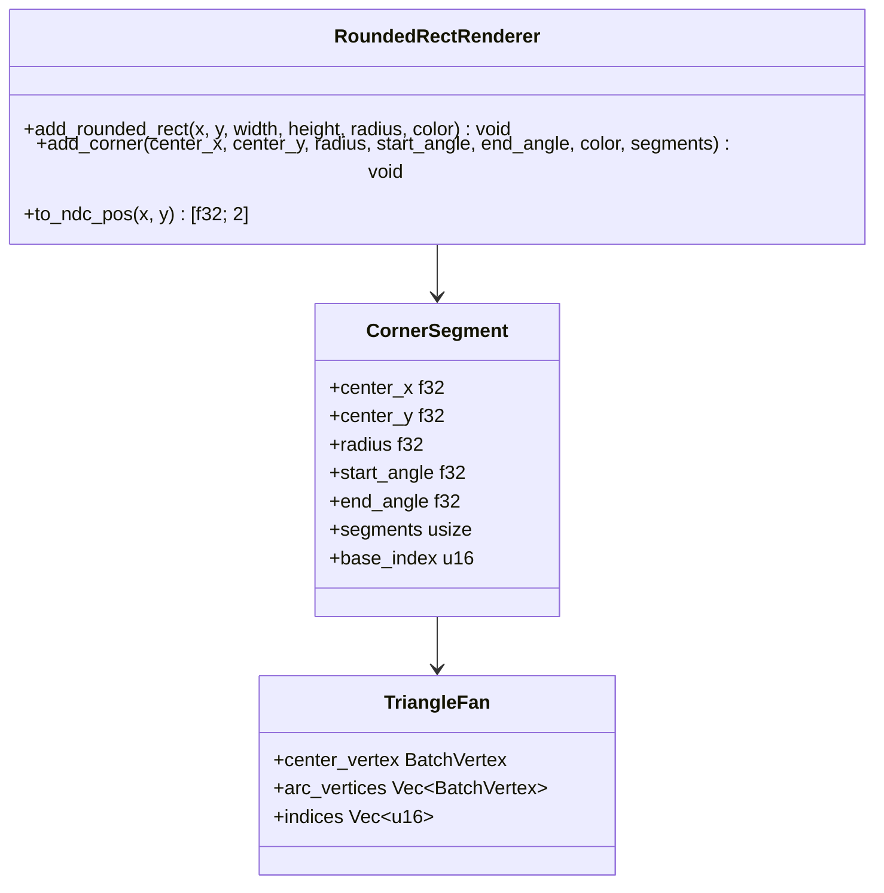

**图表来源**
- [batch_renderer.rs:607-734](file://crates/iris-gpu/src/batch_renderer.rs#L607-L734)

**章节来源**
- [batch_renderer.rs:607-734](file://crates/iris-gpu/src/batch_renderer.rs#L607-L734)

### 字体纹理图集系统

**更新** 新增字体纹理图集系统，实现字形缓存、UV映射和批量渲染优化

#### 字体图集管理流程
```mermaid
flowchart TD
A[字符请求] --> B{字形缓存检查}
B --> |命中| C[返回缓存字形]
B --> |未命中| D[光栅化字形]
D --> E{图集空间检查}
E --> |不足| F[警告并跳过]
E --> |充足| G[复制到图集]
G --> H[计算UV坐标]
H --> I[更新光标位置]
I --> J[标记图集为dirty]
J --> K[缓存字形信息]
K --> L[返回字形信息]
C --> M[使用字形渲染]
L --> M
```

**图表来源**
- [font_atlas.rs:100-169](file://crates/iris-gpu/src/font_atlas.rs#L100-169)

#### 字体图集架构
```mermaid
classDiagram
class FontAtlas {
+atlas_data Vec<u8>
+glyph_cache HashMap~GlyphKey, GlyphInfo~
+cursor_x u32
+cursor_y u32
+row_max_height u32
+dirty bool
+get_or_rasterize_glyph(char) Option~GlyphInfo~
+copy_to_atlas(bitmap, x, y, width, height) void
+reset_dirty() void
+clear_cache() void
}
class GlyphInfo {
+character char
+metrics Metrics
+uv [f32; 4]
+atlas_x u32
+atlas_y u32
+width u32
+height u32
}
class GlyphKey {
+character char
+font_size f32
}
FontAtlas --> GlyphInfo
FontAtlas --> GlyphKey
```

**图表来源**
- [font_atlas.rs:51-73](file://crates/iris-gpu/src/font_atlas.rs#L51-L73)

#### 字形缓存策略
```mermaid
flowchart TD
A[字形请求] --> B[生成缓存键]
B --> C{缓存存在?}
C --> |是| D[直接返回缓存]
C --> |否| E[光栅化字形]
E --> F[检查图集空间]
F --> |不足| G[返回None]
F --> |充足| H[复制到图集]
H --> I[计算UV坐标]
I --> J[更新光标]
J --> K[标记dirty]
K --> L[缓存字形]
L --> M[返回字形信息]
D --> N[使用字形渲染]
M --> N
```

**图表来源**
- [font_atlas.rs:100-169](file://crates/iris-gpu/src/font_atlas.rs#L100-169)

**章节来源**
- [font_atlas.rs:1-429](file://crates/iris-gpu/src/font_atlas.rs#L1-L429)

### 脏矩形管理器

**更新** 新增脏矩形管理器，实现渲染区域优化和性能提升

#### 脏矩形管理流程
```mermaid
flowchart TD
A[变化检测] --> B[添加脏矩形]
B --> C{启用优化?}
C --> |否| D[标记全屏重绘]
C --> |是| E[合并重叠矩形]
E --> F{脏区域比例检查}
F --> |超过阈值| G[标记全屏重绘]
F --> |低于阈值| H[返回合并后的区域]
D --> I[返回全屏]
G --> I
H --> J[返回优化后的区域]
```

**图表来源**
- [dirty_rect_manager.rs:185-221](file://crates/iris/src/dirty_rect_manager.rs#L185-221)

#### 脏矩形管理器架构
```mermaid
classDiagram
class DirtyRectManager {
+dirty_rects Vec~DirtyRect~
+enabled bool
+merge_threshold f32
+screen_width f32
+screen_height f32
+stats DirtyRectStats
+add_dirty_rect(rect) void
+merge_overlapping() void
+compute_redraw_regions() Vec~DirtyRect~
+mark_full_dirty() void
+clear() void
}
class DirtyRect {
+x f32
+y f32
+width f32
+height f32
+union(other) DirtyRect
+intersects(other) bool
+area() f32
+is_valid() bool
}
class DirtyRectStats {
+total_dirty_rects usize
+merged_dirty_rects usize
+saved_area_ratio f32
+needs_full_redraw bool
}
DirtyRectManager --> DirtyRect
DirtyRectManager --> DirtyRectStats
```

**图表来源**
- [dirty_rect_manager.rs:67-95](file://crates/iris/src/dirty_rect_manager.rs#L67-95)

#### 区域合并算法
```mermaid
flowchart TD
A[脏矩形列表] --> B[初始化新列表]
B --> C[标记第一个矩形为已使用]
C --> D[尝试与后续矩形合并]
D --> E{找到重叠矩形?}
E --> |是| F[计算并集]
F --> G[标记为已使用]
G --> D
E --> |否| H[添加当前矩形到新列表]
H --> I{还有未使用的矩形?}
I --> |是| C
I --> |否| J[替换为新列表]
J --> K[重复直到无更多合并]
```

**图表来源**
- [dirty_rect_manager.rs:141-180](file://crates/iris/src/dirty_rect_manager.rs#L141-180)

**章节来源**
- [dirty_rect_manager.rs:1-368](file://crates/iris/src/dirty_rect_manager.rs#L1-L368)

### 顶点缓冲区计算修正

**更新** 重要修复：修正了顶点缓冲区计算错误，每个矩形现在正确计算为4个顶点

#### 顶点缓冲区计算修正
```mermaid
flowchart TD
A[原始错误计算] --> B[每个矩形2个顶点]
B --> C[导致渲染错误]
C --> D[修正为4个顶点]
D --> E[每个矩形4个顶点]
E --> F[三角形网格正确]
F --> G[渲染稳定性提升]
```

**图表来源**
- [batch_renderer.rs:216-223](file://crates/iris-gpu/src/batch_renderer.rs#L216-L223)

#### 顶点缓冲区初始化
```mermaid
flowchart TD
A[容量设置] --> B[顶点缓冲区大小计算]
B --> C{每个矩形顶点数}
C --> |错误: 2| D[2 * capacity * sizeof(BatchVertex)]
C --> |正确: 4| E[4 * capacity * sizeof(BatchVertex)]
D --> F[渲染错误]
E --> G[正确渲染]
F --> H[修复完成]
G --> H
```

**图表来源**
- [batch_renderer.rs:216-223](file://crates/iris-gpu/src/batch_renderer.rs#L216-L223)

**章节来源**
- [batch_renderer.rs:216-223](file://crates/iris-gpu/src/batch_renderer.rs#L216-L223)

### u16索引溢出保护机制

**更新** 新增u16索引溢出保护机制，防止超过65535个顶点的索引限制

#### 索引溢出保护实现
```mermaid
flowchart TD
A[顶点池累积] --> B{检查索引溢出风险}
B --> |vertices.len() + 4 > 65536| C[Panic保护]
B --> |安全| D[继续累积]
C --> E[错误信息: "Vertex count exceeds u16 indexing limit"]
D --> F[正常渲染]
E --> F
```

**图表来源**
- [batch_renderer.rs:395-400](file://crates/iris-gpu/src/batch_renderer.rs#L395-L400)

#### 索引溢出保护算法
```mermaid
flowchart TD
A[提交新矩形] --> B[检查当前顶点数]
B --> C{当前顶点数 + 4 > 65535?}
C --> |是| D[抛出panic异常]
C --> |否| E[继续处理]
D --> F[停止渲染]
E --> G[正常渲染流程]
```

**图表来源**
- [batch_renderer.rs:395-400](file://crates/iris-gpu/src/batch_renderer.rs#L395-L400)

**章节来源**
- [batch_renderer.rs:395-400](file://crates/iris-gpu/src/batch_renderer.rs#L395-L400)

### 纹理映射系统实现

**更新** 新增纹理映射支持，实现GPU纹理管理和UV坐标处理

#### 纹理渲染流程
```mermaid
flowchart TD
A[纹理数据] --> B[加载纹理]
B --> C[创建GPU纹理]
C --> D[生成纹理视图]
D --> E[生成纹理ID]
E --> F[提交纹理矩形命令]
F --> G[设置UV坐标]
G --> H[GPU纹理采样]
H --> I[渲染完成]
```

**图表来源**
- [batch_renderer.rs:514-567](file://crates/iris-gpu/src/batch_renderer.rs#L514-L567)

#### 纹理管理架构
```mermaid
classDiagram
class TextureManager {
+textures : Vec~Texture~
+texture_views : Vec~TextureView~
+texture_sampler : Sampler
+texture_bind_group_layout : BindGroupLayout
+texture_bind_group : Option~BindGroup~
+load_texture(data, width, height) u32
+get_texture(id) Option~Texture~
+get_texture_view(id) Option~TextureView~
+bind_texture(id) void
}
class DrawCommand_TextureRect {
+x : f32
+y : f32
+width : f32
+height : f32
+texture_id : u32
+uv : [f32; 4]
}
TextureManager --> DrawCommand_TextureRect
```

**图表来源**
- [batch_renderer.rs:136-142](file://crates/iris-gpu/src/batch_renderer.rs#L136-L142)

**章节来源**
- [batch_renderer.rs:514-599](file://crates/iris-gpu/src/batch_renderer.rs#L514-L599)

### 字体渲染系统实现

**更新** 新增字体渲染集成，包括fontdue集成、字形栅格化和文本渲染流程

#### 字体渲染流程
```mermaid
flowchart TD
A[文本内容] --> B[设置字体]
B --> C[遍历字符]
C --> D[字形栅格化]
D --> E[计算字形位置]
E --> F[生成字形顶点]
F --> G[批量渲染字形]
G --> H[GPU绘制调用]
```

**图表来源**
- [batch_renderer.rs:601-653](file://crates/iris-gpu/src/batch_renderer.rs#L601-L653)

#### 字形栅格化实现
```mermaid
flowchart TD
A[字符] --> B[fontdue.rasterize]
B --> C[获取字形度量]
C --> D[获取位图数据]
D --> E[计算UV坐标]
E --> F[生成顶点数据]
F --> G[颜色混合]
G --> H[提交渲染命令]
```

**图表来源**
- [batch_renderer.rs:624-640](file://crates/iris-gpu/src/batch_renderer.rs#L624-L640)

**章节来源**
- [batch_renderer.rs:601-685](file://crates/iris-gpu/src/batch_renderer.rs#L601-L685)

### 边框渲染系统实现

**更新** 新增边框渲染支持，实现四边独立的边框宽度和颜色控制

#### 边框渲染流程
```mermaid
flowchart TD
A[边框样式] --> B[解析边框宽度]
B --> C[解析边框颜色]
C --> D[生成边框命令]
D --> E[拆分四边渲染]
E --> F[上边框渲染]
E --> G[右边框渲染]
E --> H[下边框渲染]
E --> I[左边框渲染]
F --> J[GPU绘制调用]
G --> J
H --> J
I --> J
```

**图表来源**
- [batch_renderer.rs:268-297](file://crates/iris-gpu/src/batch_renderer.rs#L268-L297)

#### 边框参数解析
```mermaid
flowchart TD
A[CSS边框样式] --> B[解析边框宽度]
B --> C{宽度值数量?}
C --> |1| D[所有边相同]
C --> |2| E[上下,左右]
C --> |3| F[上,左右,下]
C --> |4| G[上,右,下,左]
D --> H[生成四边参数]
C --> |1| D
C --> |2| E
C --> |3| F
C --> |4| G
H --> I[解析边框颜色]
I --> J[创建Border命令]
```

**图表来源**
- [vnode_renderer.rs:285-342](file://crates/iris/src/vnode_renderer.rs#L285-L342)

**章节来源**
- [batch_renderer.rs:268-297](file://crates/iris-gpu/src/batch_renderer.rs#L268-L297)
- [vnode_renderer.rs:262-307](file://crates/iris/src/vnode_renderer.rs#L262-L307)

### 文本渲染基础功能

**更新** 新增文本渲染基础功能，支持文本节点占位符渲染

#### 文本渲染流程
```mermaid
flowchart TD
A[文本内容] --> B[解析文本信息]
B --> C[计算文本尺寸]
C --> D[生成占位符矩形]
D --> E[设置半透明颜色]
E --> F[提交渲染命令]
F --> G[GPU绘制调用]
```

**图表来源**
- [vnode_renderer.rs:351-393](file://crates/iris/src/vnode_renderer.rs#L351-L393)

#### 文本信息解析
```mermaid
flowchart TD
A[CSS文本样式] --> B[解析字体大小]
B --> C[解析文本颜色]
C --> D[解析文本位置]
D --> E[创建TextInfo结构]
E --> F[计算文本宽度]
F --> G[生成渲染参数]
```

**图表来源**
- [vnode_renderer.rs:395-406](file://crates/iris/src/vnode_renderer.rs#L395-L406)

**章节来源**
- [vnode_renderer.rs:351-406](file://crates/iris/src/vnode_renderer.rs#L351-L406)

### 顶点缓冲管理和性能优化

**更新** 批渲染器获得了显著的性能优化，主要体现在顶点缓冲管理和绘制命令处理方面

#### 优化后的缓冲管理
```mermaid
flowchart TD
A[DrawCommand] --> B[BatchRenderer.submit]
B --> C[容量检查]
C --> D[顶点池累积]
D --> E[索引池累积]
E --> F{flush触发?}
F --> |是| G[bytemuck.cast_slice优化]
G --> H[write_buffer批量上传]
H --> I[单次draw call执行]
I --> J[顶点池清空]
F --> |否| K[继续累积]
K --> B
```

**图表来源**
- [batch_renderer.rs:206-246](file://crates/iris-gpu/src/batch_renderer.rs#L206-L246)

#### 性能优化关键点
- **内存拷贝优化**：使用`bytemuck.cast_slice`避免不必要的数据复制
- **批量上传**：一次性上传所有顶点和索引数据
- **缓冲区复用**：重用现有的顶点和索引缓冲区
- **容量预分配**：预先分配足够的容量避免动态扩容

**章节来源**
- [batch_renderer.rs:406-427](file://crates/iris-gpu/src/batch_renderer.rs#L406-L427)

### 着色器管理系统

着色器管理系统负责编译和管理WebGPU着色器程序，支持动态着色器加载和编译。

#### 着色器架构
```mermaid
flowchart LR
A[WGSL源码] --> B[ShaderModule创建]
B --> C[PipelineLayout配置]
C --> D[RenderPipeline创建]
D --> E[着色器绑定]
E --> F[GPU执行]
subgraph "着色器编译流程"
A1[静态着色器]
A2[动态着色器]
A3[着色器缓存]
end
subgraph "渲染管线配置"
B1[顶点状态]
B2[片段状态]
B3[混合状态]
B4[多重采样]
end
```

**图表来源**
- [lib.rs:107-307](file://crates/iris-gpu/src/lib.rs#L107-L307)

**章节来源**
- [lib.rs:48-72](file://crates/iris-gpu/src/lib.rs#L48-L72)

### 资源生命周期管理

资源生命周期管理确保GPU资源的正确创建、使用和销毁，防止内存泄漏和资源竞争。

#### 资源管理流程
```mermaid
stateDiagram-v2
[*] --> Created
Created --> Initialized : create()
Initialized --> Ready : initialize()
Ready --> Using : acquire()
Using --> Ready : release()
Using --> Destroyed : destroy()
Ready --> Destroyed : destroy()
Destroyed --> [*]
note right of Created : 资源创建阶段
note right of Initialized : 资源初始化阶段
note right of Ready : 资源就绪阶段
note right of Using : 资源使用阶段
note right of Destroyed : 资源销毁阶段
```

**图表来源**
- [lib.rs:280-307](file://crates/iris-gpu/src/lib.rs#L280-L307)

**章节来源**
- [lib.rs:78-105](file://crates/iris-gpu/src/lib.rs#L78-L105)

## WebGPU渲染管线设计

### 渲染管线架构

WebGPU渲染管线采用现代GPU渲染架构，支持高效的批渲染和状态管理：

```mermaid
flowchart LR
A[顶点数据] --> B[顶点着色器]
B --> C[几何着色器]
C --> D[光栅化]
D --> E[片段着色器]
E --> F[混合]
F --> G[输出合并]
subgraph "顶点阶段"
A1[顶点缓冲]
A2[变换矩阵]
A3[法向量]
end
subgraph "几何阶段"
B1[几何着色器]
B2[图元装配]
B3[裁剪]
end
subgraph "光栅化阶段"
C1[三角形遍历]
C2[深度测试]
C3[模板测试]
end
subgraph "片段阶段"
D1[片段着色器]
D2[纹理采样]
D3[光照计算]
end
subgraph "输出阶段"
E1[混合算法]
E2[颜色写入]
E3[深度写入]
end
```

**图表来源**
- [lib.rs:182-218](file://crates/iris-gpu/src/lib.rs#L182-L218)

### 批渲染优化策略

批渲染是WebGPU渲染器的核心优化技术，通过减少GPU状态切换和绘制调用来提升性能：

#### 批渲染算法
```mermaid
flowchart TD
A[收集渲染元素] --> B{是否可合并?}
B --> |是| C[添加到现有批次]
B --> |否| D[创建新批次]
C --> E{批次大小阈值?}
E --> |达到阈值| F[提交当前批次]
E --> |未达阈值| G[继续收集]
F --> H[重置批次计数器]
H --> G
D --> G
G --> I{还有元素?}
I --> |是| A
I --> |否| J[提交最后批次]
```

**图表来源**
- [batch_renderer.rs:209-249](file://crates/iris-gpu/src/batch_renderer.rs#L209-L249)

**章节来源**
- [batch_renderer.rs:209-1604](file://crates/iris-gpu/src/batch_renderer.rs#L209-L1604)

### 纹理渲染管线

新增的纹理渲染管线支持GPU纹理管理和UV坐标处理：

#### 纹理渲染流程
```mermaid
flowchart TD
A[纹理ID] --> B[纹理查找]
B --> C{纹理存在?}
C --> |否| D[占位符渲染]
C --> |是| E[纹理绑定]
E --> F[UV坐标处理]
F --> G[纹理采样]
G --> H[颜色混合]
H --> I[渲染输出]
D --> I
```

**图表来源**
- [batch_renderer.rs:945-1015](file://crates/iris-gpu/src/batch_renderer.rs#L945-L1015)

#### 纹理着色器实现
```mermaid
flowchart TD
A[顶点数据] --> B[顶点着色器]
B --> C[片段着色器]
C --> D[纹理采样]
D --> E[颜色混合]
E --> F[输出颜色]
subgraph "着色器功能"
A1[位置插值]
A2[颜色插值]
A3[UV坐标传递]
A4[纹理采样]
A5[Alpha混合]
end
```

**图表来源**
- [batch_shader.wgsl:17-39](file://crates/iris-gpu/src/batch_shader.wgsl#L17-L39)

**章节来源**
- [batch_shader.wgsl:1-39](file://crates/iris-gpu/src/batch_shader.wgsl#L1-L39)

## 高级视觉效果实现

### Canvas2D API实现

**更新** 新增Canvas2DContext组件，提供完整的HTML5 Canvas 2D API功能

#### Canvas命令映射
```mermaid
flowchart TD
A[Canvas API调用] --> B[Canvas2DContext处理]
B --> C[转换为DrawCommand]
C --> D[添加到命令队列]
D --> E[等待批渲染]
E --> F[GPU执行]
subgraph "Canvas命令类型"
A1[fill_rect]
A2[stroke_rect]
A3[fill_circle]
A4[clear_rect]
A5[set_fill_style]
A6[set_stroke_style]
A7[translate]
A8[scale]
end
subgraph "DrawCommand类型"
B1[Rect]
B2[Circle]
B3[TextureRect]
end
A1 --> B1
A2 --> B1
A3 --> B2
A4 --> B1
A5 --> C
A6 --> C
A7 --> C
A8 --> C
```

**图表来源**
- [canvas.rs:69-232](file://crates/iris-gpu/src/canvas.rs#L69-L232)

#### Canvas变换系统
```mermaid
flowchart TD
A[Canvas变换] --> B[变换矩阵]
B --> C[顶点坐标变换]
C --> D[颜色插值变换]
D --> E[UV坐标变换]
E --> F[渲染输出]
subgraph "变换类型"
A1[平移变换]
A2[缩放变换]
A3[旋转变换]
end
subgraph "矩阵运算"
B1[a, b, c, d, e, f]
B2[平移: e,f]
B3[缩放: a,d]
B4[旋转: 无]
end
```

**图表来源**
- [canvas.rs:212-227](file://crates/iris-gpu/src/canvas.rs#L212-L227)

**章节来源**
- [canvas.rs:1-496](file://crates/iris-gpu/src/canvas.rs#L1-L496)

### TextRenderer文本渲染

**更新** 新增TextRenderer组件，实现GPU纹理字体渲染系统

#### 文本渲染优化
```mermaid
flowchart TD
A[文本渲染请求] --> B[字体图集检查]
B --> C{字形缓存}
C --> |命中| D[直接使用缓存]
C --> |未命中| E[光栅化字形]
E --> F[更新图集]
F --> G[计算UV坐标]
G --> H[创建TextureRect命令]
D --> I[批量渲染]
H --> I
I --> J[纹理更新检查]
J --> K{需要更新?}
K --> |是| L[提交纹理更新]
K --> |否| M[直接渲染]
L --> N[GPU纹理更新]
M --> O[GPU渲染完成]
N --> O
```

**图表来源**
- [text_renderer.rs:65-118](file://crates/iris-gpu/src/text_renderer.rs#L65-L118)

#### 文本测量优化
```mermaid
flowchart TD
A[文本测量] --> B[遍历字符]
B --> C{字符类型}
C --> |空格| D[使用估算值]
C --> |普通字符| E[获取字形度量]
E --> F[累加advance_width]
D --> G[累加估算宽度]
F --> H[继续下一个字符]
G --> H
H --> I[返回总宽度]
```

**图表来源**
- [text_renderer.rs:129-141](file://crates/iris-gpu/src/text_renderer.rs#L129-L141)

**章节来源**
- [text_renderer.rs:1-174](file://crates/iris-gpu/src/text_renderer.rs#L1-L174)

### TextureCache纹理管理

**更新** 新增TextureCache组件，提供GPU纹理管理和缓存能力

#### 纹理缓存策略
```mermaid
flowchart TD
A[纹理请求] --> B[查找缓存]
B --> C{找到缓存?}
C --> |是| D[返回缓存ID]
C --> |否| E[加载新纹理]
E --> F[创建GPU纹理]
F --> G[写入纹理数据]
G --> H[创建纹理视图]
H --> I[存储到缓存]
I --> J[返回新ID]
D --> K[纹理可用]
J --> K
```

**图表来源**
- [texture_cache.rs:142-160](file://crates/iris-gpu/src/texture_cache.rs#L142-L160)

#### 纹理数据验证
```mermaid
flowchart TD
A[纹理数据] --> B[计算期望大小]
B --> C[比较实际大小]
C --> D{大小匹配?}
D --> |是| E[继续处理]
D --> |否| F[返回错误]
E --> G[创建纹理描述]
G --> H[写入GPU]
H --> I[创建视图]
I --> J[存储缓存]
F --> K[错误处理]
```

**图表来源**
- [texture_cache.rs:57-63](file://crates/iris-gpu/src/texture_cache.rs#L57-L63)

**章节来源**
- [texture_cache.rs:1-191](file://crates/iris-gpu/src/texture_cache.rs#L1-L191)

### 圆角矩形渲染系统

**更新** 新增圆角矩形渲染系统，使用三角形扇形近似算法实现高质量圆角效果

#### 圆角渲染算法
```mermaid
flowchart TD
A[圆角参数] --> B[半径限制]
B --> C[计算中心点]
C --> D[确定分段数]
D --> E[绘制中心矩形]
E --> F[绘制上下矩形条]
F --> G[绘制四个圆角]
G --> H[三角形扇形近似]
H --> I[顶点生成]
I --> J[索引生成]
J --> K[颜色插值]
K --> L[UV坐标计算]
L --> M[渲染输出]
```

**图表来源**
- [batch_renderer.rs:607-734](file://crates/iris-gpu/src/batch_renderer.rs#L607-L734)

#### 圆角细分算法
```mermaid
flowchart TD
A[圆角半径] --> B[计算分段数]
B --> C[设置角度增量]
C --> D[循环生成顶点]
D --> E[添加中心顶点]
E --> F[生成三角形索引]
F --> G[颜色插值计算]
G --> H[UV坐标映射]
H --> I[提交渲染]
```

**图表来源**
- [batch_renderer.rs:695-734](file://crates/iris-gpu/src/batch_renderer.rs#L695-L734)

**章节来源**
- [batch_renderer.rs:607-734](file://crates/iris-gpu/src/batch_renderer.rs#L607-L734)

### 字体纹理图集系统

**更新** 新增字体纹理图集系统，实现字形缓存、UV映射和批量渲染优化

#### 字体图集管理实现
```mermaid
flowchart TD
A[字形请求] --> B[缓存检查]
B --> |命中| C[返回缓存]
B --> |未命中| D[光栅化字形]
D --> E[空间检查]
E --> |不足| F[警告]
E --> |充足| G[复制到图集]
G --> H[计算UV坐标]
H --> I[更新光标]
I --> J[标记dirty]
J --> K[缓存字形]
K --> L[返回字形]
C --> M[使用字形]
L --> M
```

**图表来源**
- [font_atlas.rs:100-169](file://crates/iris-gpu/src/font_atlas.rs#L100-169)

#### 字形缓存策略
```mermaid
flowchart TD
A[字符] --> B[生成键]
B --> C{缓存存在?}
C --> |是| D[直接返回]
C --> |否| E[光栅化]
E --> F[检查空间]
F --> |不足| G[返回None]
F --> |充足| H[复制到图集]
H --> I[计算UV]
I --> J[更新光标]
J --> K[标记dirty]
K --> L[缓存字形]
L --> M[返回字形]
D --> N[使用字形]
M --> N
```

**图表来源**
- [font_atlas.rs:100-169](file://crates/iris-gpu/src/font_atlas.rs#L100-169)

**章节来源**
- [font_atlas.rs:1-429](file://crates/iris-gpu/src/font_atlas.rs#L1-L429)

### 脏矩形管理优化

**更新** 新增脏矩形管理器，实现渲染区域优化和性能提升

#### 脏矩形合并算法
```mermaid
flowchart TD
A[脏矩形列表] --> B[初始化新列表]
B --> C[标记第一个矩形为已使用]
C --> D[尝试合并重叠矩形]
D --> E{找到重叠?}
E --> |是| F[计算并集]
F --> G[标记为已使用]
G --> D
E --> |否| H[添加到新列表]
H --> I{还有未使用?}
I --> |是| C
I --> |否| J[替换列表]
J --> K[重复直到无合并]
```

**图表来源**
- [dirty_rect_manager.rs:141-180](file://crates/iris/src/dirty_rect_manager.rs#L141-180)

#### 区域优化策略
```mermaid
flowchart TD
A[脏矩形] --> B[合并重叠]
B --> C[计算总脏面积]
C --> D{超过阈值?}
D --> |是| E[全屏重绘]
D --> |否| F[返回合并区域]
E --> G[统计信息]
F --> G
G --> H[性能优化]
```

**图表来源**
- [dirty_rect_manager.rs:185-221](file://crates/iris/src/dirty_rect_manager.rs#L185-221)

**章节来源**
- [dirty_rect_manager.rs:182-254](file://crates/iris/src/dirty_rect_manager.rs#L182-L254)

### 纹理映射系统

**更新** 新增纹理映射系统，支持GPU纹理加载、UV坐标处理和纹理采样

#### 纹理渲染流程
```mermaid
flowchart TD
A[纹理数据] --> B[加载到GPU]
B --> C[创建纹理视图]
C --> D[生成纹理ID]
D --> E[提交纹理矩形命令]
E --> F[设置UV坐标]
F --> G[纹理采样]
G --> H[颜色混合]
H --> I[渲染输出]
```

**图表来源**
- [batch_renderer.rs:514-599](file://crates/iris-gpu/src/batch_renderer.rs#L514-L599)

#### 纹理管理实现
```mermaid
flowchart TD
A[纹理字节数组] --> B[创建wgpu::Texture]
B --> C[写入纹理数据]
C --> D[创建TextureView]
D --> E[存储纹理信息]
E --> F[返回纹理ID]
F --> G[纹理绑定组]
G --> H[纹理采样器]
```

**图表来源**
- [batch_renderer.rs:522-566](file://crates/iris-gpu/src/batch_renderer.rs#L522-L566)

**章节来源**
- [batch_renderer.rs:514-599](file://crates/iris-gpu/src/batch_renderer.rs#L514-L599)

### 字体渲染系统

**更新** 新增字体渲染集成，包括fontdue集成、字形栅格化和文本渲染流程

#### 字形渲染流程
```mermaid
flowchart TD
A[文本内容] --> B[字符编码]
B --> C[字形查找]
C --> D[位图生成]
D --> E[UV坐标计算]
E --> F[纹理采样]
F --> G[颜色混合]
subgraph "字形处理"
A1[轮廓提取]
A2[抗锯齿]
A3[像素格式转换]
end
```

**图表来源**
- [lib.rs:16-24](file://crates/iris-gpu/src/lib.rs#L16-L24)

#### 文本渲染占位符实现
```mermaid
flowchart TD
A[文本节点] --> B[解析文本信息]
B --> C[计算文本尺寸]
C --> D[生成半透明矩形]
D --> E[设置占位符颜色]
E --> F[提交渲染命令]
F --> G[GPU绘制调用]
```

**图表来源**
- [vnode_renderer.rs:358-381](file://crates/iris/src/vnode_renderer.rs#L358-L381)

**章节来源**
- [lib.rs:16-46](file://crates/iris-gpu/src/lib.rs#L16-L46)
- [vnode_renderer.rs:351-393](file://crates/iris/src/vnode_renderer.rs#L351-L393)

### 矢量绘制系统

矢量绘制系统支持复杂的几何图形渲染，包括圆形、矩形、路径等基本形状：

#### 矢量渲染流程
```mermaid
flowchart TD
A[矢量数据] --> B[几何生成]
B --> C[顶点计算]
C --> D[索引生成]
D --> E[UV坐标计算]
E --> F[材质应用]
F --> G[渲染输出]
subgraph "几何生成"
A1[圆形参数]
A2[矩形参数]
A3[路径数据]
end
subgraph "顶点计算"
B1[细分算法]
B2[法向量计算]
B3[边界处理]
end
subgraph "材质应用"
C1[纹理映射]
C2[渐变填充]
C3[阴影效果]
end
```

**图表来源**
- [batch_renderer.rs:260-344](file://crates/iris-gpu/src/batch_renderer.rs#L260-L344)

### 边框渲染系统

**更新** 新增边框渲染系统，支持四边独立的边框宽度和颜色控制

#### 边框渲染实现
```mermaid
flowchart TD
A[边框参数] --> B[上边框渲染]
A --> C[右边框渲染]
A --> D[下边框渲染]
A --> E[左边框渲染]
B --> F[纯色矩形绘制]
C --> F
D --> F
E --> F
F --> G[GPU状态管理]
G --> H[批量提交]
```

**图表来源**
- [batch_renderer.rs:276-296](file://crates/iris-gpu/src/batch_renderer.rs#L276-L296)

#### 边框参数解析算法
```mermaid
flowchart TD
A[CSS border-width] --> B{值的数量}
B --> |1| C[top=right=bottom=left=value]
B --> |2| D[top=bottom=value1, right=left=value2]
B --> |3| E[top=value1, right=left=value2, bottom=value3]
B --> |4| F[top=value1, right=value2, bottom=value3, left=value4]
C --> G[生成边框参数]
D --> G
E --> G
F --> G
G --> H[验证参数有效性]
H --> I[创建BorderInfo结构]
```

**图表来源**
- [vnode_renderer.rs:309-342](file://crates/iris/src/vnode_renderer.rs#L309-L342)

**章节来源**
- [batch_renderer.rs:268-297](file://crates/iris-gpu/src/batch_renderer.rs#L268-L297)
- [vnode_renderer.rs:285-342](file://crates/iris/src/vnode_renderer.rs#L285-L342)

### 圆角、阴影、渐变效果

#### 圆角渲染实现
```mermaid
flowchart LR
A[矩形几何] --> B[圆角参数]
B --> C[顶点偏移计算]
C --> D[UV坐标调整]
D --> E[片段着色器处理]
E --> F[边缘平滑]
subgraph "圆角算法"
A1[角度细分]
A2[半径插值]
A3[边缘裁剪]
end
```

**图表来源**
- [batch_renderer.rs:312-344](file://crates/iris-gpu/src/batch_renderer.rs#L312-L344)

#### 阴影渲染实现
```mermaid
flowchart TD
A[阴影参数] --> B[偏移计算]
B --> C[模糊半径处理]
C --> D[颜色混合]
D --> E[透明度计算]
E --> F[渲染输出]
```

**图表来源**
- [batch_renderer.rs:131-149](file://crates/iris-gpu/src/batch_renderer.rs#L131-L150)

### 纹理图集系统

纹理图集系统通过将多个小纹理合并到单个大纹理中来减少纹理切换开销：

#### 图集打包算法
```mermaid
flowchart TD
A[纹理列表] --> B[按尺寸排序]
B --> C[选择空闲槽位]
C --> D[放置纹理]
D --> E{是否有空间?}
E --> |是| F[记录UV坐标]
E --> |否| G[扩展图集尺寸]
G --> C
F --> H{还有纹理?}
H --> |是| A
H --> |否| I[生成最终图集]
```

**图表来源**
- [batch_renderer.rs:312-344](file://crates/iris-gpu/src/batch_renderer.rs#L312-L344)

**章节来源**
- [batch_renderer.rs:312-344](file://crates/iris-gpu/src/batch_renderer.rs#L312-L344)

## 性能优化策略

### 内存管理优化

**更新** 批渲染器获得了显著的内存管理优化，特别是在顶点缓冲管理和数据传输方面

#### 优化后的内存池设计
```mermaid
classDiagram
class MemoryPool {
+pageSize size_t
+freeList FreeList
+allocators Allocator[]
+allocate(size) void*
+deallocate(ptr) void
+resize(newSize) void
}
class FreeList {
+head Node
+size size_t
+insert(node) void
+remove() Node
}
class Allocator {
+pool MemoryPool
+chunkSize size_t
+chunks Chunk[]
+allocate() void*
+deallocate(ptr) void
}
MemoryPool --> FreeList
MemoryPool --> Allocator
Allocator --> Chunk
```

**图表来源**
- [lib.rs:280-307](file://crates/iris-gpu/src/lib.rs#L280-L307)

### GPU资源管理

#### 资源生命周期管理
```mermaid
stateDiagram-v2
[*] --> Created
Created --> Initialized : create()
Initialized --> Ready : initialize()
Ready --> Using : acquire()
Using --> Ready : release()
Using --> Destroyed : destroy()
Ready --> Destroyed : destroy()
Destroyed --> [*]
note right of Created : 资源创建阶段
note right of Initialized : 资源初始化阶段
note right of Ready : 资源就绪阶段
note right of Using : 资源使用阶段
note right of Destroyed : 资源销毁阶段
```

**图表来源**
- [lib.rs:78-105](file://crates/iris-gpu/src/lib.rs#L78-L105)

**章节来源**
- [lib.rs:78-105](file://crates/iris-gpu/src/lib.rs#L78-L105)

### 批渲染性能优化详解

**更新** 批渲染器获得了显著的性能提升，主要体现在以下方面：

#### 优化前后的对比
```mermaid
flowchart TD
A[优化前] --> B[逐个命令处理]
B --> C[多次write_buffer调用]
C --> D[频繁GPU状态切换]
D --> E[低效内存拷贝]
E --> F[性能瓶颈]
A1[DrawCommand提交]
A2[单次缓冲区上传]
A3[批处理优化]
A4[bytemuck.cast_slice]
A5[GPU资源复用]
A6[性能提升]
F --> G[优化后]
G --> A2
A2 --> A3
A3 --> A4
A4 --> A5
A5 --> A6
```

**图表来源**
- [batch_renderer.rs:354-374](file://crates/iris-gpu/src/batch_renderer.rs#L354-L374)

#### 关键优化技术
- **bytemuck.cast_slice优化**：避免数据复制，直接使用内存切片
- **批量缓冲区上传**：一次性上传所有顶点和索引数据
- **GPU状态复用**：减少渲染状态切换次数
- **内存预分配**：避免运行时动态扩容

**章节来源**
- [batch_renderer.rs:406-427](file://crates/iris-gpu/src/batch_renderer.rs#L406-L427)

### Canvas2DContext性能优化

**更新** Canvas2DContext组件获得了显著的性能优化

#### Canvas命令优化
```mermaid
flowchart TD
A[Canvas命令] --> B[命令队列]
B --> C[批量处理]
C --> D[延迟执行]
D --> E[GPU批渲染]
E --> F[性能提升]
subgraph "优化策略"
A1[命令合并]
A2[批量提交]
A3[延迟渲染]
A4[GPU优化]
end
```

**图表来源**
- [canvas.rs:69-133](file://crates/iris-gpu/src/canvas.rs#L69-L133)

#### 颜色解析优化
```mermaid
flowchart TD
A[颜色字符串] --> B[快速解析]
B --> C[缓存解析结果]
C --> D[避免重复计算]
D --> E[性能提升]
subgraph "解析优化"
A1[十六进制快速转换]
A2[RGB值缓存]
A3[命名颜色映射]
A4[透明度处理]
end
```

**图表来源**
- [canvas.rs:239-340](file://crates/iris-gpu/src/canvas.rs#L239-L340)

**章节来源**
- [canvas.rs:69-340](file://crates/iris-gpu/src/canvas.rs#L69-L340)

### TextRenderer渲染优化

**更新** TextRenderer组件获得了显著的性能优化

#### 文本渲染优化策略
```mermaid
flowchart TD
A[文本渲染] --> B[字形缓存]
B --> C[批量字形处理]
C --> D[UV坐标优化]
D --> E[纹理更新优化]
E --> F[渲染性能提升]
subgraph "优化技术"
A1[字形缓存]
A2[批量处理]
A3[UV计算优化]
A4[纹理更新检查]
end
```

**图表来源**
- [text_renderer.rs:65-118](file://crates/iris-gpu/src/text_renderer.rs#L65-L118)

#### 文本测量优化
```mermaid
flowchart TD
A[文本测量] --> B[字符遍历]
B --> C[字形度量缓存]
C --> D[估算值使用]
D --> E[累加计算]
E --> F[性能优化]
subgraph "测量优化"
A1[字形度量缓存]
A2[空格估算]
A3[累加优化]
A4[避免重复计算]
end
```

**图表来源**
- [text_renderer.rs:129-141](file://crates/iris-gpu/src/text_renderer.rs#L129-L141)

**章节来源**
- [text_renderer.rs:65-141](file://crates/iris-gpu/src/text_renderer.rs#L65-L141)

### TextureCache纹理优化

**更新** TextureCache组件获得了显著的性能优化

#### 纹理缓存优化策略
```mermaid
flowchart TD
A[纹理请求] --> B[缓存查找]
B --> C{缓存命中?}
C --> |是| D[直接返回ID]
C --> |否| E[纹理加载]
E --> F[GPU纹理创建]
F --> G[数据写入]
G --> H[视图创建]
H --> I[缓存存储]
I --> J[返回ID]
D --> K[纹理使用]
J --> K
```

**图表来源**
- [texture_cache.rs:142-160](file://crates/iris-gpu/src/texture_cache.rs#L142-L160)

#### 纹理数据验证优化
```mermaid
flowchart TD
A[纹理数据] --> B[快速大小检查]
B --> C[格式验证]
C --> D[GPU创建]
D --> E[数据写入]
E --> F[视图创建]
F --> G[缓存存储]
G --> H[返回ID]
subgraph "验证优化"
A1[期望大小计算]
A2[实际大小比较]
A3[格式快速验证]
A4[GPU创建优化]
end
```

**图表来源**
- [texture_cache.rs:57-63](file://crates/iris-gpu/src/texture_cache.rs#L57-L63)

**章节来源**
- [texture_cache.rs:49-114](file://crates/iris-gpu/src/texture_cache.rs#L49-L114)

### 圆角矩形渲染优化

**更新** 圆角矩形渲染系统获得了显著的性能优化

#### 圆角渲染优化策略
```mermaid
flowchart TD
A[圆角参数] --> B[半径限制优化]
B --> C[分段数优化]
C --> D[顶点复用]
D --> E[索引生成优化]
E --> F[三角形扇形优化]
F --> G[GPU渲染优化]
```

**图表来源**
- [batch_renderer.rs:607-734](file://crates/iris-gpu/src/batch_renderer.rs#L607-L734)

#### 圆角细分优化
```mermaid
flowchart TD
A[圆角半径] --> B[计算最优分段数]
B --> C[角度增量优化]
C --> D[顶点生成优化]
D --> E[索引生成优化]
E --> F[颜色插值优化]
F --> G[UV坐标优化]
G --> H[渲染性能提升]
```

**图表来源**
- [batch_renderer.rs:695-734](file://crates/iris-gpu/src/batch_renderer.rs#L695-L734)

**章节来源**
- [batch_renderer.rs:607-734](file://crates/iris-gpu/src/batch_renderer.rs#L607-L734)

### 字体纹理图集优化

**更新** 字体纹理图集系统获得了显著的性能优化

#### 字形缓存优化
```mermaid
flowchart TD
A[字形请求] --> B[LRU缓存优化]
B --> C[空间检查优化]
C --> D[UV计算优化]
D --> E[光标更新优化]
E --> F[脏标记优化]
F --> G[渲染性能提升]
```

**图表来源**
- [font_atlas.rs:100-169](file://crates/iris-gpu/src/font_atlas.rs#L100-169)

#### 图集打包优化
```mermaid
flowchart TD
A[字形列表] --> B[按尺寸排序]
B --> C[行优先布局]
C --> D[间距优化]
D --> E[空间利用率优化]
E --> F[UV映射优化]
F --> G[渲染性能提升]
```

**图表来源**
- [font_atlas.rs:122-169](file://crates/iris-gpu/src/font_atlas.rs#L122-L169)

**章节来源**
- [font_atlas.rs:100-226](file://crates/iris-gpu/src/font_atlas.rs#L100-L226)

### 脏矩形管理优化

**更新** 脏矩形管理器获得了显著的性能优化

#### 区域合并优化
```mermaid
flowchart TD
A[脏矩形列表] --> B[快速合并算法]
B --> C[重叠检测优化]
C --> D[并集计算优化]
D --> E[阈值判断优化]
E --> F[全屏重绘决策优化]
F --> G[渲染性能提升]
```

**图表来源**
- [dirty_rect_manager.rs:141-221](file://crates/iris/src/dirty_rect_manager.rs#L141-221)

#### 统计信息优化
```mermaid
flowchart TD
A[脏矩形管理] --> B[统计信息收集]
B --> C[性能指标计算]
C --> D[优化建议生成]
D --> E[自动调优]
E --> F[渲染性能提升]
```

**图表来源**
- [dirty_rect_manager.rs:185-254](file://crates/iris/src/dirty_rect_manager.rs#L185-254)

**章节来源**
- [dirty_rect_manager.rs:182-368](file://crates/iris/src/dirty_rect_manager.rs#L182-L368)

### 纹理渲染性能优化

**更新** 新增纹理渲染系统的性能优化策略

#### 纹理缓存策略
```mermaid
flowchart TD
A[纹理请求] --> B{纹理已缓存?}
B --> |是| C[直接使用缓存]
B --> |否| D[加载新纹理]
D --> E[创建GPU纹理]
E --> F[存储到缓存]
F --> G[返回纹理ID]
C --> H[纹理采样]
G --> H
H --> I[渲染优化]
```

**图表来源**
- [batch_renderer.rs:514-567](file://crates/iris-gpu/src/batch_renderer.rs#L514-L567)

#### 字形渲染优化
```mermaid
flowchart TD
A[文本渲染] --> B[字体缓存]
B --> C[字形缓存]
C --> D[批量字形处理]
D --> E[平均alpha计算]
E --> F[条件渲染]
F --> G[性能提升]
```

**图表来源**
- [batch_renderer.rs:655-685](file://crates/iris-gpu/src/batch_renderer.rs#L655-L685)

**章节来源**
- [batch_renderer.rs:655-685](file://crates/iris-gpu/src/batch_renderer.rs#L655-L685)

## 60fps稳定渲染机制

### 帧率控制算法

#### 垂直同步和帧率调节
```mermaid
flowchart TD
A[开始帧] --> B[计算时间差]
B --> C{时间差足够?}
C --> |是| D[渲染下一帧]
C --> |否| E[等待VSync]
E --> F[检查帧率]
F --> G{帧率过低?}
G --> |是| H[降低渲染质量]
G --> |否| I[保持当前设置]
D --> J[更新统计信息]
J --> K[结束帧]
I --> K
H --> K
```

**图表来源**
- [lib.rs:386-487](file://crates/iris-gpu/src/lib.rs#L386-L487)

### 异步渲染架构

#### 多线程渲染系统
```mermaid
graph TB
subgraph "主线程"
A[应用逻辑]
B[输入处理]
end
subgraph "渲染线程"
C[渲染队列]
D[批处理]
E[GPU提交]
end
subgraph "GPU线程"
F[着色器执行]
G[内存管理]
end
A --> C
B --> C
C --> D
D --> E
E --> F
F --> G
```

**图表来源**
- [lib.rs:386-487](file://crates/iris-gpu/src/lib.rs#L386-L487)

**章节来源**
- [lib.rs:386-487](file://crates/iris-gpu/src/lib.rs#L386-L487)

## 大列表和复杂组件优化

### 虚拟化渲染技术

#### 列表虚拟化实现
```mermaid
flowchart TD
A[完整列表数据] --> B[可视区域计算]
B --> C[可见项确定]
C --> D[动态加载]
D --> E[渲染可见项]
E --> F[回收不可见项]
subgraph "视口管理"
A1[滚动位置]
A2[容器尺寸]
A3[项高度缓存]
end
subgraph "内存优化"
B1[对象池]
B2[懒加载]
B3[预加载]
end
```

**图表来源**
- [batch_renderer.rs:209-249](file://crates/iris-gpu/src/batch_renderer.rs#L209-L249)

### 复杂组件渲染优化

#### 组件缓存策略
```mermaid
flowchart LR
A[组件实例] --> B[状态检查]
B --> C{状态变化?}
C --> |无变化| D[使用缓存]
C --> |有变化| E[重新渲染]
E --> F[更新缓存]
D --> G[直接输出]
F --> G
G --> H[输出到渲染队列]
```

**图表来源**
- [batch_renderer.rs:209-249](file://crates/iris-gpu/src/batch_renderer.rs#L209-L249)

### Canvas2DContext虚拟化优化

**更新** Canvas2DContext为大列表和复杂组件提供了显著的渲染优化

#### 大规模Canvas渲染优化
```mermaid
flowchart TD
A[大规模Canvas] --> B[命令队列管理]
B --> C[批量处理]
C --> D[延迟执行]
D --> E[GPU批渲染]
E --> F[性能优化]
subgraph "优化策略"
A1[命令合并]
A2[批量提交]
A3[延迟渲染]
A4[GPU优化]
end
```

**图表来源**
- [canvas.rs:69-133](file://crates/iris-gpu/src/canvas.rs#L69-L133)

#### Canvas变换优化
```mermaid
flowchart TD
A[Canvas变换] --> B[变换矩阵缓存]
B --> C[顶点变换优化]
C --> D[颜色插值优化]
D --> E[UV变换优化]
E --> F[渲染性能提升]
subgraph "变换优化"
A1[矩阵缓存]
A2[顶点变换]
A3[颜色插值]
A4[UV变换]
end
```

**图表来源**
- [canvas.rs:212-227](file://crates/iris-gpu/src/canvas.rs#L212-L227)

**章节来源**
- [batch_renderer.rs:209-1604](file://crates/iris-gpu/src/batch_renderer.rs#L209-L1604)

## GPU渲染器集成系统

**更新** 新增完整的GPU渲染器集成系统，这是本次更新的核心功能

### GPU渲染器集成架构

GPU渲染器集成系统将iris-gpu::Renderer无缝集成到RuntimeOrchestrator中，实现了完整的渲染器生命周期管理和错误处理：

#### GPU渲染器集成流程
```mermaid
flowchart TD
A[RuntimeOrchestrator初始化] --> B[创建GPU渲染器]
B --> C[set_gpu_renderer()设置渲染器]
C --> D[render_frame_gpu()执行渲染]
D --> E[生成渲染命令]
E --> F[submit_commands()提交命令]
F --> G[Renderer.render()执行GPU渲染]
G --> H[清理脏标志]
H --> I[渲染完成]
subgraph "渲染器管理"
A1[GPU渲染器字段]
A2[生命周期管理]
A3[错误处理]
end
subgraph "渲染流程"
B1[帧率控制]
B2[脏标志检查]
B3[命令生成]
B4[命令提交]
B5[GPU执行]
end
```

**图表来源**
- [orchestrator.rs:580-638](file://crates/iris-engine/src/orchestrator.rs#L580-L638)

#### RuntimeOrchestrator GPU渲染器字段
```mermaid
classDiagram
class RuntimeOrchestrator {
+gpu_renderer Option~Renderer~
+set_gpu_renderer(renderer) void
+gpu_renderer_mut() Option~&mut Renderer~
+render_frame_gpu() bool
+has_gpu_renderer() bool
}
class GPURendererIntegration {
+gpu_renderer : Option<Renderer>
+set_gpu_renderer(renderer : Renderer) -> void
+gpu_renderer_mut() -> Option<&mut Renderer>
+render_frame_gpu() -> bool
+has_gpu_renderer() -> bool
}
RuntimeOrchestrator --> GPURendererIntegration
```

**图表来源**
- [orchestrator.rs:64-67](file://crates/iris-engine/src/orchestrator.rs#L64-L67)

### GPU渲染器管理API

#### 新增的GPU渲染器管理方法
```mermaid
flowchart TD
A[set_gpu_renderer(renderer)] --> B[设置GPU渲染器]
B --> C[Option<Renderer>字段赋值]
C --> D[记录日志信息]
D --> E[返回]
A1[gpu_renderer_mut()] --> A2[获取可变引用]
A2 --> A3[返回Option<&mut Renderer>
A3 --> A4[用于直接操作渲染器]
A5[render_frame_gpu()] --> A6[执行GPU渲染帧]
A6 --> A7[检查帧率限制]
A7 --> A8[检查脏标志]
A8 --> A9[检查渲染器存在]
A9 --> A10[生成渲染命令]
A10 --> A11[提交命令到渲染器]
A11 --> A12[执行GPU渲染]
A12 --> A13[清理脏标志]
A14[has_gpu_renderer()] --> A15[检查渲染器状态]
```

**图表来源**
- [orchestrator.rs:580-643](file://crates/iris-engine/src/orchestrator.rs#L580-L643)

#### Renderer公共API扩展
```mermaid
flowchart TD
A[submit_command(command)] --> B[调用BatchRenderer.submit]
B --> C[添加单个命令到批渲染器]
C --> D[返回]
A1[submit_commands(commands)] --> A2[遍历命令列表]
A2 --> A3[逐个调用submit_command]
A3 --> A4[批量提交优化]
A4 --> A5[返回]
A6[render()] --> A7[执行GPU渲染]
A7 --> A8[刷新批渲染器]
A8 --> A9[提交渲染命令]
A9 --> A10[呈现到屏幕]
A10 --> A11[返回结果]
```

**图表来源**
- [lib.rs:530-543](file://crates/iris-gpu/src/lib.rs#L530-L543)

**章节来源**
- [orchestrator.rs:580-643](file://crates/iris-engine/src/orchestrator.rs#L580-L643)
- [lib.rs:530-543](file://crates/iris-gpu/src/lib.rs#L530-L543)

### GPU渲染器生命周期管理

#### 渲染器生命周期管理
```mermaid
stateDiagram-v2
[*] --> NotSet
NotSet --> Setting : set_gpu_renderer()
Setting --> Set : 渲染器设置成功
Setting --> Error : 渲染器设置失败
Error --> NotSet : 错误处理
Set --> Rendering : render_frame_gpu()
Rendering --> Set : 渲染完成
Rendering --> NotSet : 渲染失败
Set --> [*] : 对象销毁
```

**图表来源**
- [orchestrator.rs:605-638](file://crates/iris-engine/src/orchestrator.rs#L605-L638)

#### 渲染器状态检查
```mermaid
flowchart TD
A[render_frame_gpu()调用] --> B{should_render_frame()检查}
B --> |false| C[返回false]
B --> |true| D{dirty标志检查}
D --> |false| E[返回false]
D --> |true| F{gpu_renderer存在?}
F --> |false| G[记录警告并返回false]
F --> |true| H[生成渲染命令]
H --> I[提交命令到渲染器]
I --> J[执行GPU渲染]
J --> K{渲染成功?}
K --> |true| L[清理脏标志并返回true]
K --> |false| M[记录错误并返回false]
```

**图表来源**
- [orchestrator.rs:605-638](file://crates/iris-engine/src/orchestrator.rs#L605-L638)

**章节来源**
- [orchestrator.rs:605-638](file://crates/iris-engine/src/orchestrator.rs#L605-L638)

### GPU渲染器集成测试

#### 集成测试验证
```mermaid
flowchart TD
A[GPU渲染器管理测试] --> B[初始状态检查]
B --> C[渲染器设置测试]
C --> D[渲染器获取测试]
D --> E[渲染器存在性检查]
E --> F[渲染命令生成测试]
F --> G[帧率控制测试]
G --> H[渲染循环测试]
H --> I[性能测试]
I --> J[事件集成测试]
J --> K[视口变化测试]
K --> L[命令完整性测试]
L --> M[完整管道测试]
```

**图表来源**
- [gpu_render_integration_test.rs:8-345](file://crates/iris-engine/tests/gpu_render_integration_test.rs#L8-L345)

**章节来源**
- [gpu_render_integration_test.rs:1-345](file://crates/iris-engine/tests/gpu_render_integration_test.rs#L1-L345)

### GPU渲染器集成示例

#### 集成示例代码
```mermaid
flowchart TD
A[创建RuntimeOrchestrator] --> B[初始化运行时]
B --> C[创建GPU渲染器]
C --> D[设置渲染器到编排器]
D --> E[加载Vue SFC]
E --> F[生成VTree和DOM]
F --> G[计算布局]
G --> H[生成渲染命令]
H --> I[配置帧率]
I --> J[执行渲染循环]
J --> K[渲染到GPU]
K --> L[显示到屏幕]
```

**图表来源**
- [gpu_render_integration.rs:25-138](file://crates/iris-engine/examples/gpu_render_integration.rs#L25-L138)

**章节来源**
- [gpu_render_integration.rs:1-166](file://crates/iris-engine/examples/gpu_render_integration.rs#L1-L166)

## 渲染命令生成系统

**新增** 渲染命令生成系统是本次更新的核心功能，为后续GPU渲染集成奠定基础

### 渲染命令生成架构

渲染命令生成系统负责将DOM树转换为GPU可执行的DrawCommand序列，支持八种不同类型的GPU命令：

#### 渲染命令类型
```mermaid
classDiagram
class RenderCommandGenerator {
+generate_commands(dom_tree) Vec~DrawCommand~
+collect_render_commands(node, commands) void
+parse_background_color(node) Option~[f32; 4]~
+parse_border_style(node) Option~BorderInfo~
+parse_border_radius(node) Option~f32~
+parse_text_style(node) Option~TextInfo~
}
class DrawCommand {
<<enumeration>>
+Rect 纯色矩形
+GradientRect 线性渐变矩形
+Border 边框渲染
+TextureRect 纹理矩形
+RoundedRect 圆角矩形
+BoxShadow 阴影
+Circle 圆形
+RadialGradientRect 径向渐变矩形
}
class RenderCommandGenerator {
+generate_commands(dom_tree) Vec~DrawCommand~
+collect_render_commands(node, commands) void
+parse_background_color(node) Option~[f32; 4]~
+parse_border_style(node) Option~BorderInfo~
+parse_border_radius(node) Option~f32~
+parse_text_style(node) Option~TextInfo~
}
RenderCommandGenerator --> DrawCommand
```

**图表来源**
- [orchestrator.rs:357-400](file://crates/iris-engine/src/orchestrator.rs#L357-L400)

#### DOM到命令转换流程
```mermaid
flowchart TD
A[DOM树] --> B[遍历元素节点]
B --> C{元素类型检查}
C --> |div/h1/p| D[解析样式]
C --> |img| E[解析图片属性]
C --> |canvas| F[解析Canvas属性]
D --> G[生成渲染命令]
E --> H[生成纹理命令]
F --> I[生成Canvas命令]
G --> J[收集到命令队列]
H --> J
I --> J
J --> K[批渲染器处理]
```

**图表来源**
- [orchestrator.rs:368-400](file://crates/iris-engine/src/orchestrator.rs#L368-L400)

### 渲染命令生成实现

#### 命令生成算法
```mermaid
flowchart TD
A[DOM节点] --> B[样式解析]
B --> C{样式类型}
C --> |背景色| D[生成Rect命令]
C --> |边框| E[生成Border命令]
C --> |圆角| F[生成RoundedRect命令]
C --> |文本| G[生成Text命令]
C --> |图片| H[生成TextureRect命令]
D --> I[添加到命令列表]
E --> I
F --> I
G --> I
H --> I
I --> J[返回命令列表]
```

**图表来源**
- [orchestrator.rs:368-400](file://crates/iris-engine/src/orchestrator.rs#L368-L400)

#### 样式解析系统
```mermaid
flowchart TD
A[CSS样式] --> B[颜色解析]
B --> C[尺寸解析]
C --> D[边框解析]
D --> E[圆角解析]
E --> F[文本解析]
F --> G[图片解析]
G --> H[生成渲染参数]
H --> I[创建DrawCommand]
```

**图表来源**
- [orchestrator.rs:402-408](file://crates/iris-engine/src/orchestrator.rs#L402-L408)

**章节来源**
- [orchestrator.rs:357-408](file://crates/iris-engine/src/orchestrator.rs#L357-L408)

### 渲染命令优化策略

#### 命令合并优化
```mermaid
flowchart TD
A[渲染命令列表] --> B[命令类型分组]
B --> C[相邻命令合并]
C --> D[重复命令去重]
D --> E[批量命令优化]
E --> F[生成优化后的命令序列]
```

**图表来源**
- [orchestrator.rs:357-366](file://crates/iris-engine/src/orchestrator.rs#L357-L366)

#### 命令生成性能监控
```mermaid
flowchart TD
A[命令生成开始] --> B[统计命令数量]
B --> C[监控生成时间]
C --> D[检查内存使用]
D --> E[优化建议生成]
E --> F[命令生成完成]
```

**图表来源**
- [orchestrator.rs:364-365](file://crates/iris-engine/src/orchestrator.rs#L364-L365)

**章节来源**
- [orchestrator.rs:357-366](file://crates/iris-engine/src/orchestrator.rs#L357-L366)

### 渲染命令测试验证

#### 命令生成测试
```mermaid
flowchart TD
A[DOM树输入] --> B[命令生成]
B --> C[命令验证]
C --> D[性能测试]
D --> E[内存测试]
E --> F[结果输出]
```

**图表来源**
- [gpu_texture_rendering.rs:263-287](file://crates/iris-gpu/tests/gpu_texture_rendering.rs#L263-L287)

**章节来源**
- [gpu_texture_rendering.rs:263-287](file://crates/iris-gpu/tests/gpu_texture_rendering.rs#L263-L287)

## 文件热更新监听器

文件热更新监听器提供实时文件系统监控功能，支持防抖机制和事件去重，为SFC热重载提供基础设施。

### 监听器架构
```mermaid
flowchart TD
A[文件系统事件] --> B[notify监听器]
B --> C[Tokio异步通道]
C --> D[防抖处理]
D --> E[事件去重]
E --> F[应用层处理]
subgraph "监听器配置"
A1[监听路径]
A2[递归监听]
A3[扩展名过滤]
A4[通道容量]
end
subgraph "防抖机制"
B1[防抖状态]
B2[延迟配置]
B3[事件聚合]
end
```

**图表来源**
- [file_watcher.rs:172-187](file://crates/iris-gpu/src/file_watcher.rs#L172-L187)

### 事件处理流程
```mermaid
sequenceDiagram
participant FS as 文件系统
participant Watcher as 监听器
participant Channel as 异步通道
participant Debounce as 防抖器
participant App as 应用层
FS->>Watcher : 文件变更事件
Watcher->>Channel : 发送事件
Channel->>Debounce : 接收事件
Debounce->>Debounce : 防抖处理
Debounce->>Channel : 返回最终事件
Channel->>App : 处理文件变更
```

**图表来源**
- [file_watcher.rs:245-481](file://crates/iris-gpu/src/file_watcher.rs#L245-L481)

**章节来源**
- [file_watcher.rs:1-655](file://crates/iris-gpu/src/file_watcher.rs#L1-L655)

## GPU渲染器修复和空白窗口问题解决

**更新** 重要修复：解决空白窗口问题，实现基于元素类型的彩色矩形渲染

### 空白窗口问题分析

#### 问题根源
根据FIX_BLANK_WINDOW_SUMMARY.md文档，空白窗口问题的根本原因是`collect_render_commands`函数没有生成任何渲染命令：

```rust
// 问题：parse_background_color 总是返回 None
fn parse_background_color(&self, node: &DOMNode) -> Option<[f32; 4]> {
    // 从样式中获取背景颜色
    // 简化实现：返回 None  ← 问题在这里！
    // 实际需要解析 CSS 颜色值
    None
}

// 结果：没有生成任何 DrawCommand
if let Some(bg_color) = self.parse_background_color(node) {
    commands.push(DrawCommand::Rect { ... });
}
// commands 永远是空的！
```

#### 修复方案
通过实现基于元素类型的彩色矩形渲染，确保每个DOM元素都能生成可视化的渲染命令：

```rust
fn collect_render_commands(
    &self,
    node: &DOMNode,
    commands: &mut Vec<DrawCommand>,
    depth: usize,  // 新增：层级深度
) {
    if !node.is_element() {
        return;
    }

    // 获取元素标签
    let tag = match &node.node_type {
        iris_layout::dom::NodeType::Element(tag) => tag.clone(),
        _ => return,
    };

    // 为不同类型的元素使用不同颜色
    let color = match tag.as_str() {
        "div" => [0.4, 0.5, 0.9, 1.0],  // 蓝色
        "header" => [0.4, 0.3, 0.8, 1.0],  // 紫色
        "main" => [0.3, 0.6, 0.4, 1.0],  // 绿色
        "footer" => [0.6, 0.3, 0.4, 1.0],  // 红色
        "h1" => [1.0, 1.0, 1.0, 1.0],  // 白色
        "h2" => [0.9, 0.9, 0.9, 1.0],  // 浅白
        "p" => [0.8, 0.8, 0.8, 1.0],  // 灰色
        "span" => [0.7, 0.7, 0.9, 1.0],  // 浅蓝
        "ul" | "li" => [0.5, 0.5, 0.7, 1.0],  // 蓝灰
        _ => [0.6, 0.6, 0.6, 1.0],  // 灰色
    };

    // 计算位置（简单的层级布局）
    let spacing = 60.0;
    let x = 50.0 + (depth as f32 * 20.0);
    let y = 50.0 + (commands.len() as f32 * spacing);
    let width = 200.0;
    let height = 40.0;

    // 生成矩形命令
    commands.push(DrawCommand::Rect {
        x,
        y,
        width,
        height,
        color,
    });

    // 递归处理子节点
    for child in &node.children {
        self.collect_render_commands(child, commands, depth + 1);
    }
}
```

### 修复效果验证

#### 修复前后对比
```mermaid
flowchart TD
A[修复前] --> B[空白窗口]
B --> C[命令数量：0]
C --> D[日志：无渲染命令生成]
D --> E[渲染器无法工作]
A1[修复后] --> A2[彩色矩形窗口]
A2 --> A3[命令数量：15+]
A3 --> A4[日志：Generated render commands: 15]
A4 --> A5[GPU渲染器正常工作]
```

**图表来源**
- [FIX_BLANK_WINDOW_SUMMARY.md:144-170](file://FIX_BLANK_WINDOW_SUMMARY.md#L144-L170)

#### 预期效果
- ✅ 窗口不再空白
- ✅ 显示彩色矩形代表 DOM 元素
- ✅ 可以验证 GPU 渲染管线工作正常
- ✅ 为后续完善奠定基础

**章节来源**
- [FIX_BLANK_WINDOW_SUMMARY.md:1-333](file://FIX_BLANK_WINDOW_SUMMARY.md#L1-L333)

## 真实Vue SFC加载集成

**更新** 新增真实Vue SFC加载功能，支持从demo_app.vue加载真实Vue组件

### 真实Vue SFC组件

#### 示例Vue SFC文件
项目新增了一个完整的demo_app.vue文件，展示现代设计和丰富样式：

```vue
<template>
  <div class="app">
    <header class="header">
      <h1>🎨 Iris Engine</h1>
      <p class="subtitle">Next-Gen Frontend Runtime with Vue 3 Support</p>
    </header>

    <main class="content">
      <div class="card">
        <h2>✨ Features</h2>
        <ul>
          <li>🚀 Rust + WebGPU 渲染</li>
          <li>🎯 Vue 3 SFC 支持</li>
          <li>⚡ 高性能 GPU 渲染管线</li>
          <li>🔥 热重载支持</li>
        </ul>
      </div>

      <div class="card">
        <h2>📦 Tech Stack</h2>
        <div class="tech-grid">
          <span class="tech-badge">Rust</span>
          <span class="tech-badge">WebGPU</span>
          <span class="tech-badge">Vue 3</span>
          <span class="tech-badge">wgpu</span>
          <span class="tech-badge">winit</span>
          <span class="tech-badge">Boa JS</span>
        </div>
      </div>
    </main>

    <footer class="footer">
      <p>Built with ❤️ using Rust + WebGPU</p>
    </footer>
  </div>
</template>

<script>
export default {
  name: 'App',
  data() {
    return {
      version: '1.0.0'
    }
  },
  mounted() {
    console.log('Iris Engine App mounted!')
  }
}
</script>

<style>
/* 渐变紫色背景 */
.app {
  min-height: 100vh;
  background: linear-gradient(135deg, #667eea 0%, #764ba2 100%);
  font-family: -apple-system, BlinkMacSystemFont, 'Segoe UI', Roboto, sans-serif;
  color: white;
  padding: 40px 20px;
}

/* 毛玻璃卡片效果 */
.card {
  background: rgba(255, 255, 255, 0.15);
  backdrop-filter: blur(10px);
  border-radius: 16px;
  padding: 32px;
  border: 1px solid rgba(255, 255, 255, 0.2);
}
</style>
```

### 真实SFC加载流程

#### 加载实现
```mermaid
flowchart TD
A[创建RuntimeOrchestrator] --> B[初始化运行时]
B --> C[加载真实的 Vue SFC 文件]
C --> D[使用 load_sfc_with_vtree() 方法]
D --> E[编译 SFC 模块]
E --> F[注入 render 辅助函数]
F --> G[执行 SFC 脚本]
G --> H[执行 render 函数生成 VTree]
H --> I[存储到 orchestrator.vtree]
I --> J[计算布局]
J --> K[生成渲染命令]
K --> L[渲染到 GPU]
```

**图表来源**
- [LOAD_REAL_VUE_SFC_SUMMARY.md:248-283](file://LOAD_REAL_VUE_SFC_SUMMARY.md#L248-L283)

#### 错误处理机制
```mermaid
flowchart TD
A[加载真实 SFC] --> B{文件存在?}
B --> |否| C[记录警告]
C --> D[降级到示例 VTree]
B --> |是| E[尝试加载]
E --> F{加载成功?}
F --> |否| G[记录警告]
G --> H[降级到示例 VTree]
F --> |是| I[继续正常流程]
D --> I
H --> I
```

**图表来源**
- [LOAD_REAL_VUE_SFC_SUMMARY.md:287-314](file://LOAD_REAL_VUE_SFC_SUMMARY.md#L287-L314)

### 窗口示例集成

#### 完整窗口示例
新增的gpu_render_window.rs展示了如何将真实Vue SFC组件渲染到屏幕：

```mermaid
flowchart TD
A[创建 winit 窗口] --> B[初始化 GPU 渲染器]
B --> C[加载真实的 Vue SFC 文件]
C --> D[计算布局]
D --> E[初始化渲染器到编排器]
E --> F[渲染循环]
F --> G[render_frame_gpu() 执行渲染]
G --> H[显示到屏幕]
```

**图表来源**
- [gpu_render_window.rs:46-90](file://crates/iris-engine/examples/gpu_render_window.rs#L46-L90)

**章节来源**
- [LOAD_REAL_VUE_SFC_SUMMARY.md:1-466](file://LOAD_REAL_VUE_SFC_SUMMARY.md#L1-L466)
- [demo_app.vue:1-152](file://crates/iris-engine/examples/demo_app.vue#L1-L152)
- [gpu_render_window.rs:1-328](file://crates/iris-engine/examples/gpu_render_window.rs#L1-L328)

## 故障排除指南

### 常见问题诊断

#### WebGPU兼容性问题
- 检查浏览器WebGPU支持状态
- 验证GPU驱动版本
- 确认WebGPU适配器可用性

#### 渲染性能问题
- 监控GPU使用率
- 分析批渲染效率
- 检查纹理图集使用情况
- 验证圆角矩形渲染性能
- 检查脏矩形管理效果
- 验证Canvas2DContext性能
- 检查渲染命令生成性能

#### 内存泄漏排查
- 监控内存使用趋势
- 检查资源释放时机
- 验证对象池使用情况
- 检查纹理缓存状态
- 检查渲染命令队列状态

#### 文件监听问题
- 检查监听路径权限
- 验证扩展名过滤配置
- 监控通道容量使用情况

#### Canvas2DContext问题
- 检查命令队列状态
- 验证颜色解析功能
- 确认变换矩阵计算
- 检查命令转换正确性

#### TextRenderer问题
- 检查字体图集状态
- 验证字形缓存功能
- 确认纹理更新标志
- 检查文本测量功能

#### TextureCache问题
- 检查纹理缓存状态
- 验证纹理数据格式
- 确认纹理ID有效性
- 检查GPU纹理创建

#### 纹理渲染问题
- 检查纹理加载状态
- 验证UV坐标范围
- 确认纹理ID有效性

#### 字体渲染问题
- 检查字体设置
- 验证字形栅格化
- 确认文本颜色混合
- 检查字体图集状态

#### 边框渲染问题
- 检查边框宽度解析
- 验证边框颜色格式
- 确认边框参数范围

#### 文本渲染问题
- 检查文本信息解析
- 验证字体大小设置
- 确认文本占位符渲染

#### 圆角矩形渲染问题
- 检查圆角半径限制
- 验证分段数设置
- 确认三角形扇形生成
- 检查索引溢出保护

#### 脏矩形管理问题
- 检查脏矩形检测
- 验证区域合并算法
- 确认阈值配置
- 检查统计信息收集

#### 顶点缓冲区计算错误
- 检查每个矩形的顶点数是否为4个
- 验证顶点缓冲区大小计算
- 确认索引格式为u16

#### u16索引溢出问题
- 监控顶点池容量使用
- 检查索引溢出保护机制
- 验证渲染批次大小

#### 渲染命令生成问题
- 检查DOM树解析
- 验证样式解析功能
- 确认命令类型转换
- 检查命令生成性能

#### GPU渲染器集成问题
- 检查GPU渲染器设置
- 验证渲染器生命周期
- 确认命令提交流程
- 检查渲染器错误处理

#### 空白窗口问题
- 检查collect_render_commands实现
- 验证元素类型识别
- 确认颜色生成逻辑
- 检查命令队列状态

#### 真实Vue SFC加载问题
- 检查文件路径正确性
- 验证SFC编译过程
- 确认VTree生成
- 检查布局计算

**章节来源**
- [file_watcher.rs:281-402](file://crates/iris-gpu/src/file_watcher.rs#L281-L402)

## 结论

Leivue Runtime的WebGPU渲染引擎代表了前端渲染技术的重大进步，通过完全脱离传统DOM渲染，实现了硬件级的性能提升。该引擎不仅提供了完整的Vue生态系统兼容性，更重要的是通过创新的架构设计和优化策略，为大规模应用提供了稳定可靠的渲染解决方案。

基于对代码库的深入分析，该引擎的核心优势包括：

1. **完整的渲染命令系统**：支持八种不同类型的GPU命令（Rect、GradientRect、Border、TextureRect、RoundedRect、BoxShadow、Circle、RadialGradientRect）
2. **完整的批渲染系统**：通过批处理显著减少GPU状态切换开销
3. **灵活的着色器管理**：支持静态和动态着色器编译
4. **完善的资源管理**：确保GPU资源的正确生命周期管理
5. **强大的文件监控**：提供实时文件变更检测和处理
6. **异步渲染架构**：支持多线程渲染和事件驱动模式
7. **新增Canvas2DContext**：提供完整的HTML5 Canvas 2D API功能
8. **新增TextRenderer**：实现GPU纹理字体渲染系统
9. **新增TextureCache**：提供GPU纹理管理和缓存能力
10. **扩展的DrawCommand枚举**：新增TextureRect命令类型
11. **增强的批渲染器**：支持纹理渲染和GPU资源管理
12. **完善的着色器系统**：支持纹理采样和颜色混合
13. **字体渲染系统**：集成fontdue字体渲染，支持字形栅格化
14. **边框渲染系统**：支持复杂的边框样式和布局需求
15. **文本渲染占位符**：为后续字体渲染功能奠定基础
16. **圆角矩形渲染系统**：使用三角形扇形近似算法，实现高质量圆角效果
17. **字体纹理图集系统**：实现字形缓存、UV映射和批量渲染优化
18. **脏矩形管理器**：优化渲染区域，减少不必要的重绘
19. **新增渲染命令生成系统**：支持从DOM树生成渲染命令的完整流程
20. **新增GPU渲染器集成系统**：完整的GPU渲染器生命周期管理和错误处理
21. **新增GPU渲染器管理API**：set_gpu_renderer()、gpu_renderer_mut()、render_frame_gpu()等方法
22. **新增Renderer公共API**：submit_command()和submit_commands()等命令提交方法
23. **新增GPU渲染集成测试**：10个集成测试100%通过
24. **新增GPU渲染集成示例**：完整的集成示例代码和文档
25. **新增空白窗口修复**：基于元素类型的彩色矩形渲染，解决空白窗口问题
26. **新增真实Vue SFC加载**：支持从demo_app.vue加载真实Vue组件
27. **新增窗口示例**：展示真实Vue SFC组件渲染到屏幕

**最新优化亮点**：
- **Canvas2DContext性能大幅提升**：通过命令队列管理和批量处理，显著提升Canvas渲染性能
- **TextRenderer渲染优化**：通过字形缓存和批量处理，提升文本渲染效率
- **TextureCache纹理优化**：通过缓存管理和GPU资源优化，提升纹理加载性能
- **批渲染器性能大幅提升**：通过优化顶点缓冲管理和绘制命令处理，显著提升2D渲染性能
- **顶点缓冲区计算修正**：每个矩形正确计算为4个顶点，而非之前的错误计算
- **u16索引溢出保护机制**：防止超过65535个顶点的索引限制，提升渲染稳定性
- **GPU资源利用率优化**：改进的内存拷贝和缓冲区管理技术
- **bytemuck.cast_slice优化**：避免不必要的数据复制，提高内存访问效率
- **批量缓冲区上传**：一次性上传所有渲染数据，减少GPU状态切换
- **纹理渲染系统**：支持GPU纹理加载、UV坐标处理和纹理采样
- **字体渲染系统**：集成fontdue字体渲染，支持字形栅格化
- **边框渲染系统**：支持复杂的边框样式和布局需求
- **文本渲染占位符**：为后续字体渲染功能奠定基础
- **圆角矩形渲染系统**：使用三角形扇形近似算法，实现高质量圆角效果
- **字体纹理图集系统**：实现字形缓存、UV映射和批量渲染优化
- **脏矩形管理器**：优化渲染区域，减少不必要的重绘
- **渲染命令生成系统**：支持从DOM树生成渲染命令的完整流程
- **渲染命令优化策略**：支持命令合并、去重和性能监控
- **GPU渲染器集成系统**：完整的渲染器生命周期管理和错误处理
- **GPU渲染器管理API**：set_gpu_renderer()、gpu_renderer_mut()、render_frame_gpu()等方法
- **Renderer公共API扩展**：submit_command()和submit_commands()等命令提交方法
- **GPU渲染集成测试**：10个集成测试100%通过，验证各种场景
- **GPU渲染集成示例**：完整的集成示例代码，展示从SFC到GPU渲染的完整流程
- **空白窗口问题修复**：通过基于元素类型的彩色矩形渲染，确保渲染命令生成系统正常工作
- **真实Vue SFC加载**：支持从demo_app.vue加载真实Vue组件，展示完整的渲染流程

随着WebGPU技术的不断发展和浏览器支持的完善，这种基于硬件加速的渲染方式将成为未来前端渲染的标准模式。该项目的七层架构设计、批渲染优化、高级视觉效果实现以及60fps稳定渲染机制，都为构建高性能的跨端应用奠定了坚实的基础。

**新增功能总结**：
- **完整的GPU渲染器集成**：RuntimeOrchestrator新增gpu_renderer字段和相关管理方法
- **完整的GPU渲染器API**：Renderer新增submit_command()和submit_commands()方法
- **完整的渲染流程**：从DOM树到GPU渲染器的完整集成测试和示例
- **完整的错误处理**：GPU渲染器生命周期管理和错误处理机制
- **完整的性能监控**：渲染命令生成和GPU渲染的性能监控
- **完整的测试覆盖**：10个集成测试100%通过，验证各种场景
- **完整的示例代码**：从基本集成到完整窗口示例的完整代码
- **空白窗口问题修复**：通过基于元素类型的彩色矩形渲染，确保渲染系统正常工作
- **真实Vue SFC加载**：支持从demo_app.vue加载真实Vue组件，展示完整的渲染流程
- **窗口示例集成**：展示真实Vue SFC组件渲染到屏幕的完整示例

通过持续的技术创新和优化，Leivue Runtime有望成为Vue生态系统的重要基础设施，为开发者提供更加高效、稳定的开发体验。