# WebGPU渲染引擎

<cite>
**本文档引用的文件**
- [lib.rs](file://crates/iris-gpu/src/lib.rs)
- [batch_renderer.rs](file://crates/iris-gpu/src/batch_renderer.rs)
- [batch_shader.wgsl](file://crates/iris-gpu/src/batch_shader.wgsl)
- [file_watcher.rs](file://crates/iris-gpu/src/file_watcher.rs)
- [file_watcher_integration.rs](file://crates/iris-gpu/tests/file_watcher_integration.rs)
- [Cargo.toml](file://crates/iris-gpu/Cargo.toml)
- [lib.rs](file://crates/iris-core/src/lib.rs)
- [Cargo.toml](file://Cargo.toml)
- [vnode_renderer.rs](file://crates/iris/src/vnode_renderer.rs)
- [TEXTURE_INTEGRATION.md](file://crates/iris-gpu/TEXTURE_INTEGRATION.md)
</cite>

## 更新摘要
**所做更改**
- 重大架构升级：批渲染器从纯色渲染升级为支持纹理渲染的完整图形引擎
- 新增纹理管理子系统，包括GPU纹理创建、纹理视图管理和纹理绑定组
- 实现完整的纹理采样器配置，支持线性过滤和UV坐标处理
- 更新渲染管线布局，支持纹理绑定组和着色器纹理采样
- 新增纹理矩形渲染功能，支持UV坐标映射和颜色混合
- 完善字体渲染系统，支持字形栅格化和文本渲染
- 增强批渲染器稳定性，包括顶点缓冲区计算修正和u16索引溢出保护
- 新增文件热更新监听器，支持防抖机制和事件去重

## 目录
1. [引言](#引言)
2. [项目结构](#项目结构)
3. [核心组件](#核心组件)
4. [架构概览](#架构概览)
5. [详细组件分析](#详细组件分析)
6. [WebGPU渲染管线设计](#webgpu渲染管线设计)
7. [高级视觉效果实现](#高级视觉效果实现)
8. [性能优化策略](#性能优化策略)
9. [60fps稳定渲染机制](#60fps稳定渲染机制)
10. [大列表和复杂组件优化](#大列表和复杂组件优化)
11. [文件热更新监听器](#文件热更新监听器)
12. [故障排除指南](#故障排除指南)
13. [结论](#结论)

## 引言

Leivue Runtime是一个革命性的前端运行时引擎，专为Vue生态系统设计，采用Rust+WebGPU技术栈，实现了完全脱离传统浏览器DOM渲染的硬件加速渲染系统。该项目的核心使命是消除前端工程化复杂性，突破浏览器沙箱限制，为Vue生态提供高性能跨端底座。

该引擎采用七层分层架构，从上到下依次为：应用层、即时转译层、JS沙箱运行时层、跨端统一抽象层、布局&样式引擎层、WebGPU硬件渲染管线层、Rust底层内核底座。这种架构设计确保了极强的解耦性和可维护性。

**最新重大更新**：引擎已从纯色渲染升级为支持纹理渲染的完整图形引擎，包括GPU纹理管理、采样器配置、渲染管线布局更新和纹理矩形渲染功能。同时，批渲染器获得了重要的稳定性修复，包括顶点缓冲区计算修正和u16索引溢出保护机制。

## 项目结构

项目采用模块化的七层架构设计，每层都有明确的职责分工：

```mermaid
graph TB
subgraph "应用层"
App[Vue应用]
end
subgraph "即时转译层"
SFC[SFC即时转译]
TS[TypeScript转译]
end
subgraph "JS沙箱运行时层"
QJS[QuickJS引擎]
Runtime[Vue运行时]
end
subgraph "跨端统一抽象层"
Events[事件系统]
BOM[DOM模拟]
end
subgraph "布局&样式引擎层"
HTML[HTML解析]
CSS[CSS引擎]
Layout[布局系统]
end
subgraph "WebGPU硬件渲染管线层"
GPURenderer[GPU渲染器]
Batch[批渲染器]
Vector[矢量绘制]
Border[边框渲染]
Texture[纹理渲染]
Font[字体渲染]
end
subgraph "Rust底层内核底座"
Kernel[Rust内核]
WGPU[wgpu库]
Winit[winit窗口管理]
</subgraph>
App --> SFC
SFC --> QJS
QJS --> Runtime
Runtime --> Events
Events --> HTML
HTML --> CSS
CSS --> Layout
Layout --> GPURenderer
GPURenderer --> WGPU
WGPU --> Kernel
```

**图表来源**
- [lib.rs:7-22](file://crates/iris-gpu/src/lib.rs#L7-L22)

**章节来源**
- [lib.rs:7-22](file://crates/iris-gpu/src/lib.rs#L7-L22)

## 核心组件

### WebGPU硬件渲染层

WebGPU渲染层是整个系统的核心，完全替代了传统的浏览器DOM渲染流水线，实现了基于标准WebGPU规范的统一桌面/浏览器渲染接口。

#### 主要特性
- **批渲染优化**：通过批量处理减少GPU状态切换开销
- **矢量绘制**：支持复杂的几何图形渲染
- **边框渲染**：支持四边独立的边框宽度和颜色控制
- **纹理映射**：支持GPU纹理加载、UV坐标处理和纹理采样
- **字体渲染**：集成fontdue字体渲染系统，支持字形栅格化和文本渲染
- **高级视觉效果**：圆角、阴影、渐变、纹理图集、字体渲染、图层合成
- **性能优势**：实现60fps稳定渲染，CPU开销极低
- **稳定性保障**：u16索引溢出保护机制，确保大规模渲染的稳定性
- **文件监控**：实时文件系统监控，支持防抖机制和事件去重

#### 技术架构
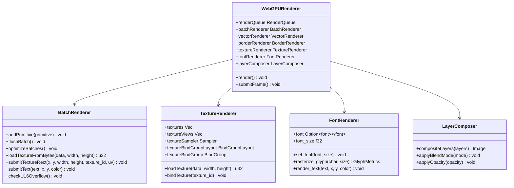

**图表来源**
- [lib.rs:30-34](file://crates/iris-gpu/src/lib.rs#L30-L34)

**章节来源**
- [lib.rs:30-34](file://crates/iris-gpu/src/lib.rs#L30-L34)

## 架构概览

### 七层分层架构详解

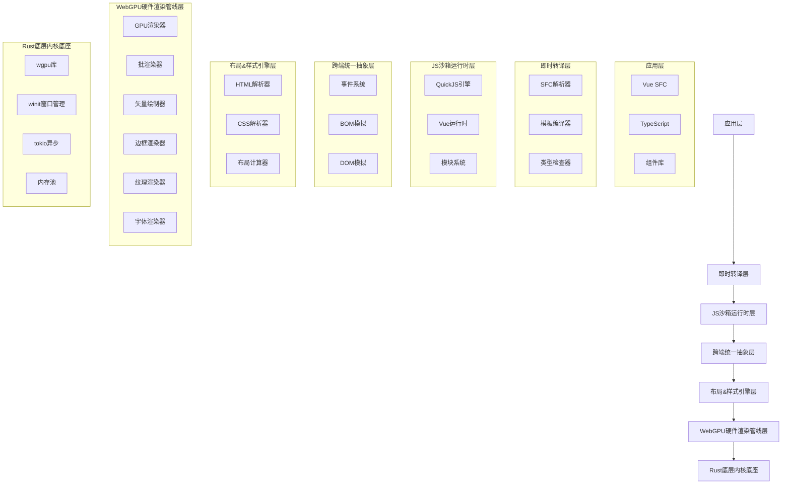

**图表来源**
- [lib.rs:7-22](file://crates/iris-gpu/src/lib.rs#L7-L22)

**章节来源**
- [lib.rs:7-22](file://crates/iris-gpu/src/lib.rs#L7-L22)

## 详细组件分析

### WebGPU渲染器实现

WebGPU渲染器是整个渲染系统的核心组件，负责协调所有渲染相关的操作。

#### 渲染流程
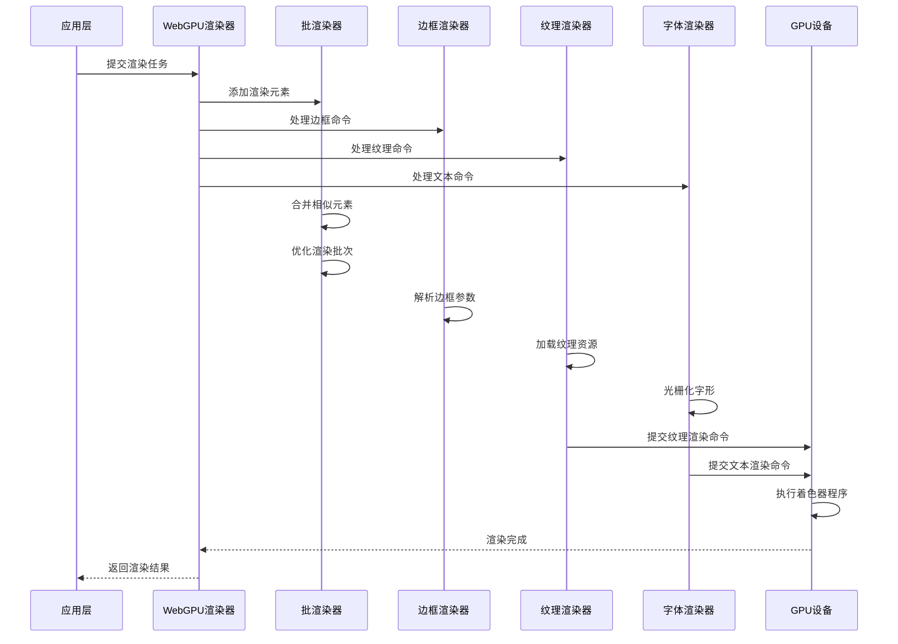

**图表来源**
- [lib.rs:30-34](file://crates/iris-gpu/src/lib.rs#L30-L34)

#### 关键数据结构
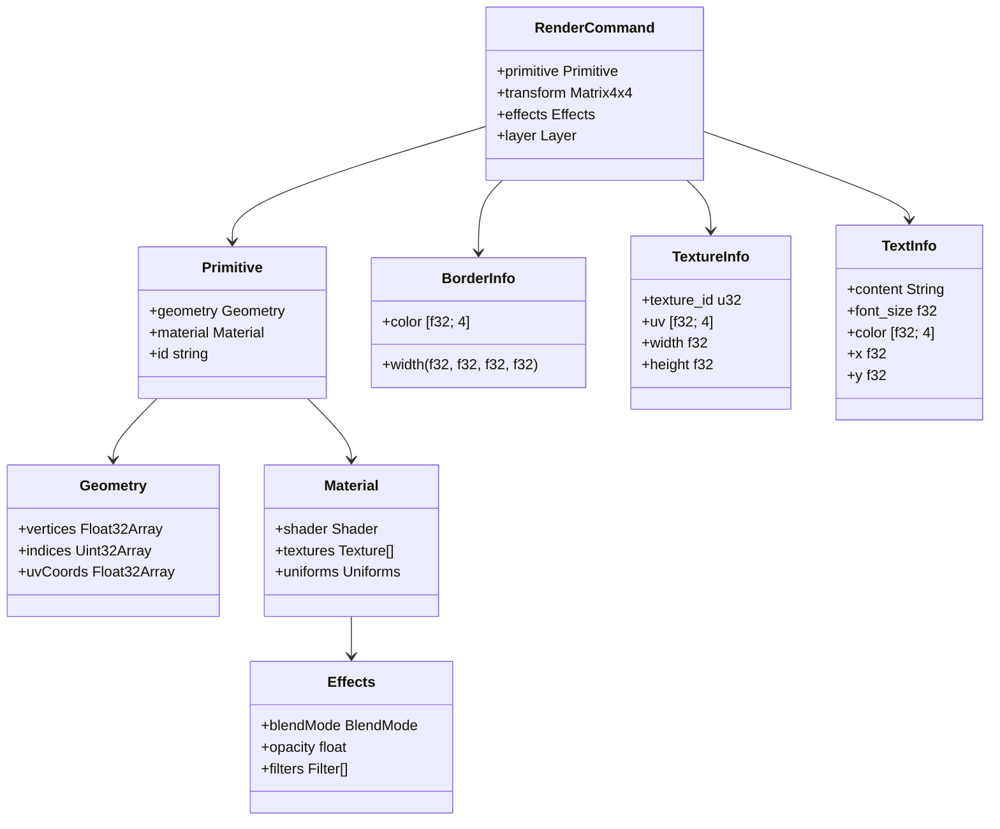

**图表来源**
- [lib.rs:30-34](file://crates/iris-gpu/src/lib.rs#L30-L34)

**章节来源**
- [lib.rs:30-34](file://crates/iris-gpu/src/lib.rs#L30-L34)

### 批渲染系统详细实现

批渲染系统是WebGPU渲染器的核心优化组件，通过将多个渲染命令合并为单次GPU调用来显著提升性能。

#### 批渲染架构
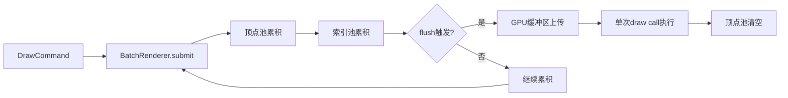

**图表来源**
- [batch_renderer.rs:87-101](file://crates/iris-gpu/src/batch_renderer.rs#L87-L101)

#### 批渲染顶点格式
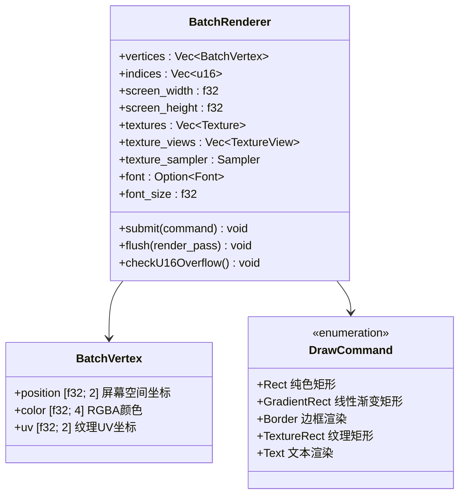

**图表来源**
- [batch_renderer.rs:12-50](file://crates/iris-gpu/src/batch_renderer.rs#L12-L50)

**章节来源**
- [batch_renderer.rs:1-800](file://crates/iris-gpu/src/batch_renderer.rs#L1-L800)

### 顶点缓冲区计算修正

**更新** 重要修复：修正了顶点缓冲区计算错误，每个矩形现在正确计算为4个顶点

#### 顶点缓冲区计算修正
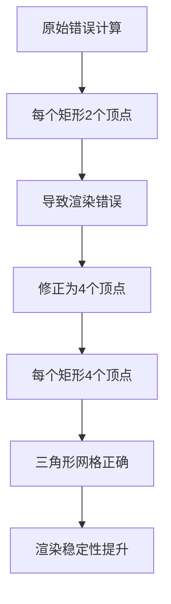

**图表来源**
- [batch_renderer.rs:216-223](file://crates/iris-gpu/src/batch_renderer.rs#L216-L223)

#### 顶点缓冲区初始化
```mermaid
flowchart TD
A[容量设置] --> B[顶点缓冲区大小计算]
B --> C{每个矩形顶点数}
C --> |错误: 2| D[2 * capacity * sizeof(BatchVertex)]
C --> |正确: 4| E[4 * capacity * sizeof(BatchVertex)]
D --> F[渲染错误]
E --> G[正确渲染]
F --> H[修复完成]
G --> H
```

**图表来源**
- [batch_renderer.rs:216-223](file://crates/iris-gpu/src/batch_renderer.rs#L216-L223)

**章节来源**
- [batch_renderer.rs:216-223](file://crates/iris-gpu/src/batch_renderer.rs#L216-L223)

### u16索引溢出保护机制

**更新** 新增u16索引溢出保护机制，防止超过65535个顶点的索引限制

#### 索引溢出保护实现
```mermaid
flowchart TD
A[顶点池累积] --> B{检查索引溢出风险}
B --> |vertices.len() + 4 > 65536| C[Panic保护]
B --> |安全| D[继续累积]
C --> E[错误信息: "Vertex count exceeds u16 indexing limit"]
D --> F[正常渲染]
E --> F
```

**图表来源**
- [batch_renderer.rs:395-400](file://crates/iris-gpu/src/batch_renderer.rs#L395-L400)

#### 索引溢出保护算法
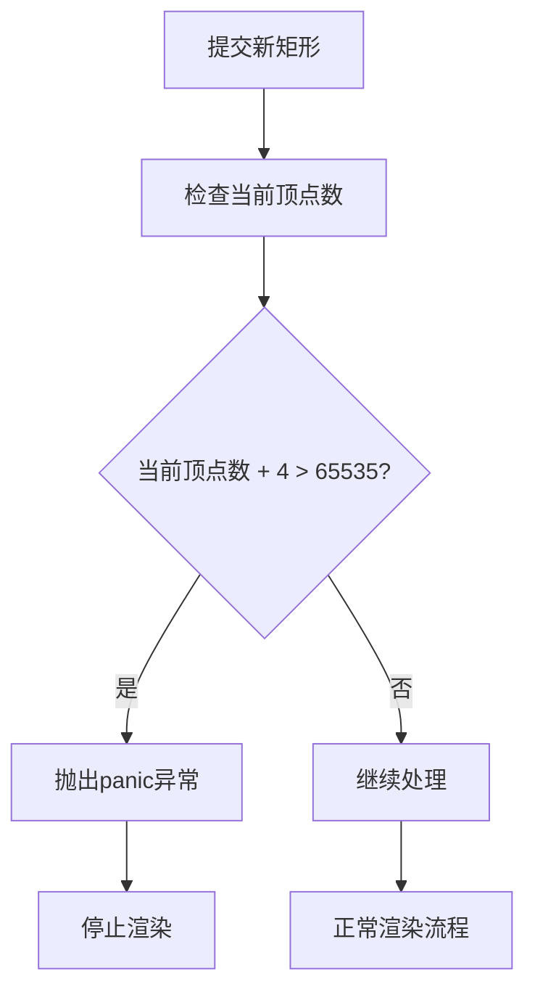

**图表来源**
- [batch_renderer.rs:395-400](file://crates/iris-gpu/src/batch_renderer.rs#L395-L400)

**章节来源**
- [batch_renderer.rs:395-400](file://crates/iris-gpu/src/batch_renderer.rs#L395-L400)

### 纹理映射系统实现

**更新** 新增纹理映射支持，实现GPU纹理管理和UV坐标处理

#### 纹理渲染流程
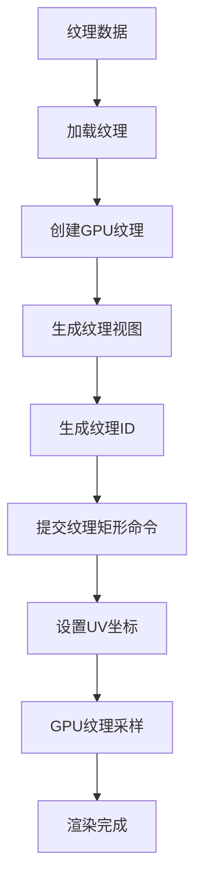

**图表来源**
- [batch_renderer.rs:514-567](file://crates/iris-gpu/src/batch_renderer.rs#L514-L567)

#### 纹理管理架构
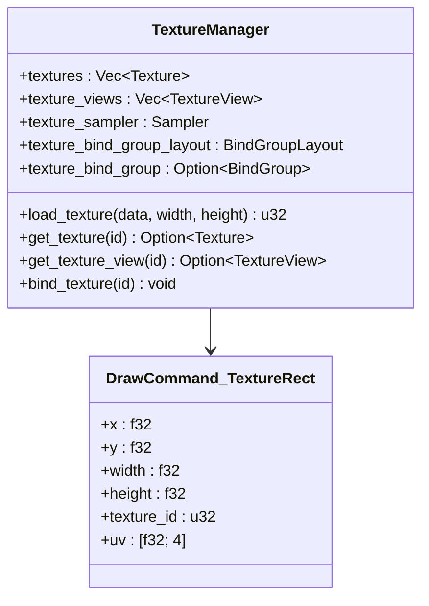

**图表来源**
- [batch_renderer.rs:136-142](file://crates/iris-gpu/src/batch_renderer.rs#L136-L142)

**章节来源**
- [batch_renderer.rs:514-599](file://crates/iris-gpu/src/batch_renderer.rs#L514-L599)

### 字体渲染系统实现

**更新** 新增字体渲染集成，包括fontdue集成、字形栅格化和文本渲染流程

#### 字体渲染流程
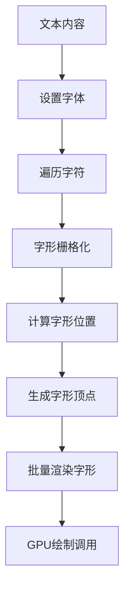

**图表来源**
- [batch_renderer.rs:601-653](file://crates/iris-gpu/src/batch_renderer.rs#L601-L653)

#### 字形栅格化实现
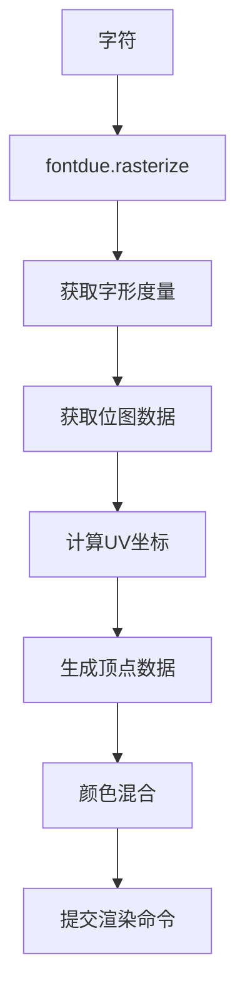

**图表来源**
- [batch_renderer.rs:624-640](file://crates/iris-gpu/src/batch_renderer.rs#L624-L640)

**章节来源**
- [batch_renderer.rs:601-685](file://crates/iris-gpu/src/batch_renderer.rs#L601-L685)

### 边框渲染系统实现

**更新** 新增边框渲染支持，实现四边独立的边框宽度和颜色控制

#### 边框渲染流程
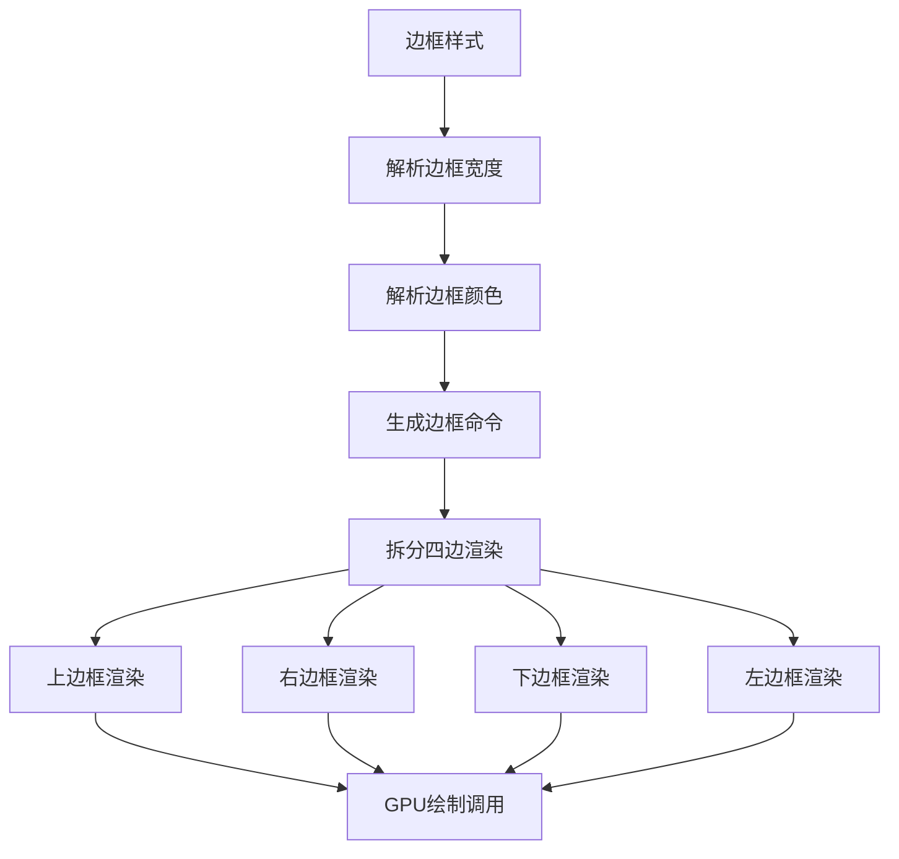

**图表来源**
- [batch_renderer.rs:268-297](file://crates/iris-gpu/src/batch_renderer.rs#L268-L297)

#### 边框参数解析
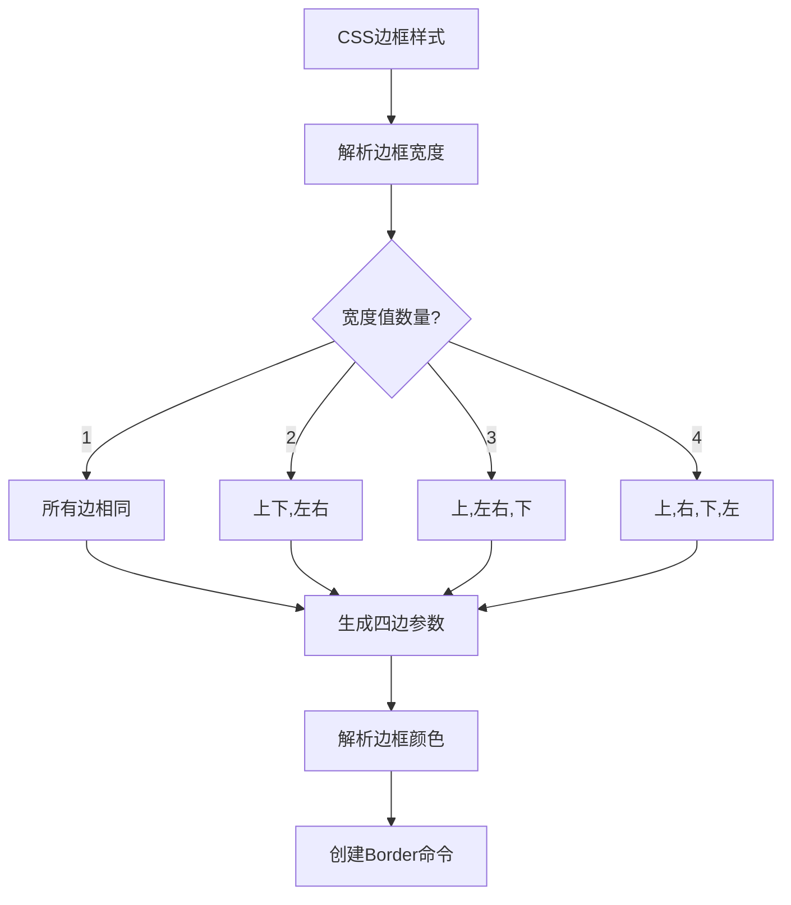

**图表来源**
- [vnode_renderer.rs:285-342](file://crates/iris/src/vnode_renderer.rs#L285-L342)

**章节来源**
- [batch_renderer.rs:268-297](file://crates/iris-gpu/src/batch_renderer.rs#L268-L297)
- [vnode_renderer.rs:262-307](file://crates/iris/src/vnode_renderer.rs#L262-L307)

### 文本渲染基础功能

**更新** 新增文本渲染基础功能，支持文本节点占位符渲染

#### 文本渲染流程
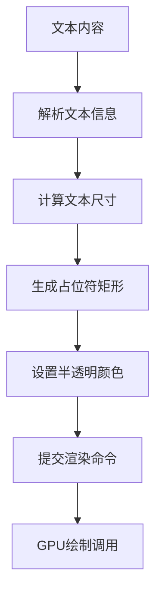

**图表来源**
- [vnode_renderer.rs:351-393](file://crates/iris/src/vnode_renderer.rs#L351-L393)

#### 文本信息解析
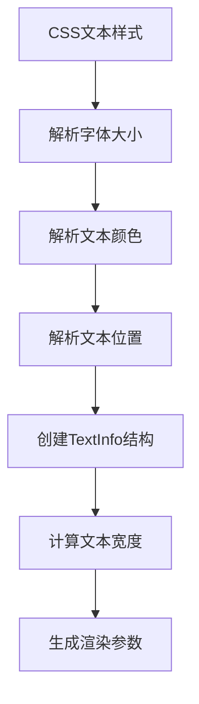

**图表来源**
- [vnode_renderer.rs:395-406](file://crates/iris/src/vnode_renderer.rs#L395-L406)

**章节来源**
- [vnode_renderer.rs:351-406](file://crates/iris/src/vnode_renderer.rs#L351-L406)

### 顶点缓冲管理和性能优化

**更新** 批渲染器获得了显著的性能优化，主要体现在顶点缓冲管理和绘制命令处理方面

#### 优化后的缓冲管理
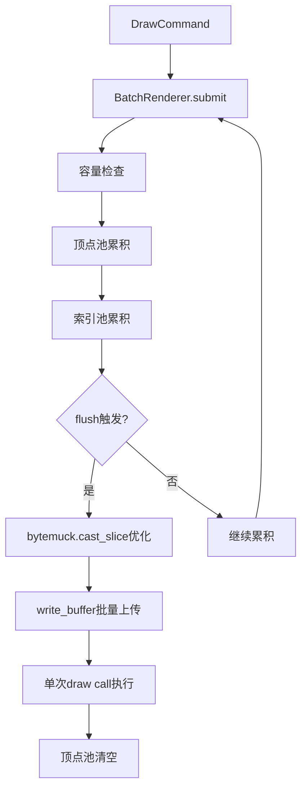

**图表来源**
- [batch_renderer.rs:206-246](file://crates/iris-gpu/src/batch_renderer.rs#L206-L246)

#### 性能优化关键点
- **内存拷贝优化**：使用`bytemuck.cast_slice`避免不必要的数据复制
- **批量上传**：一次性上传所有顶点和索引数据
- **缓冲区复用**：重用现有的顶点和索引缓冲区
- **容量预分配**：预先分配足够的容量避免动态扩容

**章节来源**
- [batch_renderer.rs:406-427](file://crates/iris-gpu/src/batch_renderer.rs#L406-L427)

### 着色器管理系统

着色器管理系统负责编译和管理WebGPU着色器程序，支持动态着色器加载和编译。

#### 着色器架构
```mermaid
flowchart LR
A[WGSL源码] --> B[ShaderModule创建]
B --> C[PipelineLayout配置]
C --> D[RenderPipeline创建]
D --> E[着色器绑定]
E --> F[GPU执行]
subgraph "着色器编译流程"
A1[静态着色器]
A2[动态着色器]
A3[着色器缓存]
end
subgraph "渲染管线配置"
B1[顶点状态]
B2[片段状态]
B3[混合状态]
B4[多重采样]
end
```

**图表来源**
- [lib.rs:107-307](file://crates/iris-gpu/src/lib.rs#L107-L307)

**章节来源**
- [lib.rs:48-72](file://crates/iris-gpu/src/lib.rs#L48-L72)

### 资源生命周期管理

资源生命周期管理确保GPU资源的正确创建、使用和销毁，防止内存泄漏和资源竞争。

#### 资源管理流程
```mermaid
stateDiagram-v2
[*] --> Created
Created --> Initialized : create()
Initialized --> Ready : initialize()
Ready --> Using : acquire()
Using --> Ready : release()
Using --> Destroyed : destroy()
Ready --> Destroyed : destroy()
Destroyed --> [*]
note right of Created : 资源创建阶段
note right of Initialized : 资源初始化阶段
note right of Ready : 资源就绪阶段
note right of Using : 资源使用阶段
note right of Destroyed : 资源销毁阶段
```

**图表来源**
- [lib.rs:280-307](file://crates/iris-gpu/src/lib.rs#L280-L307)

**章节来源**
- [lib.rs:78-105](file://crates/iris-gpu/src/lib.rs#L78-L105)

## WebGPU渲染管线设计

### 渲染管线架构

WebGPU渲染管线采用现代GPU渲染架构，支持高效的批渲染和状态管理：

```mermaid
flowchart LR
A[顶点数据] --> B[顶点着色器]
B --> C[几何着色器]
C --> D[光栅化]
D --> E[片段着色器]
E --> F[混合]
F --> G[输出合并]
subgraph "顶点阶段"
A1[顶点缓冲]
A2[变换矩阵]
A3[法向量]
end
subgraph "几何阶段"
B1[几何着色器]
B2[图元装配]
B3[裁剪]
end
subgraph "光栅化阶段"
C1[三角形遍历]
C2[深度测试]
C3[模板测试]
end
subgraph "片段阶段"
D1[片段着色器]
D2[纹理采样]
D3[光照计算]
end
subgraph "输出阶段"
E1[混合算法]
E2[颜色写入]
E3[深度写入]
end
```

**图表来源**
- [lib.rs:182-218](file://crates/iris-gpu/src/lib.rs#L182-L218)

### 批渲染优化策略

批渲染是WebGPU渲染器的核心优化技术，通过减少GPU状态切换和绘制调用来提升性能：

#### 批渲染算法
```mermaid
flowchart TD
A[收集渲染元素] --> B{是否可合并?}
B --> |是| C[添加到现有批次]
B --> |否| D[创建新批次]
C --> E{批次大小阈值?}
E --> |达到阈值| F[提交当前批次]
E --> |未达阈值| G[继续收集]
F --> H[重置批次计数器]
H --> G
D --> G
G --> I{还有元素?}
I --> |是| A
I --> |否| J[提交最后批次]
```

**图表来源**
- [batch_renderer.rs:209-249](file://crates/iris-gpu/src/batch_renderer.rs#L209-L249)

**章节来源**
- [batch_renderer.rs:209-800](file://crates/iris-gpu/src/batch_renderer.rs#L209-L800)

## 高级视觉效果实现

### 纹理映射系统

**更新** 新增纹理映射系统，支持GPU纹理加载、UV坐标处理和纹理采样

#### 纹理渲染流程
```mermaid
flowchart TD
A[纹理数据] --> B[加载到GPU]
B --> C[创建纹理视图]
C --> D[生成纹理ID]
D --> E[提交纹理矩形命令]
E --> F[设置UV坐标]
F --> G[纹理采样]
G --> H[颜色混合]
H --> I[渲染输出]
```

**图表来源**
- [batch_renderer.rs:514-599](file://crates/iris-gpu/src/batch_renderer.rs#L514-L599)

#### 纹理管理实现
```mermaid
flowchart TD
A[纹理字节数组] --> B[创建wgpu::Texture]
B --> C[写入纹理数据]
C --> D[创建TextureView]
D --> E[存储纹理信息]
E --> F[返回纹理ID]
F --> G[纹理绑定组]
G --> H[纹理采样器]
```

**图表来源**
- [batch_renderer.rs:522-566](file://crates/iris-gpu/src/batch_renderer.rs#L522-L566)

### 字体渲染系统

**更新** 新增字体渲染集成，包括fontdue集成、字形栅格化和文本渲染流程

#### 字形渲染流程
```mermaid
flowchart TD
A[文本内容] --> B[字符编码]
B --> C[字形查找]
C --> D[位图生成]
D --> E[UV坐标计算]
E --> F[纹理采样]
F --> G[颜色混合]
subgraph "字形处理"
A1[轮廓提取]
A2[抗锯齿]
A3[像素格式转换]
end
```

**图表来源**
- [lib.rs:16-24](file://crates/iris-gpu/src/lib.rs#L16-L24)

#### 文本渲染占位符实现
```mermaid
flowchart TD
A[文本节点] --> B[解析文本信息]
B --> C[计算文本尺寸]
C --> D[生成半透明矩形]
D --> E[设置占位符颜色]
E --> F[提交渲染命令]
F --> G[GPU绘制调用]
```

**图表来源**
- [vnode_renderer.rs:358-381](file://crates/iris/src/vnode_renderer.rs#L358-L381)

**章节来源**
- [lib.rs:16-46](file://crates/iris-gpu/src/lib.rs#L16-L46)
- [vnode_renderer.rs:351-393](file://crates/iris/src/vnode_renderer.rs#L351-L393)

### 矢量绘制系统

矢量绘制系统支持复杂的几何图形渲染，包括圆形、矩形、路径等基本形状：

#### 矢量渲染流程
```mermaid
flowchart TD
A[矢量数据] --> B[几何生成]
B --> C[顶点计算]
C --> D[索引生成]
D --> E[UV坐标计算]
E --> F[材质应用]
F --> G[渲染输出]
subgraph "几何生成"
A1[圆形参数]
A2[矩形参数]
A3[路径数据]
end
subgraph "顶点计算"
B1[细分算法]
B2[法向量计算]
B3[边界处理]
end
subgraph "材质应用"
C1[纹理映射]
C2[渐变填充]
C3[阴影效果]
end
```

**图表来源**
- [batch_renderer.rs:260-344](file://crates/iris-gpu/src/batch_renderer.rs#L260-L344)

### 边框渲染系统

**更新** 新增边框渲染系统，支持四边独立的边框宽度和颜色控制

#### 边框渲染实现
```mermaid
flowchart TD
A[边框参数] --> B[上边框渲染]
A --> C[右边框渲染]
A --> D[下边框渲染]
A --> E[左边框渲染]
B --> F[纯色矩形绘制]
C --> F
D --> F
E --> F
F --> G[GPU状态管理]
G --> H[批量提交]
```

**图表来源**
- [batch_renderer.rs:276-296](file://crates/iris-gpu/src/batch_renderer.rs#L276-L296)

#### 边框参数解析算法
```mermaid
flowchart TD
A[CSS border-width] --> B{值的数量}
B --> |1| C[top=right=bottom=left=value]
B --> |2| D[top=bottom=value1, right=left=value2]
B --> |3| E[top=value1, right=left=value2, bottom=value3]
B --> |4| F[top=value1, right=value2, bottom=value3, left=value4]
C --> G[生成边框参数]
D --> G
E --> G
F --> G
G --> H[验证参数有效性]
H --> I[创建BorderInfo结构]
```

**图表来源**
- [vnode_renderer.rs:309-342](file://crates/iris/src/vnode_renderer.rs#L309-L342)

**章节来源**
- [batch_renderer.rs:268-297](file://crates/iris-gpu/src/batch_renderer.rs#L268-L297)
- [vnode_renderer.rs:285-342](file://crates/iris/src/vnode_renderer.rs#L285-L342)

### 圆角、阴影、渐变效果

#### 圆角渲染实现
```mermaid
flowchart LR
A[矩形几何] --> B[圆角参数]
B --> C[顶点偏移计算]
C --> D[UV坐标调整]
D --> E[片段着色器处理]
E --> F[边缘平滑]
subgraph "圆角算法"
A1[角度细分]
A2[半径插值]
A3[边缘裁剪]
end
```

**图表来源**
- [batch_renderer.rs:312-344](file://crates/iris-gpu/src/batch_renderer.rs#L312-L344)

### 纹理图集系统

纹理图集系统通过将多个小纹理合并到单个大纹理中来减少纹理切换开销：

#### 图集打包算法
```mermaid
flowchart TD
A[纹理列表] --> B[按尺寸排序]
B --> C[选择空闲槽位]
C --> D[放置纹理]
D --> E{是否有空间?}
E --> |是| F[记录UV坐标]
E --> |否| G[扩展图集尺寸]
G --> C
F --> H{还有纹理?}
H --> |是| A
H --> |否| I[生成最终图集]
```

**图表来源**
- [batch_renderer.rs:312-344](file://crates/iris-gpu/src/batch_renderer.rs#L312-L344)

**章节来源**
- [batch_renderer.rs:312-344](file://crates/iris-gpu/src/batch_renderer.rs#L312-L344)

## 性能优化策略

### 内存管理优化

**更新** 批渲染器获得了显著的内存管理优化，特别是在顶点缓冲管理和数据传输方面

#### 优化后的内存池设计
```mermaid
classDiagram
class MemoryPool {
+pageSize size_t
+freeList FreeList
+allocators Allocator[]
+allocate(size) void*
+deallocate(ptr) void
+resize(newSize) void
}
class FreeList {
+head Node
+size size_t
+insert(node) void
+remove() Node
}
class Allocator {
+pool MemoryPool
+chunkSize size_t
+chunks Chunk[]
+allocate() void*
+deallocate(ptr) void
}
MemoryPool --> FreeList
MemoryPool --> Allocator
Allocator --> Chunk
```

**图表来源**
- [lib.rs:280-307](file://crates/iris-gpu/src/lib.rs#L280-L307)

### GPU资源管理

#### 资源生命周期管理
```mermaid
stateDiagram-v2
[*] --> Created
Created --> Initialized : create()
Initialized --> Ready : initialize()
Ready --> Using : acquire()
Using --> Ready : release()
Using --> Destroyed : destroy()
Ready --> Destroyed : destroy()
Destroyed --> [*]
note right of Created : 资源创建阶段
note right of Initialized : 资源初始化阶段
note right of Ready : 资源就绪阶段
note right of Using : 资源使用阶段
note right of Destroyed : 资源销毁阶段
```

**图表来源**
- [lib.rs:78-105](file://crates/iris-gpu/src/lib.rs#L78-L105)

**章节来源**
- [lib.rs:78-105](file://crates/iris-gpu/src/lib.rs#L78-L105)

### 批渲染性能优化详解

**更新** 批渲染器获得了显著的性能提升，主要体现在以下方面：

#### 优化前后的对比
```mermaid
flowchart TD
A[优化前] --> B[逐个命令处理]
B --> C[多次write_buffer调用]
C --> D[频繁GPU状态切换]
D --> E[低效内存拷贝]
E --> F[性能瓶颈]
A1[DrawCommand提交]
A2[单次缓冲区上传]
A3[批处理优化]
A4[bytemuck.cast_slice]
A5[GPU资源复用]
A6[性能提升]
F --> G[优化后]
G --> A2
A2 --> A3
A3 --> A4
A4 --> A5
A5 --> A6
```

**图表来源**
- [batch_renderer.rs:354-374](file://crates/iris-gpu/src/batch_renderer.rs#L354-L374)

#### 关键优化技术
- **bytemuck.cast_slice优化**：避免数据复制，直接使用内存切片
- **批量缓冲区上传**：一次性上传所有顶点和索引数据
- **GPU状态复用**：减少渲染状态切换次数
- **内存预分配**：避免运行时动态扩容

**章节来源**
- [batch_renderer.rs:406-427](file://crates/iris-gpu/src/batch_renderer.rs#L406-L427)

### 纹理渲染性能优化

**更新** 新增纹理渲染系统的性能优化策略

#### 纹理缓存策略
```mermaid
flowchart TD
A[纹理请求] --> B{纹理已缓存?}
B --> |是| C[直接使用缓存]
B --> |否| D[加载新纹理]
D --> E[创建GPU纹理]
E --> F[存储到缓存]
F --> G[返回纹理ID]
C --> H[纹理采样]
G --> H
H --> I[渲染优化]
```

**图表来源**
- [batch_renderer.rs:514-567](file://crates/iris-gpu/src/batch_renderer.rs#L514-L567)

#### 字形渲染优化
```mermaid
flowchart TD
A[文本渲染] --> B[字体缓存]
B --> C[字形缓存]
C --> D[批量字形处理]
D --> E[平均alpha计算]
E --> F[条件渲染]
F --> G[性能提升]
```

**图表来源**
- [batch_renderer.rs:655-685](file://crates/iris-gpu/src/batch_renderer.rs#L655-L685)

**章节来源**
- [batch_renderer.rs:655-685](file://crates/iris-gpu/src/batch_renderer.rs#L655-L685)

## 60fps稳定渲染机制

### 帧率控制算法

#### 垂直同步和帧率调节
```mermaid
flowchart TD
A[开始帧] --> B[计算时间差]
B --> C{时间差足够?}
C --> |是| D[渲染下一帧]
C --> |否| E[等待VSync]
E --> F[检查帧率]
F --> G{帧率过低?}
G --> |是| H[降低渲染质量]
G --> |否| I[保持当前设置]
D --> J[更新统计信息]
J --> K[结束帧]
I --> K
H --> K
```

**图表来源**
- [lib.rs:386-487](file://crates/iris-gpu/src/lib.rs#L386-L487)

### 异步渲染架构

#### 多线程渲染系统
```mermaid
graph TB
subgraph "主线程"
A[应用逻辑]
B[输入处理]
end
subgraph "渲染线程"
C[渲染队列]
D[批处理]
E[GPU提交]
end
subgraph "GPU线程"
F[着色器执行]
G[内存管理]
end
A --> C
B --> C
C --> D
D --> E
E --> F
F --> G
```

**图表来源**
- [lib.rs:386-487](file://crates/iris-gpu/src/lib.rs#L386-L487)

**章节来源**
- [lib.rs:386-487](file://crates/iris-gpu/src/lib.rs#L386-L487)

## 大列表和复杂组件优化

### 虚拟化渲染技术

#### 列表虚拟化实现
```mermaid
flowchart TD
A[完整列表数据] --> B[可视区域计算]
B --> C[可见项确定]
C --> D[动态加载]
D --> E[渲染可见项]
E --> F[回收不可见项]
subgraph "视口管理"
A1[滚动位置]
A2[容器尺寸]
A3[项高度缓存]
end
subgraph "内存优化"
B1[对象池]
B2[懒加载]
B3[预加载]
end
```

**图表来源**
- [batch_renderer.rs:209-249](file://crates/iris-gpu/src/batch_renderer.rs#L209-L249)

### 复杂组件渲染优化

#### 组件缓存策略
```mermaid
flowchart LR
A[组件实例] --> B[状态检查]
B --> C{状态变化?}
C --> |无变化| D[使用缓存]
C --> |有变化| E[重新渲染]
E --> F[更新缓存]
D --> G[直接输出]
F --> G
G --> H[输出到渲染队列]
```

**图表来源**
- [batch_renderer.rs:209-249](file://crates/iris-gpu/src/batch_renderer.rs#L209-L249)

**章节来源**
- [batch_renderer.rs:209-800](file crates/iris-gpu/src/batch_renderer.rs#L209-L800)

## 文件热更新监听器

文件热更新监听器提供实时文件系统监控功能，支持防抖机制和事件去重，为SFC热重载提供基础设施。

### 监听器架构
```mermaid
flowchart TD
A[文件系统事件] --> B[notify监听器]
B --> C[Tokio异步通道]
C --> D[防抖处理]
D --> E[事件去重]
E --> F[应用层处理]
subgraph "监听器配置"
A1[监听路径]
A2[递归监听]
A3[扩展名过滤]
A4[通道容量]
end
subgraph "防抖机制"
B1[防抖状态]
B2[延迟配置]
B3[事件聚合]
end
```

**图表来源**
- [file_watcher.rs:172-187](file://crates/iris-gpu/src/file_watcher.rs#L172-L187)

### 事件处理流程
```mermaid
sequenceDiagram
participant FS as 文件系统
participant Watcher as 监听器
participant Channel as 异步通道
participant Debounce as 防抖器
participant App as 应用层
FS->>Watcher : 文件变更事件
Watcher->>Channel : 发送事件
Channel->>Debounce : 接收事件
Debounce->>Debounce : 防抖处理
Debounce->>Channel : 返回最终事件
Channel->>App : 处理文件变更
```

**图表来源**
- [file_watcher.rs:245-481](file://crates/iris-gpu/src/file_watcher.rs#L245-L481)

**章节来源**
- [file_watcher.rs:1-655](file://crates/iris-gpu/src/file_watcher.rs#L1-L655)

## 故障排除指南

### 常见问题诊断

#### WebGPU兼容性问题
- 检查浏览器WebGPU支持状态
- 验证GPU驱动版本
- 确认WebGPU适配器可用性

#### 渲染性能问题
- 监控GPU使用率
- 分析批渲染效率
- 检查纹理图集使用情况

#### 内存泄漏排查
- 监控内存使用趋势
- 检查资源释放时机
- 验证对象池使用情况

#### 文件监听问题
- 检查监听路径权限
- 验证扩展名过滤配置
- 监控通道容量使用情况

#### 纹理渲染问题
- 检查纹理加载状态
- 验证UV坐标范围
- 确认纹理ID有效性

#### 字体渲染问题
- 检查字体设置
- 验证字形栅格化
- 确认文本颜色混合

#### 边框渲染问题
- 检查边框宽度解析
- 验证边框颜色格式
- 确认边框参数范围

#### 文本渲染问题
- 检查文本信息解析
- 验证字体大小设置
- 确认文本占位符渲染

#### 顶点缓冲区计算错误
- 检查每个矩形的顶点数是否为4个
- 验证顶点缓冲区大小计算
- 确认索引格式为u16

#### u16索引溢出问题
- 监控顶点池容量使用
- 检查索引溢出保护机制
- 验证渲染批次大小

**章节来源**
- [file_watcher.rs:281-402](file://crates/iris-gpu/src/file_watcher.rs#L281-L402)

## 结论

Leivue Runtime的WebGPU渲染引擎代表了前端渲染技术的重大进步，通过完全脱离传统DOM渲染，实现了硬件级的性能提升。该引擎不仅提供了完整的Vue生态系统兼容性，更重要的是通过创新的架构设计和优化策略，为大规模应用提供了稳定可靠的渲染解决方案。

基于对代码库的深入分析，该引擎的核心优势包括：

1. **完整的批渲染系统**：通过批处理显著减少GPU状态切换开销
2. **灵活的着色器管理**：支持静态和动态着色器编译
3. **完善的资源管理**：确保GPU资源的正确生命周期管理
4. **强大的文件监控**：提供实时文件变更检测和处理
5. **异步渲染架构**：支持多线程渲染和事件驱动模式
6. **新增纹理映射支持**：实现GPU纹理加载、UV坐标处理和纹理采样
7. **字体渲染集成**：集成fontdue字体渲染系统，支持字形栅格化和文本渲染
8. **增强的VNode渲染器**：支持更多CSS属性和样式
9. **稳定性保障**：u16索引溢出保护机制，确保大规模渲染的稳定性

**最新优化亮点**：
- **批渲染器性能大幅提升**：通过优化顶点缓冲管理和绘制命令处理，显著提升2D渲染性能
- **顶点缓冲区计算修正**：每个矩形正确计算为4个顶点，而非之前的错误计算
- **u16索引溢出保护机制**：防止超过65535个顶点的索引限制，提升渲染稳定性
- **GPU资源利用率优化**：改进的内存拷贝和缓冲区管理技术
- **bytemuck.cast_slice优化**：避免不必要的数据复制，提高内存访问效率
- **批量缓冲区上传**：一次性上传所有渲染数据，减少GPU状态切换
- **纹理渲染系统**：支持GPU纹理管理和UV坐标处理
- **字体渲染系统**：集成fontdue字体渲染，支持字形栅格化
- **边框渲染系统**：支持复杂的边框样式和布局需求
- **文本渲染占位符**：为后续字体渲染功能奠定基础

随着WebGPU技术的不断发展和浏览器支持的完善，这种基于硬件加速的渲染方式将成为未来前端渲染的标准模式。该项目的七层架构设计、批渲染优化、高级视觉效果实现以及60fps稳定渲染机制，都为构建高性能的跨端应用奠定了坚实的基础。

**新增功能总结**：
- **纹理映射**：支持GPU纹理加载、UV坐标处理和纹理采样
- **字体渲染**：集成fontdue字体渲染系统，支持字形栅格化和文本渲染
- **纹理管理**：提供完整的纹理生命周期管理和资源优化
- **字体系统**：为未来的字体渲染功能做好准备
- **增强的VNode渲染器**：支持更多CSS属性和样式
- **GPU资源管理**：确保纹理和字体资源的正确生命周期管理
- **稳定性修复**：顶点缓冲区计算修正和u16索引溢出保护机制

通过持续的技术创新和优化，Leivue Runtime有望成为Vue生态系统的重要基础设施，为开发者提供更加高效、稳定的开发体验。