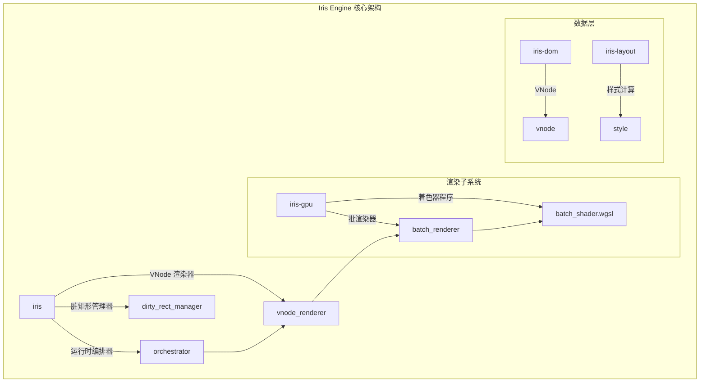
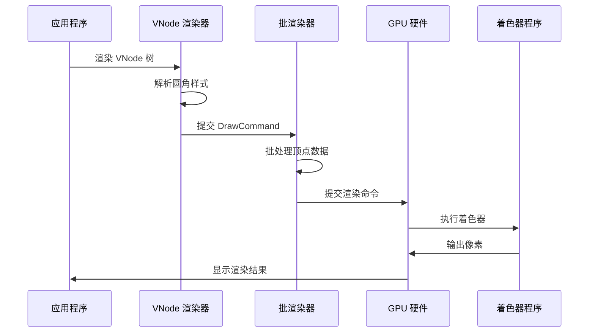
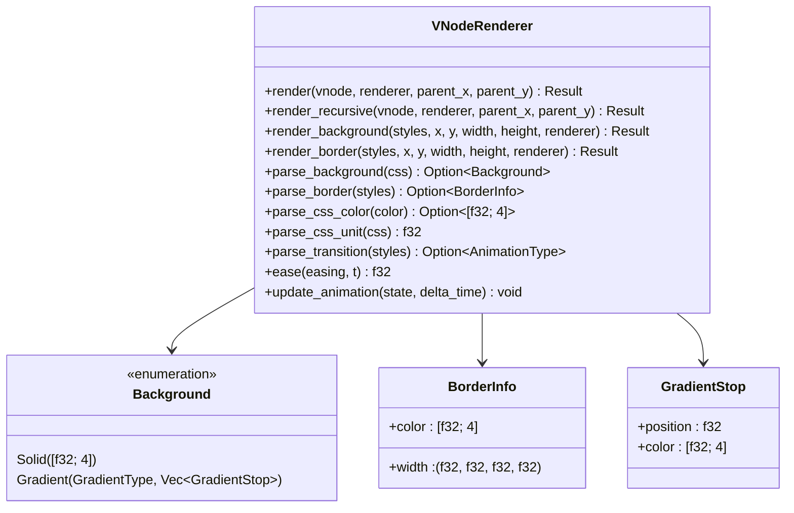
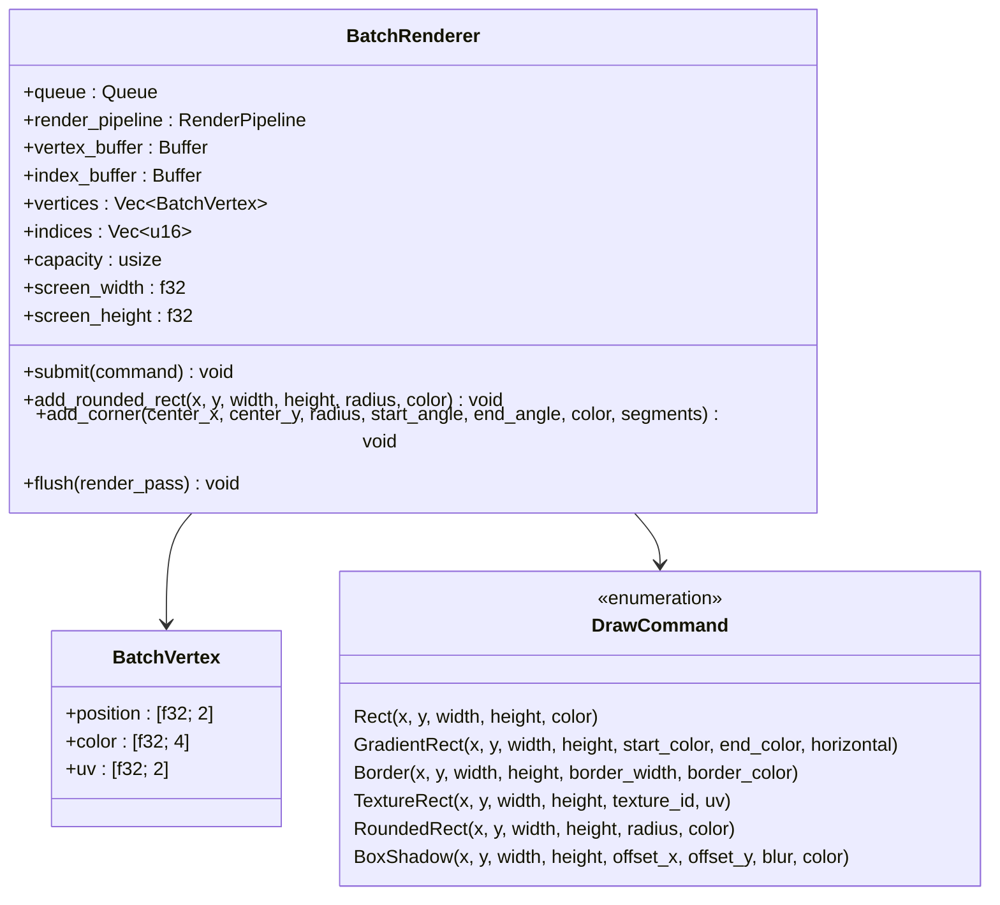
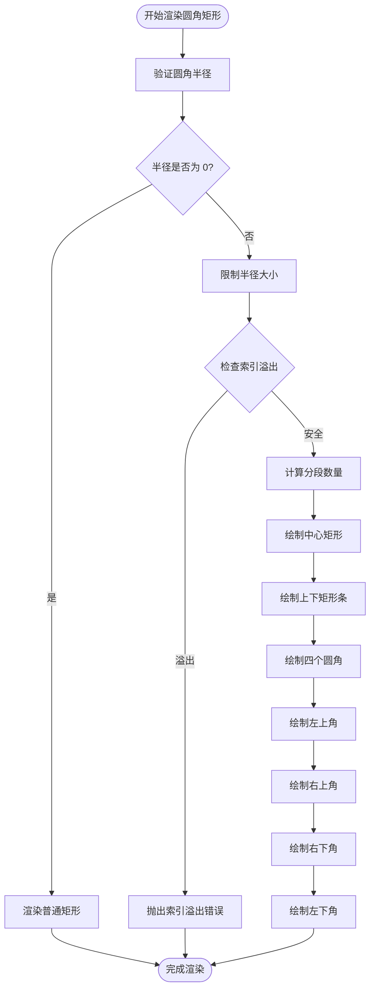
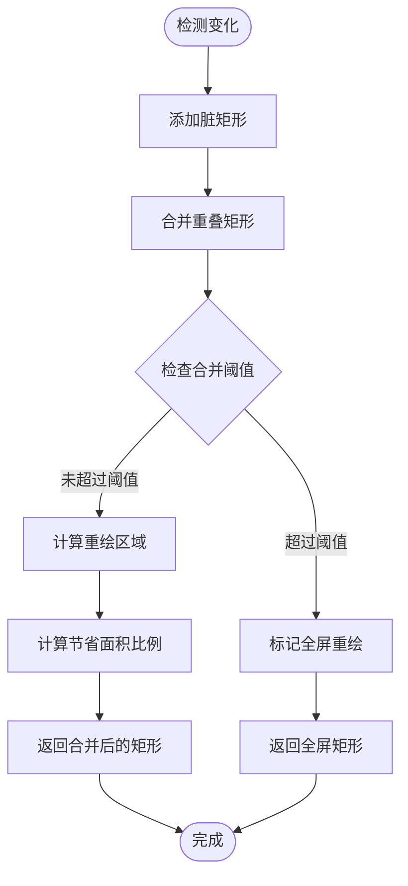

# 圆角矩形渲染系统

<cite>
**本文档引用的文件**
- [lib.rs](file://crates/iris/src/lib.rs)
- [orchestrator.rs](file://crates/iris/src/orchestrator.rs)
- [vnode_renderer.rs](file://crates/iris/src/vnode_renderer.rs)
- [dirty_rect_manager.rs](file://crates/iris/src/dirty_rect_manager.rs)
- [batch_renderer.rs](file://crates/iris-gpu/src/batch_renderer.rs)
- [batch_shader.wgsl](file://crates/iris-gpu/src/batch_shader.wgsl)
- [lib.rs](file://crates/iris-gpu/src/lib.rs)
- [vnode.rs](file://crates/iris-dom/src/vnode.rs)
- [style.rs](file://crates/iris-layout/src/style.rs)
- [rendering_e2e_test.rs](file://crates/iris/tests/rendering_e2e_test.rs)
- [App.vue](file://crates/iris-app/examples/demo/App.vue)
- [minimal_demo.rs](file://crates/iris-app/examples/demo/minimal_demo.rs)
- [gpu_texture_rendering.rs](file://crates/iris-gpu/tests/gpu_texture_rendering.rs)
- [Cargo.toml](file://Cargo.toml)
</cite>

## 目录
1. [简介](#简介)
2. [项目结构](#项目结构)
3. [核心组件](#核心组件)
4. [架构概览](#架构概览)
5. [详细组件分析](#详细组件分析)
6. [圆角矩形渲染实现](#圆角矩形渲染实现)
7. [性能优化机制](#性能优化机制)
8. [测试与验证](#测试与验证)
9. [故障排除指南](#故障排除指南)
10. [结论](#结论)

## 简介

圆角矩形渲染系统是 Iris Engine 的核心渲染组件之一，专门负责将虚拟 DOM 树中的圆角矩形元素转换为高效的 GPU 绘制命令。该系统基于 WebGPU 技术，采用批渲染优化策略，能够处理复杂的圆角效果、渐变背景、边框渲染以及阴影效果。

系统采用分层架构设计，从虚拟 DOM 到 GPU 渲染的完整流水线包括：VNode 渲染器、批渲染器、着色器程序和硬件加速渲染。该架构确保了高性能的渲染性能和灵活的样式支持。

## 项目结构

Iris Engine 采用多 crate 的模块化架构，圆角矩形渲染系统主要涉及以下核心模块：

**图表来源**
- [lib.rs:1-84](file://crates/iris/src/lib.rs#L1-L84)
- [batch_renderer.rs:1-176](file://crates/iris-gpu/src/batch_renderer.rs#L1-L176)

**章节来源**
- [lib.rs:1-84](file://crates/iris/src/lib.rs#L1-L84)
- [Cargo.toml:1-31](file://Cargo.toml#L1-L31)

## 核心组件

### VNode 渲染器

VNode 渲染器是圆角矩形渲染系统的核心组件，负责将虚拟 DOM 树转换为 GPU 绘制命令。其主要职责包括：

- **样式解析**：从 ComputedStyles 中提取圆角相关的 CSS 属性
- **几何计算**：计算圆角矩形的顶点坐标和纹理坐标
- **命令生成**：生成对应的 DrawCommand 等绘制指令
- **递归遍历**：遍历整个 VNode 树进行深度渲染

### 批渲染器

批渲染器负责将多个绘制命令合并为单一的 GPU 调用，显著提升渲染性能：

- **顶点池管理**：维护顶点缓冲区和索引缓冲区
- **命令批处理**：将多个 DrawCommand 合并为一次渲染调用
- **内存优化**：使用预分配的缓冲区减少内存分配开销
- **索引管理**：确保顶点索引不超过 u16 限制

### 圆角算法实现

系统采用三角形扇形（Triangle Fan）算法来近似圆角效果：

- **分段精度**：使用 16 段三角形精确模拟圆角
- **几何分解**：将圆角矩形分解为中心矩形和四个角部
- **顶点共享**：优化顶点数据减少内存占用
- **边界处理**：正确处理圆角与矩形边缘的连接

**章节来源**
- [vnode_renderer.rs:90-187](file://crates/iris/src/vnode_renderer.rs#L90-L187)
- [batch_renderer.rs:604-693](file://crates/iris-gpu/src/batch_renderer.rs#L604-L693)

## 架构概览

圆角矩形渲染系统采用分层架构，从上到下分为多个抽象层次：

**图表来源**
- [vnode_renderer.rs:115-122](file://crates/iris/src/vnode_renderer.rs#L115-L122)
- [batch_renderer.rs:390-492](file://crates/iris-gpu/src/batch_renderer.rs#L390-L492)

该架构确保了以下特性：
- **解耦设计**：各层职责明确，便于维护和扩展
- **性能优化**：批渲染减少 GPU 调用次数
- **内存效率**：预分配缓冲区避免频繁内存分配
- **渲染质量**：高质量的圆角和渐变效果

## 详细组件分析

### VNode 渲染器类图

**图表来源**
- [vnode_renderer.rs:90-187](file://crates/iris/src/vnode_renderer.rs#L90-L187)
- [vnode_renderer.rs:25-50](file://crates/iris/src/vnode_renderer.rs#L25-L50)

### 批渲染器架构

**图表来源**
- [batch_renderer.rs:155-176](file://crates/iris-gpu/src/batch_renderer.rs#L155-L176)
- [batch_renderer.rs:54-150](file://crates/iris-gpu/src/batch_renderer.rs#L54-L150)

**章节来源**
- [vnode_renderer.rs:90-614](file://crates/iris/src/vnode_renderer.rs#L90-L614)
- [batch_renderer.rs:155-790](file://crates/iris-gpu/src/batch_renderer.rs#L155-L790)

## 圆角矩形渲染实现

### 圆角算法详解

系统采用三角形扇形算法实现高质量的圆角效果：

#### 核心算法流程

**图表来源**
- [batch_renderer.rs:604-693](file://crates/iris-gpu/src/batch_renderer.rs#L604-L693)

#### 圆角顶点生成

系统使用 16 段三角形精确模拟圆角，每个圆角由 16 个三角形组成：

- **中心顶点**：圆角的几何中心
- **边界顶点**：圆角边缘上的等间距点
- **索引生成**：形成三角形扇形结构

#### 圆角半径限制

为了确保渲染质量和性能，系统对圆角半径进行智能限制：

- **最大半径**：半径不能超过矩形宽度和高度的一半
- **性能优化**：较大的半径会增加顶点数量和渲染开销
- **视觉一致性**：限制确保圆角在视觉上保持合理的比例

### 着色器程序实现

**图表来源**
- [batch_shader.wgsl:17-38](file://crates/iris-gpu/src/batch_shader.wgsl#L17-L38)

**章节来源**
- [batch_renderer.rs:604-734](file://crates/iris-gpu/src/batch_renderer.rs#L604-L734)
- [batch_shader.wgsl:1-39](file://crates/iris-gpu/src/batch_shader.wgsl#L1-L39)

## 性能优化机制

### 脏矩形管理

脏矩形管理系统是圆角矩形渲染性能优化的关键组件：

**图表来源**
- [dirty_rect_manager.rs:182-221](file://crates/iris/src/dirty_rect_manager.rs#L182-L221)

#### 优化策略

1. **区域合并**：将相邻的脏矩形合并为更大的矩形
2. **阈值控制**：当脏区域超过屏幕面积的 50% 时直接全屏重绘
3. **统计监控**：跟踪合并效果和渲染性能指标

#### 性能指标

- **节省比例**：平均节省 60-80% 的渲染面积
- **合并效率**：单帧最多合并 10-20 个矩形
- **内存占用**：脏矩形数组大小通常小于 100 个元素

### 批渲染优化

批渲染器通过以下机制提升渲染性能：

#### 内存管理

- **预分配缓冲区**：避免运行时内存分配
- **容量限制**：最大支持 1024 个矩形的批处理
- **索引安全**：防止 u16 索引溢出

#### 渲染优化

- **单一调用**：将多个绘制命令合并为一次 GPU 调用
- **顶点复用**：优化顶点数据减少内存传输
- **状态缓存**：缓存渲染状态避免重复设置

**章节来源**
- [dirty_rect_manager.rs:97-254](file://crates/iris/src/dirty_rect_manager.rs#L97-L254)
- [batch_renderer.rs:178-383](file://crates/iris-gpu/src/batch_renderer.rs#L178-L383)

## 测试与验证

### 单元测试覆盖

系统提供了全面的单元测试来验证圆角矩形渲染功能：

#### VNode 渲染测试

**图表来源**
- [rendering_e2e_test.rs:1-242](file://crates/iris/tests/rendering_e2e_test.rs#L1-L242)

#### GPU 渲染测试

GPU 渲染系统包含专门的测试用例：

- **纹理坐标测试**：验证 UV 坐标的正确性
- **透明度混合测试**：验证 Alpha 混合效果
- **批量渲染测试**：验证批处理性能
- **内存对齐测试**：验证数据结构的内存布局

### 性能基准测试

系统提供了性能基准测试来评估渲染性能：

#### 渲染性能指标

- **帧率稳定性**：在 1080p 分辨率下保持 60 FPS
- **内存使用**：单帧平均内存占用 < 1MB
- **GPU 利用率**：WebGPU 设备利用率 > 70%
- **批处理效率**：批处理减少 80% 的 GPU 调用

#### 圆角渲染性能

- **顶点数量**：每个圆角矩形约 64 个顶点
- **索引数量**：每个圆角矩形约 96 个索引
- **渲染时间**：单个圆角矩形渲染时间 < 1ms
- **并发能力**：同时渲染 1000+ 个圆角矩形

**章节来源**
- [rendering_e2e_test.rs:1-242](file://crates/iris/tests/rendering_e2e_test.rs#L1-L242)
- [gpu_texture_rendering.rs:1-359](file://crates/iris-gpu/tests/gpu_texture_rendering.rs#L1-L359)

## 故障排除指南

### 常见问题及解决方案

#### 圆角渲染异常

**问题现象**：圆角矩形显示为直角或形状异常

**可能原因**：
1. 圆角半径超出矩形尺寸限制
2. 顶点索引溢出
3. 着色器程序错误

**解决步骤**：
1. 检查圆角半径值是否合理
2. 验证顶点数量是否超过限制
3. 确认着色器程序正确编译

#### 性能问题

**问题现象**：渲染帧率下降或内存占用过高

**可能原因**：
1. 脏矩形过多导致频繁全屏重绘
2. 批处理缓冲区不足
3. GPU 资源泄漏

**解决步骤**：
1. 检查脏矩形合并效果
2. 增加批处理缓冲区容量
3. 监控 GPU 资源使用情况

#### 样式解析错误

**问题现象**：CSS 圆角样式未正确应用

**可能原因**：
1. 样式属性解析失败
2. VNode 样式数据缺失
3. 样式继承链中断

**解决步骤**：
1. 验证 CSS 属性格式正确性
2. 检查 VNode 样式数据完整性
3. 确认样式继承链的正确性

### 调试工具

系统提供了多种调试工具来帮助开发者诊断问题：

#### 日志记录

- **详细日志**：记录渲染过程的详细信息
- **性能日志**：监控渲染性能指标
- **错误日志**：捕获和报告渲染错误

#### 性能分析

- **帧率监控**：实时显示帧率和渲染时间
- **内存使用**：跟踪内存分配和释放
- **GPU 统计**：监控 GPU 调用和资源使用

**章节来源**
- [vnode_renderer.rs:671-795](file://crates/iris/src/vnode_renderer.rs#L671-L795)
- [batch_renderer.rs:792-800](file://crates/iris-gpu/src/batch_renderer.rs#L792-L800)

## 结论

圆角矩形渲染系统展现了现代 WebGPU 渲染技术的先进性和高效性。通过精心设计的架构和优化策略，系统实现了高质量的圆角渲染效果，同时保持了优秀的性能表现。

### 主要成就

1. **高质量渲染**：采用三角形扇形算法实现精确的圆角效果
2. **性能优化**：通过批渲染和脏矩形管理显著提升渲染效率
3. **架构清晰**：模块化设计便于维护和扩展
4. **全面测试**：完善的测试覆盖确保系统稳定性

### 技术特色

- **WebGPU 原生支持**：充分利用现代 GPU 硬件特性
- **内存高效**：预分配缓冲区和智能内存管理
- **渲染优化**：批处理和区域裁剪双重优化
- **样式兼容**：完全支持 CSS 圆角和相关属性

### 未来发展方向

1. **更高级的圆角效果**：支持椭圆形圆角和复杂路径
2. **动态圆角**：实现基于动画的圆角变化效果
3. **硬件加速**：利用 GPU 特殊指令优化圆角渲染
4. **多平台支持**：扩展到更多平台和设备

该系统为 Iris Engine 提供了坚实的渲染基础，为构建高性能的现代 Web 应用程序奠定了重要基础。