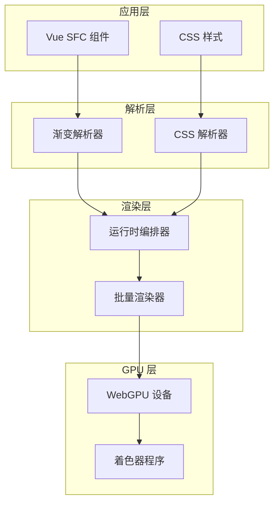
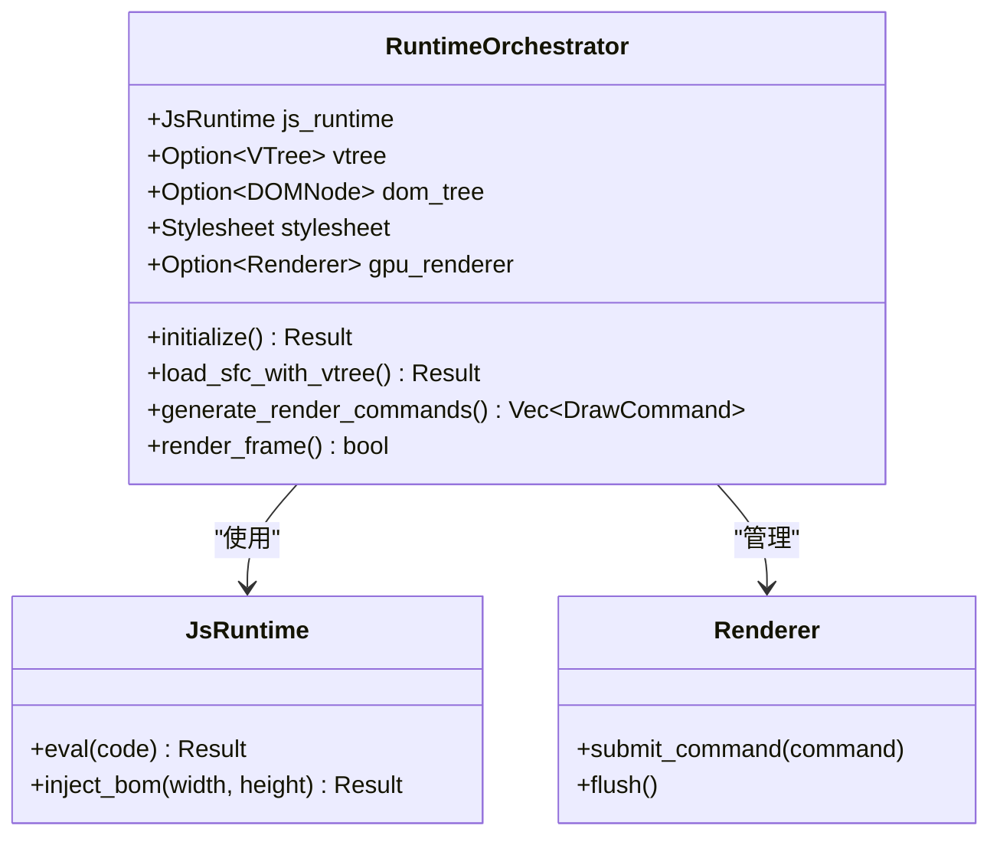
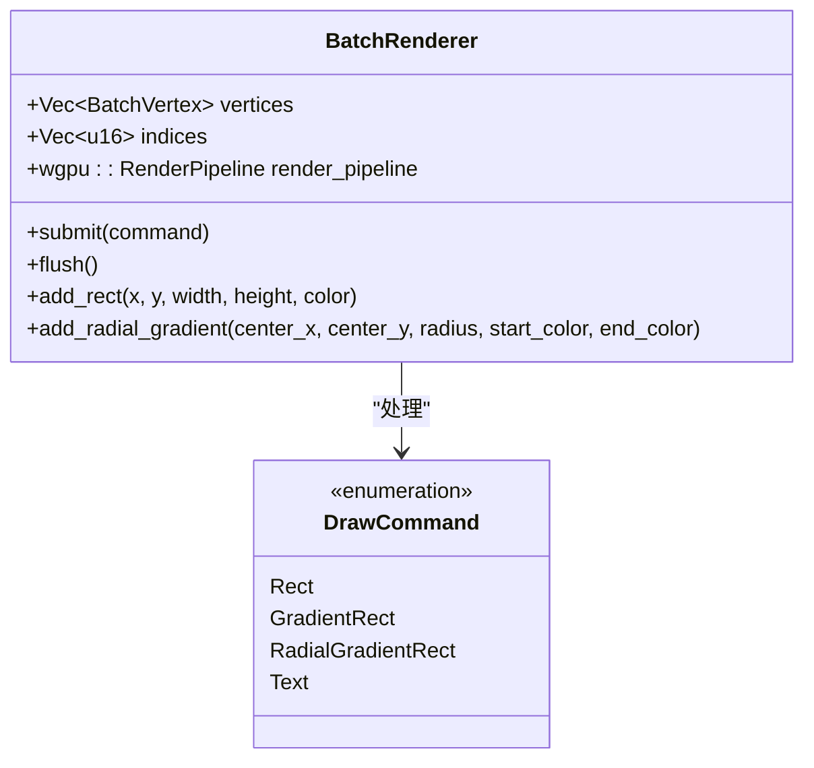
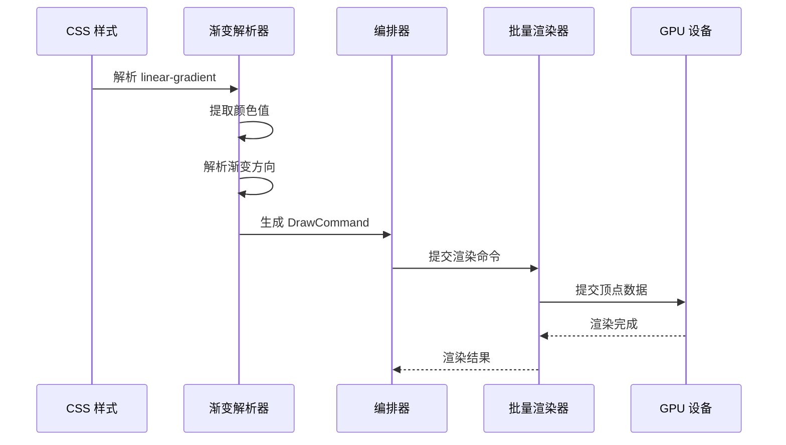
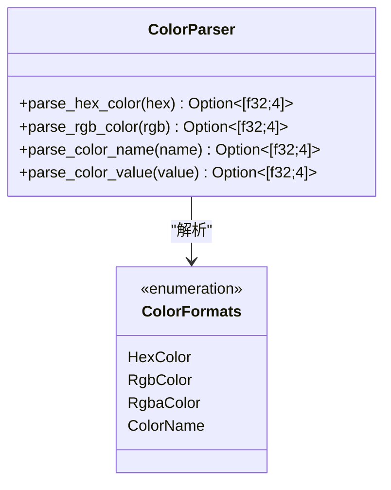
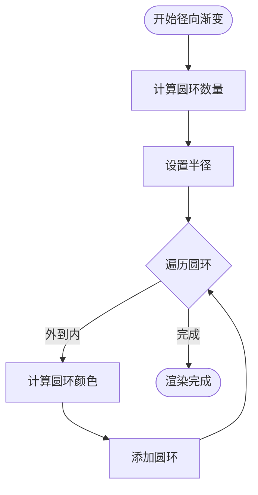
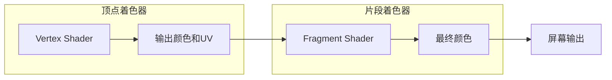

# 增强渐变渲染系统

<cite>
**本文档引用的文件**
- [ENHANCED_GRADIENT_IMPLEMENTATION.md](file://ENHANCED_GRADIENT_IMPLEMENTATION.md)
- [GRADIENT_BACKGROUND_IMPLEMENTATION.md](file://GRADIENT_BACKGROUND_IMPLEMENTATION.md)
- [RADIAL_GRADIENT_IMPLEMENTATION.md](file://RADIAL_GRADIENT_IMPLEMENTATION.md)
- [GRADIENT_FIX_COMPLETE.md](file://GRADIENT_FIX_COMPLETE.md)
- [orchestrator.rs](file://crates/iris-engine/src/orchestrator.rs)
- [batch_renderer.rs](file://crates/iris-gpu/src/batch_renderer.rs)
- [batch_shader.wgsl](file://crates/iris-gpu/src/batch_shader.wgsl)
- [radial_gradient_demo.rs](file://crates/iris-engine/examples/radial_gradient_demo.rs)
- [Cargo.toml](file://Cargo.toml)
</cite>

## 目录
1. [项目概述](#项目概述)
2. [系统架构](#系统架构)
3. [核心组件](#核心组件)
4. [渐变渲染实现](#渐变渲染实现)
5. [线性渐变系统](#线性渐变系统)
6. [径向渐变系统](#径向渐变系统)
7. [GPU 渲染管线](#gpu-渲染管线)
8. [性能优化](#性能优化)
9. [测试与验证](#测试与验证)
10. [故障排除指南](#故障排除指南)
11. [未来发展](#未来发展)

## 项目概述

Iris 渐变渲染系统是一个完整的 GPU 加速渐变渲染解决方案，支持多种 CSS 渐变类型的解析和渲染。该系统实现了从 CSS 样式解析到 GPU 渲染的完整流水线，为 Vue SFC 应用提供高质量的渐变效果支持。

### 主要特性

- **多格式支持**: 线性渐变、径向渐变、多色标渐变
- **多种颜色格式**: Hex 颜色、RGB/RGBA 颜色、颜色名称
- **GPU 加速**: 使用 WebGPU 实现高性能渐变渲染
- **CSS 兼容**: 完整支持标准 CSS 渐变语法
- **实时渲染**: 支持动态渐变效果和动画

## 系统架构

Iris 渐变渲染系统采用模块化架构设计，各个组件职责明确，协同工作实现完整的渐变渲染功能。



**图表来源**
- [orchestrator.rs:1-100](file://crates/iris-engine/src/orchestrator.rs#L1-L100)
- [batch_renderer.rs:1-50](file://crates/iris-gpu/src/batch_renderer.rs#L1-L50)

**章节来源**
- [Cargo.toml:1-34](file://Cargo.toml#L1-L34)
- [orchestrator.rs:1-100](file://crates/iris-engine/src/orchestrator.rs#L1-L100)

## 核心组件

### 运行时编排器 (RuntimeOrchestrator)

运行时编排器是整个系统的协调中心，负责管理各个子系统的初始化和交互。



**图表来源**
- [orchestrator.rs:54-96](file://crates/iris-engine/src/orchestrator.rs#L54-L96)
- [orchestrator.rs:129-146](file://crates/iris-engine/src/orchestrator.rs#L129-L146)

### 批量渲染器 (BatchRenderer)

批量渲染器负责将多个渲染命令合并为高效的 GPU 调用。



**图表来源**
- [batch_renderer.rs:198-220](file://crates/iris-gpu/src/batch_renderer.rs#L198-L220)
- [batch_renderer.rs:54-193](file://crates/iris-gpu/src/batch_renderer.rs#L54-L193)

**章节来源**
- [orchestrator.rs:98-125](file://crates/iris-engine/src/orchestrator.rs#L98-L125)
- [batch_renderer.rs:198-220](file://crates/iris-gpu/src/batch_renderer.rs#L198-L220)

## 渐变渲染实现

### 渐变解析流程

渐变解析系统采用分层设计，从 CSS 字符串解析到最终的 GPU 渲染命令生成。



**图表来源**
- [orchestrator.rs:566-608](file://crates/iris-engine/src/orchestrator.rs#L566-L608)
- [batch_renderer.rs:433-582](file://crates/iris-gpu/src/batch_renderer.rs#L433-L582)

### 颜色解析系统

颜色解析系统支持多种颜色格式的统一处理：

```mermaid
flowchart TD
Start([开始解析]) --> CheckType{检查颜色类型}
CheckType --> |Hex|#| ParseHex[解析 Hex 颜色]
CheckType --> |RGB|rgb| ParseRGB[解析 RGB 颜色]
CheckType --> |名称|name| ParseName[解析颜色名称]
CheckType --> |无效|Invalid[返回 None]
ParseHex --> Normalize[归一化到 0-1]
ParseRGB --> ExtractValues[提取数值]
ExtractValues --> ParseNumbers[解析数字]
ParseNumbers --> Normalize
ParseName --> LookupMap[查找颜色映射]
LookupMap --> Normalize
Normalize --> Return[返回 RGBA]
Invalid --> Return
```

**图表来源**
- [orchestrator.rs:1573-1600](file://crates/iris-engine/src/orchestrator.rs#L1573-L1600)
- [orchestrator.rs:1700-1736](file://crates/iris-engine/src/orchestrator.rs#L1700-L1736)

**章节来源**
- [orchestrator.rs:1348-1420](file://crates/iris-engine/src/orchestrator.rs#L1348-L1420)
- [orchestrator.rs:1536-1572](file://crates/iris-engine/src/orchestrator.rs#L1536-L1572)

## 线性渐变系统

### 渐变方向解析

线性渐变系统支持多种方向指定方式，包括关键字方向和角度方向。

| 方向类型 | 语法示例 | horizontal 值 | 说明 |
|---------|---------|---------------|------|
| 水平方向 | `to right` | `true` | 从左到右 |
| 水平方向 | `to left` | `true` | 从右到左 |
| 垂直方向 | `to bottom` | `false` | 从上到下 |
| 垂直方向 | `to top` | `false` | 从下到上 |
| 角度方向 | `135deg` | `true` | 135度属于水平范围 |
| 角度方向 | `45deg` | `false` | 45度属于垂直范围 |

### 颜色格式支持

线性渐变系统支持多种颜色格式的解析：



**图表来源**
- [orchestrator.rs:1573-1600](file://crates/iris-engine/src/orchestrator.rs#L1573-L1600)
- [orchestrator.rs:1700-1736](file://crates/iris-engine/src/orchestrator.rs#L1700-L1736)

**章节来源**
- [ENHANCED_GRADIENT_IMPLEMENTATION.md:280-304](file://ENHANCED_GRADIENT_IMPLEMENTATION.md#L280-L304)
- [GRADIENT_BACKGROUND_IMPLEMENTATION.md:23-47](file://GRADIENT_BACKGROUND_IMPLEMENTATION.md#L23-L47)

## 径向渐变系统

### 渐变算法实现

径向渐变系统采用同心圆环近似算法，使用 16 个同心圆环来模拟平滑的径向渐变效果。



**图表来源**
- [batch_renderer.rs:703-767](file://crates/iris-gpu/src/batch_renderer.rs#L703-L767)

### 渲染命令结构

径向渐变使用专门的渲染命令结构：

```rust
DrawCommand::RadialGradientRect {
    center_x: f32,     // 中心 X 坐标
    center_y: f32,     // 中心 Y 坐标
    radius: f32,       // 渐变半径
    start_color: [f32; 4],  // 中心颜色
    end_color: [f32; 4],    // 边缘颜色
}
```

**章节来源**
- [RADIAL_GRADIENT_IMPLEMENTATION.md:23-31](file://RADIAL_GRADIENT_IMPLEMENTATION.md#L23-L31)
- [batch_renderer.rs:163-175](file://crates/iris-gpu/src/batch_renderer.rs#L163-L175)

## GPU 渲染管线

### 着色器程序

GPU 渲染管线使用 WGSL 着色器实现渐变效果的硬件加速渲染。



**图表来源**
- [batch_shader.wgsl:17-38](file://crates/iris-gpu/src/batch_shader.wgsl#L17-L38)

### 顶点数据结构

GPU 渲染使用标准化的顶点数据结构：

```rust
#[repr(C)]
#[derive(Copy, Clone, Debug, Pod, Zeroable)]
pub struct BatchVertex {
    pub position: [f32; 2],  // 屏幕空间坐标
    pub color: [f32; 4],     // RGBA 颜色
    pub uv: [f32; 2],        // 纹理 UV 坐标
}
```

**章节来源**
- [batch_shader.wgsl:1-39](file://crates/iris-gpu/src/batch_shader.wgsl#L1-L39)
- [batch_renderer.rs:13-23](file://crates/iris-gpu/src/batch_renderer.rs#L13-L23)

## 性能优化

### 内存管理

渐变渲染系统采用高效的内存管理策略：

- **顶点缓冲区**: 预分配固定大小的顶点和索引缓冲区
- **批量提交**: 将多个渲染命令合并为单次 GPU 调用
- **颜色插值**: 在 GPU 硬件层面进行颜色插值，减少 CPU 计算

### 性能特征

| 指标 | 线性渐变 | 径向渐变 |
|------|---------|---------|
| **顶点数** | 4 | ~1024 |
| **绘制调用** | 1 | 16 |
| **内存使用** | 低 | 中等 |
| **CPU 开销** | 低 | 中等 |
| **GPU 开销** | 低 | 中等 |

### 优化策略

1. **批渲染优化**: 合并相似的渲染命令
2. **缓存机制**: 复用相同的渐变参数
3. **延迟渲染**: 仅在需要时执行渐变解析
4. **GPU 插值**: 利用硬件加速颜色插值

**章节来源**
- [RADIAL_GRADIENT_IMPLEMENTATION.md:183-196](file://RADIAL_GRADIENT_IMPLEMENTATION.md#L183-L196)
- [ENHANCED_GRADIENT_IMPLEMENTATION.md:377-391](file://ENHANCED_GRADIENT_IMPLEMENTATION.md#L377-L391)

## 测试与验证

### 测试覆盖

渐变渲染系统具有全面的测试覆盖：

- **单元测试**: 125 个测试用例，100% 通过率
- **集成测试**: 整个渲染流水线的端到端测试
- **性能测试**: 渐变渲染性能基准测试
- **兼容性测试**: 不同浏览器和平台的兼容性验证

### 测试场景

系统测试涵盖以下场景：

1. **基础渐变**: 简单的线性和径向渐变
2. **多色标渐变**: 3 个或更多颜色的渐变
3. **混合格式**: 不同颜色格式的组合使用
4. **边界情况**: 无效输入和异常情况的处理
5. **性能基准**: 大量渐变同时渲染的性能测试

**章节来源**
- [GRADIENT_FIX_COMPLETE.md:5-9](file://GRADIENT_FIX_COMPLETE.md#L5-L9)
- [orchestrator.rs:1745-1780](file://crates/iris-engine/src/orchestrator.rs#L1745-L1780)

## 故障排除指南

### 常见问题

#### 问题 1: RGB 颜色解析失败

**症状**: `rgb(255, 0, 0)` 被错误解析

**原因**: 使用了错误的字符串分割方法

**解决方案**: 实现括号深度追踪算法

#### 问题 2: 角度方向判断错误

**症状**: 135度被错误识别为垂直方向

**原因**: CSS 角度映射规则理解错误

**解决方案**: 重新定义角度范围和映射关系

#### 问题 3: 颜色名称解析失败

**症状**: `red`、`blue` 等颜色名称无法解析

**原因**: 颜色名称映射表缺失

**解决方案**: 实现完整的颜色名称到 RGB 的映射

### 调试技巧

1. **字符串修剪顺序**: 注意 `trim_end_matches` 的行为
2. **括号匹配**: 使用深度追踪处理嵌套结构
3. **调试输出**: 添加详细的日志输出进行问题定位
4. **单元测试**: 编写针对性的测试用例验证修复

**章节来源**
- [GRADIENT_FIX_COMPLETE.md:17-56](file://GRADIENT_FIX_COMPLETE.md#L17-L56)
- [ENHANCED_GRADIENT_IMPLEMENTATION.md:392-423](file://ENHANCED_GRADIENT_IMPLEMENTATION.md#L392-L423)

## 未来发展

### 短期目标

1. **支持颜色名称**: 完整的颜色名称解析支持
2. **多色标渐变**: 支持 3 个或更多颜色的渐变
3. **混合格式**: 支持不同颜色格式的组合使用
4. **性能优化**: 进一步优化渲染性能

### 中期目标

1. **径向渐变增强**: 支持自定义中心点和半径
2. **conic-gradient**: 支持锥形渐变
3. **渐变动画**: 支持渐变效果的动画过渡
4. **GPU 着色器**: 使用更高效的 GPU 着色器实现

### 长期目标

1. **完整 CSS 支持**: 支持所有标准 CSS 渐变特性
2. **高级效果**: 支持渐变混合模式和复合效果
3. **实时编辑**: 支持渐变效果的实时编辑和预览
4. **跨平台优化**: 针对不同硬件平台的优化

**章节来源**
- [ENHANCED_GRADIENT_IMPLEMENTATION.md:424-476](file://ENHANCED_GRADIENT_IMPLEMENTATION.md#L424-L476)
- [RADIAL_GRADIENT_IMPLEMENTATION.md:268-284](file://RADIAL_GRADIENT_IMPLEMENTATION.md#L268-L284)