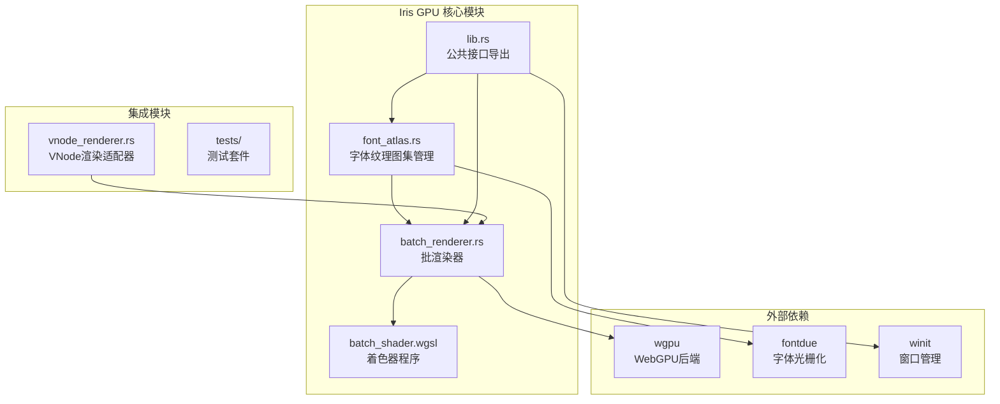
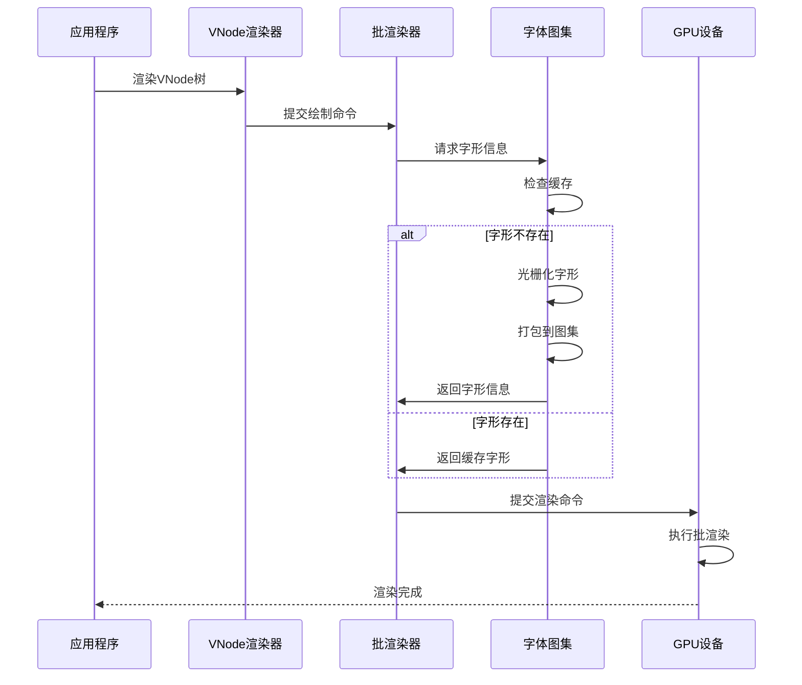
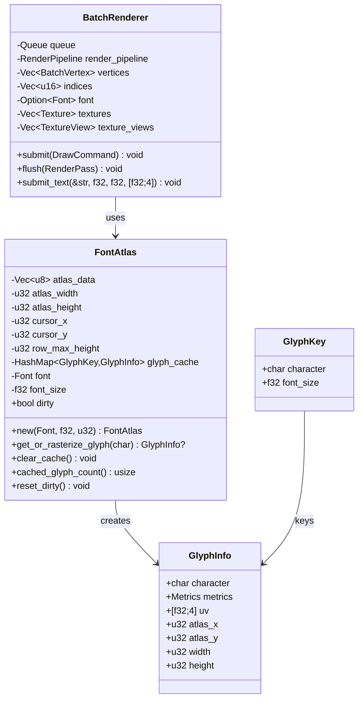
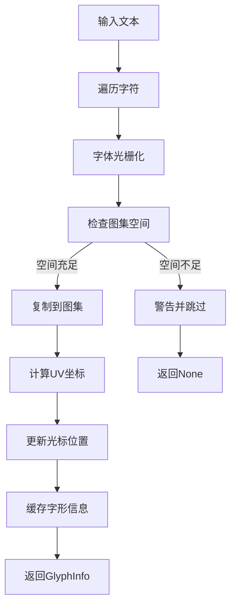
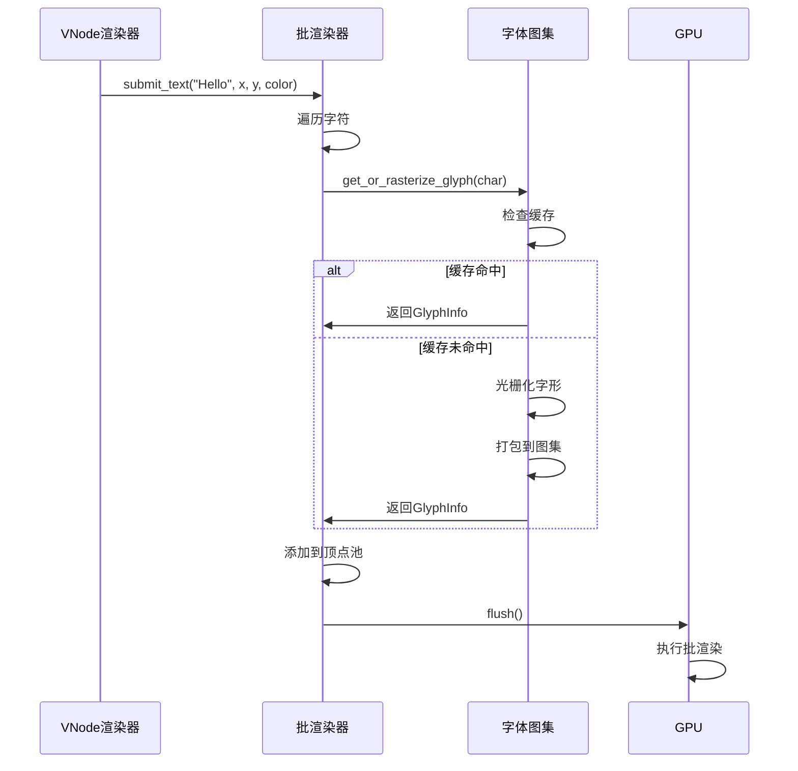
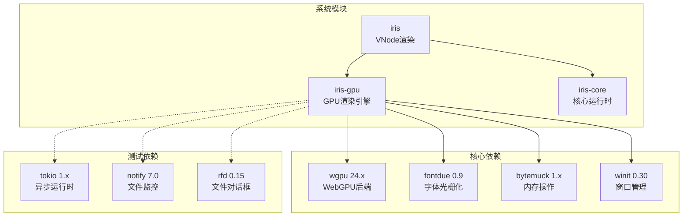

# 字体纹理图集系统

<cite>
**本文档引用的文件**
- [font_atlas.rs](file://crates/iris-gpu/src/font_atlas.rs)
- [batch_renderer.rs](file://crates/iris-gpu/src/batch_renderer.rs)
- [batch_shader.wgsl](file://crates/iris-gpu/src/batch_shader.wgsl)
- [lib.rs](file://crates/iris-gpu/src/lib.rs)
- [vnode_renderer.rs](file://crates/iris/src/vnode_renderer.rs)
- [Cargo.toml](file://Cargo.toml)
- [iris-gpu/Cargo.toml](file://crates/iris-gpu/Cargo.toml)
- [gpu_texture_rendering.rs](file://crates/iris-gpu/tests/gpu_texture_rendering.rs)
- [file_watcher_integration.rs](file://crates/iris-gpu/tests/file_watcher_integration.rs)
</cite>

## 目录
1. [简介](#简介)
2. [项目结构](#项目结构)
3. [核心组件](#核心组件)
4. [架构概览](#架构概览)
5. [详细组件分析](#详细组件分析)
6. [依赖关系分析](#依赖关系分析)
7. [性能考虑](#性能考虑)
8. [故障排除指南](#故障排除指南)
9. [结论](#结论)

## 简介

字体纹理图集系统是 Iris GPU 渲染引擎的核心组成部分，专门负责高效管理和渲染文本内容。该系统通过将 CPU 光栅化的字形缓存到 GPU 纹理图集中，显著提升了文本渲染性能，减少了 GPU 状态切换和绘制调用次数。

系统采用现代 WebGPU 技术栈，结合批渲染优化策略，实现了从字体光栅化、纹理图集管理到最终 GPU 渲染的完整流水线。该架构支持动态字体加载、智能缓存管理、UV 坐标映射以及与现有渲染管线的无缝集成。

## 项目结构

Iris GPU 渲染引擎采用模块化设计，字体纹理图集系统主要位于 `crates/iris-gpu` 目录中：

**图表来源**
- [font_atlas.rs:1-429](file://crates/iris-gpu/src/font_atlas.rs#L1-L429)
- [batch_renderer.rs:1-1502](file://crates/iris-gpu/src/batch_renderer.rs#L1-L1502)
- [lib.rs:1-504](file://crates/iris-gpu/src/lib.rs#L1-L504)

**章节来源**
- [Cargo.toml:1-31](file://Cargo.toml#L1-L31)
- [iris-gpu/Cargo.toml:1-26](file://crates/iris-gpu/Cargo.toml#L1-L26)

## 核心组件

### 字体纹理图集管理器

字体纹理图集管理器是系统的核心组件，负责将光栅化的字形高效地存储在 GPU 纹理图集中。其主要功能包括：

- **字形缓存管理**：使用 LRU 缓存策略存储已光栅化的字形，避免重复计算
- **纹理图集打包**：将多个字形智能地排列在单个纹理中，最大化空间利用率
- **UV 坐标映射**：为每个字形计算精确的纹理坐标，支持高质量渲染
- **动态空间管理**：实现自动换行和行高跟踪，确保字形按行排列

### 批渲染器

批渲染器负责将多个绘制命令合并为单次 GPU 调用，显著提升渲染性能：

- **顶点池管理**：维护动态顶点和索引缓冲区，支持大量图形对象
- **纹理绑定管理**：支持多纹理同时渲染，提供灵活的材质系统
- **混合模式支持**：实现 Alpha 混合、颜色插值等高级渲染效果
- **内存优化**：使用 bytemuck 库进行零拷贝数据传输

### 着色器系统

基于 WGSL 的着色器程序提供了完整的渲染管线支持：

- **顶点着色器**：处理屏幕空间坐标变换和颜色传递
- **片段着色器**：实现纹理采样、颜色混合和透明度处理
- **纹理采样器**：支持线性过滤和边缘采样模式
- **绑定组管理**：提供灵活的资源绑定接口

**章节来源**
- [font_atlas.rs:51-226](file://crates/iris-gpu/src/font_atlas.rs#L51-L226)
- [batch_renderer.rs:152-176](file://crates/iris-gpu/src/batch_renderer.rs#L152-L176)
- [batch_shader.wgsl:1-39](file://crates/iris-gpu/src/batch_shader.wgsl#L1-L39)

## 架构概览

字体纹理图集系统采用分层架构设计，各组件职责明确且耦合度低：

**图表来源**
- [vnode_renderer.rs:115-187](file://crates/iris/src/vnode_renderer.rs#L115-L187)
- [batch_renderer.rs:385-492](file://crates/iris-gpu/src/batch_renderer.rs#L385-L492)
- [font_atlas.rs:100-169](file://crates/iris-gpu/src/font_atlas.rs#L100-L169)

系统架构的关键特点：

1. **解耦设计**：字体图集管理器独立于渲染器，便于测试和维护
2. **缓存优先**：通过 LRU 缓存减少重复光栅化开销
3. **批处理优化**：将多个绘制调用合并为单次 GPU 交互
4. **内存友好**：使用零拷贝数据传输和高效的内存布局

## 详细组件分析

### 字体纹理图集类图

**图表来源**
- [font_atlas.rs:15-73](file://crates/iris-gpu/src/font_atlas.rs#L15-L73)
- [batch_renderer.rs:152-176](file://crates/iris-gpu/src/batch_renderer.rs#L152-L176)

### 文本渲染流程

字体纹理图集系统支持两种文本渲染模式：

#### CPU 光栅化模式

**图表来源**
- [font_atlas.rs:100-169](file://crates/iris-gpu/src/font_atlas.rs#L100-L169)

#### 批渲染集成

**图表来源**
- [vnode_renderer.rs:493-535](file://crates/iris/src/vnode_renderer.rs#L493-L535)
- [batch_renderer.rs:961-1013](file://crates/iris-gpu/src/batch_renderer.rs#L961-L1013)

**章节来源**
- [font_atlas.rs:75-226](file://crates/iris-gpu/src/font_atlas.rs#L75-L226)
- [batch_renderer.rs:178-818](file://crates/iris-gpu/src/batch_renderer.rs#L178-L818)
- [vnode_renderer.rs:493-548](file://crates/iris/src/vnode_renderer.rs#L493-L548)

### 性能优化特性

系统实现了多项性能优化策略：

#### 内存布局优化
- 使用 `bytemuck::Pod` 和 `Zeroable` trait 确保内存对齐
- 顶点数据紧凑存储，减少内存占用
- 零拷贝数据传输，避免不必要的内存复制

#### 缓存策略
- LRU 字形缓存，支持动态清理
- 智能空间管理，最大化图集利用率
- 脏标记系统，仅更新必要的纹理数据

#### 渲染优化
- 批处理渲染，减少 GPU 状态切换
- 纹理图集共享，避免重复纹理绑定
- 智能索引管理，支持大量图形对象

**章节来源**
- [batch_renderer.rs:14-51](file://crates/iris-gpu/src/batch_renderer.rs#L14-L51)
- [font_atlas.rs:32-49](file://crates/iris-gpu/src/font_atlas.rs#L32-L49)

## 依赖关系分析

字体纹理图集系统依赖于多个关键库和模块：

**图表来源**
- [iris-gpu/Cargo.toml:11-22](file://crates/iris-gpu/Cargo.toml#L11-L22)
- [Cargo.toml:13-31](file://Cargo.toml#L13-L31)

### 外部接口

系统通过清晰的接口定义与其他模块交互：

#### 公共 API 接口
- `FontAtlas::new()` - 创建新的字体图集实例
- `FontAtlas::get_or_rasterize_glyph()` - 获取或光栅化字形
- `BatchRenderer::submit_text()` - 提交文本渲染命令
- `BatchRenderer::load_texture_from_bytes()` - 加载自定义纹理

#### 配置选项
- 图集尺寸配置（默认 512x512 像素）
- 字体大小设置
- 缓存容量管理
- 纹理格式选择（Rgba8UnormSrgb）

**章节来源**
- [lib.rs:13-16](file://crates/iris-gpu/src/lib.rs#L13-L16)
- [batch_renderer.rs:178-383](file://crates/iris-gpu/src/batch_renderer.rs#L178-L383)

## 性能考虑

字体纹理图集系统在设计时充分考虑了性能优化：

### 内存使用优化
- **图集尺寸**：默认 512x512 像素，可根据需求调整
- **字形缓存**：LRU 缓存策略，避免重复光栅化
- **内存对齐**：使用 Pod trait 确保最佳内存布局

### 渲染性能优化
- **批处理**：将多个绘制调用合并为单次 GPU 交互
- **纹理共享**：多个字形共享同一纹理图集
- **索引复用**：顶点数据复用，减少内存占用

### 扩展性考虑
- **动态图集**：支持运行时动态添加新字形
- **多字体支持**：可同时管理多个字体族
- **异步加载**：支持后台字体加载，避免阻塞主线程

## 故障排除指南

### 常见问题及解决方案

#### 字形渲染异常
**问题**：文本无法正确显示或显示为占位符
**原因**：
- 字体未正确设置
- 字形缓存为空
- 图集空间不足

**解决方案**：
1. 确保调用 `set_font()` 设置字体
2. 检查字形缓存状态
3. 增加图集尺寸或清理缓存

#### 性能问题
**问题**：渲染性能下降
**原因**：
- 图集空间不足导致频繁重建
- 缓存命中率低
- 批处理过大

**解决方案**：
1. 优化图集尺寸配置
2. 调整缓存策略
3. 分批次渲染大量文本

#### 内存泄漏
**问题**：内存使用持续增长
**原因**：
- 纹理未正确释放
- 字形缓存未清理
- 顶点缓冲区未重置

**解决方案**：
1. 定期调用 `clear_cache()` 清理缓存
2. 确保纹理资源正确管理
3. 在渲染循环末尾重置缓冲区

**章节来源**
- [batch_renderer.rs:818-824](file://crates/iris-gpu/src/batch_renderer.rs#L818-L824)
- [font_atlas.rs:212-226](file://crates/iris-gpu/src/font_atlas.rs#L212-L226)

## 结论

字体纹理图集系统通过精心设计的架构和多项性能优化，成功实现了高效的文本渲染解决方案。系统的主要优势包括：

1. **高性能渲染**：通过批处理和纹理图集技术显著提升渲染性能
2. **内存效率**：智能缓存和内存布局优化减少资源消耗
3. **易于集成**：清晰的 API 设计便于与其他渲染模块集成
4. **可扩展性**：模块化架构支持功能扩展和性能调优

该系统为 Iris GPU 渲染引擎提供了坚实的文本渲染基础，为构建高性能的图形应用程序奠定了重要基础。随着进一步的优化和功能扩展，该系统有望成为现代 WebGPU 应用程序文本渲染的标准解决方案。