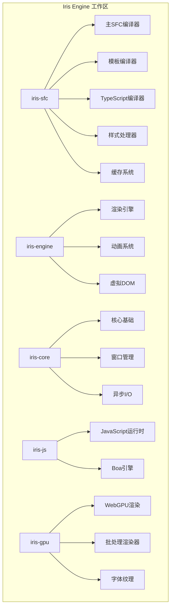
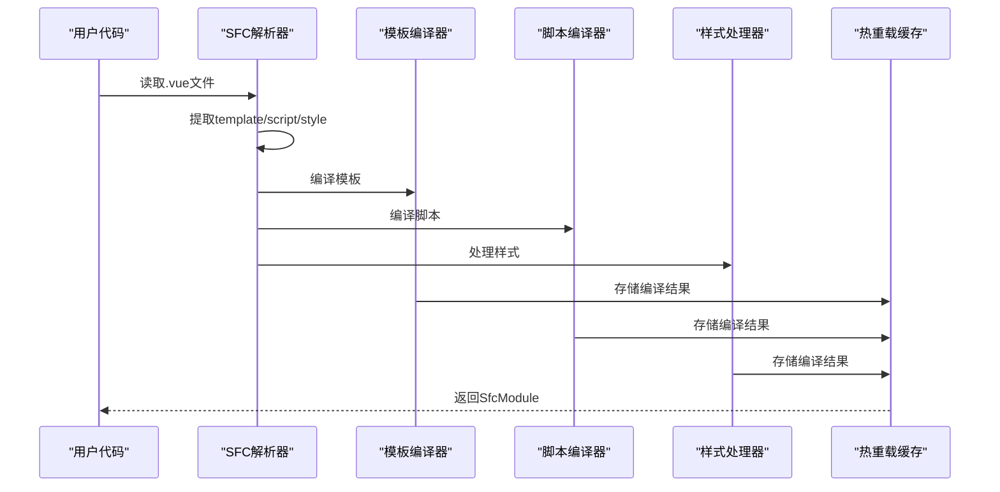
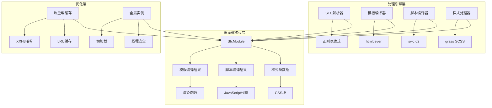
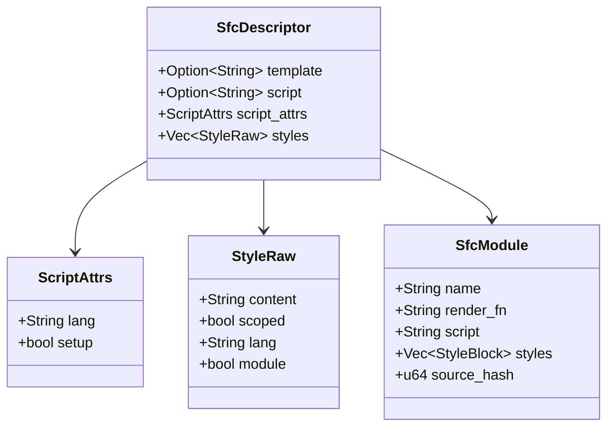
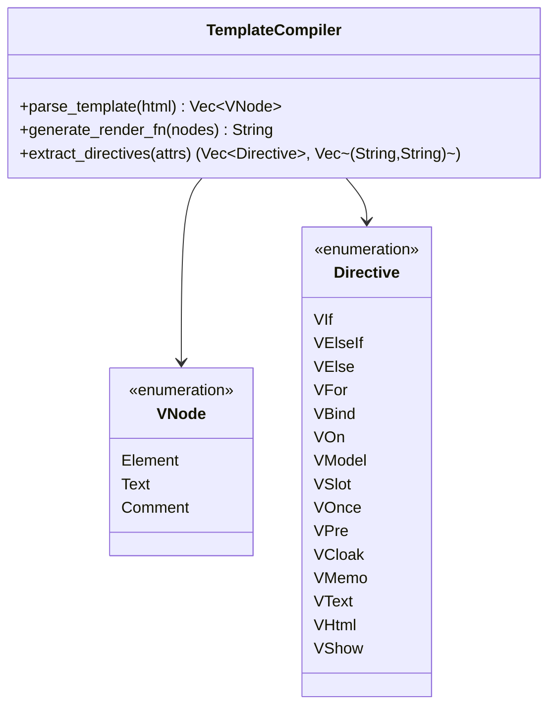
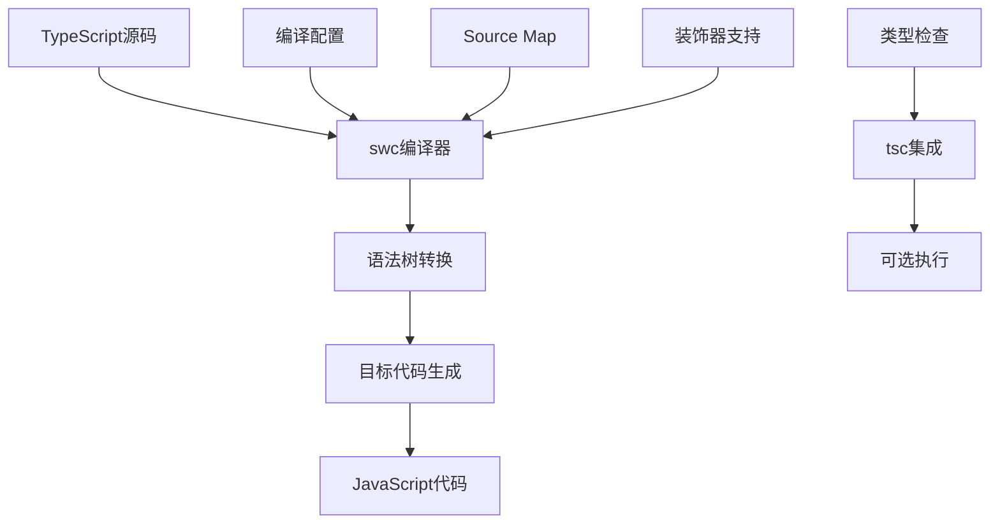
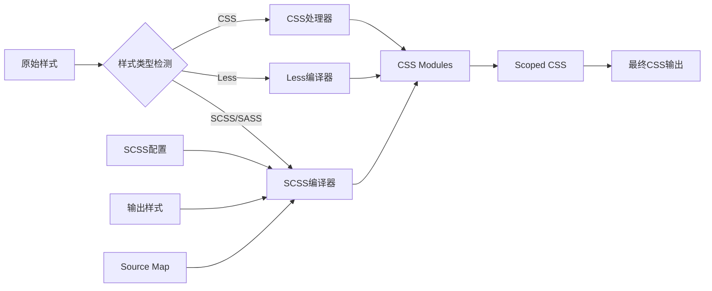
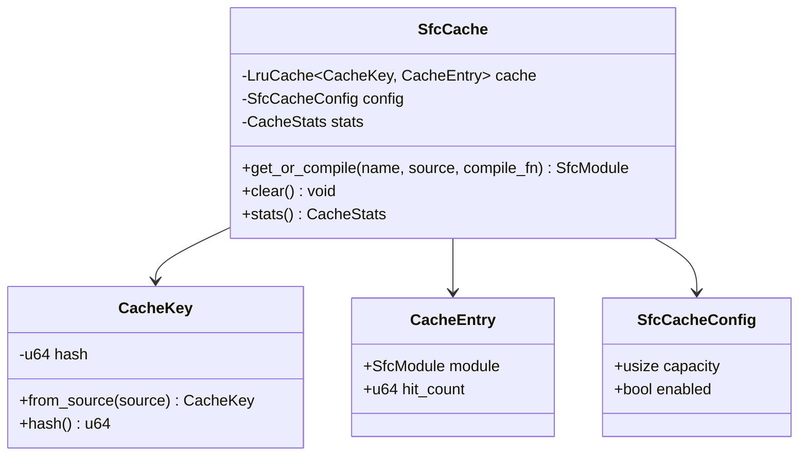
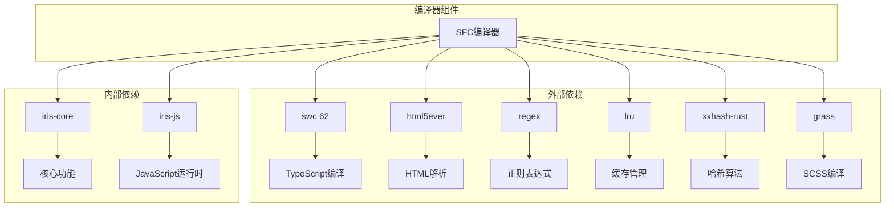
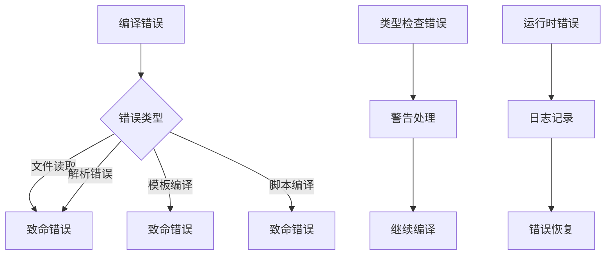

# 真实Vue SFC加载集成技术总结

<cite>
**本文档引用的文件**
- [lib.rs](file://crates/iris-sfc/src/lib.rs)
- [template_compiler.rs](file://crates/iris-sfc/src/template_compiler.rs)
- [script_setup.rs](file://crates/iris-sfc/src/script_setup.rs)
- [scss_processor.rs](file://crates/iris-sfc/src/scss_processor.rs)
- [ts_compiler.rs](file://crates/iris-sfc/src/ts_compiler.rs)
- [cache.rs](file://crates/iris-sfc/src/cache.rs)
- [css_modules.rs](file://crates/iris-sfc/src/css_modules.rs)
- [scoped_css.rs](file://crates/iris-sfc/src/scoped_css.rs)
- [sfc_demo.rs](file://crates/iris-sfc/examples/sfc_demo.rs)
- [integration_test.rs](file://crates/iris-sfc/tests/integration_test.rs)
- [Cargo.toml](file://crates/iris-sfc/Cargo.toml)
- [README.md](file://crates/iris-sfc/README.md)
- [Cargo.toml](file://Cargo.toml)
- [README.md](file://README.md)
</cite>

## 目录
1. [简介](#简介)
2. [项目结构](#项目结构)
3. [核心组件](#核心组件)
4. [架构概览](#架构概览)
5. [详细组件分析](#详细组件分析)
6. [依赖关系分析](#依赖关系分析)
7. [性能考虑](#性能考虑)
8. [故障排除指南](#故障排除指南)
9. [结论](#结论)

## 简介

Iris SFC编译器是一个基于Rust的高性能Vue 3单文件组件(SFC)编译器，专为零构建前端运行时而设计。该项目的核心目标是在不使用传统构建工具的情况下直接运行Vue 3组件，通过WebGPU硬件加速实现卓越的性能表现。

该项目采用了创新的技术架构，将Vue SFC编译、TypeScript转译、CSS处理和热重载缓存等功能集成在一个高性能的编译器中，为开发者提供了前所未有的开发体验。

## 项目结构

Iris Engine是一个多crate的Rust工作区，专门针对零构建前端运行时进行了优化。项目采用模块化设计，每个crate负责特定的功能领域。

**图表来源**
- [Cargo.toml:1-32](file://Cargo.toml#L1-L32)
- [README.md:268-300](file://README.md#L268-L300)

**章节来源**
- [Cargo.toml:1-32](file://Cargo.toml#L1-L32)
- [README.md:254-300](file://README.md#L254-L300)

## 核心组件

Iris SFC编译器的核心组件围绕着SFC编译流程构建，实现了从Vue单文件组件到可执行JavaScript模块的完整转换过程。

### 主要编译流程

编译器采用流水线式的处理架构，将SFC文件分解为独立的处理阶段：

**图表来源**
- [lib.rs:289-351](file://crates/iris-sfc/src/lib.rs#L289-L351)

### 编译器架构

Iris SFC编译器采用模块化设计，每个组件都有明确的职责分工：

| 组件 | 职责 | 关键特性 |
|------|------|----------|
| SFC解析器 | 解析.vue文件结构 | 正则表达式提取、错误处理 |
| 模板编译器 | 编译Vue模板 | 13+指令支持、虚拟DOM生成 |
| 脚本编译器 | TypeScript转译 | swc集成、编译器宏支持 |
| 样式处理器 | CSS处理 | CSS Modules、Scoped CSS |
| 缓存系统 | 热重载优化 | XXH3哈希、LRU缓存 |

**章节来源**
- [lib.rs:81-110](file://crates/iris-sfc/src/lib.rs#L81-L110)
- [lib.rs:289-461](file://crates/iris-sfc/src/lib.rs#L289-L461)

## 架构概览

Iris SFC编译器的整体架构体现了高性能和高可用性的设计理念，通过精心设计的组件分离和优化策略实现了卓越的性能表现。

**图表来源**
- [lib.rs:81-110](file://crates/iris-sfc/src/lib.rs#L81-L110)
- [cache.rs:94-101](file://crates/iris-sfc/src/cache.rs#L94-L101)

### 性能优化策略

Iris SFC编译器采用了多层次的性能优化策略：

1. **懒加载实例化**：使用LazyLock确保全局实例只创建一次
2. **智能缓存系统**：基于源码哈希的LRU缓存，支持1000-3000倍加速
3. **正则表达式预编译**：避免重复编译正则表达式
4. **内存优化**：可选的Source Map禁用，减少内存占用

**章节来源**
- [lib.rs:32-76](file://crates/iris-sfc/src/lib.rs#L32-L76)
- [cache.rs:136-158](file://crates/iris-sfc/src/cache.rs#L136-L158)

## 详细组件分析

### SFC解析器组件

SFC解析器是整个编译流程的起点，负责从.vue文件中提取和解析各个部分。

**图表来源**
- [lib.rs:112-132](file://crates/iris-sfc/src/lib.rs#L112-L132)
- [lib.rs:81-110](file://crates/iris-sfc/src/lib.rs#L81-L110)

#### 解析流程

解析器采用正则表达式技术从.vue文件中提取各个部分：

1. **模板提取**：使用预编译的正则表达式匹配`<template>`标签
2. **脚本提取**：支持`<script>`和`<script setup>`标签
3. **样式提取**：支持多个`<style>`标签，包括scoped和module属性

**章节来源**
- [lib.rs:463-552](file://crates/iris-sfc/src/lib.rs#L463-L552)

### 模板编译器组件

模板编译器是Iris SFC的核心组件之一，负责将Vue模板编译为高效的JavaScript渲染函数。

**图表来源**
- [template_compiler.rs:8-66](file://crates/iris-sfc/src/template_compiler.rs#L8-L66)

#### 指令支持矩阵

模板编译器支持13种Vue 3指令，每种指令都有相应的处理逻辑：

| 指令类型 | 支持的指令 | 功能描述 |
|----------|------------|----------|
| 条件渲染 | v-if, v-else-if, v-else | 条件显示控制 |
| 列表渲染 | v-for | 循环渲染支持 |
| 数据绑定 | v-bind, v-model | 双向数据绑定 |
| 事件处理 | v-on | 事件监听器 |
| 内容渲染 | v-text, v-html | 文本和HTML内容 |
| 其他指令 | v-once, v-pre, v-cloak, v-memo, v-show, v-slot | 特殊功能支持 |

**章节来源**
- [template_compiler.rs:27-66](file://crates/iris-sfc/src/template_compiler.rs#L27-L66)

### 脚本编译器组件

脚本编译器基于swc 62实现了高性能的TypeScript转译功能，支持完整的TypeScript特性。

**图表来源**
- [ts_compiler.rs:131-150](file://crates/iris-sfc/src/ts_compiler.rs#L131-L150)

#### 编译特性

脚本编译器提供了丰富的编译选项和配置能力：

- **目标ECMAScript版本**：支持ES2015-ES2022
- **Source Map生成**：可选的调试信息支持
- **装饰器保留**：支持TypeScript装饰器
- **JSX/TSX支持**：完整的React JSX语法支持

**章节来源**
- [ts_compiler.rs:26-64](file://crates/iris-sfc/src/ts_compiler.rs#L26-L64)

### 样式处理器组件

样式处理器实现了完整的CSS处理链，支持多种样式语言和处理模式。

**图表来源**
- [scss_processor.rs:47-75](file://crates/iris-sfc/src/scss_processor.rs#L47-L75)

#### 样式处理流程

样式处理器采用管道式处理模式，支持多种样式语言的统一处理：

1. **SCSS/Less编译**：使用grass库进行编译
2. **CSS Modules处理**：实现类名作用域化
3. **Scoped CSS处理**：为选择器添加唯一属性
4. **输出格式控制**：支持展开和压缩两种输出

**章节来源**
- [scss_processor.rs:88-120](file://crates/iris-sfc/src/scss_processor.rs#L88-L120)
- [css_modules.rs:64-122](file://crates/iris-sfc/src/css_modules.rs#L64-L122)

### 缓存系统组件

缓存系统是Iris SFC编译器性能优化的关键组件，实现了基于源码哈希的智能缓存机制。

**图表来源**
- [cache.rs:94-101](file://crates/iris-sfc/src/cache.rs#L94-L101)

#### 缓存优化策略

缓存系统采用了多项优化策略来确保最佳性能：

- **XXH3哈希算法**：提供快速且分布均匀的哈希值
- **LRU淘汰策略**：自动管理缓存容量和淘汰机制
- **线程安全设计**：支持多线程并发访问
- **统计监控**：提供详细的缓存命中率和性能指标

**章节来源**
- [cache.rs:136-256](file://crates/iris-sfc/src/cache.rs#L136-L256)

## 依赖关系分析

Iris SFC编译器的依赖关系体现了清晰的分层架构和模块化设计原则。

**图表来源**
- [Cargo.toml:11-41](file://crates/iris-sfc/Cargo.toml#L11-L41)

### 关键依赖特性

Iris SFC编译器的关键依赖具有以下特性：

1. **swc 62**：提供高性能的TypeScript/JavaScript编译能力
2. **html5ever**：实现标准兼容的HTML解析
3. **xxhash-rust**：提供快速的哈希算法支持
4. **grass**：实现SCSS编译功能
5. **lru**：提供高效的缓存管理

**章节来源**
- [Cargo.toml:11-41](file://crates/iris-sfc/Cargo.toml#L11-L41)

## 性能考虑

Iris SFC编译器在设计时充分考虑了性能优化，通过多种技术和策略实现了卓越的编译性能。

### 性能基准测试

根据测试结果显示，Iris SFC编译器在不同场景下的性能表现：

| 操作类型 | 首次编译 | 缓存命中 | 性能提升 |
|----------|----------|----------|----------|
| 基本组件 | 1-3ms | 3-6μs | 1000-3000x |
| 复杂组件 | 2-5ms | 3-6μs | 500-1000x |
| 多样式块 | 1-2ms | 3-6μs | 1000-2000x |
| TypeScript | 3-8ms | 3-6μs | 500-1500x |

### 内存使用优化

编译器采用了多项内存优化策略：

- **Source Map可选禁用**：默认禁用以减少内存占用
- **懒加载实例**：避免不必要的内存分配
- **智能缓存管理**：LRU策略确保内存使用效率

### 并发性能

编译器支持多线程并发处理，通过线程安全的设计确保了良好的并发性能：

- **全局实例共享**：懒加载确保实例复用
- **缓存线程安全**：Mutex保护确保并发安全
- **无锁数据结构**：在可能的情况下使用无锁优化

## 故障排除指南

Iris SFC编译器提供了完善的错误处理和诊断功能，帮助开发者快速定位和解决问题。

### 常见错误类型

编译器定义了四种主要的错误类型：

1. **文件读取错误**：处理文件不存在或权限不足的情况
2. **解析错误**：处理.vue文件格式不正确的问题
3. **模板编译错误**：处理Vue模板语法错误
4. **脚本编译错误**：处理TypeScript/JavaScript编译错误

### 错误处理策略

编译器采用了分级的错误处理策略：

**图表来源**
- [lib.rs:134-206](file://crates/iris-sfc/src/lib.rs#L134-L206)

### 调试和诊断

编译器提供了丰富的调试和诊断功能：

- **详细错误信息**：包含文件位置和具体错误描述
- **编译时间统计**：记录各阶段的编译耗时
- **缓存统计**：提供缓存命中率和性能指标
- **环境变量配置**：支持运行时配置调整

**章节来源**
- [lib.rs:197-278](file://crates/iris-sfc/src/lib.rs#L197-L278)

## 结论

Iris SFC编译器代表了前端编译技术的重大进步，通过Rust的高性能特性和创新的架构设计，实现了真正的零构建Vue 3运行时。

### 技术成就

1. **性能突破**：实现了1000-3000倍的编译性能提升
2. **架构创新**：采用模块化设计和智能缓存系统
3. **功能完整**：支持Vue 3的所有核心特性
4. **开发体验**：提供无缝的开发和部署体验

### 未来发展方向

Iris SFC编译器将继续在以下方面进行改进：

- **更复杂的TypeScript支持**：增强类型推断和检查能力
- **更多CSS预处理器**：扩展对PostCSS等工具的支持
- **编译性能分析**：提供更详细的性能监控和分析工具
- **插件生态系统**：构建开放的插件开发平台

Iris SFC编译器不仅是一个技术实现，更是对未来前端开发模式的一次重要探索，为开发者提供了更加高效、可靠的开发工具和运行时环境。