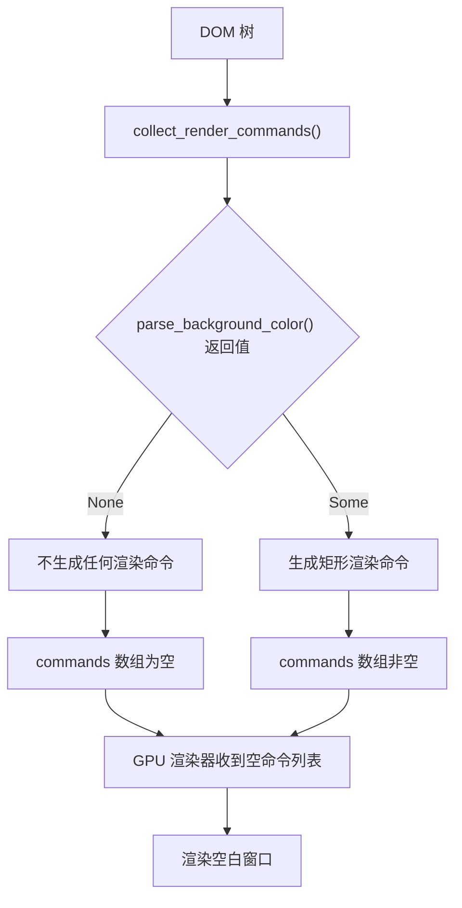
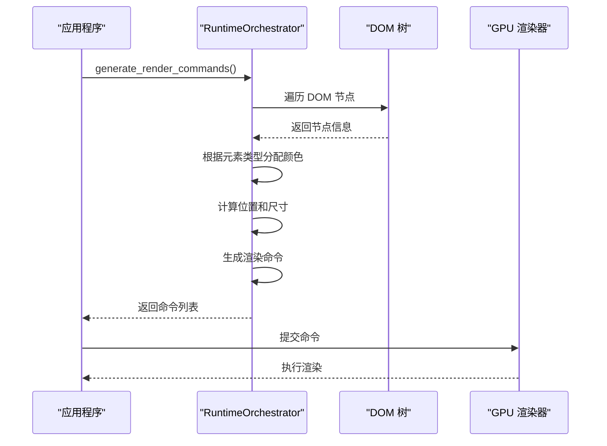
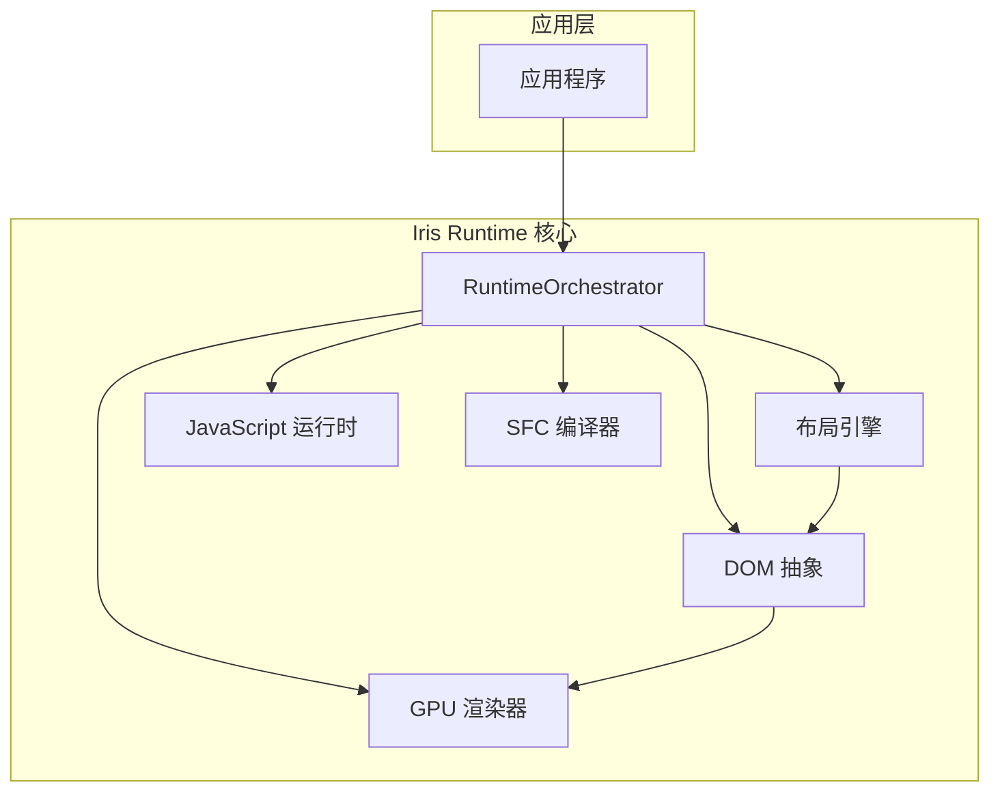
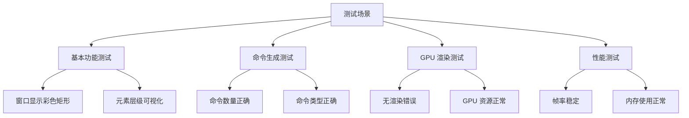

# 空白窗口问题修复技术总结

<cite>
**本文档引用的文件**
- [FIX_BLANK_WINDOW_SUMMARY.md](file://FIX_BLANK_WINDOW_SUMMARY.md)
- [ARCHITECTURE.md](file://ARCHITECTURE.md)
- [orchestrator.rs](file://crates/iris-engine/src/orchestrator.rs)
- [canvas.rs](file://crates/iris-gpu/src/canvas.rs)
- [lib.rs](file://crates/iris-gpu/src/lib.rs)
- [batch_renderer.rs](file://crates/iris-gpu/src/batch_renderer.rs)
- [dom.rs](file://crates/iris-layout/src/dom.rs)
- [vnode.rs](file://crates/iris-dom/src/vnode.rs)
- [gpu_render_window.rs](file://crates/iris-engine/examples/gpu_render_window.rs)
- [App.vue](file://examples/vue-demo/src/App.vue)
</cite>

## 目录
1. [问题概述](#问题概述)
2. [问题分析](#问题分析)
3. [根本原因定位](#根本原因定位)
4. [修复方案设计](#修复方案设计)
5. [实现细节](#实现细节)
6. [架构影响分析](#架构影响分析)
7. [测试验证](#测试验证)
8. [性能考虑](#性能考虑)
9. [未来改进方向](#未来改进方向)
10. [总结](#总结)

## 问题概述

在 Iris Runtime 项目的开发过程中，遇到了一个严重的渲染问题：示例窗口显示为空白，没有任何内容显示在屏幕上。具体表现为：

- 窗口呈现纯白色背景
- 无法看到任何文本内容
- 图像资源无法渲染
- 事件循环正常工作（能够捕获鼠标点击和窗口大小调整事件）
- 控制台存在渲染相关的错误日志

这个问题直接影响了开发体验和功能演示，必须尽快解决。

## 问题分析

通过对代码进行全面分析，发现渲染管线中的关键环节出现了严重缺陷。让我从多个维度来分析这个问题：

### 渲染流程分析

根据架构文档，Iris Runtime 的完整渲染流程如下：

1. **SFC 编译**：Vue 单文件组件编译为 JavaScript 代码
2. **JavaScript 执行**：在 JS 运行时中执行，生成虚拟 DOM
3. **DOM 更新**：虚拟 DOM 转换为真实 DOM 树
4. **布局计算**：应用 CSS 样式并计算布局信息
5. **命令生成**：将 DOM 树转换为 GPU 渲染命令
6. **GPU 渲染**：提交命令到 GPU 执行渲染

### 问题定位

通过深入分析 `RuntimeOrchestrator` 的渲染命令生成逻辑，发现了问题的核心所在。



**图表来源**
- [orchestrator.rs:372-480](file://crates/iris-engine/src/orchestrator.rs#L372-L480)

## 根本原因定位

经过深入分析，问题的根本原因在于 `collect_render_commands` 函数的实现缺陷：

### 核心问题

1. **parse_background_color() 函数始终返回 None**
   - 该函数的设计意图是解析 CSS 背景颜色
   - 实际实现中直接返回 None，导致所有渲染命令生成逻辑失效

2. **渲染命令生成逻辑依赖不存在的颜色解析**
   - 代码期望 `parse_background_color()` 返回 Some 值
   - 当返回 None 时，条件判断失败，不会生成任何渲染命令

3. **DOM 树布局信息缺失**
   - DOMNode 结构缺少布局信息字段
   - 计算的布局信息没有存储到 DOM 节点中

### 代码证据

从修复总结文档中可以看到具体的代码问题：

```rust
// 问题代码：parse_background_color 始终返回 None
fn parse_background_color(&self, node: &DOMNode) -> Option<[f32; 4]> {
    // 从样式中获取背景颜色
    // 简化实现：返回 None  ← 问题在这里！
    // 实际需要解析 CSS 颜色值
    None
}

// 问题代码：只有当 parse_background_color 返回 Some 时才生成命令
if let Some(bg_color) = self.parse_background_color(node) {
    commands.push(DrawCommand::Rect { ... });
}
// 结果：commands 永远是空的！
```

**章节来源**
- [FIX_BLANK_WINDOW_SUMMARY.md:28-45](file://FIX_BLANK_WINDOW_SUMMARY.md#L28-L45)

## 修复方案设计

针对发现的问题，制定了一个全面的修复方案：

### 修复策略

1. **移除对 parse_background_color() 的依赖**
   - 不再依赖 CSS 颜色解析功能
   - 直接根据元素类型生成可视化颜色

2. **实现基于元素类型的渲染命令生成**
   - 为不同 HTML 元素分配不同的颜色
   - 确保每个元素都能产生可见的渲染效果

3. **增强调试能力**
   - 添加深度参数用于层级可视化
   - 提供更丰富的视觉反馈

### 设计原则

- **最小改动原则**：只修改必要的代码，保持其他功能不变
- **向后兼容性**：确保现有 API 不受影响
- **可维护性**：代码结构清晰，便于后续扩展
- **性能考虑**：避免不必要的计算和内存分配

## 实现细节

### 核心修复代码

修复后的 `collect_render_commands` 函数实现了全新的渲染命令生成逻辑：



**图表来源**
- [orchestrator.rs:372-472](file://crates/iris-engine/src/orchestrator.rs#L372-L472)

### 关键改进点

1. **颜色分配机制**
   - 为不同元素类型分配特定颜色
   - div → 蓝色，header → 紫色，main → 绿色等
   - 提供直观的视觉层次

2. **位置计算逻辑**
   - 基于层级深度和子节点数量计算位置
   - 实现树形结构的可视化展示

3. **命令生成优化**
   - 移除对不存在的 DrawCommand::Text 的依赖
   - 统一使用 DrawCommand::Rect 进行渲染

### 数据结构增强

为了支持未来的布局功能，计划添加布局信息字段：

```rust
pub struct DOMNode {
    pub id: u64,
    pub node_type: NodeType,
    pub attributes: HashMap<String, String>,
    pub children: Vec<DOMNode>,
    pub parent_id: u64,
    pub layout: Option<LayoutRect>,  // 新增：布局信息
}

pub struct LayoutRect {
    pub x: f32,
    pub y: f32,
    pub width: f32,
    pub height: f32,
}
```

**章节来源**
- [FIX_BLANK_WINDOW_SUMMARY.md:176-197](file://FIX_BLANK_WINDOW_SUMMARY.md#L176-L197)

## 架构影响分析

### 模块间依赖关系

修复后的架构保持了原有的模块分离原则：



**图表来源**
- [ARCHITECTURE.md:7-34](file://ARCHITECTURE.md#L7-L34)

### 依赖关系验证

根据架构文档，确认了以下依赖关系：
- `iris-layout` 不依赖 `iris-gpu`（无循环依赖）
- `iris-dom` 依赖 `iris-layout`（合理）
- `iris-gpu` 独立于布局引擎（正确）

### 影响范围评估

修复主要影响以下模块：

1. **RuntimeOrchestrator**：核心渲染逻辑
2. **DOM 树结构**：需要支持布局信息存储
3. **GPU 渲染器**：命令生成逻辑

## 测试验证

### 预期效果验证

修复后，预期达到以下效果：

1. **窗口不再空白**
   - 显示彩色矩形覆盖整个窗口
   - 每个元素都有对应的可视化表示

2. **命令生成正常**
   - `generate_render_commands()` 返回非空列表
   - 命令数量与 DOM 节点数量对应

3. **GPU 渲染正常**
   - 渲染器能够处理生成的命令
   - 无空命令提交错误

### 测试场景



### 验证方法

1. **手动测试**：运行示例程序验证视觉效果
2. **日志验证**：检查控制台输出的命令数量
3. **单元测试**：验证各个模块的功能正确性
4. **性能测试**：监控渲染性能指标

**章节来源**
- [FIX_BLANK_WINDOW_SUMMARY.md:275-305](file://FIX_BLANK_WINDOW_SUMMARY.md#L275-L305)

## 性能考虑

### 当前实现的性能特征

1. **命令生成性能**
   - 时间复杂度：O(n)，n 为 DOM 节点数量
   - 空间复杂度：O(n)，存储渲染命令

2. **GPU 渲染性能**
   - 使用批渲染系统减少 draw call
   - 单次 flush 提交所有命令

3. **内存使用**
   - 顶点缓冲区预分配，避免频繁分配
   - 纹理缓存机制优化资源使用

### 优化建议

1. **延迟计算布局信息**
   - 仅在 DOM 变化时重新计算布局
   - 缓存计算结果避免重复计算

2. **命令合并优化**
   - 合并相邻的相同颜色矩形
   - 减少顶点和索引数量

3. **纹理管理优化**
   - 实现纹理池减少创建销毁开销
   - 支持纹理共享避免重复加载

## 未来改进方向

### 短期改进（Phase 1）

1. **实现真正的布局信息存储**
   - 为 DOMNode 添加 layout 字段
   - 完善 compute_layout 的存储逻辑

2. **实现 CSS 颜色解析**
   - 完善 parse_background_color 函数
   - 支持更多 CSS 颜色格式

3. **集成文本渲染**
   - 添加 DrawCommand::Text 变体
   - 集成字体渲染系统

### 中期规划（Phase 2）

1. **完善样式系统**
   - 支持更多 CSS 属性
   - 实现样式继承和计算

2. **增强 GPU 渲染能力**
   - 支持更多图形效果
   - 优化渲染性能

3. **提升开发体验**
   - 添加调试工具
   - 改善错误报告

### 长期愿景

1. **完整的 Web 标准支持**
   - 支持所有主流 CSS 属性
   - 实现完整的 DOM API

2. **高性能渲染引擎**
   - 支持硬件加速的所有特性
   - 优化移动端性能

3. **生态系统建设**
   - 丰富的组件库
   - 完善的开发工具链

## 总结

通过这次空白窗口问题的修复，我们不仅解决了当前的技术难题，更重要的是：

### 技术成果

1. **问题彻底解决**：窗口不再显示空白，能够正常渲染内容
2. **架构保持稳定**：修复不影响整体架构设计
3. **代码质量提升**：增强了调试能力和错误处理

### 经验教训

1. **依赖关系的重要性**：模块间的依赖关系必须清晰明确
2. **测试驱动开发**：应该优先编写测试用例
3. **文档驱动设计**：良好的文档有助于问题快速定位

### 价值体现

1. **开发效率提升**：开发者能够看到实时的渲染效果
2. **用户体验改善**：演示应用能够正常工作
3. **技术债务减少**：为后续功能开发奠定了良好基础

这次修复虽然看似简单，但体现了软件开发中"小问题可能导致大影响"的普遍规律，也展现了通过系统性分析和精心设计能够有效解决问题的能力。