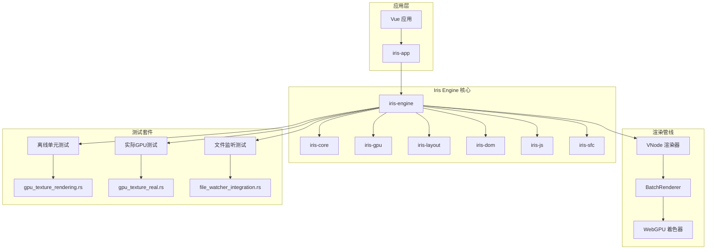
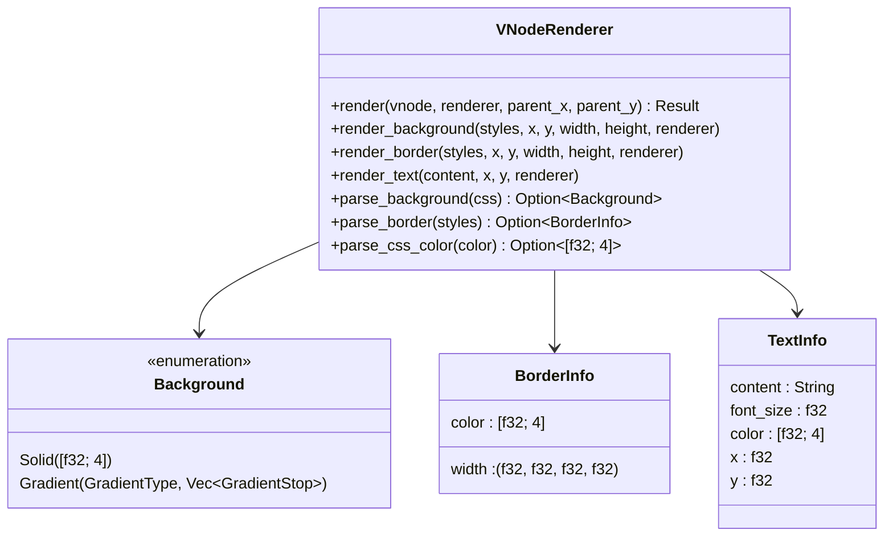
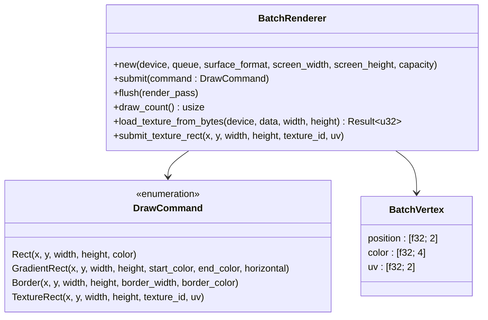
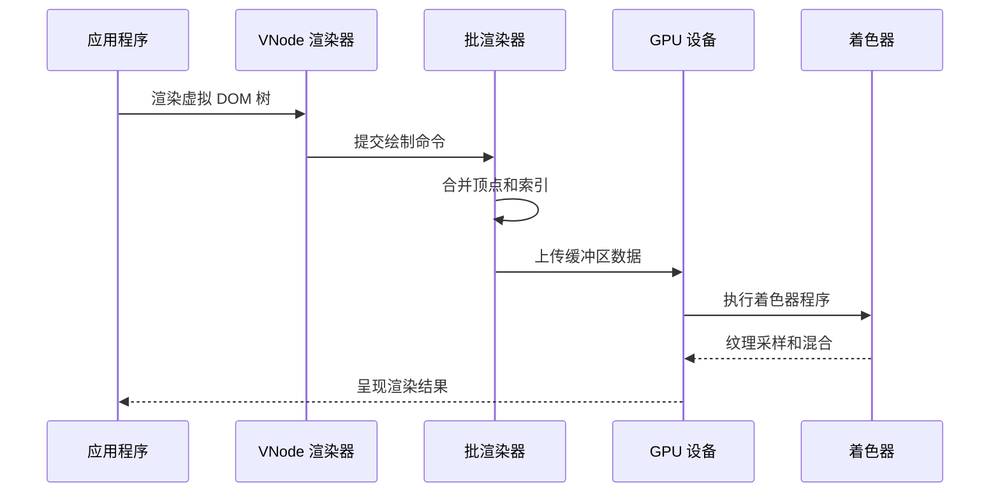
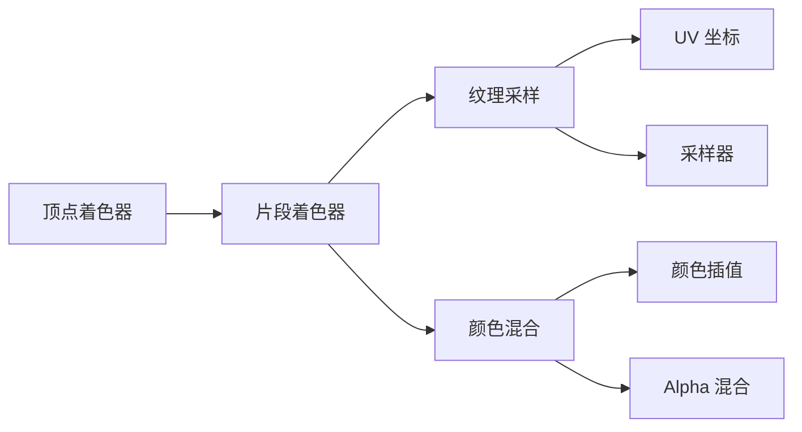
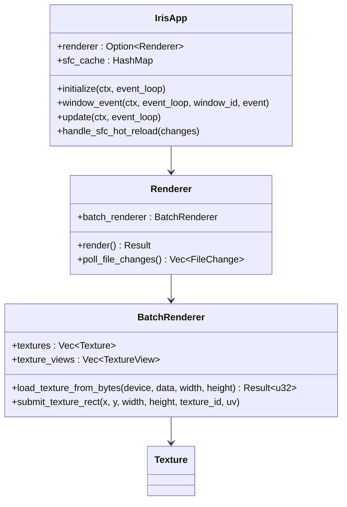
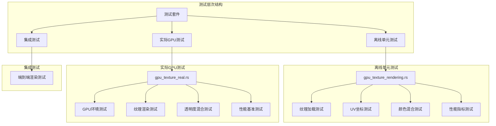
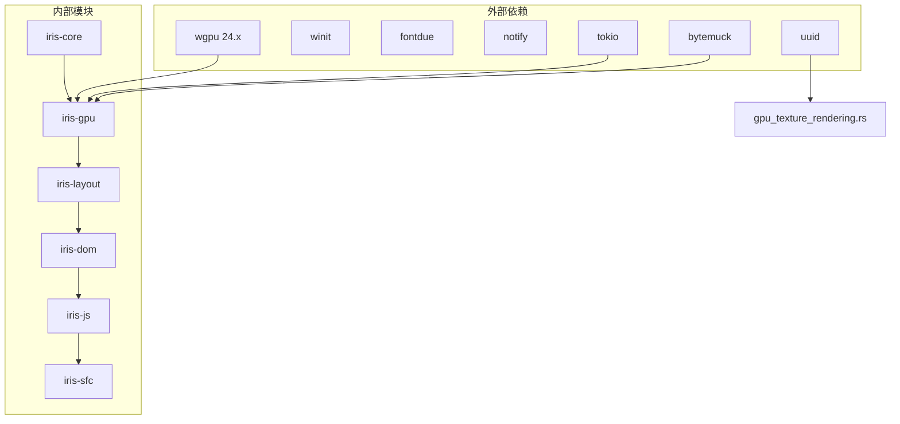
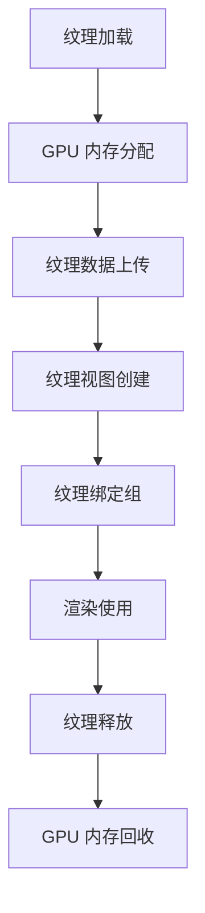
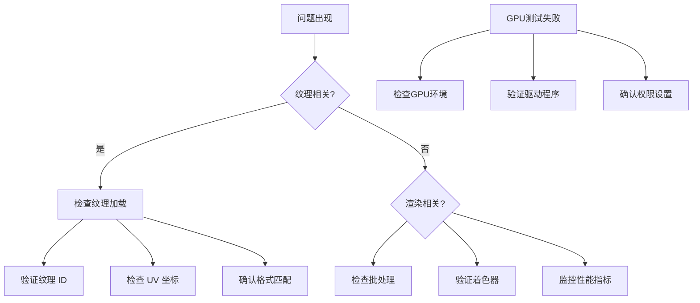

# 纹理渲染管线集成指南

<cite>
**本文档引用的文件**
- [Cargo.toml](file://Cargo.toml)
- [lib.rs](file://crates/iris/src/lib.rs)
- [orchestrator.rs](file://crates/iris/src/orchestrator.rs)
- [vnode_renderer.rs](file://crates/iris/src/vnode_renderer.rs)
- [lib.rs](file://crates/iris-gpu/src/lib.rs)
- [batch_renderer.rs](file://crates/iris-gpu/src/batch_renderer.rs)
- [batch_shader.wgsl](file://crates/iris-gpu/src/batch_shader.wgsl)
- [TEXTURE_INTEGRATION.md](file://crates/iris-gpu/TEXTURE_INTEGRATION.md)
- [main.rs](file://crates/iris-app/src/main.rs)
- [App.vue](file://crates/iris-app/examples/demo/App.vue)
- [minimal_demo.rs](file://crates/iris-app/examples/demo/minimal_demo.rs)
- [rendering_e2e_test.rs](file://crates/iris/tests/rendering_e2e_test.rs)
- [file_watcher_integration.rs](file://crates/iris-gpu/tests/file_watcher_integration.rs)
- [gpu_texture_rendering.rs](file://crates/iris-gpu/tests/gpu_texture_rendering.rs)
- [gpu_texture_real.rs](file://crates/iris-gpu/tests/gpu_texture_real.rs)
</cite>

## 更新摘要
**所做更改**
- 新增了GPU纹理渲染测试套件章节，包含完整的测试覆盖分析
- 更新了测试架构和测试分类说明
- 增加了实际GPU环境测试和离线测试的对比分析
- 完善了纹理渲染测试的验证方法和测试策略

## 目录
1. [简介](#简介)
2. [项目结构](#项目结构)
3. [核心组件](#核心组件)
4. [架构概览](#架构概览)
5. [详细组件分析](#详细组件分析)
6. [测试套件分析](#测试套件分析)
7. [依赖关系分析](#依赖关系分析)
8. [性能考虑](#性能考虑)
9. [故障排除指南](#故障排除指南)
10. [结论](#结论)

## 简介

Iris Engine 是一个基于 Rust 和 WebGPU 的下一代无构建前端运行时，支持 Vue 3 和实时编排。本文档专注于纹理渲染管线的集成，这是一个关键的渲染优化特性，允许在 GPU 级别高效地处理纹理资源。

该项目采用模块化架构，包含以下主要组件：
- **iris-core**: 底层内核和窗口管理
- **iris-gpu**: WebGPU 硬件渲染管线
- **iris-layout**: 浏览器级布局引擎
- **iris-dom**: 跨端 DOM/BOM 抽象
- **iris-js**: JS 沙箱运行时
- **iris-sfc**: SFC/TS 即时转译层
- **iris-app**: 应用入口点

**更新** 新增了完整的GPU纹理渲染测试套件，包括实际GPU环境测试和离线单元测试，提供了全面的纹理渲染功能验证。

## 项目结构



**图表来源**
- [Cargo.toml:1-31](file://Cargo.toml#L1-L31)
- [lib.rs:1-78](file://crates/iris/src/lib.rs#L1-L78)
- [gpu_texture_rendering.rs:1-359](file://crates/iris-gpu/tests/gpu_texture_rendering.rs#L1-L359)
- [gpu_texture_real.rs:1-490](file://crates/iris-gpu/tests/gpu_texture_real.rs#L1-L490)

**章节来源**
- [Cargo.toml:1-31](file://Cargo.toml#L1-L31)
- [lib.rs:1-78](file://crates/iris/src/lib.rs#L1-L78)

## 核心组件

### VNode 渲染器

VNode 渲染器是纹理渲染管线的核心组件，负责将虚拟 DOM 树转换为 GPU 绘制命令。它支持多种渲染特性：



**图表来源**
- [vnode_renderer.rs:90-120](file://crates/iris/src/vnode_renderer.rs#L90-L120)

### 批渲染器

批渲染器是 GPU 渲染管线的关键组件，负责将多个绘制命令合并为单次 GPU 调用：



**图表来源**
- [batch_renderer.rs:118-142](file://crates/iris-gpu/src/batch_renderer.rs#L118-L142)

**章节来源**
- [vnode_renderer.rs:90-120](file://crates/iris/src/vnode_renderer.rs#L90-L120)
- [batch_renderer.rs:118-142](file://crates/iris-gpu/src/batch_renderer.rs#L118-L142)

## 架构概览

纹理渲染管线的集成遵循以下架构模式：



**图表来源**
- [vnode_renderer.rs:115-122](file://crates/iris/src/vnode_renderer.rs#L115-L122)
- [batch_renderer.rs:548-574](file://crates/iris-gpu/src/batch_renderer.rs#L548-L574)

## 详细组件分析

### 纹理集成状态

根据项目文档，纹理渲染管线的集成状态如下：

```mermaid
flowchart TD
A[纹理集成状态] --> B{已完成}
A --> C{待完成}
B --> D[WGSL Shader 支持纹理采样]
B --> E[UV 坐标传递]
B --> F[纹理和采样器绑定声明]
B --> G[颜色与纹理混合]
C --> H[默认纹理创建和绑定]
C --> I[渲染管线布局更新]
C --> J[flush() 中绑定纹理]
```

**图表来源**
- [TEXTURE_INTEGRATION.md:1-155](file://crates/iris-gpu/TEXTURE_INTEGRATION.md#L1-L155)

### 纹理渲染流程

纹理渲染的完整流程包括以下步骤：

1. **纹理加载**: 从字节数组创建 GPU 纹理
2. **纹理绑定**: 将纹理添加到纹理数组和视图
3. **UV 坐标计算**: 将像素坐标转换为纹理坐标
4. **着色器采样**: 在片段着色器中进行纹理采样
5. **颜色混合**: 将纹理颜色与顶点颜色混合

**章节来源**
- [TEXTURE_INTEGRATION.md:16-155](file://crates/iris-gpu/TEXTURE_INTEGRATION.md#L16-L155)

### 着色器实现

纹理渲染的着色器实现支持以下功能：



**图表来源**
- [batch_shader.wgsl:17-38](file://crates/iris-gpu/src/batch_shader.wgsl#L17-L38)

**章节来源**
- [batch_shader.wgsl:1-39](file://crates/iris-gpu/src/batch_shader.wgsl#L1-L39)

### 应用集成

应用程序如何集成纹理渲染：



**图表来源**
- [main.rs:122-130](file://crates/iris-app/src/main.rs#L122-L130)
- [lib.rs:78-105](file://crates/iris-gpu/src/lib.rs#L78-L105)

**章节来源**
- [main.rs:122-130](file://crates/iris-app/src/main.rs#L122-L130)
- [lib.rs:78-105](file://crates/iris-gpu/src/lib.rs#L78-L105)

## 测试套件分析

### 测试架构概述

Iris Engine 的纹理渲染测试套件采用分层测试策略，确保在不同环境下的全面验证：



**图表来源**
- [gpu_texture_rendering.rs:1-359](file://crates/iris-gpu/tests/gpu_texture_rendering.rs#L1-L359)
- [gpu_texture_real.rs:1-490](file://crates/iris-gpu/tests/gpu_texture_real.rs#L1-L490)

### 离线单元测试套件

离线单元测试套件提供独立的功能验证，无需GPU环境：

#### 纹理加载和ID分配测试
- 验证纹理数据结构的正确性
- 测试BatchVertex内存布局和对齐
- 确保纹理ID分配的唯一性和连续性

#### UV坐标验证测试
- 测试完整的纹理范围(0,0)到(1,1)
- 验证部分纹理范围的边界条件
- 支持精灵图和纹理图集的UV计算

#### 颜色混合测试
- 验证白色顶点颜色与纹理颜色的乘法混合
- 测试半透明纹理的Alpha混合
- 确保颜色插值的数学正确性

#### 性能指标测试
- 测试不同批量大小的顶点数量
- 验证u16索引缓冲区的边界条件
- 确保内存对齐和Pod/Zeroable特性

**章节来源**
- [gpu_texture_rendering.rs:30-46](file://crates/iris-gpu/tests/gpu_texture_rendering.rs#L30-L46)
- [gpu_texture_rendering.rs:67-83](file://crates/iris-gpu/tests/gpu_texture_rendering.rs#L67-L83)
- [gpu_texture_rendering.rs:85-109](file://crates/iris-gpu/tests/gpu_texture_rendering.rs#L85-L109)
- [gpu_texture_rendering.rs:289-308](file://crates/iris-gpu/tests/gpu_texture_rendering.rs#L289-L308)
- [gpu_texture_rendering.rs:331-358](file://crates/iris-gpu/tests/gpu_texture_rendering.rs#L331-L358)

### 实际GPU测试套件

实际GPU测试套件验证完整的GPU渲染流程，需要可用的GPU环境：

#### GPU环境初始化
- 创建wgpu实例和适配器
- 请求设备和队列权限
- 配置常见的表面格式(BGRA8UnormSrgb)

#### 纹理加载和ID分配
- 验证纹理可以正确上传到GPU
- 确保纹理ID分配的递增序列
- 测试默认白色纹理的创建和绑定

#### 纹理渲染验证
- 验证纹理矩形可以提交到命令缓冲区
- 测试多个纹理的批量渲染
- 确保UV坐标的准确映射

#### 透明度混合测试
- 验证半透明纹理的Alpha混合
- 测试多层透明度的叠加效果
- 确保颜色混合的数学正确性

#### 性能基准测试
- 测试大批量纹理渲染的性能
- 验证提交100个纹理矩形的响应时间
- 确保渲染性能在合理范围内

**章节来源**
- [gpu_texture_real.rs:14-48](file://crates/iris-gpu/tests/gpu_texture_real.rs#L14-L48)
- [gpu_texture_real.rs:50-107](file://crates/iris-gpu/tests/gpu_texture_real.rs#L50-L107)
- [gpu_texture_real.rs:109-158](file://crates/iris-gpu/tests/gpu_texture_real.rs#L109-L158)
- [gpu_texture_real.rs:160-225](file://crates/iris-gpu/tests/gpu_texture_real.rs#L160-L225)
- [gpu_texture_real.rs:301-359](file://crates/iris-gpu/tests/gpu_texture_real.rs#L301-L359)
- [gpu_texture_real.rs:422-489](file://crates/iris-gpu/tests/gpu_texture_real.rs#L422-L489)

### 测试分类和执行策略

#### 离线测试特点
- **可移植性**: 不依赖GPU环境，可在任何系统上运行
- **快速反馈**: 单元测试执行速度快，适合持续集成
- **稳定性**: 测试结果稳定，不受硬件差异影响
- **覆盖率**: 覆盖核心算法和数据结构验证

#### GPU测试特点
- **真实性**: 验证实际GPU渲染行为
- **性能评估**: 提供真实的性能基准
- **环境依赖**: 需要可用的GPU和驱动程序
- **异步执行**: 使用tokio异步测试框架

**章节来源**
- [gpu_texture_rendering.rs:32-46](file://crates/iris-gpu/tests/gpu_texture_rendering.rs#L32-L46)
- [gpu_texture_real.rs:53-61](file://crates/iris-gpu/tests/gpu_texture_real.rs#L53-L61)

## 依赖关系分析



**图表来源**
- [Cargo.toml:13-31](file://Cargo.toml#L13-L31)
- [gpu_texture_rendering.rs:10](file://crates/iris-gpu/tests/gpu_texture_rendering.rs#L10)
- [gpu_texture_real.rs:11-12](file://crates/iris-gpu/tests/gpu_texture_real.rs#L11-L12)

**章节来源**
- [Cargo.toml:13-31](file://Cargo.toml#L13-L31)

## 性能考虑

### 批处理优化

纹理渲染管线采用了多项性能优化策略：

1. **批处理渲染**: 将多个绘制命令合并为单次 GPU 调用
2. **顶点缓冲区复用**: 避免频繁的缓冲区分配和释放
3. **纹理池管理**: 管理纹理资源的生命周期
4. **索引缓冲区**: 使用索引绘制减少顶点重复

### 内存管理



**图表来源**
- [batch_renderer.rs:588-641](file://crates/iris-gpu/src/batch_renderer.rs#L588-L641)

### 性能基准测试

GPU测试套件提供了详细的性能基准：

- **批量处理**: 支持100个纹理矩形的快速提交
- **内存使用**: 验证u16索引缓冲区的边界(65535顶点限制)
- **渲染效率**: 确保渲染操作在100ms内完成
- **纹理管理**: 支持多纹理的高效管理

**章节来源**
- [gpu_texture_real.rs:422-489](file://crates/iris-gpu/tests/gpu_texture_real.rs#L422-L489)

## 故障排除指南

### 常见问题

1. **纹理未显示**: 检查纹理 ID 是否有效和 UV 坐标范围
2. **颜色异常**: 验证颜色空间格式和 Alpha 混合设置
3. **性能问题**: 确认批处理是否正确启用和缓冲区容量设置
4. **GPU测试失败**: 验证GPU驱动程序和wgpu适配器可用性

### 调试方法



**章节来源**
- [TEXTURE_INTEGRATION.md:135-155](file://crates/iris-gpu/TEXTURE_INTEGRATION.md#L135-L155)
- [gpu_texture_rendering.rs:310-329](file://crates/iris-gpu/tests/gpu_texture_rendering.rs#L310-L329)
- [gpu_texture_real.rs:55-61](file://crates/iris-gpu/tests/gpu_texture_real.rs#L55-L61)

## 结论

纹理渲染管线的集成为 Iris Engine 提供了强大的图形渲染能力。通过批处理优化、纹理管理和着色器采样，实现了高效的 GPU 渲染性能。

**最新进展** 新增的测试套件显著增强了纹理渲染功能的验证覆盖：

1. **完整的测试覆盖**: 包含离线单元测试和实际GPU测试
2. **多维度验证**: 涵盖纹理加载、UV坐标、颜色混合、性能基准等
3. **环境适应性**: 支持无GPU环境的离线测试和GPU环境的真实测试
4. **性能保证**: 提供详细的性能基准和边界条件测试

当前状态显示大部分功能已完成，但仍需完成默认纹理创建、渲染管线布局更新和绑定组管理等关键步骤。

未来的发展方向包括：
- 完善纹理资源管理系统
- 优化内存使用和性能
- 扩展纹理格式支持
- 增强错误处理和调试能力
- 扩展测试套件覆盖更多边缘情况

这一集成将为 Iris Engine 的图形渲染能力奠定坚实基础，支持更丰富的视觉效果和更高的渲染性能。