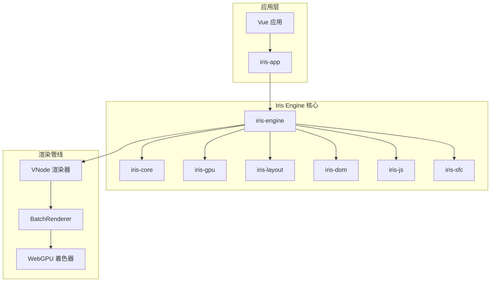
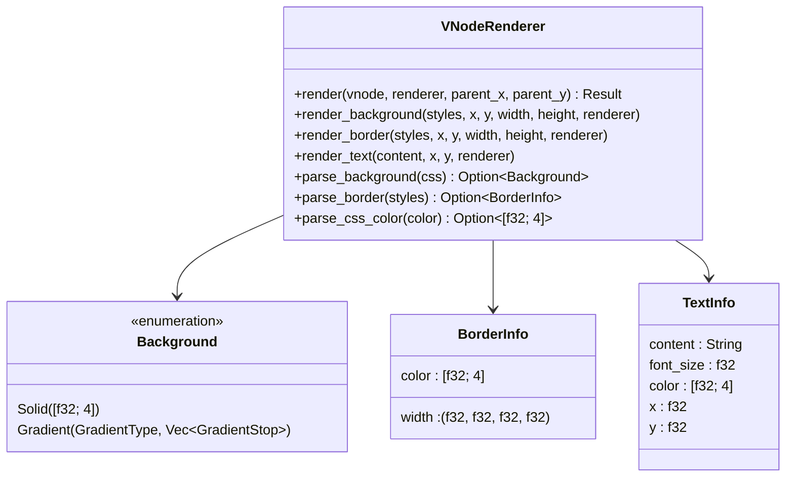
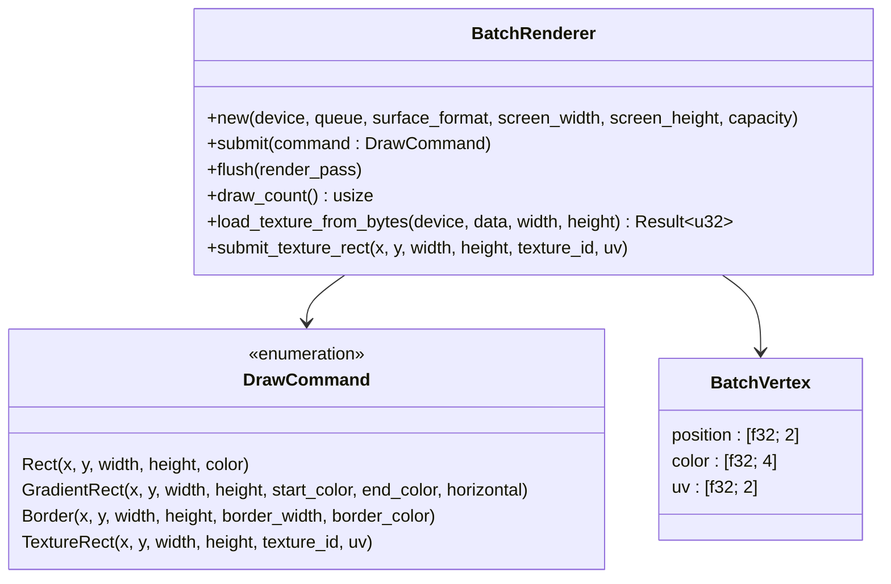
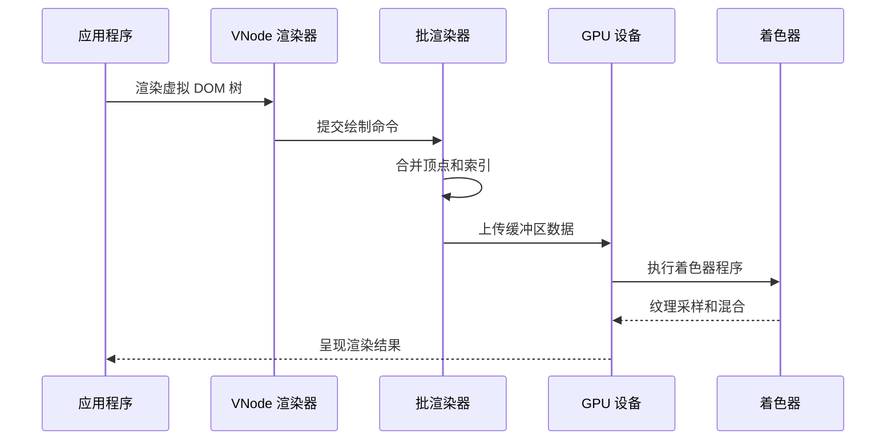
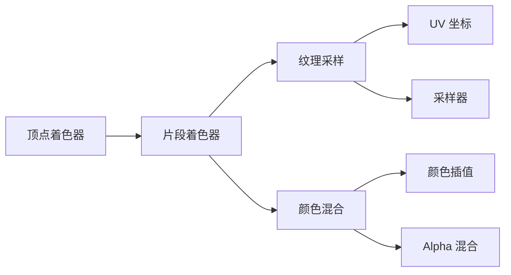
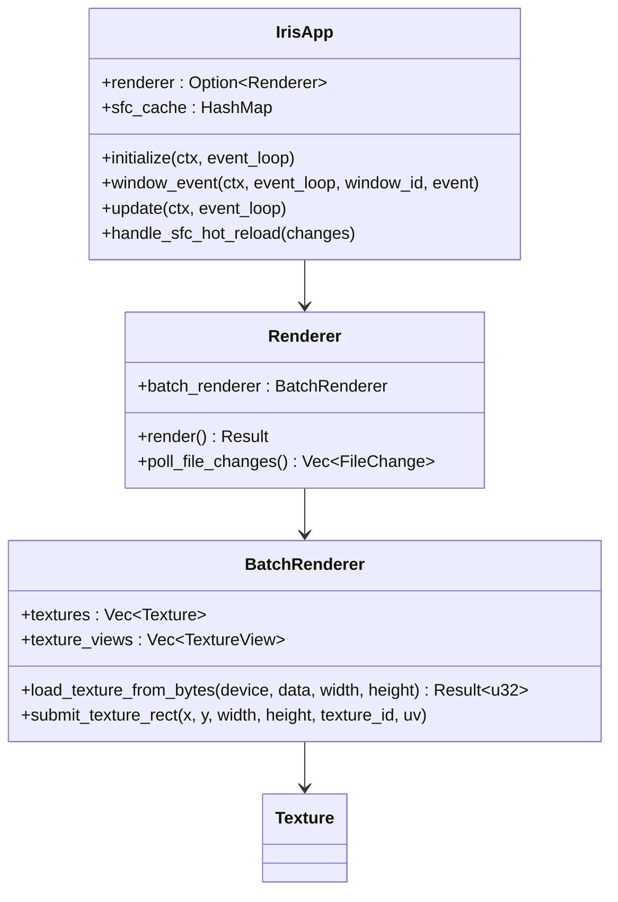
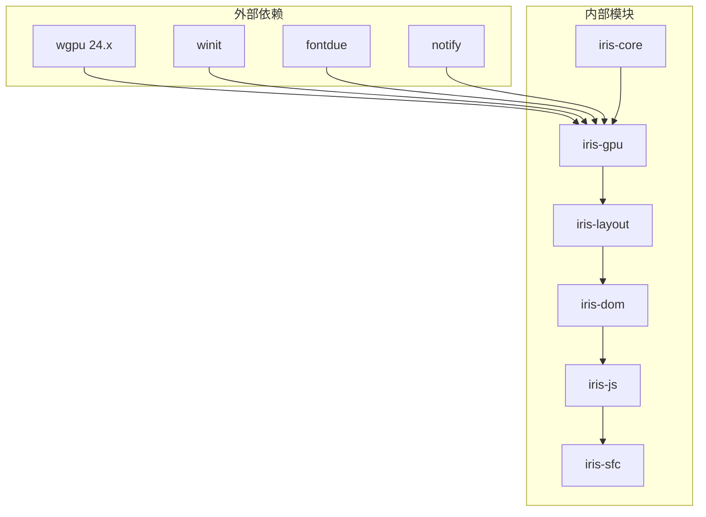
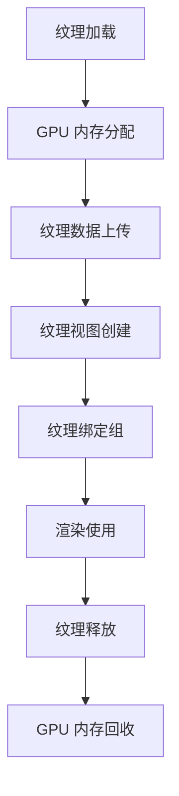
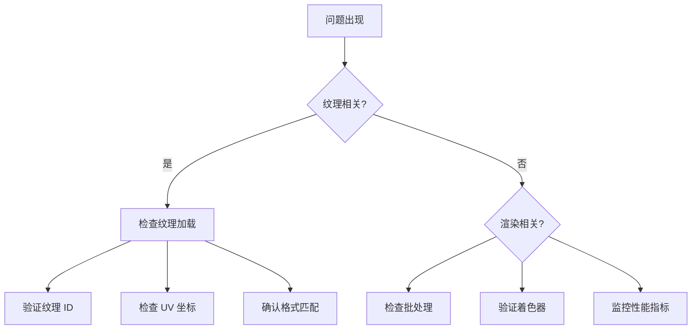

# 纹理渲染管线集成指南

<cite>
**本文档引用的文件**
- [Cargo.toml](file://Cargo.toml)
- [lib.rs](file://crates/iris/src/lib.rs)
- [orchestrator.rs](file://crates/iris/src/orchestrator.rs)
- [vnode_renderer.rs](file://crates/iris/src/vnode_renderer.rs)
- [lib.rs](file://crates/iris-gpu/src/lib.rs)
- [batch_renderer.rs](file://crates/iris-gpu/src/batch_renderer.rs)
- [batch_shader.wgsl](file://crates/iris-gpu/src/batch_shader.wgsl)
- [TEXTURE_INTEGRATION.md](file://crates/iris-gpu/TEXTURE_INTEGRATION.md)
- [main.rs](file://crates/iris-app/src/main.rs)
- [App.vue](file://crates/iris-app/examples/demo/App.vue)
- [minimal_demo.rs](file://crates/iris-app/examples/demo/minimal_demo.rs)
- [rendering_e2e_test.rs](file://crates/iris/tests/rendering_e2e_test.rs)
- [file_watcher_integration.rs](file://crates/iris-gpu/tests/file_watcher_integration.rs)
</cite>

## 目录
1. [简介](#简介)
2. [项目结构](#项目结构)
3. [核心组件](#核心组件)
4. [架构概览](#架构概览)
5. [详细组件分析](#详细组件分析)
6. [依赖关系分析](#依赖关系分析)
7. [性能考虑](#性能考虑)
8. [故障排除指南](#故障排除指南)
9. [结论](#结论)

## 简介

Iris Engine 是一个基于 Rust 和 WebGPU 的下一代无构建前端运行时，支持 Vue 3 和实时编排。本文档专注于纹理渲染管线的集成，这是一个关键的渲染优化特性，允许在 GPU 级别高效地处理纹理资源。

该项目采用模块化架构，包含以下主要组件：
- **iris-core**: 底层内核和窗口管理
- **iris-gpu**: WebGPU 硬件渲染管线
- **iris-layout**: 浏览器级布局引擎
- **iris-dom**: 跨端 DOM/BOM 抽象
- **iris-js**: JS 沙箱运行时
- **iris-sfc**: SFC/TS 即时转译层
- **iris-app**: 应用入口点

## 项目结构



**图表来源**
- [Cargo.toml:1-31](file://Cargo.toml#L1-L31)
- [lib.rs:1-78](file://crates/iris/src/lib.rs#L1-L78)

**章节来源**
- [Cargo.toml:1-31](file://Cargo.toml#L1-L31)
- [lib.rs:1-78](file://crates/iris/src/lib.rs#L1-L78)

## 核心组件

### VNode 渲染器

VNode 渲染器是纹理渲染管线的核心组件，负责将虚拟 DOM 树转换为 GPU 绘制命令。它支持多种渲染特性：



**图表来源**
- [vnode_renderer.rs:90-120](file://crates/iris/src/vnode_renderer.rs#L90-L120)

### 批渲染器

批渲染器是 GPU 渲染管线的关键组件，负责将多个绘制命令合并为单次 GPU 调用：



**图表来源**
- [batch_renderer.rs:118-142](file://crates/iris-gpu/src/batch_renderer.rs#L118-L142)

**章节来源**
- [vnode_renderer.rs:90-120](file://crates/iris/src/vnode_renderer.rs#L90-L120)
- [batch_renderer.rs:118-142](file://crates/iris-gpu/src/batch_renderer.rs#L118-L142)

## 架构概览

纹理渲染管线的集成遵循以下架构模式：



**图表来源**
- [vnode_renderer.rs:115-122](file://crates/iris/src/vnode_renderer.rs#L115-L122)
- [batch_renderer.rs:548-574](file://crates/iris-gpu/src/batch_renderer.rs#L548-L574)

## 详细组件分析

### 纹理集成状态

根据项目文档，纹理渲染管线的集成状态如下：

```mermaid
flowchart TD
A[纹理集成状态] --> B{已完成}
A --> C{待完成}
B --> D[WGSL Shader 支持纹理采样]
B --> E[UV 坐标传递]
B --> F[纹理和采样器绑定声明]
B --> G[颜色与纹理混合]
C --> H[默认纹理创建和绑定]
C --> I[渲染管线布局更新]
C --> J[flush() 中绑定纹理]
```

**图表来源**
- [TEXTURE_INTEGRATION.md:1-155](file://crates/iris-gpu/TEXTURE_INTEGRATION.md#L1-L155)

### 纹理渲染流程

纹理渲染的完整流程包括以下步骤：

1. **纹理加载**: 从字节数组创建 GPU 纹理
2. **纹理绑定**: 将纹理添加到纹理数组和视图
3. **UV 坐标计算**: 将像素坐标转换为纹理坐标
4. **着色器采样**: 在片段着色器中进行纹理采样
5. **颜色混合**: 将纹理颜色与顶点颜色混合

**章节来源**
- [TEXTURE_INTEGRATION.md:16-155](file://crates/iris-gpu/TEXTURE_INTEGRATION.md#L16-L155)

### 着色器实现

纹理渲染的着色器实现支持以下功能：



**图表来源**
- [batch_shader.wgsl:17-38](file://crates/iris-gpu/src/batch_shader.wgsl#L17-L38)

**章节来源**
- [batch_shader.wgsl:1-39](file://crates/iris-gpu/src/batch_shader.wgsl#L1-L39)

### 应用集成

应用程序如何集成纹理渲染：



**图表来源**
- [main.rs:122-130](file://crates/iris-app/src/main.rs#L122-L130)
- [lib.rs:78-105](file://crates/iris-gpu/src/lib.rs#L78-L105)

**章节来源**
- [main.rs:122-130](file://crates/iris-app/src/main.rs#L122-L130)
- [lib.rs:78-105](file://crates/iris-gpu/src/lib.rs#L78-L105)

## 依赖关系分析



**图表来源**
- [Cargo.toml:13-31](file://Cargo.toml#L13-L31)

**章节来源**
- [Cargo.toml:13-31](file://Cargo.toml#L13-L31)

## 性能考虑

### 批处理优化

纹理渲染管线采用了多项性能优化策略：

1. **批处理渲染**: 将多个绘制命令合并为单次 GPU 调用
2. **顶点缓冲区复用**: 避免频繁的缓冲区分配和释放
3. **纹理池管理**: 管理纹理资源的生命周期
4. **索引缓冲区**: 使用索引绘制减少顶点重复

### 内存管理



**图表来源**
- [batch_renderer.rs:588-641](file://crates/iris-gpu/src/batch_renderer.rs#L588-L641)

## 故障排除指南

### 常见问题

1. **纹理未显示**: 检查纹理 ID 是否有效和 UV 坐标范围
2. **颜色异常**: 验证颜色空间格式和 Alpha 混合设置
3. **性能问题**: 确认批处理是否正确启用和缓冲区容量设置

### 调试方法



**章节来源**
- [TEXTURE_INTEGRATION.md:135-155](file://crates/iris-gpu/TEXTURE_INTEGRATION.md#L135-L155)

## 结论

纹理渲染管线的集成为 Iris Engine 提供了强大的图形渲染能力。通过批处理优化、纹理管理和着色器采样，实现了高效的 GPU 渲染性能。当前状态显示大部分功能已完成，但仍需完成默认纹理创建、渲染管线布局更新和绑定组管理等关键步骤。

未来的发展方向包括：
- 完善纹理资源管理系统
- 优化内存使用和性能
- 扩展纹理格式支持
- 增强错误处理和调试能力

这一集成将为 Iris Engine 的图形渲染能力奠定坚实基础，支持更丰富的视觉效果和更高的渲染性能。