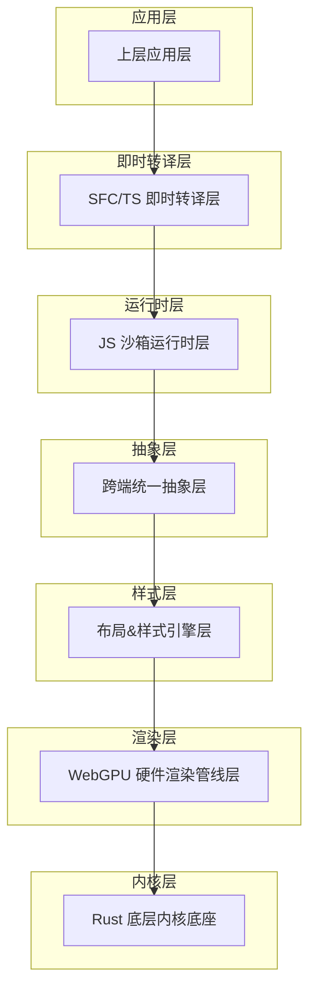
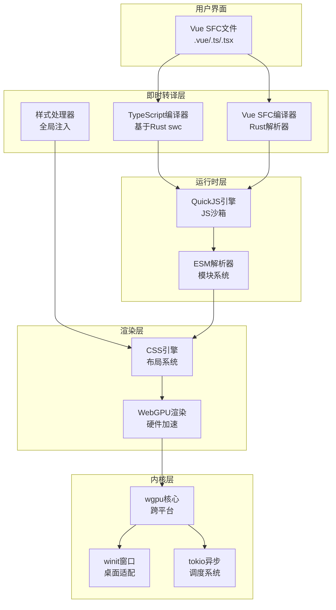
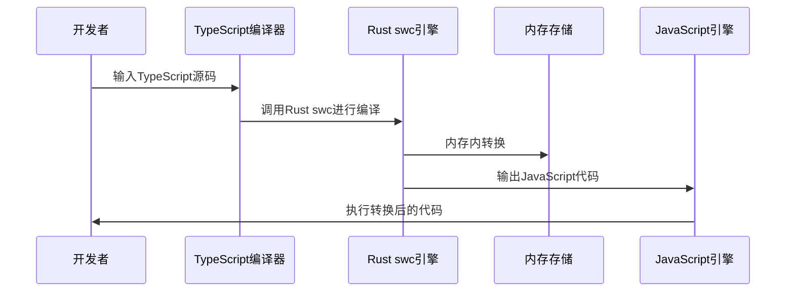
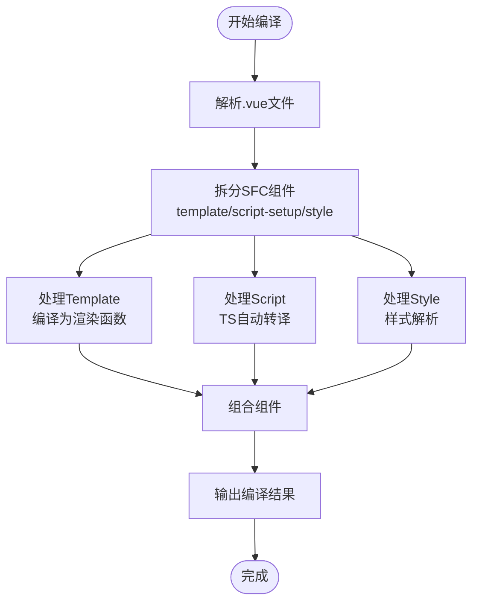
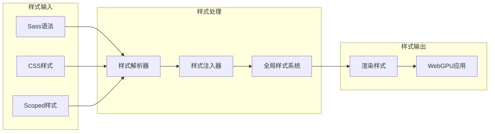
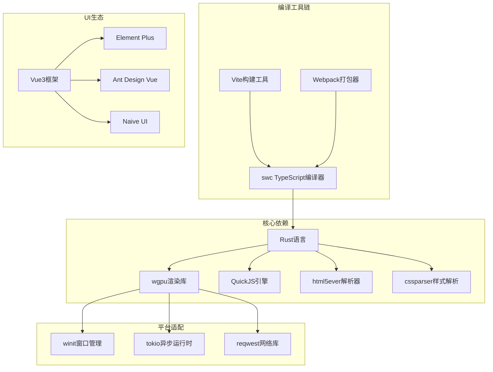

# 即时转译系统

<cite>
**本文档引用的文件**
- [doc.txt](file://doc.txt)
- [todo.txt](file://todo.txt)
</cite>

## 目录
1. [引言](#引言)
2. [项目结构](#项目结构)
3. [核心组件](#核心组件)
4. [架构概览](#架构概览)
5. [详细组件分析](#详细组件分析)
6. [依赖关系分析](#依赖关系分析)
7. [性能考虑](#性能考虑)
8. [故障排除指南](#故障排除指南)
9. [结论](#结论)

## 引言

Leivue Runtime是一个革命性的前端运行时引擎，旨在彻底改变现代Web开发的构建方式。该项目的核心使命是消除前端工程化复杂性，突破浏览器沙箱限制，为Vue生态系统提供高性能的跨端运行底座。

该系统最核心的技术创新在于实现了真正的"零编译运行"能力，允许开发者直接运行Vue3 SFC文件和TypeScript源码，无需传统的构建工具如Vite、Webpack或tsc。通过结合Rust的高性能和WebGPU的硬件加速渲染，Leivue Runtime为现代Web应用开发提供了全新的可能性。

## 项目结构

根据架构文档，Leivue Runtime采用七层分层架构设计，每层都有明确的职责分离和高度解耦的特点：

**图表来源**
- [doc.txt:7-22](file://doc.txt#L7-L22)

**章节来源**
- [doc.txt:7-22](file://doc.txt#L7-L22)

## 核心组件

### 即时转译层（SFC/TS 即时转译层）

即时转译层是整个系统的核心，负责实现真正的零编译运行能力。该层包含三个主要组件：

1. **TypeScript即时转译器**
   - 基于Rust swc实现
   - 支持内存内实时转换
   - 完整支持泛型、装饰器和TSX语法

2. **Vue SFC即时编译器**
   - 使用官方Rust库解析.vue文件
   - 自动拆分template、script-setup、style部分
   - 将Template实时编译为Vue渲染函数

3. **全局样式注入系统**
   - 自动解析并注入全局样式
   - 支持Scoped样式和第三方UI库CSS

**章节来源**
- [doc.txt:51-59](file://doc.txt#L51-L59)

### JS沙箱运行时层

该层提供独立的JavaScript执行环境，使用QuickJS引擎，具有以下特点：

- 与宿主环境完全隔离的安全沙箱
- 预加载Vue3完整运行时
- 自研ESM解析器支持模块系统
- 支持第三方包引入

**章节来源**
- [doc.txt:46-50](file://doc.txt#L46-L50)

### 跨端统一抽象层

负责抹平双端差异，提供统一的API接口：

- 统一事件系统（鼠标、键盘、滚动、点击）
- 轻量实现BOM/DOM模拟API
- 无缝兼容第三方UI库所需环境

**章节来源**
- [doc.txt:41-45](file://doc.txt#L41-L45)

## 架构概览

Leivue Runtime的整体架构体现了高度的模块化和解耦设计：

**图表来源**
- [doc.txt:12-22](file://doc.txt#L12-L22)
- [doc.txt:23-29](file://doc.txt#L23-L29)

## 详细组件分析

### TypeScript即时转译系统

#### 转换流程

**图表来源**
- [doc.txt:53-54](file://doc.txt#L53-L54)

#### 支持的特性

- **泛型支持**：完整的TypeScript泛型语法支持
- **装饰器支持**：TypeScript装饰器语法的实时转换
- **TSX支持**：TypeScript JSX语法的即时编译
- **内存内转换**：避免磁盘I/O，实现毫秒级转换

#### 性能优化策略

1. **内存优先**：所有转换在内存中完成，避免文件系统操作
2. **增量编译**：只重新编译发生变化的模块
3. **缓存机制**：利用Rust的内存安全特性实现高效的缓存管理

**章节来源**
- [doc.txt:53-54](file://doc.txt#L53-L54)

### Vue SFC即时编译系统

#### 编译流程

**图表来源**
- [doc.txt:55-59](file://doc.txt#L55-L59)

#### 组件解析机制

1. **Template解析**：将模板语法转换为Vue渲染函数
2. **Script处理**：自动进行TypeScript到JavaScript的转换
3. **Style处理**：解析样式并注入到全局样式系统

#### 实时编译特性

- **毫秒级响应**：修改源码后立即触发编译
- **热更新支持**：无需重启即可看到效果
- **错误处理**：提供详细的编译错误信息

**章节来源**
- [doc.txt:55-59](file://doc.txt#L55-L59)

### 样式系统

#### 样式处理流程

**图表来源**
- [doc.txt:40](file://doc.txt#L40)

#### 支持的样式特性

- **全局样式**：支持标准CSS和Sass语法
- **Scoped样式**：Vue组件级别的样式隔离
- **第三方库样式**：自动注入Element Plus、Ant Design Vue等UI库的CSS
- **样式嵌套**：支持CSS嵌套语法

**章节来源**
- [doc.txt:40](file://doc.txt#L40)

## 依赖关系分析

### 技术栈依赖

**图表来源**
- [doc.txt:23-29](file://doc.txt#L23-L29)
- [doc.txt:77-81](file://doc.txt#L77-L81)

### 模块间依赖关系

系统的模块间依赖关系体现了清晰的分层架构：

1. **底层内核**：提供基础能力支撑
2. **渲染层**：基于WebGPU的硬件加速
3. **样式层**：复刻浏览器CSS体系
4. **抽象层**：统一跨端API
5. **运行时层**：JS沙箱执行环境
6. **转译层**：即时编译核心

**章节来源**
- [doc.txt:23-50](file://doc.txt#L23-L50)

## 性能考虑

### 硬件加速渲染

Leivue Runtime采用WebGPU硬件渲染替代传统的DOM渲染，具有以下优势：

- **稳定性能**：60fps稳定渲染，无卡顿现象
- **高效处理**：大列表和复杂组件渲染性能优异
- **低CPU开销**：充分利用GPU并行计算能力

### 内存管理优化

1. **零垃圾回收**：基于Rust的内存安全特性，避免GC停顿
2. **内存池管理**：高效的内存分配和回收机制
3. **增量编译**：只重新编译变化的部分，减少内存压力

### 网络性能

- **双网络模式**：自研Rust网络栈支持跨域突破
- **内网优化**：针对内网环境的网络请求优化
- **缓存策略**：智能缓存机制减少重复请求

## 故障排除指南

### 常见问题及解决方案

#### 编译错误

1. **TypeScript语法错误**
   - 检查泛型和装饰器语法是否正确
   - 确认TSX语法符合规范

2. **SFC组件解析失败**
   - 验证.vue文件格式是否正确
   - 检查template、script、style标签的完整性

#### 运行时问题

1. **JS沙箱执行异常**
   - 检查QuickJS引擎状态
   - 验证模块导入路径

2. **样式渲染问题**
   - 确认CSS语法正确性
   - 检查Scoped样式的冲突

#### 性能问题

1. **编译速度慢**
   - 检查内存使用情况
   - 验证增量编译功能

2. **渲染性能下降**
   - 分析GPU使用率
   - 优化复杂组件的渲染逻辑

**章节来源**
- [doc.txt:66-70](file://doc.txt#L66-L70)

## 结论

Leivue Runtime代表了前端技术发展的新方向，通过技术创新彻底改变了传统的前端开发模式。其核心价值体现在：

### 技术创新

1. **零编译运行**：真正消除了前端构建工具的依赖
2. **跨端统一**：一套代码同时支持浏览器和桌面应用
3. **硬件加速**：充分利用WebGPU的性能优势
4. **内存安全**：基于Rust的高性能和安全性

### 应用价值

1. **开发效率**：毫秒级热更新，提升开发体验
2. **运行性能**：60fps稳定渲染，适合复杂应用场景
3. **生态兼容**：完整支持Vue3生态系统
4. **部署简化**：无需复杂的构建和部署流程

### 发展前景

随着WebGPU技术的成熟和Rust生态的发展，Leivue Runtime有望成为下一代前端应用开发的标准方案，为开发者提供更简单、更高效、更强大的开发体验。