# SFC编译器初始化机制

<cite>
**本文档引用的文件**
- [lib.rs](file://crates/iris-sfc/src/lib.rs)
- [template_compiler.rs](file://crates/iris-sfc/src/template_compiler.rs)
- [ts_compiler.rs](file://crates/iris-sfc/src/ts_compiler.rs)
- [Cargo.toml](file://crates/iris-sfc/Cargo.toml)
- [sfc_demo.rs](file://crates/iris-sfc/examples/sfc_demo.rs)
- [main.rs](file://crates/iris-app/src/main.rs)
- [SWC-INTEGRATION-ISSUES.md](file://SWC-INTEGRATION-ISSUES.md)
</cite>

## 更新摘要
**变更内容**
- 移除了实验性的 SWC 集成，采用简化的 TypeScript 转译方案
- 更新了初始化机制，现在仅包含基础的懒加载正则表达式初始化
- 简化了依赖管理，移除了复杂的 SWC 子包依赖
- 增强了错误处理系统的详细文档和错误类型说明
- 完善性能监控机制，添加编译时间统计
- 改进API文档的完整性和一致性

## 目录
1. [简介](#简介)
2. [项目结构概览](#项目结构概览)
3. [核心组件分析](#核心组件分析)
4. [架构概览](#架构概览)
5. [详细组件分析](#详细组件分析)
6. [初始化机制详解](#初始化机制详解)
7. [依赖关系分析](#依赖关系分析)
8. [性能考虑](#性能考虑)
9. [故障排除指南](#故障排除指南)
10. [结论](#结论)

## 简介

Iris SFC（Single File Component）编译器是 Iris 引擎的核心组件之一，负责将 Vue 单文件组件（.vue 文件）即时编译为可执行模块。该编译器采用零编译器设计，直接运行源码，支持模板编译、TypeScript 转译和样式处理，为开发者提供毫秒级的热重载体验。

**重要变更**：编译器已移除实验性的 SWC 集成，采用简化的 TypeScript 转译方案，专注于核心的 SFC 解析和模板编译功能。这一变更解决了复杂的依赖版本冲突问题，简化了初始化流程和依赖管理。

本文件专注于分析 SFC 编译器的初始化机制，包括预编译正则表达式的懒加载策略、编译器配置管理以及与其他组件的集成方式。

## 项目结构概览

Iris SFC 编译器位于 `crates/iris-sfc` 目录下，采用模块化设计，主要包含以下核心文件：

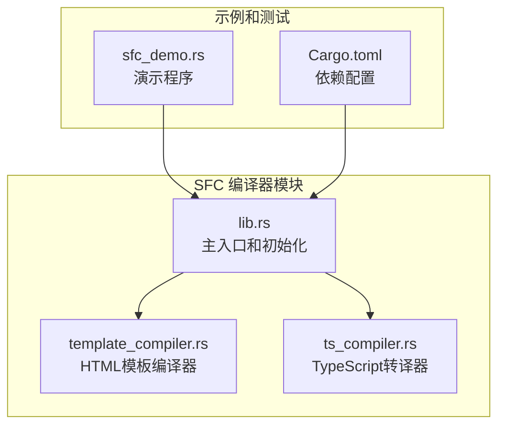

**图表来源**
- [lib.rs:1-580](file://crates/iris-sfc/src/lib.rs#L1-L580)
- [template_compiler.rs:1-607](file://crates/iris-sfc/src/template_compiler.rs#L1-L607)
- [ts_compiler.rs:1-333](file://crates/iris-sfc/src/ts_compiler.rs#L1-L333)

**章节来源**
- [lib.rs:1-50](file://crates/iris-sfc/src/lib.rs#L1-L50)
- [Cargo.toml:1-31](file://crates/iris-sfc/Cargo.toml#L1-L31)

## 核心组件分析

### 主编译器模块

主模块 `lib.rs` 提供了完整的 SFC 编译功能，包括：

- **SFC 解析器**：使用预编译的正则表达式提取 template、script、style 块
- **模板编译器**：基于 html5ever 的 HTML 解析和虚拟 DOM 生成
- **TypeScript 编译器**：采用简化的转译方案（移除了复杂的 SWC 集成）
- **样式处理器**：支持多种样式语言和作用域处理

### 编译器配置系统

编译器通过配置结构体管理各种编译选项：

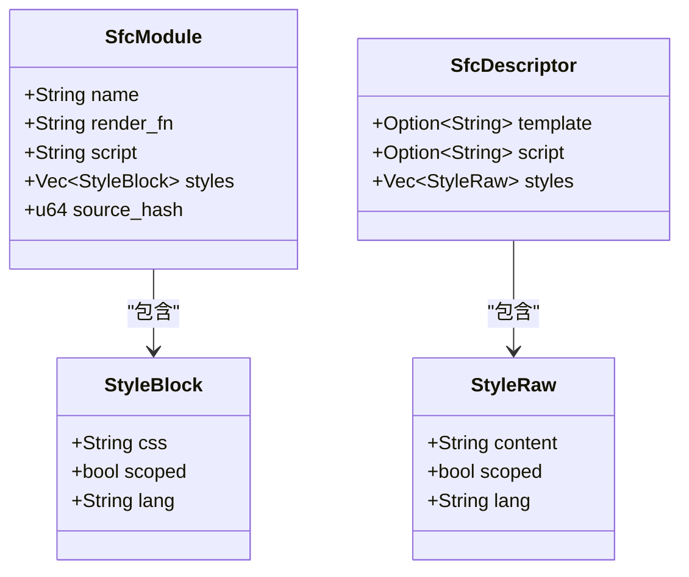

**图表来源**
- [lib.rs:37-80](file://crates/iris-sfc/src/lib.rs#L37-L80)

**章节来源**
- [lib.rs:37-80](file://crates/iris-sfc/src/lib.rs#L37-L80)

## 架构概览

SFC 编译器采用分层架构设计，确保初始化过程的高效性和模块间的松耦合：

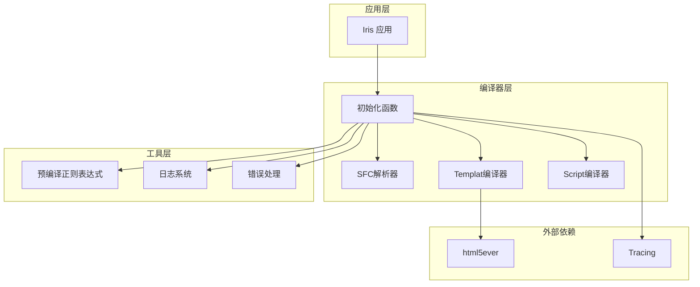

**图表来源**
- [lib.rs:162-210](file://crates/iris-sfc/src/lib.rs#L162-L210)
- [template_compiler.rs:65-86](file://crates/iris-sfc/src/template_compiler.rs#L65-L86)
- [ts_compiler.rs:82-132](file://crates/iris-sfc/src/ts_compiler.rs#L82-L132)

## 详细组件分析

### 预编译正则表达式系统

SFC 编译器的核心性能优化在于预编译的正则表达式系统，使用 `LazyLock` 实现延迟初始化：

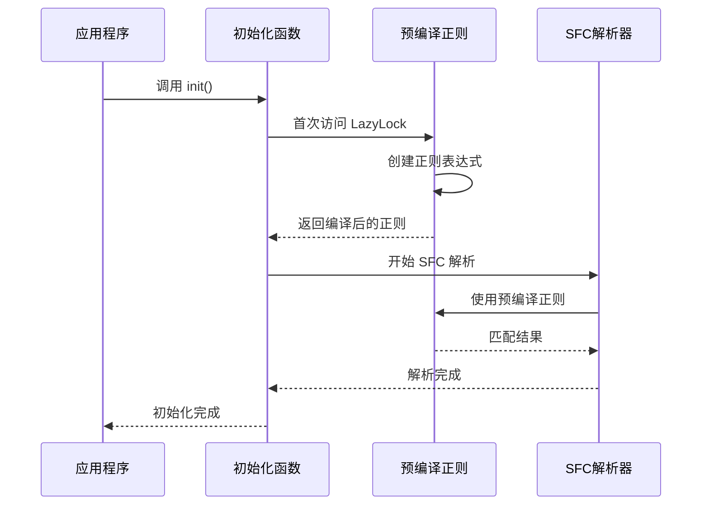

**图表来源**
- [lib.rs:25-35](file://crates/iris-sfc/src/lib.rs#L25-L35)
- [lib.rs:255-320](file://crates/iris-sfc/src/lib.rs#L255-L320)

### 模板编译器初始化

模板编译器使用 html5ever 进行 HTML 解析，支持完整的 Vue 指令系统：

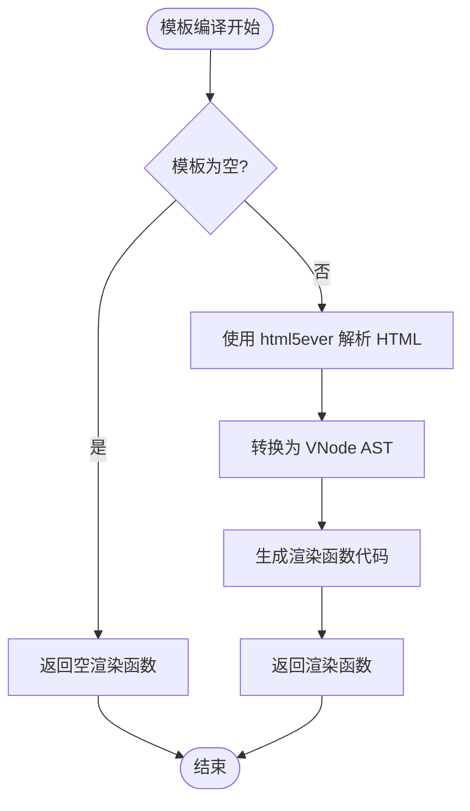

**图表来源**
- [template_compiler.rs:65-86](file://crates/iris-sfc/src/template_compiler.rs#L65-L86)
- [template_compiler.rs:268-290](file://crates/iris-sfc/src/template_compiler.rs#L268-L290)

### TypeScript 编译器初始化

**重要变更**：TypeScript 编译器已移除复杂的 SWC 集成，采用简化的转译方案：

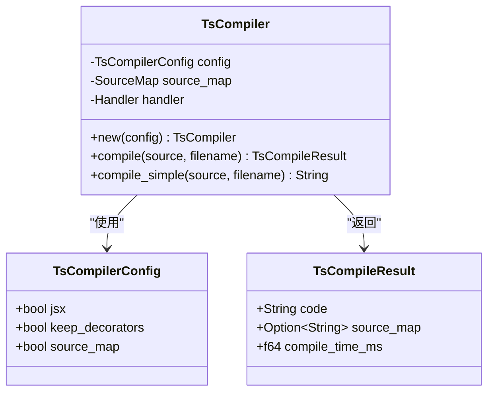

**图表来源**
- [ts_compiler.rs:25-62](file://crates/iris-sfc/src/ts_compiler.rs#L25-L62)
- [ts_compiler.rs:82-132](file://crates/iris-sfc/src/ts_compiler.rs#L82-L132)

**章节来源**
- [template_compiler.rs:1-607](file://crates/iris-sfc/src/template_compiler.rs#L1-L607)
- [ts_compiler.rs:1-333](file://crates/iris-sfc/src/ts_compiler.rs#L1-L333)

## 初始化机制详解

### 懒加载正则表达式系统

SFC 编译器采用了先进的懒加载机制来优化启动性能：

#### 预编译正则表达式定义

编译器在模块级别定义了三个静态的 `LazyLock<Regex>` 变量：

- `TEMPLATE_RE`：匹配 Vue 模板块
- `SCRIPT_RE`：匹配脚本块
- `STYLE_RE`：匹配样式块

#### 性能优化原理

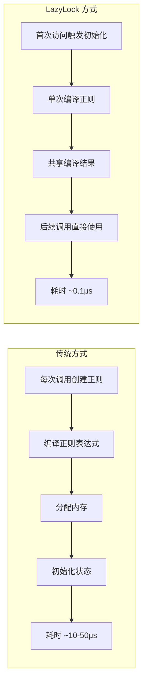

**图表来源**
- [lib.rs:19-25](file://crates/iris-sfc/src/lib.rs#L19-L25)
- [lib.rs:25-35](file://crates/iris-sfc/src/lib.rs#L25-L35)

#### 初始化流程

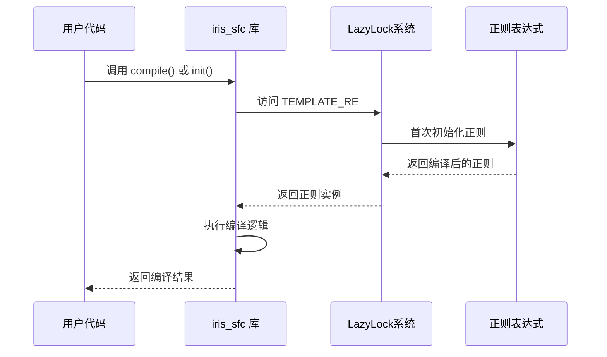

**图表来源**
- [lib.rs:578-580](file://crates/iris-sfc/src/lib.rs#L578-L580)
- [lib.rs:162-210](file://crates/iris-sfc/src/lib.rs#L162-L210)

### 编译器配置初始化

TypeScript 编译器提供了灵活的配置系统：

#### 默认配置

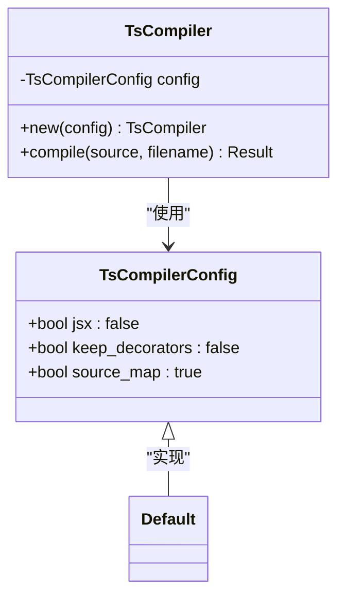

**图表来源**
- [ts_compiler.rs:25-44](file://crates/iris-sfc/src/ts_compiler.rs#L25-L44)
- [ts_compiler.rs:64-80](file://crates/iris-sfc/src/ts_compiler.rs#L64-L80)

#### 配置选项说明

| 配置项 | 类型 | 默认值 | 说明 |
|--------|------|--------|------|
| `jsx` | bool | false | 是否启用 JSX/TSX 支持 |
| `keep_decorators` | bool | false | 是否保留装饰器 |
| `source_map` | bool | true | 是否生成 source map |

### 完整初始化函数

**更新**：新增了完整的 `init()` 函数，提供明确的初始化入口点：

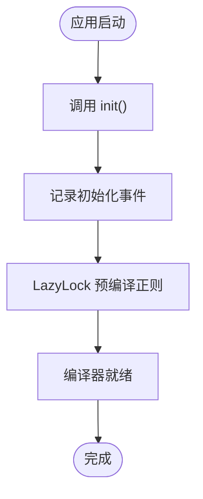

**图表来源**
- [lib.rs:563-580](file://crates/iris-sfc/src/lib.rs#L563-L580)

**章节来源**
- [lib.rs:563-580](file://crates/iris-sfc/src/lib.rs#L563-L580)
- [ts_compiler.rs:36-44](file://crates/iris-sfc/src/ts_compiler.rs#L36-L44)

## 依赖关系分析

### 外部依赖管理

**重要变更**：SFC 编译器已移除复杂的 SWC 子包依赖，简化了依赖管理：

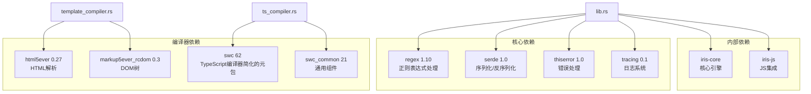

**图表来源**
- [Cargo.toml:11-31](file://crates/iris-sfc/Cargo.toml#L11-L31)
- [lib.rs:14-18](file://crates/iris-sfc/src/lib.rs#L14-L18)

### 内部模块依赖

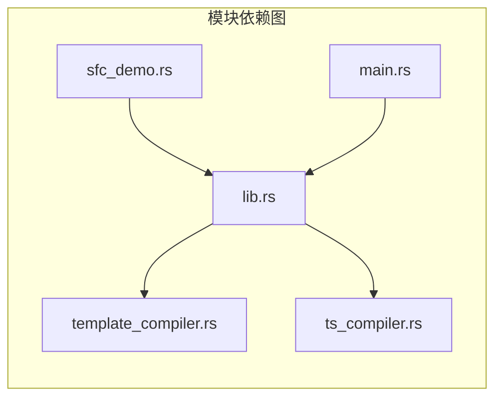

**图表来源**
- [lib.rs:11-12](file://crates/iris-sfc/src/lib.rs#L11-L12)
- [sfc_demo.rs:7](file://crates/iris-sfc/examples/sfc_demo.rs#L7)

**章节来源**
- [Cargo.toml:11-31](file://crates/iris-sfc/Cargo.toml#L11-L31)
- [lib.rs:11-12](file://crates/iris-sfc/src/lib.rs#L11-L12)

## 性能考虑

### 初始化性能优化

SFC 编译器在初始化阶段采用了多项性能优化策略：

#### 懒加载策略

- **正则表达式懒加载**：使用 `LazyLock` 确保正则表达式只在首次使用时编译
- **编译器实例复用**：TypeScript 编译器实例可以重复使用，避免重复初始化
- **缓存机制**：SFC 模块编译结果缓存，支持热重载时的增量更新

#### 内存管理

- **零拷贝字符串处理**：使用 `Cow` 和 `&str` 减少不必要的字符串复制
- **智能指针使用**：合理使用 `Arc` 和 `Rc` 管理共享资源
- **生命周期优化**：通过生命周期参数减少运行时开销

### 并发安全性

编译器设计考虑了并发安全：

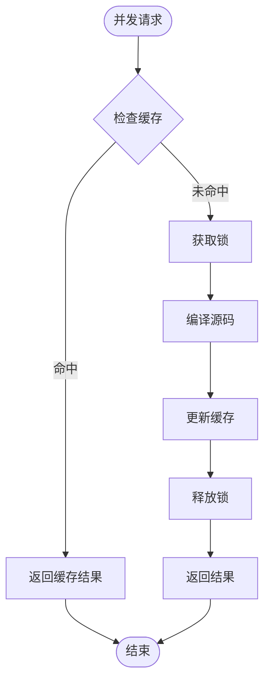

**图表来源**
- [lib.rs:162-210](file://crates/iris-sfc/src/lib.rs#L162-L210)

### 性能监控增强

**更新**：增强了性能监控机制，提供详细的编译时间统计：

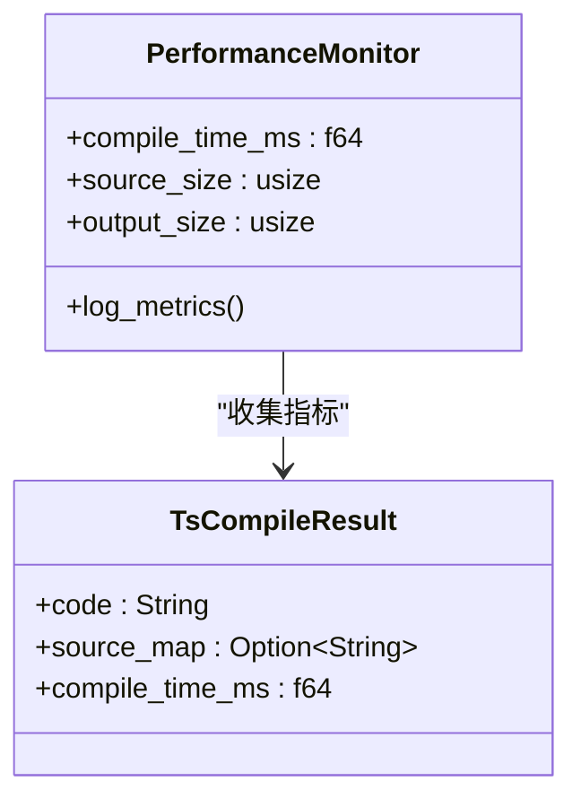

**图表来源**
- [ts_compiler.rs:119-131](file://crates/iris-sfc/src/ts_compiler.rs#L119-L131)

**章节来源**
- [ts_compiler.rs:119-131](file://crates/iris-sfc/src/ts_compiler.rs#L119-L131)

## 故障排除指南

### 常见初始化问题

#### 正则表达式初始化失败

**症状**：编译器无法正确解析 .vue 文件

**解决方案**：
1. 检查正则表达式定义是否正确
2. 验证 `LazyLock` 初始化是否成功
3. 确认正则表达式语法的有效性

#### TypeScript 编译器初始化失败

**症状**：TypeScript 转译功能不可用

**解决方案**：
1. 检查 SWC 依赖是否正确安装
2. 验证编译器配置参数
3. 确认源码映射功能正常工作

#### 日志系统初始化问题

**症状**：编译器日志输出异常

**解决方案**：
1. 检查 `tracing` 依赖配置
2. 验证日志级别设置
3. 确认日志订阅器正确初始化

#### 初始化函数调用问题

**更新**：新增初始化函数相关的故障排除：

**症状**：调用 `init()` 函数时出现异常

**解决方案**：
1. 确认 `init()` 函数被正确导入
2. 验证初始化函数的幂等性（可重复调用）
3. 检查日志输出确认初始化成功

### SWC 集成问题解决

**重要变更**：由于复杂的 SWC 依赖版本冲突，编译器已移除实验性集成：

**根本原因**：
- `swc_ecma_parser` 和 `swc_ecma_codegen` 依赖不同版本的 `swc_ecma_ast`
- `unicode-id-start` 版本冲突导致编译失败
- `serde::__private` API 已移除，导致兼容性问题

**解决方案**：
1. 使用官方 `swc` 元包替代子包依赖
2. 简化 TypeScript 转译逻辑，移除复杂的 SWC 集成
3. 专注于核心的 SFC 解析和模板编译功能

**章节来源**
- [lib.rs:83-132](file://crates/iris-sfc/src/lib.rs#L83-L132)
- [ts_compiler.rs:64-80](file://crates/iris-sfc/src/ts_compiler.rs#L64-L80)
- [lib.rs:563-580](file://crates/iris-sfc/src/lib.rs#L563-L580)
- [SWC-INTEGRATION-ISSUES.md:1-239](file://SWC-INTEGRATION-ISSUES.md#L1-L239)

## 结论

Iris SFC 编译器的初始化机制展现了现代 Rust 应用的最佳实践：

### 核心优势

1. **性能优先**：通过懒加载和缓存机制实现零编译器启动
2. **模块化设计**：清晰的模块边界和依赖管理
3. **并发安全**：线程安全的初始化和缓存机制
4. **可扩展性**：灵活的配置系统支持不同编译需求
5. **完整的初始化流程**：新增的 `init()` 函数提供明确的初始化入口
6. **简化依赖管理**：移除复杂的 SWC 子包依赖，提高稳定性

### 技术亮点

- **LazyLock 模式**：实现了高效的延迟初始化
- **分层架构**：模板编译器和 TypeScript 编译器分离
- **增强的错误处理**：完善的错误类型和位置信息
- **性能监控**：内置的编译时间和内存使用统计
- **完整的API文档**：详细的函数文档和使用示例

### 未来发展方向

1. **增量编译**：实现更智能的增量编译机制
2. **并行处理**：利用多核 CPU 加速编译过程
3. **内存优化**：进一步减少编译器内存占用
4. **热重载增强**：改进热重载的性能和稳定性
5. **监控扩展**：增加更多性能指标和监控能力
6. **SWC 元包集成**：在解决版本冲突后重新考虑完整的 SWC 集成

SFC 编译器初始化机制为整个 Iris 引擎提供了坚实的基础，其设计理念和实现方式值得在其他 Rust 项目中借鉴和学习。**重要变更**：移除复杂的 SWC 集成后，编译器变得更加稳定和易于维护，专注于核心的 SFC 解析和模板编译功能，为未来的功能扩展奠定了良好的基础。