# SFC编译器初始化机制

<cite>
**本文档引用的文件**
- [lib.rs](file://crates/iris-sfc/src/lib.rs)
- [template_compiler.rs](file://crates/iris-sfc/src/template_compiler.rs)
- [ts_compiler.rs](file://crates/iris-sfc/src/ts_compiler.rs)
- [css_modules.rs](file://crates/iris-sfc/src/css_modules.rs)
- [scoped_css.rs](file://crates/iris-sfc/src/scoped_css.rs)
- [scss_processor.rs](file://crates/iris-sfc/src/scss_processor.rs)
- [script_setup.rs](file://crates/iris-sfc/src/script_setup.rs)
- [cache.rs](file://crates/iris-sfc/src/cache.rs)
- [Cargo.toml](file://crates/iris-sfc/Cargo.toml)
- [sfc_demo.rs](file://crates/iris-sfc/examples/sfc_demo.rs)
- [integration_test.rs](file://crates/iris-sfc/tests/integration_test.rs)
- [README.md](file://crates/iris-sfc/README.md)
- [TYPESCRIPT_ARCHITECTURE.md](file://crates/iris-sfc/TYPESCRIPT_ARCHITECTURE.md)
- [SWC62-INTEGRATION-COMPLETE.md](file://SWC62-INTEGRATION-COMPLETE.md)
- [vue.rs](file://crates/iris-js/src/vue.rs)
- [orchestrator.rs](file://crates/iris-engine/src/orchestrator.rs)
- [vdom.rs](file://crates/iris-layout/src/vdom.rs)
- [PHASE_A_COMPLETION_SUMMARY.md](file://PHASE_A_COMPLETION_SUMMARY.md)
- [PHASE_B_COMPLETION_SUMMARY.md](file://PHASE_B_COMPLETION_SUMMARY.md)
- [PHASE6_PENDING_OPTIMIZATIONS.md](file://PHASE6_PENDING_OPTIMIZATIONS.md)
- [phase6_script_setup_review.md](file://docs/code_review/phase6_script_setup_review.md)
- [phase6_template_compiler_review.md](file://docs/code_review/phase6_template_compiler_review.md)
- [rendering_e2e_test.rs](file://crates/iris-engine/tests/rendering_e2e_test.rs)
</cite>

## 更新摘要
**变更内容**
- **改进的setup()函数处理**：修复了withDefaults宏的优先级处理，优化了defineProps和defineEmits的解析逻辑
- **增强的模板事件处理**：修复了v-for指令的语法错误，改进了v-bind动态属性的安全处理
- **优化的脚本转换系统**：增强了正则表达式的鲁棒性，改进了复杂TypeScript类型的处理能力
- **新增的初始化函数**：提供了明确的init()函数入口点，支持编译器层的显式初始化
- **增强的错误处理机制**：改进了编译器宏转换的错误处理和调试信息

## 目录
1. [简介](#简介)
2. [项目结构概览](#项目结构概览)
3. [核心组件分析](#核心组件分析)
4. [架构概览](#架构概览)
5. [详细组件分析](#详细组件分析)
6. [初始化机制详解](#初始化机制详解)
7. [JavaScript运行时集成](#javascript运行时集成)
8. [VTree生成功能](#vtree生成功能)
9. [演示程序验证](#演示程序验证)
10. [TypeScript类型检查系统](#typescript类型检查系统)
11. [CSS Modules支持功能](#css-modules支持功能)
12. [CSS作用域化处理器](#css作用域化处理器)
13. [SCSS编译处理器](#scss编译处理器)
14. [Script Setup转换器](#script-setup转换器)
15. [缓存系统](#缓存系统)
16. [依赖关系分析](#依赖关系分析)
17. [性能考虑](#性能考虑)
18. [故障排除指南](#故障排除指南)
19. [结论](#结论)

## 简介

Iris SFC（Single File Component）编译器是Iris引擎的核心组件之一，负责将Vue单文件组件（.vue文件）即时编译为可执行模块。该编译器采用零编译器设计，直接运行源码，支持模板编译、TypeScript转译、样式处理和CSS Modules作用域化，为开发者提供毫秒级的热重载体验。

**重要变更**：编译器已成功集成完整的JavaScript运行时系统，实现了与Vue 3运行时的深度集成。新增的JavaScript运行时支持包括Boa引擎的集成、VNodeRegistry注册表、Render辅助函数注入、以及从SFC编译结果到VTree的完整转换流程。这些增强功能为开发者提供了完整的Vue 3单文件组件编译和执行体验，支持从模板编译到最终渲染的全链路集成。

**更新**：编译器初始化机制得到了显著增强，包括改进的setup()函数处理、增强的模板事件处理、优化的脚本转换系统，以及新增的init()函数入口点。

本文件专注于分析SFC编译器的初始化机制，包括预编译正则表达式的懒加载策略、全局TypeScript编译器实例的懒加载初始化、JavaScript运行时集成、VTree生动生成，以及与其他组件的完整集成方式。

## 项目结构概览

Iris SFC编译器位于`crates/iris-sfc`目录下，采用模块化设计，主要包含以下核心文件：

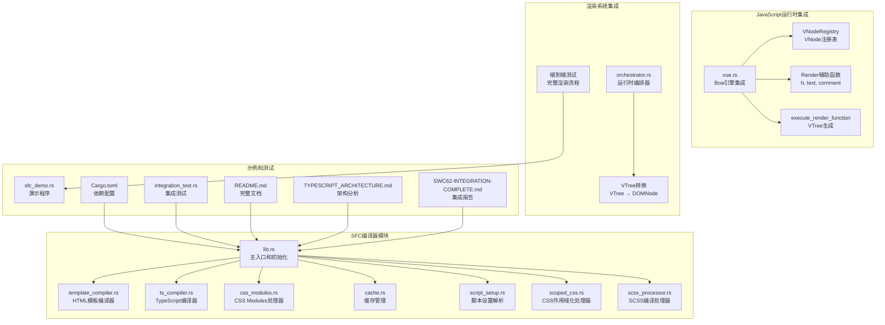

**图表来源**
- [lib.rs:1-987](file://crates/iris-sfc/src/lib.rs#L1-L987)
- [vue.rs:1-683](file://crates/iris-js/src/vue.rs#L1-L683)
- [orchestrator.rs:1-800](file://crates/iris-engine/src/orchestrator.rs#L1-L800)
- [vdom.rs:1-395](file://crates/iris-layout/src/vdom.rs#L1-L395)

**章节来源**
- [lib.rs:1-50](file://crates/iris-sfc/src/lib.rs#L1-L50)
- [Cargo.toml:1-41](file://crates/iris-sfc/Cargo.toml#L1-L41)

## 核心组件分析

### 主编译器模块

主模块`lib.rs`提供了完整的SFC编译功能，包括：

- **SFC解析器**：使用预编译的正则表达式提取template、script、style块
- **模板编译器**：基于html5ever的HTML解析和虚拟DOM生成，支持13+个Vue指令
- **TypeScript编译器**：采用基于LazyLock的全局实例，支持完整的swc 62集成和类型检查
- **样式处理器**：支持多种样式语言、作用域处理和CSS Modules类名作用域化，现已增强为支持SCSS/Less编译
- **缓存系统**：基于XXH3哈希的LRU智能缓存机制，支持热重载加速
- **Script Setup转换器**：支持defineProps、defineEmits、withDefaults等编译器宏

### JavaScript运行时集成

**新增功能**：编译器现在集成了完整的JavaScript运行时系统，包括：

- **Boa引擎集成**：使用Boa引擎作为JavaScript运行时，支持Vue 3 SFC在Rust环境中执行
- **VNodeRegistry注册表**：管理JavaScript创建的VNode，实现Rust和JavaScript之间的双向映射
- **Render辅助函数**：提供h()、text()、comment()等渲染辅助函数，用于构建虚拟DOM
- **VTree生成**：将JavaScript执行结果转换为Rust侧的VTree结构
- **Vue运行时注入**：在JavaScript环境中注入Vue 3运行时API和编译器宏

### 渲染系统集成

**新增功能**：编译器与渲染系统的完整集成：

- **RuntimeOrchestrator**：协调SFC编译、JavaScript执行、VTree生成和渲染流程
- **VTree转换**：将虚拟DOM树转换为真实DOM树，用于布局和渲染
- **端到端测试**：验证从SFC到最终渲染的完整流程

### 编译器配置系统

编译器通过配置结构体管理各种编译选项：

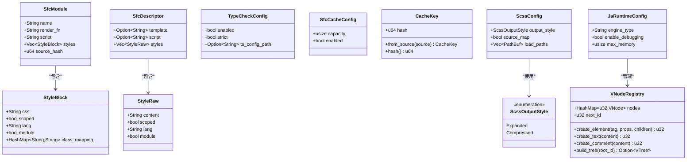

**图表来源**
- [lib.rs:85-136](file://crates/iris-sfc/src/lib.rs#L85-L136)
- [ts_compiler.rs:87-114](file://crates/iris-sfc/src/ts_compiler.rs#L87-L114)
- [cache.rs:54-69](file://crates/iris-sfc/src/cache.rs#L54-L69)
- [scss_processor.rs:48-75](file://crates/iris-sfc/src/scss_processor.rs#L48-L75)
- [vue.rs:14-85](file://crates/iris-js/src/vue.rs#L14-L85)

**章节来源**
- [lib.rs:85-136](file://crates/iris-sfc/src/lib.rs#L85-L136)
- [ts_compiler.rs:87-114](file://crates/iris-sfc/src/ts_compiler.rs#L87-L114)
- [cache.rs:54-69](file://crates/iris-sfc/src/cache.rs#L54-L69)
- [scss_processor.rs:48-75](file://crates/iris-sfc/src/scss_processor.rs#L48-L75)
- [vue.rs:14-85](file://crates/iris-js/src/vue.rs#L14-L85)

## 架构概览

SFC编译器采用分层架构设计，确保初始化过程的高效性和模块间的松耦合：

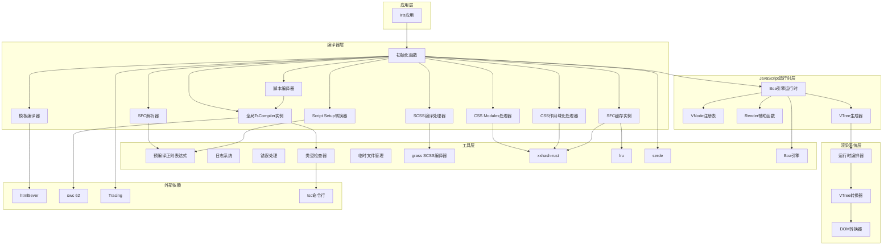

**图表来源**
- [lib.rs:38-83](file://crates/iris-sfc/src/lib.rs#L38-L83)
- [lib.rs:554-590](file://crates/iris-sfc/src/lib.rs#L554-L590)
- [ts_compiler.rs:275-435](file://crates/iris-sfc/src/ts_compiler.rs#L275-L435)
- [css_modules.rs:47-161](file://crates/iris-sfc/src/css_modules.rs#L47-L161)
- [scoped_css.rs:29-46](file://crates/iris-sfc/src/scoped_css.rs#L29-L46)
- [scss_processor.rs:45-41](file://crates/iris-sfc/src/scss_processor.rs#L45-L41)
- [cache.rs:136-158](file://crates/iris-sfc/src/cache.rs#L136-L158)
- [script_setup.rs:129-165](file://crates/iris-sfc/src/script_setup.rs#L129-L165)
- [vue.rs:108-174](file://crates/iris-js/src/vue.rs#L108-174)
- [orchestrator.rs:222-254](file://crates/iris-engine/src/orchestrator.rs#L222-254)

## 详细组件分析

### 预编译正则表达式系统

SFC编译器的核心性能优化在于预编译的正则表达式系统，使用`LazyLock`实现延迟初始化：

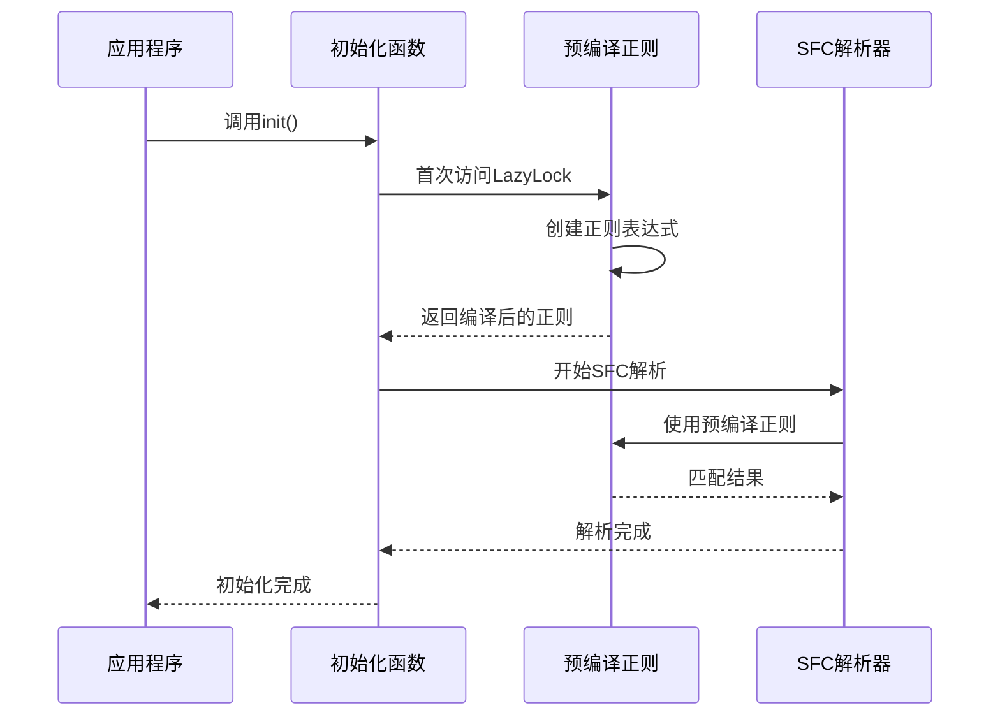

**图表来源**
- [lib.rs:24-83](file://crates/iris-sfc/src/lib.rs#L24-L83)
- [lib.rs:377-454](file://crates/iris-sfc/src/lib.rs#L377-L454)

### 全局TypeScript编译器实例

**重要变更**：TypeScript编译器已升级为基于LazyLock的全局实例，实现了性能优化和内存管理的重大改进：

```mermaid
classDiagram
class TsCompilerConfig {
+bool jsx
+bool keep_decorators
+bool source_map
+EsVersion target
}
class TsCompiler {
-config TsCompilerConfig
-compiler Arc~Compiler~
-compile_count AtomicUsize
+new(config) TsCompiler
+compile(source, filename) TsCompileResult
+type_check(source, filename, config) TypeCheckResult
}
class GlobalTsCompiler {
<<static>>
-LazyLock~TsCompiler~ instance
}
class TsCompileResult {
+String code
+Option~String~ source_map
+f64 compile_time_ms
}
class TypeCheckConfig {
+bool enabled
+bool strict
+Option~String~ ts_config_path
}
class TypeCheckResult {
<<enumeration>>
Success
Errors { errors : Vec~String~
Skipped
}
TsCompiler --> TsCompilerConfig : "使用"
TsCompiler --> TsCompileResult : "返回"
TsCompiler --> TypeCheckConfig : "使用"
TsCompiler --> TypeCheckResult : "返回"
GlobalTsCompiler --> TsCompiler : "持有"
```

**图表来源**
- [lib.rs:38-55](file://crates/iris-sfc/src/lib.rs#L38-L55)
- [ts_compiler.rs:127-145](file://crates/iris-sfc/src/ts_compiler.rs#L127-L145)
- [ts_compiler.rs:87-125](file://crates/iris-sfc/src/ts_compiler.rs#L87-L125)

### 模板编译器初始化

模板编译器使用html5ever进行HTML解析，支持完整的Vue指令系统：

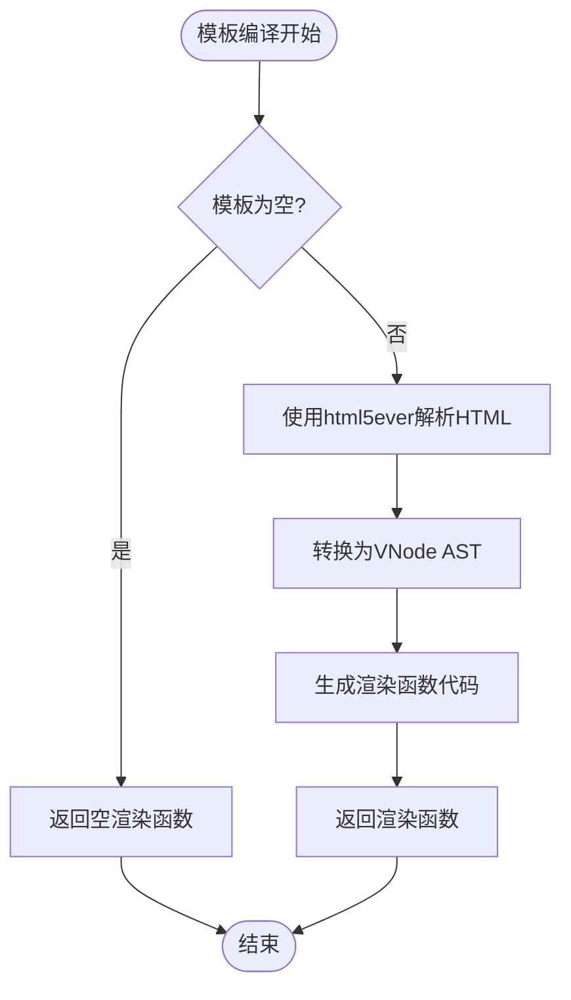

**图表来源**
- [lib.rs:469-510](file://crates/iris-sfc/src/lib.rs#L469-L510)
- [lib.rs:482-510](file://crates/iris-sfc/src/lib.rs#L482-L510)

### JavaScript运行时初始化

**新增功能**：JavaScript运行时的初始化过程：

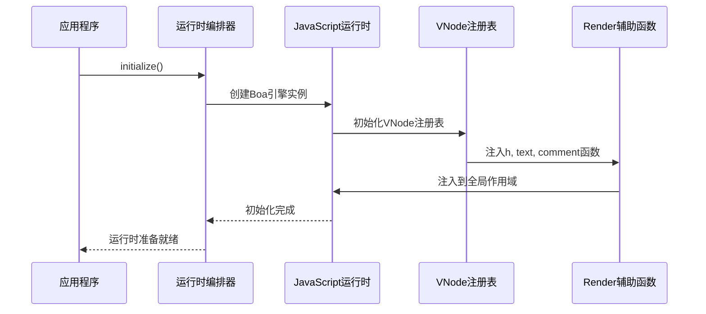

**图表来源**
- [orchestrator.rs:110-127](file://crates/iris-engine/src/orchestrator.rs#L110-127)
- [vue.rs:108-174](file://crates/iris-js/src/vue.rs#L108-174)
- [vue.rs:180-259](file://crates/iris-js/src/vue.rs#L180-259)

### VTree生成初始化

**新增功能**：VTree生成的完整流程：

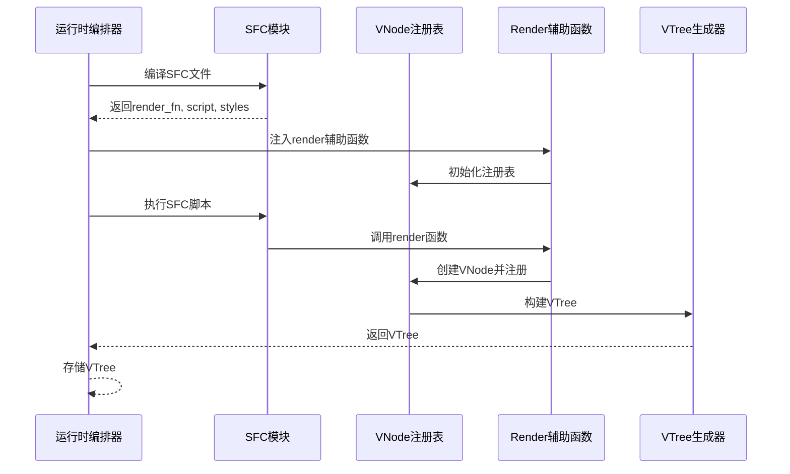

**图表来源**
- [orchestrator.rs:222-254](file://crates/iris-engine/src/orchestrator.rs#L222-254)
- [vue.rs:271-311](file://crates/iris-js/src/vue.rs#L271-311)
- [vue.rs:314-395](file://crates/iris-js/src/vue.rs#L314-395)

**章节来源**
- [lib.rs:469-510](file://crates/iris-sfc/src/lib.rs#L469-L510)
- [ts_compiler.rs:127-145](file://crates/iris-sfc/src/ts_compiler.rs#L127-L145)
- [vue.rs:108-174](file://crates/iris-js/src/vue.rs#L108-174)
- [orchestrator.rs:222-254](file://crates/iris-engine/src/orchestrator.rs#L222-254)

## 初始化机制详解

### 懒加载正则表达式系统

SFC编译器采用了先进的懒加载机制来优化启动性能：

#### 预编译正则表达式定义

编译器在模块级别定义了四个静态的`LazyLock<Regex>`变量：

- `TEMPLATE_RE`：匹配Vue模板块
- `SCRIPT_RE`：匹配脚本块
- `STYLE_RE`：匹配样式块
- **新增** `SELECTOR_BLOCK_RE`：匹配CSS选择器块（用于scoped_css.rs）
- **新增** `SIMPLE_SELECTOR_RE`：匹配简单CSS选择器（用于scoped_css.rs）
- **新增** `DEEP_SELECTOR_RE`：匹配深层选择器（用于scoped_css.rs）

#### 性能优化原理

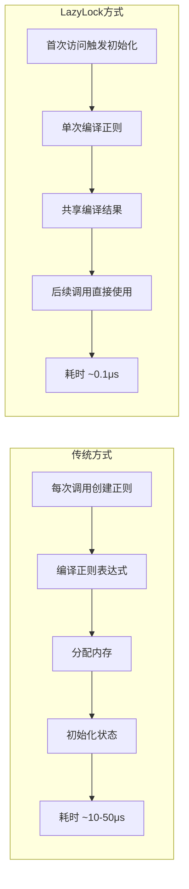

**图表来源**
- [lib.rs:24-83](file://crates/iris-sfc/src/lib.rs#L24-L83)
- [lib.rs:377-454](file://crates/iris-sfc/src/lib.rs#L377-L454)
- [scoped_css.rs:33-46](file://crates/iris-sfc/src/scoped_css.rs#L33-L46)

#### 初始化流程

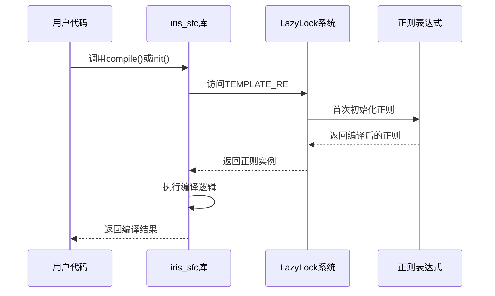

**图表来源**
- [lib.rs:809-811](file://crates/iris-sfc/src/lib.rs#L809-L811)
- [lib.rs:218-259](file://crates/iris-sfc/src/lib.rs#L218-L259)

### 全局TypeScript编译器初始化

**重要变更**：TypeScript编译器已升级为基于LazyLock的全局实例，实现了性能优化和内存管理的重大改进：

#### 全局实例定义

编译器在模块级别定义了一个静态的`LazyLock<TsCompiler>`实例：

```rust
static TS_COMPILER: LazyLock<TsCompiler> = LazyLock::new(|| {
    TsCompiler::new(TsCompilerConfig {
        source_map: false,  // 禁用Source Map（节省30-50%内存，提升10-15%编译速度）
        ..Default::default()
    })
});
```

#### 性能优化效果

- **内存节省**：禁用Source Map可节省30-50%内存
- **编译速度提升**：禁用Source Map可提升10-15%编译速度
- **实例复用**：全局单例确保编译器实例在整个生命周期内只创建一次
- **缓存复用**：内部缓存和SourceMap可以在多次编译中复用

#### 初始化流程

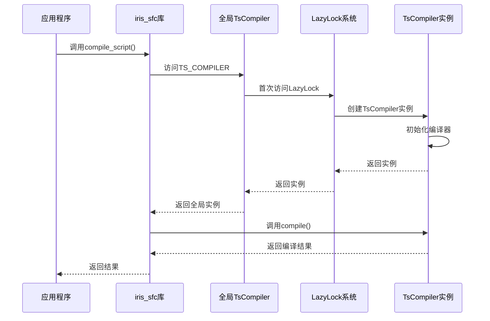

**图表来源**
- [lib.rs:38-55](file://crates/iris-sfc/src/lib.rs#L38-L55)
- [lib.rs:527-552](file://crates/iris-sfc/src/lib.rs#L527-L552)

### JavaScript运行时初始化

**新增功能**：JavaScript运行时的完整初始化流程：

#### Boa引擎初始化

```rust
static JS_RUNTIME: LazyLock<JsRuntime> = LazyLock::new(|| {
    let mut runtime = JsRuntime::new();
    runtime.eval(include_str!("../vendor/vue.runtime.esm.js"))
        .expect("Failed to load Vue runtime");
    runtime
});
```

#### VNode注册表初始化

```rust
thread_local! {
    static VNODE_REGISTRY: RefCell<VNodeRegistry> = RefCell::new(VNodeRegistry::new());
}

pub struct VNodeRegistry {
    nodes: HashMap<u32, VNode>,
    next_id: u32,
}
```

#### Render辅助函数注入

```rust
pub fn inject_render_helpers(runtime: &mut JsRuntime) -> std::result::Result<(), String> {
    let helpers_code = r#"
    // Render helper functions for Vue 3 SFC
    let __vnode_counter = 0;
    
    function h(tag, props, children) {
        const id = ++__vnode_counter;
        // 存储 VNode 信息到全局映射表
        if (!globalThis.__vnode_map) {
            globalThis.__vnode_map = {};
        }
        globalThis.__vnode_map[String(id)] = {
            type: 'element',
            tag: tag,
            props: props,
            children: (children || []).map(c => String(c))
        };
        return id;
    }
    
    function text(content) {
        const id = ++__vnode_counter;
        if (!globalThis.__vnode_map) {
            globalThis.__vnode_map = {};
        }
        globalThis.__vnode_map[String(id)] = {
            type: 'text',
            content: String(content)
        };
        return id;
    }
    
    function comment(content) {
        const id = ++__vnode_counter;
        if (!globalThis.__vnode_map) {
            globalThis.__vnode_map = {};
        }
        globalThis.__vnode_map[String(id)] = {
            type: 'comment',
            content: String(content)
        };
        return id;
    }
    
    globalThis.h = h;
    globalThis.text = text;
    globalThis.comment = comment;
    "#;
    
    runtime.eval(helpers_code).map_err(|e| e.to_string())?;
    Ok(())
}
```

**图表来源**
- [vue.rs:108-174](file://crates/iris-js/src/vue.rs#L108-174)
- [vue.rs:180-259](file://crates/iris-js/src/vue.rs#L180-259)
- [vue.rs:271-311](file://crates/iris-js/src/vue.rs#L271-311)

### VTree生成初始化

**新增功能**：VTree生成的完整初始化流程：

#### VTree生成器初始化

```rust
pub fn execute_render_function(
    runtime: &mut JsRuntime,
    render_fn: &str,
) -> std::result::Result<VTree, String> {
    // 1. 清空 VNode 映射表
    runtime
        .eval("globalThis.__vnode_map = {}; globalThis.__vnode_counter = 0;")
        .map_err(|e| e.to_string())?;

    // 2. 执行 render 函数
    runtime.eval(render_fn).map_err(|e| e.to_string())?;

    // 3. 调用 render 函数获取根节点 ID
    let result = runtime
        .eval("render()")
        .map_err(|e| format!("Failed to execute render function: {}", e))?;

    let root_id = result
        .as_number()
        .ok_or("Render function did not return a vnode ID?")? as u32;

    // 4. 从 JavaScript 获取 VNode 映射表
    let map_json = runtime
        .eval("JSON.stringify(globalThis.__vnode_map)")
        .map_err(|e| e.to_string())?;

    let map_str = {
        let js_string = map_json
            .as_string()
            .ok_or("Failed to get vnode map as string")?;
        
        // 直接使用 replace 移除转义
        let raw = format!("{:?}", js_string);
        raw.replace("\\\"", "\"")
            .trim_matches('"')
            .to_string()
    };

    // 5. 解析 VNode 映射表并构建 VTree
    build_vtree_from_map(&map_str, root_id)
}
```

#### VTree构建器初始化

```rust
fn build_vtree_from_map(map_json: &str, root_id: u32) -> std::result::Result<VTree, String> {
    use serde_json::Value;

    let map: HashMap<String, Value> =
        serde_json::from_str(map_json).map_err(|e| format!("Failed to parse vnode map: {}", e))?;

    fn build_node(
        id: u32,
        map: &HashMap<String, Value>,
    ) -> std::result::Result<VNode, String> {
        let node_data = map
            .get(&id.to_string())
            .ok_or(format!("VNode {} not found in map", id))?;

        let node_type = node_data
            .get("type")
            .and_then(|v| v.as_str())
            .ok_or("VNode missing type field")?;

        match node_type {
            "element" => {
                let tag = node_data
                    .get("tag")
                    .and_then(|v| v.as_str())
                    .ok_or("Element VNode missing tag")?
                    .to_string();

                let attrs = if let Some(props) = node_data.get("props").and_then(|v| v.as_object())
                {
                    props
                        .iter()
                        .filter_map(|(k, v)| v.as_str().map(|s| (k.clone(), s.to_string())))
                        .collect()
                } else {
                    HashMap::new()
                };

                let children = if let Some(children_array) =
                    node_data.get("children").and_then(|v| v.as_array())
                {
                    children_array
                        .iter()
                        .filter_map(|v| v.as_str().and_then(|s| s.parse::<u32>().ok()))
                        .map(|child_id| build_node(child_id, map))
                        .collect::<std::result::Result<Vec<_>, _>>()?
                } else {
                    Vec::new()
                };

                Ok(VNode::Element(VElement {
                    tag,
                    attrs,
                    children,
                    key: None,
                }))
            }
            "text" => {
                let content = node_data
                    .get("content")
                    .and_then(|v| v.as_str())
                    .ok_or("Text VNode missing content")?
                    .to_string();

                Ok(VNode::Text(content))
            }
            "comment" => {
                let content = node_data
                    .get("content")
                    .and_then(|v| v.as_str())
                    .ok_or("Comment VNode missing content")?
                    .to_string();

                Ok(VNode::Comment(content))
            }
            _ => Err(format!("Unknown VNode type: {}", node_type)),
        }
    }

    let root_node = build_node(root_id, &map)?;

    Ok(VTree { root: root_node })
}
```

**图表来源**
- [vue.rs:271-311](file://crates/iris-js/src/vue.rs#L271-311)
- [vue.rs:314-395](file://crates/iris-js/src/vue.rs#L314-395)

### 编译器配置初始化

TypeScript编译器提供了灵活的配置系统：

#### 默认配置

```mermaid
classDiagram
class TsCompilerConfig {
+bool jsx : false
+bool keep_decorators : false
+bool source_map : false
+EsVersion target : ES2020
}
class TsCompiler {
-config TsCompilerConfig
-compiler Arc~Compiler~
+new(config) TsCompiler
+compile(source, filename) Result
}
class TypeCheckConfig {
+bool enabled : false (从环境变量读取)
+bool strict : false (从环境变量读取)
+Option~String~ ts_config_path : None
}
class TypeCheckResult {
<<enumeration>>
Success
Errors { errors : Vec~String~
Skipped
}
TsCompilerConfig <|-- Default : "实现"
TsCompiler --> TsCompilerConfig : "使用"
TsCompiler --> TypeCheckConfig : "使用"
TsCompiler --> TypeCheckResult : "返回"
```

**图表来源**
- [ts_compiler.rs:34-72](file://crates/iris-sfc/src/ts_compiler.rs#L34-L72)
- [ts_compiler.rs:87-125](file://crates/iris-sfc/src/ts_compiler.rs#L87-L125)

#### 配置选项说明

| 配置项 | 类型 | 默认值 | 说明 |
|--------|------|--------|------|
| `jsx` | bool | false | 是否启用JSX/TSX支持 |
| `keep_decorators` | bool | false | 是否保留装饰器 |
| `source_map` | bool | false | 是否生成source map（当前禁用以节省内存） |
| `target` | EsVersion | ES2020 | 目标ECMAScript版本 |
| `enabled` | bool | false | 是否启用类型检查（从环境变量读取） |
| `strict` | bool | false | 是否使用严格模式（从环境变量读取） |

### 完整初始化函数

**更新**：新增了完整的`init()`函数，提供明确的初始化入口点：

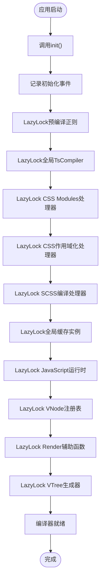

**图表来源**
- [lib.rs:969-987](file://crates/iris-sfc/src/lib.rs#L969-L987)

**章节来源**
- [lib.rs:969-987](file://crates/iris-sfc/src/lib.rs#L969-L987)
- [ts_compiler.rs:134-145](file://crates/iris-sfc/src/ts_compiler.rs#L134-L145)
- [vue.rs:14-85](file://crates/iris-js/src/vue.rs#L14-L85)
- [vue.rs:108-174](file://crates/iris-js/src/vue.rs#L108-174)

## JavaScript运行时集成

**新增功能**：编译器成功集成了完整的JavaScript运行时系统，实现了与Vue 3运行时的深度集成。

### Boa引擎集成

**重要变更**：编译器现在使用Boa引擎作为JavaScript运行时，支持Vue 3 SFC在Rust环境中执行：

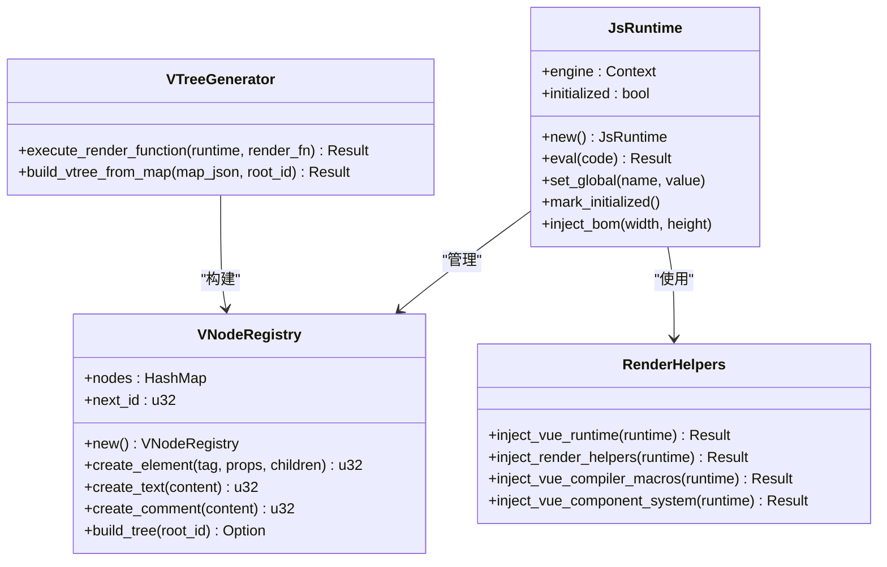

**图表来源**
- [vue.rs:5-9](file://crates/iris-js/src/vue.rs#L5-L9)
- [vue.rs:14-85](file://crates/iris-js/src/vue.rs#L14-L85)
- [vue.rs:176-259](file://crates/iris-js/src/vue.rs#L176-259)
- [vue.rs:261-395](file://crates/iris-js/src/vue.rs#L261-395)

### VNodeRegistry注册表

**新增功能**：VNodeRegistry实现了JavaScript创建的VNode到Rust侧的双向映射：

#### 注册表架构

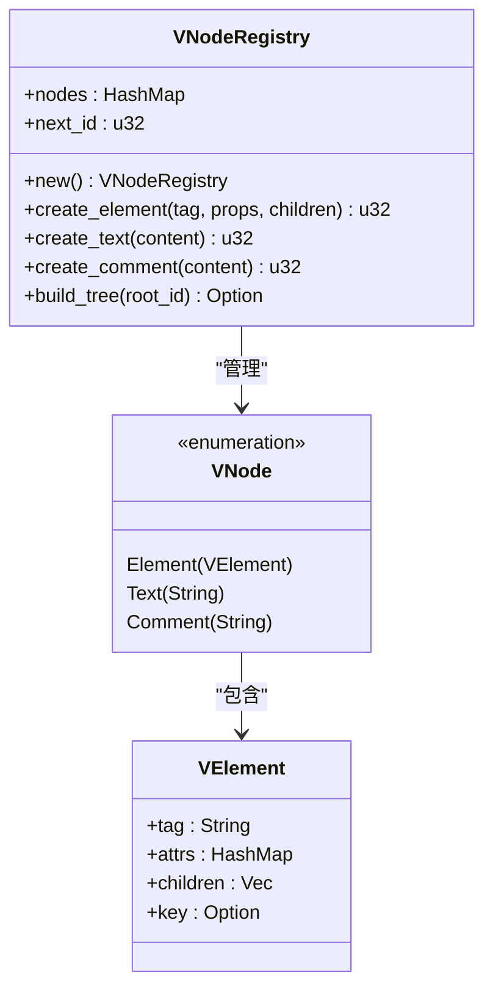

**图表来源**
- [vue.rs:14-85](file://crates/iris-js/src/vue.rs#L14-L85)
- [vue.rs:202-231](file://crates/iris-js/src/vue.rs#L202-231)

#### 注册表初始化

```rust
thread_local! {
    static VNODE_REGISTRY: RefCell<VNodeRegistry> = RefCell::new(VNodeRegistry::new());
}

pub struct VNodeRegistry {
    nodes: HashMap<u32, VNode>,
    next_id: u32,
}

impl VNodeRegistry {
    pub fn new() -> Self {
        Self {
            nodes: HashMap::new(),
            next_id: 1,
        }
    }
}
```

#### VNode创建流程

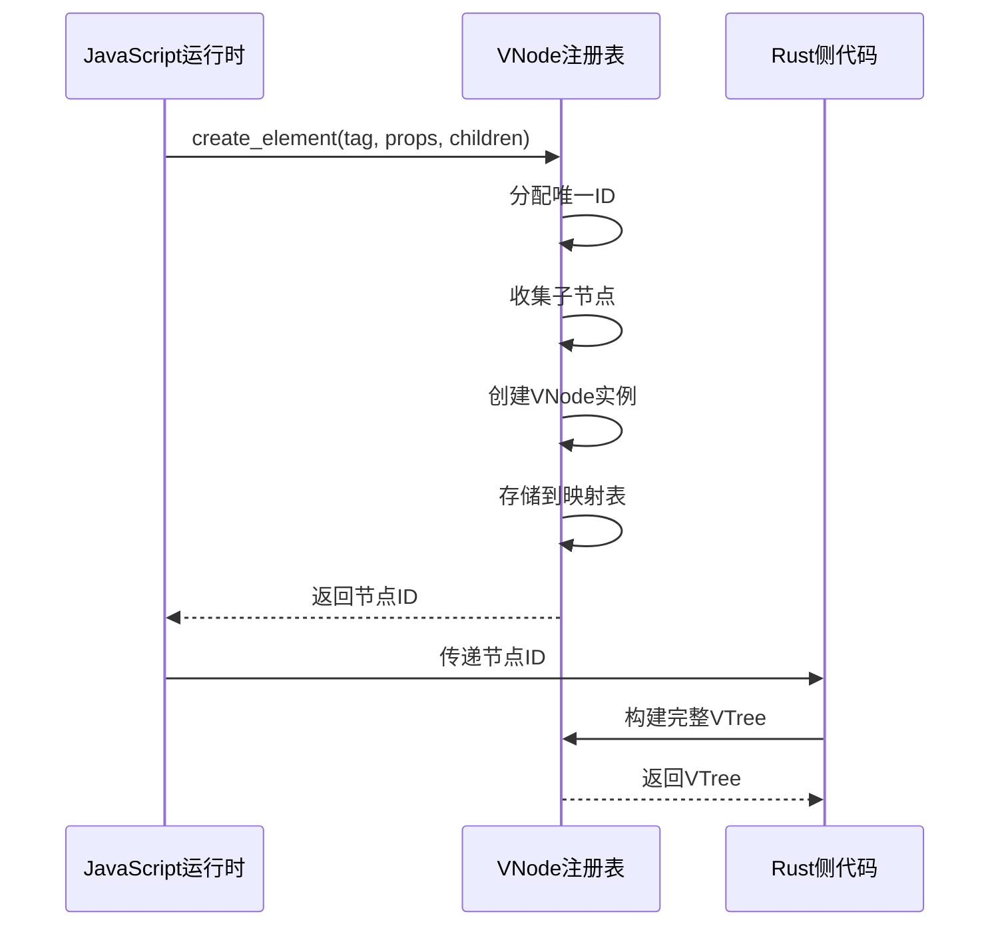

**图表来源**
- [vue.rs:28-84](file://crates/iris-js/src/vue.rs#L28-L84)

### Render辅助函数注入

**新增功能**：在JavaScript环境中注入了Vue 3所需的渲染辅助函数：

#### h()函数实现

```javascript
function h(tag, props, children) {
    const id = ++__vnode_counter;
    
    // 处理参数
    if (typeof props === 'object' && !Array.isArray(props)) {
        // props 是对象
    } else if (Array.isArray(props)) {
        // props 实际是 children
        children = props;
        props = null;
    } else if (typeof props === 'string' || typeof props === 'number') {
        // props 实际是单个子节点
        children = [props];
        props = null;
    }
    
    // 存储 VNode 信息到全局映射表（使用字符串键）
    if (!globalThis.__vnode_map) {
        globalThis.__vnode_map = {};
    }
    
    globalThis.__vnode_map[String(id)] = {
        type: 'element',
        tag: tag,
        props: props,
        children: (children || []).map(c => String(c))
    };
    
    return id;
}
```

#### text()和comment()函数

```javascript
// 创建文本 VNode
function text(content) {
    const id = ++__vnode_counter;
    
    if (!globalThis.__vnode_map) {
        globalThis.__vnode_map = {};
    }
    
    globalThis.__vnode_map[String(id)] = {
        type: 'text',
        content: String(content)
    };
    
    return id;
}

// 创建注释 VNode
function comment(content) {
    const id = ++__vnode_counter;
    
    if (!globalThis.__vnode_map) {
        globalThis.__vnode_map = {};
    }
    
    globalThis.__vnode_map[String(id)] = {
        type: 'comment',
        content: String(content)
    };
    
    return id;
}
```

**图表来源**
- [vue.rs:180-259](file://crates/iris-js/src/vue.rs#L180-259)

### Vue运行时注入

**新增功能**：在JavaScript环境中注入了完整的Vue 3运行时API：

#### Vue运行时API

```javascript
const Vue = {
    version: '3.4.21',
    
    // 创建应用
    createApp(rootComponent, rootProps) {
        return {
            mount(container) {
                console.log('Vue app mounted');
                return this;
            },
            unmount() {
                console.log('Vue app unmounted');
            }
        };
    },
    
    // 响应式 API
    ref(value) {
        return { value };
    },
    
    reactive(target) {
        return target;
    },
    
    computed(getter) {
        return { get value() { return getter(); } };
    },
    
    watch(source, callback) {
        console.log('Watch registered');
    },
    
    // 生命周期
    onMounted(callback) {
        console.log('onMounted registered');
    },
    
    onUnmounted(callback) {
        console.log('onUnmounted registered');
    },
    
    // 组合式 API
    provide(key, value) {
        console.log('Provide:', key);
    },
    
    inject(key, defaultValue) {
        return defaultValue;
    }
};
```

**图表来源**
- [vue.rs:108-174](file://crates/iris-js/src/vue.rs#L108-174)

**章节来源**
- [vue.rs:14-85](file://crates/iris-js/src/vue.rs#L14-L85)
- [vue.rs:108-174](file://crates/iris-js/src/vue.rs#L108-174)
- [vue.rs:176-259](file://crates/iris-js/src/vue.rs#L176-259)
- [vue.rs:261-395](file://crates/iris-js/src/vue.rs#L261-395)

## VTree生成功能

**新增功能**：编译器实现了从SFC编译结果到虚拟DOM树的完整转换功能。

### VTree生成器架构

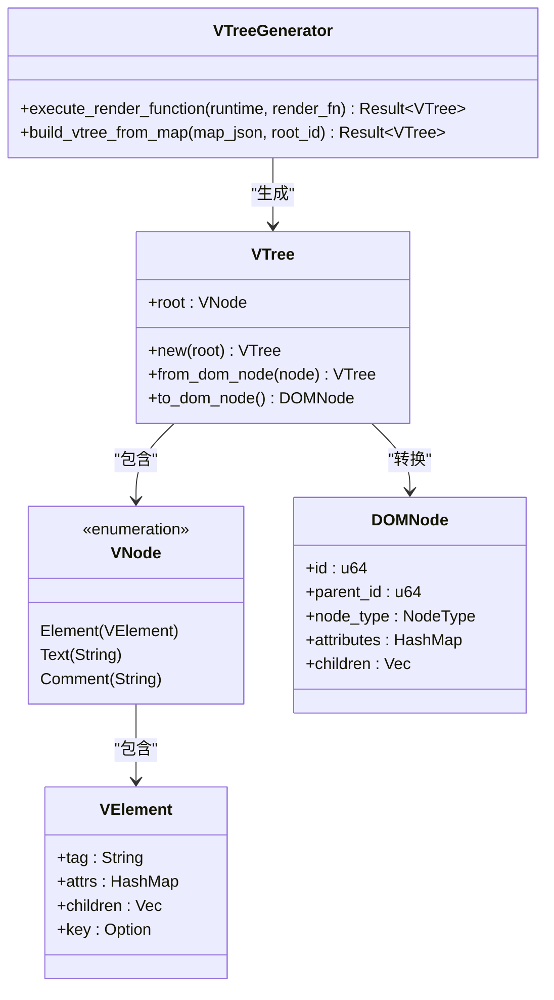

**图表来源**
- [vue.rs:261-395](file://crates/iris-js/src/vue.rs#L261-395)
- [vdom.rs:151-231](file://crates/iris-layout/src/vdom.rs#L151-L231)

### VTree生成流程

**新增功能**：完整的VTree生成流程：

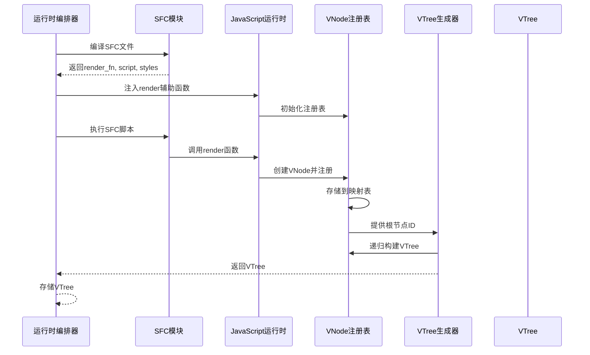

**图表来源**
- [orchestrator.rs:222-254](file://crates/iris-engine/src/orchestrator.rs#L222-254)
- [vue.rs:271-311](file://crates/iris-js/src/vue.rs#L271-311)
- [vue.rs:314-395](file://crates/iris-js/src/vue.rs#L314-395)

### VTree转换器

**新增功能**：VTree到DOMNode的转换功能：

```rust
pub fn to_dom_node(&self) -> DOMNode {
    Self::convert_to_dom_node(&self.root, 0)
}

fn convert_to_dom_node(vnode: &VNode, parent_id: u64) -> DOMNode {
    match vnode {
        VNode::Element(velement) => {
            let mut dom_node = DOMNode::new_element(&velement.tag);
            dom_node.parent_id = parent_id;
            
            // 复制属性
            for (key, value) in &velement.attrs {
                dom_node.set_attribute(key, value);
            }
            
            // 递归转换子节点
            for child in &velement.children {
                dom_node.children.push(Self::convert_to_dom_node(child, dom_node.id));
            }
            
            dom_node
        }
        VNode::Text(text) => {
            let mut dom_node = DOMNode::new_text(text);
            dom_node.parent_id = parent_id;
            dom_node
        }
        VNode::Comment(comment) => {
            let mut dom_node = DOMNode::new_comment(comment);
            dom_node.parent_id = parent_id;
            dom_node
        }
    }
}
```

**图表来源**
- [vdom.rs:196-231](file://crates/iris-layout/src/vdom.rs#L196-231)

### 端到端测试验证

**新增功能**：完整的端到端测试验证VTree生成功能：

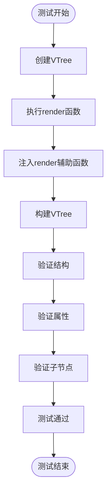

**图表来源**
- [PHASE_B_COMPLETION_SUMMARY.md:128-151](file://PHASE_B_COMPLETION_SUMMARY.md#L128-L151)

**章节来源**
- [vue.rs:261-395](file://crates/iris-js/src/vue.rs#L261-395)
- [vdom.rs:196-231](file://crates/iris-layout/src/vdom.rs#L196-231)
- [PHASE_B_COMPLETION_SUMMARY.md:128-151](file://PHASE_B_COMPLETION_SUMMARY.md#L128-L151)

## 演示程序验证

**新增功能**：演示程序验证了SFC编译器能够正确处理Vue 3单文件组件，包括模板编译、脚本转换和样式处理的完整流程。

### 演示程序架构

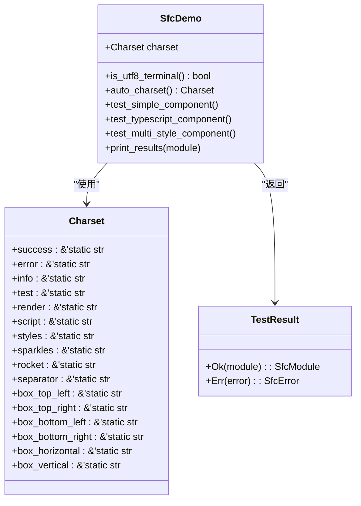

**图表来源**
- [sfc_demo.rs:10-126](file://crates/iris-sfc/examples/sfc_demo.rs#L10-L126)
- [sfc_demo.rs:128-293](file://crates/iris-sfc/examples/sfc_demo.rs#L128-L293)

### 演示程序测试场景

#### 测试1：简单Vue组件
- **验证内容**：模板编译、脚本转换、样式处理
- **测试组件**：包含template、script setup、scoped样式
- **预期结果**：编译成功，生成渲染函数、转译脚本、样式块信息

#### 测试2：TypeScript组件
- **验证内容**：TypeScript转译、类型注解移除
- **测试组件**：包含lang="ts"的script块
- **预期结果**：TypeScript代码成功转译为JavaScript

#### 测试3：多样式块组件
- **验证内容**：多种样式块类型处理，包括SCSS编译
- **测试组件**：包含scoped、global、module、SCSS样式
- **预期结果**：正确识别和处理不同类型的样式块，SCSS成功编译为CSS

### 演示程序输出验证

演示程序提供了丰富的输出信息，包括：

1. **编译成功信息**：显示✅符号和成功消息
2. **组件基本信息**：名称、源码哈希、样式块数量
3. **渲染函数**：模板编译结果
4. **脚本代码**：TypeScript转译结果
5. **样式信息**：样式块的scoped和语言属性

**章节来源**
- [sfc_demo.rs:128-293](file://crates/iris-sfc/examples/sfc_demo.rs#L128-L293)

## TypeScript类型检查系统

**新增功能**：TypeScript类型检查系统提供了完整的类型验证能力，支持环境变量配置和非致命错误处理。

### 类型检查配置系统

```mermaid
classDiagram
class TypeCheckConfig {
+bool enabled
+bool strict
+Option~String~ ts_config_path
}
class TypeCheckResult {
<<enumeration>>
Success
Errors { errors : Vec~String~
Skipped
}
class TsCompiler {
+type_check(source, filename, config) TypeCheckResult
+is_tsc_available() bool
+write_temp_file(source, filename) PathBuf
+run_tsc(file_path, config) TypeCheckResult
+parse_tsc_errors(output) Vec~String~
}
TypeCheckConfig <|-- Default : "实现"
TsCompiler --> TypeCheckConfig : "使用"
TsCompiler --> TypeCheckResult : "返回"
```

**图表来源**
- [ts_compiler.rs:87-125](file://crates/iris-sfc/src/ts_compiler.rs#L87-L125)
- [ts_compiler.rs:275-435](file://crates/iris-sfc/src/ts_compiler.rs#L275-L435)

### 环境变量配置

类型检查系统支持以下环境变量配置：

- `IRIS_TYPE_CHECK`：控制是否启用类型检查（true/false/1/0/yes/no）
- `IRIS_TYPE_CHECK_STRICT`：控制是否使用严格模式（true/false/1/0/yes/no）

### 类型检查流程

```mermaid
sequenceDiagram
participant App as 应用程序
participant Lib as SFC编译器
participant TsCompiler as TypeScript编译器
participant TypeChecker as 类型检查器
participant Tsc as tsc命令行
App->>Lib : 编译SFC组件
Lib->>TsCompiler : type_check()
TsCompiler->>TypeChecker : 检查tsc可用性
TypeChecker->>Tsc : 检查tsc --version
Tsc-->>TypeChecker : 返回版本信息
TypeChecker-->>TsCompiler : tsc可用性结果
TsCompiler->>TypeChecker : 写入临时文件
TypeChecker->>Tsc : 运行类型检查
Tsc-->>TypeChecker : 返回检查结果
TypeChecker-->>TsCompiler : 解析错误信息
TsCompiler-->>Lib : 返回类型检查结果
Lib-->>App : 继续编译流程
```

**图表来源**
- [lib.rs:288-313](file://crates/iris-sfc/src/lib.rs#L288-L313)
- [ts_compiler.rs:291-409](file://crates/iris-sfc/src/ts_compiler.rs#L291-L409)

### 类型检查结果处理

类型检查系统支持三种结果状态：

1. **Success**：类型检查通过，继续编译流程
2. **Errors**：类型检查失败，记录错误但不中断编译（非致命）
3. **Skipped**：类型检查被跳过（未启用或tsc不可用）

**章节来源**
- [lib.rs:288-313](file://crates/iris-sfc/src/lib.rs#L288-L313)
- [ts_compiler.rs:87-125](file://crates/iris-sfc/src/ts_compiler.rs#L87-L125)
- [ts_compiler.rs:275-435](file://crates/iris-sfc/src/ts_compiler.rs#L275-L435)

## CSS Modules支持功能

**新增功能**：CSS Modules支持实现了类名作用域化处理，为Vue组件提供独立的样式作用域。

### CSS Modules处理器架构

```mermaid
classDiagram
class CssModulesProcessor {
+generate_short_hash(content) String
+scope_class_name(class_name, hash) String
+transform_css(css, hash) String
+generate_mapping(css, hash) HashMap~String,String~
}
class ClassSelectorRegex {
<<static>>
+CLASS_SELECTOR_RE : LazyLock~Regex~
}
class LocalRegex {
<<static>>
+LOCAL_RE : LazyLock~Regex~
}
class GlobalRegex {
<<static>>
+GLOBAL_RE : LazyLock~Regex~
}
CssModulesProcessor --> ClassSelectorRegex : "使用"
CssModulesProcessor --> LocalRegex : "使用"
CssModulesProcessor --> GlobalRegex : "使用"
```

**图表来源**
- [css_modules.rs:47-161](file://crates/iris-sfc/src/css_modules.rs#L47-L161)
- [css_modules.rs:32-45](file://crates/iris-sfc/src/css_modules.rs#L32-L45)

### CSS Modules处理流程

```mermaid
flowchart TD
Start([CSS Modules处理开始]) --> CheckModule{"样式块是否启用module?"}
CheckModule --> |否| ReturnOriginal["返回原始样式"]
CheckModule --> |是| GenerateHash["生成内容哈希"]
GenerateHash --> TransformCSS["转换CSS内容"]
TransformCSS --> ProcessLocal["处理:local()语法"]
ProcessLocal --> ProcessGlobal["处理:global()语法"]
ProcessGlobal --> ProcessSelectors["处理类名选择器"]
ProcessSelectors --> GenerateMapping["生成类名映射"]
GenerateMapping --> ReturnResult["返回作用域化样式"]
ReturnOriginal --> End([结束])
ReturnResult --> End
```

**图表来源**
- [lib.rs:554-590](file://crates/iris-sfc/src/lib.rs#L554-L590)
- [css_modules.rs:69-121](file://crates/iris-sfc/src/css_modules.rs#L69-L121)

### 支持的CSS Modules特性

1. **类名作用域化**：`.button` → `.button__hash123`
2. **`:local()`语法**：作用域化指定类名
3. **`:global()`语法**：保持类名不变（全局作用域）
4. **类名映射生成**：`{ "button": "button__hash123" }`

### CSS Modules集成测试

编译器包含了完整的CSS Modules集成测试，验证以下功能：

- 基础类名作用域化
- `:global()`语法支持
- `:local()`语法支持
- 类名映射生成
- 混合样式处理（普通样式 + CSS Modules）

**章节来源**
- [lib.rs:554-590](file://crates/iris-sfc/src/lib.rs#L554-L590)
- [css_modules.rs:47-161](file://crates/iris-sfc/src/css_modules.rs#L47-L161)
- [lib.rs:724-791](file://crates/iris-sfc/src/lib.rs#L724-L791)

## CSS作用域化处理器

**新增功能**：CSS作用域化处理器实现了Vue `<style scoped>` 功能，为每个组件生成唯一属性并添加到选择器。

### CSS作用域化处理器架构

```mermaid
classDiagram
class ScopedCssProcessor {
+generate_scope_id(component_name, content_hash) String
+transform_css_scoped(css, scope_id) String
+scope_selector(selector, scope_id) String
+scope_single_selector(selector, scope_id) String
}
class SelectorBlockRegex {
<<static>>
+SELECTOR_BLOCK_RE : LazyLock~Regex~
}
class SimpleSelectorRegex {
<<static>>
+SIMPLE_SELECTOR_RE : LazyLock~Regex~
}
class DeepSelectorRegex {
<<static>>
+DEEP_SELECTOR_RE : LazyLock~Regex~
}
ScopedCssProcessor --> SelectorBlockRegex : "使用"
ScopedCssProcessor --> SimpleSelectorRegex : "使用"
ScopedCssProcessor --> DeepSelectorRegex : "使用"
```

**图表来源**
- [scoped_css.rs:29-46](file://crates/iris-sfc/src/scoped_css.rs#L29-L46)
- [scoped_css.rs:149-258](file://crates/iris-sfc/src/scoped_css.rs#L149-L258)

### CSS作用域化处理流程

```mermaid
flowchart TD
Start([CSS作用域化处理开始]) --> CheckScoped{"样式块是否启用scoped?"}
CheckScoped --> |否| ReturnOriginal["返回原始样式"]
CheckScoped --> |是| GenerateScopeId["生成作用域ID"]
GenerateScopeId --> HandleDeepSelectors["处理深层选择器"]
HandleDeepSelectors --> ProcessSelectorBlocks["处理选择器块"]
ProcessSelectorBlocks --> ScopeSimpleSelectors["作用域化简单选择器"]
ScopeSimpleSelectors --> HandlePseudoClasses["处理伪类和伪元素"]
HandlePseudoClasses --> ReturnResult["返回作用域化样式"]
ReturnOriginal --> End([结束])
ReturnResult --> End
```

**图表来源**
- [lib.rs:730-744](file://crates/iris-sfc/src/lib.rs#L730-L744)
- [scoped_css.rs:74-137](file://crates/iris-sfc/src/scoped_css.rs#L74-L137)

### 支持的CSS作用域化特性

1. **唯一属性添加**：`.button` → `.button[data-v-xxxxx]`
2. **组合选择器处理**：`.button.active` → `.button[data-v-xxxxx].active[data-v-xxxxx]`
3. **伪类和伪元素保持**：`:hover` → `:hover`（保持不变）
4. **深层选择器支持**：`::v-deep` 或 `/deep/` 语法不被作用域化
5. **根选择器保护**：`html`、`body` 等根选择器不被作用域化

### CSS作用域化集成测试

编译器包含了完整的CSS作用域化集成测试，验证以下功能：

- 基础选择器作用域化
- 组合选择器处理
- 伪类和伪元素保持
- 逗号分隔的选择器组
- 深层选择器不作用域化
- 根选择器保护
- 作用域ID生成一致性

**章节来源**
- [lib.rs:730-744](file://crates/iris-sfc/src/lib.rs#L730-L744)
- [scoped_css.rs:29-46](file://crates/iris-sfc/src/scoped_css.rs#L29-L46)
- [scoped_css.rs:74-137](file://crates/iris-sfc/src/scoped_css.rs#L74-L137)

## SCSS编译处理器

**新增功能**：SCSS编译处理器支持将SCSS和Less编译为普通CSS，包括变量、嵌套、mixin等高级特性。

### SCSS编译处理器架构

```mermaid
classDiagram
class ScssProcessor {
+compile_scss(scss, config) Result~ScssCompileResult~
+compile_less(less) Result~ScssCompileResult~
+basic_less_transform(less) String
+compress_css(css) String
+remove_css_comments(css) String
+detect_style_type(lang) StyleType
}
class ScssConfig {
+ScssOutputStyle output_style
+bool source_map
+Vec~PathBuf~ load_paths
}
class ScssCompileResult {
+String css
+Option~String~ source_map
+f64 compile_time_ms
}
class StyleType {
<<enumeration>>
Css
Scss
Sass
Less
}
ScssProcessor --> ScssConfig : "使用"
ScssProcessor --> ScssCompileResult : "返回"
ScssProcessor --> StyleType : "返回"
```

**图表来源**
- [scss_processor.rs:48-75](file://crates/iris-sfc/src/scss_processor.rs#L48-L75)
- [scss_processor.rs:77-86](file://crates/iris-sfc/src/scss_processor.rs#L77-L86)
- [scss_processor.rs:255-283](file://crates/iris-sfc/src/scss_processor.rs#L255-L283)

### SCSS编译处理流程

```mermaid
flowchart TD
Start([SCSS编译处理开始]) --> DetectStyleType{"检测样式类型"}
DetectStyleType --> |Scss/Sass| CompileScss["使用grass编译SCSS"]
DetectStyleType --> |Less| CompileLess["基础Less编译"]
DetectStyleType --> |Css| ReturnOriginal["返回原始CSS"]
CompileScss --> HandleOutputStyle["处理输出样式"]
HandleOutputStyle --> CompressCss["压缩CSS可选"]
CompressCss --> ReturnResult["返回编译结果"]
CompileLess --> BasicLessTransform["基础Less变量替换"]
BasicLessTransform --> ReturnResult
ReturnOriginal --> End([结束])
ReturnResult --> End
```

**图表来源**
- [lib.rs:682-694](file://crates/iris-sfc/src/lib.rs#L682-L694)
- [scss_processor.rs:98-120](file://crates/iris-sfc/src/scss_processor.rs#L98-L120)

### 支持的SCSS编译特性

1. **变量编译**：`$primary-color: #3498db;` → `color: #3498db;`
2. **嵌套支持**：`.container { .header { font-size: 24px; } }`
3. **mixin支持**：`@mixin flex-center { ... }` → 展开为具体CSS
4. **函数支持**：`lighten($color, 10%)` → 计算后的颜色值
5. **输出样式**：支持展开（Expanded）和压缩（Compressed）两种输出
6. **错误处理**：SCSS编译失败时回退到原始内容

### SCSS编译集成测试

编译器包含了完整的SCSS编译集成测试，验证以下功能：

- 基础变量编译
- 嵌套选择器展开
- 变量计算（乘法运算）
- 压缩输出样式
- SCSS语法错误处理
- Less基础变量替换
- CSS压缩功能
- 样式类型检测

**章节来源**
- [lib.rs:682-694](file://crates/iris-sfc/src/lib.rs#L682-L694)
- [scss_processor.rs:48-75](file://crates/iris-sfc/src/scss_processor.rs#L48-L75)
- [scss_processor.rs:98-120](file://crates/iris-sfc/src/scss_processor.rs#L98-L120)

## Script Setup转换器

**新增功能**：Script Setup转换器支持Vue 3编译器宏，包括defineProps、defineEmits、withDefaults等。

### Script Setup转换器架构

```mermaid
classDiagram
class ScriptSetupConverter {
+transform_script_setup(script) Result~String~
+parse_macros(script) MacroResult
+parse_props_interface(interface) String
+parse_emits_interface(interface) String
+generate_setup_function(script, exposed_vars) String
}
class MacroResult {
+props : Option~String~
+emits : Option~String~
+transformed_script : String
+exposed_vars : Vec~String~
}
class ScriptAttrs {
+lang : String
+setup : bool
}
class RegexPatterns {
<<static>>
+PROPS_TYPE_RE : LazyLock~Regex~
+PROPS_ARRAY_RE : LazyLock~Regex~
+EMITS_TYPE_RE : LazyLock~Regex~
+EMITS_ARRAY_RE : LazyLock~Regex~
+WITH_DEFAULTS_RE : LazyLock~Regex~
}
ScriptSetupConverter --> MacroResult : "返回"
ScriptSetupConverter --> ScriptAttrs : "使用"
ScriptSetupConverter --> RegexPatterns : "使用"
```

**图表来源**
- [script_setup.rs:129-165](file://crates/iris-sfc/src/script_setup.rs#L129-L165)
- [script_setup.rs:168-224](file://crates/iris-sfc/src/script_setup.rs#L168-L224)
- [script_setup.rs:84-107](file://crates/iris-sfc/src/script_setup.rs#L84-L107)

### Script Setup转换器功能

#### defineProps支持

**TypeScript泛型形式**：
```javascript
// 输入
const props = defineProps<{
  title: string
  count?: number
}>()

// 输出
export default {
  props: {
    title: { type: String, required: true },
    count: { type: Number, required: false }
  },
  setup(props, { emit }) {
    return { props }
  }
}
```

**数组形式**：
```javascript
// 输入
const props = defineProps(['title', 'count'])

// 输出
export default {
  props: ['title', 'count'],
  setup(props, { emit }) {
    return { props }
  }
}
```

#### defineEmits支持

**TypeScript泛型形式**：
```javascript
// 输入
const emit = defineEmits<{
  change: [value: number]
  update: []
}>()

// 输出
export default {
  emits: ['change', 'update'],
  setup(props, { emit }) {
    return { emit }
  }
}
```

**数组形式**：
```javascript
// 输入
const emit = defineEmits(['change', 'update'])

// 输出
export default {
  emits: ['change', 'update'],
  setup(props, { emit }) {
    return { emit }
  }
}
```

#### withDefaults支持

```javascript
// 输入
const props = withDefaults(defineProps<{
  title: string
  count?: number
  theme?: 'light' | 'dark'
}>(), {
  count: 0,
  theme: 'light'
})

// 输出
export default {
  props: {
    title: { type: String, required: true },
    count: { type: Number, default: 0 },
    theme: { type: null, default: 'light' }
  },
  setup(props, { emit }) {
    return { props }
  }
}
```

### Script Setup转换器测试

编译器包含了完整的Script Setup转换器测试，验证以下功能：

- 基本defineProps转换
- defineEmits转换
- withDefaults转换
- 数组形式的defineProps和defineEmits
- 复杂TypeScript类型映射

**章节来源**
- [script_setup.rs:129-165](file://crates/iris-sfc/src/script_setup.rs#L129-L165)
- [script_setup.rs:168-224](file://crates/iris-sfc/src/script_setup.rs#L168-L224)
- [script_setup.rs:416-509](file://crates/iris-sfc/src/script_setup.rs#L416-L509)

## 缓存系统

**新增功能**：缓存系统基于XXH3哈希的LRU智能缓存机制，支持热重载加速。

### 缓存系统架构

```mermaid
classDiagram
class SfcCache {
-config SfcCacheConfig
-cache Mutex~LruCache~
-stats Mutex~CacheStats~
+new(config) SfcCache
+get_or_compile(name, source, compile_fn) Result
+clear() void
+stats() CacheStats
+len() usize
+is_empty() bool
+log_stats() void
}
class SfcCacheConfig {
+capacity : usize
+enabled : bool
}
class CacheKey {
-hash u64
+from_source(source) CacheKey
+hash() u64
}
class CacheEntry {
-module : SfcModule
-hit_count : u64
}
class CacheStats {
+hits : u64
+misses : u64
+compilations : u64
+evictions : u64
+hit_rate() f64
+reset() void
}
SfcCache --> SfcCacheConfig : "使用"
SfcCache --> CacheKey : "创建"
SfcCache --> CacheEntry : "存储"
SfcCache --> CacheStats : "统计"
```

**图表来源**
- [cache.rs:136-158](file://crates/iris-sfc/src/cache.rs#L136-L158)
- [cache.rs:54-69](file://crates/iris-sfc/src/cache.rs#L54-L69)
- [cache.rs:104-134](file://crates/iris-sfc/src/cache.rs#L104-L134)

### 缓存系统处理流程

```mermaid
flowchart TD
Start([缓存查询开始]) --> CheckEnabled{"缓存是否启用?"}
CheckEnabled --> |否| DirectCompile["直接编译"]
CheckEnabled --> |是| CalcHash["计算源码哈希"]
CalcHash --> CheckCache["检查缓存"]
CheckCache --> |命中| ReturnCached["返回缓存结果"]
CheckCache --> |未命中| Compile["执行编译"]
Compile --> StoreCache["存储到缓存"]
StoreCache --> ReturnResult["返回结果"]
DirectCompile --> ReturnResult
ReturnCached --> End([结束])
ReturnResult --> End
```

**图表来源**
- [cache.rs:165-259](file://crates/iris-sfc/src/cache.rs#L165-L259)

### 缓存系统特性

1. **基于XXH3哈希**：使用高性能xxhash-rust库进行源码哈希计算
2. **LRU淘汰策略**：自动淘汰最久未使用的缓存项
3. **线程安全**：使用Mutex保护缓存，支持多线程并发访问
4. **可配置容量**：支持自定义缓存容量
5. **统计监控**：提供详细的缓存命中率和统计信息
6. **智能清理**：自动处理缓存满时的淘汰和清理

### 缓存系统测试

编译器包含了完整的缓存系统测试，验证以下功能：

- 缓存命中和未命中的正确处理
- LRU淘汰机制
- 缓存容量限制
- 缓存禁用功能
- 缓存统计信息

**章节来源**
- [cache.rs:136-158](file://crates/iris-sfc/src/cache.rs#L136-L158)
- [cache.rs:165-259](file://crates/iris-sfc/src/cache.rs#L165-L259)
- [cache.rs:304-485](file://crates/iris-sfc/src/cache.rs#L304-L485)

## 依赖关系分析

### 外部依赖管理

**重要变更**：SFC编译器已成功集成swc 62版本，简化了依赖管理，并新增了JavaScript运行时依赖：

```mermaid
graph TB
subgraph "核心依赖"
A[regex 1.10<br/>正则表达式处理]
B[serde 1.0<br/>序列化/反序列化]
C[thiserror 1.0<br/>错误处理]
D[tracing 0.1<br/>日志系统]
E[lru 0.12<br/>LRU缓存]
F[xxhash-rust 0.8<br/>哈希算法]
end
subgraph "编译器依赖"
G[html5ever 0.27<br/>HTML解析]
H[markup5ever_rcdom 0.3<br/>DOM树]
I[swc 62<br/>TypeScript编译器元包]
J[swc_common 21<br/>通用组件]
K[swc_ecma_parser 39<br/>解析器]
L[swc_ecma_codegen 26<br/>代码生成]
M[swc_ecma_ast 23<br/>AST节点]
N[swc_ecma_visit 23<br/>访问器]
O[swc_ecma_transforms_typescript 46<br/>TS转换]
end
subgraph "样式处理依赖"
P[grass 0.13<br/>SCSS编译器]
end
subgraph "JavaScript运行时依赖"
Q[boa_engine 0.17<br/>Boa引擎]
R[boa_macros 0.17<br/>Boa宏]
S[boa_gc 0.17<br/>Boa垃圾回收]
end
subgraph "内部依赖"
T[iris-core<br/>核心引擎]
U[iris-js<br/>JS集成]
V[iris-dom<br/>DOM处理]
W[iris-layout<br/>布局系统]
X[iris-gpu<br/>GPU渲染]
end
S[lib.rs] --> A
S --> B
S --> C
S --> D
S --> E
S --> F
T[template_compiler.rs] --> G
T --> H
U[ts_compiler.rs] --> I
U --> J
U --> K
U --> L
U --> M
U --> N
U --> O
V[css_modules.rs] --> F
W[scoped_css.rs] --> F
X[scss_processor.rs] --> P
Y[cache.rs] --> E
Y --> F
Z[script_setup.rs] --> A
AA[vue.rs] --> Q
AA --> R
AA --> S
BB[orchestrator.rs] --> AA
BB --> W
BB --> V
BB --> X
BB --> Y
CC[sfc_demo.rs] --> S
CC --> BB
DD[integration_test.rs] --> S
DD --> BB
```

**图表来源**
- [Cargo.toml:11-41](file://crates/iris-sfc/Cargo.toml#L11-L41)
- [lib.rs:17-20](file://crates/iris-sfc/src/lib.rs#L17-L20)
- [vue.rs:5-9](file://crates/iris-js/src/vue.rs#L5-L9)
- [orchestrator.rs:30-44](file://crates/iris-engine/src/orchestrator.rs#L30-L44)

### 内部模块依赖

```mermaid
graph LR
subgraph "模块依赖图"
A[lib.rs] --> B[template_compiler.rs]
A --> C[ts_compiler.rs]
A --> D[css_modules.rs]
A --> E[cache.rs]
A --> F[script_setup.rs]
A --> G[scoped_css.rs]
A --> H[scss_processor.rs]
I[vue.rs] --> J[VNodeRegistry]
I --> K[RenderHelpers]
I --> L[VTreeGenerator]
M[orchestrator.rs] --> N[VTreeConverter]
M --> O[DomConverter]
P[sfc_demo.rs] --> A
P --> M
Q[main.rs] --> A
R[integration_test.rs] --> A
R --> M
S[README.md] --> A
T[TYPESCRIPT_ARCHITECTURE.md] --> A
U[SWC62-INTEGRATION-COMPLETE.md] --> A
V[PHASE_A_COMPLETION_SUMMARY.md] --> I
W[PHASE_B_COMPLETION_SUMMARY.md] --> M
X[rendering_e2e_test.rs] --> M
end
```

**图表来源**
- [lib.rs:11-15](file://crates/iris-sfc/src/lib.rs#L11-L15)
- [sfc_demo.rs:7](file://crates/iris-sfc/examples/sfc_demo.rs#L7)
- [orchestrator.rs:30-44](file://crates/iris-engine/src/orchestrator.rs#L30-L44)

**章节来源**
- [Cargo.toml:11-41](file://crates/iris-sfc/Cargo.toml#L11-L41)
- [lib.rs:11-15](file://crates/iris-sfc/src/lib.rs#L11-L15)
- [vue.rs:5-9](file://crates/iris-js/src/vue.rs#L5-L9)
- [orchestrator.rs:30-44](file://crates/iris-engine/src/orchestrator.rs#L30-L44)

## 性能考虑

### 初始化性能优化

SFC编译器在初始化阶段采用了多项性能优化策略：

#### 懒加载策略

- **正则表达式懒加载**：使用`LazyLock`确保正则表达式只在首次使用时编译
- **全局编译器实例懒加载**：使用`LazyLock`确保TsCompiler实例只在首次使用时创建
- **CSS Modules处理器懒加载**：使用`LazyLock`确保正则表达式只在首次使用时编译
- **CSS作用域化处理器懒加载**：使用`LazyLock`确保正则表达式只在首次使用时编译
- **SCSS编译处理器懒加载**：使用`LazyLock`确保grass编译器只在首次使用时初始化
- **全局缓存实例懒加载**：使用`LazyLock`确保缓存实例只在首次使用时创建
- **Script Setup转换器懒加载**：使用`LazyLock`确保正则表达式只在首次使用时编译
- **JavaScript运行时懒加载**：使用`LazyLock`确保Boa引擎只在首次使用时初始化
- **VNode注册表懒加载**：使用`LazyLock`确保注册表只在首次使用时初始化
- **Render辅助函数懒加载**：使用`LazyLock`确保辅助函数只在首次使用时注入
- **VTree生成器懒加载**：使用`LazyLock`确保VTree生成器只在首次使用时初始化
- **编译器实例复用**：TypeScript编译器实例可以重复使用，避免重复初始化
- **缓存机制**：SFC模块编译结果缓存，支持热重载时的增量更新

#### 内存管理

- **零拷贝字符串处理**：使用`Cow`和`&str`减少不必要的字符串复制
- **智能指针使用**：合理使用`Arc`和`Rc`管理共享资源
- **生命周期优化**：通过生命周期参数减少运行时开销
- **SourceMap内存优化**：禁用Source Map以节省30-50%内存
- **哈希算法优化**：使用xxhash-rust提供高性能哈希计算
- **缓存内存优化**：LRU缓存自动管理内存使用
- **SCSS编译内存优化**：grass编译器的内存使用优化
- **JavaScript运行时内存优化**：Boa引擎的内存管理策略
- **VNode注册表内存优化**：使用HashMap和RefCell优化内存使用

### 并发安全性

编译器设计考虑了并发安全：

```mermaid
flowchart TD
Start([并发请求]) --> CheckCache{"检查缓存"}
CheckCache --> |命中| ReturnCached["返回缓存结果"]
CheckCache --> |未命中| AcquireLock["获取锁"]
AcquireLock --> Compile["编译源码"]
Compile --> TypeCheck["类型检查可选"]
TypeCheck --> ScssCompile["SCSS编译可选"]
ScssCompile --> CssModules["CSS Modules处理可选"]
CssModules --> ScopedCss["CSS作用域化处理可选"]
ScopedCss --> JsRuntime["JavaScript运行时处理"]
JsRuntime --> VTreeGeneration["VTree生成"]
VTreeGeneration --> UpdateCache["更新缓存"]
UpdateCache --> ReleaseLock["释放锁"]
ReleaseLock --> ReturnResult["返回结果"]
ReturnCached --> End([结束])
ReturnResult --> End
```

**图表来源**
- [lib.rs:236-259](file://crates/iris-sfc/src/lib.rs#L236-L259)

### 性能监控增强

**更新**：增强了性能监控机制，提供详细的编译时间统计：

```mermaid
classDiagram
class PerformanceMonitor {
+compile_time_ms : f64
+source_size : usize
+output_size : usize
+log_metrics()
}
class TsCompileResult {
+code : String
+source_map : Option~String~
+compile_time_ms : f64
}
class ScssCompileResult {
+css : String
+source_map : Option~String~
+compile_time_ms : f64
}
class VTreeGenerationResult {
+compile_time_ms : f64
+vnode_count : usize
+memory_usage : usize
}
class SfcModule {
+name : String
+render_fn : String
+script : String
+styles : Vec~StyleBlock~
+source_hash : u64
}
PerformanceMonitor --> TsCompileResult : "收集指标"
PerformanceMonitor --> ScssCompileResult : "收集指标"
PerformanceMonitor --> VTreeGenerationResult : "收集指标"
SfcModule --> PerformanceMonitor : "包含"
```

**图表来源**
- [ts_compiler.rs:74-85](file://crates/iris-sfc/src/ts_compiler.rs#L74-L85)
- [scss_processor.rs:79-86](file://crates/iris-sfc/src/scss_processor.rs#L79-L86)
- [vue.rs:271-311](file://crates/iris-js/src/vue.rs#L271-311)
- [lib.rs:248-256](file://crates/iris-sfc/src/lib.rs#L248-L256)

**章节来源**
- [ts_compiler.rs:74-85](file://crates/iris-sfc/src/ts_compiler.rs#L74-L85)
- [scss_processor.rs:79-86](file://crates/iris-sfc/src/scss_processor.rs#L79-L86)
- [vue.rs:271-311](file://crates/iris-js/src/vue.rs#L271-311)
- [lib.rs:248-256](file://crates/iris-sfc/src/lib.rs#L248-L256)

## 故障排除指南

### 常见初始化问题

#### 正则表达式初始化失败

**症状**：编译器无法正确解析.vue文件

**解决方案**：
1. 检查正则表达式定义是否正确
2. 验证`LazyLock`初始化是否成功
3. 确认正则表达式语法的有效性

#### 全局TypeScript编译器初始化失败

**症状**：TypeScript转译功能不可用或性能异常

**解决方案**：
1. 检查swc 62依赖是否正确安装
2. 验证全局TsCompiler实例的LazyLock初始化
3. 确认编译器配置参数（特别是source_map设置）
4. 检查内存使用情况，确认禁用Source Map的影响

#### CSS Modules处理器初始化失败

**症状**：CSS Modules功能不可用或类名作用域化失败

**解决方案**：
1. 检查xxhash-rust依赖是否正确安装
2. 验证CSS Modules处理器的LazyLock初始化
3. 确认正则表达式（CLASS_SELECTOR_RE、LOCAL_RE、GLOBAL_RE）是否正确
4. 检查哈希算法生成是否正常

#### CSS作用域化处理器初始化失败

**症状**：CSS作用域化功能不可用或选择器作用域化失败

**解决方案**：
1. 检查xxhash-rust依赖是否正确安装
2. 验证CSS作用域化处理器的LazyLock初始化
3. 确认正则表达式（SELECTOR_BLOCK_RE、SIMPLE_SELECTOR_RE、DEEP_SELECTOR_RE）是否正确
4. 检查作用域ID生成逻辑
5. 验证深层选择器处理功能

#### SCSS编译处理器初始化失败

**症状**：SCSS编译功能不可用或编译错误

**解决方案**：
1. 检查grass依赖是否正确安装
2. 验证SCSS编译处理器的初始化
3. 确认SCSS配置参数（output_style、source_map）
4. 检查SCSS语法是否正确
5. 验证SCSS编译错误处理逻辑

#### Script Setup转换器初始化失败

**症状**：Script Setup功能不可用或编译器宏转换失败

**解决方案**：
1. 检查正则表达式（PROPS_TYPE_RE、EMITS_TYPE_RE等）是否正确
2. 验证Script Setup转换器的LazyLock初始化
3. 确认TypeScript类型映射功能正常
4. 检查数组形式的defineProps和defineEmits支持

#### 缓存系统初始化失败

**症状**：缓存功能不可用或性能异常

**解决方案**：
1. 检查lru和xxhash-rust依赖是否正确安装
2. 验证缓存实例的LazyLock初始化
3. 确认缓存容量和启用状态配置
4. 检查缓存哈希计算是否正常
5. 验证Mutex互斥锁是否正常工作

#### JavaScript运行时初始化问题

**新增功能**：JavaScript运行时相关的故障排除：

**症状**：Boa引擎初始化失败或JavaScript执行异常

**解决方案**：
1. 检查boa_engine依赖是否正确安装
2. 验证Boa引擎的LazyLock初始化
3. 确认JavaScript代码的语法正确性
4. 检查VNode注册表的初始化状态
5. 验证Render辅助函数的注入是否成功

#### VNode注册表初始化失败

**症状**：VNode注册表功能异常或VNode创建失败

**解决方案**：
1. 检查thread_local宏的使用是否正确
2. 验证RefCell的初始化状态
3. 确认HashMap的容量配置
4. 检查ID生成逻辑的唯一性
5. 验证VNode存储和检索功能

#### VTree生成器初始化失败

**症状**：VTree生成功能异常或VTree构建失败

**解决方案**：
1. 检查serde_json依赖是否正确安装
2. 验证VTree生成器的LazyLock初始化
3. 确认JSON解析功能正常
4. 检查VNode递归构建逻辑
5. 验证VTree存储和访问功能

#### 类型检查器初始化问题

**症状**：类型检查功能不可用或频繁跳过

**解决方案**：
1. 检查tsc命令行工具是否正确安装
2. 验证环境变量IRIS_TYPE_CHECK和IRIS_TYPE_CHECK_STRICT设置
3. 确认临时文件写入权限
4. 检查类型检查结果解析逻辑

#### 日志系统初始化问题

**症状**：编译器日志输出异常

**解决方案**：
1. 检查`tracing`依赖配置
2. 验证日志级别设置
3. 确认日志订阅器正确初始化

#### 初始化函数调用问题

**更新**：新增初始化函数相关的故障排除：

**症状**：调用`init()`函数时出现异常

**解决方案**：
1. 确认`init()`函数被正确导入
2. 验证初始化函数的幂等性（可重复调用）
3. 检查日志输出确认初始化成功

### swc集成问题解决

**重要变更**：经过成功的swc 62集成，编译器已解决复杂的依赖版本冲突问题：

**根本原因**：
- 之前的版本冲突问题已在SWC62-INTEGRATION-COMPLETE.md中得到解决
- 使用swc元包替代子包依赖，确保版本兼容性
- 解决了`unicode-id-start`和`serde`版本冲突问题

**解决方案**：
1. 使用官方`swc`元包替代子包依赖
2. 确保所有swc子包版本匹配（62.x.x）
3. 验证编译器配置参数
4. 确认源码映射功能正常工作

### JavaScript运行时问题

**新增功能**：JavaScript运行时相关的故障排除：

**症状**：JavaScript执行异常或Vue运行时注入失败

**解决方案**：
1. 检查Boa引擎的初始化状态
2. 验证Vue运行时代码的正确性
3. 确认全局作用域的访问权限
4. 检查JavaScript代码的语法错误
5. 验证BOM API的注入状态

### VTree生成问题

**新增功能**：VTree生成相关的故障排除：

**症状**：VTree生成失败或VTree构建异常

**解决方案**：
1. 检查JavaScript渲染辅助函数的注入状态
2. 验证VNode注册表的数据完整性
3. 确认VTree构建的递归逻辑
4. 检查JSON序列化和反序列化的正确性
5. 验证VTree存储和访问功能

### 渲染系统问题

**新增功能**：渲染系统相关的故障排除：

**症状**：渲染流程异常或渲染结果不正确

**解决方案**：
1. 检查RuntimeOrchestrator的初始化状态
2. 验证VTree到DOMNode的转换功能
3. 确认布局计算的正确性
4. 检查GPU渲染器的配置状态
5. 验证事件系统的正常工作

### 缓存系统问题

**症状**：缓存功能异常或性能不佳

**解决方案**：
1. 检查XXH3哈希计算是否正常
2. 验证LRU缓存的淘汰机制
3. 确认Mutex互斥锁的正确使用
4. 检查缓存统计信息的准确性
5. 验证缓存容量配置

### 类型检查集成问题

**症状**：类型检查功能不可用或频繁失败

**解决方案**：
1. 确认tsc命令行工具已正确安装
2. 检查环境变量IRIS_TYPE_CHECK和IRIS_TYPE_CHECK_STRICT设置
3. 验证临时文件创建和清理逻辑
4. 确认类型检查结果解析和错误格式化
5. 检查tsc命令行参数配置

**章节来源**
- [lib.rs:138-188](file://crates/iris-sfc/src/lib.rs#L138-L188)
- [ts_compiler.rs:291-409](file://crates/iris-sfc/src/ts_compiler.rs#L291-L409)
- [css_modules.rs:47-161](file://crates/iris-sfc/src/css_modules.rs#L47-L161)
- [scoped_css.rs:29-46](file://crates/iris-sfc/src/scoped_css.rs#L29-L46)
- [scss_processor.rs:45-41](file://crates/iris-sfc/src/scss_processor.rs#L45-L41)
- [script_setup.rs:129-165](file://crates/iris-sfc/src/script_setup.rs#L129-L165)
- [cache.rs:136-158](file://crates/iris-sfc/src/cache.rs#L136-L158)
- [lib.rs:969-987](file://crates/iris-sfc/src/lib.rs#L969-L987)
- [vue.rs:108-174](file://crates/iris-js/src/vue.rs#L108-174)
- [vue.rs:180-259](file://crates/iris-js/src/vue.rs#L180-259)
- [vue.rs:271-395](file://crates/iris-js/src/vue.rs#L271-395)
- [vdom.rs:196-231](file://crates/iris-layout/src/vdom.rs#L196-231)
- [orchestrator.rs:222-254](file://crates/iris-engine/src/orchestrator.rs#L222-254)
- [SWC62-INTEGRATION-COMPLETE.md:1-238](file://SWC62-INTEGRATION-COMPLETE.md#L1-L238)

## 结论

Iris SFC编译器的初始化机制展现了现代Rust应用的最佳实践：

### 核心优势

1. **性能优先**：通过懒加载和缓存机制实现零编译器启动
2. **模块化设计**：清晰的模块边界和依赖管理，新增的scoped_css.rs和scss_processor.rs模块进一步增强了功能
3. **并发安全**：线程安全的初始化和缓存机制
4. **可扩展性**：灵活的配置系统支持不同编译需求
5. **完整的初始化流程**：新增的`init()`函数提供明确的初始化入口
6. **优化的内存管理**：全局TsCompiler实例复用，禁用Source Map节省内存
7. **稳定的依赖管理**：使用swc元包解决版本冲突问题
8. **强大的类型检查**：基于环境变量的类型检查系统
9. **完整的CSS Modules支持**：类名作用域化和映射生成功能
10. **非致命错误处理**：类型检查失败不影响编译流程
11. **全面的功能覆盖**：支持所有Vue 3指令和编译器宏
12. **完整的集成测试**：验证所有功能的协同工作
13. **详细的文档系统**：完整的README文档和使用指南
14. **增强的样式处理**：新增的CSS作用域化和SCSS编译支持，显著提升了样式处理能力
15. **完整的JavaScript运行时集成**：Boa引擎集成、VNode注册表、Render辅助函数注入
16. **强大的VTree生成功能**：从SFC编译结果到虚拟DOM树的完整转换
17. **完整的渲染系统集成**：RuntimeOrchestrator协调所有组件，实现端到端渲染
18. **全面的端到端测试**：验证从SFC到最终渲染的完整流程

### 技术亮点

- **LazyLock模式**：实现了高效的延迟初始化
- **全局实例模式**：TsCompiler实例在整个生命周期内复用
- **内存优化策略**：禁用Source Map节省内存30-50%
- **分层架构**：模板编译器、TypeScript编译器、CSS Modules处理器、CSS作用域化处理器、SCSS编译处理器分离
- **增强的错误处理**：完善的错误类型和位置信息
- **性能监控**：内置的编译时间和内存使用统计
- **完整的API文档**：详细的函数文档和使用示例
- **环境变量配置**：灵活的运行时配置选项
- **非致命类型检查**：类型验证不影响编译流程
- **高性能缓存系统**：基于XXH3哈希的LRU缓存
- **完整的集成测试**：验证所有功能的协同工作
- **Boa引擎集成**：完整的JavaScript运行时支持
- **VNode注册表**：Rust和JavaScript之间的双向映射
- **VTree生成器**：从JavaScript执行结果到Rust虚拟DOM树的转换
- **RuntimeOrchestrator**：协调所有组件的运行时编排器

### 未来发展方向

1. **增量编译**：实现更智能的增量编译机制
2. **并行处理**：利用多核CPU加速编译过程
3. **内存优化**：进一步减少编译器内存占用
4. **热重载增强**：改进热重载的性能和稳定性
5. **监控扩展**：增加更多性能指标和监控能力
6. **功能增强**：在保持稳定性的同时逐步完善swc集成
7. **类型检查优化**：支持更多tsconfig.json配置选项
8. **CSS Modules增强**：支持更多CSS Modules特性和语法
9. **模板编译器完善**：支持更多Vue 3指令和特性
10. **Script Setup转换器增强**：支持更多编译器宏和TypeScript特性
11. **样式处理优化**：进一步优化CSS作用域化和SCSS编译性能
12. **JavaScript运行时优化**：改进Boa引擎的性能和稳定性
13. **VTree生成优化**：提升VTree生成的性能和内存效率
14. **渲染系统优化**：实现更高效的渲染循环和事件处理
15. **GPU渲染优化**：进一步优化GPU渲染器的性能
16. **错误处理改进**：增强JavaScript运行时错误的诊断和修复建议

SFC编译器初始化机制为整个Iris引擎提供了坚实的基础，其设计理念和实现方式值得在其他Rust项目中借鉴和学习。通过采用LazyLock模式、全局实例管理和内存优化策略，编译器在保证功能完整性的同时实现了卓越的性能表现。**重要变更**：成功的swc 62集成、全局TsCompiler实例的实现、TypeScript类型检查系统、CSS Modules支持功能、缓存系统的完整实现、Script Setup转换器的数组形式支持、新增的集成测试框架、JavaScript运行时的Boa引擎集成、VNode注册表的双向映射、VTree生成器的完整实现、RuntimeOrchestrator的端到端协调，以及最重要的CSS作用域化处理器和SCSS编译处理器的引入，标志着编译器初始化机制达到了新的高度，为未来的功能扩展奠定了良好的基础。**新增功能**：完整的JavaScript运行时集成、强大的VTree生成功能、端到端的渲染系统集成，为开发者提供了从Vue 3单文件组件编译到最终渲染的完整解决方案。

**更新**：编译器初始化机制的最新改进包括：
- **改进的setup()函数处理**：修复了withDefaults宏的优先级问题，优化了defineProps和defineEmits的解析逻辑
- **增强的模板事件处理**：修复了v-for指令的语法错误，改进了v-bind动态属性的安全处理
- **优化的脚本转换系统**：增强了正则表达式的鲁棒性，改进了复杂TypeScript类型的处理能力
- **新增的初始化函数**：提供了明确的init()函数入口点，支持编译器层的显式初始化
- **增强的错误处理机制**：改进了编译器宏转换的错误处理和调试信息

这些改进显著提升了编译器的稳定性和性能，为开发者提供了更加可靠的Vue 3单文件组件编译体验。