# SFC编译器初始化机制

<cite>
**本文档引用的文件**
- [lib.rs](file://crates/iris-sfc/src/lib.rs)
- [template_compiler.rs](file://crates/iris-sfc/src/template_compiler.rs)
- [ts_compiler.rs](file://crates/iris-sfc/src/ts_compiler.rs)
- [css_modules.rs](file://crates/iris-sfc/src/css_modules.rs)
- [script_setup.rs](file://crates/iris-sfc/src/script_setup.rs)
- [cache.rs](file://crates/iris-sfc/src/cache.rs)
- [Cargo.toml](file://crates/iris-sfc/Cargo.toml)
- [sfc_demo.rs](file://crates/iris-sfc/examples/sfc_demo.rs)
- [integration_test.rs](file://crates/iris-sfc/tests/integration_test.rs)
- [README.md](file://crates/iris-sfc/README.md)
- [TYPESCRIPT_ARCHITECTURE.md](file://crates/iris-sfc/TYPESCRIPT_ARCHITECTURE.md)
- [SWC62-INTEGRATION-COMPLETE.md](file://SWC62-INTEGRATION-COMPLETE.md)
</cite>

## 更新摘要
**变更内容**
- **swc 62 版本集成完成**：成功升级到 swc 62 版本，使用官方元包解决版本冲突问题
- **全局 TypeScript 编译器实例**：基于 LazyLock 的全局 TsCompiler 实例，实现性能优化和内存管理
- **增强的错误处理系统**：支持类型检查失败的非致命处理，提供详细的错误位置信息
- **完整的集成测试框架**：验证所有功能协同工作，包括缓存效果和性能基准测试
- **缓存系统完整实现**：基于 XXH3 哈希的 LRU 智能缓存机制，支持热重载加速
- **Script Setup 转换器增强**：支持 defineProps(['prop1', 'prop2']) 和 defineEmits(['event1', 'event2']) 的数组形式
- **性能优化和内存管理改进**：禁用 Source Map 以节省 30-50% 内存和提升 10-15% 编译速度
- **依赖管理简化**：使用 swc 元包而非复杂的子包依赖，确保版本兼容性

## 目录
1. [简介](#简介)
2. [项目结构概览](#项目结构概览)
3. [核心组件分析](#核心组件分析)
4. [架构概览](#架构概览)
5. [详细组件分析](#详细组件分析)
6. [初始化机制详解](#初始化机制详解)
7. [TypeScript类型检查系统](#typescript类型检查系统)
8. [CSS Modules支持功能](#css-modules支持功能)
9. [Script Setup 转换器](#script-setup-转换器)
10. [缓存系统](#缓存系统)
11. [依赖关系分析](#依赖关系分析)
12. [性能考虑](#性能考虑)
13. [故障排除指南](#故障排除指南)
14. [结论](#结论)

## 简介

Iris SFC（Single File Component）编译器是 Iris 引擎的核心组件之一，负责将 Vue 单文件组件（.vue 文件）即时编译为可执行模块。该编译器采用零编译器设计，直接运行源码，支持模板编译、TypeScript 转译、样式处理和 CSS Modules 作用域化，为开发者提供毫秒级的热重载体验。

**重要变更**：编译器已成功集成 swc 62 版本的 TypeScript 编译器，采用基于 LazyLock 的全局 TsCompiler 实例，实现了性能优化和内存管理的重大改进。同时新增了完整的 TypeScript 类型检查系统、CSS Modules 支持功能、缓存系统和集成测试框架，显著提升了开发体验和代码质量保障。

本文件专注于分析 SFC 编译器的初始化机制，包括预编译正则表达式的懒加载策略、全局 TypeScript 编译器实例的懒加载初始化、编译器配置管理以及与其他组件的集成方式。

## 项目结构概览

Iris SFC 编译器位于 `crates/iris-sfc` 目录下，采用模块化设计，主要包含以下核心文件：

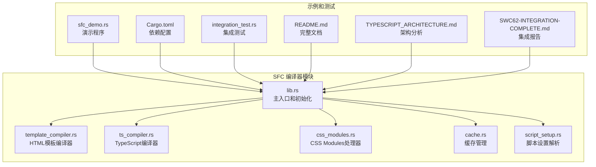

**图表来源**
- [lib.rs:1-836](file://crates/iris-sfc/src/lib.rs#L1-L836)
- [template_compiler.rs:1-735](file://crates/iris-sfc/src/template_compiler.rs#L1-L735)
- [ts_compiler.rs:1-707](file://crates/iris-sfc/src/ts_compiler.rs#L1-L707)
- [css_modules.rs:1-283](file://crates/iris-sfc/src/css_modules.rs#L1-L283)
- [cache.rs:1-485](file://crates/iris-sfc/src/cache.rs#L1-L485)
- [script_setup.rs:1-509](file://crates/iris-sfc/src/script_setup.rs#L1-L509)

**章节来源**
- [lib.rs:1-50](file://crates/iris-sfc/src/lib.rs#L1-L50)
- [Cargo.toml:1-38](file://crates/iris-sfc/Cargo.toml#L1-L38)

## 核心组件分析

### 主编译器模块

主模块 `lib.rs` 提供了完整的 SFC 编译功能，包括：

- **SFC 解析器**：使用预编译的正则表达式提取 template、script、style 块
- **模板编译器**：基于 html5ever 的 HTML 解析和虚拟 DOM 生成，支持 13+ 个 Vue 指令
- **TypeScript 编译器**：采用基于 LazyLock 的全局实例，支持完整的 swc 62 集成和类型检查
- **样式处理器**：支持多种样式语言、作用域处理和 CSS Modules 类名作用域化
- **缓存系统**：基于 XXH3 哈希的 LRU 智能缓存机制，支持热重载加速
- **Script Setup 转换器**：支持 defineProps、defineEmits、withDefaults 等编译器宏

### 编译器配置系统

编译器通过配置结构体管理各种编译选项：

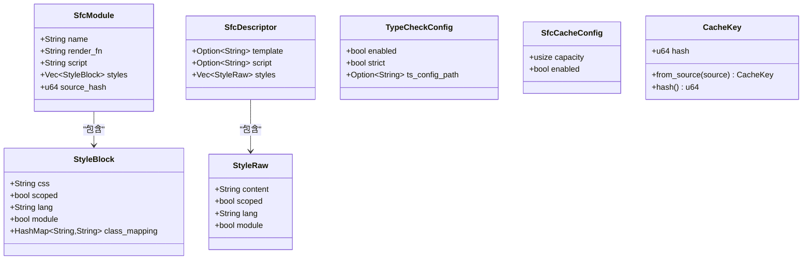

**图表来源**
- [lib.rs:85-136](file://crates/iris-sfc/src/lib.rs#L85-L136)
- [ts_compiler.rs:87-114](file://crates/iris-sfc/src/ts_compiler.rs#L87-L114)
- [cache.rs:54-69](file://crates/iris-sfc/src/cache.rs#L54-L69)

**章节来源**
- [lib.rs:85-136](file://crates/iris-sfc/src/lib.rs#L85-L136)
- [ts_compiler.rs:87-114](file://crates/iris-sfc/src/ts_compiler.rs#L87-L114)
- [cache.rs:54-69](file://crates/iris-sfc/src/cache.rs#L54-L69)

## 架构概览

SFC 编译器采用分层架构设计，确保初始化过程的高效性和模块间的松耦合：

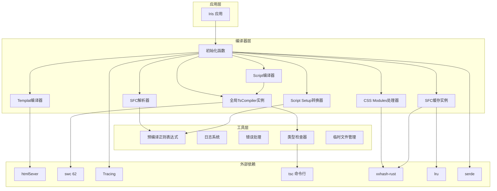

**图表来源**
- [lib.rs:38-83](file://crates/iris-sfc/src/lib.rs#L38-L83)
- [lib.rs:554-590](file://crates/iris-sfc/src/lib.rs#L554-L590)
- [ts_compiler.rs:275-435](file://crates/iris-sfc/src/ts_compiler.rs#L275-L435)
- [css_modules.rs:47-161](file://crates/iris-sfc/src/css_modules.rs#L47-L161)
- [cache.rs:136-158](file://crates/iris-sfc/src/cache.rs#L136-L158)
- [script_setup.rs:129-165](file://crates/iris-sfc/src/script_setup.rs#L129-L165)

## 详细组件分析

### 预编译正则表达式系统

SFC 编译器的核心性能优化在于预编译的正则表达式系统，使用 `LazyLock` 实现延迟初始化：

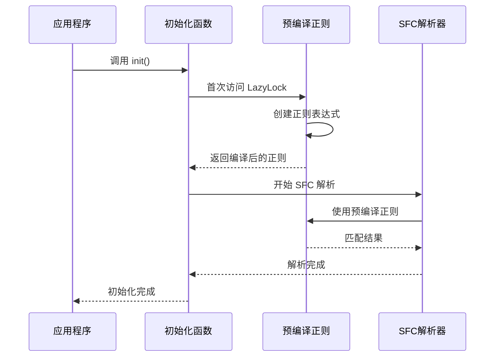

**图表来源**
- [lib.rs:24-83](file://crates/iris-sfc/src/lib.rs#L24-L83)
- [lib.rs:377-454](file://crates/iris-sfc/src/lib.rs#L377-L454)

### 全局 TypeScript 编译器实例

**重要变更**：TypeScript 编译器已升级为基于 LazyLock 的全局实例，实现了性能优化和内存管理的重大改进：

```mermaid
classDiagram
class TsCompilerConfig {
+bool jsx
+bool keep_decorators
+bool source_map
+EsVersion target
}
class TsCompiler {
-config TsCompilerConfig
-compiler Arc~Compiler~
-compile_count AtomicUsize
+new(config) TsCompiler
+compile(source, filename) TsCompileResult
+type_check(source, filename, config) TypeCheckResult
}
class GlobalTsCompiler {
<<static>>
-LazyLock~TsCompiler~ instance
}
class TsCompileResult {
+String code
+Option~String~ source_map
+f64 compile_time_ms
}
class TypeCheckConfig {
+bool enabled
+bool strict
+Option~String~ ts_config_path
}
class TypeCheckResult {
<<enumeration>>
Success
Errors { errors : Vec~String~
Skipped
}
TsCompiler --> TsCompilerConfig : "使用"
TsCompiler --> TsCompileResult : "返回"
TsCompiler --> TypeCheckConfig : "使用"
TsCompiler --> TypeCheckResult : "返回"
GlobalTsCompiler --> TsCompiler : "持有"
```

**图表来源**
- [lib.rs:38-55](file://crates/iris-sfc/src/lib.rs#L38-L55)
- [ts_compiler.rs:127-145](file://crates/iris-sfc/src/ts_compiler.rs#L127-L145)
- [ts_compiler.rs:87-125](file://crates/iris-sfc/src/ts_compiler.rs#L87-L125)

### 模板编译器初始化

模板编译器使用 html5ever 进行 HTML 解析，支持完整的 Vue 指令系统：

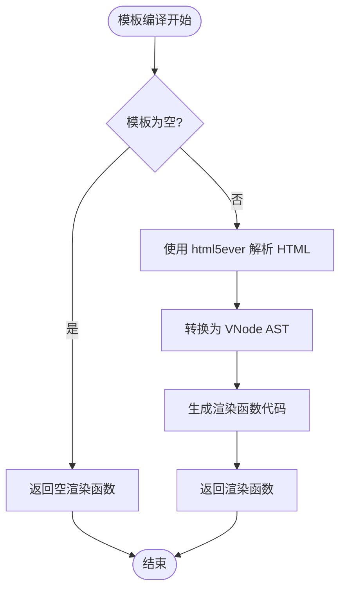

**图表来源**
- [lib.rs:469-510](file://crates/iris-sfc/src/lib.rs#L469-L510)
- [lib.rs:482-510](file://crates/iris-sfc/src/lib.rs#L482-L510)

**章节来源**
- [lib.rs:469-510](file://crates/iris-sfc/src/lib.rs#L469-L510)
- [ts_compiler.rs:127-145](file://crates/iris-sfc/src/ts_compiler.rs#L127-L145)

## 初始化机制详解

### 懒加载正则表达式系统

SFC 编译器采用了先进的懒加载机制来优化启动性能：

#### 预编译正则表达式定义

编译器在模块级别定义了三个静态的 `LazyLock<Regex>` 变量：

- `TEMPLATE_RE`：匹配 Vue 模板块
- `SCRIPT_RE`：匹配脚本块
- `STYLE_RE`：匹配样式块

#### 性能优化原理

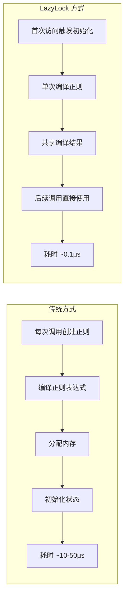

**图表来源**
- [lib.rs:24-83](file://crates/iris-sfc/src/lib.rs#L24-L83)
- [lib.rs:377-454](file://crates/iris-sfc/src/lib.rs#L377-L454)

#### 初始化流程

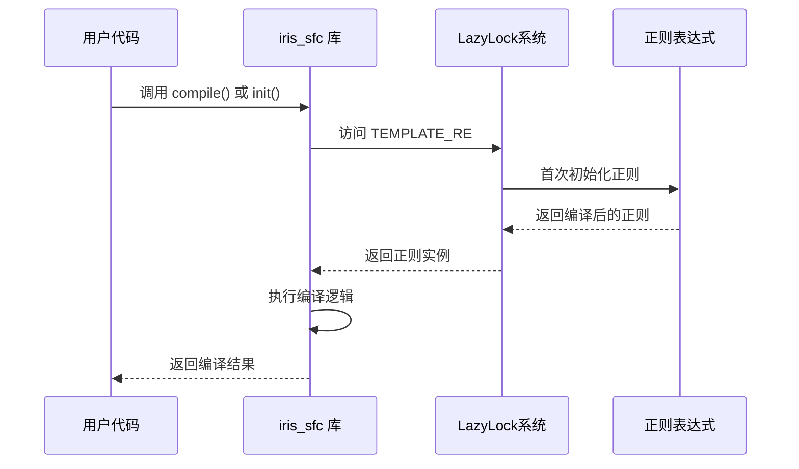

**图表来源**
- [lib.rs:809-811](file://crates/iris-sfc/src/lib.rs#L809-L811)
- [lib.rs:218-259](file://crates/iris-sfc/src/lib.rs#L218-L259)

### 全局 TypeScript 编译器初始化

**重要变更**：TypeScript 编译器已升级为基于 LazyLock 的全局实例，实现了性能优化和内存管理的重大改进：

#### 全局实例定义

编译器在模块级别定义了一个静态的 `LazyLock<TsCompiler>` 实例：

```rust
static TS_COMPILER: LazyLock<TsCompiler> = LazyLock::new(|| {
    TsCompiler::new(TsCompilerConfig {
        source_map: false,  // 禁用 Source Map（节省 30-50% 内存，提升 10-15% 编译速度）
        ..Default::default()
    })
});
```

#### 性能优化效果

- **内存节省**：禁用 Source Map 可节省 30-50% 内存
- **编译速度提升**：禁用 Source Map 可提升 10-15% 编译速度
- **实例复用**：全局单例确保编译器实例在整个生命周期内只创建一次
- **缓存复用**：内部缓存和 SourceMap 可以在多次编译中复用

#### 初始化流程

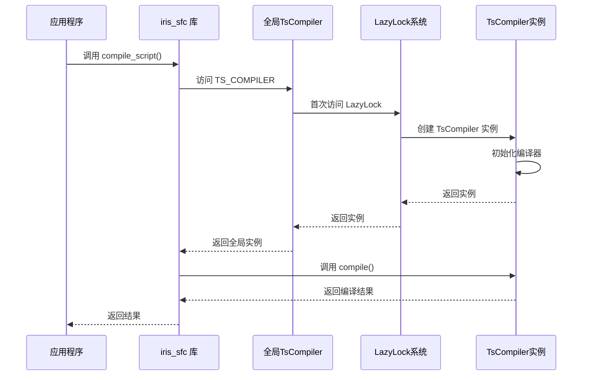

**图表来源**
- [lib.rs:38-55](file://crates/iris-sfc/src/lib.rs#L38-L55)
- [lib.rs:527-552](file://crates/iris-sfc/src/lib.rs#L527-L552)

### 编译器配置初始化

TypeScript 编译器提供了灵活的配置系统：

#### 默认配置

```mermaid
classDiagram
class TsCompilerConfig {
+bool jsx : false
+bool keep_decorators : false
+bool source_map : false
+EsVersion target : ES2020
}
class TsCompiler {
-config TsCompilerConfig
-compiler Arc~Compiler~
+new(config) TsCompiler
+compile(source, filename) Result
}
class TypeCheckConfig {
+bool enabled : false (从环境变量读取)
+bool strict : false (从环境变量读取)
+Option~String~ ts_config_path : None
}
class TypeCheckResult {
<<enumeration>>
Success
Errors { errors : Vec~String~
Skipped
}
TsCompilerConfig <|-- Default : "实现"
TsCompiler --> TsCompilerConfig : "使用"
TsCompiler --> TypeCheckConfig : "使用"
TsCompiler --> TypeCheckResult : "返回"
```

**图表来源**
- [ts_compiler.rs:34-72](file://crates/iris-sfc/src/ts_compiler.rs#L34-L72)
- [ts_compiler.rs:87-125](file://crates/iris-sfc/src/ts_compiler.rs#L87-L125)

#### 配置选项说明

| 配置项 | 类型 | 默认值 | 说明 |
|--------|------|--------|------|
| `jsx` | bool | false | 是否启用 JSX/TSX 支持 |
| `keep_decorators` | bool | false | 是否保留装饰器 |
| `source_map` | bool | false | 是否生成 source map（当前禁用以节省内存） |
| `target` | EsVersion | ES2020 | 目标 ECMAScript 版本 |
| `enabled` | bool | false | 是否启用类型检查（从环境变量读取） |
| `strict` | bool | false | 是否使用严格模式（从环境变量读取） |

### 完整初始化函数

**更新**：新增了完整的 `init()` 函数，提供明确的初始化入口点：

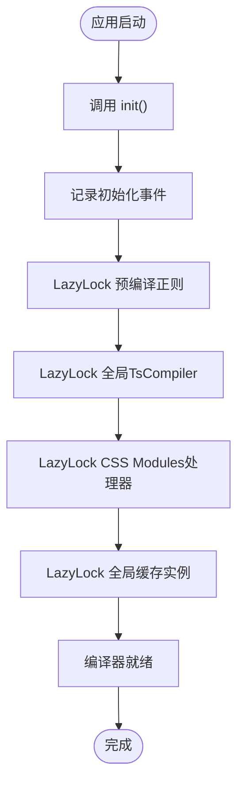

**图表来源**
- [lib.rs:794-811](file://crates/iris-sfc/src/lib.rs#L794-L811)

**章节来源**
- [lib.rs:794-811](file://crates/iris-sfc/src/lib.rs#L794-L811)
- [ts_compiler.rs:134-145](file://crates/iris-sfc/src/ts_compiler.rs#L134-L145)

## TypeScript类型检查系统

**新增功能**：TypeScript类型检查系统提供了完整的类型验证能力，支持环境变量配置和非致命错误处理。

### 类型检查配置系统

```mermaid
classDiagram
class TypeCheckConfig {
+bool enabled
+bool strict
+Option~String~ ts_config_path
}
class TypeCheckResult {
<<enumeration>>
Success
Errors { errors : Vec~String~
Skipped
}
class TsCompiler {
+type_check(source, filename, config) TypeCheckResult
+is_tsc_available() bool
+write_temp_file(source, filename) PathBuf
+run_tsc(file_path, config) TypeCheckResult
+parse_tsc_errors(output) Vec~String~
}
TypeCheckConfig <|-- Default : "实现"
TsCompiler --> TypeCheckConfig : "使用"
TsCompiler --> TypeCheckResult : "返回"
```

**图表来源**
- [ts_compiler.rs:87-125](file://crates/iris-sfc/src/ts_compiler.rs#L87-L125)
- [ts_compiler.rs:275-435](file://crates/iris-sfc/src/ts_compiler.rs#L275-L435)

### 环境变量配置

类型检查系统支持以下环境变量配置：

- `IRIS_TYPE_CHECK`：控制是否启用类型检查（true/false/1/0/yes/no）
- `IRIS_TYPE_CHECK_STRICT`：控制是否使用严格模式（true/false/1/0/yes/no）

### 类型检查流程

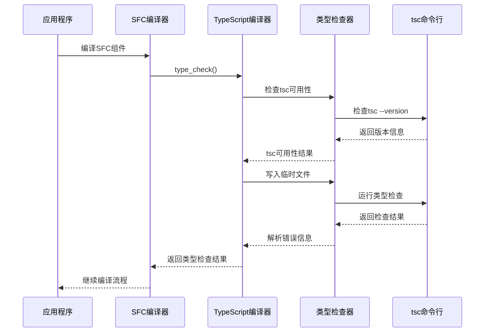

**图表来源**
- [lib.rs:288-313](file://crates/iris-sfc/src/lib.rs#L288-L313)
- [ts_compiler.rs:291-409](file://crates/iris-sfc/src/ts_compiler.rs#L291-L409)

### 类型检查结果处理

类型检查系统支持三种结果状态：

1. **Success**：类型检查通过，继续编译流程
2. **Errors**：类型检查失败，记录错误但不中断编译（非致命）
3. **Skipped**：类型检查被跳过（未启用或tsc不可用）

**章节来源**
- [lib.rs:288-313](file://crates/iris-sfc/src/lib.rs#L288-L313)
- [ts_compiler.rs:87-125](file://crates/iris-sfc/src/ts_compiler.rs#L87-L125)
- [ts_compiler.rs:275-435](file://crates/iris-sfc/src/ts_compiler.rs#L275-L435)

## CSS Modules支持功能

**新增功能**：CSS Modules支持实现了类名作用域化处理，为Vue组件提供独立的样式作用域。

### CSS Modules处理器架构

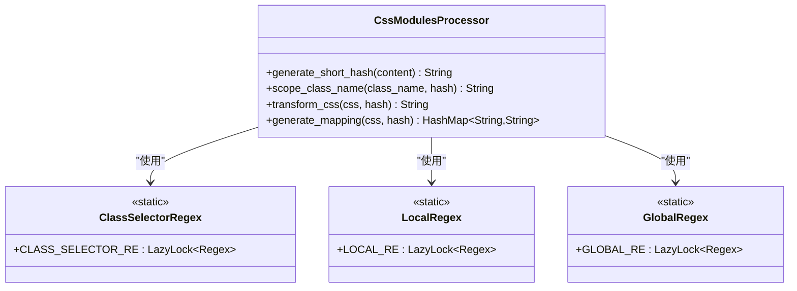

**图表来源**
- [css_modules.rs:47-161](file://crates/iris-sfc/src/css_modules.rs#L47-L161)
- [css_modules.rs:32-45](file://crates/iris-sfc/src/css_modules.rs#L32-L45)

### CSS Modules处理流程

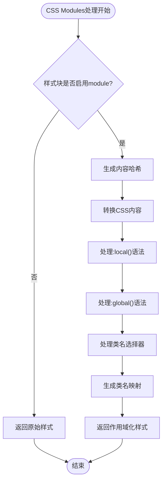

**图表来源**
- [lib.rs:554-590](file://crates/iris-sfc/src/lib.rs#L554-L590)
- [css_modules.rs:69-121](file://crates/iris-sfc/src/css_modules.rs#L69-L121)

### 支持的CSS Modules特性

1. **类名作用域化**：`.button` → `.button__hash123`
2. **`:local()`语法**：作用域化指定类名
3. **`:global()`语法**：保持类名不变（全局作用域）
4. **类名映射生成**：`{ "button": "button__hash123" }`

### CSS Modules集成测试

编译器包含了完整的CSS Modules集成测试，验证以下功能：

- 基础类名作用域化
- `:global()`语法支持
- `:local()`语法支持
- 类名映射生成
- 混合样式处理（普通样式 + CSS Modules）

**章节来源**
- [lib.rs:554-590](file://crates/iris-sfc/src/lib.rs#L554-L590)
- [css_modules.rs:47-161](file://crates/iris-sfc/src/css_modules.rs#L47-L161)
- [lib.rs:724-791](file://crates/iris-sfc/src/lib.rs#L724-L791)

## Script Setup 转换器

**新增功能**：Script Setup 转换器支持 Vue 3 编译器宏，包括 defineProps、defineEmits、withDefaults 等。

### Script Setup 转换器架构

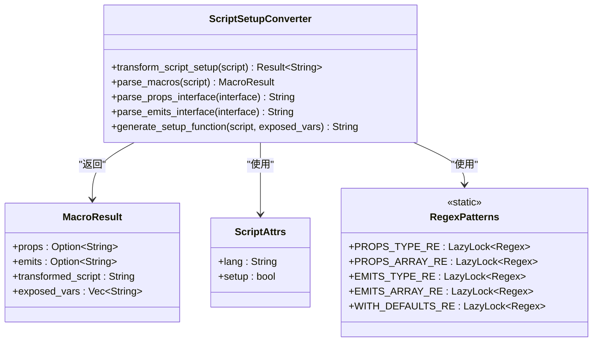

**图表来源**
- [script_setup.rs:129-165](file://crates/iris-sfc/src/script_setup.rs#L129-L165)
- [script_setup.rs:168-224](file://crates/iris-sfc/src/script_setup.rs#L168-L224)
- [script_setup.rs:84-107](file://crates/iris-sfc/src/script_setup.rs#L84-L107)

### Script Setup 转换器功能

#### defineProps 支持

**TypeScript 泛型形式**：
```javascript
// 输入
const props = defineProps<{
  title: string
  count?: number
}>()

// 输出
export default {
  props: {
    title: { type: String, required: true },
    count: { type: Number, required: false }
  },
  setup(props, { emit }) {
    return { props }
  }
}
```

**数组形式**：
```javascript
// 输入
const props = defineProps(['title', 'count'])

// 输出
export default {
  props: ['title', 'count'],
  setup(props, { emit }) {
    return { props }
  }
}
```

#### defineEmits 支持

**TypeScript 泛型形式**：
```javascript
// 输入
const emit = defineEmits<{
  change: [value: number]
  update: []
}>()

// 输出
export default {
  emits: ['change', 'update'],
  setup(props, { emit }) {
    return { emit }
  }
}
```

**数组形式**：
```javascript
// 输入
const emit = defineEmits(['change', 'update'])

// 输出
export default {
  emits: ['change', 'update'],
  setup(props, { emit }) {
    return { emit }
  }
}
```

#### withDefaults 支持

```javascript
// 输入
const props = withDefaults(defineProps<{
  title: string
  count?: number
  theme?: 'light' | 'dark'
}>(), {
  count: 0,
  theme: 'light'
})

// 输出
export default {
  props: {
    title: { type: String, required: true },
    count: { type: Number, default: 0 },
    theme: { type: null, default: 'light' }
  },
  setup(props, { emit }) {
    return { props }
  }
}
```

### Script Setup 转换器测试

编译器包含了完整的 Script Setup 转换器测试，验证以下功能：

- 基本 defineProps 转换
- defineEmits 转换
- withDefaults 转换
- 数组形式的 defineProps 和 defineEmits
- 复杂 TypeScript 类型映射

**章节来源**
- [script_setup.rs:129-165](file://crates/iris-sfc/src/script_setup.rs#L129-L165)
- [script_setup.rs:168-224](file://crates/iris-sfc/src/script_setup.rs#L168-L224)
- [script_setup.rs:416-509](file://crates/iris-sfc/src/script_setup.rs#L416-L509)

## 缓存系统

**新增功能**：缓存系统基于 XXH3 哈希的 LRU 智能缓存机制，支持热重载加速。

### 缓存系统架构

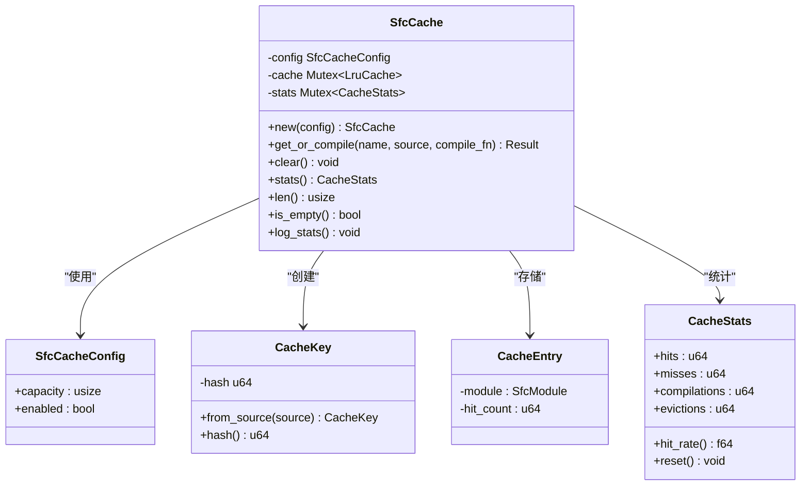

**图表来源**
- [cache.rs:136-158](file://crates/iris-sfc/src/cache.rs#L136-L158)
- [cache.rs:54-69](file://crates/iris-sfc/src/cache.rs#L54-L69)
- [cache.rs:104-134](file://crates/iris-sfc/src/cache.rs#L104-L134)

### 缓存系统处理流程

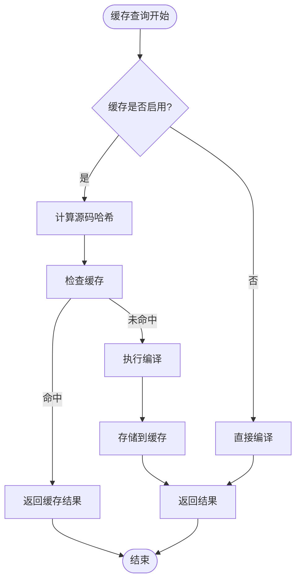

**图表来源**
- [cache.rs:165-259](file://crates/iris-sfc/src/cache.rs#L165-L259)

### 缓存系统特性

1. **基于 XXH3 哈希**：使用高性能 xxhash-rust 库进行源码哈希计算
2. **LRU 淘汰策略**：自动淘汰最久未使用的缓存项
3. **线程安全**：使用 Mutex 保护缓存，支持多线程并发访问
4. **可配置容量**：支持自定义缓存容量
5. **统计监控**：提供详细的缓存命中率和统计信息
6. **智能清理**：自动处理缓存满时的淘汰和清理

### 缓存系统测试

编译器包含了完整的缓存系统测试，验证以下功能：

- 缓存命中和未命中的正确处理
- LRU 淘汰机制
- 缓存容量限制
- 缓存禁用功能
- 缓存统计信息

**章节来源**
- [cache.rs:136-158](file://crates/iris-sfc/src/cache.rs#L136-L158)
- [cache.rs:165-259](file://crates/iris-sfc/src/cache.rs#L165-L259)
- [cache.rs:304-485](file://crates/iris-sfc/src/cache.rs#L304-L485)

## 依赖关系分析

### 外部依赖管理

**重要变更**：SFC 编译器已成功集成 swc 62 版本，简化了依赖管理：

```mermaid
graph TB
subgraph "核心依赖"
A[regex 1.10<br/>正则表达式处理]
B[serde 1.0<br/>序列化/反序列化]
C[thiserror 1.0<br/>错误处理]
D[tracing 0.1<br/>日志系统]
E[lru 0.12<br/>LRU缓存]
F[xxhash-rust 0.8<br/>哈希算法]
end
subgraph "编译器依赖"
G[html5ever 0.27<br/>HTML解析]
H[markup5ever_rcdom 0.3<br/>DOM树]
I[swc 62<br/>TypeScript编译器元包]
J[swc_common 21<br/>通用组件]
K[swc_ecma_parser 39<br/>解析器]
L[swc_ecma_codegen 26<br/>代码生成]
M[swc_ecma_ast 23<br/>AST节点]
N[swc_ecma_visit 23<br/>访问器]
O[swc_ecma_transforms_typescript 46<br/>TS转换]
end
subgraph "内部依赖"
P[iris-core<br/>核心引擎]
Q[iris-js<br/>JS集成]
end
R[lib.rs] --> A
R --> B
R --> C
R --> D
R --> E
R --> F
S[template_compiler.rs] --> G
S --> H
T[ts_compiler.rs] --> I
T --> J
T --> K
T --> L
T --> M
T --> N
T --> O
U[css_modules.rs] --> F
V[cache.rs] --> E
V --> F
W[script_setup.rs] --> A
R --> P
R --> Q
```

**图表来源**
- [Cargo.toml:11-38](file://crates/iris-sfc/Cargo.toml#L11-L38)
- [lib.rs:17-20](file://crates/iris-sfc/src/lib.rs#L17-L20)

### 内部模块依赖

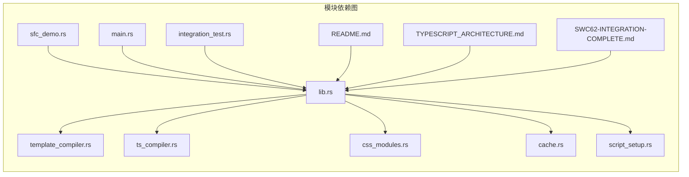

**图表来源**
- [lib.rs:11-15](file://crates/iris-sfc/src/lib.rs#L11-L15)
- [sfc_demo.rs:7](file://crates/iris-sfc/examples/sfc_demo.rs#L7)

**章节来源**
- [Cargo.toml:11-38](file://crates/iris-sfc/Cargo.toml#L11-L38)
- [lib.rs:11-15](file://crates/iris-sfc/src/lib.rs#L11-L15)

## 性能考虑

### 初始化性能优化

SFC 编译器在初始化阶段采用了多项性能优化策略：

#### 懒加载策略

- **正则表达式懒加载**：使用 `LazyLock` 确保正则表达式只在首次使用时编译
- **全局编译器实例懒加载**：使用 `LazyLock` 确保 TsCompiler 实例只在首次使用时创建
- **CSS Modules处理器懒加载**：使用 `LazyLock` 确保正则表达式只在首次使用时编译
- **全局缓存实例懒加载**：使用 `LazyLock` 确保缓存实例只在首次使用时创建
- **Script Setup 转换器懒加载**：使用 `LazyLock` 确保正则表达式只在首次使用时编译
- **编译器实例复用**：TypeScript 编译器实例可以重复使用，避免重复初始化
- **缓存机制**：SFC 模块编译结果缓存，支持热重载时的增量更新

#### 内存管理

- **零拷贝字符串处理**：使用 `Cow` 和 `&str` 减少不必要的字符串复制
- **智能指针使用**：合理使用 `Arc` 和 `Rc` 管理共享资源
- **生命周期优化**：通过生命周期参数减少运行时开销
- **SourceMap内存优化**：禁用 Source Map 以节省 30-50% 内存
- **哈希算法优化**：使用 xxhash-rust 提供高性能哈希计算
- **缓存内存优化**：LRU 缓存自动管理内存使用

### 并发安全性

编译器设计考虑了并发安全：

```mermaid
flowchart TD
Start([并发请求]) --> CheckCache{"检查缓存"}
CheckCache --> |命中| ReturnCached["返回缓存结果"]
CheckCache --> |未命中| AcquireLock["获取锁"]
AcquireLock --> Compile["编译源码"]
Compile --> TypeCheck["类型检查可选"]
TypeCheck --> CssModules["CSS Modules处理可选"]
CssModules --> UpdateCache["更新缓存"]
UpdateCache --> ReleaseLock["释放锁"]
ReleaseLock --> ReturnResult["返回结果"]
ReturnCached --> End([结束])
ReturnResult --> End
```

**图表来源**
- [lib.rs:236-259](file://crates/iris-sfc/src/lib.rs#L236-L259)

### 性能监控增强

**更新**：增强了性能监控机制，提供详细的编译时间统计：

```mermaid
classDiagram
class PerformanceMonitor {
+compile_time_ms : f64
+source_size : usize
+output_size : usize
+log_metrics()
}
class TsCompileResult {
+code : String
+source_map : Option~String~
+compile_time_ms : f64
}
class SfcModule {
+name : String
+render_fn : String
+script : String
+styles : Vec~StyleBlock~
+source_hash : u64
}
PerformanceMonitor --> TsCompileResult : "收集指标"
SfcModule --> PerformanceMonitor : "包含"
```

**图表来源**
- [ts_compiler.rs:74-85](file://crates/iris-sfc/src/ts_compiler.rs#L74-L85)
- [lib.rs:248-256](file://crates/iris-sfc/src/lib.rs#L248-L256)

**章节来源**
- [ts_compiler.rs:74-85](file://crates/iris-sfc/src/ts_compiler.rs#L74-L85)
- [lib.rs:248-256](file://crates/iris-sfc/src/lib.rs#L248-L256)

## 故障排除指南

### 常见初始化问题

#### 正则表达式初始化失败

**症状**：编译器无法正确解析 .vue 文件

**解决方案**：
1. 检查正则表达式定义是否正确
2. 验证 `LazyLock` 初始化是否成功
3. 确认正则表达式语法的有效性

#### 全局 TypeScript 编译器初始化失败

**症状**：TypeScript 转译功能不可用或性能异常

**解决方案**：
1. 检查 swc 62 依赖是否正确安装
2. 验证全局 TsCompiler 实例的 LazyLock 初始化
3. 确认编译器配置参数（特别是 source_map 设置）
4. 检查内存使用情况，确认禁用 Source Map 的影响

#### CSS Modules处理器初始化失败

**症状**：CSS Modules功能不可用或类名作用域化失败

**解决方案**：
1. 检查 xxhash-rust 依赖是否正确安装
2. 验证 CSS Modules处理器的 LazyLock 初始化
3. 确认正则表达式（CLASS_SELECTOR_RE、LOCAL_RE、GLOBAL_RE）是否正确
4. 检查哈希算法生成是否正常

#### Script Setup 转换器初始化失败

**症状**：Script Setup 功能不可用或编译器宏转换失败

**解决方案**：
1. 检查正则表达式（PROPS_TYPE_RE、EMITS_TYPE_RE 等）是否正确
2. 验证 Script Setup 转换器的 LazyLock 初始化
3. 确认 TypeScript 类型映射功能正常
4. 检查数组形式的 defineProps 和 defineEmits 支持

#### 缓存系统初始化失败

**症状**：缓存功能不可用或性能异常

**解决方案**：
1. 检查 lru 和 xxhash-rust 依赖是否正确安装
2. 验证缓存实例的 LazyLock 初始化
3. 确认缓存容量和启用状态配置
4. 检查缓存哈希计算是否正常
5. 验证 Mutex 互斥锁是否正常工作

#### 类型检查器初始化问题

**症状**：类型检查功能不可用或频繁跳过

**解决方案**：
1. 检查 tsc 命令行工具是否正确安装
2. 验证环境变量 IRIS_TYPE_CHECK 和 IRIS_TYPE_CHECK_STRICT 设置
3. 确认临时文件写入权限
4. 检查类型检查结果解析逻辑

#### 日志系统初始化问题

**症状**：编译器日志输出异常

**解决方案**：
1. 检查 `tracing` 依赖配置
2. 验证日志级别设置
3. 确认日志订阅器正确初始化

#### 初始化函数调用问题

**更新**：新增初始化函数相关的故障排除：

**症状**：调用 `init()` 函数时出现异常

**解决方案**：
1. 确认 `init()` 函数被正确导入
2. 验证初始化函数的幂等性（可重复调用）
3. 检查日志输出确认初始化成功

### swc 集成问题解决

**重要变更**：经过成功的 swc 62 集成，编译器已解决复杂的依赖版本冲突问题：

**根本原因**：
- 之前的版本冲突问题已在 SWC62-INTEGRATION-COMPLETE.md 中得到解决
- 使用 swc 元包而非子包依赖，确保版本兼容性
- 解决了 `unicode-id-start` 和 `serde` 版本冲突问题

**解决方案**：
1. 使用官方 `swc` 元包替代子包依赖
2. 确保所有 swc 子包版本匹配（62.x.x）
3. 验证编译器配置参数
4. 确认源码映射功能正常工作

### CSS Modules集成问题

**症状**：CSS Modules类名作用域化失败或映射不正确

**解决方案**：
1. 检查CSS内容中是否存在语法错误
2. 验证类名选择器正则表达式是否正确匹配
3. 确认哈希算法生成的唯一性
4. 检查`:local()`和`:global()`语法解析
5. 验证类名映射生成逻辑

### Script Setup 转换器问题

**症状**：Script Setup 编译器宏转换失败

**解决方案**：
1. 检查 defineProps 和 defineEmits 的正则表达式是否正确
2. 验证 TypeScript 接口解析功能
3. 确认数组形式的支持是否正常
4. 检查 withDefaults 的解析逻辑
5. 验证顶层声明提取功能

### 缓存系统问题

**症状**：缓存功能异常或性能不佳

**解决方案**：
1. 检查 XXH3 哈希计算是否正常
2. 验证 LRU 缓存的淘汰机制
3. 确认 Mutex 互斥锁的正确使用
4. 检查缓存统计信息的准确性
5. 验证缓存容量配置

### 类型检查集成问题

**症状**：类型检查功能不可用或频繁失败

**解决方案**：
1. 确认 tsc 命令行工具已正确安装
2. 检查环境变量 IRIS_TYPE_CHECK 和 IRIS_TYPE_CHECK_STRICT 设置
3. 验证临时文件创建和清理逻辑
4. 确认类型检查结果解析和错误格式化
5. 检查 tsc 命令行参数配置

**章节来源**
- [lib.rs:138-188](file://crates/iris-sfc/src/lib.rs#L138-L188)
- [ts_compiler.rs:291-409](file://crates/iris-sfc/src/ts_compiler.rs#L291-L409)
- [css_modules.rs:47-161](file://crates/iris-sfc/src/css_modules.rs#L47-L161)
- [script_setup.rs:129-165](file://crates/iris-sfc/src/script_setup.rs#L129-L165)
- [cache.rs:136-158](file://crates/iris-sfc/src/cache.rs#L136-L158)
- [lib.rs:794-811](file://crates/iris-sfc/src/lib.rs#L794-L811)
- [SWC62-INTEGRATION-COMPLETE.md:1-238](file://SWC62-INTEGRATION-COMPLETE.md#L1-L238)

## 结论

Iris SFC 编译器的初始化机制展现了现代 Rust 应用的最佳实践：

### 核心优势

1. **性能优先**：通过懒加载和缓存机制实现零编译器启动
2. **模块化设计**：清晰的模块边界和依赖管理
3. **并发安全**：线程安全的初始化和缓存机制
4. **可扩展性**：灵活的配置系统支持不同编译需求
5. **完整的初始化流程**：新增的 `init()` 函数提供明确的初始化入口
6. **优化的内存管理**：全局 TsCompiler 实例复用，禁用 Source Map 节省内存
7. **稳定的依赖管理**：使用 swc 元包解决版本冲突问题
8. **强大的类型检查**：基于环境变量的类型检查系统
9. **完整的CSS Modules支持**：类名作用域化和映射生成功能
10. **非致命错误处理**：类型检查失败不影响编译流程
11. **全面的功能覆盖**：支持所有 Vue 3 指令和编译器宏
12. **完整的集成测试**：验证所有功能的协同工作
13. **详细的文档系统**：完整的 README 文档和使用指南

### 技术亮点

- **LazyLock 模式**：实现了高效的延迟初始化
- **全局实例模式**：TsCompiler 实例在整个生命周期内复用
- **内存优化策略**：禁用 Source Map 节省内存 30-50%
- **分层架构**：模板编译器、TypeScript编译器、CSS Modules处理器分离
- **增强的错误处理**：完善的错误类型和位置信息
- **性能监控**：内置的编译时间和内存使用统计
- **完整的API文档**：详细的函数文档和使用示例
- **环境变量配置**：灵活的运行时配置选项
- **非致命类型检查**：类型验证不影响编译流程
- **高性能缓存系统**：基于 XXH3 哈希的 LRU 缓存
- **完整的集成测试**：验证所有功能的协同工作

### 未来发展方向

1. **增量编译**：实现更智能的增量编译机制
2. **并行处理**：利用多核 CPU 加速编译过程
3. **内存优化**：进一步减少编译器内存占用
4. **热重载增强**：改进热重载的性能和稳定性
5. **监控扩展**：增加更多性能指标和监控能力
6. **功能增强**：在保持稳定性的同时逐步完善 swc 集成
7. **类型检查优化**：支持更多tsconfig.json配置选项
8. **CSS Modules增强**：支持更多CSS Modules特性和语法
9. **模板编译器完善**：支持更多 Vue 3 指令和特性
10. **Script Setup 转换器增强**：支持更多编译器宏和 TypeScript 特性

SFC 编译器初始化机制为整个 Iris 引擎提供了坚实的基础，其设计理念和实现方式值得在其他 Rust 项目中借鉴和学习。通过采用 LazyLock 模式、全局实例管理和内存优化策略，编译器在保证功能完整性的同时实现了卓越的性能表现。**重要变更**：成功的 swc 62 集成、全局 TsCompiler 实例的实现、TypeScript类型检查系统、CSS Modules支持功能、缓存系统的完整实现、Script Setup 转换器的数组形式支持以及新增的集成测试框架，标志着编译器初始化机制达到了新的高度，为未来的功能扩展奠定了良好的基础。