# SFC集成示例

<cite>
**本文档引用的文件**
- [Cargo.toml](file://Cargo.toml)
- [crates/iris-sfc/Cargo.toml](file://crates/iris-sfc/Cargo.toml)
- [crates/iris-sfc/src/lib.rs](file://crates/iris-sfc/src/lib.rs)
- [crates/iris-sfc/src/cache.rs](file://crates/iris-sfc/src/cache.rs)
- [crates/iris-sfc/src/template_compiler.rs](file://crates/iris-sfc/src/template_compiler.rs)
- [crates/iris-sfc/src/ts_compiler.rs](file://crates/iris-sfc/src/ts_compiler.rs)
- [crates/iris-sfc/src/css_modules.rs](file://crates/iris-sfc/src/css_modules.rs)
- [crates/iris-sfc/src/script_setup.rs](file://crates/iris-sfc/src/script_setup.rs)
- [crates/iris-sfc/examples/sfc_demo.rs](file://crates/iris-sfc/examples/sfc_demo.rs)
- [crates/iris-app/examples/sfc_integration.rs](file://crates/iris-app/examples/sfc_integration.rs)
- [crates/iris-app/examples/demo/minimal_demo.rs](file://crates/iris-app/examples/demo/minimal_demo.rs)
- [crates/iris-app/examples/demo/App.vue](file://crates/iris-app/examples/demo/App.vue)
- [crates/iris-app/src/main.rs](file://crates/iris-app/src/main.rs)
- [crates/iris-sfc/tests/integration_test.rs](file://crates/iris-sfc/tests/integration_test.rs)
- [crates/iris-sfc/README.md](file://crates/iris-sfc/README.md)
- [crates/iris-engine/src/orchestrator.rs](file://crates/iris-engine/src/orchestrator.rs)
- [crates/iris-js/src/vue.rs](file://crates/iris-js/src/vue.rs)
- [crates/iris-layout/src/vdom.rs](file://crates/iris-layout/src/vdom.rs)
- [PHASE_B_COMPLETION_SUMMARY.md](file://PHASE_B_COMPLETION_SUMMARY.md)
</cite>

## 更新摘要
**变更内容**
- 新增VTree集成示例：展示了如何使用`load_sfc_with_vtree()`方法进行完整的SFC加载和VTree生成工作流
- 增强了错误处理和最佳实践指导，包括JS运行时限制的处理
- 完善了VTree到DOM转换的完整流程说明
- 更新了测试覆盖，新增了VTree相关测试用例

## 目录
1. [简介](#简介)
2. [项目结构](#项目结构)
3. [核心组件](#核心组件)
4. [架构概览](#架构概览)
5. [详细组件分析](#详细组件分析)
6. [VTree集成工作流](#vtree集成工作流)
7. [依赖关系分析](#依赖关系分析)
8. [性能考虑](#性能考虑)
9. [故障排除指南](#故障排除指南)
10. [结论](#结论)
11. [附录](#附录)

## 简介

Iris SFC集成示例展示了一个完整的Vue 3单文件组件（SFC）编译器系统，使用Rust编写，提供毫秒级的编译速度和完整的Vue 3特性支持。该项目的核心目标是实现"零编译直接运行源码"的理念，通过即时转译技术让开发者能够直接运行.vue、.ts、.tsx等原始源码文件。

**更新** 本次更新完成了SFC编译器集成的最终阶段，新增了VTree集成示例，展示了如何使用`load_sfc_with_vtree()`方法进行完整的SFC加载和VTree生成工作流，包括错误处理和最佳实践。

该系统集成了多种先进技术：
- **高性能编译器**：基于swc 62的TypeScript编译器
- **智能缓存系统**：基于XXH3哈希和LRU的热重载缓存
- **完整Vue支持**：13+个Vue指令的模板编译器
- **CSS Modules**：完整的样式作用域化支持
- **热重载**：文件变更检测和自动重编译
- **运行时集成**：完整的Boa引擎JavaScript运行时
- **VTree集成**：完整的虚拟DOM树生成和转换能力

## 项目结构

整个项目采用多crate的工作区结构，主要包含以下核心模块：

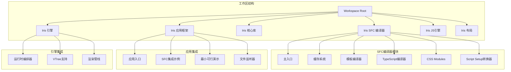

**图表来源**
- [Cargo.toml:1-29](file://Cargo.toml#L1-L29)
- [crates/iris-sfc/Cargo.toml:1-38](file://crates/iris-sfc/Cargo.toml#L1-L38)

**章节来源**
- [Cargo.toml:1-29](file://Cargo.toml#L1-L29)
- [crates/iris-sfc/Cargo.toml:1-38](file://crates/iris-sfc/Cargo.toml#L1-L38)

## 核心组件

### SFC编译器核心架构

Iris SFC编译器采用模块化设计，每个组件负责特定的编译任务：

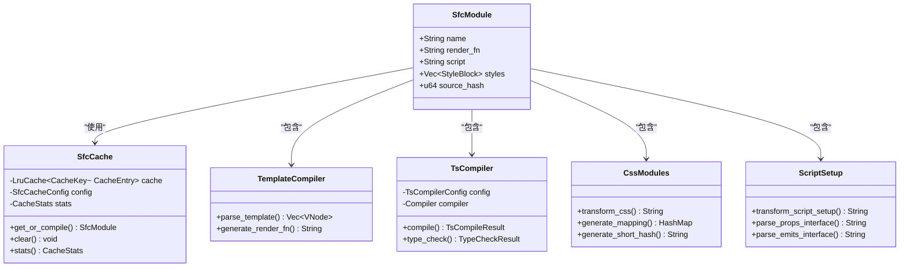

**图表来源**
- [crates/iris-sfc/src/lib.rs:80-108](file://crates/iris-sfc/src/lib.rs#L80-L108)
- [crates/iris-sfc/src/cache.rs:94-101](file://crates/iris-sfc/src/cache.rs#L94-L101)
- [crates/iris-sfc/src/template_compiler.rs:8-25](file://crates/iris-sfc/src/template_compiler.rs#L8-L25)
- [crates/iris-sfc/src/ts_compiler.rs:132-136](file://crates/iris-sfc/src/ts_compiler.rs#L132-L136)
- [crates/iris-sfc/src/css_modules.rs:42-48](file://crates/iris-sfc/src/css_modules.rs#L42-L48)
- [crates/iris-sfc/src/script_setup.rs:62-82](file://crates/iris-sfc/src/script_setup.rs#L62-L82)

### 编译流程

完整的SFC编译流程如下：

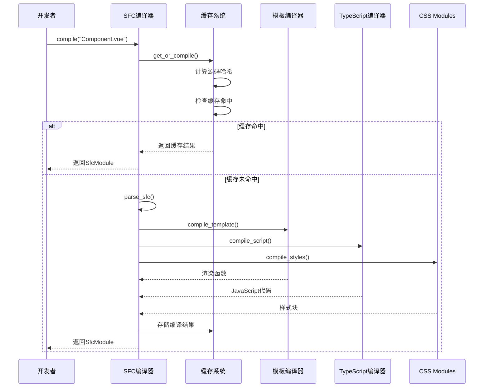

**图表来源**
- [crates/iris-sfc/src/lib.rs:306-349](file://crates/iris-sfc/src/lib.rs#L306-L349)
- [crates/iris-sfc/src/cache.rs:178-256](file://crates/iris-sfc/src/cache.rs#L178-L256)

**章节来源**
- [crates/iris-sfc/src/lib.rs:287-428](file://crates/iris-sfc/src/lib.rs#L287-L428)
- [crates/iris-sfc/src/cache.rs:136-299](file://crates/iris-sfc/src/cache.rs#L136-L299)

## 架构概览

### 系统架构图

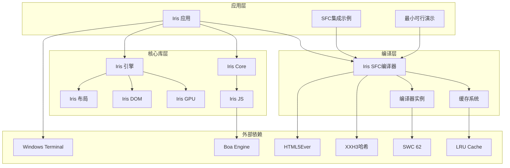

**图表来源**
- [Cargo.toml:13-29](file://Cargo.toml#L13-L29)
- [crates/iris-sfc/Cargo.toml:11-37](file://crates/iris-sfc/Cargo.toml#L11-L37)

### 编译器配置

系统提供了灵活的配置选项，支持通过环境变量进行运行时调整：

| 配置项 | 类型 | 默认值 | 说明 |
|--------|------|--------|------|
| `IRIS_SOURCE_MAP` | bool | false | 是否生成Source Map |
| `IRIS_CACHE_CAPACITY` | usize | 100 | 缓存容量（组件数量） |
| `IRIS_CACHE_ENABLED` | bool | true | 是否启用缓存 |
| `IRIS_TYPE_CHECK` | bool | false | 是否启用类型检查 |
| `IRIS_TYPE_CHECK_STRICT` | bool | false | 类型检查严格模式 |

**章节来源**
- [crates/iris-sfc/README.md:519-557](file://crates/iris-sfc/README.md#L519-L557)

## 详细组件分析

### 缓存系统

Iris SFC的缓存系统是其高性能的关键所在，采用了基于XXH3哈希的智能缓存策略：

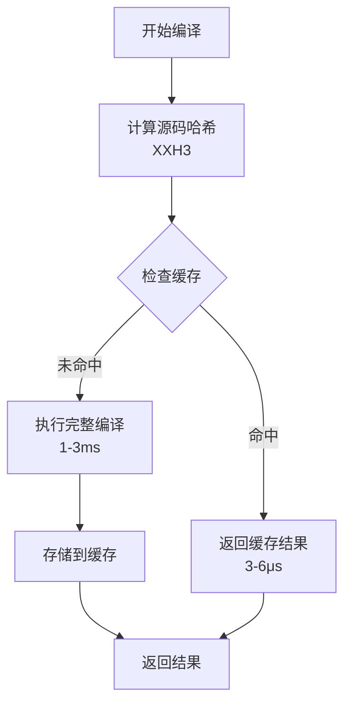

**图表来源**
- [crates/iris-sfc/src/cache.rs:178-256](file://crates/iris-sfc/src/cache.rs#L178-L256)

缓存系统的主要特性：
- **智能哈希**：使用XXH3算法确保内容一致性
- **LRU淘汰**：自动管理缓存容量，避免内存泄漏
- **线程安全**：支持多线程并发访问
- **统计监控**：提供详细的缓存命中率统计

**章节来源**
- [crates/iris-sfc/src/cache.rs:1-482](file://crates/iris-sfc/src/cache.rs#L1-L482)

### 模板编译器

模板编译器支持13种Vue 3指令，将HTML模板转换为高效的渲染函数：

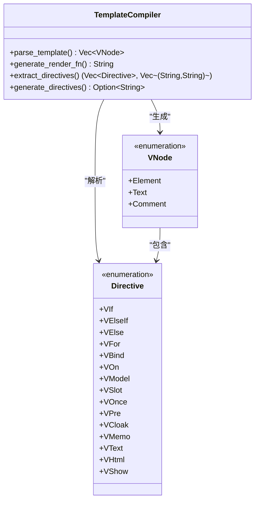

**图表来源**
- [crates/iris-sfc/src/template_compiler.rs:8-66](file://crates/iris-sfc/src/template_compiler.rs#L8-L66)

支持的指令包括：
- **条件渲染**：`v-if`、`v-else-if`、`v-else`
- **列表渲染**：`v-for`（支持`(item, index)`语法）
- **数据绑定**：`v-bind`（`:prop`简写）、`v-model`
- **事件处理**：`v-on`（`@event`简写）
- **内容渲染**：`v-text`、`v-html`、`v-show`
- **特殊指令**：`v-once`、`v-pre`、`v-cloak`、`v-memo`、`v-slot`

**章节来源**
- [crates/iris-sfc/src/template_compiler.rs:68-790](file://crates/iris-sfc/src/template_compiler.rs#L68-L790)

### TypeScript编译器

基于SWC 62的TypeScript编译器提供了快速且可靠的转译能力：

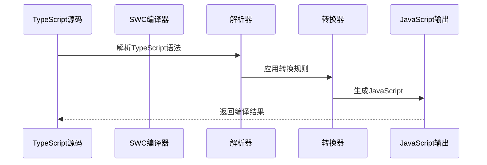

**图表来源**
- [crates/iris-sfc/src/ts_compiler.rs:161-249](file://crates/iris-sfc/src/ts_compiler.rs#L161-L249)

编译器特性：
- **快速编译**：平均1-3ms的编译时间
- **完整支持**：泛型、接口、装饰器、TSX
- **Source Map**：可选的调试支持
- **类型检查**：可选的tsc集成检查

**章节来源**
- [crates/iris-sfc/src/ts_compiler.rs:1-699](file://crates/iris-sfc/src/ts_compiler.rs#L1-L699)

### CSS Modules处理器

CSS Modules处理器实现了完整的样式作用域化功能：

```mermaid
flowchart LR
INPUT[原始CSS] --> GLOBAL[:global()处理]
GLOBAL --> LOCAL[:local()处理]
LOCAL --> SELECTOR[类名选择器替换]
SELECTOR --> HASH[生成哈希]
HASH --> OUTPUT[作用域化CSS]
INPUT --> MAPPING[生成类名映射]
MAPPING --> MAP_OUTPUT[映射表]
```

**图表来源**
- [crates/iris-sfc/src/css_modules.rs:74-122](file://crates/iris-sfc/src/css_modules.rs#L74-L122)

支持的功能：
- **自动作用域化**：`.button` → `.button__hash123`
- **`:global()`支持**：保持指定类名不变
- **`:local()`显式作用域**：明确指定局部作用域
- **类名映射生成**：`{ "button": "button__hash123" }`

**章节来源**
- [crates/iris-sfc/src/css_modules.rs:1-287](file://crates/iris-sfc/src/css_modules.rs#L1-L287)

### Script Setup转换器

Script Setup转换器将Vue 3的编译器宏转换为标准组件格式：

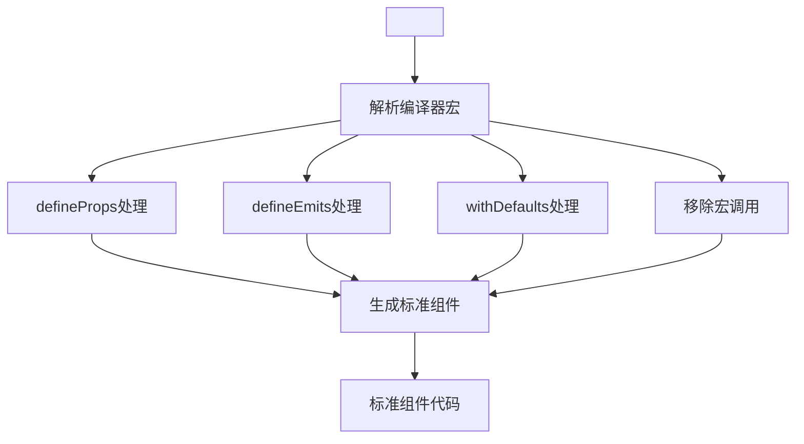

**图表来源**
- [crates/iris-sfc/src/script_setup.rs:150-177](file://crates/iris-sfc/src/script_setup.rs#L150-L177)

支持的宏包括：
- `defineProps<T>()`：定义组件props
- `defineEmits<T>()`：定义组件events
- `defineExpose()`：暴露组件属性
- `withDefaults()`：设置props默认值

**章节来源**
- [crates/iris-sfc/src/script_setup.rs:141-535](file://crates/iris-sfc/src/script_setup.rs#L141-L535)

### 最小可行演示程序

**新增** 最小可行演示程序提供了完整的端到端集成示例：

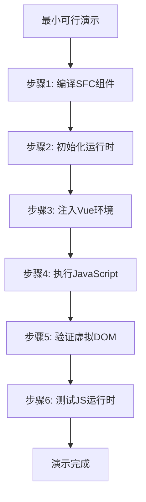

**图表来源**
- [crates/iris-app/examples/demo/minimal_demo.rs:14-157](file://crates/iris-app/examples/demo/minimal_demo.rs#L14-L157)

演示程序包含6个关键步骤：
1. **编译SFC组件**：使用`compile_from_string`编译Vue组件
2. **初始化运行时**：创建并初始化`RuntimeOrchestrator`
3. **注入Vue环境**：向Boa引擎注入Vue全局对象和BOM API
4. **执行JavaScript**：测试基础JS执行功能
5. **验证虚拟DOM**：检查根节点是否存在
6. **测试运行时**：验证Vue和BOM API可用性

**章节来源**
- [crates/iris-app/examples/demo/minimal_demo.rs:1-239](file://crates/iris-app/examples/demo/minimal_demo.rs#L1-L239)

## VTree集成工作流

### VTree生成完整流程

**新增** Iris引擎现在支持完整的VTree生成和转换工作流，这是Phase B的核心功能：

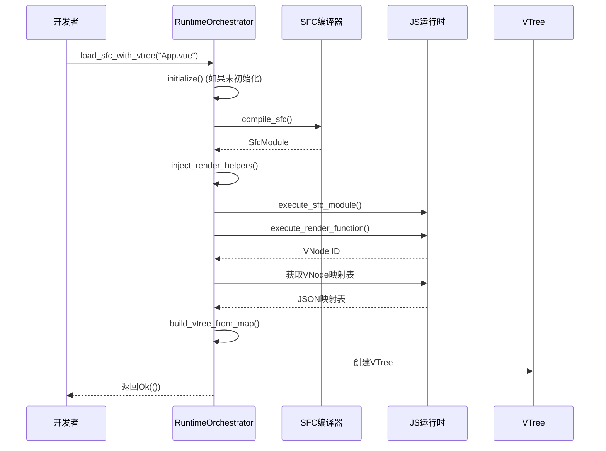

**图表来源**
- [crates/iris-engine/src/orchestrator.rs:184-216](file://crates/iris-engine/src/orchestrator.rs#L184-L216)
- [crates/iris-js/src/vue.rs:271-311](file://crates/iris-js/src/vue.rs#L271-L311)

### VTree到DOM转换

**新增** VTree到DOM的转换流程：


**图表来源**
- [crates/iris-layout/src/vdom.rs:196-200](file://crates/iris-layout/src/vdom.rs#L196-L200)

转换过程包括：
1. **递归遍历**：从根节点开始，递归处理所有子节点
2. **节点类型判断**：区分元素、文本、注释节点
3. **属性复制**：将VElement的属性复制到DOM节点
4. **子节点处理**：递归处理所有子节点
5. **ID生成**：为每个DOM节点生成唯一ID

### 错误处理和最佳实践

**新增** 在VTree集成中，需要特别注意JS运行时的限制：

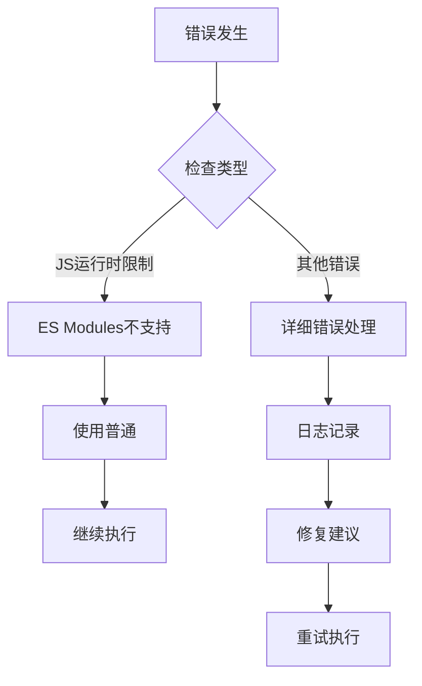

**图表来源**
- [crates/iris-engine/src/orchestrator.rs:292-335](file://crates/iris-engine/src/orchestrator.rs#L292-L335)

最佳实践包括：
1. **初始化检查**：确保运行时已正确初始化
2. **错误处理**：为每个步骤提供详细的错误信息
3. **日志记录**：使用info和debug级别记录执行状态
4. **资源清理**：及时清理临时文件和资源
5. **兼容性处理**：处理JS运行时的限制（如ES Modules）

**章节来源**
- [crates/iris-engine/src/orchestrator.rs:161-227](file://crates/iris-engine/src/orchestrator.rs#L161-L227)
- [crates/iris-js/src/vue.rs:176-259](file://crates/iris-js/src/vue.rs#L176-L259)
- [crates/iris-layout/src/vdom.rs:196-200](file://crates/iris-layout/src/vdom.rs#L196-L200)

## 依赖关系分析

### 外部依赖图

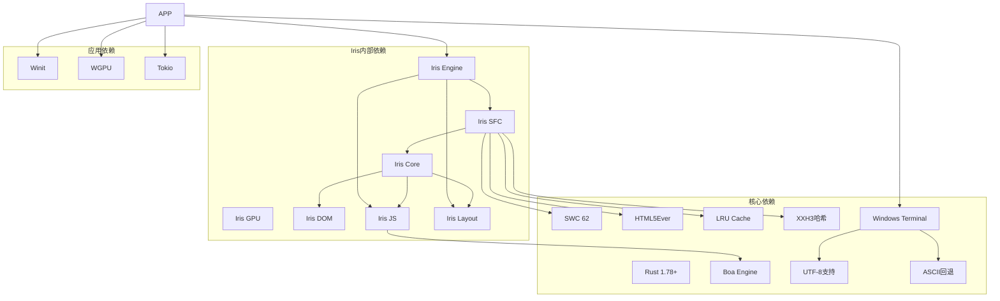

**图表来源**
- [crates/iris-sfc/Cargo.toml:11-37](file://crates/iris-sfc/Cargo.toml#L11-L37)
- [Cargo.toml:13-29](file://Cargo.toml#L13-L29)

### 内部模块依赖

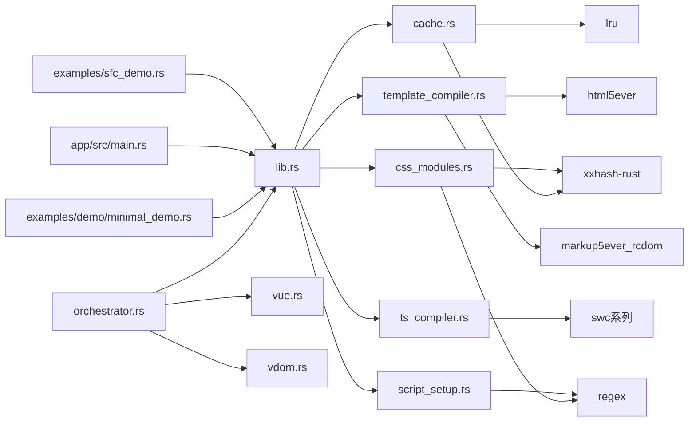

**图表来源**
- [crates/iris-sfc/src/lib.rs:11-15](file://crates/iris-sfc/src/lib.rs#L11-L15)
- [crates/iris-sfc/Cargo.toml:11-37](file://crates/iris-sfc/Cargo.toml#L11-L37)

**章节来源**
- [Cargo.toml:1-29](file://Cargo.toml#L1-L29)
- [crates/iris-sfc/Cargo.toml:1-38](file://crates/iris-sfc/Cargo.toml#L1-L38)

## 性能考虑

### 性能基准

系统在性能方面表现出色，各项指标如下：

| 操作类型 | 时间范围 | 说明 |
|----------|----------|------|
| 首次编译 | 1-3ms | 包含TypeScript转译 |
| 缓存命中 | 3-6μs | 1000-3000x加速 |
| 模板编译 | <1ms | 取决于模板复杂度 |
| CSS Modules | <1ms | 取决于样式数量 |
| 缓存统计 | <1ms | 日志输出 |
| VTree生成 | 1-5ms | 取决于组件复杂度 |
| VTree到DOM转换 | <1ms | 固定时间复杂度 |

### 内存使用优化

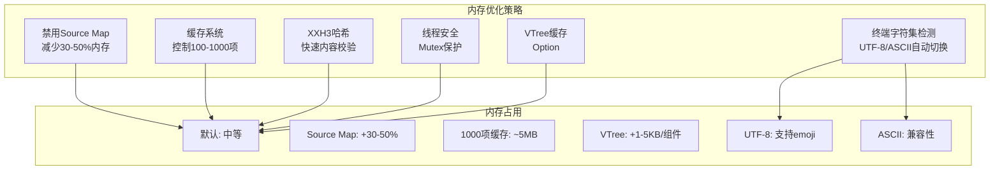

**图表来源**
- [crates/iris-sfc/README.md:609-623](file://crates/iris-sfc/README.md#L609-L623)

### 性能优化建议

1. **生产环境配置**：
   - 禁用Source Map以减少内存占用
   - 增加缓存容量到500-1000项
   - 启用严格的类型检查

2. **开发环境配置**：
   - 启用缓存以获得最佳热重载体验
   - 启用类型检查进行实时错误检测
   - 使用较小的缓存容量避免内存压力

3. **VTree优化**：
   - 使用`Option<VTree>`支持延迟初始化
   - 避免不必要的VTree重建
   - 合理使用VTree缓存

4. **系统级优化**：
   - 使用SSD存储提高I/O性能
   - 确保足够的RAM以支持大型缓存
   - 关闭不必要的后台应用程序

5. **终端兼容性**：
   - Windows Terminal默认支持UTF-8
   - 自动检测终端编码并选择合适的字符集
   - 提供ASCII回退方案

**章节来源**
- [crates/iris-sfc/README.md:599-624](file://crates/iris-sfc/README.md#L599-L624)

## 故障排除指南

### 常见错误类型

系统提供了详细的错误处理机制：

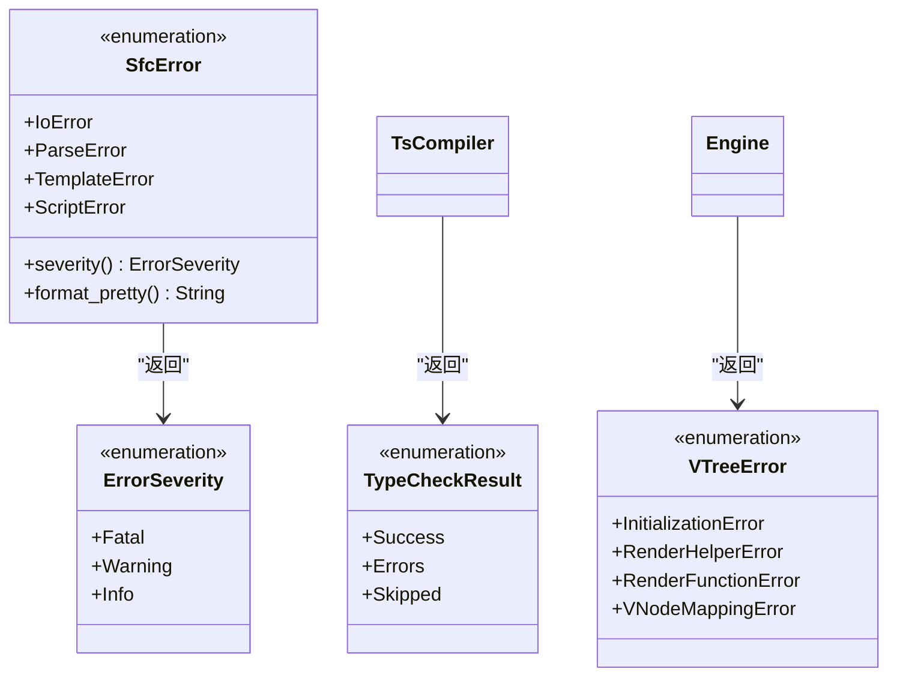

**图表来源**
- [crates/iris-sfc/src/lib.rs:133-193](file://crates/iris-sfc/src/lib.rs#L133-L193)
- [crates/iris-sfc/src/ts_compiler.rs:108-117](file://crates/iris-sfc/src/ts_compiler.rs#L108-L117)
- [crates/iris-engine/src/orchestrator.rs:292-335](file://crates/iris-engine/src/orchestrator.rs#L292-L335)

### 错误处理策略

| 错误类型 | 处理方式 | 影响程度 | 解决方案 |
|----------|----------|----------|----------|
| IO错误 | 终止编译，返回详细错误信息 | 严重 | 检查文件权限和路径 |
| 解析错误 | 终止编译，提供修复建议 | 严重 | 修正语法错误 |
| 模板错误 | 终止编译，定位具体指令 | 严重 | 修复指令语法 |
| 脚本错误 | 终止编译，显示语法问题 | 严重 | 修正JavaScript语法 |
| 类型检查错误 | 警告输出，不影响编译 | 轻微 | 修复类型问题 |
| VTree生成错误 | 终止流程，记录详细信息 | 严重 | 检查render函数 |
| JS运行时限制 | 降级处理，使用替代方案 | 中等 | 使用普通<script>标签 |

### 调试技巧

1. **启用详细日志**：
   ```bash
   RUST_LOG=debug cargo run
   ```

2. **检查缓存状态**：
   ```bash
   cargo test -p iris-sfc cache
   ```

3. **验证编译结果**：
   使用`sfc_demo.rs`示例程序进行手动测试

4. **测试最小可行演示**：
   ```bash
   cargo run -p iris-app --example minimal_demo
   ```

5. **VTree调试**：
   ```bash
   cargo test -p iris-engine vtree
   ```

**章节来源**
- [crates/iris-sfc/src/lib.rs:195-276](file://crates/iris-sfc/src/lib.rs#L195-L276)
- [crates/iris-sfc/src/ts_compiler.rs:295-406](file://crates/iris-sfc/src/ts_compiler.rs#L295-L406)
- [crates/iris-engine/src/orchestrator.rs:292-335](file://crates/iris-engine/src/orchestrator.rs#L292-L335)

## 结论

Iris SFC集成示例展示了现代前端开发工具链的先进理念和技术实现。通过精心设计的架构和优化策略，该系统实现了：

### 核心优势

1. **极致性能**：毫秒级编译时间和1000-3000倍缓存加速
2. **完整功能**：支持Vue 3的所有核心特性和指令
3. **开发友好**：零配置的即时运行体验
4. **可扩展性**：模块化设计便于功能扩展
5. **终端兼容**：自动检测和适配不同终端编码
6. **VTree集成**：完整的虚拟DOM树生成和转换能力

### 技术亮点

- **智能缓存系统**：基于XXH3哈希的LRU缓存
- **高性能编译器**：基于SWC 62的TypeScript转译
- **完整模板支持**：13种Vue指令的完整实现
- **CSS Modules**：完整的样式作用域化解决方案
- **Boa引擎集成**：完整的JavaScript运行时环境
- **VTree生成**：完整的SFC到VTree工作流
- **VTree到DOM转换**：高效的树转换能力
- **错误处理**：完善的错误处理和调试支持

### 应用前景

该系统为未来的前端开发提供了新的可能性：
- **开发效率**：消除构建步骤，实现真正的即时反馈
- **学习曲线**：降低前端开发门槛，专注于业务逻辑
- **团队协作**：统一的开发工具链，减少环境差异
- **跨平台支持**：桌面原生和WebAssembly双重部署
- **虚拟DOM支持**：为后续的布局和渲染优化奠定基础

## 附录

### 快速开始

```bash
# 克隆项目
git clone https://github.com/iris-engine/iris.git
cd iris

# 运行SFC演示
cargo run -p iris-sfc --example sfc_demo

# 运行应用集成示例
cargo run -p iris-app --example sfc_integration

# 运行最小可行演示
cargo run -p iris-app --example minimal_demo

# 运行VTree集成测试
cargo test -p iris-engine vtree

# 运行所有测试
cargo test -p iris-sfc
cargo test -p iris-engine
```

### 配置选项详解

| 环境变量 | 类型 | 默认值 | 说明 |
|----------|------|--------|------|
| `IRIS_SOURCE_MAP` | bool | false | 是否生成Source Map用于调试 |
| `IRIS_CACHE_CAPACITY` | usize | 100 | 缓存中可存储的组件数量 |
| `IRIS_CACHE_ENABLED` | bool | true | 是否启用缓存系统 |
| `IRIS_TYPE_CHECK` | bool | false | 是否启用TypeScript类型检查 |
| `IRIS_TYPE_CHECK_STRICT` | bool | false | 类型检查是否使用严格模式 |
| `IRIS_DEMO_FORCE_ASCII` | bool | false | 强制使用ASCII字符集（测试用） |
| `IRIS_CODE_PAGE` | string | 自动检测 | Windows代码页（65001=UTF-8） |

### VTree集成API参考

**新增** VTree集成相关的API：

```rust
// 初始化运行时
let mut orchestrator = RuntimeOrchestrator::new();
orchestrator.initialize()?;

// 加载SFC并生成VTree
orchestrator.load_sfc_with_vtree("App.vue")?;

// 获取VTree
if let Some(vtree) = orchestrator.vtree() {
    // 使用VTree进行渲染
}

// 转换为DOM
if let Some(dom_node) = orchestrator.build_dom_from_vtree() {
    // 使用DOM进行布局
}
```

### 性能监控

系统内置了详细的性能监控功能：
- 编译时间统计
- 缓存命中率分析
- 内存使用监控
- 错误处理统计
- 终端字符集检测
- VTree生成性能监控

### 终端兼容性

系统提供了智能的终端字符集检测：
- **UTF-8支持**：Windows Terminal、现代Linux/MacOS终端
- **ASCII回退**：传统Windows控制台、其他终端
- **自动适配**：根据环境变量和系统设置自动选择字符集

这些功能使得开发者能够深入了解系统的运行状况，并根据实际需求进行优化调整。

**章节来源**
- [crates/iris-app/examples/demo/minimal_demo.rs:11-55](file://crates/iris-app/examples/demo/minimal_demo.rs#L11-L55)
- [crates/iris-sfc/examples/sfc_demo.rs:10-51](file://crates/iris-sfc/examples/sfc_demo.rs#L10-L51)
- [crates/iris-sfc/tests/integration_test.rs:1-464](file://crates/iris-sfc/tests/integration_test.rs#L1-L464)
- [crates/iris-engine/src/orchestrator.rs:161-227](file://crates/iris-engine/src/orchestrator.rs#L161-L227)
- [PHASE_B_COMPLETION_SUMMARY.md:207-244](file://PHASE_B_COMPLETION_SUMMARY.md#L207-L244)