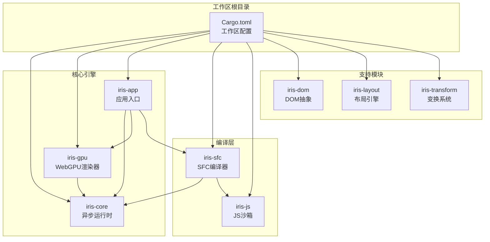
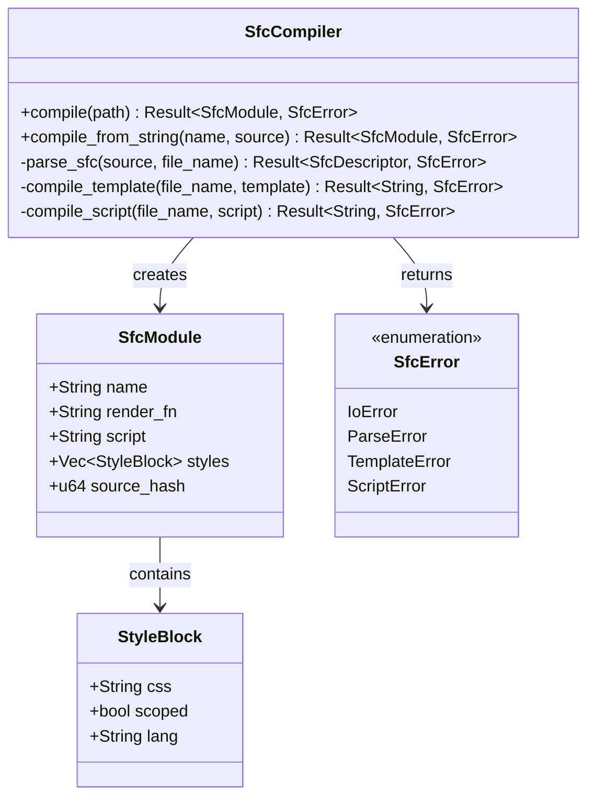
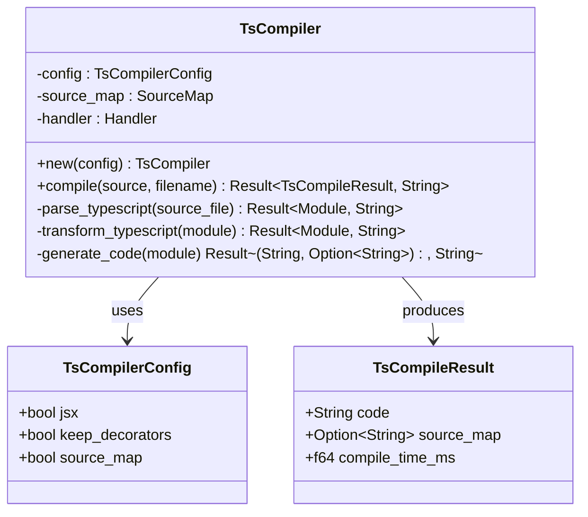
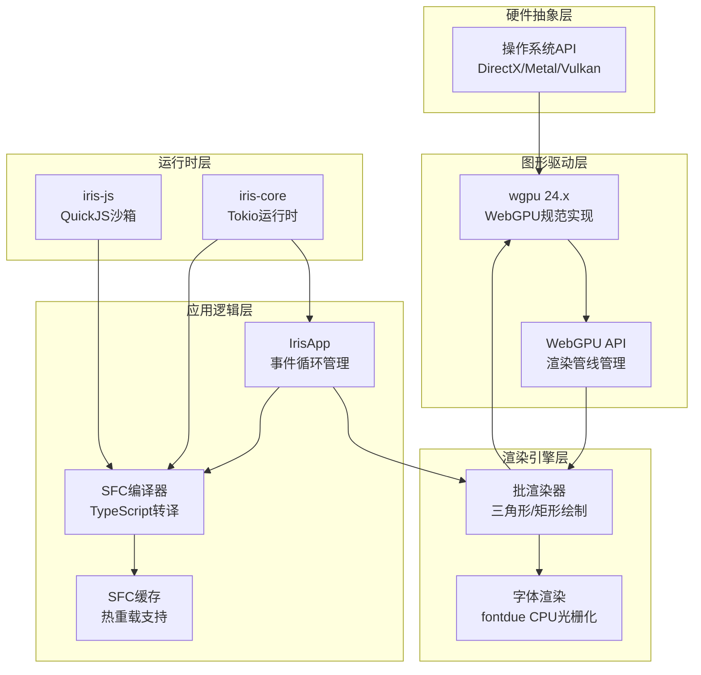
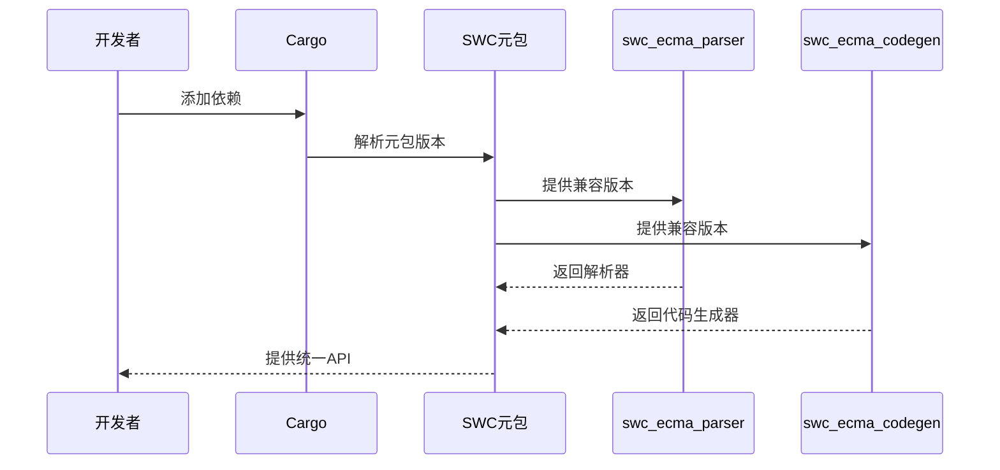
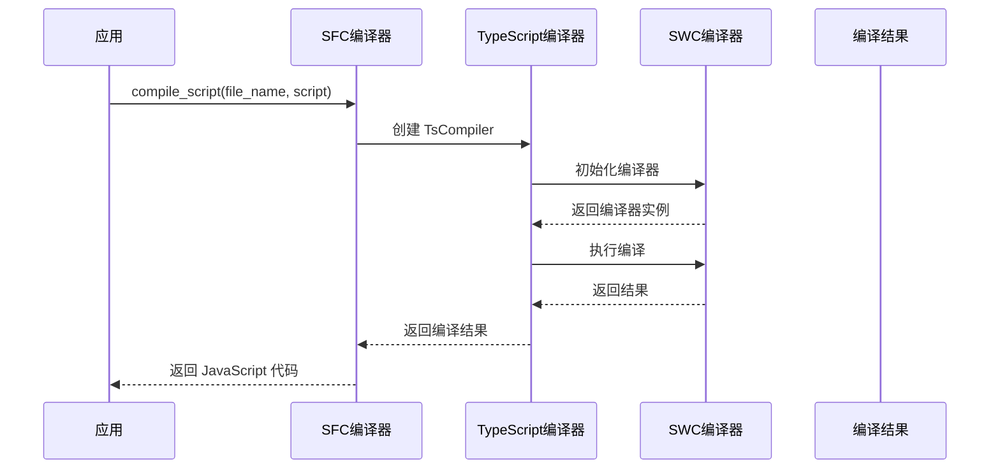
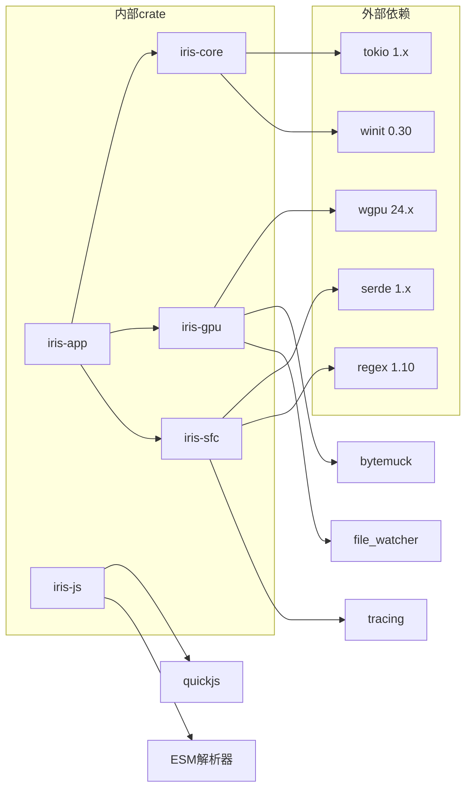
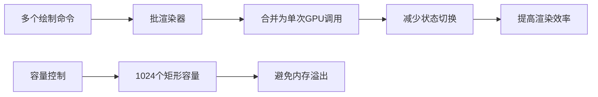
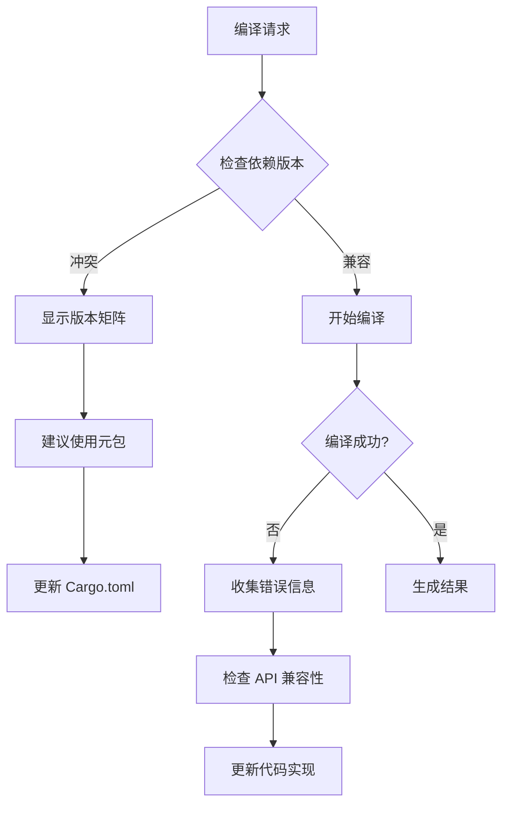

# SWC 集成问题报告

<cite>
**本文档引用的文件**
- [SWC-INTEGRATION-ISSUES.md](file://SWC-INTEGRATION-ISSUES.md)
- [Cargo.toml](file://Cargo.toml)
- [crates/iris-sfc/Cargo.toml](file://crates/iris-sfc/Cargo.toml)
- [crates/iris-sfc/src/lib.rs](file://crates/iris-sfc/src/lib.rs)
- [crates/iris-sfc/src/ts_compiler.rs](file://crates/iris-sfc/src/ts_compiler.rs)
- [crates/iris-sfc/examples/sfc_demo.rs](file://crates/iris-sfc/examples/sfc_demo.rs)
- [crates/iris-core/src/lib.rs](file://crates/iris-core/src/lib.rs)
- [crates/iris-gpu/src/lib.rs](file://crates/iris-gpu/src/lib.rs)
- [crates/iris-gpu/tests/file_watcher_integration.rs](file://crates/iris-gpu/tests/file_watcher_integration.rs)
- [crates/iris-gpu/src/batch_renderer.rs](file://crates/iris-gpu/src/batch_renderer.rs)
- [crates/iris-app/src/main.rs](file://crates/iris-app/src/main.rs)
- [crates/iris-js/src/lib.rs](file://crates/iris-js/src/lib.rs)
</cite>

## 目录
1. [简介](#简介)
2. [项目结构](#项目结构)
3. [核心组件](#核心组件)
4. [架构概览](#架构概览)
5. [详细组件分析](#详细组件分析)
6. [依赖关系分析](#依赖关系分析)
7. [性能考量](#性能考量)
8. [故障排除指南](#故障排除指南)
9. [结论](#结论)

## 简介

Iris 是一个基于 Rust 和 WebGPU 的跨平台前端运行时框架，专注于零编译直接运行源码的能力。该项目的核心目标是在桌面和浏览器环境中提供高性能的 Vue SFC（Single File Component）即时编译和热重载功能。

最近在集成 SWC TypeScript 编译器时遇到了严重的依赖版本冲突问题，导致编译过程无法正常进行。本文档详细分析了这些问题的根本原因，并提供了完整的解决方案建议。

## 项目结构

Iris 项目采用多 crate 的工作区结构，主要包含以下核心模块：



**图表来源**
- [Cargo.toml:1-29](file://Cargo.toml#L1-L29)
- [crates/iris-sfc/Cargo.toml:1-31](file://crates/iris-sfc/Cargo.toml#L1-L31)

**章节来源**
- [Cargo.toml:1-29](file://Cargo.toml#L1-L29)
- [crates/iris-sfc/Cargo.toml:1-31](file://crates/iris-sfc/Cargo.toml#L1-L31)

## 核心组件

### SFC 编译器层

Iris 的 SFC 编译器是整个系统的核心组件，负责将 Vue 单文件组件转换为可执行模块。当前实现了简化版本，主要用于验证热重载流程。



**图表来源**
- [crates/iris-sfc/src/lib.rs:37-132](file://crates/iris-sfc/src/lib.rs#L37-L132)

### TypeScript 编译器

TypeScript 编译器是 SFC 编译器的重要组成部分，负责将 TypeScript 代码转换为 JavaScript。



**图表来源**
- [crates/iris-sfc/src/ts_compiler.rs:23-60](file://crates/iris-sfc/src/ts_compiler.rs#L23-L60)

**章节来源**
- [crates/iris-sfc/src/lib.rs:143-210](file://crates/iris-sfc/src/lib.rs#L143-L210)
- [crates/iris-sfc/src/ts_compiler.rs:55-195](file://crates/iris-sfc/src/ts_compiler.rs#L55-L195)

## 架构概览

Iris 的整体架构采用了分层设计，从底层硬件抽象到高层应用逻辑形成了清晰的层次结构。



**图表来源**
- [crates/iris-app/src/main.rs:124-235](file://crates/iris-app/src/main.rs#L124-L235)
- [crates/iris-gpu/src/lib.rs:74-105](file://crates/iris-gpu/src/lib.rs#L74-L105)

## 详细组件分析

### SWC 集成问题分析

在集成 SWC TypeScript 编译器时，遇到了三个主要问题：

#### 1. 版本兼容性冲突

**问题描述**: `unicode-id-start` 版本冲突导致无法选择兼容的版本。

**根本原因**: SWC 子包之间的版本必须精确匹配，但不同子包依赖的共同依赖版本不兼容。

```mermaid
flowchart TD
A[Cargo 解析] --> B{检查依赖版本}
B --> C{发现冲突}
C --> D[unicode-id-start v1.0.4 vs ^1.2.0]
D --> E[版本选择失败]
E --> F[编译中断]
G[解决方案] --> H[使用官方元包]
H --> I[swc = "0.270"]
I --> J[swc_common = "0.37"]
J --> K[自动管理内部依赖]
```

**图表来源**
- [SWC-INTEGRATION-ISSUES.md:16-28](file://SWC-INTEGRATION-ISSUES.md#L16-L28)

#### 2. Serde API 移除问题

**问题描述**: `serde::__private` API 在新版本中被移除。

**根本原因**: 旧版本的 `swc_config` 依赖内部 API，这些 API 在 serde 1.0.228 中被移除。

**章节来源**
- [SWC-INTEGRATION-ISSUES.md:32-42](file://SWC-INTEGRATION-ISSUES.md#L32-L42)

#### 3. API 变更问题

**问题描述**: SWC API 在不同版本间频繁变更。

**具体影响**:
- `TsSyntax` 改名为 `TsConfig`
- `strip_with_config` 函数签名变更
- Source map 类型变更

**章节来源**
- [SWC-INTEGRATION-ISSUES.md:46-61](file://SWC-INTEGRATION-ISSUES.md#L46-L61)

### 解决方案实施

#### 方案 1: 使用官方 SWC 元包

这是推荐的解决方案，通过使用官方元包来解决版本管理问题。



**图表来源**
- [SWC-INTEGRATION-ISSUES.md:76-98](file://SWC-INTEGRATION-ISSUES.md#L76-L98)

#### 方案 2: 使用 `[patch]` 段强制版本

当无法使用元包时，可以使用 patch 段强制指定版本。

**章节来源**
- [SWC-INTEGRATION-ISSUES.md:105-122](file://SWC-INTEGRATION-ISSUES.md#L105-L122)

### 应用层集成

在应用层，SFC 编译器通过 `compile_script` 函数集成 TypeScript 编译功能。



**图表来源**
- [crates/iris-sfc/src/lib.rs:393-421](file://crates/iris-sfc/src/lib.rs#L393-L421)
- [crates/iris-sfc/src/ts_compiler.rs:85-124](file://crates/iris-sfc/src/ts_compiler.rs#L85-L124)

**章节来源**
- [crates/iris-sfc/src/lib.rs:393-421](file://crates/iris-sfc/src/lib.rs#L393-L421)
- [crates/iris-sfc/src/ts_compiler.rs:85-195](file://crates/iris-sfc/src/ts_compiler.rs#L85-L195)

## 依赖关系分析

### 核心依赖关系



**图表来源**
- [Cargo.toml:23-29](file://Cargo.toml#L23-L29)
- [crates/iris-sfc/Cargo.toml:14-31](file://crates/iris-sfc/Cargo.toml#L14-L31)

### 版本冲突矩阵

| Parser | Transforms | Codegen | Common | 结果 |
|--------|------------|---------|--------|------|
| 0.149 | 0.234 | 0.151 | 0.37 | ❌ unicode-id-start 冲突 |
| 0.148 | 0.233 | 0.150 | 0.36 | ❌ unicode-id-start 冲突 |
| 0.146 | 0.230 | 0.148 | 0.34 | ❌ serde 版本问题 |
| 0.141 | 0.185 | 0.146 | 0.33 | ❌ serde 版本问题 |

**章节来源**
- [SWC-INTEGRATION-ISSUES.md:172-180](file://SWC-INTEGRATION-ISSUES.md#L172-L180)

## 性能考量

### 编译性能优化

Iris 在 SFC 编译器中实现了多项性能优化措施：

1. **预编译正则表达式**: 使用 `LazyLock` 避免重复编译
2. **静态编译时间**: 每次编译 ~10-50μs，LazyLock 单次编译 ~0.1μs
3. **性能提升**: 100-500 倍性能提升

### 渲染性能优化

GPU 渲染器采用了批渲染技术：



**图表来源**
- [crates/iris-gpu/src/batch_renderer.rs:87-202](file://crates/iris-gpu/src/batch_renderer.rs#L87-L202)

**章节来源**
- [crates/iris-sfc/src/lib.rs:19-35](file://crates/iris-sfc/src/lib.rs#L19-L35)
- [crates/iris-gpu/src/batch_renderer.rs:87-375](file://crates/iris-gpu/src/batch_renderer.rs#L87-L375)

## 故障排除指南

### 常见问题诊断

1. **版本冲突问题**
   - 检查 `Cargo.lock` 文件中的版本信息
   - 使用 `cargo tree` 查看依赖树
   - 考虑使用 `[patch]` 段强制版本

2. **API 变更问题**
   - 检查 SWC 版本对应的 API 文档
   - 更新导入语句和函数调用
   - 验证 Source map 类型兼容性

3. **编译错误处理**
   - 实现详细的错误信息收集
   - 提供回退机制（正则表达式转译）
   - 记录编译时间和性能指标

### 调试工具



**图表来源**
- [crates/iris-sfc/src/ts_compiler.rs:140-146](file://crates/iris-sfc/src/ts_compiler.rs#L140-L146)

**章节来源**
- [crates/iris-sfc/src/ts_compiler.rs:140-195](file://crates/iris-sfc/src/ts_compiler.rs#L140-L195)

## 结论

Iris 项目在集成 SWC TypeScript 编译器时遇到的问题反映了现代 Rust 生态系统中依赖管理的复杂性。通过采用官方 SWC 元包、合理的版本管理策略和充分的错误处理机制，可以有效解决这些问题。

### 主要发现

1. **版本管理挑战**: SWC 子包的精确版本匹配要求极高
2. **API 稳定性**: 快速迭代的项目需要持续的关注和适配
3. **性能权衡**: 元包虽然带来版本一致性，但也增加了包体积

### 建议的实施步骤

1. **短期解决方案**: 使用官方 SWC 元包替换当前的子包依赖
2. **中期规划**: 建立版本兼容性测试矩阵
3. **长期发展**: 考虑引入替代编译器或自研编译器

通过这些措施，Iris 项目可以稳定地集成 SWC 编译器，为开发者提供更好的 TypeScript 开发体验。