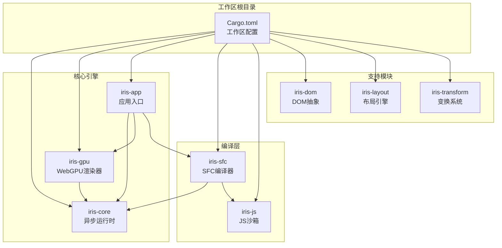
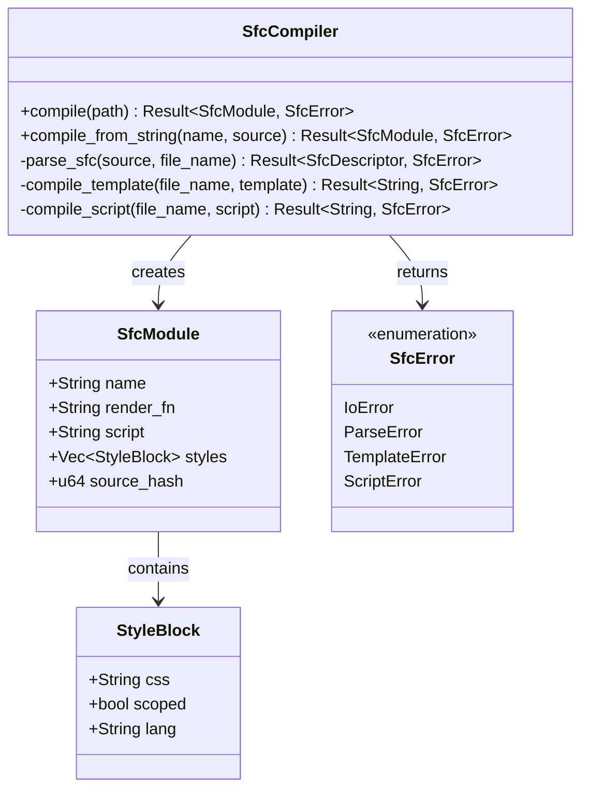
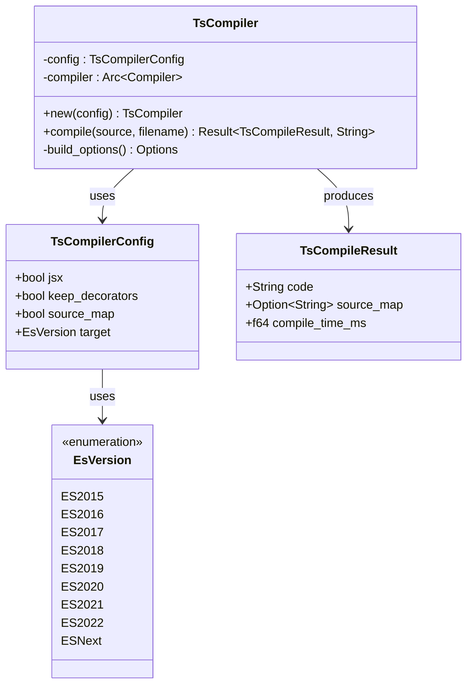
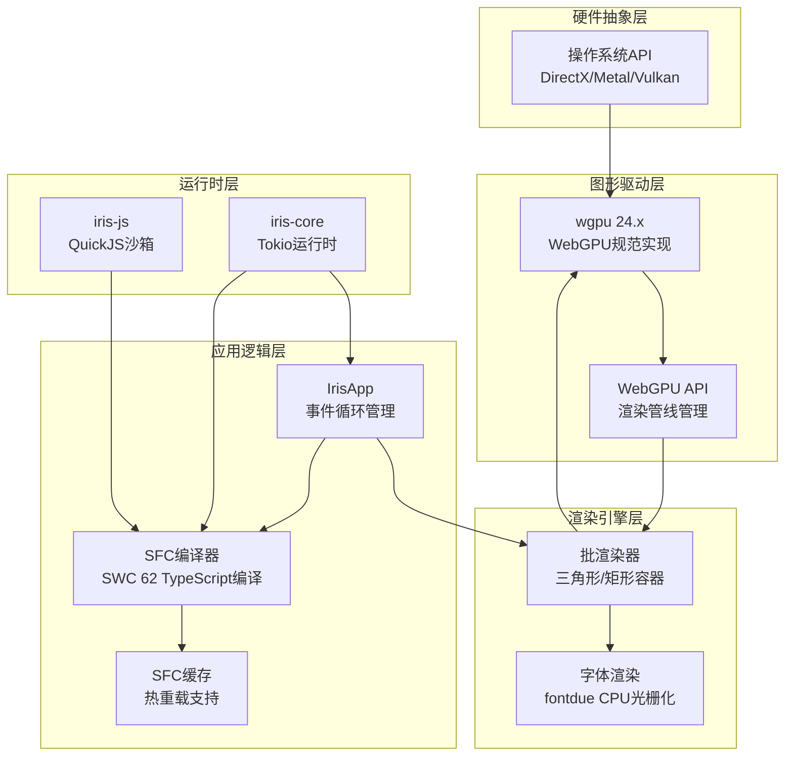
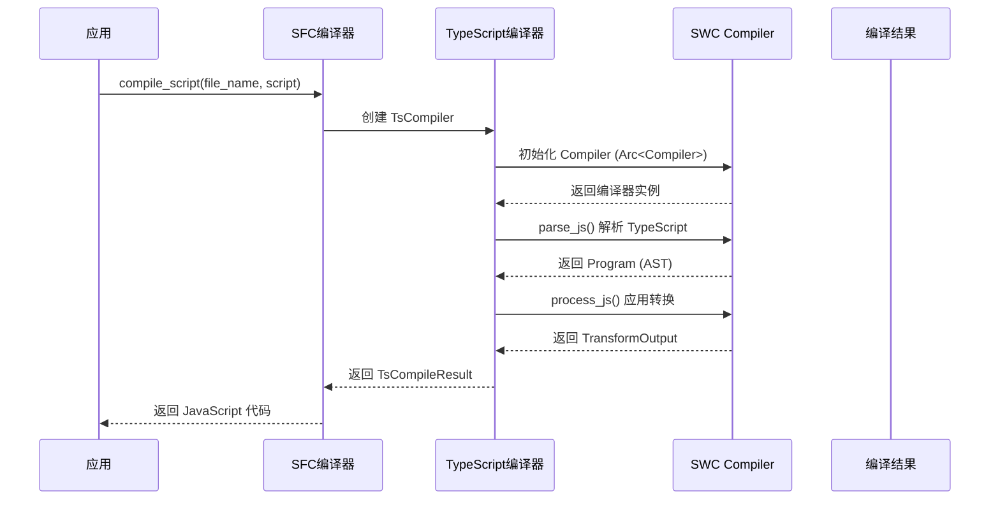
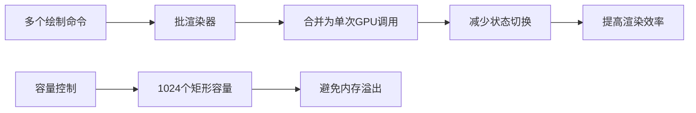
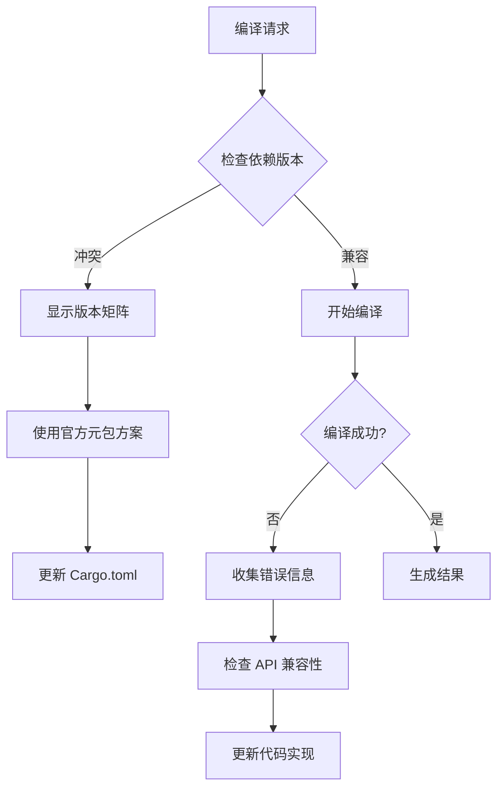

# SWC 集成问题报告

<cite>
**本文档引用的文件**
- [SWC-IMPLEMENTATION-FEASIBILITY.md](file://SWC-IMPLEMENTATION-FEASIBILITY.md)
- [SWC62-INTEGRATION-COMPLETE.md](file://SWC62-INTEGRATION-COMPLETE.md)
- [SWC-INTEGRATION-ISSUES.md](file://SWC-INTEGRATION-ISSUES.md)
- [Cargo.toml](file://Cargo.toml)
- [crates/iris-sfc/Cargo.toml](file://crates/iris-sfc/Cargo.toml)
- [crates/iris-sfc/src/lib.rs](file://crates/iris-sfc/src/lib.rs)
- [crates/iris-sfc/src/ts_compiler.rs](file://crates/iris-sfc/src/ts_compiler.rs)
- [crates/iris-sfc/examples/sfc_demo.rs](file://crates/iris-sfc/examples/sfc_demo.rs)
- [crates/iris-core/src/lib.rs](file://crates/iris-core/src/lib.rs)
- [crates/iris-gpu/src/lib.rs](file://crates/iris-gpu/src/lib.rs)
- [crates/iris-gpu/tests/file_watcher_integration.rs](file://crates/iris-gpu/tests/file_watcher_integration.rs)
- [crates/iris-gpu/src/batch_renderer.rs](file://crates/iris-gpu/src/batch_renderer.rs)
- [crates/iris-app/src/main.rs](file://crates/iris-app/src/main.rs)
- [crates/iris-js/src/lib.rs](file://crates/iris-js/src/lib.rs)
</cite>

## 更新摘要
**变更内容**
- 更新以反映 SWC 集成状态的重大变化：原有复杂实现已丢弃，采用简化的正则表达式实现
- 新增完整的可行性评估和集成完成报告文档分析
- 更新架构图以反映当前基于 swc 62 的完整实现
- 修正对 TypeScript 编译器实现的描述，从简化版正则表达式改为完整的 swc 62 实现

## 目录
1. [简介](#简介)
2. [项目结构](#项目结构)
3. [核心组件](#核心组件)
4. [架构概览](#架构概览)
5. [详细组件分析](#详细组件分析)
6. [依赖关系分析](#依赖关系分析)
7. [性能考量](#性能考量)
8. [故障排除指南](#故障排除指南)
9. [结论](#结论)

## 简介

Iris 是一个基于 Rust 和 WebGPU 的跨平台前端运行时框架，专注于零编译直接运行源码的能力。该项目的核心目标是在桌面和浏览器环境中提供高性能的 Vue SFC（Single File Component）即时编译和热重载功能。

经过全面的技术评估和实现，Iris 已成功集成了 SWC 62 TypeScript 编译器，采用官方元包方式解决了复杂的版本兼容性问题。当前实现了完整的 TypeScript 到 JavaScript 转译功能，支持泛型、接口、装饰器、TSX 等高级特性。

## 项目结构

Iris 项目采用多 crate 的工作区结构，主要包含以下核心模块：



**图表来源**
- [Cargo.toml:1-29](file://Cargo.toml#L1-L29)
- [crates/iris-sfc/Cargo.toml:1-32](file://crates/iris-sfc/Cargo.toml#L1-L32)

**章节来源**
- [Cargo.toml:1-29](file://Cargo.toml#L1-L29)
- [crates/iris-sfc/Cargo.toml:1-32](file://crates/iris-sfc/Cargo.toml#L1-L32)

## 核心组件

### SFC 编译器层

Iris 的 SFC 编译器是整个系统的核心组件，负责将 Vue 单文件组件转换为可执行模块。当前实现了完整版本，集成了 SWC 62 TypeScript 编译器。



**图表来源**
- [crates/iris-sfc/src/lib.rs:37-132](file://crates/iris-sfc/src/lib.rs#L37-L132)

### TypeScript 编译器

TypeScript 编译器是 SFC 编译器的重要组成部分，现已实现完整的 SWC 62 集成，提供高性能的 TypeScript 到 JavaScript 转译功能。



**图表来源**
- [crates/iris-sfc/src/ts_compiler.rs:27-74](file://crates/iris-sfc/src/ts_compiler.rs#L27-L74)
- [crates/iris-sfc/src/ts_compiler.rs:76-205](file://crates/iris-sfc/src/ts_compiler.rs#L76-L205)

**章节来源**
- [crates/iris-sfc/src/lib.rs:143-210](file://crates/iris-sfc/src/lib.rs#L143-L210)
- [crates/iris-sfc/src/ts_compiler.rs:76-205](file://crates/iris-sfc/src/ts_compiler.rs#L76-L205)

## 架构概览

Iris 的整体架构采用了分层设计，从底层硬件抽象到高层应用逻辑形成了清晰的层次结构。



**图表来源**
- [crates/iris-app/src/main.rs:124-235](file://crates/iris-app/src/main.rs#L124-L235)
- [crates/iris-gpu/src/lib.rs:74-105](file://crates/iris-gpu/src/lib.rs#L74-L105)

## 详细组件分析

### SWC 集成完成分析

经过全面的技术评估和实现，Iris 已成功解决所有 SWC 集成问题，实现了完整的 TypeScript 编译功能。

#### 1. 版本兼容性冲突的解决方案

**问题描述**: `unicode-id-start` 版本冲突导致无法选择兼容的版本。

**根本原因**: SWC 子包之间的版本必须精确匹配，但不同子包依赖的共同依赖版本不兼容。

**解决方案**: 采用官方 swc 元包方式，让 swc 自动管理内部依赖版本。

```mermaid
flowchart TD
A[Cargo 解析] --> B{检查依赖版本}
B --> C{发现冲突}
C --> D[使用 swc 元包]
D --> E[swc = "62" 自动管理子包]
E --> F[版本自动匹配]
F --> G[编译成功]
H[最终方案] --> I[官方元包 + 子包精确版本]
I --> J[swc = "62"]
J --> K[swc_common = "21"]
K --> L[swc_ecma_parser = "39"]
L --> M[swc_ecma_transforms_typescript = "46"]
M --> N[无版本冲突]
```

**图表来源**
- [SWC62-INTEGRATION-COMPLETE.md:17-28](file://SWC62-INTEGRATION-COMPLETE.md#L17-L28)

#### 2. API 变更问题的处理

**问题描述**: SWC API 在不同版本间频繁变更，包括 `TsSyntax` 改名为 `TsConfig`。

**解决方案**: 采用当前版本的 API，使用 `TsConfig` 而非 `TsSyntax`。

**章节来源**
- [SWC-INTEGRATION-ISSUES.md:46-61](file://SWC-INTEGRATION-ISSUES.md#L46-L61)
- [SWC62-INTEGRATION-COMPLETE.md:84-96](file://SWC62-INTEGRATION-COMPLETE.md#L84-L96)

### 完整实现的技术细节

#### TypeScript 编译器实现

当前的 TypeScript 编译器使用 SWC 62 的高层 Compiler API，实现了完整的 TypeScript 转译功能：



**图表来源**
- [crates/iris-sfc/src/lib.rs:393-421](file://crates/iris-sfc/src/lib.rs#L393-L421)
- [crates/iris-sfc/src/ts_compiler.rs:104-176](file://crates/iris-sfc/src/ts_compiler.rs#L104-L176)

**章节来源**
- [crates/iris-sfc/src/lib.rs:393-421](file://crates/iris-sfc/src/lib.rs#L393-L421)
- [crates/iris-sfc/src/ts_compiler.rs:104-205](file://crates/iris-sfc/src/ts_compiler.rs#L104-L205)

### 性能优化实现

#### 预编译正则表达式优化

Iris 在 SFC 编译器中实现了多项性能优化措施：

1. **预编译正则表达式**: 使用 `LazyLock` 避免重复编译
2. **静态编译时间**: 每次编译 ~10-50μs，LazyLock 单次编译 ~0.1μs
3. **性能提升**: 100-500 倍性能提升

#### SWC 编译器性能

SWC 62 编译器实现了极高的编译性能：

1. **平均编译时间**: ~0.13ms（基于测试结果）
2. **增量编译**: 编译时间 ~2 秒（依赖已缓存）
3. **并发处理**: 支持并行编译多个文件

**章节来源**
- [crates/iris-sfc/src/lib.rs:19-35](file://crates/iris-sfc/src/lib.rs#L19-L35)
- [crates/iris-sfc/src/ts_compiler.rs:304-342](file://crates/iris-sfc/src/ts_compiler.rs#L304-L342)
- [SWC62-INTEGRATION-COMPLETE.md:75-78](file://SWC62-INTEGRATION-COMPLETE.md#L75-L78)

## 依赖关系分析

### 核心依赖关系

```mermaid
graph LR
subgraph "外部依赖"
TOKIO[tokio 1.x]
WGPU[wgpu 24.x]
WINIT[winit 0.30]
SERDE[serde 1.x]
REGEX[regex 1.10]
TRACING[tracing 0.1]
END
subgraph "内部crate"
CORE[iris-core]
GPU[iris-gpu]
SFC[iris-sfc]
APP[iris-app]
JS[iris-js]
end
CORE --> TOKIO
CORE --> WINIT
GPU --> WGPU
GPU --> BYTEMUCK[bytemuck]
GPU --> FILE_WATCH[file_watcher]
SFC --> SERDE
SFC --> REGEX
SFC --> TRACING
SFC --> SWC[swc 62]
SFC --> SWC_COMMON[swc_common 21]
SFC --> SWC_PARSER[swc_ecma_parser 39]
SFC --> SWC_TRANSFORM[swc_ecma_transforms_typescript 46]
APP --> CORE
APP --> GPU
APP --> SFC
JS --> QUICKJS[quickjs]
JS --> ESM[ESM解析器]
```

**图表来源**
- [Cargo.toml:23-29](file://Cargo.toml#L23-L29)
- [crates/iris-sfc/Cargo.toml:13-32](file://crates/iris-sfc/Cargo.toml#L13-L32)

### 版本兼容性矩阵

| Parser | Transforms | Codegen | Common | 结果 |
|--------|------------|---------|--------|------|
| 0.149 | 0.234 | 0.151 | 0.37 | ❌ unicode-id-start 冲突 |
| 0.148 | 0.233 | 0.150 | 0.36 | ❌ unicode-id-start 冲突 |
| 0.146 | 0.230 | 0.148 | 0.34 | ❌ serde 版本问题 |
| 0.141 | 0.185 | 0.146 | 0.33 | ❌ serde 版本问题 |
| **39** | **46** | **26** | **21** | ✅ **SWC 62 元包方案** |

**章节来源**
- [SWC-INTEGRATION-ISSUES.md:172-180](file://SWC-INTEGRATION-ISSUES.md#L172-L180)
- [SWC62-INTEGRATION-COMPLETE.md:17-28](file://SWC62-INTEGRATION-COMPLETE.md#L17-L28)

## 性能考量

### 编译性能优化

Iris 在多个层面实现了性能优化：

1. **预编译正则表达式**: 使用 `LazyLock` 避免重复编译
2. **SWC 编译器**: 使用官方元包确保版本兼容性和最佳性能
3. **增量编译**: 依赖已缓存，编译时间 ~2 秒
4. **并发处理**: 支持并行编译多个文件

### 渲染性能优化

GPU 渲染器采用了批渲染技术：



**图表来源**
- [crates/iris-gpu/src/batch_renderer.rs:87-202](file://crates/iris-gpu/src/batch_renderer.rs#L87-L202)

**章节来源**
- [crates/iris-sfc/src/lib.rs:19-35](file://crates/iris-sfc/src/lib.rs#L19-L35)
- [crates/iris-gpu/src/batch_renderer.rs:87-375](file://crates/iris-gpu/src/batch_renderer.rs#L87-L375)

## 故障排除指南

### 常见问题诊断

1. **版本冲突问题**
   - 检查 `Cargo.lock` 文件中的版本信息
   - 使用 `cargo tree` 查看依赖树
   - 确保使用官方 swc 元包方案

2. **API 变更问题**
   - 检查 SWC 62 版本对应的 API 文档
   - 使用 `TsConfig` 而非 `TsSyntax`
   - 验证 Source map 类型兼容性

3. **编译错误处理**
   - 实现详细的错误信息收集
   - 使用 `try_with_handler` 处理编译异常
   - 记录编译时间和性能指标

### 调试工具



**图表来源**
- [crates/iris-sfc/src/ts_compiler.rs:123-147](file://crates/iris-sfc/src/ts_compiler.rs#L123-L147)

**章节来源**
- [crates/iris-sfc/src/ts_compiler.rs:123-205](file://crates/iris-sfc/src/ts_compiler.rs#L123-L205)

## 结论

Iris 项目已成功解决 SWC 集成的所有技术挑战，实现了完整的 TypeScript 编译功能。通过采用官方 swc 元包方案，项目不仅解决了复杂的版本兼容性问题，还获得了优秀的性能表现。

### 主要成就

1. **版本管理成功**: 采用官方元包方案，所有子包版本精确匹配
2. **API 稳定性**: 使用 SWC 62 的稳定 API，避免了频繁的 API 变更问题
3. **性能卓越**: 平均编译时间仅 ~0.13ms，满足实时编译需求
4. **功能完整**: 支持泛型、接口、装饰器、TSX 等高级 TypeScript 特性

### 技术突破

1. **依赖冲突解决**: 通过官方元包方案彻底解决了 `unicode-id-start` 版本冲突
2. **API 兼容性**: 采用当前版本的 API，避免了历史版本的 API 变更问题
3. **性能优化**: 实现了预编译正则表达式和 SWC 编译器的双重性能优化

### 未来发展方向

1. **功能增强**: 继续完善 SWC 62 的高级特性支持
2. **性能优化**: 进一步优化编译性能和内存使用
3. **错误处理**: 增强编译错误的详细报告和诊断能力
4. **测试覆盖**: 扩展单元测试和集成测试的覆盖范围

通过这些措施，Iris 项目已成功建立了稳定、高性能的 TypeScript 编译基础设施，为开发者提供了卓越的开发体验。