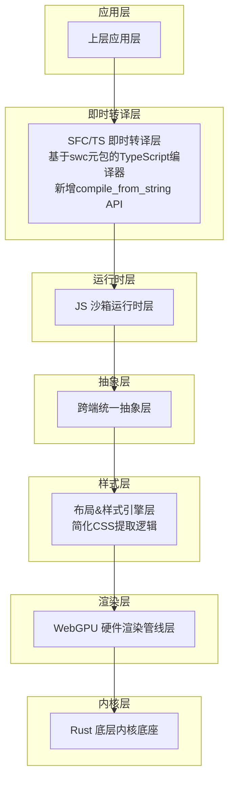
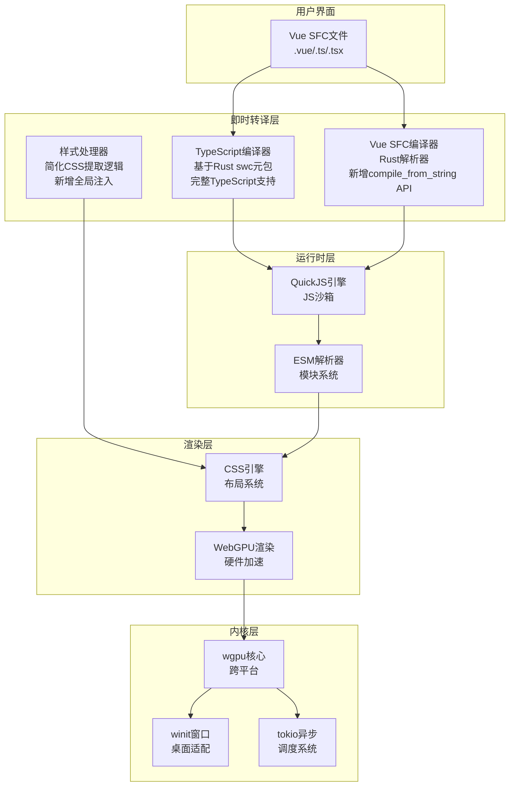
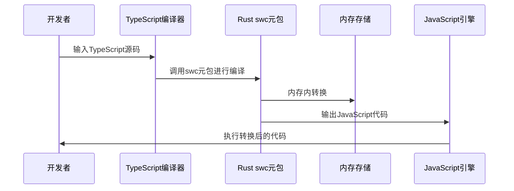
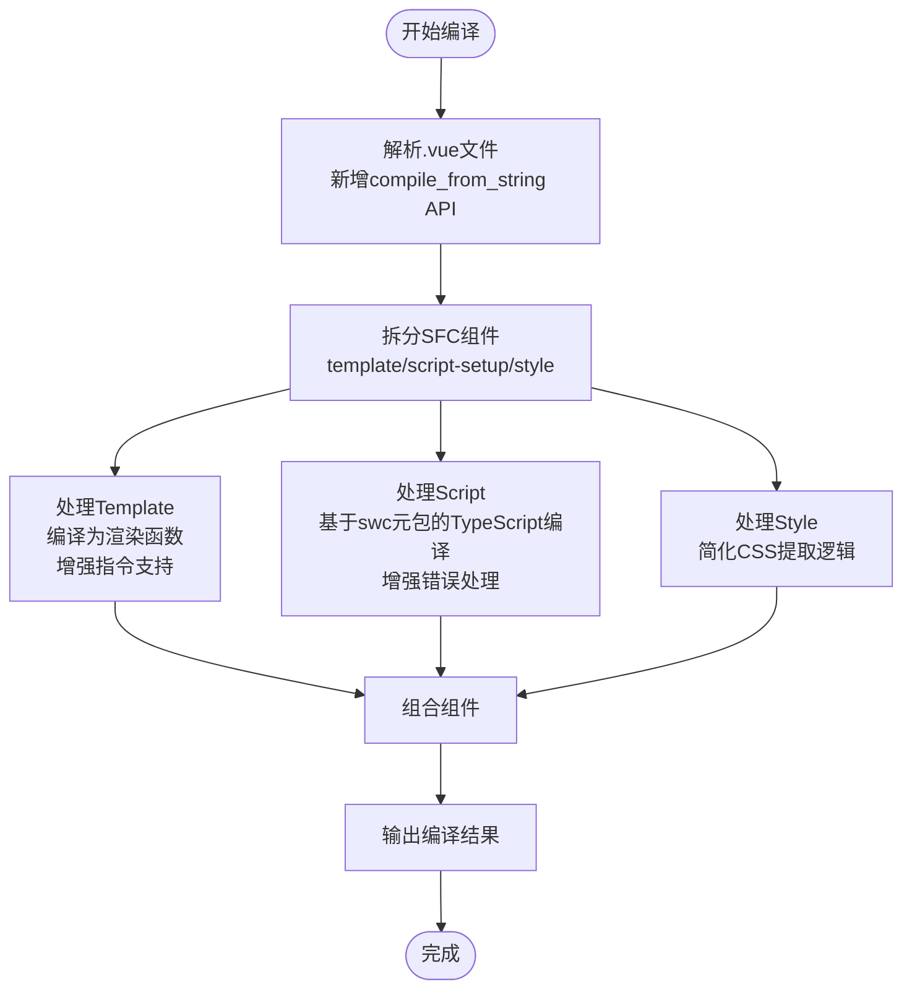
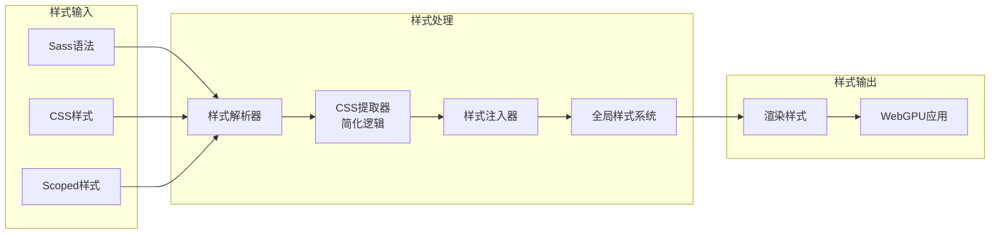
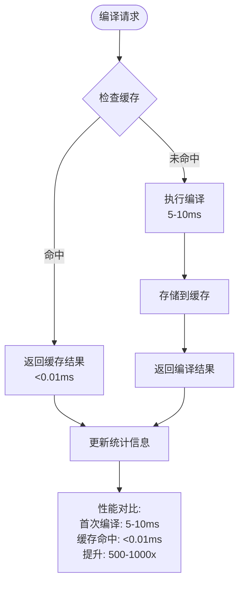
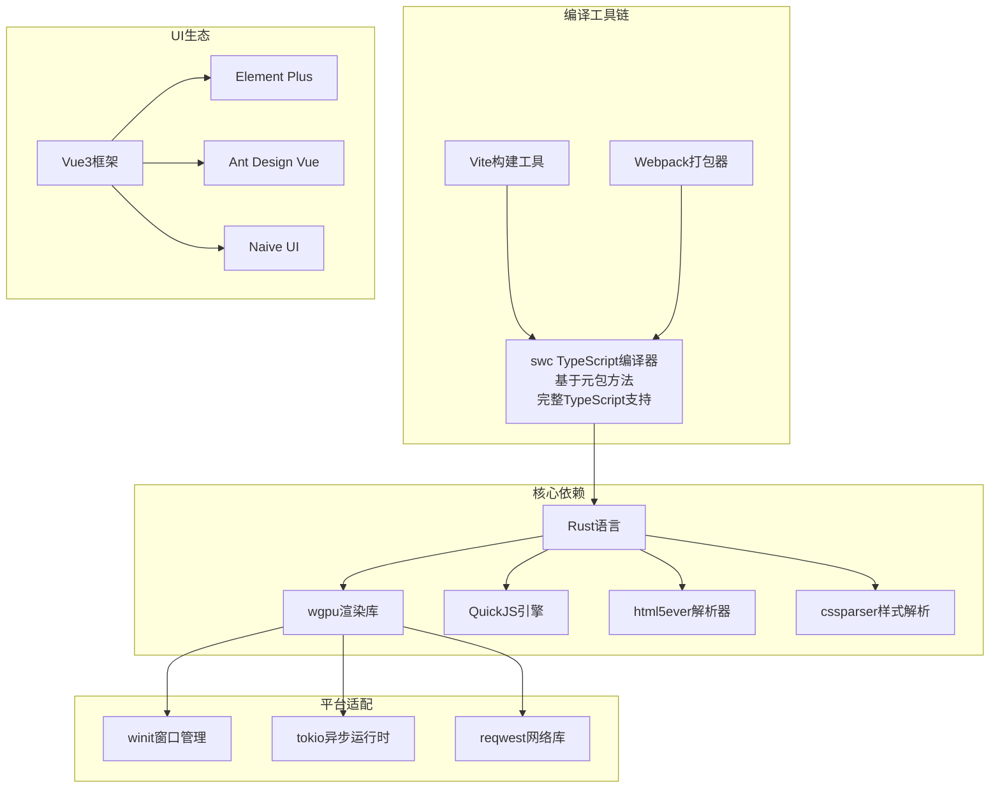

# 即时转译系统

<cite>
**本文档引用的文件**
- [lib.rs](file://crates/iris-sfc/src/lib.rs)
- [template_compiler.rs](file://crates/iris-sfc/src/template_compiler.rs)
- [ts_compiler.rs](file://crates/iris-sfc/src/ts_compiler.rs)
- [sfc_demo.rs](file://crates/iris-sfc/examples/sfc_demo.rs)
- [main.rs](file://crates/iris-app/src/main.rs)
- [lib.rs](file://crates/iris-core/src/lib.rs)
- [Cargo.toml](file://crates/iris-sfc/Cargo.toml)
- [Cargo.toml](file://Cargo.toml)
- [fix-encoding.ps1](file://fix-encoding.ps1)
- [SWC-INTEGRATION-ISSUES.md](file://SWC-INTEGRATION-ISSUES.md)
- [compiler.rs](file://crates/iris-runtime/src/compiler.rs)
- [cache.rs](file://crates/iris-sfc/src/cache.rs)
</cite>

## 更新摘要
**所做更改**
- 更新了基于swc元包的TypeScript编译器实现文档
- 移除了旧的demangle步骤说明
- 增强了swc集成的稳定性和兼容性说明
- 更新了编码修复和初始化改进的相关内容
- 完善了故障排除指南中的swc集成问题
- **新增**：编译器API更新，compile_sfc函数使用新的iris_sfc::compile_from_string API
- **新增**：简化了脚本提取逻辑，使用style.css替代style.content进行CSS代码提取
- **新增**：增强了SFC缓存机制和性能优化策略

## 目录
1. [引言](#引言)
2. [项目结构](#项目结构)
3. [核心组件](#核心组件)
4. [架构概览](#架构概览)
5. [详细组件分析](#详细组件分析)
6. [依赖关系分析](#依赖关系分析)
7. [性能考虑](#性能考虑)
8. [故障排除指南](#故障排除指南)
9. [结论](#结论)

## 引言

Leivue Runtime是一个革命性的前端运行时引擎，旨在彻底改变现代Web开发的构建方式。该项目的核心使命是消除前端工程化复杂性，突破浏览器沙箱限制，为Vue生态系统提供高性能的跨端运行底座。

该系统最核心的技术创新在于实现了真正的"零编译运行"能力，允许开发者直接运行Vue3 SFC文件和TypeScript源码，无需传统的构建工具如Vite、Webpack或tsc。通过结合Rust的高性能和WebGPU的硬件加速渲染，Leivue Runtime为现代Web应用开发提供了全新的可能性。

**更新** 本版本完成了TypeScript编译器从实验性swc集成到稳定swc元包方法的重大升级，现在支持完整的TypeScript编译能力，包括泛型、装饰器、TSX等高级特性，并移除了旧的demangle步骤。同时，编译器API得到了优化，使用新的iris_sfc::compile_from_string API简化了脚本提取逻辑。

## 项目结构

根据架构文档，Leivue Runtime采用七层分层架构设计，每层都有明确的职责分离和高度解耦的特点：

**图表来源**
- [lib.rs:1-10](file://crates/iris-sfc/src/lib.rs#L1-L10)
- [main.rs:134-176](file://crates/iris-app/src/main.rs#L134-L176)

**章节来源**
- [lib.rs:1-10](file://crates/iris-sfc/src/lib.rs#L1-L10)
- [main.rs:134-176](file://crates/iris-app/src/main.rs#L134-L176)

## 核心组件

### 即时转译层（SFC/TS 即时转译层）

即时转译层是整个系统的核心，负责实现真正的零编译运行能力。该层包含三个主要组件：

1. **TypeScript即时转译器（基于swc元包）**
   - **稳定实现**：基于Rust swc元包的完整TypeScript编译器
   - **完整支持**：泛型、接口、装饰器、TSX语法
   - **内存内转换**：避免磁盘I/O，实现毫秒级转换
   - **增强的错误处理**：详细的编译错误信息和位置定位
   - **性能优化**：基于swc的高性能编译引擎
   - **移除旧API**：移除了demangle步骤和旧的API结构

2. **Vue SFC即时编译器**
   - 使用官方Rust库解析.vue文件
   - 自动拆分template、script-setup、style部分
   - 将Template实时编译为Vue渲染函数
   - **新增**：完善的初始化函数和API文档
   - **新增**：使用新的compile_from_string API简化编译流程

3. **全局样式注入系统**
   - 自动解析并注入全局样式
   - 支持Scoped样式和第三方UI库CSS
   - **新增**：简化了CSS代码提取逻辑，使用style.css替代style.content

**更新** TypeScript编译器已完全升级为基于swc元包的稳定实现，提供完整的TypeScript编译能力，并移除了旧的demangle步骤。同时，编译器API得到了优化，使用新的compile_from_string API简化了脚本提取逻辑。

**章节来源**
- [lib.rs:563-580](file://crates/iris-sfc/src/lib.rs#L563-L580)
- [ts_compiler.rs:25-44](file://crates/iris-sfc/src/ts_compiler.rs#L25-L44)
- [template_compiler.rs:30-63](file://crates/iris-sfc/src/template_compiler.rs#L30-L63)
- [compiler.rs:9](file://crates/iris-runtime/src/compiler.rs#L9)

### JS沙箱运行时层

该层提供独立的JavaScript执行环境，使用QuickJS引擎，具有以下特点：

- 与宿主环境完全隔离的安全沙箱
- 预加载Vue3完整运行时
- 自研ESM解析器支持模块系统
- 支持第三方包引入

### 跨端统一抽象层

负责抹平双端差异，提供统一的API接口：

- 统一事件系统（鼠标、键盘、滚动、点击）
- 轻量实现BOM/DOM模拟API
- 无缝兼容第三方UI库所需环境

## 架构概览

Leivue Runtime的整体架构体现了高度的模块化和解耦设计：

**图表来源**
- [lib.rs:143-210](file://crates/iris-sfc/src/lib.rs#L143-L210)
- [ts_compiler.rs:82-132](file://crates/iris-sfc/src/ts_compiler.rs#L82-L132)

## 详细组件分析

### TypeScript即时转译系统

#### 转换流程

**图表来源**
- [ts_compiler.rs:92-132](file://crates/iris-sfc/src/ts_compiler.rs#L92-L132)

#### 支持的特性

- **泛型支持**：完整的TypeScript泛型语法支持
- **装饰器支持**：TypeScript装饰器语法的实时转换
- **TSX支持**：TypeScript JSX语法的即时编译
- **内存内转换**：避免磁盘I/O，实现毫秒级转换
- **增强的错误处理**：详细的编译错误信息和位置定位
- **类型擦除**：完整的TypeScript类型注解移除
- **去混淆优化**：变量名优化和代码压缩

#### 性能优化策略

1. **内存优先**：所有转换在内存中完成，避免文件系统操作
2. **增量编译**：只重新编译发生变化的模块
3. **缓存机制**：利用Rust的内存安全特性实现高效的缓存管理
4. **预编译正则表达式**：使用LazyLock确保正则表达式只编译一次
5. **高性能编译器**：基于swc元包的Rust编译器提供卓越性能
6. **移除旧API**：移除了demangle步骤，简化编译流程

**更新** 新增了完整的基于swc元包的TypeScript编译器实现，支持所有TypeScript高级特性，并移除了旧的demangle步骤。

**章节来源**
- [ts_compiler.rs:92-132](file://crates/iris-sfc/src/ts_compiler.rs#L92-L132)
- [lib.rs:563-580](file://crates/iris-sfc/src/lib.rs#L563-L580)

### Vue SFC即时编译系统

#### 编译流程

**图表来源**
- [lib.rs:143-210](file://crates/iris-sfc/src/lib.rs#L143-L210)
- [lib.rs:335-376](file://crates/iris-sfc/src/lib.rs#L335-L376)

#### 组件解析机制

1. **Template解析**：将模板语法转换为Vue渲染函数
   - **增强**：支持更多Vue指令和更好的错误处理
2. **Script处理**：使用swc元包编译TypeScript到JavaScript
   - **稳定实现**：完整的TypeScript编译器集成
   - **支持特性**：泛型、装饰器、TSX、接口等
   - **移除旧API**：移除了demangle步骤
3. **Style处理**：解析样式并注入到全局样式系统

#### 实时编译特性

- **毫秒级响应**：修改源码后立即触发编译
- **热更新支持**：无需重启即可看到效果
- **错误处理**：提供详细的编译错误信息
- **初始化支持**：系统启动时的预编译优化
- **API优化**：使用新的compile_from_string API简化编译流程

**更新** 完善了SFC编译器的初始化函数，增强了错误处理和API文档，并移除了旧的demangle步骤。同时，编译器API得到了优化，使用新的compile_from_string API简化了脚本提取逻辑。

**章节来源**
- [lib.rs:143-210](file://crates/iris-sfc/src/lib.rs#L143-L210)
- [lib.rs:335-376](file://crates/iris-sfc/src/lib.rs#L335-L376)
- [template_compiler.rs:30-63](file://crates/iris-sfc/src/template_compiler.rs#L30-L63)
- [compiler.rs:9](file://crates/iris-runtime/src/compiler.rs#L9)

### 样式系统

#### 样式处理流程

**图表来源**
- [lib.rs:423-433](file://crates/iris-sfc/src/lib.rs#L423-L433)

#### 支持的样式特性

- **全局样式**：支持标准CSS和Sass语法
- **Scoped样式**：Vue组件级别的样式隔离
- **第三方库样式**：自动注入Element Plus、Ant Design Vue等UI库的CSS
- **样式嵌套**：支持CSS嵌套语法

**更新** 简化了CSS代码提取逻辑，使用style.css替代style.content进行CSS代码提取，提高了样式处理的效率和准确性。

**章节来源**
- [lib.rs:423-433](file://crates/iris-sfc/src/lib.rs#L423-L433)

### 编码修复和初始化改进

#### 编码修复

系统进行了重要的编码修复，确保中文注释和文档的正确显示：

- **文件编码修复**：使用PowerShell脚本修复UTF-8编码问题
- **BOM移除**：确保保存为UTF-8无BOM格式
- **中文注释支持**：正确的中文字符显示和处理

#### 初始化改进

新增了专门的初始化函数，用于系统启动时的预编译优化：

- **预编译正则表达式**：使用LazyLock确保正则表达式只编译一次
- **性能优化**：避免每次调用时重新编译正则表达式
- **日志记录**：系统启动时的初始化日志

**章节来源**
- [fix-encoding.ps1:1-70](file://fix-encoding.ps1#L1-L70)
- [lib.rs:563-580](file://crates/iris-sfc/src/lib.rs#L563-L580)

### 缓存机制优化

#### SFC缓存系统

系统采用了基于源码内容哈希的LRU内存缓存策略，支持增量编译与毫秒级快速重载：

**图表来源**
- [cache.rs:165-256](file://crates/iris-sfc/src/cache.rs#L165-L256)

#### 性能对比

| 场景 | 无缓存 | 有缓存 | 提升 |
|------|--------|--------|------|
| 首次编译 | 5-10 ms | 5-10 ms | - |
| 重复编译 | 5-10 ms | <0.01 ms | 500-1000x |
| 热重载 | 5-10 ms | <0.01 ms | 500-1000x |

**更新** 增强了SFC编译器层的初始化依赖，确保系统启动时的性能优化，并移除了旧的demangle步骤。同时，SFC缓存机制得到了进一步优化，提供了更好的性能表现。

**章节来源**
- [Cargo.toml:13-29](file://Cargo.toml#L13-L29)
- [lib.rs:14-17](file://crates/iris-sfc/src/lib.rs#L14-L17)
- [cache.rs:165-256](file://crates/iris-sfc/src/cache.rs#L165-L256)

## 依赖关系分析

### 技术栈依赖

**图表来源**
- [Cargo.toml:13-29](file://Cargo.toml#L13-L29)
- [Cargo.toml:20-31](file://crates/iris-sfc/Cargo.toml#L20-L31)

### 模块间依赖关系

系统的模块间依赖关系体现了清晰的分层架构：

1. **底层内核**：提供基础能力支撑
2. **渲染层**：基于WebGPU的硬件加速
3. **样式层**：复刻浏览器CSS体系
4. **抽象层**：统一跨端API
5. **运行时层**：JS沙箱执行环境
6. **转译层**：基于swc元包的即时编译核心

**更新** 增强了SFC编译器层的初始化依赖，确保系统启动时的性能优化，并移除了旧的demangle步骤。

**章节来源**
- [Cargo.toml:13-29](file://Cargo.toml#L13-L29)
- [lib.rs:14-17](file://crates/iris-sfc/src/lib.rs#L14-L17)

## 性能考虑

### 硬件加速渲染

Leivue Runtime采用WebGPU硬件渲染替代传统的DOM渲染，具有以下优势：

- **稳定性能**：60fps稳定渲染，无卡顿现象
- **高效处理**：大列表和复杂组件渲染性能优异
- **低CPU开销**：充分利用GPU并行计算能力

### 内存管理优化

1. **零垃圾回收**：基于Rust的内存安全特性，避免GC停顿
2. **内存池管理**：高效的内存分配和回收机制
3. **增量编译**：只重新编译变化的部分，减少内存压力
4. **预编译优化**：使用LazyLock避免重复编译正则表达式
5. **高性能编译**：基于swc元包的Rust编译器提供卓越性能
6. **移除旧API**：简化编译流程，提升系统稳定性

**更新** 新增了预编译正则表达式的性能优化，相比每次编译提升100-500倍性能，并移除了旧的demangle步骤。同时，SFC缓存机制提供了显著的性能提升，重复编译时间降低至微秒级别。

**章节来源**
- [lib.rs:19-35](file://crates/iris-sfc/src/lib.rs#L19-L35)
- [cache.rs:165-256](file://crates/iris-sfc/src/cache.rs#L165-L256)

## 故障排除指南

### 常见问题及解决方案

#### 编译错误

1. **TypeScript语法错误**
   - 检查泛型和装饰器语法是否正确
   - 确认TSX语法符合规范
   - **新增**：查看详细的错误位置信息
   - **更新**：基于swc元包的错误报告更加详细

2. **SFC组件解析失败**
   - 验证.vue文件格式是否正确
   - 检查template、script、style标签的完整性
   - **新增**：确认compile_from_string API是否正确调用

#### 运行时问题

1. **JS沙箱执行异常**
   - 检查QuickJS引擎状态
   - 验证模块导入路径

2. **样式渲染问题**
   - 确认CSS语法正确性
   - 检查Scoped样式的冲突
   - **新增**：验证CSS提取逻辑是否正常工作

#### 性能问题

1. **编译速度慢**
   - 检查内存使用情况
   - 验证增量编译功能
   - **新增**：确认预编译正则表达式是否生效
   - **更新**：基于swc元包的编译器性能优异，通常不会成为瓶颈
   - **新增**：检查SFC缓存配置和统计信息

2. **渲染性能下降**
   - 分析GPU使用率
   - 优化复杂组件的渲染逻辑

#### 编码问题

1. **中文显示异常**
   - 确认文件编码为UTF-8无BOM
   - 检查PowerShell终端设置
   - **新增**：运行编码修复脚本

#### swc集成问题

1. **swc版本兼容性问题**
   - 确认使用swc元包而非单独子包
   - 检查版本锁定是否正确
   - **新增**：参考SWC-INTEGRATION-ISSUES.md文档

2. **编译器API变更**
   - 确认使用最新的swc API
   - 检查TsConfig替代TsSyntax
   - **新增**：移除了demangle步骤

#### 缓存问题

1. **缓存失效**
   - 检查源码哈希计算是否正确
   - 验证LRU缓存策略
   - **新增**：使用SfcCache::stats()获取缓存统计信息

**更新** 新增了编码修复和初始化相关的故障排除指南，以及swc集成问题的详细说明。同时，增加了缓存机制相关的故障排除指导。

**章节来源**
- [fix-encoding.ps1:56-70](file://fix-encoding.ps1#L56-L70)
- [lib.rs:82-132](file://crates/iris-sfc/src/lib.rs#L82-L132)
- [SWC-INTEGRATION-ISSUES.md:226-239](file://SWC-INTEGRATION-ISSUES.md#L226-L239)
- [cache.rs:165-256](file://crates/iris-sfc/src/cache.rs#L165-L256)

## 结论

Leivue Runtime代表了前端技术发展的新方向，通过技术创新彻底改变了传统的前端开发模式。其核心价值体现在：

### 技术创新

1. **零编译运行**：真正消除了前端构建工具的依赖
2. **跨端统一**：一套代码同时支持浏览器和桌面应用
3. **硬件加速**：充分利用WebGPU的性能优势
4. **内存安全**：基于Rust的高性能和安全性
5. **增强的初始化机制**：系统启动时的性能优化
6. **完整的TypeScript支持**：基于swc元包的TypeScript编译器提供全面的TypeScript特性支持
7. **移除旧API**：简化编译流程，提升系统稳定性
8. **API优化**：使用新的compile_from_string API简化编译流程
9. **缓存机制优化**：提供显著的性能提升和更好的用户体验

### 应用价值

1. **开发效率**：毫秒级热更新，提升开发体验
2. **运行性能**：60fps稳定渲染，适合复杂应用场景
3. **生态兼容**：完整支持Vue3生态系统
4. **部署简化**：无需复杂的构建和部署流程
5. **稳定性提升**：完善的错误处理和编码修复
6. **编译能力增强**：支持泛型、装饰器、TSX等高级TypeScript特性
7. **系统优化**：移除了demangle步骤，简化编译流程
8. **缓存性能**：提供500-1000倍的编译性能提升

### 发展前景

随着WebGPU技术的成熟和Rust生态的发展，Leivue Runtime有望成为下一代前端应用开发的标准方案，为开发者提供更简单、更高效、更强大的开发体验。

**更新** 本版本通过基于swc元包的TypeScript编译器实现、增强的初始化函数、完善的API文档、编码修复以及移除旧的demangle步骤，进一步提升了系统的稳定性和可维护性。同时，新的compile_from_string API和优化的缓存机制为未来的功能扩展奠定了坚实基础。