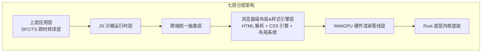
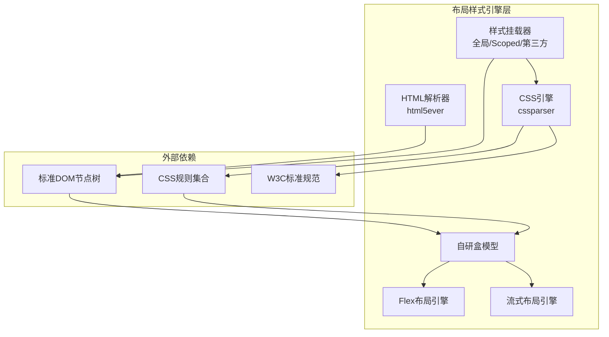
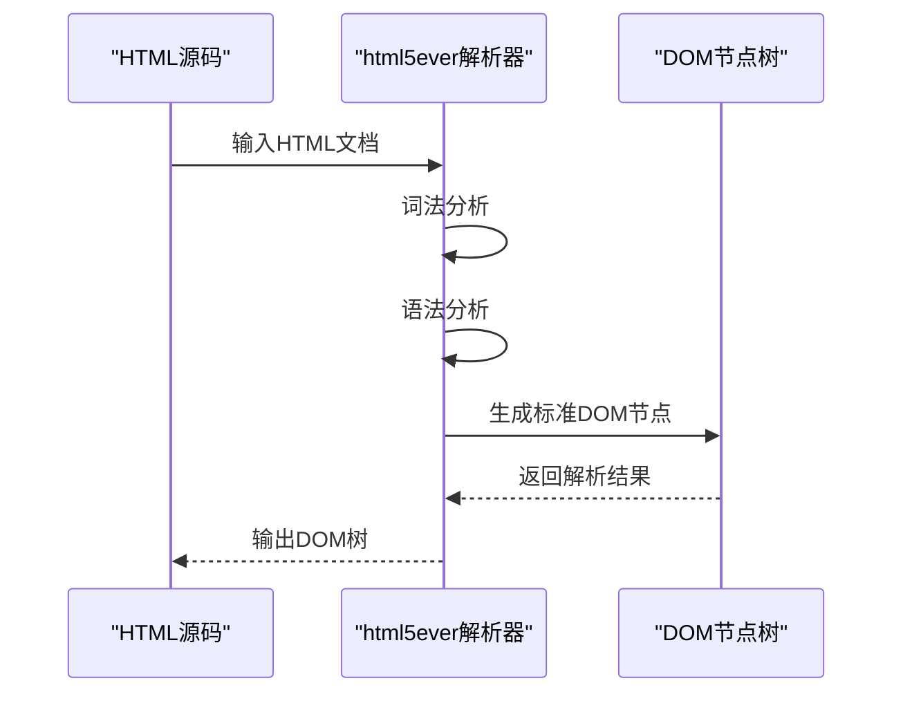
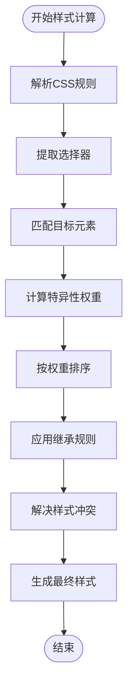
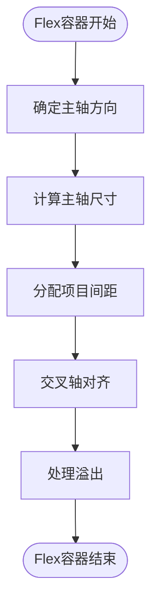
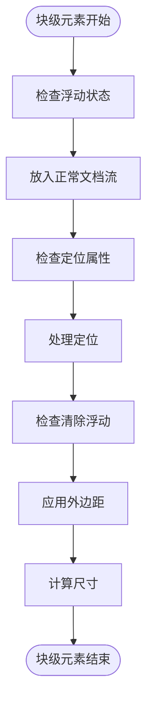
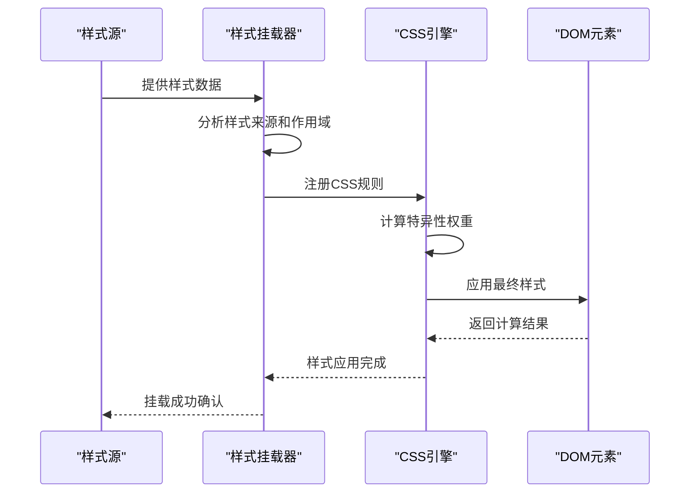
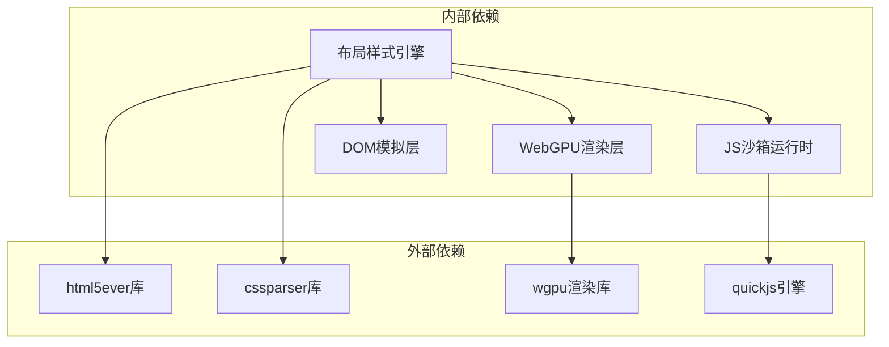

# 布局样式系统

<cite>
**本文档引用的文件**
- [doc.txt](file://doc.txt)
- [todo.txt](file://todo.txt)
</cite>

## 目录
1. [引言](#引言)
2. [项目结构](#项目结构)
3. [核心组件](#核心组件)
4. [架构概览](#架构概览)
5. [详细组件分析](#详细组件分析)
6. [依赖关系分析](#依赖关系分析)
7. [性能考虑](#性能考虑)
8. [故障排除指南](#故障排除指南)
9. [结论](#结论)

## 引言

Leivue Runtime是一个基于Rust和WebGPU的下一代无构建前端运行时引擎。其布局样式系统是整个架构的核心组成部分，负责实现浏览器级别的HTML解析、CSS引擎设计和样式计算流程。

该项目的核心使命是：
- 提供完全脱离Node/浏览器DOM/编译打包的原生双端运行解决方案
- 为Vue生态系统提供高性能跨端底座
- 消灭前端工程化，突破浏览器沙箱限制

## 项目结构

根据项目文档，布局样式系统位于七层分层架构的第四个层级，即"浏览器级布局&样式引擎层"。该层负责复刻标准浏览器CSS体系，对标Chromium基础能力。

**图表来源**
- [doc.txt:7-22](file://doc.txt#L7-L22)

**章节来源**
- [doc.txt:7-22](file://doc.txt#L7-L22)

## 核心组件

布局样式系统包含以下核心组件：

### 1. HTML解析器
- **实现技术**: html5ever工业级解析
- **功能**: 生成标准DOM节点树
- **特点**: 符合HTML5标准，支持完整的HTML5语义

### 2. CSS引擎
- **实现技术**: cssparser解析
- **功能**: 
  - 选择器匹配
  - 样式继承
  - 权重计算
  - 标准CSS语法支持

### 3. 布局系统
- **盒模型**: 自研实现，对标W3C标准
- **Flex布局**: 完整实现Flexbox规范
- **流式布局**: 支持传统的块级和内联布局

### 4. 样式挂载机制
- **全局样式**: 应用到整个应用的样式
- **Scoped样式**: 作用域限定的样式
- **第三方UI库CSS**: 全局注入支持Element Plus、Ant Design Vue等

**章节来源**
- [doc.txt:35-40](file://doc.txt#L35-L40)

## 架构概览

布局样式系统采用模块化设计，各组件之间通过清晰的接口进行交互：

**图表来源**
- [doc.txt:35-40](file://doc.txt#L35-L40)

## 详细组件分析

### HTML解析器 (html5ever)

HTML解析器负责将HTML文档转换为标准的DOM节点树，这是整个布局样式的起点。

#### 核心功能
- **工业级解析**: 支持完整的HTML5语法
- **标准DOM生成**: 生成符合W3C标准的DOM节点树
- **错误恢复**: 在遇到不规范HTML时进行智能恢复

#### 处理流程

**图表来源**
- [doc.txt:36](file://doc.txt#L36)

### CSS引擎 (cssparser)

CSS引擎是布局样式系统的核心，负责解析CSS规则、匹配选择器并计算最终样式。

#### 主要组件

##### 1. 选择器匹配引擎
- 支持所有标准CSS选择器
- 包含后代选择器、子选择器、相邻兄弟选择器等
- 实现了高效的匹配算法

##### 2. 样式继承系统
- 自动处理可继承属性
- 支持从父元素向子元素传递样式
- 处理继承优先级和覆盖规则

##### 3. 权重计算引擎
- 实现CSS特异性计算
- 处理!important声明
- 支持层叠规则

#### 样式计算流程

**图表来源**
- [doc.txt:37-38](file://doc.txt#L37-L38)

### 自研盒模型

盒模型是CSS布局的基础概念，Leivue Runtime实现了完整的盒模型系统。

#### 盒模型要素
- **内容区域 (content)**: 实际内容显示区域
- **内边距 (padding)**: 内容与边框之间的空间
- **边框 (border)**: 包围内容和内边距的边线
- **外边距 (margin)**: 盒子与其他元素之间的距离

#### 实现特性
- 完全符合W3C标准
- 支持box-sizing属性
- 正确处理负外边距
- 支持百分比尺寸计算

### Flex布局引擎

Flex布局是现代CSS布局的重要组成部分，系统提供了完整的Flexbox实现。

#### 支持的属性
- **容器属性**: flex-direction、justify-content、align-items、align-content
- **项目属性**: order、flex-grow、flex-shrink、flex-basis、align-self

#### 布局算法

### 流式布局引擎

传统的流式布局仍然在现代Web开发中广泛使用，系统提供了完整的流式布局支持。

#### 关键概念
- **块级元素**: 独占一行的元素
- **内联元素**: 不换行的元素
- **浮动**: 元素脱离正常文档流
- **定位**: 绝对定位、相对定位等

#### 布局流程

### 样式挂载机制

样式挂载系统负责将不同来源的样式正确应用到DOM元素上。

#### 样式来源分类

##### 1. 全局样式
- 应用到整个应用程序
- 通常包含基础样式和主题变量
- 优先级相对较低

##### 2. Scoped样式
- 作用于特定组件或页面
- 通过作用域标识符避免样式冲突
- 支持深度选择器

##### 3. 第三方UI库CSS
- 支持Element Plus、Ant Design Vue等
- 自动注入和管理
- 处理版本兼容性

#### 挂载流程

**图表来源**
- [doc.txt:39-40](file://doc.txt#L39-L40)

## 依赖关系分析

布局样式系统与其他系统组件存在密切的依赖关系：

**图表来源**
- [doc.txt:23-30](file://doc.txt#L23-L30)

**章节来源**
- [doc.txt:23-30](file://doc.txt#L23-L30)

## 性能考虑

布局样式系统在设计时充分考虑了性能优化：

### 1. 渲染性能
- **WebGPU硬件加速**: 利用GPU进行图形渲染
- **批渲染优化**: 减少状态切换开销
- **矢量绘制**: 支持高质量图形输出

### 2. 内存管理
- **Rust内存安全**: 零GC开销
- **内存池**: 预分配和复用内存
- **垃圾回收**: 手动内存管理

### 3. 计算效率
- **增量布局**: 只重新计算受影响的区域
- **缓存策略**: 缓存解析结果和计算中间值
- **并发处理**: 利用多核处理器优势

## 故障排除指南

### 常见问题及解决方案

#### 1. 样式不生效
- **检查选择器优先级**: 确认特异性权重计算正确
- **验证样式作用域**: 检查Scoped样式的应用范围
- **调试CSS规则**: 使用浏览器开发者工具检查规则匹配

#### 2. 布局异常
- **盒模型问题**: 检查box-sizing属性设置
- **Flex布局问题**: 验证Flex属性组合
- **流式布局问题**: 检查浮动和清除设置

#### 3. 性能问题
- **监控渲染帧率**: 使用性能分析工具
- **优化样式复杂度**: 减少复杂的CSS选择器
- **检查内存泄漏**: 监控内存使用情况

**章节来源**
- [doc.txt:83-97](file://doc.txt#L83-L97)

## 结论

Leivue Runtime的布局样式系统代表了现代前端技术的发展方向，它结合了：

1. **标准兼容性**: 完全对标Chromium的浏览器级能力
2. **性能优化**: 基于WebGPU的硬件加速渲染
3. **跨端支持**: 统一的双端运行体验
4. **生态兼容**: 完整支持Vue生态系统

该系统通过模块化的架构设计，为开发者提供了强大而灵活的布局样式解决方案，同时保持了优秀的性能表现和开发体验。

随着项目的进一步发展，布局样式系统将继续演进，为构建高性能的跨端应用提供坚实的技术基础。