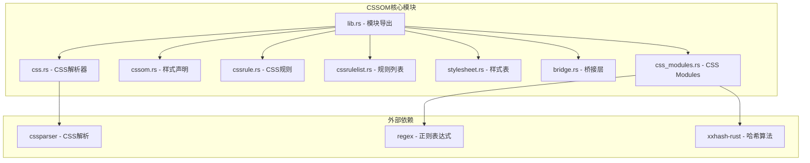
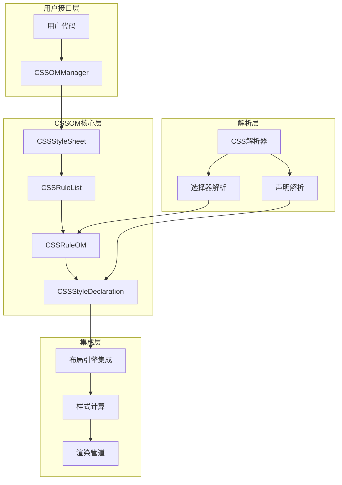
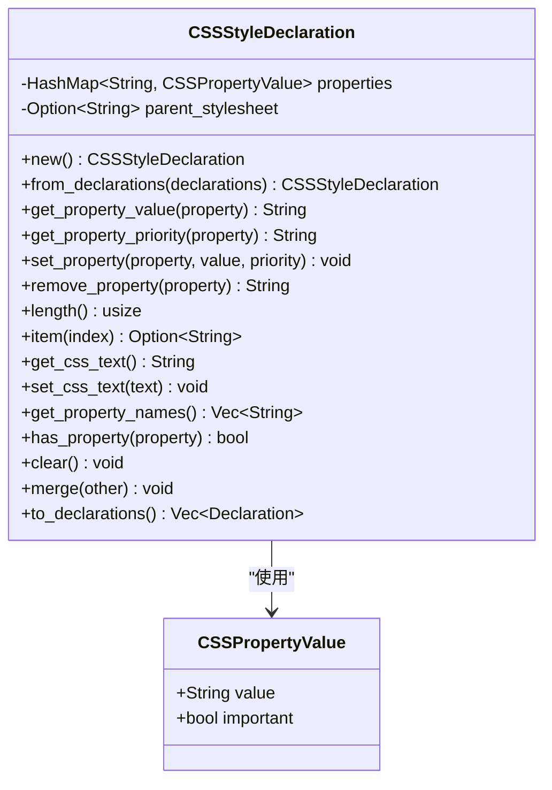
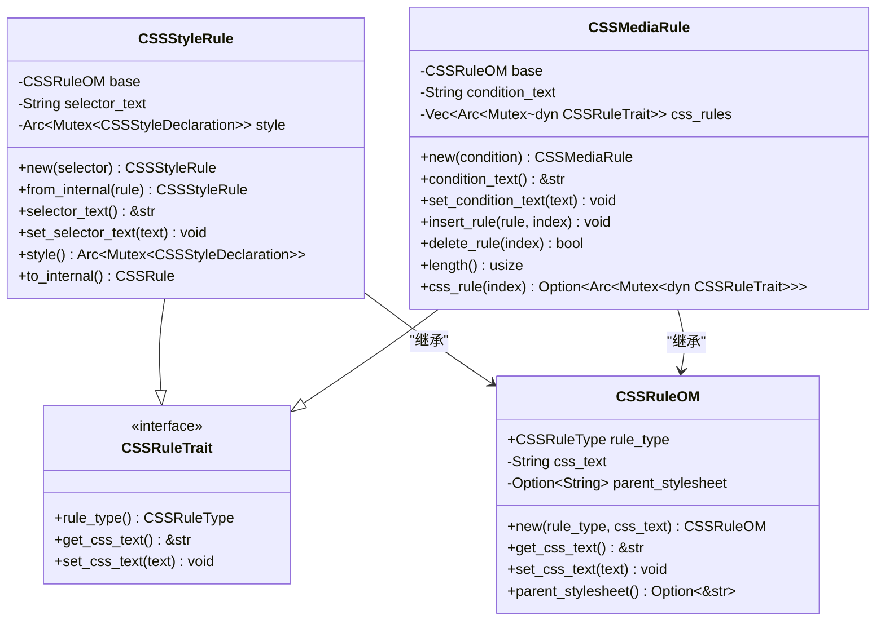
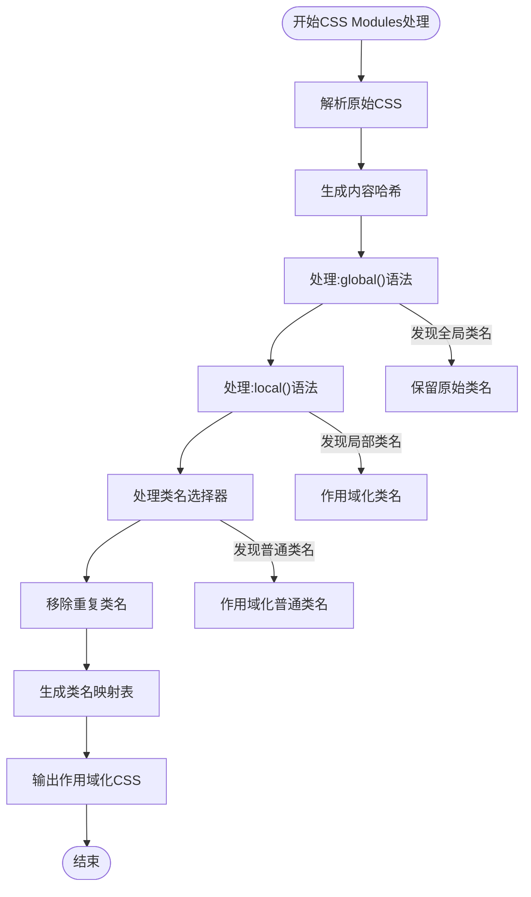
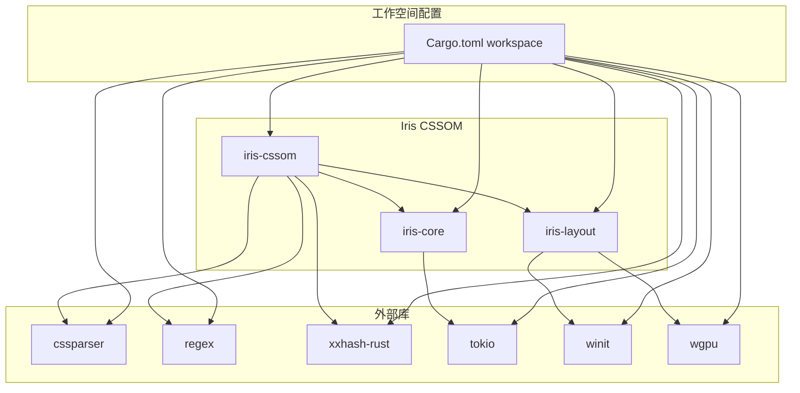

# CSS对象模型系统

<cite>
**本文档引用的文件**
- [lib.rs](file://crates/iris-cssom/src/lib.rs)
- [cssom.rs](file://crates/iris-cssom/src/cssom.rs)
- [css.rs](file://crates/iris-cssom/src/css.rs)
- [cssrule.rs](file://crates/iris-cssom/src/cssrule.rs)
- [cssrulelist.rs](file://crates/iris-cssom/src/cssrulelist.rs)
- [stylesheet.rs](file://crates/iris-cssom/src/stylesheet.rs)
- [bridge.rs](file://crates/iris-cssom/src/bridge.rs)
- [css_modules.rs](file://crates/iris-cssom/src/css_modules.rs)
- [Cargo.toml](file://crates/iris-cssom/Cargo.toml)
- [Cargo.toml](file://Cargo.toml)
</cite>

## 目录
1. [简介](#简介)
2. [项目结构](#项目结构)
3. [核心组件](#核心组件)
4. [架构概览](#架构概览)
5. [详细组件分析](#详细组件分析)
6. [依赖关系分析](#依赖关系分析)
7. [性能考虑](#性能考虑)
8. [故障排除指南](#故障排除指南)
9. [结论](#结论)

## 简介

Iris CSS对象模型系统（CSSOM）是Iris渲染引擎的核心组件之一，负责处理CSS解析、样式计算和Web兼容的CSS对象模型API。该系统实现了完整的CSS对象模型标准，包括CSS解析器、选择器匹配、CSS规则管理、样式声明操作以及与布局引擎的桥接集成。

系统的主要目标是为Vue单文件组件提供完整的CSS处理能力，支持现代CSS特性如CSS Modules、媒体查询、关键帧动画等，同时确保与Web标准的兼容性。

## 项目结构



**图表来源**
- [lib.rs:39-59](file://crates/iris-cssom/src/lib.rs#L39-L59)
- [Cargo.toml:11-15](file://crates/iris-cssom/Cargo.toml#L11-L15)

**章节来源**
- [lib.rs:1-60](file://crates/iris-cssom/src/lib.rs#L1-L60)
- [Cargo.toml:1-34](file://Cargo.toml#L1-L34)

## 核心组件

### CSS解析器模块
CSS解析器负责将CSS文本转换为内部数据结构，支持基本的CSS语法解析和选择器类型识别。

### 样式声明模块
实现Web标准的CSSStyleDeclaration API，提供对单个CSS声明块的操作能力，包括属性设置、获取、删除等操作。

### CSS规则模块
实现各种CSS规则类型，包括样式规则、媒体查询规则、关键帧规则等，支持规则的嵌套和组合。

### 样式表模块
提供CSSStyleSheet API的完整实现，管理规则列表、插入删除规则、样式表操作等功能。

### 桥接层模块
连接CSSOM与布局引擎，提供多样式表管理和集成接口。

### CSS Modules模块
实现CSS Modules功能，支持类名作用域化、`:local()`和`:global()`语法等现代CSS特性。

**章节来源**
- [css.rs:1-437](file://crates/iris-cssom/src/css.rs#L1-L437)
- [cssom.rs:1-444](file://crates/iris-cssom/src/cssom.rs#L1-L444)
- [cssrule.rs:1-338](file://crates/iris-cssom/src/cssrule.rs#L1-L338)
- [stylesheet.rs:1-437](file://crates/iris-cssom/src/stylesheet.rs#L1-L437)
- [bridge.rs:1-210](file://crates/iris-cssom/src/bridge.rs#L1-L210)
- [css_modules.rs:1-287](file://crates/iris-cssom/src/css_modules.rs#L1-L287)

## 架构概览



**图表来源**
- [bridge.rs:8-28](file://crates/iris-cssom/src/bridge.rs#L8-L28)
- [stylesheet.rs:10-37](file://crates/iris-cssom/src/stylesheet.rs#L10-L37)
- [cssrule.rs:25-36](file://crates/iris-cssom/src/cssrule.rs#L25-L36)

## 详细组件分析

### CSSStyleDeclaration组件分析

CSSStyleDeclaration是CSS对象模型的核心组件，实现了Web标准的CSSStyleDeclaration接口。



**图表来源**
- [cssom.rs:20-37](file://crates/iris-cssom/src/cssom.rs#L20-L37)

#### 核心功能特性

1. **属性管理**: 提供完整的CSS属性读写操作
2. **优先级处理**: 支持!important优先级标记
3. **CSS文本转换**: 支持CSS声明块的序列化和反序列化
4. **合并机制**: 支持与其他样式声明的智能合并

**章节来源**
- [cssom.rs:39-357](file://crates/iris-cssom/src/cssom.rs#L39-L357)

### CSSRule组件分析

CSSRule系统实现了多种CSS规则类型，支持复杂的CSS规则层次结构。



**图表来源**
- [cssrule.rs:25-85](file://crates/iris-cssom/src/cssrule.rs#L25-L85)
- [cssrule.rs:146-166](file://crates/iris-cssom/src/cssrule.rs#L146-L166)

#### 规则类型支持

1. **样式规则**: 标准的CSS选择器+声明块规则
2. **媒体规则**: @media查询规则，支持嵌套规则
3. **关键帧规则**: @keyframes动画规则
4. **导入规则**: @import资源导入规则

**章节来源**
- [cssrule.rs:8-338](file://crates/iris-cssom/src/cssrule.rs#L8-L338)

### CSSStyleSheet组件分析

CSSStyleSheet提供了完整的样式表管理功能，是CSSOM系统的入口点。

```mermaid
sequenceDiagram
participant Client as 客户端代码
participant Manager as CSSOMManager
participant Sheet as CSSStyleSheet
participant Parser as CSS解析器
participant List as CSSRuleList
Client->>Manager : add_stylesheet_from_css("main", css_text)
Manager->>Sheet : 创建样式表实例
Sheet->>Parser : parse_stylesheet(css_text)
Parser-->>Sheet : 返回内部样式表
Sheet->>List : 转换为CSSRuleList
List-->>Manager : 返回规则列表
Client->>Manager : insert_rule_to_sheet("main", ".class { color : red; }", 0)
Manager->>Sheet : insert_rule(rule, index)
Sheet->>Parser : 解析单条规则
Parser-->>Sheet : 返回CSSRule
Sheet->>List : 插入规则
List-->>Manager : 返回索引
```

**图表来源**
- [bridge.rs:48-57](file://crates/iris-cssom/src/bridge.rs#L48-L57)
- [stylesheet.rs:186-213](file://crates/iris-cssom/src/stylesheet.rs#L186-L213)

#### 核心操作流程

1. **样式表创建**: 支持从CSS文本直接创建
2. **规则管理**: 插入、删除、替换CSS规则
3. **样式表集成**: 提供与布局引擎的集成接口

**章节来源**
- [stylesheet.rs:53-336](file://crates/iris-cssom/src/stylesheet.rs#L53-L336)

### CSSModules组件分析

CSS Modules功能实现了类名作用域化，支持现代前端开发的模块化需求。



**图表来源**
- [css_modules.rs:64-122](file://crates/iris-cssom/src/css_modules.rs#L64-L122)

#### 核心处理逻辑

1. **哈希生成**: 基于CSS内容生成稳定哈希值
2. **语法处理**: 解析`:local()`和`:global()`特殊语法
3. **类名作用域化**: 自动为类名添加哈希后缀
4. **映射生成**: 创建原始类名到作用域化类名的映射表

**章节来源**
- [css_modules.rs:42-162](file://crates/iris-cssom/src/css_modules.rs#L42-L162)

## 依赖关系分析



**图表来源**
- [Cargo.toml:1-34](file://Cargo.toml#L1-L34)
- [Cargo.toml:11-15](file://crates/iris-cssom/Cargo.toml#L11-L15)

### 内部依赖关系

Iris CSSOM系统采用模块化设计，各组件之间保持松耦合：

1. **核心依赖**: 依赖iris-core提供基础框架
2. **解析依赖**: 使用cssparser进行标准CSS解析
3. **工具依赖**: 使用regex和xxhash-rust提供正则匹配和哈希计算

### 外部依赖关系

系统通过工作空间配置统一管理依赖版本，确保各组件间的兼容性。

**章节来源**
- [Cargo.toml:13-34](file://Cargo.toml#L13-L34)
- [Cargo.toml:11-15](file://crates/iris-cssom/Cargo.toml#L11-L15)

## 性能考虑

### 数据结构优化

1. **HashMap选择**: 使用HashMap存储CSS属性，提供O(1)的平均访问时间
2. **Arc/Mutex并发**: 在需要线程安全的场景使用Arc<Mutex<T>>模式
3. **延迟初始化**: 按需创建和初始化组件，减少内存占用

### 解析性能

1. **正则表达式缓存**: 使用LazyLock缓存编译后的正则表达式
2. **哈希算法优化**: 使用xxh3算法提供高性能的64位哈希
3. **选择器解析优化**: 预先解析和缓存选择器类型信息

### 内存管理

1. **智能指针使用**: 合理使用Arc和Rc避免不必要的数据复制
2. **规则列表优化**: 使用Vec存储规则，提供高效的随机访问
3. **字符串处理**: 使用String进行可变字符串操作，避免频繁分配

## 故障排除指南

### 常见问题及解决方案

1. **CSS解析错误**
   - 检查CSS语法是否符合标准
   - 验证选择器格式是否正确
   - 确认声明块格式是否完整

2. **样式声明冲突**
   - 检查!important优先级使用
   - 验证样式声明的覆盖顺序
   - 确认CSS Modules类名作用域化

3. **规则插入失败**
   - 验证索引位置是否有效
   - 检查样式表是否被禁用
   - 确认CSS规则格式是否正确

### 调试建议

1. **启用详细日志**: 在开发环境中启用调试输出
2. **单元测试**: 运行完整的测试套件验证功能
3. **性能监控**: 使用性能分析工具检测瓶颈

**章节来源**
- [cssom.rs:365-444](file://crates/iris-cssom/src/cssom.rs#L365-L444)
- [cssrule.rs:290-338](file://crates/iris-cssom/src/cssrule.rs#L290-L338)
- [stylesheet.rs:344-437](file://crates/iris-cssom/src/stylesheet.rs#L344-L437)

## 结论

Iris CSS对象模型系统是一个功能完整、设计合理的CSS处理框架。系统实现了Web标准的CSS对象模型API，提供了现代化的CSS特性支持，包括CSS Modules、媒体查询、关键帧动画等。

### 主要优势

1. **标准化实现**: 完整实现Web标准的CSSOM API
2. **模块化设计**: 组件间松耦合，易于维护和扩展
3. **性能优化**: 采用多种优化策略提升运行效率
4. **现代特性**: 支持最新的CSS特性和最佳实践

### 技术特色

1. **灵活的解析器**: 支持标准CSS语法和扩展特性
2. **强大的规则系统**: 支持复杂的CSS规则层次结构
3. **智能的样式管理**: 提供完整的样式声明操作能力
4. **无缝的集成**: 与布局引擎和渲染管道深度集成

该系统为Iris渲染引擎提供了坚实的CSS处理基础，为构建高性能的现代Web应用奠定了重要基础。