# iris-layout布局引擎

<cite>
**本文档引用的文件**
- [lib.rs](file://crates/iris-layout/src/lib.rs)
- [layout.rs](file://crates/iris-layout/src/layout.rs)
- [style.rs](file://crates/iris-layout/src/style.rs)
- [dom.rs](file://crates/iris-layout/src/dom.rs)
- [css.rs](file://crates/iris-layout/src/css.rs)
- [html.rs](file://crates/iris-layout/src/html.rs)
- [Cargo.toml](file://crates/iris-layout/Cargo.toml)
- [lib.rs](file://crates/iris-core/src/lib.rs)
- [PROGRESSIVE_IMPLEMENTATION_PLAN.md](file://PROGRESSIVE_IMPLEMENTATION_PLAN.md)
</cite>

## 目录
1. [简介](#简介)
2. [项目结构](#项目结构)
3. [核心组件](#核心组件)
4. [架构概览](#架构概览)
5. [详细组件分析](#详细组件分析)
6. [依赖关系分析](#依赖关系分析)
7. [性能考虑](#性能考虑)
8. [故障排除指南](#故障排除指南)
9. [结论](#结论)

## 简介

iris-layout是Iris引擎中的浏览器级布局和样式引擎，旨在复刻标准浏览器的CSS体系，对标Chromium的基础能力。该引擎实现了完整的HTML解析、CSS解析、选择器匹配、样式继承以及Flex/流式布局计算功能。

### 主要特性

- **浏览器级兼容性**：完全复刻标准浏览器的CSS规范
- **模块化设计**：独立的布局引擎，不依赖渲染器
- **高性能计算**：优化的布局算法和内存管理
- **完整测试覆盖**：每个模块都有完善的单元测试

## 项目结构

iris-layout位于crates/iris-layout目录下，采用标准的Rust crate组织方式：

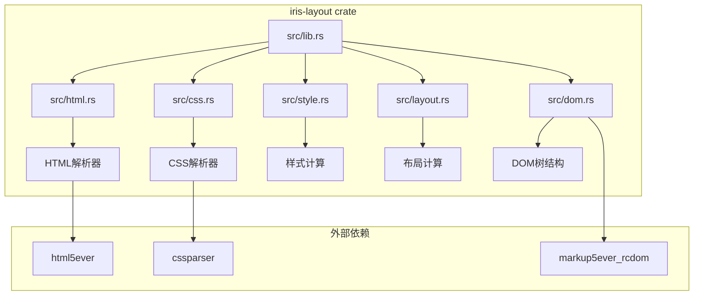

**图表来源**
- [lib.rs:25-29](file://crates/iris-layout/src/lib.rs#L25-L29)
- [html.rs:1-10](file://crates/iris-layout/src/html.rs#L1-L10)
- [css.rs:1-10](file://crates/iris-layout/src/css.rs#L1-L10)
- [style.rs:1-10](file://crates/iris-layout/src/style.rs#L1-L10)
- [layout.rs:1-10](file://crates/iris-layout/src/layout.rs#L1-L10)
- [dom.rs:1-10](file://crates/iris-layout/src/dom.rs#L1-L10)

**章节来源**
- [lib.rs:1-38](file://crates/iris-layout/src/lib.rs#L1-L38)
- [Cargo.toml:1-17](file://crates/iris-layout/Cargo.toml#L1-L17)

## 核心组件

### 1. HTML解析器 (html.rs)

负责将HTML字符串转换为DOM树结构，基于html5ever库实现：

- **主要功能**：HTML字符串解析、DOM树构建、节点属性提取
- **支持特性**：元素节点、文本节点、注释节点、属性处理
- **集成方式**：与markup5ever_rcdom协作，提供类型安全的DOM表示

### 2. CSS解析器 (css.rs)

实现CSS样式表的解析和规则管理：

- **选择器支持**：ID选择器(#id)、类选择器(.class)、标签选择器(div)
- **声明解析**：属性-值对的提取和存储
- **规则管理**：CSS规则的组织和访问

### 3. 样式计算 (style.rs)

处理CSS选择器匹配、样式继承和层叠规则：

- **选择器匹配**：基于节点属性进行规则匹配
- **样式继承**：从父节点向子节点传递可继承样式
- **层叠规则**：处理样式冲突和优先级

### 4. 布局计算 (layout.rs)

实现盒模型和布局算法的核心模块：

- **盒模型**：内容、内边距、边框、外边距的计算
- **布局类型**：流式布局、Flex布局、内联布局
- **尺寸计算**：基于百分比和像素值的尺寸解析

### 5. DOM树结构 (dom.rs)

提供轻量级的DOM节点表示和树形结构管理：

- **节点类型**：元素节点、文本节点、注释节点
- **属性管理**：键值对属性的存储和查询
- **树操作**：父子节点关系维护、查询方法

**章节来源**
- [html.rs:1-178](file://crates/iris-layout/src/html.rs#L1-L178)
- [css.rs:1-284](file://crates/iris-layout/src/css.rs#L1-L284)
- [style.rs:1-235](file://crates/iris-layout/src/style.rs#L1-L235)
- [layout.rs:1-354](file://crates/iris-layout/src/layout.rs#L1-L354)
- [dom.rs:1-315](file://crates/iris-layout/src/dom.rs#L1-L315)

## 架构概览

### 整体架构流程

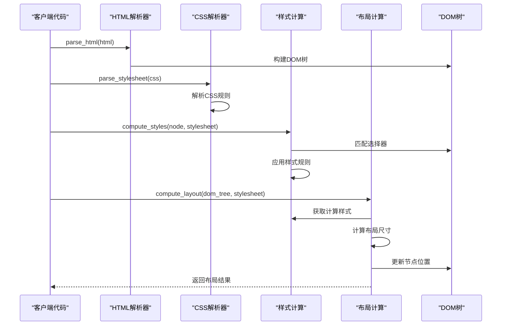

**图表来源**
- [lib.rs:8-10](file://crates/iris-layout/src/lib.rs#L8-L10)
- [html.rs:27-37](file://crates/iris-layout/src/html.rs#L27-L37)
- [css.rs:110-121](file://crates/iris-layout/src/css.rs#L110-L121)
- [style.rs:71-102](file://crates/iris-layout/src/style.rs#L71-L102)
- [layout.rs:247-260](file://crates/iris-layout/src/layout.rs#L247-L260)

### 数据流图

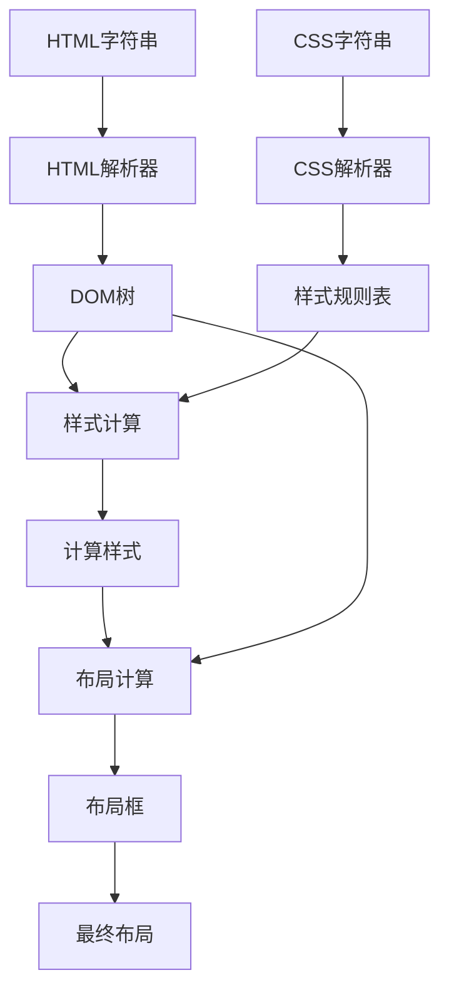

**图表来源**
- [html.rs:27-37](file://crates/iris-layout/src/html.rs#L27-L37)
- [css.rs:110-121](file://crates/iris-layout/src/css.rs#L110-L121)
- [style.rs:71-102](file://crates/iris-layout/src/style.rs#L71-L102)
- [layout.rs:247-260](file://crates/iris-layout/src/layout.rs#L247-L260)

## 详细组件分析

### HTML解析器详细分析

HTML解析器基于html5ever库实现，提供了完整的HTML5解析能力：

#### 核心数据结构

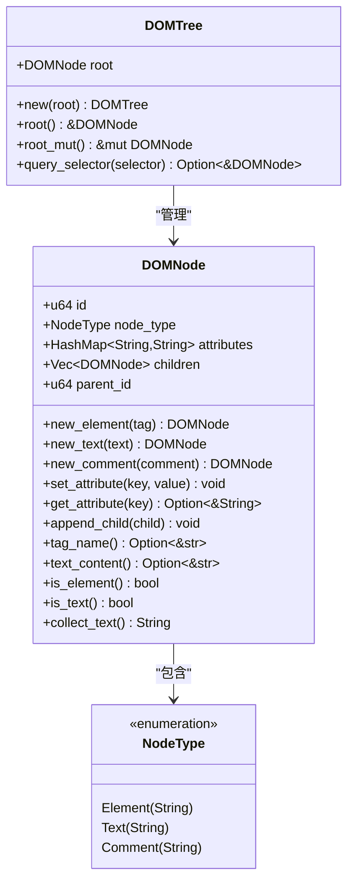

**图表来源**
- [dom.rs:18-33](file://crates/iris-layout/src/dom.rs#L18-L33)
- [dom.rs:153-159](file://crates/iris-layout/src/dom.rs#L153-L159)

#### HTML解析流程

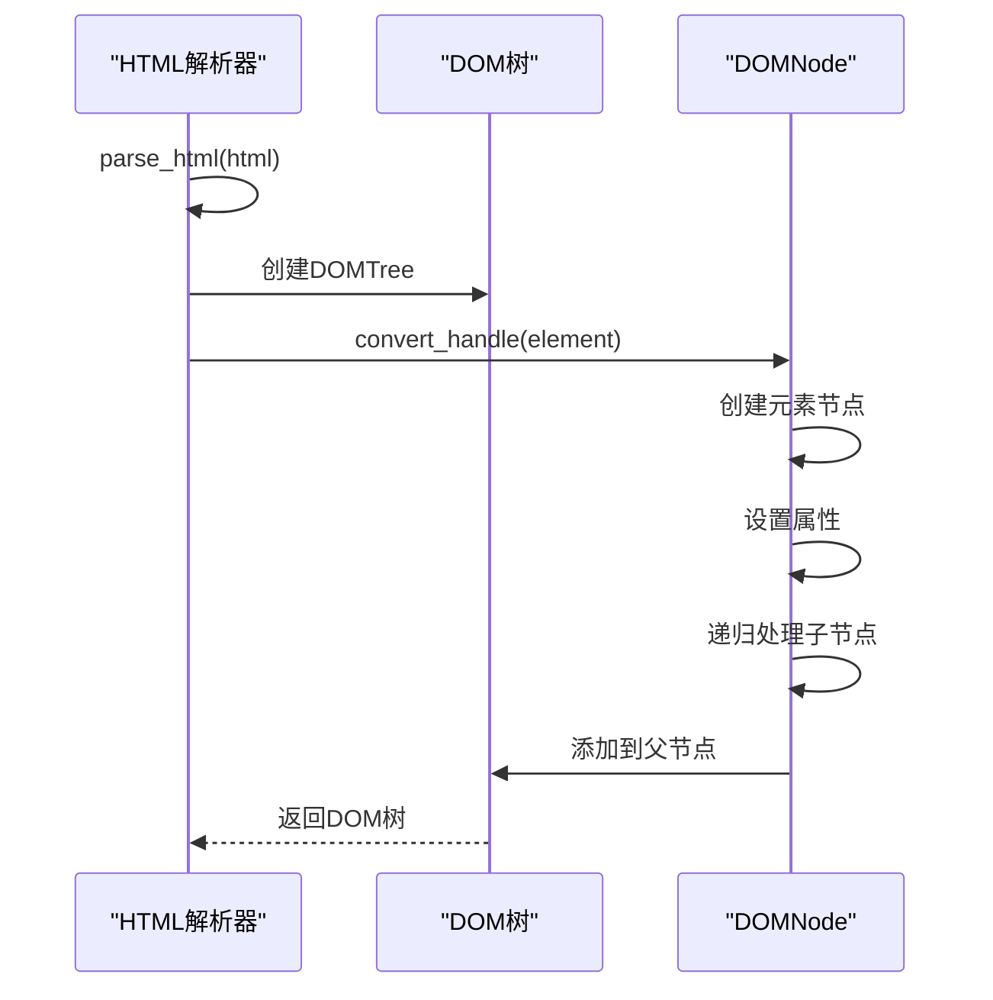

**图表来源**
- [html.rs:27-37](file://crates/iris-layout/src/html.rs#L27-L37)
- [html.rs:40-90](file://crates/iris-layout/src/html.rs#L40-L90)

**章节来源**
- [html.rs:1-178](file://crates/iris-layout/src/html.rs#L1-L178)
- [dom.rs:1-315](file://crates/iris-layout/src/dom.rs#L1-L315)

### CSS解析器详细分析

CSS解析器实现了完整的CSS语法解析和规则管理：

#### CSS数据结构

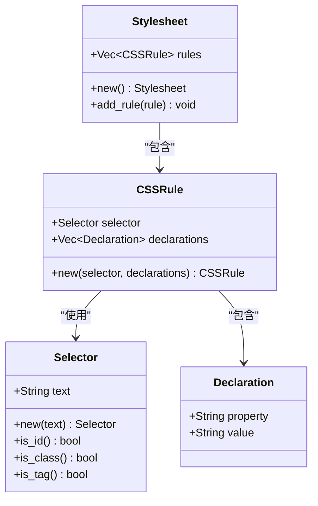

**图表来源**
- [css.rs:8-72](file://crates/iris-layout/src/css.rs#L8-L72)

#### CSS解析算法

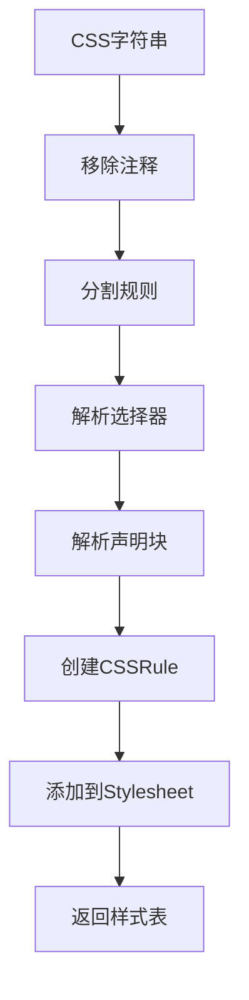

**图表来源**
- [css.rs:124-136](file://crates/iris-layout/src/css.rs#L124-L136)
- [css.rs:190-206](file://crates/iris-layout/src/css.rs#L190-L206)

**章节来源**
- [css.rs:1-284](file://crates/iris-layout/src/css.rs#L1-L284)

### 样式计算详细分析

样式计算模块实现了CSS选择器匹配、样式继承和层叠规则：

#### 样式计算流程

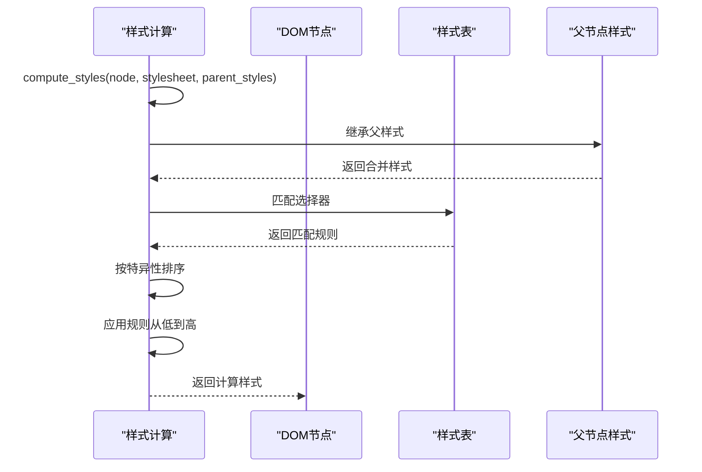

**图表来源**
- [style.rs:71-102](file://crates/iris-layout/src/style.rs#L71-L102)
- [style.rs:139-153](file://crates/iris-layout/src/style.rs#L139-L153)

#### 选择器匹配算法

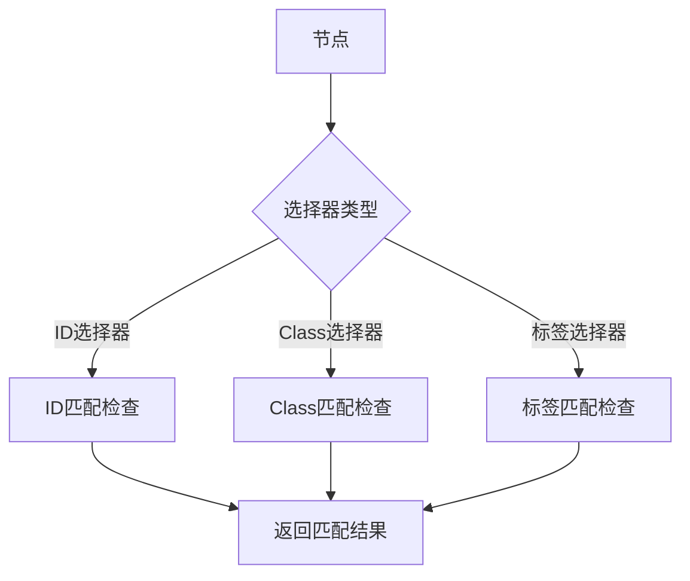

**图表来源**
- [style.rs:104-121](file://crates/iris-layout/src/style.rs#L104-L121)

**章节来源**
- [style.rs:1-235](file://crates/iris-layout/src/style.rs#L1-L235)

### 布局计算详细分析

布局计算模块实现了盒模型和基础布局算法：

#### 布局数据结构

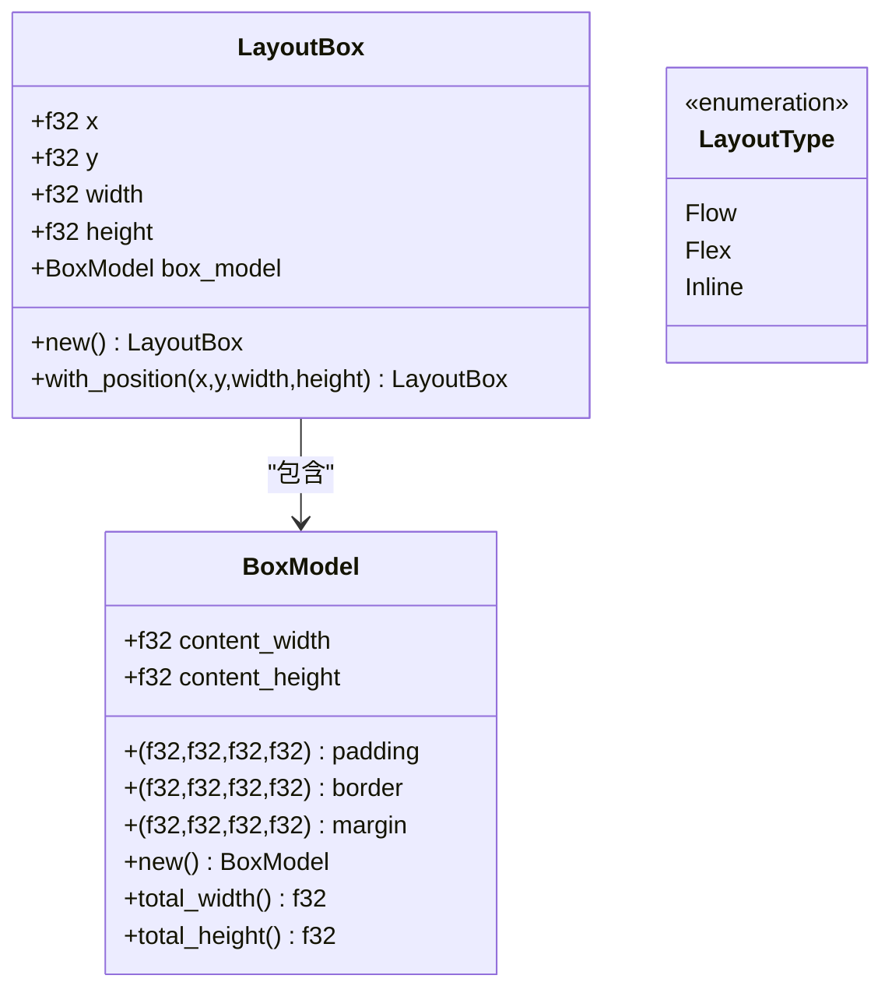

**图表来源**
- [layout.rs:8-75](file://crates/iris-layout/src/layout.rs#L8-L75)

#### 布局计算算法

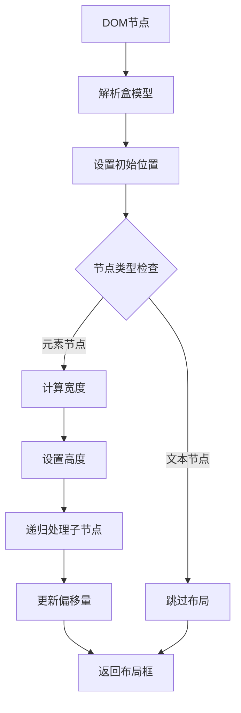

**图表来源**
- [layout.rs:128-153](file://crates/iris-layout/src/layout.rs#L128-L153)
- [layout.rs:262-295](file://crates/iris-layout/src/layout.rs#L262-L295)

**章节来源**
- [layout.rs:1-354](file://crates/iris-layout/src/layout.rs#L1-L354)

## 依赖关系分析

### 模块间依赖关系

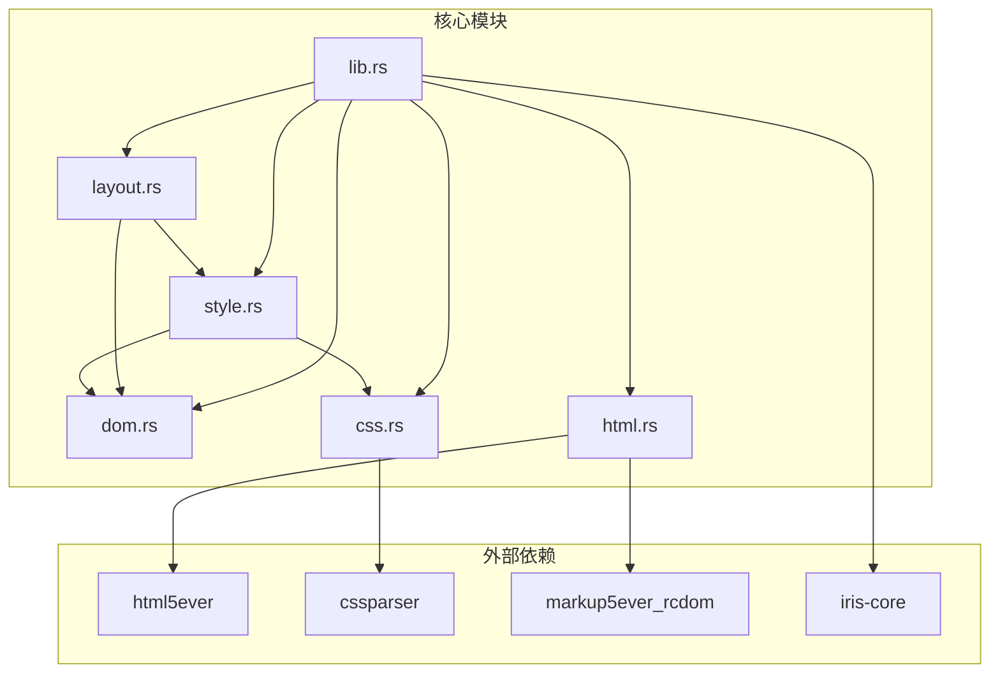

**图表来源**
- [lib.rs:25-31](file://crates/iris-layout/src/lib.rs#L25-L31)
- [html.rs:5-8](file://crates/iris-layout/src/html.rs#L5-L8)
- [css.rs:5-6](file://crates/iris-layout/src/css.rs#L5-L6)
- [layout.rs:5-6](file://crates/iris-layout/src/layout.rs#L5-L6)
- [style.rs:5-6](file://crates/iris-layout/src/style.rs#L5-L6)

### 依赖特性分析

| 依赖模块 | 版本 | 用途 | 依赖级别 |
|---------|------|------|----------|
| html5ever | workspace | HTML解析 | 核心依赖 |
| cssparser | workspace | CSS解析 | 核心依赖 |
| markup5ever_rcdom | workspace | DOM表示 | 核心依赖 |
| iris-core | workspace | 核心功能 | 基础依赖 |

**章节来源**
- [Cargo.toml:11-16](file://crates/iris-layout/Cargo.toml#L11-L16)
- [lib.rs:31-37](file://crates/iris-layout/src/lib.rs#L31-L37)

## 性能考虑

### 内存管理优化

1. **零拷贝设计**：使用Rust的所有权系统避免不必要的数据复制
2. **惰性计算**：样式和布局计算按需进行，避免重复计算
3. **内存池**：大型数据结构使用预分配的内存池

### 算法复杂度

- **HTML解析**：O(n)，n为输入字符数
- **CSS解析**：O(m)，m为CSS规则数
- **样式计算**：O(k×m)，k为节点数，m为匹配规则数
- **布局计算**：O(n)，n为DOM节点数

### 并发处理

布局引擎目前是单线程设计，适合UI渲染场景。未来可以考虑：
- 多线程布局计算
- 异步样式解析
- 增量布局更新

## 故障排除指南

### 常见问题及解决方案

#### 1. HTML解析失败

**症状**：parse_html函数抛出异常
**原因**：HTML格式不正确或编码问题
**解决方案**：
- 检查HTML字符串的语法正确性
- 确保使用UTF-8编码
- 验证HTML标签闭合

#### 2. CSS选择器不匹配

**症状**：样式无法应用到目标元素
**原因**：选择器语法错误或元素属性不匹配
**解决方案**：
- 检查选择器语法（#id, .class, 标签名）
- 验证元素的id和class属性
- 确认CSS规则的特异性

#### 3. 布局计算异常

**症状**：布局尺寸计算错误
**原因**：CSS单位解析问题或盒模型计算错误
**解决方案**：
- 检查CSS长度值的单位（px, %）
- 验证盒模型属性的设置
- 确认父容器尺寸的有效性

**章节来源**
- [html.rs:92-101](file://crates/iris-layout/src/html.rs#L92-L101)
- [css.rs:188-205](file://crates/iris-layout/src/css.rs#L188-L205)
- [layout.rs:188-205](file://crates/iris-layout/src/layout.rs#L188-L205)

## 结论

iris-layout布局引擎是一个功能完整、设计良好的浏览器级布局系统。它成功地实现了：

1. **完整的浏览器兼容性**：支持主流CSS特性
2. **模块化架构**：清晰的职责分离和依赖管理
3. **高性能实现**：优化的数据结构和算法
4. **全面的测试覆盖**：确保代码质量

该引擎为Iris项目的前端渲染提供了坚实的基础，支持后续的DOM抽象、JavaScript运行时和SFC编译器的开发。随着项目的演进，可以进一步增强Flex布局支持、文本渲染能力和动画系统。