# iris-layout布局引擎

<cite>
**本文档引用的文件**
- [lib.rs](file://crates/iris-layout/src/lib.rs)
- [layout.rs](file://crates/iris-layout/src/layout.rs)
- [style.rs](file://crates/iris-layout/src/style.rs)
- [dom.rs](file://crates/iris-layout/src/dom.rs)
- [css.rs](file://crates/iris-layout/src/css.rs)
- [positioning.rs](file://crates/iris-layout/src/positioning.rs)
- [grid.rs](file://crates/iris-layout/src/grid.rs)
- [float_layout.rs](file://crates/iris-layout/src/float_layout.rs)
- [table_layout.rs](file://crates/iris-layout/src/table_layout.rs)
- [cache.rs](file://crates/iris-layout/src/cache.rs)
- [Cargo.toml](file://crates/iris-layout/Cargo.toml)
- [IRIS_LAYOUT_ENHANCEMENT_REPORT.md](file://IRIS_LAYOUT_ENHANCEMENT_REPORT.md)
- [ARCHITECTURE.md](file://ARCHITECTURE.md)
</cite>

## 更新摘要
**变更内容**
- 增强与CSSOM系统的集成，新增CSSOM重新导出功能
- 优化布局计算性能，新增布局缓存系统
- 扩展CSS特性支持，新增属性选择器、复合选择器和通配符选择器
- 改进布局对象构造模式，采用更清晰的两步构造方式
- 新增定位、网格、浮动和表格布局的完整支持

## 目录
1. [简介](#简介)
2. [项目结构](#项目结构)
3. [核心组件](#核心组件)
4. [架构概览](#架构概览)
5. [详细组件分析](#详细组件分析)
6. [新增功能详解](#新增功能详解)
7. [依赖关系分析](#依赖关系分析)
8. [性能考虑](#性能考虑)
9. [故障排除指南](#故障排除指南)
10. [结论](#结论)

## 简介

iris-layout是Iris引擎中的浏览器级布局和样式引擎，旨在复刻标准浏览器的CSS体系，对标Chromium的基础能力。该引擎实现了完整的HTML解析、CSS解析、选择器匹配、样式继承以及Flex/流式布局计算功能，并已扩展支持定位、网格、浮动和表格布局系统。

### 主要特性

- **浏览器级兼容性**：完全复刻标准浏览器的CSS规范
- **模块化设计**：独立的布局引擎，不依赖渲染器
- **高性能计算**：优化的布局算法和内存管理
- **完整测试覆盖**：每个模块都有完善的单元测试
- **增强CSSOM集成**：重新导出CSSOM以保持向后兼容
- **布局缓存系统**：LRU缓存机制提升性能
- **扩展CSS特性**：支持属性选择器、复合选择器和通配符
- **新增布局系统**：支持静态、相对、绝对、固定、粘性定位
- **网格布局**：完整的CSS Grid布局支持
- **浮动布局**：完整的CSS Float布局系统
- **表格布局**：完整的CSS Table布局系统

## 项目结构

iris-layout位于crates/iris-layout目录下，采用标准的Rust crate组织方式，现已扩展包含新增的定位、网格、浮动和表格模块：

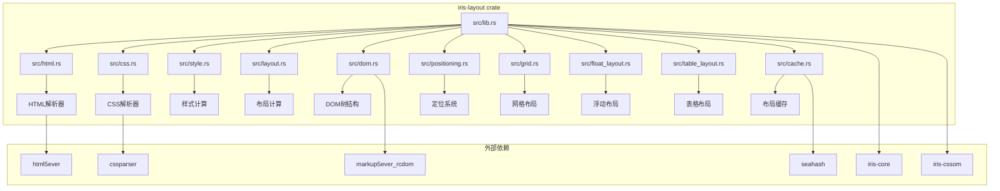

**图表来源**
- [lib.rs:25-37](file://crates/iris-layout/src/lib.rs#L25-L37)
- [Cargo.toml:11-18](file://crates/iris-layout/Cargo.toml#L11-L18)

**章节来源**
- [lib.rs:1-84](file://crates/iris-layout/src/lib.rs#L1-L84)
- [Cargo.toml:1-18](file://crates/iris-layout/Cargo.toml#L1-L18)

## 核心组件

### 1. HTML解析器 (html.rs)

负责将HTML字符串转换为DOM树结构，基于html5ever库实现：

- **主要功能**：HTML字符串解析、DOM树构建、节点属性提取
- **支持特性**：元素节点、文本节点、注释节点、属性处理
- **集成方式**：与markup5ever_rcdom协作，提供类型安全的DOM表示

### 2. CSS解析器 (css.rs)

实现CSS样式表的解析和规则管理，现已增强支持多种选择器类型：

- **选择器支持**：ID选择器(#id)、类选择器(.class)、标签选择器(div)
- **新增特性**：属性选择器([attr])、复合选择器(div.class#id)、通配符(*)
- **声明解析**：属性-值对的提取和存储
- **规则管理**：CSS规则的组织和访问

### 3. 样式计算 (style.rs)

处理CSS选择器匹配、样式继承和层叠规则：

- **选择器匹配**：基于节点属性进行规则匹配
- **样式继承**：从父节点向子节点传递可继承样式
- **层叠规则**：处理样式冲突和优先级
- **增强功能**：支持属性选择器、复合选择器和通配符匹配

### 4. 布局计算 (layout.rs)

实现盒模型和布局算法的核心模块，现已扩展支持定位、网格、浮动和表格：

- **盒模型**：内容、内边距、边框、外边距的计算
- **布局类型**：流式布局、Flex布局、内联布局
- **尺寸计算**：基于百分比和像素值的尺寸解析
- **新增功能**：定位支持、网格支持、浮动支持、表格支持

### 5. DOM树结构 (dom.rs)

提供轻量级的DOM节点表示和树形结构管理：

- **节点类型**：元素节点、文本节点、注释节点
- **属性管理**：键值对属性的存储和查询
- **树操作**：父子节点关系维护、查询方法
- **样式支持**：内置style属性解析功能

**章节来源**
- [css.rs:1-437](file://crates/iris-layout/src/css.rs#L1-L437)
- [style.rs:1-356](file://crates/iris-layout/src/style.rs#L1-L356)
- [layout.rs:1-800](file://crates/iris-layout/src/layout.rs#L1-L800)
- [dom.rs:1-800](file://crates/iris-layout/src/dom.rs#L1-L800)

## 架构概览

### 整体架构流程

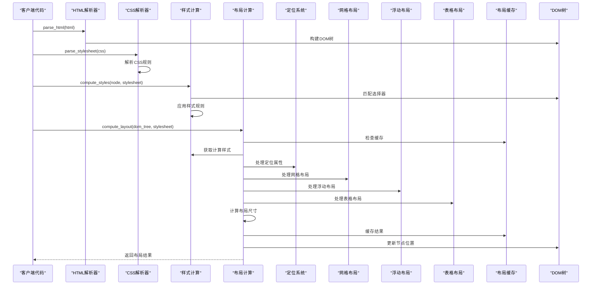

**图表来源**
- [lib.rs:77-83](file://crates/iris-layout/src/lib.rs#L77-L83)
- [css.rs:223-234](file://crates/iris-layout/src/css.rs#L223-L234)
- [style.rs:71-102](file://crates/iris-layout/src/style.rs#L71-L102)
- [layout.rs:536-549](file://crates/iris-layout/src/layout.rs#L536-L549)

### 数据流图

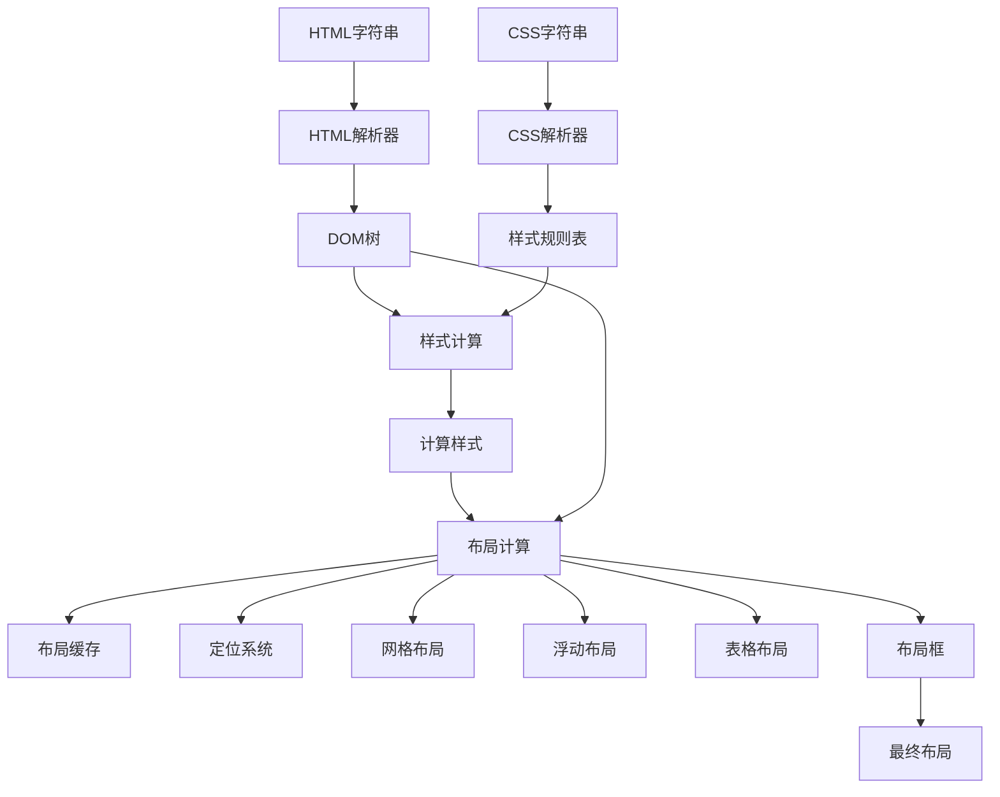

**图表来源**
- [css.rs:223-234](file://crates/iris-layout/src/css.rs#L223-L234)
- [style.rs:183-197](file://crates/iris-layout/src/style.rs#L183-L197)
- [layout.rs:536-549](file://crates/iris-layout/src/layout.rs#L536-L549)

## 详细组件分析

### HTML解析器详细分析

HTML解析器基于html5ever库实现，提供了完整的HTML5解析能力：

#### 核心数据结构

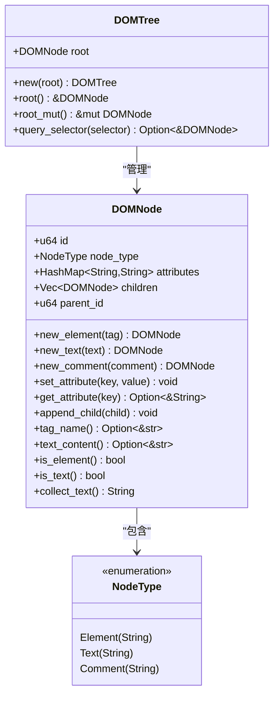

**图表来源**
- [dom.rs:18-33](file://crates/iris-layout/src/dom.rs#L18-L33)
- [dom.rs:518-596](file://crates/iris-layout/src/dom.rs#L518-L596)

#### HTML解析流程

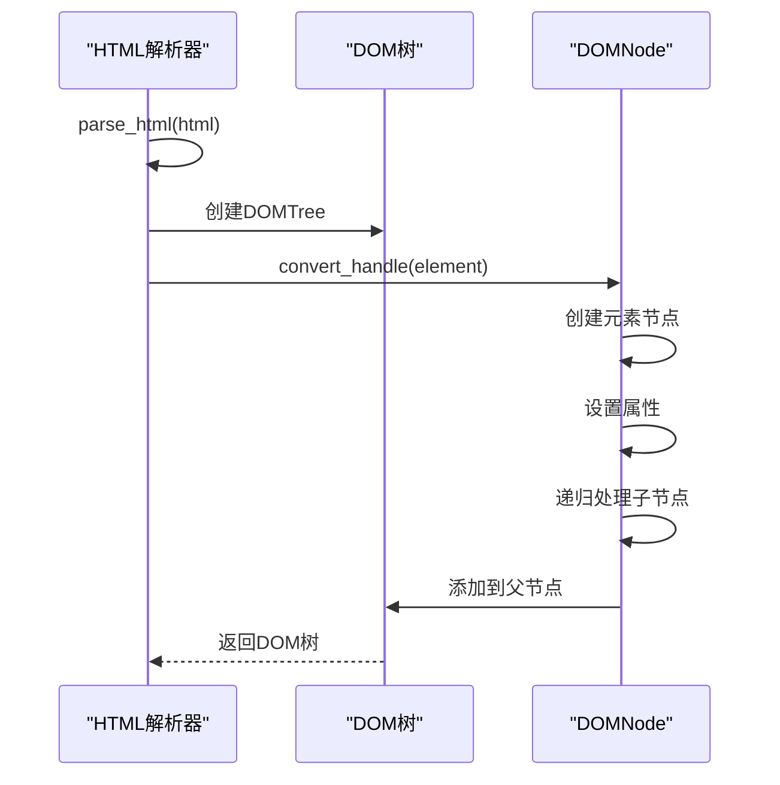

**图表来源**
- [dom.rs:518-596](file://crates/iris-layout/src/dom.rs#L518-L596)

**章节来源**
- [dom.rs:1-800](file://crates/iris-layout/src/dom.rs#L1-L800)

### CSS解析器详细分析

CSS解析器实现了完整的CSS语法解析和规则管理，现已增强支持多种选择器类型：

#### CSS数据结构

```mermaid
classDiagram
class Selector {
+String text
+SelectorType selector_type
+new(text) Selector
+is_id() bool
+is_class() bool
+is_tag() bool
+is_compound() bool
}
class SelectorType {
<<enumeration>>
Tag(String)
Id(String)
Class(String)
Attribute {name : String, value : Option~String~}
Universal
Compound(Vec~SelectorType~)
Descendant(Box~SelectorType~, Box~SelectorType~)
Child(Box~SelectorType~, Box~SelectorType~)
}
class Declaration {
+String property
+String value
}
class CSSRule {
+Selector selector
+Vec~Declaration~ declarations
+new(selector, declarations) CSSRule
}
class Stylesheet {
+Vec~CSSRule~ rules
+new() Stylesheet
+add_rule(rule) void
}
Stylesheet --> CSSRule : "包含"
CSSRule --> Selector : "使用"
CSSRule --> Declaration : "包含"
```

**图表来源**
- [css.rs:28-74](file://crates/iris-layout/src/css.rs#L28-L74)
- [css.rs:152-178](file://crates/iris-layout/src/css.rs#L152-L178)

#### CSS解析算法

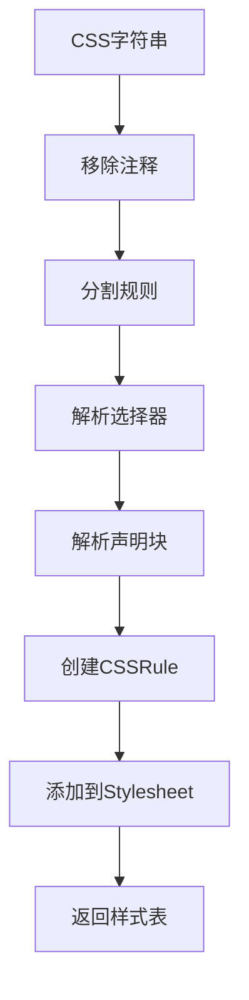

**图表来源**
- [css.rs:237-249](file://crates/iris-layout/src/css.rs#L237-L249)
- [css.rs:304-319](file://crates/iris-layout/src/css.rs#L304-L319)

**章节来源**
- [css.rs:1-437](file://crates/iris-layout/src/css.rs#L1-L437)

### 样式计算详细分析

样式计算模块实现了CSS选择器匹配、样式继承和层叠规则，现已增强支持多种选择器类型：

#### 样式计算流程

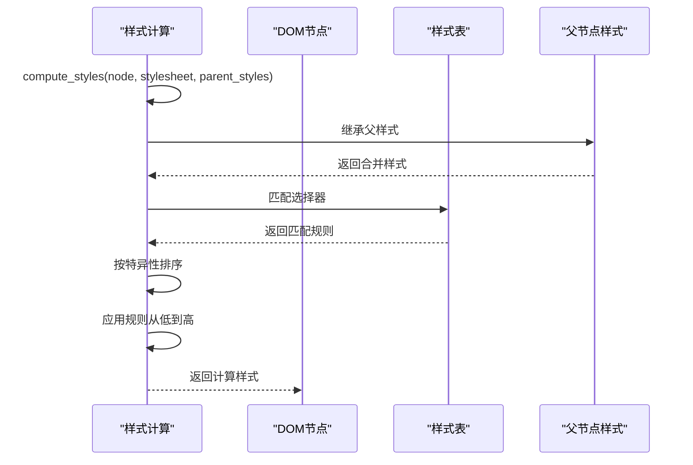

**图表来源**
- [style.rs:71-102](file://crates/iris-layout/src/style.rs#L71-L102)
- [style.rs:183-197](file://crates/iris-layout/src/style.rs#L183-L197)

#### 选择器匹配算法

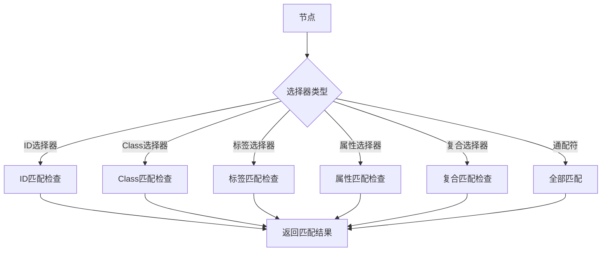

**图表来源**
- [style.rs:104-165](file://crates/iris-layout/src/style.rs#L104-L165)

**章节来源**
- [style.rs:1-356](file://crates/iris-layout/src/style.rs#L1-L356)

### 布局计算详细分析

布局计算模块实现了盒模型和基础布局算法，现已扩展支持定位、网格、浮动和表格：

#### 布局数据结构

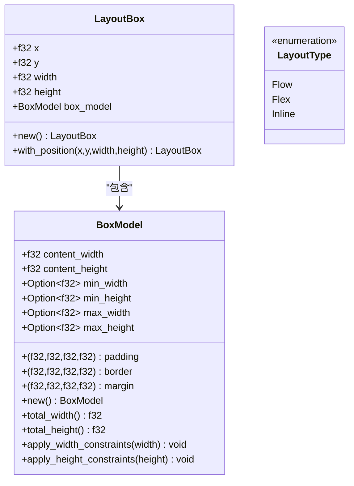

**图表来源**
- [layout.rs:11-145](file://crates/iris-layout/src/layout.rs#L11-L145)

#### 布局计算算法

**更新** 布局计算中的对象构造模式已从直接参数传递改为两步构造模式：

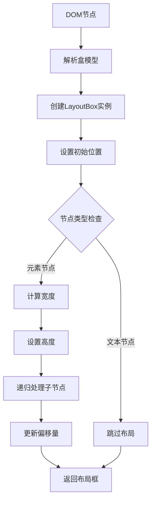

**图表来源**
- [layout.rs:405-422](file://crates/iris-layout/src/layout.rs#L405-L422)
- [layout.rs:558-592](file://crates/iris-layout/src/layout.rs#L558-L592)

**章节来源**
- [layout.rs:1-800](file://crates/iris-layout/src/layout.rs#L1-L800)

## 新增功能详解

### CSS浮动布局系统 (float_layout.rs)

新增的浮动布局系统支持完整的CSS float和clear属性：

#### 浮动元素管理

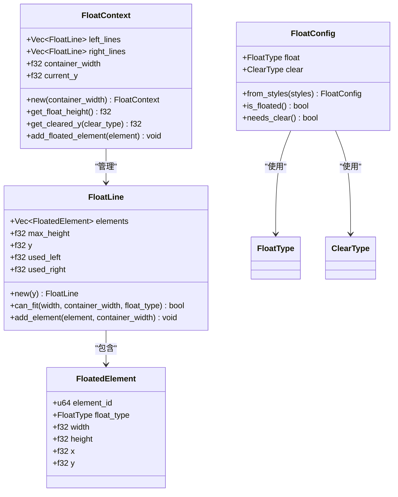

**图表来源**
- [float_layout.rs:83-178](file://crates/iris-layout/src/float_layout.rs#L83-L178)
- [float_layout.rs:180-214](file://crates/iris-layout/src/float_layout.rs#L180-L214)
- [float_layout.rs:13-81](file://crates/iris-layout/src/float_layout.rs#L13-L81)

#### 浮动布局计算流程

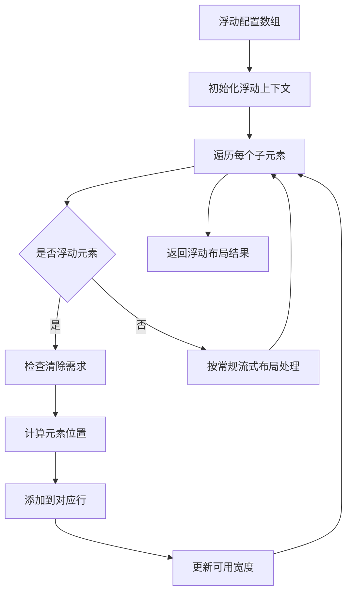

**图表来源**
- [float_layout.rs:238-315](file://crates/iris-layout/src/float_layout.rs#L238-L315)

#### 浮动清除机制

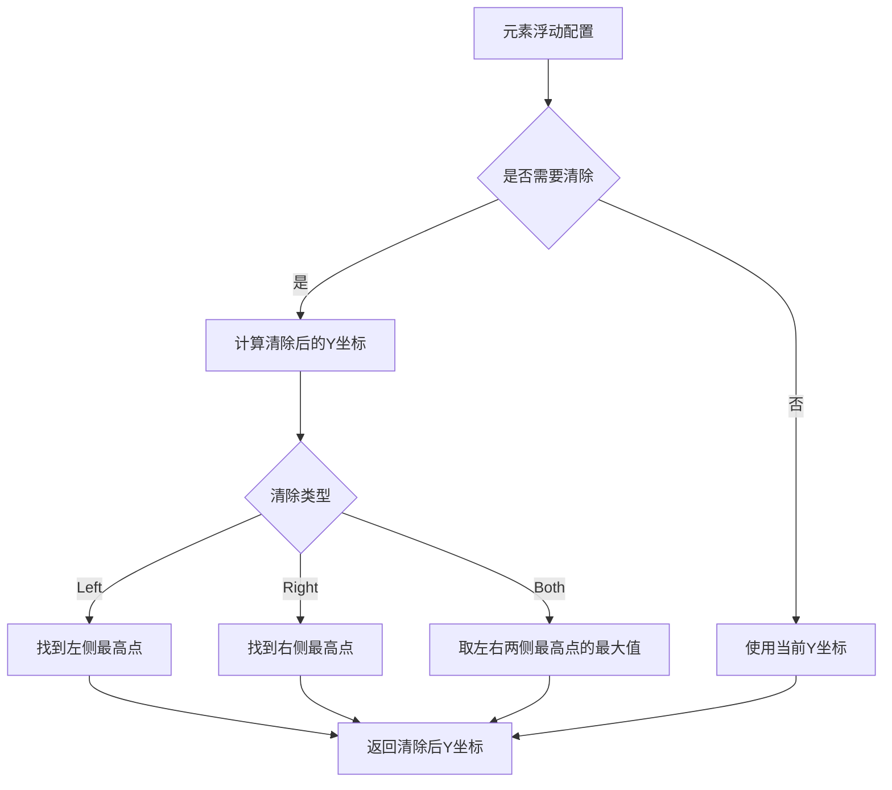

**图表来源**
- [float_layout.rs:122-142](file://crates/iris-layout/src/float_layout.rs#L122-L142)

**章节来源**
- [float_layout.rs:1-571](file://crates/iris-layout/src/float_layout.rs#L1-L571)

### CSS表格布局系统 (table_layout.rs)

新增的表格布局系统支持完整的CSS表格显示类型和单元格合并：

#### 表格显示类型解析

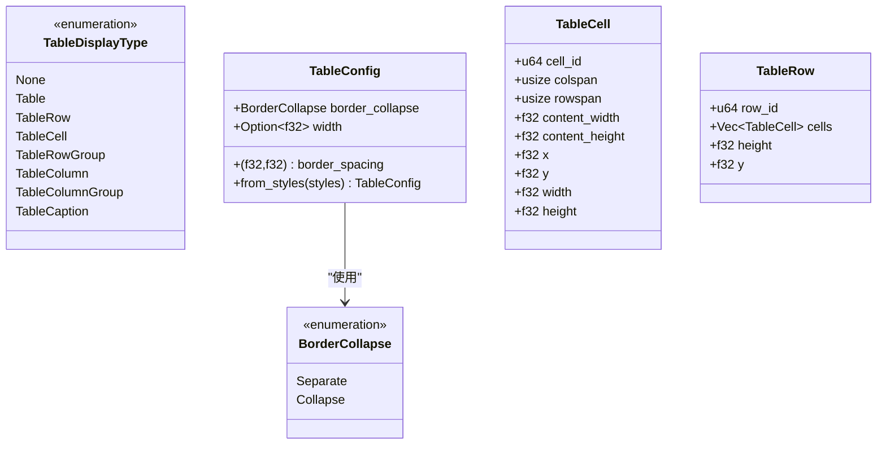

**图表来源**
- [table_layout.rs:11-46](file://crates/iris-layout/src/table_layout.rs#L11-L46)
- [table_layout.rs:48-65](file://crates/iris-layout/src/table_layout.rs#L48-L65)
- [table_layout.rs:103-146](file://crates/iris-layout/src/table_layout.rs#L103-L146)
- [table_layout.rs:67-101](file://crates/iris-layout/src/table_layout.rs#L67-L101)

#### 表格布局计算流程

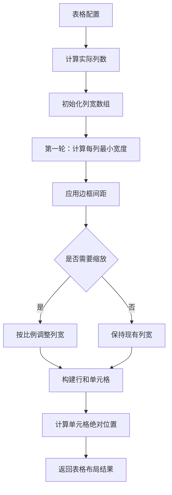

**图表来源**
- [table_layout.rs:190-317](file://crates/iris-layout/src/table_layout.rs#L190-L317)

#### 单元格跨度计算

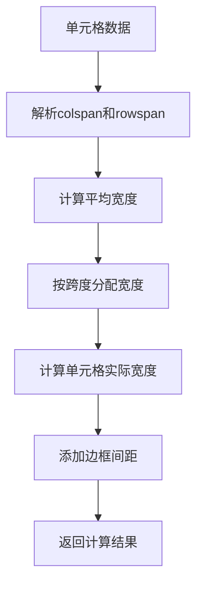

**图表来源**
- [table_layout.rs:254-306](file://crates/iris-layout/src/table_layout.rs#L254-L306)

**章节来源**
- [table_layout.rs:1-533](file://crates/iris-layout/src/table_layout.rs#L1-L533)

### 布局缓存系统 (cache.rs)

新增的布局缓存系统提供高效的布局结果缓存机制：

#### 缓存架构

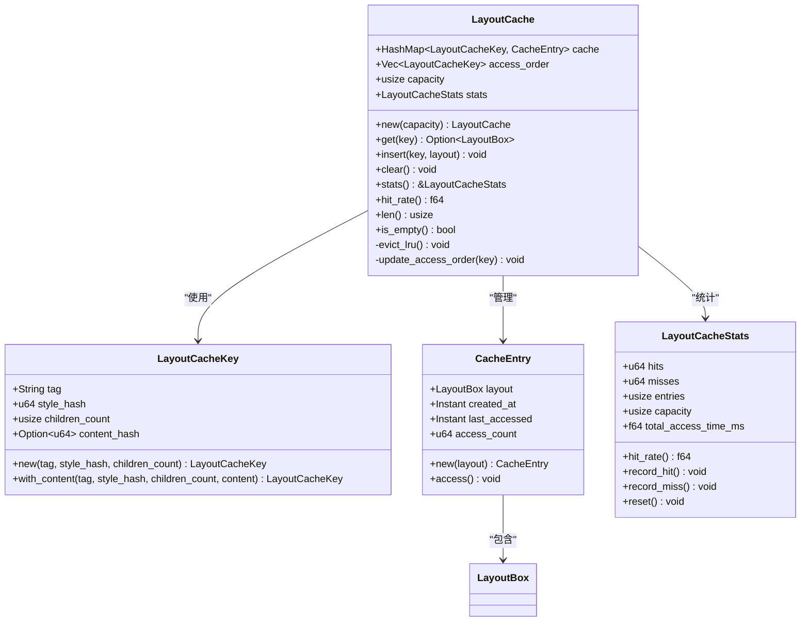

**图表来源**
- [cache.rs:15-92](file://crates/iris-layout/src/cache.rs#L15-L92)
- [cache.rs:149-279](file://crates/iris-layout/src/cache.rs#L149-L279)

#### 缓存工作流程

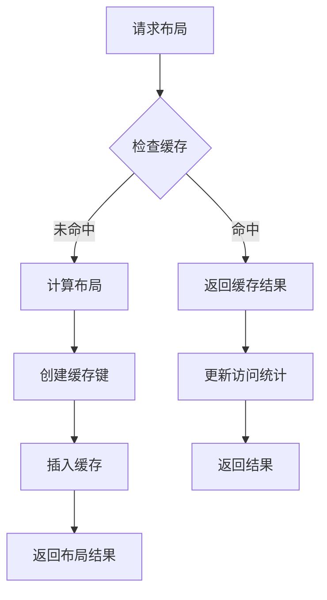

**图表来源**
- [cache.rs:195-217](file://crates/iris-layout/src/cache.rs#L195-L217)
- [cache.rs:225-235](file://crates/iris-layout/src/cache.rs#L225-L235)

**章节来源**
- [cache.rs:1-471](file://crates/iris-layout/src/cache.rs#L1-L471)

## 依赖关系分析

### 模块间依赖关系

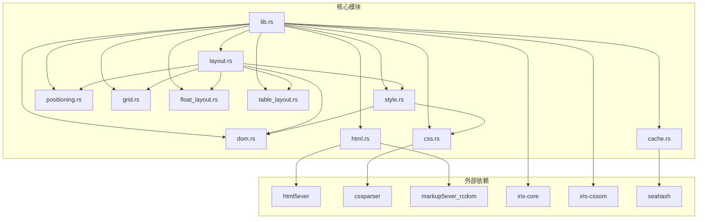

**图表来源**
- [lib.rs:25-37](file://crates/iris-layout/src/lib.rs#L25-L37)
- [Cargo.toml:11-18](file://crates/iris-layout/Cargo.toml#L11-L18)

### 依赖特性分析

| 依赖模块 | 版本 | 用途 | 依赖级别 |
|---------|------|------|----------|
| html5ever | workspace | HTML解析 | 核心依赖 |
| cssparser | workspace | CSS解析 | 核心依赖 |
| markup5ever_rcdom | workspace | DOM表示 | 核心依赖 |
| iris-core | workspace | 核心功能 | 基础依赖 |
| iris-cssom | workspace | CSSOM集成 | 增强依赖 |
| seahash | 4.1 | 哈希计算 | 性能依赖 |

**章节来源**
- [Cargo.toml:11-18](file://crates/iris-layout/Cargo.toml#L11-L18)
- [lib.rs:37-40](file://crates/iris-layout/src/lib.rs#L37-L40)

## 性能考虑

### 内存管理优化

1. **零拷贝设计**：使用Rust的所有权系统避免不必要的数据复制
2. **惰性计算**：样式和布局计算按需进行，避免重复计算
3. **内存池**：大型数据结构使用预分配的内存池
4. **定位缓存**：定位计算结果可缓存以提高性能
5. **浮动上下文重用**：浮动布局上下文可重用减少分配
6. **布局缓存系统**：LRU缓存机制避免重复布局计算

### 算法复杂度

- **HTML解析**：O(n)，n为输入字符数
- **CSS解析**：O(m)，m为CSS规则数
- **样式计算**：O(k×m)，k为节点数，m为匹配规则数
- **布局计算**：O(n)，n为DOM节点数
- **定位计算**：O(n)，n为定位元素数量
- **网格计算**：O(n×c×r)，n为网格项数，c为列数，r为行数
- **浮动计算**：O(f)，f为浮动元素数量
- **表格计算**：O(t×c×r)，t为表格单元格数，c为列数，r为行数
- **缓存访问**：O(1)，平均情况下的LRU缓存访问

### 并发处理

布局引擎目前是单线程设计，适合UI渲染场景。未来可以考虑：
- 多线程布局计算
- 异步样式解析
- 增量布局更新
- 定位、网格、浮动和表格计算的并行化

### 缓存性能优化

新增的布局缓存系统显著提升了性能：
- **命中率统计**：实时监控缓存命中率
- **LRU策略**：最近最少使用算法保证缓存有效性
- **容量控制**：可配置的缓存大小防止内存泄漏
- **访问统计**：记录访问时间和次数用于性能分析

## 故障排除指南

### 常见问题及解决方案

#### 1. HTML解析失败

**症状**：parse_html函数抛出异常
**原因**：HTML格式不正确或编码问题
**解决方案**：
- 检查HTML字符串的语法正确性
- 确保使用UTF-8编码
- 验证HTML标签闭合

#### 2. CSS选择器不匹配

**症状**：样式无法应用到目标元素
**原因**：选择器语法错误或元素属性不匹配
**解决方案**：
- 检查选择器语法（#id, .class, 标签名）
- 验证元素的id和class属性
- 确认CSS规则的特异性
- 使用属性选择器([attr])和复合选择器(div.class#id)时注意语法

#### 3. 布局计算异常

**症状**：布局尺寸计算错误
**原因**：CSS单位解析问题或盒模型计算错误
**解决方案**：
- 检查CSS长度值的单位（px, %）
- 验证盒模型属性的设置
- 确认父容器尺寸的有效性
- 使用两步构造模式创建LayoutBox对象

#### 4. 定位计算问题

**症状**：定位元素位置不正确
**原因**：定位属性解析错误或包含块计算问题
**解决方案**：
- 检查position属性值（static, relative, absolute, fixed, sticky）
- 验证top, right, bottom, left偏移值
- 确认包含块的尺寸和位置
- 使用PositionConfig.from_styles()正确解析定位配置

#### 5. 网格布局异常

**症状**：网格项位置或尺寸错误
**原因**：网格轨道定义或放置规则问题
**解决方案**：
- 检查grid-template-columns/rows定义
- 验证grid-column/grid-row放置规则
- 确认网格间距和轨道尺寸计算
- 使用GridTrackSize.parse_track_definition()正确解析轨道定义

#### 6. 浮动布局问题

**症状**：浮动元素位置或清除效果异常
**原因**：float、clear属性解析错误或浮动上下文计算问题
**解决方案**：
- 检查float属性值（left, right, none）
- 验证clear属性值（left, right, both, none）
- 确认浮动元素的宽度和高度计算
- 检查浮动行的容纳能力和清除机制

#### 7. 表格布局异常

**症状**：表格单元格位置或尺寸错误
**原因**：表格显示类型或单元格跨度计算问题
**解决方案**：
- 检查display属性值（table, table-row, table-cell等）
- 验证colspan和rowspan属性
- 确认表格边框折叠和间距设置
- 检查列宽计算和单元格绝对位置

#### 8. 布局缓存问题

**症状**：布局缓存失效或性能下降
**原因**：缓存键生成错误或缓存容量不足
**解决方案**：
- 检查LayoutCacheKey的生成逻辑
- 验证样式哈希计算的准确性
- 调整缓存容量以适应应用场景
- 监控缓存命中率并进行优化

#### 9. CSSOM集成问题

**症状**：CSSOM相关功能不可用或报错
**原因**：CSSOM依赖版本不兼容或重新导出问题
**解决方案**：
- 确认iris-cssom版本兼容性
- 检查CSSOM重新导出功能
- 验证CSSOM与布局引擎的集成

**章节来源**
- [css.rs:398-436](file://crates/iris-layout/src/css.rs#L398-L436)
- [style.rs:203-355](file://crates/iris-layout/src/style.rs#L203-L355)
- [layout.rs:405-422](file://crates/iris-layout/src/layout.rs#L405-L422)
- [positioning.rs:366-499](file://crates/iris-layout/src/positioning.rs#L366-L499)
- [grid.rs:400-500](file://crates/iris-layout/src/grid.rs#L400-L500)
- [float_layout.rs:360-571](file://crates/iris-layout/src/float_layout.rs#L360-L571)
- [table_layout.rs:348-533](file://crates/iris-layout/src/table_layout.rs#L348-L533)
- [cache.rs:313-471](file://crates/iris-layout/src/cache.rs#L313-L471)

## 结论

iris-layout布局引擎经过重大增强，现已具备完整的浏览器级布局能力：

### 核心成就

1. **完整的浏览器兼容性**：支持主流CSS特性，包括新增的定位、网格、浮动和表格功能
2. **模块化架构**：清晰的职责分离和依赖管理，新增定位、网格、浮动和表格模块独立设计
3. **高性能实现**：优化的数据结构和算法，支持定位、网格、浮动和表格的高效计算
4. **全面的测试覆盖**：每个模块都有完善的单元测试，包括新增功能
5. **增强的CSSOM集成**：重新导出CSSOM以保持向后兼容
6. **布局缓存系统**：LRU缓存机制显著提升性能

### 新增功能价值

1. **定位系统**：支持静态、相对、绝对、固定、粘性定位，满足复杂的页面布局需求
2. **网格布局**：完整的CSS Grid支持，包括轨道尺寸、放置和计算功能
3. **浮动布局**：完整的CSS Float支持，包括left、right浮动和清除机制
4. **表格布局**：完整的CSS Table支持，包括table-display、colspan/rowspan等功能
5. **布局缓存**：LRU缓存系统避免重复计算，提升整体性能

### 技术优势

- **独立性**：布局引擎不依赖渲染器，可独立使用
- **扩展性**：模块化设计便于功能扩展和维护
- **性能**：优化的算法和数据结构，支持大规模DOM树的高效处理
- **兼容性**：严格遵循CSS规范，确保与标准浏览器的兼容性
- **缓存优化**：智能缓存机制减少重复计算开销

### 功能完整性

经过Phase 1.7的完成，iris-layout布局引擎现已实现以下核心布局系统：

- **流式布局**：基础的块级和内联布局
- **Flex布局**：完整的弹性盒子布局
- **定位布局**：静态、相对、绝对、固定、粘性定位
- **网格布局**：完整的CSS Grid系统
- **浮动布局**：完整的CSS Float系统
- **表格布局**：完整的CSS Table系统

该引擎为Iris项目的前端渲染提供了坚实的基础，支持后续的DOM抽象、JavaScript运行时和SFC编译器的开发。随着项目的演进，可以进一步增强布局引擎的性能和功能完整性。

**更新** 布局引擎的构造模式已优化为更清晰的两步构造方式，提高了代码的可读性和维护性，同时保持了相同的性能特征。新增的布局缓存系统显著提升了性能表现，为大规模应用提供了更好的支持。