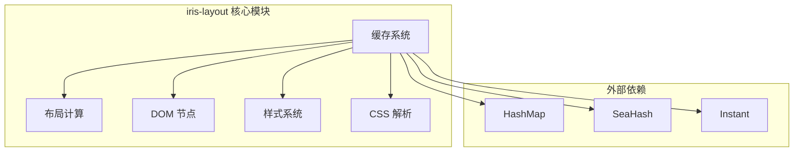
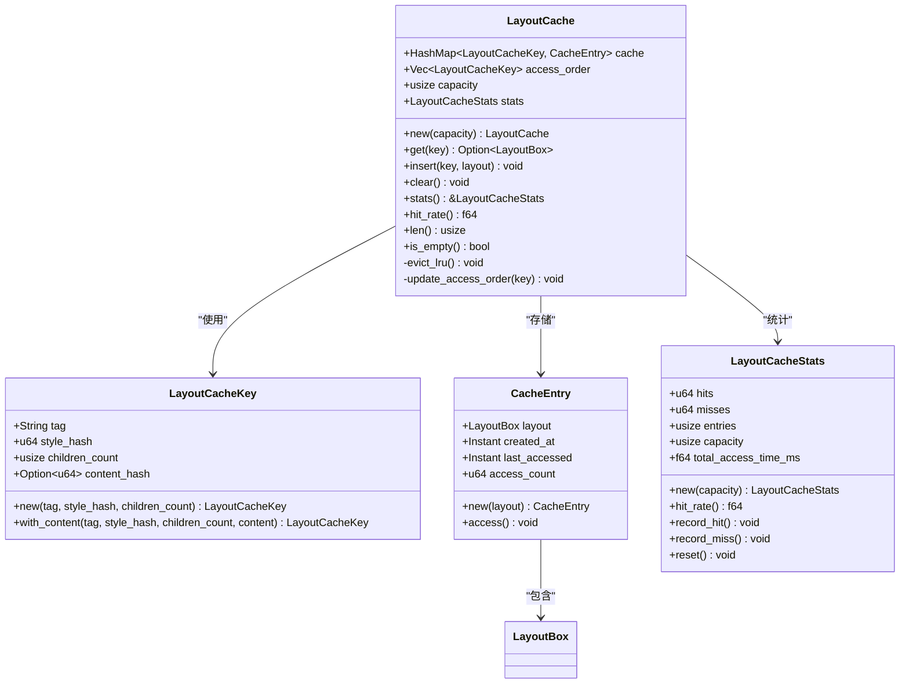
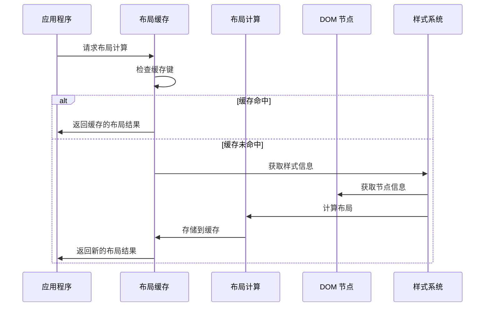
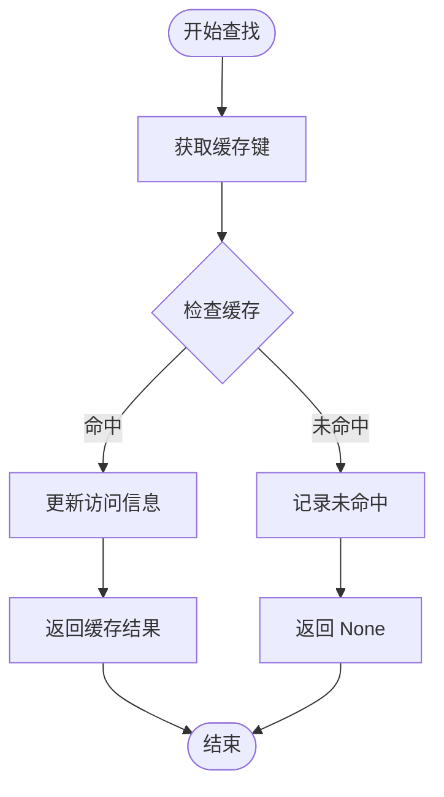
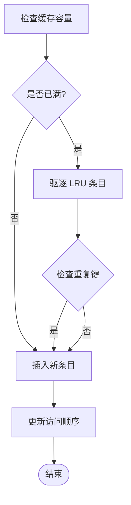
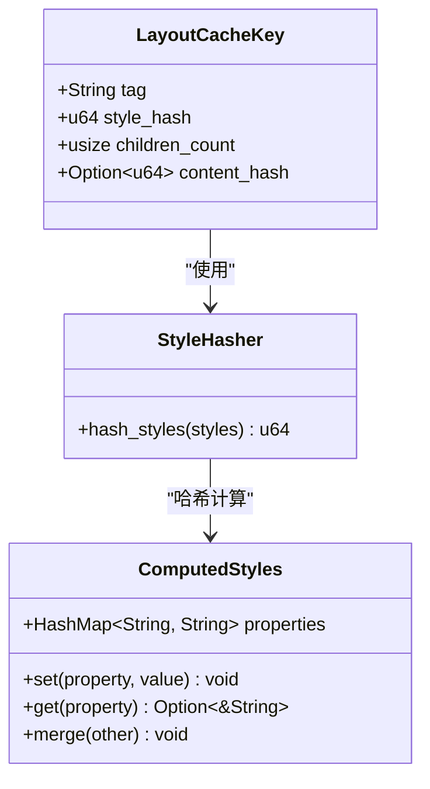
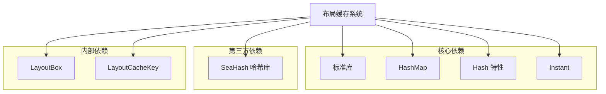

# 布局缓存系统

<cite>
**本文档引用的文件**
- [cache.rs](file://crates/iris-layout/src/cache.rs)
- [layout.rs](file://crates/iris-layout/src/layout.rs)
- [lib.rs](file://crates/iris-layout/src/lib.rs)
- [Cargo.toml](file://crates/iris-layout/Cargo.toml)
- [ARCHITECTURE.md](file://ARCHITECTURE.md)
- [performance_benchmarks.rs](file://crates/iris/tests/performance_benchmarks.rs)
- [dom.rs](file://crates/iris-layout/src/dom.rs)
- [style.rs](file://crates/iris-layout/src/style.rs)
- [html.rs](file://crates/iris-layout/src/html.rs)
- [css.rs](file://crates/iris-layout/src/css.rs)
- [vdom.rs](file://crates/iris-layout/src/vdom.rs)
</cite>

## 目录
1. [简介](#简介)
2. [项目结构](#项目结构)
3. [核心组件](#核心组件)
4. [架构概览](#架构概览)
5. [详细组件分析](#详细组件分析)
6. [依赖关系分析](#依赖关系分析)
7. [性能考量](#性能考量)
8. [故障排除指南](#故障排除指南)
9. [结论](#结论)

## 简介

布局缓存系统是 Iris 布局引擎的核心组成部分，旨在通过智能缓存机制显著提升布局计算性能。该系统采用 LRU（最近最少使用）缓存策略，结合基于内容哈希的失效检测机制，为重复的布局计算提供快速访问路径。

系统的主要目标包括：
- 避免重复的布局计算，减少 CPU 开销
- 提供可配置的缓存大小，平衡内存使用和性能
- 实时监控缓存命中率，优化缓存策略
- 支持文本节点和元素节点的不同缓存策略

## 项目结构

Iris 布局引擎采用模块化的架构设计，布局缓存系统位于 `crates/iris-layout/src/cache.rs` 文件中，与整个布局系统紧密集成。

**图表来源**
- [cache.rs:1-460](file://crates/iris-layout/src/cache.rs#L1-L460)
- [lib.rs:25-37](file://crates/iris-layout/src/lib.rs#L25-L37)

**章节来源**
- [cache.rs:1-80](file://crates/iris-layout/src/cache.rs#L1-L80)
- [lib.rs:1-81](file://crates/iris-layout/src/lib.rs#L1-L81)

## 核心组件

布局缓存系统由四个核心组件构成，每个组件都有特定的职责和功能：

### 1. 布局缓存键 (LayoutCacheKey)

布局缓存键是缓存系统的核心标识符，它综合考虑了节点的多个特征来生成唯一的缓存键。

**图表来源**
- [cache.rs:15-305](file://crates/iris-layout/src/cache.rs#L15-L305)

### 2. 缓存条目 (CacheEntry)

缓存条目封装了实际的布局结果以及相关的元数据，包括访问时间和访问次数统计。

### 3. 缓存统计 (LayoutCacheStats)

缓存统计提供了完整的性能监控能力，包括命中率、访问次数、缓存大小等关键指标。

### 4. 样式哈希计算器 (StyleHasher)

样式哈希计算器负责为样式集合生成稳定的哈希值，确保相同样式的节点能够正确命中缓存。

**章节来源**
- [cache.rs:15-305](file://crates/iris-layout/src/cache.rs#L15-L305)

## 架构概览

布局缓存系统在整个 Iris 架构中扮演着重要的角色，它与布局计算、DOM 操作和样式系统紧密协作。

**图表来源**
- [cache.rs:186-246](file://crates/iris-layout/src/cache.rs#L186-L246)
- [layout.rs:397-422](file://crates/iris-layout/src/layout.rs#L397-L422)

**章节来源**
- [ARCHITECTURE.md:77-90](file://ARCHITECTURE.md#L77-L90)
- [lib.rs:39-72](file://crates/iris-layout/src/lib.rs#L39-L72)

## 详细组件分析

### 布局缓存实现

布局缓存系统采用 HashMap 作为主要存储结构，结合 Vec 来维护访问顺序，实现了高效的 LRU 缓存策略。

#### 缓存查找流程

**图表来源**
- [cache.rs:195-211](file://crates/iris-layout/src/cache.rs#L195-L211)

#### LRU 驱逐机制

当缓存达到容量限制时，系统会自动驱逐最近最少使用的条目：

**图表来源**
- [cache.rs:219-272](file://crates/iris-layout/src/cache.rs#L219-L272)

### 样式哈希系统

样式哈希系统确保相同样式的节点能够正确识别和复用缓存结果：

**图表来源**
- [cache.rs:275-305](file://crates/iris-layout/src/cache.rs#L275-L305)
- [style.rs:12-51](file://crates/iris-layout/src/style.rs#L12-L51)

**章节来源**
- [cache.rs:275-305](file://crates/iris-layout/src/cache.rs#L275-L305)
- [style.rs:71-102](file://crates/iris-layout/src/style.rs#L71-L102)

### 性能基准测试

系统包含了完整的性能基准测试，验证缓存系统的有效性：

| 测试场景 | 描述 | 预期结果 |
|---------|------|----------|
| 缓存命中性能 | 预填充缓存后进行大量命中操作 | 命中率 > 95%，访问时间 < 100ms |
| 缓存未命中性能 | 大量未命中操作 | 访问时间合理，无内存泄漏 |
| 文本节点缓存 | 带内容哈希的文本节点缓存 | 不同内容产生不同哈希值 |

**章节来源**
- [performance_benchmarks.rs:140-182](file://crates/iris/tests/performance_benchmarks.rs#L140-L182)
- [performance_benchmarks.rs:184-200](file://crates/iris/tests/performance_benchmarks.rs#L184-L200)

## 依赖关系分析

布局缓存系统的设计遵循最小依赖原则，只依赖必要的标准库组件：

**图表来源**
- [Cargo.toml:9-17](file://crates/iris-layout/Cargo.toml#L9-L17)
- [cache.rs:9-11](file://crates/iris-layout/src/cache.rs#L9-L11)

**章节来源**
- [Cargo.toml:1-18](file://crates/iris-layout/Cargo.toml#L1-L18)

## 性能考量

### 时间复杂度分析

- **缓存查找**: O(1) 平均时间复杂度，基于 HashMap 实现
- **缓存插入**: O(1) 平均时间复杂度
- **LRU 驱逐**: O(n) 时间复杂度，其中 n 是访问顺序列表长度
- **样式哈希**: O(k log k) 时间复杂度，k 是样式属性数量

### 空间复杂度分析

- **缓存存储**: O(n) 空间复杂度，n 为缓存条目数量
- **访问顺序**: O(n) 额外空间用于维护 LRU 顺序
- **统计信息**: O(1) 空间复杂度

### 优化建议

1. **缓存容量调优**: 根据应用场景调整缓存大小，在内存使用和性能之间找到最佳平衡点
2. **哈希冲突处理**: 考虑使用更高效的哈希算法减少冲突
3. **并发访问**: 在多线程环境下考虑添加适当的锁机制
4. **内存回收**: 实现更智能的内存回收策略，避免内存泄漏

## 故障排除指南

### 常见问题及解决方案

| 问题类型 | 症状 | 可能原因 | 解决方案 |
|---------|------|----------|----------|
| 缓存未命中 | 命中率过低 | 缓存键设计不合理 | 检查 LayoutCacheKey 的生成逻辑 |
| 内存泄漏 | 内存使用持续增长 | 缓存条目未及时清理 | 实现定期清理机制 |
| 性能下降 | 缓存操作变慢 | LRU 顺序维护开销过大 | 优化访问顺序更新逻辑 |
| 数据不一致 | 缓存结果错误 | 样式哈希计算错误 | 验证样式哈希算法 |

### 调试技巧

1. **监控缓存统计**: 定期检查命中率、访问次数等关键指标
2. **日志记录**: 添加详细的缓存操作日志便于调试
3. **性能分析**: 使用性能分析工具识别瓶颈
4. **单元测试**: 编写全面的单元测试覆盖各种边界情况

**章节来源**
- [cache.rs:307-459](file://crates/iris-layout/src/cache.rs#L307-L459)

## 结论

布局缓存系统通过智能的 LRU 策略和基于内容哈希的失效检测机制，为 Iris 布局引擎提供了强大的性能优化能力。系统设计简洁高效，具有良好的可扩展性和维护性。

主要优势包括：
- **高性能**: 通过缓存避免重复计算，显著提升布局性能
- **智能化**: LRU 策略自动管理缓存生命周期
- **可监控**: 完整的统计信息帮助优化缓存策略
- **可扩展**: 模块化设计便于功能扩展和维护

未来发展方向：
- 实现更智能的缓存预加载机制
- 添加并发安全的缓存访问控制
- 优化内存使用效率
- 增强缓存失效检测的准确性