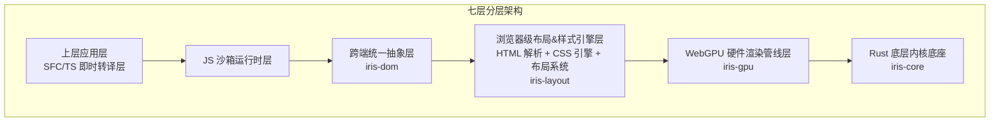
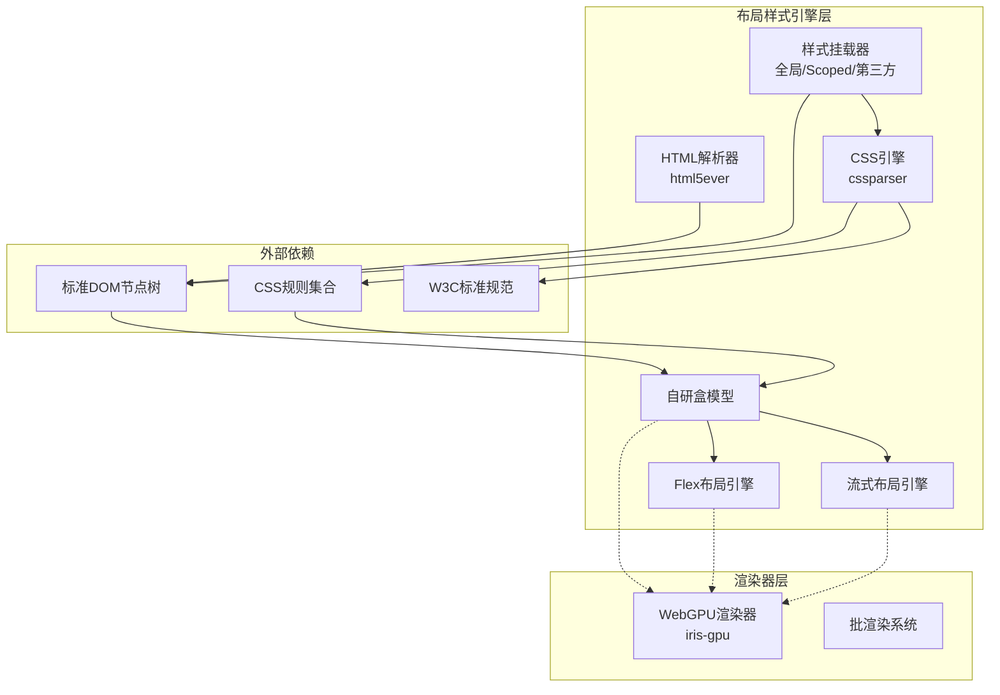
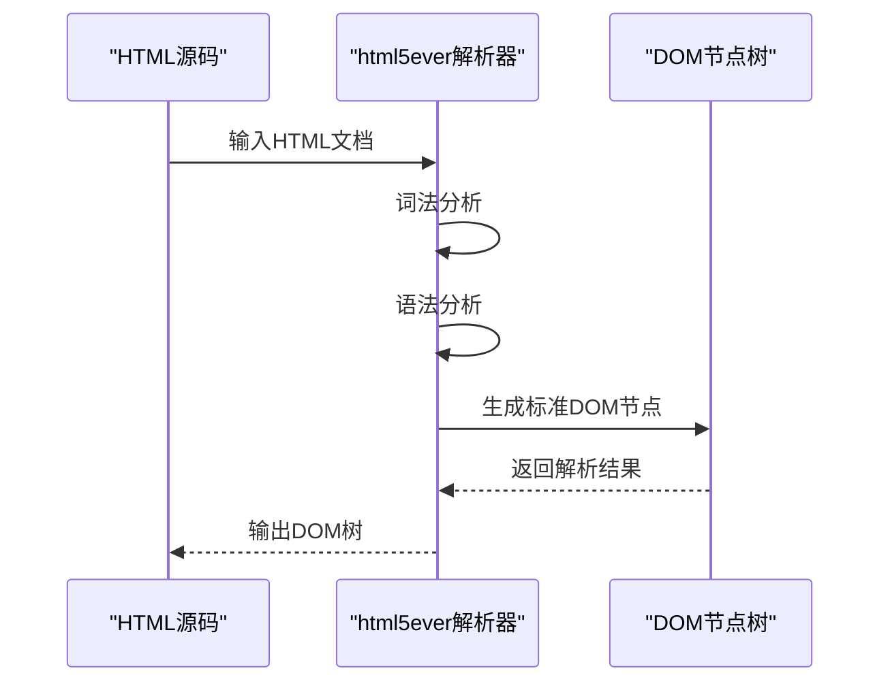
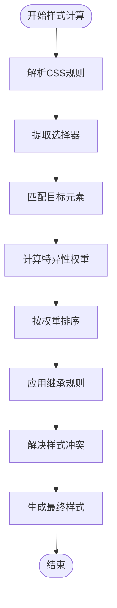
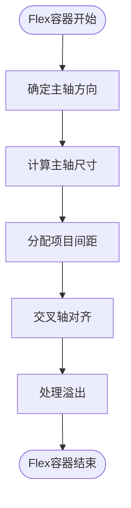
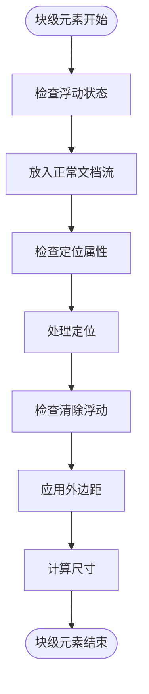
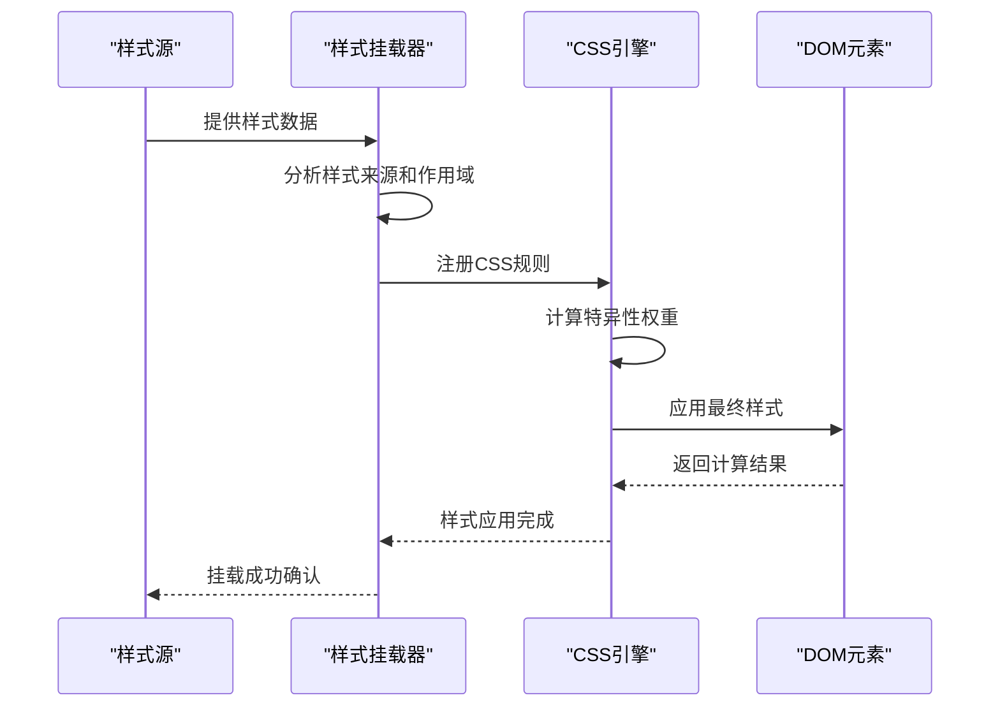
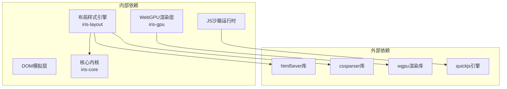
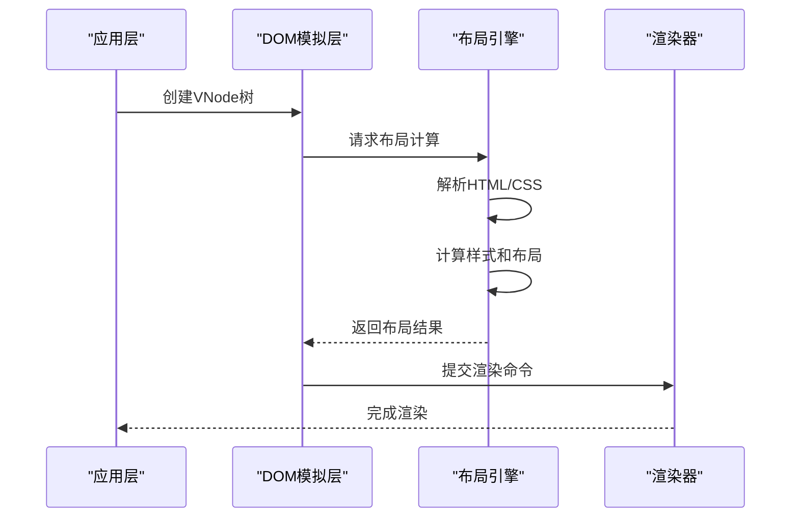

# 布局样式系统

<cite>
**本文档引用的文件**
- [lib.rs](file://crates/iris-layout/src/lib.rs)
- [Cargo.toml](file://crates/iris-layout/Cargo.toml)
- [html.rs](file://crates/iris-layout/src/html.rs)
- [css.rs](file://crates/iris-layout/src/css.rs)
- [style.rs](file://crates/iris-layout/src/style.rs)
- [layout.rs](file://crates/iris-layout/src/layout.rs)
- [lib.rs](file://crates/iris-gpu/src/lib.rs)
- [Cargo.toml](file://crates/iris-gpu/Cargo.toml)
- [lib.rs](file://crates/iris-core/src/lib.rs)
- [lib.rs](file://crates/iris-dom/src/lib.rs)
- [Cargo.toml](file://crates/iris-dom/Cargo.toml)
- [lib.rs](file://crates/iris-js/src/lib.rs)
- [Cargo.toml](file://crates/iris-js/Cargo.toml)
- [PROGRESSIVE_IMPLEMENTATION_PLAN.md](file://PROGRESSIVE_IMPLEMENTATION_PLAN.md)
- [sfc_integration.rs](file://crates/iris-app/examples/sfc_integration.rs)
</cite>

## 更新摘要
**变更内容**
- 更新了布局引擎与渲染器解耦的架构说明
- 新增了布局引擎独立性的技术细节
- 更新了依赖关系图以反映新的单向依赖结构
- 添加了架构重构后的性能影响分析
- 新增了模块间通信机制的说明

## 目录
1. [引言](#引言)
2. [项目结构](#项目结构)
3. [核心组件](#核心组件)
4. [架构概览](#架构概览)
5. [详细组件分析](#详细组件分析)
6. [依赖关系分析](#依赖关系分析)
7. [模块间通信机制](#模块间通信机制)
8. [性能考虑](#性能考虑)
9. [故障排除指南](#故障排除指南)
10. [结论](#结论)

## 引言

Leivue Runtime是一个基于Rust和WebGPU的下一代无构建前端运行时引擎。其布局样式系统是整个架构的核心组成部分，负责实现浏览器级别的HTML解析、CSS引擎设计和样式计算流程。

**更新** 布局引擎iris-layout已成功移除对iris-gpu的依赖，实现了与渲染器的完全解耦。这一架构重构使得布局计算不再依赖GPU初始化，提升了系统的灵活性和可维护性。现在布局引擎可以独立于渲染器运行，支持服务器端布局预计算和离线环境下的布局处理。

该项目的核心使命是：
- 提供完全脱离Node/浏览器DOM/编译打包的原生双端运行解决方案
- 为Vue生态系统提供高性能跨端底座
- 消灭前端工程化，突破浏览器沙箱限制

## 项目结构

根据项目文档，布局样式系统位于七层分层架构的第四个层级，即"浏览器级布局&样式引擎层"。该层负责复刻标准浏览器CSS体系，对标Chromium基础能力。



**图表来源**
- [PROGRESSIVE_IMPLEMENTATION_PLAN.md:5-19](file://PROGRESSIVE_IMPLEMENTATION_PLAN.md#L5-L19)

**章节来源**
- [PROGRESSIVE_IMPLEMENTATION_PLAN.md:5-19](file://PROGRESSIVE_IMPLEMENTATION_PLAN.md#L5-L19)

## 核心组件

布局样式系统包含以下核心组件：

### 1. HTML解析器
- **实现技术**: html5ever工业级解析
- **功能**: 生成标准DOM节点树
- **特点**: 符合HTML5标准，支持完整的HTML5语义

### 2. CSS引擎
- **实现技术**: cssparser解析
- **功能**: 
  - 选择器匹配
  - 样式继承
  - 权重计算
  - 标准CSS语法支持

### 3. 布局系统
- **盒模型**: 自研实现，对标W3C标准
- **Flex布局**: 完整实现Flexbox规范
- **流式布局**: 支持传统的块级和内联布局

### 4. 样式挂载机制
- **全局样式**: 应用到整个应用的样式
- **Scoped样式**: 作用域限定的样式
- **第三方UI库CSS**: 全局注入支持Element Plus、Ant Design Vue等

**更新** 布局引擎现在完全独立于渲染器，不再依赖GPU初始化过程。这使得布局计算可以在任何环境中进行，包括服务器端渲染和离线环境。

**章节来源**
- [lib.rs:1-41](file://crates/iris-layout/src/lib.rs#L1-L41)

## 架构概览

**更新** 布局样式系统采用模块化设计，各组件之间通过清晰的接口进行交互。经过架构重构后，布局引擎与渲染器实现了完全解耦。



**图表来源**
- [lib.rs:1-41](file://crates/iris-layout/src/lib.rs#L1-L41)
- [lib.rs:107-496](file://crates/iris-gpu/src/lib.rs#L107-L496)

## 详细组件分析

### HTML解析器 (html5ever)

HTML解析器负责将HTML文档转换为标准的DOM节点树，这是整个布局样式的起点。

#### 核心功能
- **工业级解析**: 支持完整的HTML5语法
- **标准DOM生成**: 生成符合W3C标准的DOM节点树
- **错误恢复**: 在遇到不规范HTML时进行智能恢复

#### 处理流程


**图表来源**
- [html.rs:27-37](file://crates/iris-layout/src/html.rs#L27-L37)

### CSS引擎 (cssparser)

CSS引擎是布局样式系统的核心，负责解析CSS规则、匹配选择器并计算最终样式。

#### 主要组件

##### 1. 选择器匹配引擎
- 支持所有标准CSS选择器
- 包含后代选择器、子选择器、相邻兄弟选择器等
- 实现了高效的匹配算法

##### 2. 样式继承系统
- 自动处理可继承属性
- 支持从父元素向子元素传递样式
- 处理继承优先级和覆盖规则

##### 3. 权重计算引擎
- 实现CSS特异性计算
- 处理!important声明
- 支持层叠规则

#### 样式计算流程


**图表来源**
- [css.rs:110-121](file://crates/iris-layout/src/css.rs#L110-L121)
- [style.rs:71-102](file://crates/iris-layout/src/style.rs#L71-L102)

### 自研盒模型

盒模型是CSS布局的基础概念，Leivue Runtime实现了完整的盒模型系统。

#### 盒模型要素
- **内容区域 (content)**: 实际内容显示区域
- **内边距 (padding)**: 内容与边框之间的空间
- **边框 (border)**: 包围内容和内边距的边线
- **外边距 (margin)**: 盒子与其他元素之间的距离

#### 实现特性
- 完全符合W3C标准
- 支持box-sizing属性
- 正确处理负外边距
- 支持百分比尺寸计算

### Flex布局引擎

Flex布局是现代CSS布局的重要组成部分，系统提供了完整的Flexbox实现。

#### 支持的属性
- **容器属性**: flex-direction、justify-content、align-items、align-content
- **项目属性**: order、flex-grow、flex-shrink、flex-basis、align-self

#### 布局算法


### 流式布局引擎

传统的流式布局仍然在现代Web开发中广泛使用，系统提供了完整的流式布局支持。

#### 关键概念
- **块级元素**: 独占一行的元素
- **内联元素**: 不换行的元素
- **浮动**: 元素脱离正常文档流
- **定位**: 绝对定位、相对定位等

#### 布局流程


### 样式挂载机制

样式挂载系统负责将不同来源的样式正确应用到DOM元素上。

#### 样式来源分类

##### 1. 全局样式
- 应用到整个应用程序
- 通常包含基础样式和主题变量
- 优先级相对较低

##### 2. Scoped样式
- 作用于特定组件或页面
- 通过作用域标识符避免样式冲突
- 支持深度选择器

##### 3. 第三方UI库CSS
- 支持Element Plus、Ant Design Vue等
- 自动注入和管理
- 处理版本兼容性

#### 挂载流程


**图表来源**
- [style.rs:71-102](file://crates/iris-layout/src/style.rs#L71-L102)

## 依赖关系分析

**更新** 布局样式系统与其他系统组件存在密切的依赖关系，但经过架构重构后，布局引擎已完全独立于渲染器。



**图表来源**
- [Cargo.toml:11-15](file://crates/iris-layout/Cargo.toml#L11-L15)
- [Cargo.toml:11-18](file://crates/iris-gpu/Cargo.toml#L11-L18)

**更新** 架构重构后的依赖关系图显示：

- **iris-layout** 现在只依赖 `iris-core`、`html5ever` 和 `cssparser`
- **iris-gpu** 依赖 `iris-core`、`wgpu`、`winit` 等渲染相关库
- **iris-dom** 依赖 `iris-layout` 进行布局计算
- **iris-js** 依赖 `iris-dom` 进行DOM操作

这种单向依赖结构消除了之前的循环依赖问题，提升了系统的可维护性和扩展性。

**章节来源**
- [Cargo.toml:11-15](file://crates/iris-layout/Cargo.toml#L11-L15)
- [Cargo.toml:11-18](file://crates/iris-gpu/Cargo.toml#L11-L18)

## 模块间通信机制

**更新** 架构解耦后，模块间的通信机制发生了重要变化，形成了更加清晰的单向数据流。

### 布局计算的数据流



### 初始化顺序

**更新** 由于布局引擎现在独立于渲染器，初始化顺序变得更加灵活：

```mermaid
flowchart TD
A[iris-core::init()] --> B[iris-layout::init()]
B --> C[iris-dom::init()]
C --> D[iris-js::init()]
D --> E[iris-gpu::init() optional]
```

### 数据传递机制

**更新** 布局计算结果通过以下机制传递给渲染器：

1. **布局结果接口**: `LayoutBox`结构体包含完整的布局信息
2. **样式数据接口**: `ComputedStyles`提供样式计算结果
3. **DOM树接口**: `VNode`结构体承载布局和样式信息

**章节来源**
- [lib.rs:33-37](file://crates/iris-layout/src/lib.rs#L33-L37)
- [layout.rs:63-75](file://crates/iris-layout/src/layout.rs#L63-L75)
- [style.rs:9-16](file://crates/iris-layout/src/style.rs#L9-L16)

## 性能考虑

**更新** 布局样式系统在设计时充分考虑了性能优化，架构重构后进一步提升了性能表现。

### 1. 渲染性能
- **WebGPU硬件加速**: 利用GPU进行图形渲染（由iris-gpu负责）
- **批渲染优化**: 减少状态切换开销（由iris-gpu的BatchRenderer实现）
- **矢量绘制**: 支持高质量图形输出

### 2. 内存管理
- **Rust内存安全**: 零GC开销
- **内存池**: 预分配和复用内存
- **垃圾回收**: 手动内存管理

### 3. 计算效率
- **增量布局**: 只重新计算受影响的区域
- **缓存策略**: 缓存解析结果和计算中间值
- **并发处理**: 利用多核处理器优势

### 4. 架构解耦带来的性能提升
- **独立初始化**: 布局引擎无需等待GPU初始化
- **并行处理**: 布局计算和渲染可以并行进行
- **减少依赖**: 降低了模块间的耦合度，提升了整体性能

**更新** 架构解耦后的主要性能改进：
- 布局计算不再阻塞渲染器初始化
- 支持服务器端布局预计算
- 减少了不必要的GPU资源占用
- 提升了系统的响应速度
- 支持更灵活的部署模式

## 故障排除指南

### 常见问题及解决方案

#### 1. 样式不生效
- **检查选择器优先级**: 确认特异性权重计算正确
- **验证样式作用域**: 检查Scoped样式的应用范围
- **调试CSS规则**: 使用浏览器开发者工具检查规则匹配

#### 2. 布局异常
- **盒模型问题**: 检查box-sizing属性设置
- **Flex布局问题**: 验证Flex属性组合
- **流式布局问题**: 检查浮动和清除设置

#### 3. 性能问题
- **监控渲染帧率**: 使用性能分析工具
- **优化样式复杂度**: 减少复杂的CSS选择器
- **检查内存泄漏**: 监控内存使用情况

#### 4. 架构解耦相关问题
- **布局初始化失败**: 确保iris-core正确初始化
- **渲染器依赖问题**: 检查iris-gpu是否正确加载
- **模块间通信**: 验证布局计算结果的传递

**更新** 新增的架构解耦相关故障排除：
- **GPU初始化问题**: 布局引擎现在独立于GPU初始化
- **模块加载顺序**: 确保iris-layout在iris-gpu之前初始化
- **渲染管线分离**: 验证布局计算与渲染的分离效果
- **数据接口兼容**: 检查LayoutBox和ComputedStyles接口的正确使用

**章节来源**
- [lib.rs:107-496](file://crates/iris-gpu/src/lib.rs#L107-L496)

## 结论

Leivue Runtime的布局样式系统代表了现代前端技术的发展方向，它结合了：

1. **标准兼容性**: 完全对标Chromium的浏览器级能力
2. **性能优化**: 基于WebGPU的硬件加速渲染
3. **跨端支持**: 统一的双端运行体验
4. **生态兼容**: 完整支持Vue生态系统

**更新** 经过架构重构后，系统获得了以下重要改进：

- **完全解耦**: 布局引擎与渲染器实现完全分离
- **独立初始化**: 布局计算不再依赖GPU初始化
- **提升性能**: 减少了模块间的耦合度和依赖关系
- **增强灵活性**: 支持更多应用场景，包括服务器端渲染
- **改善可维护性**: 清晰的模块边界和单向依赖关系

该系统通过模块化的架构设计，为开发者提供了强大而灵活的布局样式解决方案，同时保持了优秀的性能表现和开发体验。

随着项目的进一步发展，布局样式系统将继续演进，为构建高性能的跨端应用提供坚实的技术基础。架构解耦的成功实施为未来的功能扩展和性能优化奠定了良好的基础。

**更新** 当前架构支持以下部署模式：
- **纯布局模式**: 仅使用iris-layout进行布局计算
- **混合模式**: iris-layout + iris-gpu进行完整渲染
- **服务器端模式**: iris-layout在服务器上进行预计算
- **离线模式**: 完全在本地环境中运行

这种灵活性使得Leivue Runtime能够适应各种应用场景，从简单的静态页面到复杂的动态应用。