# 底层内核底座

<cite>
**本文档引用的文件**
- [doc.txt](file://doc.txt)
- [todo.txt](file://todo.txt)
</cite>

## 目录
1. [引言](#引言)
2. [项目结构](#项目结构)
3. [核心组件](#核心组件)
4. [架构概览](#架构概览)
5. [详细组件分析](#详细组件分析)
6. [依赖关系分析](#依赖关系分析)
7. [性能考虑](#性能考虑)
8. [故障排除指南](#故障排除指南)
9. [结论](#结论)

## 引言

Leivue Runtime是一个革命性的前端运行时引擎，旨在彻底改变现代Web应用的开发和运行方式。该项目的核心目标是提供一套完全脱离传统Node.js生态系统、浏览器DOM沙箱限制的原生双端运行解决方案。

### 核心使命

- **消除前端工程化**：摆脱Vite、Webpack、tsc等传统构建工具的束缚
- **突破浏览器沙箱限制**：提供原生系统权限访问能力
- **为Vue生态提供高性能跨端底座**：支持Element Plus、Ant Design Vue等主流UI库

### 技术愿景

通过Rust语言实现纯内存安全的底层内核，结合WebGPU硬件渲染管线，为Vue3应用提供零编译、零配置的直接运行体验。

## 项目结构

基于七层分层架构的设计理念，Leivue Runtime采用高度解耦的模块化组织方式：

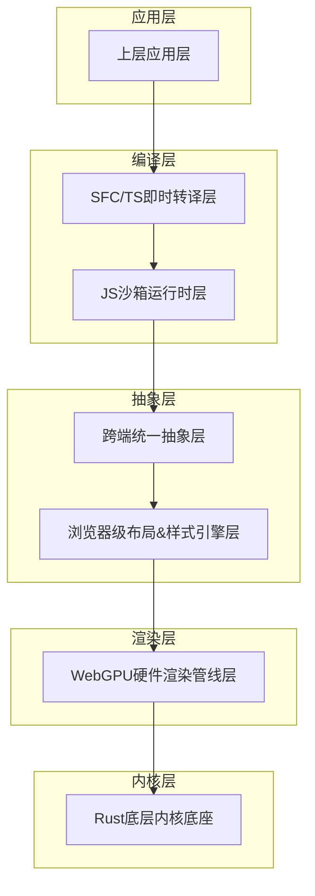

**图表来源**
- [doc.txt:7-22](file://doc.txt#L7-L22)

### 分层架构特点

1. **完全解耦**：每层都有明确的职责边界
2. **跨端统一**：上层应用无需关心底层平台差异
3. **可替换性**：各层组件可以独立演进和替换
4. **性能优先**：从底层到上层都注重性能优化

**章节来源**
- [doc.txt:7-22](file://doc.txt#L7-L22)

## 核心组件

### Rust底层内核底座

作为整个系统的根基，底层内核底座承担着以下关键职责：

#### 基础能力矩阵

| 能力类别 | 具体实现 | 平台支持 |
|---------|----------|----------|
| 跨端窗口管理 | winit原生窗口 + Vulkan/Metal/DX12 | Windows/macOS/Linux |
| 异步调度系统 | 基于Tokio的高性能调度器 | 所有平台 |
| 内存池设计 | 自研内存池管理器 | 所有平台 |
| 文件IO系统 | 跨平台文件操作接口 | 所有平台 |
| 原生网络栈 | 自研Rust网络协议栈 | 所有平台 |
| 缓存系统 | 多级缓存管理器 | 所有平台 |

#### 跨端适配策略

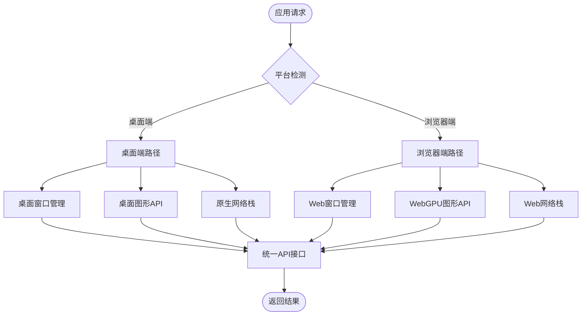

**图表来源**
- [doc.txt:26-28](file://doc.txt#L26-L28)

**章节来源**
- [doc.txt:23-29](file://doc.txt#L23-L29)

## 架构概览

### 整体技术架构

Leivue Runtime采用七层分层架构，每一层都有明确的职责和边界：

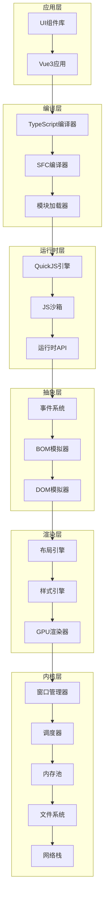

**图表来源**
- [doc.txt:10-22](file://doc.txt#L10-L22)

### 核心依赖库集成

#### 主要依赖库

| 依赖库 | 版本要求 | 用途 | 集成方式 |
|--------|----------|------|----------|
| wgpu | 最新稳定版 | WebGPU图形API | 直接依赖 |
| winit | 最新稳定版 | 跨平台窗口管理 | 直接依赖 |
| tokio | 最新稳定版 | 异步运行时 | 直接依赖 |
| reqwest | 最新稳定版 | HTTP客户端 | 直接依赖 |

#### 依赖关系图

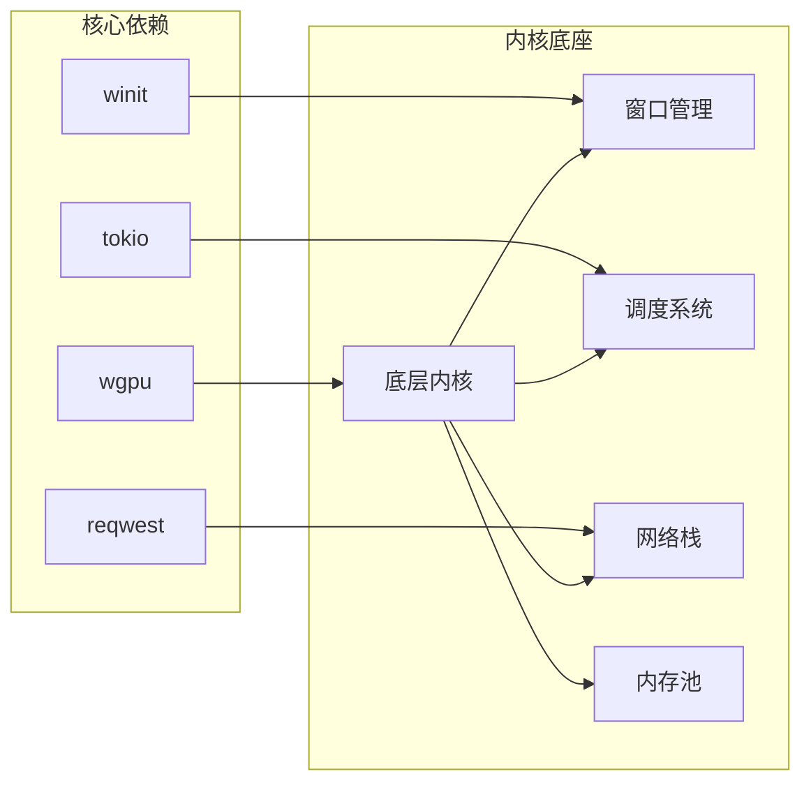

**图表来源**
- [doc.txt:29](file://doc.txt#L29)

**章节来源**
- [doc.txt:29](file://doc.txt#L29)

## 详细组件分析

### 跨端窗口管理系统

#### 设计原则

1. **抽象统一**：为不同平台提供一致的窗口管理接口
2. **性能优先**：最小化跨平台抽象带来的性能损耗
3. **事件驱动**：基于事件驱动的窗口状态管理
4. **资源高效**：优化窗口资源的分配和回收

#### 桌面端实现

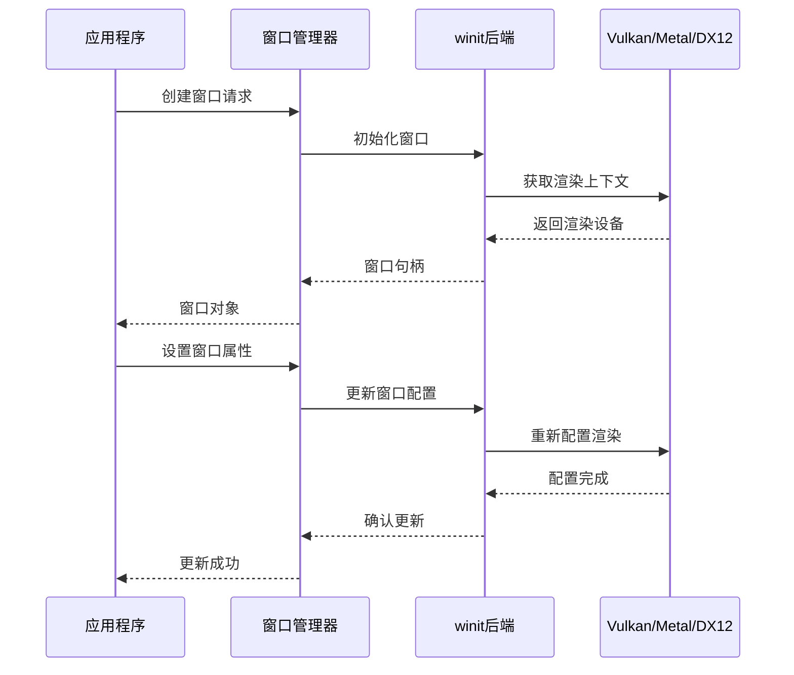

**图表来源**
- [doc.txt:27](file://doc.txt#L27)

#### 浏览器端实现

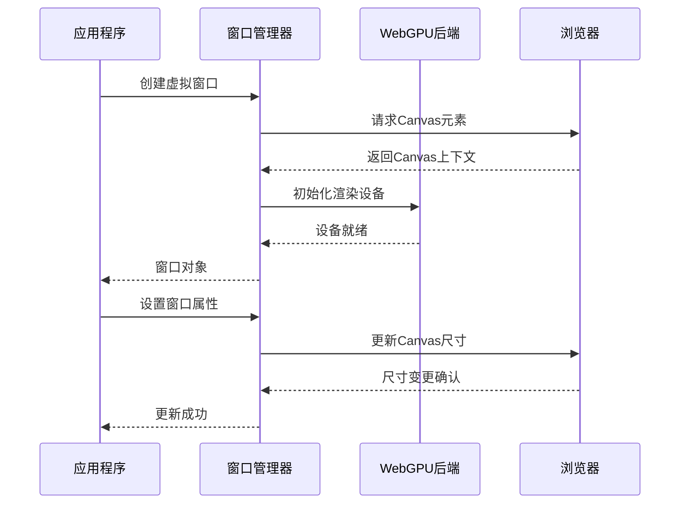

**图表来源**
- [doc.txt:28](file://doc.txt#L28)

### 异步调度系统

#### Tokio集成策略

1. **多层调度**：应用层、内核层、系统层分别使用不同的调度器
2. **任务优先级**：根据任务类型设置不同的优先级
3. **资源隔离**：避免不同类型的调度任务相互影响
4. **性能监控**：实时监控调度性能指标

#### 调度器架构

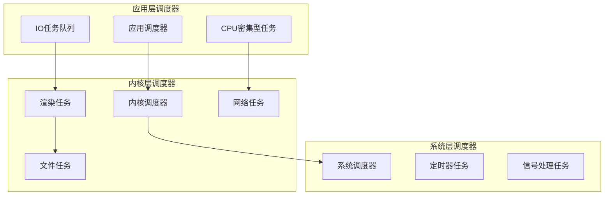

**图表来源**
- [doc.txt:25](file://doc.txt#L25)

### 内存池设计

#### 内存池架构

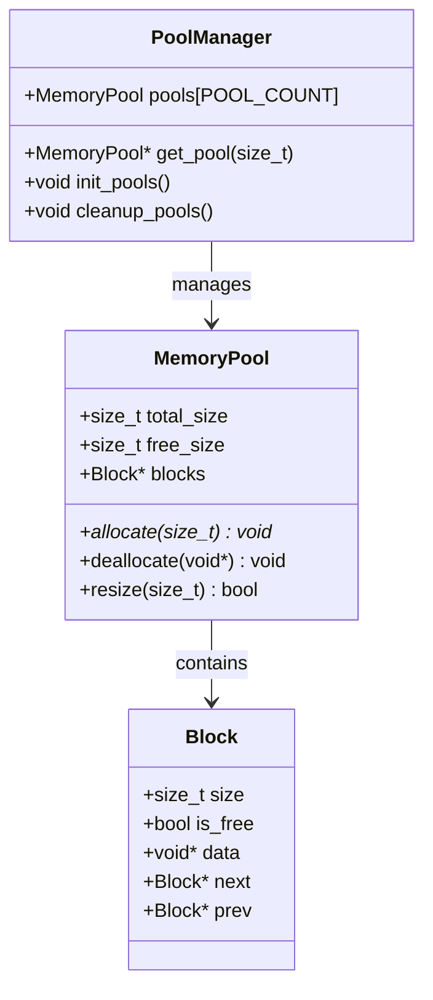

**图表来源**
- [doc.txt:25](file://doc.txt#L25)

#### 内存分配策略

1. **分层池化**：针对不同大小的对象使用不同的内存池
2. **预分配机制**：提前分配大块内存以减少系统调用
3. **碎片整理**：定期整理内存碎片提高利用率
4. **安全检查**：防止内存越界和重复释放

**章节来源**
- [doc.txt:25](file://doc.txt#L25)

### 原生网络栈

#### 网络栈架构

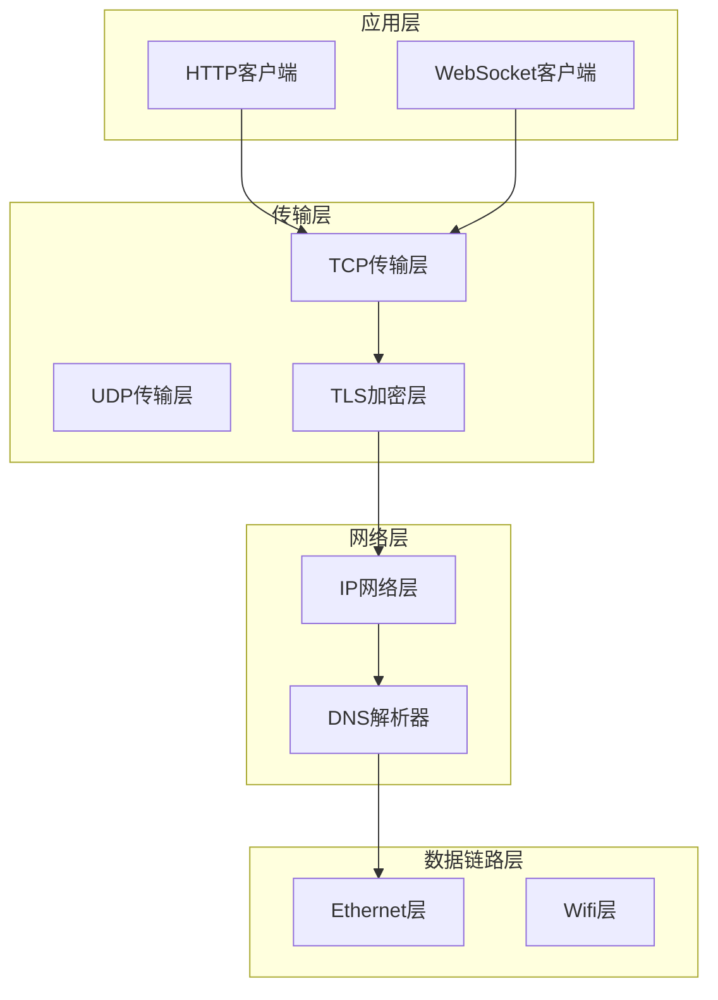

**图表来源**
- [doc.txt:90](file://doc.txt#L90)

#### 跨域突破机制

1. **代理服务器**：在本地启动代理服务器处理跨域请求
2. **CORS策略**：动态调整CORS头部信息
3. **安全沙箱**：确保跨域访问的安全性
4. **性能优化**：缓存DNS解析结果和连接池

**章节来源**
- [doc.txt:90](file://doc.txt#L90)

## 依赖关系分析

### 核心依赖关系

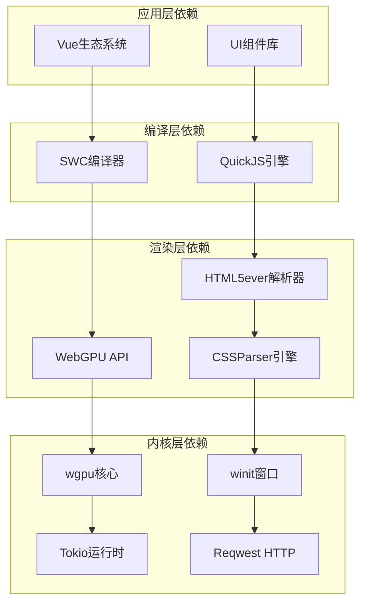

**图表来源**
- [doc.txt:29](file://doc.txt#L29)

### 模块间耦合度分析

| 模块 | 内部耦合 | 外部依赖 | 设计复杂度 |
|------|----------|----------|------------|
| 底层内核 | 低耦合 | 中等依赖 | 中等复杂度 |
| 窗口管理 | 低耦合 | 高依赖 | 中等复杂度 |
| 异步调度 | 低耦合 | 中等依赖 | 中等复杂度 |
| 内存池 | 低耦合 | 低依赖 | 低复杂度 |
| 网络栈 | 低耦合 | 高依赖 | 高复杂度 |

**章节来源**
- [doc.txt:29](file://doc.txt#L29)

## 性能考虑

### 性能优化策略

#### 内存优化

1. **零拷贝设计**：尽量避免不必要的数据复制
2. **对象池化**：重用频繁创建的对象
3. **内存对齐**：优化内存访问性能
4. **垃圾回收优化**：减少GC停顿时间

#### 并发优化

1. **无锁数据结构**：在热点路径使用无锁算法
2. **工作窃取**：平衡不同线程的工作负载
3. **批量处理**：合并小任务提高效率
4. **异步I/O**：非阻塞I/O操作

#### 渲染优化

1. **GPU命令缓冲**：批量提交GPU命令
2. **纹理图集**：减少纹理切换开销
3. **批渲染**：合并相似的渲染操作
4. **延迟提交**：延迟到下一帧执行的优化

### 性能监控

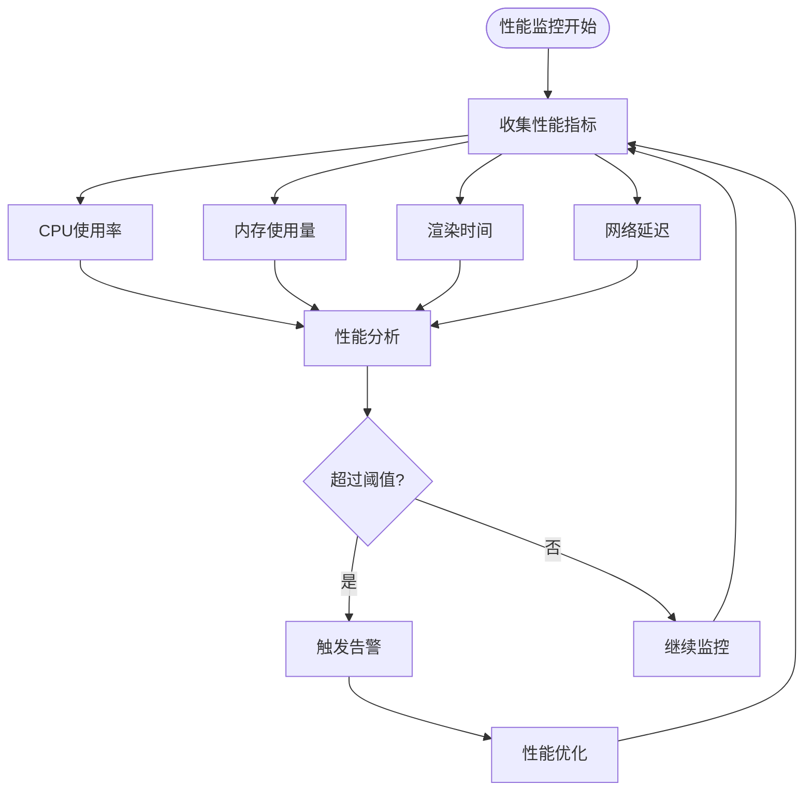

## 故障排除指南

### 常见问题诊断

#### 窗口管理问题

| 问题症状 | 可能原因 | 解决方案 |
|----------|----------|----------|
| 窗口无法创建 | 权限不足 | 检查用户权限设置 |
| 窗口显示异常 | 图形驱动问题 | 更新显卡驱动 |
| 窗口事件丢失 | 事件队列溢出 | 增加事件缓冲区 |
| 窗口闪烁 | 垂直同步问题 | 调整VSync设置 |

#### 网络连接问题

| 问题症状 | 可能原因 | 解决方案 |
|----------|----------|----------|
| 无法连接外网 | 防火墙阻止 | 检查防火墙规则 |
| 跨域请求失败 | CORS配置错误 | 配置正确的CORS头 |
| DNS解析失败 | DNS服务器问题 | 更换DNS服务器 |
| 连接超时 | 网络拥塞 | 实现重连机制 |

#### 内存泄漏问题

| 问题症状 | 可能原因 | 解决方案 |
|----------|----------|----------|
| 内存持续增长 | 对象未正确释放 | 检查引用计数 |
| 堆碎片化 | 频繁小对象分配 | 使用对象池 |
| 泄漏检测困难 | 内存映射问题 | 启用内存跟踪 |
| 性能下降 | 内存压力过大 | 实施内存回收策略 |

### 调试工具

1. **性能分析器**：监控CPU和内存使用情况
2. **网络抓包工具**：分析网络通信问题
3. **内存分析器**：检测内存泄漏和碎片化
4. **日志系统**：完整的错误追踪和调试信息

**章节来源**
- [doc.txt:90](file://doc.txt#L90)

## 结论

Leivue Runtime的底层内核底座代表了现代前端运行时技术的前沿发展方向。通过纯Rust实现的内存安全设计，结合跨端统一的抽象层，为Vue3应用提供了前所未有的性能和灵活性。

### 技术优势总结

1. **性能卓越**：零编译、零配置的直接运行模式
2. **跨端统一**：桌面端和浏览器端共享同一套内核
3. **内存安全**：完全避免了传统JavaScript运行时的内存安全问题
4. **生态兼容**：完整支持Vue3生态系统和主流UI库
5. **部署灵活**：支持多种部署模式和运行环境

### 发展前景

随着WebGPU技术的不断成熟和Rust生态系统的持续发展，Leivue Runtime有望成为下一代前端应用开发的标准运行时平台。其独特的设计理念和技术架构为前端工程化带来了革命性的变化，为开发者提供了更加自由和高效的开发体验。