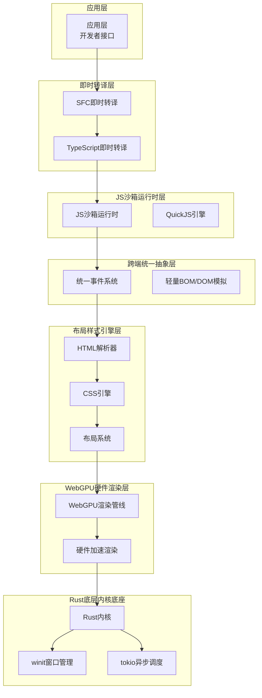
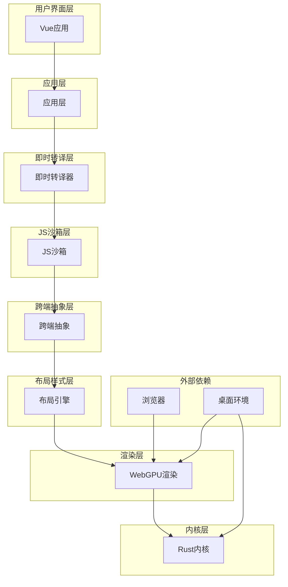
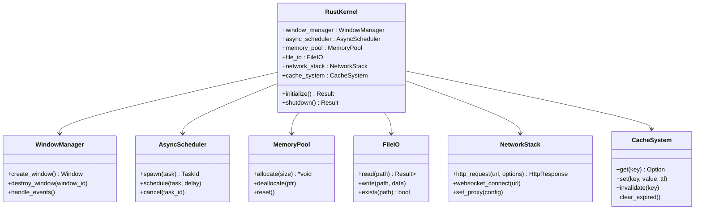
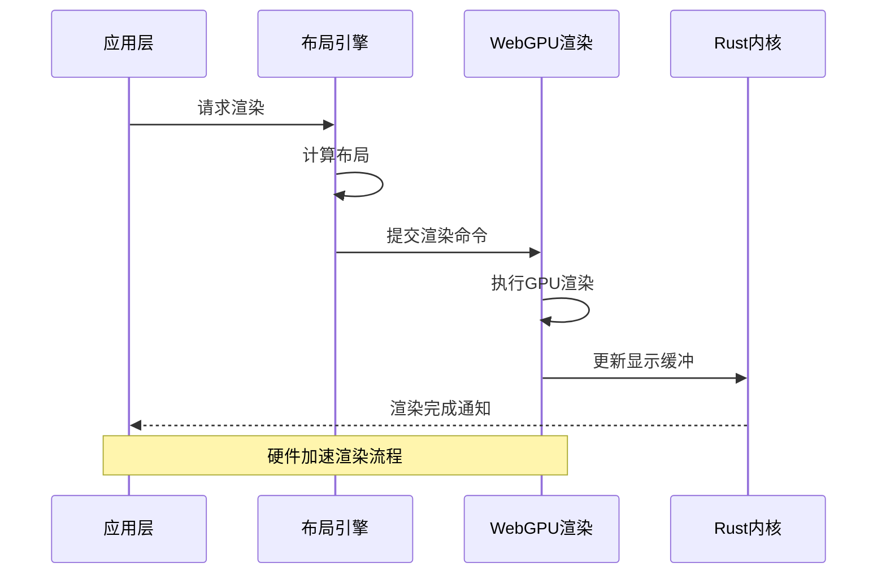
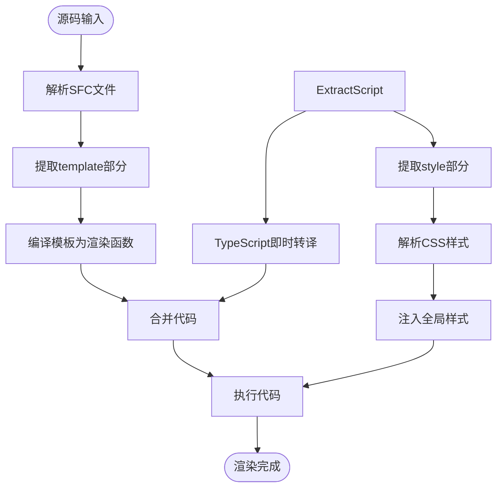
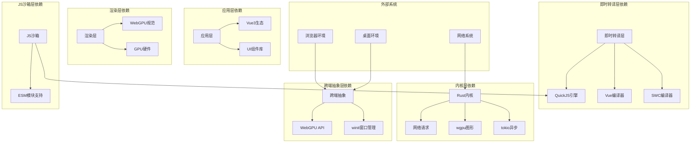

# 技术架构详解

<cite>
**本文档引用的文件**
- [doc.txt](file://doc.txt)
- [todo.txt](file://todo.txt)
</cite>

## 目录
1. [引言](#引言)
2. [项目结构](#项目结构)
3. [核心组件](#核心组件)
4. [架构概览](#架构概览)
5. [详细组件分析](#详细组件分析)
6. [依赖关系分析](#依赖关系分析)
7. [性能考虑](#性能考虑)
8. [故障排除指南](#故障排除指南)
9. [结论](#结论)

## 引言

Leivue Runtime是一个革命性的前端运行时引擎，旨在彻底改变现代Web应用的开发和运行方式。该项目的核心目标是消除传统的前端工程化流程，突破浏览器沙箱限制，并为Vue生态系统提供高性能的跨端运行底座。

该引擎采用七层分层架构设计，每层都有明确的职责边界和解耦原则。通过完全脱离Node.js、浏览器DOM和传统编译打包流程，Leivue Runtime实现了真正的零编译直接执行能力，支持Vue3 + TypeScript的原生运行，并完全兼容Element Plus、Ant Design Vue等主流UI库。

## 项目结构

Leivue Runtime采用严格的七层分层架构，从底层到上层依次为：

**图表来源**
- [doc.txt:7-22](file://doc.txt#L7-L22)

**章节来源**
- [doc.txt:7-22](file://doc.txt#L7-L22)

## 核心组件

### 1. Rust底层内核底座

**核心定位**：纯Rust编写的高性能内核，提供跨端运行时基础设施

**关键技术特性**：
- **内存安全**：完全无GC，确保内存安全和高性能
- **跨端适配**：桌面端使用winit原生窗口 + Vulkan/Metal/DX12，浏览器端WASM编译 + WebGPU API绑定
- **基础能力**：跨端窗口管理、异步调度、内存池、文件IO、原生网络栈、缓存系统
- **核心依赖**：wgpu、winit、tokio、reqwest

**架构优势**：
- 提供统一的跨端抽象，确保桌面和浏览器模式的一致性
- 通过Rust的内存安全保证，避免常见的内存泄漏和越界访问问题
- 异步调度机制支持高并发场景下的稳定性能

**章节来源**
- [doc.txt:23-29](file://doc.txt#L23-L29)

### 2. WebGPU硬件渲染层

**核心定位**：完全替代原生DOM渲染的GPU硬件加速渲染引擎

**核心技术能力**：
- **GPU优先渲染**：完全抛弃浏览器DOM渲染流水线，采用自研GPU渲染
- **标准兼容**：基于WebGPU规范，统一桌面和浏览器渲染接口
- **高级渲染特性**：批渲染、矢量绘制、圆角/阴影/渐变、纹理图集、字体渲染、图层合成
- **性能优势**：60fps稳定渲染、大列表/复杂组件无卡顿、CPU开销极低

**技术实现要点**：
- 通过WebGPU API实现硬件加速，充分利用GPU并行计算能力
- 支持复杂的图形效果和视觉特性，提供接近原生应用的渲染体验
- 优化的渲染管线减少CPU负担，提升整体系统性能

**章节来源**
- [doc.txt:30-34](file://doc.txt#L30-L34)

### 3. 布局样式引擎层

**核心定位**：迷你浏览器内核级别的布局和样式处理能力

**浏览器级兼容性**：
- **HTML解析**：使用html5ever工业级解析器，生成标准DOM节点树
- **CSS引擎**：支持cssparser解析、选择器匹配、样式继承、权重计算
- **布局系统**：自研盒模型、Flex、流式布局，对标W3C标准
- **样式挂载**：支持全局样式、Scoped样式、第三方UI库CSS全局注入

**技术实现特点**：
- 复刻标准浏览器CSS体系，确保与现有Web标准的完全兼容
- 提供完整的布局算法实现，支持复杂的页面布局需求
- 优化的样式计算和应用机制，确保渲染性能

**章节来源**
- [doc.txt:35-41](file://doc.txt#L35-L41)

### 4. 跨端统一抽象层

**核心定位**：抹平桌面端和浏览器端差异的统一抽象层

**统一能力**：
- **统一事件系统**：支持鼠标、键盘、滚动、点击命中检测
- **轻量BOM/DOM模拟**：提供window/document/Event等核心API的轻量实现
- **无真实DOM**：仅做逻辑模拟，实际绘制全部走WebGPU

**设计哲学**：
- 通过抽象层屏蔽底层差异，确保上层应用无需关心运行环境
- 提供完整的浏览器API兼容性，确保第三方库的无缝运行
- 保持最小实现原则，避免不必要的功能冗余

**章节来源**
- [doc.txt:42-46](file://doc.txt#L42-L46)

### 5. JS沙箱运行时层

**核心定位**：独立隔离的JavaScript执行环境

**技术实现**：
- **JS引擎**：采用QuickJS（轻量高性能、WASM友好、Rust深度绑定）
- **沙箱隔离**：与宿主环境完全隔离，提供安全的脚本执行环境
- **内置运行时**：预加载Vue3完整运行时（runtime-core/runtime-dom）
- **模块系统**：自研ESM解析器，支持import/export、第三方包引入

**安全机制**：
- 通过沙箱隔离防止恶意代码对宿主系统的攻击
- 严格的权限控制和资源限制
- 完全的脚本隔离执行，避免状态污染

**章节来源**
- [doc.txt:47-51](file://doc.txt#L47-L51)

### 6. 即时转译层

**核心定位**：实现零编译直接运行的核心转译系统

**三大核心能力**：
- **TypeScript即时转译**：基于Rust swc，内存内实时TS→JS，支持泛型/装饰器/TSX
- **Vue SFC即时编译**：使用官方Rust库解析.vue，自动拆分template/script-setup/style，Template实时编译为Vue渲染函数
- **Script自动转译**：Script自动TS转译，Style自动解析并入全局样式系统

**技术优势**：
- 无构建打包：完全摆脱Vite/Webpack/tsc，无node_modules强依赖
- 实时热更新：修改源码即时刷新，无构建等待
- 零工程化：无Node、无npm、无依赖配置即可开发

**章节来源**
- [doc.txt:52-61](file://doc.txt#L52-L61)

### 7. 应用层

**核心定位**：面向开发者的直接运行接口

**开发者体验**：
- **直接运行**：支持.vue/.ts/.tsx原始源码直接运行
- **生态兼容**：完整支持Element Plus、Ant Design Vue、Naive UI等Vue3生态库
- **开发模式**：源码直接运行、毫秒级热更新、零配置、零依赖安装

**迁移友好性**：
- 现有Vue项目低成本迁移，几乎无需改业务代码
- 一键跨端打包：支持Windows/macOS/Linux多平台分发
- 适配私有化/内网/涉密环境，无外网依赖

**章节来源**
- [doc.txt:62-64](file://doc.txt#L62-L64)

## 架构概览

Leivue Runtime的整体架构体现了高度的模块化和解耦设计。从底层的Rust内核到底层的WebGPU渲染，每一层都承担着特定的职责，并通过清晰的接口进行交互。

**图表来源**
- [doc.txt:7-22](file://doc.txt#L7-L22)

## 详细组件分析

### Rust内核底座架构

**图表来源**
- [doc.txt:23-29](file://doc.txt#L23-L29)

### WebGPU渲染管线

**图表来源**
- [doc.txt:30-34](file://doc.txt#L30-L34)

### 即时转译工作流

**图表来源**
- [doc.txt:52-61](file://doc.txt#L52-L61)

**章节来源**
- [doc.txt:23-64](file://doc.txt#L23-L64)

## 依赖关系分析

Leivue Runtime的依赖关系体现了清晰的层次化设计，每个层级都有明确的依赖方向和职责划分。

**图表来源**
- [doc.txt:23-64](file://doc.txt#L23-L64)

**章节来源**
- [doc.txt:23-64](file://doc.txt#L23-L64)

## 性能考虑

### 渲染性能优化

Leivue Runtime在渲染性能方面采用了多项优化策略：

1. **GPU硬件加速**：完全绕过DOM渲染，直接使用WebGPU进行硬件加速
2. **批渲染优化**：将多个渲染操作合并为批处理，减少GPU状态切换
3. **内存池管理**：通过Rust的内存池机制减少频繁的内存分配和释放
4. **异步调度**：使用tokio进行高效的异步任务调度

### 执行性能优化

1. **即时转译**：避免传统编译构建流程，实现源码直接运行
2. **沙箱隔离**：QuickJS引擎提供高性能的JavaScript执行环境
3. **缓存系统**：内置缓存机制减少重复计算和网络请求
4. **零依赖**：摆脱传统包管理器，减少启动时间和内存占用

### 跨端性能一致性

通过统一的抽象层设计，Leivue Runtime确保了桌面端和浏览器端的性能一致性，消除了平台差异带来的性能损失。

## 故障排除指南

### 常见问题诊断

1. **渲染异常**：检查WebGPU支持情况和GPU驱动版本
2. **脚本执行错误**：验证QuickJS沙箱配置和模块导入路径
3. **跨端兼容性问题**：确认事件系统和API模拟的正确性
4. **即时转译失败**：检查SWC编译器配置和TypeScript语法支持

### 性能调优建议

1. **GPU性能监控**：定期检查WebGPU渲染性能指标
2. **内存使用分析**：监控内存池使用情况和垃圾回收频率
3. **网络请求优化**：合理配置缓存策略和请求超时时间
4. **异步任务调度**：优化tokio任务队列和并发度设置

### 安全防护措施

1. **沙箱隔离验证**：定期测试JS沙箱的隔离效果
2. **权限控制检查**：验证文件系统和网络访问权限
3. **代码注入防护**：检查输入验证和输出编码机制
4. **缓存安全**：确保敏感数据不会被不当缓存

**章节来源**
- [doc.txt:88-97](file://doc.txt#L88-L97)

## 结论

Leivue Runtime代表了前端运行时技术的重大突破，通过七层分层架构设计实现了真正的跨端统一和高性能执行。其核心创新包括：

1. **架构创新**：七层分层设计提供了极强的解耦性和可维护性
2. **性能突破**：GPU硬件加速和即时转译技术显著提升了运行效率
3. **生态兼容**：完全兼容Vue生态系统，降低迁移成本
4. **安全隔离**：通过JS沙箱提供可靠的安全保障
5. **跨端统一**：抹平桌面端和浏览器端的差异

该项目为现代Web应用开发提供了全新的技术路径，有望彻底改变前端工程化的现状，为开发者提供更高效、更安全、更一致的开发体验。

随着项目的进一步发展，Leivue Runtime将在以下方面持续演进：
- 更完善的浏览器兼容性支持
- 更丰富的UI组件生态集成
- 更强大的性能优化和监控能力
- 更完善的开发工具链支持