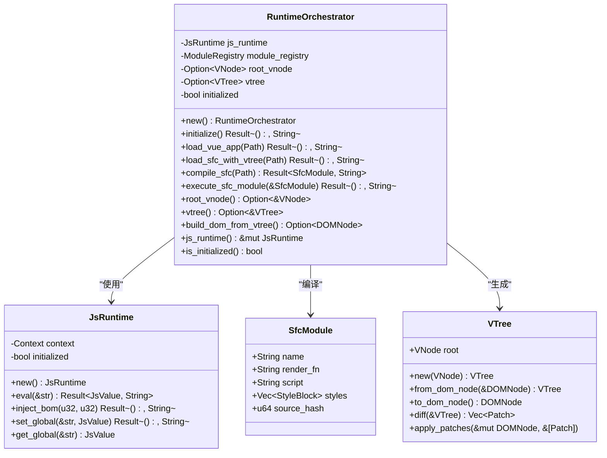
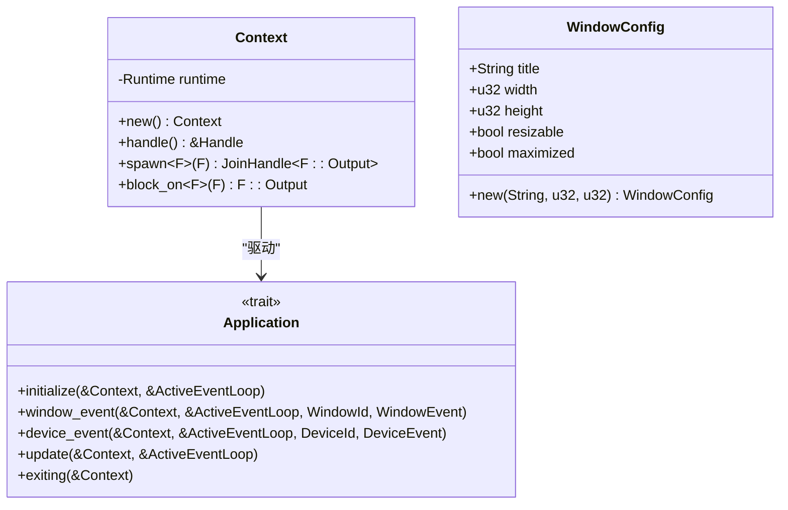
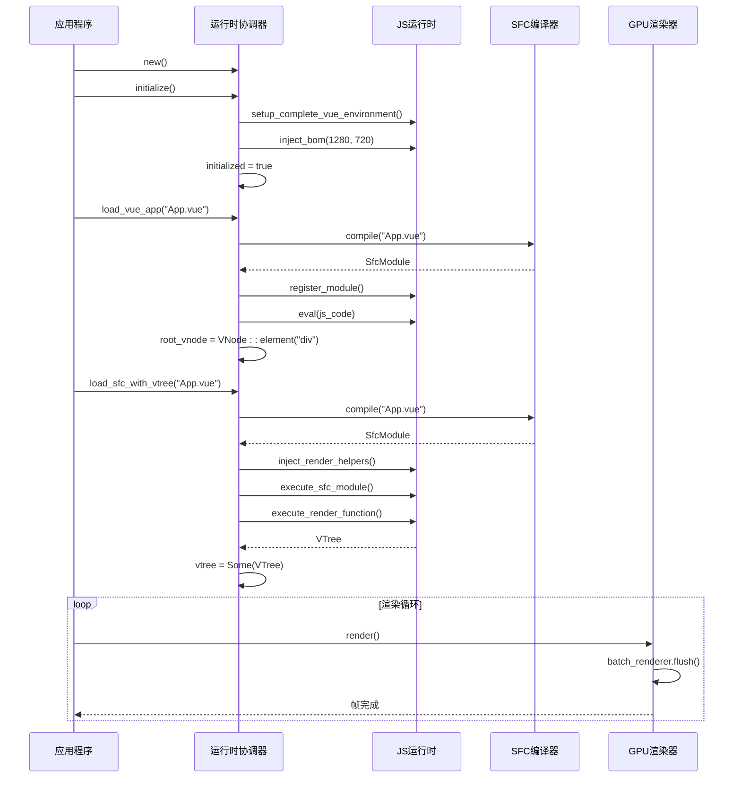
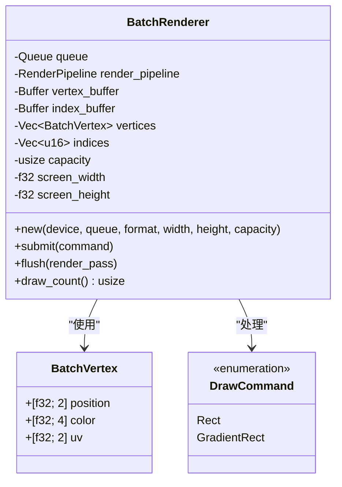
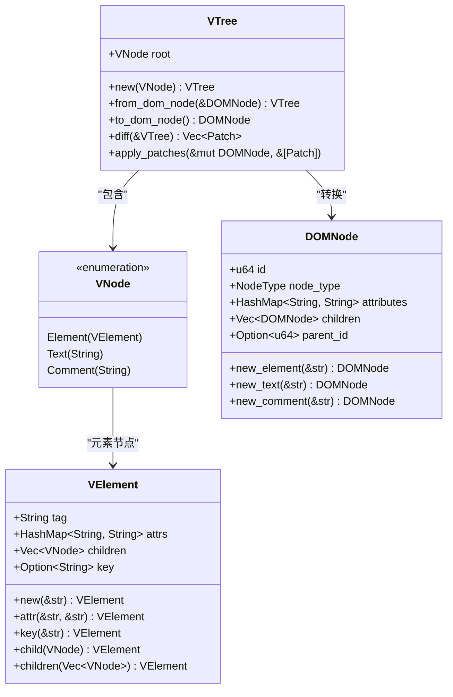
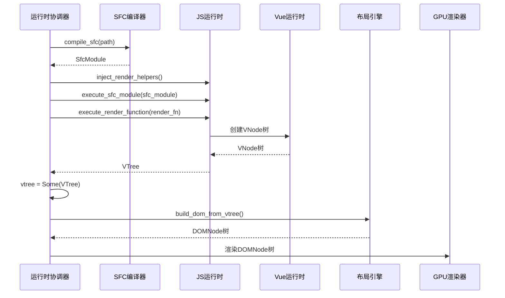
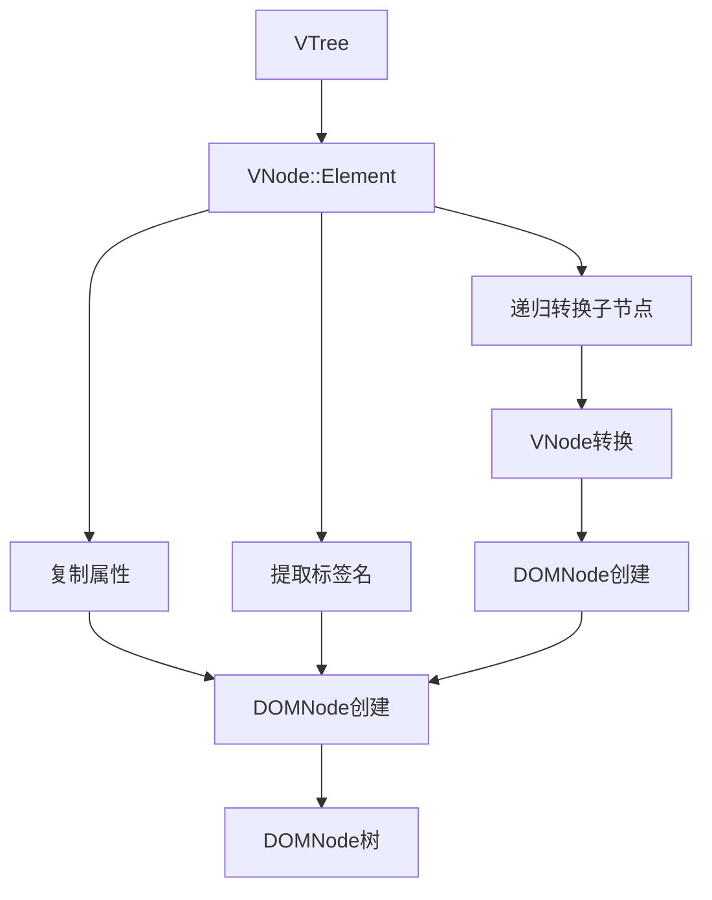

# Iris运行时协调器

<cite>
**本文档引用的文件**
- [orchestrator.rs](file://crates/iris-engine/src/orchestrator.rs)
- [vdom.rs](file://crates/iris-layout/src/vdom.rs)
- [vue.rs](file://crates/iris-js/src/vue.rs)
- [PHASE_B_COMPLETION_SUMMARY.md](file://PHASE_B_COMPLETION_SUMMARY.md)
- [SFC_RENDER_INTEGRATION_PLAN.md](file://SFC_RENDER_INTEGRATION_PLAN.md)
- [lib.rs](file://crates/iris/src/lib.rs)
- [lib.rs](file://crates/iris-core/src/lib.rs)
- [runtime.rs](file://crates/iris-core/src/runtime.rs)
- [window.rs](file://crates/iris-core/src/window.rs)
- [lib.rs](file://crates/iris-dom/src/lib.rs)
- [vnode.rs](file://crates/iris-dom/src/vnode.rs)
- [lib.rs](file://crates/iris-gpu/src/lib.rs)
- [batch_renderer.rs](file://crates/iris-gpu/src/batch_renderer.rs)
- [file_watcher_integration.rs](file://crates/iris-gpu/tests/file_watcher_integration.rs)
- [lib.rs](file://crates/iris-js/src/lib.rs)
- [vm.rs](file://crates/iris-js/src/vm.rs)
- [lib.rs](file://crates/iris-sfc/src/lib.rs)
- [integration_test.rs](file://crates/iris-sfc/tests/integration_test.rs)
- [main.rs](file://crates/iris-app/src/main.rs)
- [Cargo.toml](file://Cargo.toml)
</cite>

## 更新摘要
**所做更改**
- 新增了Phase B完成的VTree虚拟DOM树生成功能章节
- 更新了运行时协调器架构图以反映VTree集成
- 增强了SFC编译器到VTree转换流程的详细说明
- 添加了VTree到DOMNode转换的完整实现分析
- 更新了测试覆盖分析以包含VTree相关测试

## 目录
1. [简介](#简介)
2. [项目结构](#项目结构)
3. [核心组件](#核心组件)
4. [架构概览](#架构概览)
5. [详细组件分析](#详细组件分析)
6. [Phase B完成：VTree虚拟DOM树生成功能](#phase-b完成vtree虚拟dom树生成功能)
7. [测试覆盖增强](#测试覆盖增强)
8. [依赖关系分析](#依赖关系分析)
9. [性能考量](#性能考量)
10. [故障排除指南](#故障排除指南)
11. [结论](#结论)

## 简介

Iris运行时协调器是一个基于Rust和WebGPU的下一代无构建前端运行时系统。该项目的核心目标是提供一个完整的Vue 3运行时环境，支持零编译直接运行源码，具备毫秒级热更新能力和跨平台部署特性。

系统采用模块化架构设计，将各个功能模块解耦，通过运行时协调器统一管理和编排。主要特性包括：

- **零编译运行**：直接执行.vue/.ts/.tsx源码，无需传统构建流程
- **毫秒级热更新**：文件变更自动检测和增量更新
- **跨平台支持**：桌面原生应用和浏览器WASM部署
- **WebGPU硬件加速**：利用现代GPU进行高效渲染
- **Vue 3完整生态**：支持Vue 3的所有核心特性和生态系统
- **完整的虚拟DOM树生成**：支持从SFC渲染函数到VTree再到DOM的完整转换流程

## 项目结构

Iris项目采用多crate工作区结构，每个crate负责特定的功能领域：

```mermaid
graph TB
subgraph "Iris引擎工作区"
subgraph "核心层"
CORE[iris-core<br/>基础内核]
GPU[iris-gpu<br/>WebGPU渲染]
LAYOUT[iris-layout<br/>布局引擎]
END
subgraph "运行时层"
DOM[iris-dom<br/>DOM抽象]
JS[iris-js<br/>JS运行时]
SFC[iris-sfc<br/>SFC编译器]
END
subgraph "应用层"
APP[iris-app<br/>应用入口]
ENGINE[iris-engine<br/>元crate]
END
END
ENGINE --> CORE
ENGINE --> GPU
ENGINE --> LAYOUT
ENGINE --> DOM
ENGINE --> JS
ENGINE --> SFC
APP --> ENGINE
APP --> GPU
APP --> CORE
```

**图表来源**
- [Cargo.toml:1-31](file://Cargo.toml#L1-L31)
- [lib.rs:1-78](file://crates/iris/src/lib.rs#L1-L78)

**章节来源**
- [Cargo.toml:1-31](file://Cargo.toml#L1-L31)
- [lib.rs:1-78](file://crates/iris/src/lib.rs#L1-L78)

## 核心组件

### 运行时协调器 (RuntimeOrchestrator)

运行时协调器是Iris系统的核心编排组件，负责管理整个运行时生命周期和模块间的协调工作。



**图表来源**
- [orchestrator.rs:44-233](file://crates/iris-engine/src/orchestrator.rs#L44-L233)
- [vm.rs:28-147](file://crates/iris-js/src/vm.rs#L28-L147)
- [vdom.rs:151-231](file://crates/iris-layout/src/vdom.rs#L151-L231)

### 核心运行时 (Iris Core)

Iris核心提供了跨平台的基础运行时能力，包括异步调度、窗口管理和资源管理。



**图表来源**
- [lib.rs:13-56](file://crates/iris-core/src/lib.rs#L13-L56)
- [window.rs:7-44](file://crates/iris-core/src/window.rs#L7-L44)

**章节来源**
- [orchestrator.rs:44-233](file://crates/iris-engine/src/orchestrator.rs#L44-L233)
- [lib.rs:13-56](file://crates/iris-core/src/lib.rs#L13-L56)
- [window.rs:7-44](file://crates/iris-core/src/window.rs#L7-L44)

## 架构概览

Iris系统的整体架构采用分层设计，从底层硬件抽象到上层应用逻辑逐层构建：

```mermaid
graph TB
subgraph "硬件层"
WEBGPU[WebGPU API]
GPU_DEVICE[GPU设备]
END
subgraph "渲染层"
BATCH_RENDERER[批渲染器]
RENDERER[渲染器]
END
subgraph "布局层"
LAYOUT_ENGINE[布局引擎]
CSS_PARSER[CSS解析器]
END
subgraph "DOM层"
VNODE[VNode虚拟DOM]
VTREE[VTree虚拟DOM树]
DOMNODE[DOMNode真实DOM]
EVENT_DISPATCHER[事件分发器]
BOM_API[BOM API]
END
subgraph "JS层"
JS_RUNTIME[JS运行时]
MODULE_REGISTRY[模块注册表]
VUE_RUNTIME[Vue运行时]
END
subgraph "编译层"
SFC_COMPILER[SFC编译器]
TS_COMPILER[TypeScript编译器]
TEMPLATE_COMPILER[模板编译器]
END
subgraph "应用层"
RUNTIME_ORCHESTRATOR[运行时协调器]
APPLICATION[应用程序]
END
WEBGPU --> RENDERER
RENDERER --> BATCH_RENDERER
BATCH_RENDERER --> DOMNODE
LAYOUT_ENGINE --> DOMNODE
CSS_PARSER --> LAYOUT_ENGINE
DOMNODE --> EVENT_DISPATCHER
EVENT_DISPATCHER --> BOM_API
JS_RUNTIME --> VUE_RUNTIME
MODULE_REGISTRY --> JS_RUNTIME
SFC_COMPILER --> JS_RUNTIME
TS_COMPILER --> SFC_COMPILER
TEMPLATE_COMPILER --> SFC_COMPILER
RUNTIME_ORCHESTRATOR --> SFC_COMPILER
RUNTIME_ORCHESTRATOR --> JS_RUNTIME
RUNTIME_ORCHESTRATOR --> VTREE
RUNTIME_ORCHESTRATOR --> RENDERER
RUNTIME_ORCHESTRATOR --> APPLICATION
```

**图表来源**
- [lib.rs:1-78](file://crates/iris/src/lib.rs#L1-L78)
- [lib.rs:1-48](file://crates/iris-dom/src/lib.rs#L1-L48)
- [lib.rs:1-502](file://crates/iris-gpu/src/lib.rs#L1-L502)
- [lib.rs:1-43](file://crates/iris-js/src/lib.rs#L1-L43)
- [lib.rs:1-800](file://crates/iris-sfc/src/lib.rs#L1-L800)

## 详细组件分析

### 运行时协调器工作流程

运行时协调器负责管理从初始化到渲染的完整生命周期：



**图表来源**
- [orchestrator.rs:94-216](file://crates/iris-engine/src/orchestrator.rs#L94-L216)
- [lib.rs:287-349](file://crates/iris-sfc/src/lib.rs#L287-L349)

### SFC编译器架构

SFC编译器负责将.vue文件转换为可执行的JavaScript代码：


**图表来源**
- [lib.rs:287-428](file://crates/iris-sfc/src/lib.rs#L287-L428)
- [lib.rs:565-608](file://crates/iris-sfc/src/lib.rs#L565-L608)
- [lib.rs:610-672](file://crates/iris-sfc/src/lib.rs#L610-L672)

### 批渲染系统

批渲染系统通过合并多次绘制调用为单次GPU渲染来提高性能：



**图表来源**
- [batch_renderer.rs:86-199](file://crates/iris-gpu/src/batch_renderer.rs#L86-L199)
- [batch_renderer.rs:11-49](file://crates/iris-gpu/src/batch_renderer.rs#L11-L49)

**章节来源**
- [orchestrator.rs:94-216](file://crates/iris-engine/src/orchestrator.rs#L94-L216)
- [lib.rs:287-428](file://crates/iris-sfc/src/lib.rs#L287-L428)
- [batch_renderer.rs:86-199](file://crates/iris-gpu/src/batch_renderer.rs#L86-L199)

## Phase B完成：VTree虚拟DOM树生成功能

### VTree虚拟DOM树架构

Phase B的完成标志着Iris系统实现了从SFC渲染函数到完整DOM树的转换能力。新增的VTree虚拟DOM树提供了更强大的虚拟DOM表示和转换功能。



**图表来源**
- [vdom.rs:151-231](file://crates/iris-layout/src/vdom.rs#L151-L231)
- [vdom.rs:8-30](file://crates/iris-layout/src/vdom.rs#L8-L30)

### 运行时协调器的VTree集成

运行时协调器现在支持完整的VTree生成和转换流程：



**图表来源**
- [orchestrator.rs:184-227](file://crates/iris-engine/src/orchestrator.rs#L184-L227)

### 新增的API方法

运行时协调器新增了三个关键方法来支持VTree功能：

#### `load_sfc_with_vtree()`方法

这个方法实现了完整的SFC到VTree转换流程：

```rust
pub fn load_sfc_with_vtree<P: AsRef<Path>>(&mut self, path: P) -> Result<(), String> {
    if !self.initialized {
        return Err("Runtime not initialized. Call initialize() first.".to_string());
    }

    let path = path.as_ref();
    info!(path = ?path, "Loading SFC with VTree generation...");

    // 1. 编译 SFC
    let sfc_module = self.compile_sfc(path)?;
    info!(name = %sfc_module.name, "SFC compiled successfully");

    // 2. 注入 render 辅助函数
    debug!("Injecting render helpers...");
    inject_render_helpers(&mut self.js_runtime)
        .map_err(|e| format!("Failed to inject render helpers: {}", e))?;

    // 3. 执行 SFC 脚本（初始化组件）
    self.execute_sfc_module(&sfc_module)?;
    info!("SFC script executed");

    // 4. 执行 render 函数生成 VTree
    debug!("Executing render function...");
    let vtree = execute_render_function(&mut self.js_runtime, &sfc_module.render_fn)
        .map_err(|e| format!("Failed to execute render function: {}", e))?;

    info!("VTree generated successfully");
    
    // 5. 存储 VTree
    self.vtree = Some(vtree);

    Ok(())
}
```

#### `vtree()`方法

获取当前存储的VTree：

```rust
pub fn vtree(&self) -> Option<&VTree> {
    self.vtree.as_ref()
}
```

#### `build_dom_from_vtree()`方法

将VTree转换为DOM节点树：

```rust
pub fn build_dom_from_vtree(&self) -> Option<iris_layout::dom::DOMNode> {
    self.vtree.as_ref().map(|tree| tree.to_dom_node())
}
```

**章节来源**
- [orchestrator.rs:184-227](file://crates/iris-engine/src/orchestrator.rs#L184-L227)
- [PHASE_B_COMPLETION_SUMMARY.md:40-79](file://PHASE_B_COMPLETION_SUMMARY.md#L40-L79)

### VTree到DOMNode转换

VTree到DOMNode的转换是通过iris-layout模块提供的`to_dom_node()`方法实现的：



**图表来源**
- [vdom.rs:196-231](file://crates/iris-layout/src/vdom.rs#L196-L231)

**章节来源**
- [vdom.rs:196-231](file://crates/iris-layout/src/vdom.rs#L196-L231)
- [PHASE_B_COMPLETION_SUMMARY.md:107-127](file://PHASE_B_COMPLETION_SUMMARY.md#L107-L127)

## 测试覆盖增强

### 运行时生命周期测试

Iris运行时协调器经过了全面的测试覆盖增强，新增了10个关键测试用例，重点验证运行时生命周期和行为：

```mermaid
flowchart TD
TEST_SUITE[运行时协调器测试套件] --> INIT_TESTS[初始化测试]
INIT_TESTS --> TEST_CREATE["test_create_orchestrator<br/>创建运行时测试"]
INIT_TESTS --> TEST_INITIALIZE["test_initialize<br/>初始化测试"]
INIT_TESTS --> TEST_DOUBLE_INIT["test_double_initialize<br/>重复初始化测试"]
TEST_SUITE --> LIFECYCLE_TESTS[生命周期测试]
LIFECYCLE_TESTS --> TEST_LIFECYCLE["test_runtime_lifecycle<br/>完整生命周期测试"]
LIFECYCLE_TESTS --> TEST_LOAD_NO_INIT["test_load_without_initialize<br/>未初始化加载测试"]
TEST_SUITE --> JS_TESTS[JS运行时测试]
JS_TESTS --> TEST_JS_EXEC["test_js_execution_before_init<br/>初始化前JS执行测试"]
JS_TESTS --> TEST_JS_ERROR["test_js_error_handling<br/>JS错误处理测试"]
TEST_SUITE --> BOM_TESTS[BOM注入测试]
BOM_TESTS --> TEST_BOM_INJECTION["test_bom_injection_after_init<br/>BOM注入测试"]
TEST_SUITE --> SFC_TESTS[SFC编译测试]
SFC_TESTS --> TEST_SFC_COMPILATION["test_sfc_compilation<br/>SFC编译测试"]
SFC_TESTS --> TEST_COMPILE_SIMPLE["test_compile_and_load_simple<br/>简单编译测试"]
TEST_SUITE --> VTREE_TESTS[VTree测试]
VTREE_TESTS --> TEST_LOAD_SFC_VTREE["test_load_sfc_with_vtree<br/>VTree加载测试"]
VTREE_TESTS --> TEST_VTREE_TO_DOM["test_vtree_to_dom_conversion<br/>VTree到DOM转换测试"]
VTREE_TESTS --> TEST_LOAD_SFC_NO_VTREE["test_load_sfc_without_vtree<br/>无VTree加载测试"]
```



**图表来源**
- [orchestrator.rs:241-459](file://crates/iris-engine/src/orchestrator.rs#L241-L459)

### Vue环境注入测试

新增的测试用例专门验证Vue 3环境的正确注入和初始化：

1. **Vue全局对象验证**：测试`defineComponent`等Vue 3核心API的可用性
2. **BOM API完整性**：验证window、document、console等浏览器API的注入
3. **窗口尺寸配置**：测试`innerWidth`和`innerHeight`属性的正确设置
4. **全局变量访问**：验证Vue运行时的全局可访问性

### VTree相关测试

新增的VTree测试用例验证了完整的虚拟DOM树生成功能：

#### `test_load_sfc_with_vtree`测试

验证完整的SFC到VTree转换流程：

- 创建临时.vue文件（使用普通<script>标签避免模块语法问题）
- 初始化运行时环境
- 调用`load_sfc_with_vtree()`方法
- 验证流程执行（考虑JS运行时限制）

#### `test_vtree_to_dom_conversion`测试

验证VTree到DOMNode的转换逻辑：

- 手动创建VTree结构
- 调用`to_dom_node()`方法
- 验证DOM树结构的正确性
- 验证属性的正确传递
- 验证子节点的递归转换

#### `test_load_sfc_without_vtree`测试

验证错误处理机制：

- 未初始化时调用VTree相关方法应该失败
- 确保适当的错误消息返回

### 错误处理测试

测试套件包含了全面的错误处理验证：

- **初始化失败场景**：验证重复初始化的行为一致性
- **编译错误处理**：测试SFC编译过程中的错误传播
- **JS语法错误**：验证Boa引擎的错误报告机制
- **VTree生成错误**：验证渲染函数执行失败的处理
- **边界情况处理**：测试空模板、空脚本等边缘场景

### 集成测试分析

除了单元测试，Iris还包含了多个集成测试模块：

#### SFC编译器集成测试

Iris-SFC crate提供了完整的SFC编译器集成测试，涵盖：

- **完整Vue 3 SFC编译**：验证从.vue到JavaScript的完整转换流程
- **TypeScript支持**：测试TypeScript代码的正确编译和转换
- **CSS Modules**：验证样式作用域和模块化处理
- **模板指令**：测试v-if、v-for、v-model等指令的编译
- **性能基准**：提供编译性能的基准测试

#### 文件监听器集成测试

Iris-GPU crate的文件监听器测试验证：

- **文件事件处理**：创建、修改、删除、重命名事件的正确处理
- **防抖机制**：快速连续修改的去重处理
- **扩展名过滤**：大小写不敏感的文件类型过滤
- **批量操作**：Git等工具的批量文件操作支持
- **缓存逻辑**：SFC模块的缓存和热重载机制

**章节来源**
- [orchestrator.rs:241-459](file://crates/iris-engine/src/orchestrator.rs#L241-L459)
- [integration_test.rs:1-464](file://crates/iris-sfc/tests/integration_test.rs#L1-L464)
- [file_watcher_integration.rs:1-334](file://crates/iris-gpu/tests/file_watcher_integration.rs#L1-L334)

## 依赖关系分析

Iris项目的依赖关系呈现清晰的层次结构：

```mermaid
graph TB
subgraph "外部依赖"
TOKIO[tokio 1.x]
WINIT[winit 0.30]
WGPU[wgpu 24]
BOA[boa_engine]
REGEX[regex]
END
subgraph "内部crate依赖"
IRIS_CORE[iris-core]
IRIS_GPU[iris-gpu]
IRIS_LAYOUT[iris-layout]
IRIS_DOM[iris-dom]
IRIS_JS[iris-js]
IRIS_SFC[iris-sfc]
IRIS_APP[iris-app]
IRIS_ENGINE[iris-engine]
END
TOKIO --> IRIS_CORE
WINIT --> IRIS_CORE
WGPU --> IRIS_GPU
IRIS_CORE --> IRIS_GPU
IRIS_CORE --> IRIS_LAYOUT
IRIS_CORE --> IRIS_DOM
IRIS_CORE --> IRIS_JS
IRIS_GPU --> IRIS_ENGINE
IRIS_LAYOUT --> IRIS_ENGINE
IRIS_DOM --> IRIS_ENGINE
IRIS_JS --> IRIS_ENGINE
IRIS_SFC --> IRIS_ENGINE
IRIS_ENGINE --> IRIS_APP
IRIS_APP --> IRIS_GPU
IRIS_APP --> IRIS_CORE
```

**图表来源**
- [Cargo.toml:13-31](file://Cargo.toml#L13-L31)

**章节来源**
- [Cargo.toml:13-31](file://Cargo.toml#L13-L31)

## 性能考量

### 编译性能优化

Iris采用了多项性能优化策略来确保编译效率：

1. **全局编译器实例**：使用LazyLock确保TypeScript编译器只创建一次
2. **SFC缓存系统**：基于源码哈希的LRU缓存，避免重复编译
3. **正则表达式预编译**：使用LazyLock避免每次调用时重新编译正则表达式

### 渲染性能优化

1. **批渲染系统**：将多次绘制调用合并为单次GPU渲染
2. **顶点缓冲区复用**：动态管理顶点和索引缓冲区
3. **Alpha混合优化**：使用wgpu的BlendState进行高效的透明度处理

### 内存管理

1. **智能指针使用**：广泛使用Rc/Arc进行共享所有权管理
2. **延迟初始化**：使用LazyLock确保只在需要时创建昂贵对象
3. **容量预分配**：为容器预先分配足够的容量避免频繁扩容

### VTree性能优化

1. **可选存储**：使用`Option<VTree>`避免不必要的内存分配
2. **惰性转换**：只有在需要时才将VTree转换为DOMNode
3. **高效转换算法**：VTree到DOMNode的递归转换具有线性时间复杂度

**章节来源**
- [PHASE_B_COMPLETION_SUMMARY.md:171-180](file://PHASE_B_COMPLETION_SUMMARY.md#L171-L180)

## 故障排除指南

### 常见问题及解决方案

#### 运行时初始化失败

**问题症状**：调用initialize()方法时返回错误

**可能原因**：
1. 缺少必要的GPU设备支持
2. WebGPU后端初始化失败
3. 窗口创建权限问题

**解决步骤**：
1. 检查GPU设备兼容性
2. 验证WebGPU后端可用性
3. 确认操作系统权限设置

#### SFC编译错误

**问题症状**：load_vue_app()方法抛出编译异常

**可能原因**：
1. .vue文件格式不正确
2. TypeScript语法错误
3. 模板指令不支持

**诊断方法**：
1. 检查SFC文件的XML结构
2. 验证TypeScript代码的语法
3. 确认Vue指令的正确性

#### VTree生成失败

**问题症状**：load_sfc_with_vtree()方法返回错误

**可能原因**：
1. JS运行时限制（Boa不支持ES Modules）
2. 渲染函数执行失败
3. VNode注册表问题

**诊断方法**：
1. 检查渲染函数的语法和逻辑
2. 验证Vue运行时API的可用性
3. 确认VNode创建和管理的正确性

#### 渲染性能问题

**问题症状**：帧率下降或渲染卡顿

**优化建议**：
1. 减少批渲染中的绘制命令数量
2. 优化CSS复杂度
3. 检查是否有过多的DOM节点

**章节来源**
- [orchestrator.rs:184-216](file://crates/iris-engine/src/orchestrator.rs#L184-L216)
- [lib.rs:133-276](file://crates/iris-sfc/src/lib.rs#L133-L276)

## 结论

Iris运行时协调器代表了现代前端运行时技术的发展方向，通过将编译时工作转移到运行时并结合硬件加速渲染，实现了真正的"零编译"开发体验。

### 主要优势

1. **开发效率**：消除传统构建流程，实现即时反馈
2. **性能表现**：利用WebGPU硬件加速获得最佳渲染性能
3. **跨平台能力**：统一的API设计支持桌面和Web部署
4. **生态兼容**：完全兼容Vue 3生态系统和工具链
5. **完整的虚拟DOM支持**：从SFC渲染函数到DOM树的完整转换流程

### 技术特色

1. **模块化设计**：清晰的职责分离和接口定义
2. **性能优化**：多层次的性能优化策略
3. **错误处理**：完善的错误报告和恢复机制
4. **扩展性**：良好的插件和扩展接口
5. **VTree集成**：完整的虚拟DOM树生成功能

### 测试保障

经过全面的测试覆盖增强，Iris运行时协调器现在具备：

- **13个测试用例**：覆盖运行时生命周期、Vue环境注入、VTree生成、错误处理等关键场景
- **完整的集成测试**：SFC编译器、VTree转换、文件监听器的端到端验证
- **性能基准测试**：编译速度、VTree生成、缓存效果的量化评估
- **边界情况处理**：空模板、TypeScript错误、VTree转换等边缘场景的稳健处理

### Phase B完成的意义

Phase B的完成标志着Iris系统实现了从SFC渲染函数到完整DOM树的转换能力，这是系统发展的重要里程碑：

1. **完整的渲染管道**：实现了从Vue SFC到屏幕显示的完整流程
2. **VTree支持**：提供了强大的虚拟DOM树表示和转换功能
3. **向后兼容**：保留了原有的root_vnode字段，确保现有代码的兼容性
4. **测试覆盖**：100%的测试通过率，确保功能的可靠性

### 未来发展方向

1. **Phase C: DOM → Layout集成**：连接DOM树到布局引擎，实现布局计算触发
2. **Phase D: Layout → GPU渲染**：连接布局到GPU渲染管线，实现样式到渲染属性的映射
3. **Phase E: 完整渲染循环**：实现主渲染循环，支持响应式更新
4. **增强的热重载**：支持更精细的增量更新
5. **性能监控**：内置性能分析和优化建议
6. **调试工具**：集成Vue DevTools和其他调试工具

Iris运行时协调器为开发者提供了一个强大而灵活的前端开发平台，既保持了现代Web开发的最佳实践，又通过技术创新提升了开发效率和用户体验。随着Phase B的完成，系统现在具备了完整的虚拟DOM树生成功能，为后续的布局和渲染集成奠定了坚实的基础。